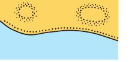
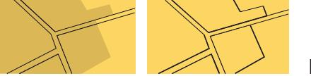
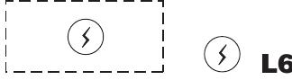
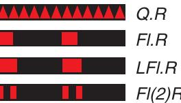
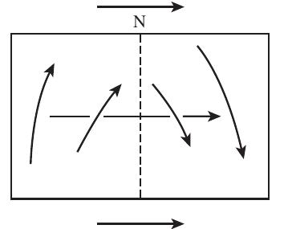

# Regulations of the IHO for International (INT) Charts and

# Chart Specifications of the IHO

Edition 4.9.0 — March 2021

(Publication date: April 2021)

International Hydrographic Organization

Published by the International Hydrographic Organization 4b quai Antoine 1° Principauté de Monaco Tel: (377) 93.10.81.00 Fax: (377) 93.10.81.40 info@iho.int www.iho.int

© Copyright International Hydrographic Organization 2021

This work is copyright. Apart from any use permitted in accordance with the Berne Convention for the Protection of Literary and Artistic Works (1886), and except in the circumstances described below, no part may be translated, reproduced by any process, adapted, communicated or commercially exploited without prior written permission from the Secretariat of the International Hydrographic Organization (IHO). Copyright in some of the material in this publication may be owned by another party and permission for the translation and/or reproduction of that material must be obtained from the owner.

This document or partial material from this document may be translated, reproduced or distributed for general information, on no more than a cost recovery basis. Copies may not be sold or distributed for profit or gain without prior written agreement of the IHO Secretariat and any other copyright holders.

In the event that this document or partial material from this document is reproduced, translated or distributed under the terms described above, the following statements are to be included:

“Material from IHO publication [reference to extract: Title, Edition] is reproduced with the permission of the IHO Secretariat (Permission No ....... /...) acting for the International Hydrographic Organization (IHO), which does not accept responsibility for the correctness of the material as reproduced: in case of doubt, the IHO’s authentic text shall prevail. The incorporation of material sourced from IHO shall not be construed as constituting an endorsement by IHO of this product.”

“This [document/publication] is a translation of IHO [document/publication] [name]. The IHO has not checked this translation and therefore takes no responsibility for its accuracy. In case of doubt the source version of [name] in [language] should be consulted.”

The IHO Logo or other identifiers shall not be used in any derived product without prior written permission from the IHO Secretariat.

# INTERNATIONAL HYDROGRAPHIC ORGANIZATION

# REGULATIONS OF THE IHO FOR INTERNATIONAL (INT) CHARTS AND CHART SPECIFICATIONS OF THE IHO

- PART A REGULATIONS OF THE IHO FOR INTERNATIONAL (INT) CHARTS SECTIONS 100-600
- PARTB = CHART SPECIFICATIONS OF THE IHO MEDIUM AND LARGE-SCALE NATIONAL AND INTERNATIONAL (INT) CHARTS (SCALES LARGER THAN 1:2 MILLION) SECTIONS 100-600
- PART C CHART SPECIFICATIONS OF THE IHO SMALL-SCALE INTERNATIONAL (INT) CHARTS (SCALES 1:2 MILLION AND SMALLER) SECTIONS 100-500

Published by the International Hydrographic Organization 4b quai Antoine 1° Principauté de Monaco Tel: (377) 93.10.81.00 Fax: (377) 93.10.81.40 E-mail: info @iho.int Web: www.iho.int

Web: www.iho.int

Edition 4.9.0

March 2021

S-4

Page intentionally left blank

# PREFACE

The publication S-4 (previously M-4) ‘Regulations of the IHO for International (INT) Charts and Chart Specifications of the [HO, includes:

- ¢ Part A: ‘Regulations of the IHO for International (INT) Charts’
- Part B: ‘Chart Specifications of the IHO for Medium- and Large-scale National and International (INT) Charts’
- Part C: ‘Chart Specifications of the IHO for Small-Scale International (INT) Charts’

The three Parts of S-4 are further subdivided into Sections dealing with specific topics. Regulations and Specifications relating to particular topics may be found either by their subject matter in the Contents page at the beginning of each Section, or by reference to column 5 of INT | for Part B and the index for Part C. Cross referencing draws attention to related Regulations, Technical Resolutions and Specifications.

This publication was developed and maintained by the IHO’s Chart Standardization Committee to 2003. Its maintenance is now the responsibility of the Nautical Cartography Working Group (NCWG), to which comments and corrections should be advised.

The procedures for correcting and updating S-4 are described in the Introduction to each Part. The adoption of a digital format (from Edition 3.000 in 2005) has eliminated the need for extensive hand-corrections, as updated sections or sub sections will be posted on the IHO web-site whenever amendments come into force. Whenever such an update is made, a new version of S-4 will be made available on the web-site.

Initially, the edition number at the foot of each page was followed by a version number to the right of the full stop, which was increased by one whenever an updated version of S-4 was produced. From 2011, version control numbering to identify changes (#) to IHO technical standards and specifications, including S-4, was standardized as:

as:

|  |  |
| --- | --- |
| New Editions denoted as | n.0.0 |
| Revisions denoted as n.n.0 | |
| Clarifications denoted as | n.n.n |

An explanation of these terms can be found in IHO Resolution 2/2007. The Record of Updates at the beginning of Parts A and C, and at the beginning of each section of Part B, provides a history and summary of changes, excluding minor editorial corrections.

Previously, Part A had a ‘draft’ edition in 1981, a ‘first’ edition in 1984 and a ‘second’ edition when incorporated into M-4 in 2000; Part B (originally MP-004, later simplified to M-4) had a ‘preliminary’ edition in 1981 and a ‘first’ edition in 1988; Part C had a ‘first’ edition in 1970 and a ‘second’ edition when incorporated into M-4 in 2001. M-4 was reissued in 2005 in a completely new format; to avoid confusion, this was numbered Edition 3.000. In 2010, a completely new section on Chart Maintenance (B-600) was added, issued in S-4 Edition 4.000. The next update, issued in 2011, was denoted as a ‘revision’ and introduced the new style of version control numbering; it was therefore numbered 4.1.0. A complete revision cycle of S-4 Part B was completed in 2014 by the Chart Standardization and Paper Chart Working Group with the publication of a completely updated and revised Section B-500 in edition 4.5.0.

This publication should be available in separate English, French and Spanish versions. The numbering system is identical in all three versions.

INT 1, INT 2 and INT 3 are reference documents supplementary to Parts B and C of S-4. A cross reference to the relevant S-4 specification and symbol is provided in INT | (column 5).

Edition 4.9.0

March 2021

### S-4

Page intentionally left blank

Edition 4.9.0

March 2021

### Regulations of the IHO for INT Charts

# PART A

# SECTIONS 100 - 600

# REGULATIONS OF THE IHO

FOR INTERNATIONAL (INT) CHARTS

<!-- Unhandled category: FigureCaption -->
S-4 Part A
Page intentionally left blank

### Regulations of the IHO for INT Charts

# CONTENTS

INTRODUCTION

RECORD OF UPDATES

# SECTION 100 - GENERAL

- A-101 PURPOSE OF INTERNATIONAL CHARTS
- A-102 INTERNATIONAL CHARTING PRINCIPLES
- A-103 DEVELOPMENT OF INTERNATIONAL CHARTS
- A-104 INTERNATIONAL CHART TERMS

# SECTION 200 - SCHEMES OF INTERNATIONAL CHARTS

- A-201 SCHEMES
- A-202 SCHEMING PRINCIPLES
- A-203 PRODUCERS
- A-204 CHART NUMBERING

# SECTION 300 - SPECIFICATIONS FOR INTERNATIONAL CHARTS

- A-301 SMALL-SCALE CHARTS
- A-302 MEDIUM- AND LARGE-SCALE CHARTS

# SECTION 400 - MAINTENANCE OF INTERNATIONAL CHARTS

- A-401 GENERAL
- A-402 NEW CHARTS, NEW EDITIONS AND OTHER CHART UPDATES: RESPONSIBILITIES
- A-403 NOTICES TO MARINERS - PROCEDURES
- A-404 REVISED REPRINTS

# SECTION 500 - EXCHANGE OF REPRODUCTION MATERIAL

- A-501 GENERAL
- A-502 DIGITAL REPROMAT
- A-503 ANALOGUE REPROMAT

# SECTION 600 - FINANCIAL ASPECTS

- A-601 ARRANGEMENTS BETWEEN PRODUCERS AND PRINTERS

Edition 4.9.0

March 2021

# Page

<!-- Unhandled category: FigureCaption -->
S-4 Part A
Page intentionally left blank

### Regulations of the IHO for INT Charts

### A v

# Page

# INTRODUCTION

In his opening speech at the second International Hydrographic Conference in 1926, Admiral J M PHAFF, the President of the Directing Committee of the International Hydrographic Bureau (IHB, now IHO Secretariat) at that time, said:

‘In a time-worn and completely forgotten pamphlet which was published in Washington, in 1884, Mr ER KNORR, the Chief Draughtsman of a Hydrographic surveying expedition of the United States of America, had already proposed the issue of original charts and he gave figures showing the enormous economies which could be effected if all the nations which publish charts of the same coast or port were to come to an understanding as to the reproduction of these charts on a common basis. This far-seeing man pleaded also for a permanent international Hydrographic institution, giving numerous examples showing the necessity for its existence, and he states that his proposal to convene an international Conference on the subject succeeded to the extent that two Governments actually came into communication with reference to such convocation.

It required the perspicacity of Monsieur RENAUD (*) to rediscover this same obstacle, which impelled him to write an article on the International Chart which appeared in the French “Annales Hydrographiques” of 1918. Following up this idea, the advantages of an international Conference to discuss the subject came likewise to his mind and, as soon as the support of the British Hydrographer was assured, the first really International Hydrographic Conference, the dream of Mr KNORR, was conceived.

These two Chiefs, both of them professional men, well aware of the intricacies of the subject, did not belittle the enormous difficulties which they would have to overcome.’

The draft IHO Regulations for International Charts were compiled from the reports, agreements and studies of the North Sea International Chart Commission. They were amended and agreed by the Chart Specifications Committee and its successor, the Chart Standardization Committee, and were finally completed in 1984. Thus, 100 years after the publishing of Mr Knorr’s pamphlet, his vision became reality.

The Nautical Cartography Working Group (NCWG) of the IHO Hydrographic Services and Standards Committee (HSSC), formerly known as the Chart Standardization and Paper Chart Working Group (CSPCWG), replaced the Chart Standardization Committee (CSC) and is responsible for the updating of the Regulations. All proposals for changes are referred by IHO Secretariat to the NCWG for advice (IHO Resolution 11/2002 as amended refers). After discussion, the NCWG will recommend amendments to the HSSC for approval. The IHO Secretariat will then communicate them to all IHO Members by Circular Letter, asking for any comments within three months. After three months, in the absence of objections from one or more Members, the IHO Secretariat will announce, by a second Circular Letter, that the amendments have come into force will replace the copy of S-4 on the IHO website with the amended version. If necessary, the proposed amendments will be modified to take account of objections or suggestions received and an explanation will be given in the second Circular Letter. The Record of Updates, which follows this Introduction, will be updated when it is announced that amendments have been approved.

(*) Ingénieur Hydrographe M J A RENAUD was a founder of the IHB, but died just before the election of Directors in May 1919.

Edition 4.9.0

March 2021

<!-- Unhandled category: FigureCaption -->
S-4 Part A
Page intentionally left blank

### Regulations of the IHO for INT Charts

### A vii

# Page

# REGULATIONS OF THE IHO FOR INTERNATIONAL (INT) CHARTS

# RECORD OF UPDATES

| . Regulation umber | S-4 Edition or Amendment Number \_ | | THO Circular Letters | | Remarks |
| --- | --- | --- | --- | --- |
| Promulgated by | | Approved By |
| Draft edition |  | 39/1981 |  | XIIth IH Conference Decision No 25 refers |
| 1984 edition |  | 16/1984 | 34/1984 |  |
| A-204.2 A-204.3 A-204.4 |  | 15/1988 |  | Previously paragraphs 2.9 and 2.10 |
| we 2000 edition |  | 21/2000 |  | New loose-leaf edition - including editorial updating - incorporated as Part A of S-4 |
| Introduction | 1-2003 | 75/2003 |  | CSC replaced by CSPCWG |
| 2005 Edition | 3.000 | 41/2005 |  | New Format |
| S-4 Edition/ Revision/ Clarification |  |  |  |
| A- 402.1 | 4.1.0 | 50/2010 | 69/2010 | | Revised wording |
| A- 401 to A-402 | 4.2.0 | - | - | Duplications with B-601 reduced |
| A-202.1d & A-302.3 | 4.3.0 |  |  | Clarification on not printing on back of charts |
| A-204.2 | 440 | - | - | Reallocation of numbers for polar regions and special charts |
| A-204 | 4.5.0 | 49/2014 | t.b.a. | Splitting allocation of numbers in Regions A and B, the addition of Note 3 on 5-digit INT numbers and other clarifications |
| ‘A-500 | 48.0 | - | - | Completely reviewed by NCWG; revised and updated |
| A-204.8 | 4.9.0 | 02/2021 | 11/2021 | Clarification of region D and E limits and change of Region F coordinator to Italy |

Edition 4.9.0

March 2021

<!-- Unhandled category: FigureCaption -->
S-4 Part A
Page intentionally left blank

### Regulations of the IHO for INT Charts

# SECTION 100

# GENERAL

# A-101 PURPOSE OF INTERNATIONAL CHARTS

- A-101.1 The aim of the international chart concept is to facilitate the provision of minimum sets of charts suitable for the navigational requirements of international (foreign-going) shipping. Such internationally-conceived charts will also enable those IHO Member States who provide, or wish to provide, charts outside their own national waters, to print by facsimile reproduction with only superficial modifications, selected modern charts under the terms of a bilateral arrangement between the Member States [Technical Resolution 7/1919 as amended refers].

# A-102 INTERNATIONAL CHARTING PRINCIPLES

- A-102.1 It is necessary first to be clear about the function of each country’s series of nautical charts of its own waters. Examination of chart catalogues suggests that these charts have two functions:
a. MARINE NAVIGATION. Most hydrographic offices have an obligation to provide nautical chart cover of their national waters to such an extent, and on such scales, as to permit safe navigation!” for all classes of vessel, from the smallest to the largest, throughout coastal waters, including major ports visited by the largest vessels, and minor arms of the sea of purely local interest. In this, the best known sense, nautical charts are navigational tools.
b. INFORMATION SOURCES. National nautical chart series are usually the largest scale publications available showing the detailed configuration of the seabed offshore. In this respect, hydrographic offices have a de facto responsibility for their national waters similar to that of topographic mapping agencies for land areas':*. Such information about the shape of the seabed is required by a variety of national users other than navigators: construction engineers concerned with offshore developments, dredging contractors, oceanographers, defence departments, coastal zone managers, and so on.
- A-102.2 The combined effect of the two requirements has caused national chart series to cover national waters in great detail, reflected by the very large scales used for port plans, and the existence usually of at least two continuous coastal series, one on a relatively large scale, the other slightly smaller. But ships using national chart series do not necessarily use every large-scale sheet along their tracks, especially if the waters are not complex. Coasting along the south coast of England, for example, British mariners often prefer the 1:150 000 second-scale cover to the 1:75 000 series - thereby reducing the number of charts in use and hence the number of position transfers between sheets.
1. Such obligations are specified in numerous Articles of UNCLOS. Article 24, for example, refers to the duty of a coastal state to give publicity to any danger to navigation, of which it has knowledge, within its territorial seas; Article 44 refers similarly to the duty of states bordering straits. For further details, UNCLOS should be consulted.
2. The new draft version of SOLAS Chapter V, to be considered by the IMO Assembly, contains an explicit reference to this obligation.

Edition 4.9.0

March 2021

<!-- Unhandled category: FigureCaption -->
S-4 Part A Section 100 — General
# A am 1 00

Page 2

### Regulations of the IHO for INT Charts

- A-102.3 This concept is the basis of the choice of scale - 1:150 000 or thereabouts - by France and Germany for their largest- scale continuous coastal series of the south coast of England. The use of scales smaller than the largest of the national series, provided they are adequate for navigation, may also be possible for harbours and port approaches - Plymouth and the Solent are examples. Of course, in exceptionally complex areas, such as river mouths like the Schelde, no reduction in the scale of the national series may be desirable.
- A-102.4 Another feature of chart series like those of France and Germany is their concentration on the foreign ports most used by their own vessels. Usually only for such most-frequented ports are large- scale charts of harbours and of the approaches to them included in the series.
- A-102.5 Thus, by judicious choice of port and scale, and by varying the latter according to the complexity of the area, France and Germany are able, in those parts of their chart series which cover foreign waters - where visiting French and German ships are in the role of foreign-going international shipping - to keep the total sizes of their world-wide chart outfits within manageable limits, to the advantage of the shipping using them.
- A-102.6 Another aspect of the economy in the size of such world outfits is the limitation, outside national waters, of the number of Notices to Mariners by which they are kept corrected. The careful selection, in a variety of ways, of the detail on these charts, allows Notices to be restricted to items which are essential to foreign-going shipping. The updating of the outfit is thereby kept to manageable proportions.
- A-102.7 The principles just described formed the basis of the original concept of an international set of medium- and large-scale charts, a set less unwieldy than would be obtained by simply combining existing national chart series in full. From such an internationally-conceived set, all nations who wished to do so could benefit - in the words of Technical Resolution K2.2 (now cancelled), it would “enable those IHO Member States who provide, or wish to provide, charts outside their national waters, to print by facsimile with minimum modification selected modern charts”. By following the principle of producer nations making reproduction material for international charts available to printer nations, the intention was:
a. firstly, to allow countries which do not print charts outside their national waters at present to do so
b. secondly, and more importantly, by sharing the production effort, to make it easier for all countries to keep their charts of foreign waters updated, and thereby to use their resources with greater efficiency, one of the prime needs of hydrographic offices.
- A-102.8 More recently the generation of international charts can provide a basis on which to build Electronic Navigational Chart cover for a nation’s waters, and provides a framework for the agreement of cover suitable for adoption of charts by one nation in another’s waters under the terms of a bilateral arrangement (Technical Resolution 7/1919 as amended refers).

# A-103 DEVELOPMENT OF INTERNATIONAL CHARTS

- A-103.1 The idea of international charts was first advanced formally to the IHO at its 9th Conference in 1967 in a motion put by France and the Netherlands. A resolution of that Conference established the Commission on the International Chart, Small Scales (CICSS). The CICSS devised the limits of two series of small-scale charts covering the whole world - a series of 19 charts at scale 1:10 000 000 and another of 60 charts at scale 1:3 500 000. Specifications for the production of these charts were also drawn up and included as Annex 3 to the report of the Commission, issued by the IHO in 1970. They subsequently became Appendix 1 to the IHO Regulations for International Charts. This appendix was revised and republished as Part C of S-4 in 2003. Production of these small-scale international charts was completed in 1987.

S-4 Part A Section 100 — General

Edition 4.9.0 March 2021

### Regulations of the IHO for INT Charts

- A-103.2 In 1972, the 10th IH Conference resolved that a study be conducted into applying the international concept to medium- and large-scale charts also. The North Sea International Chart Commission (NSICC) was accordingly formed to carry out the study on behalf of the IHO. The NSICC devised a scheme of international charts covering NW Europe and the NE Atlantic; full details were published in the NSICC Report to the 11th IH Conference.
- A-103.3 However, the major task of the NSICC proved to be the production of a comprehensive set of detailed chart specifications for use in preparing international charts at medium and large scales. This work provided the opportunity for considerable advances in the standardization of chart content. This was recognised at the 1977 IH Conference, which constituted a Chart Specifications Committee (CSC) ‘to adapt and extend the specifications for International Charts to cover all navigational charts in the interests of standardization’.
- A-103.4 The CSC modified the NSICC Specifications as necessary to produce the Chart Specifications of the IHO (S-4 Part 1, now re-numbered Part B) which now form the standard for the production of all medium- and large-scale nautical charts, both national and international. Other parts of the NSICC’s work concerned the formulation and operation of various bilateral arrangements between nations relating to international charts. The development of bilateral arrangements covering charts is now covered in Technical Resolution 7/1919 as amended (see A-601).

# A-104 INTERNATIONAL CHART TERMS

- A-104.1 An ‘INTERNATIONAL (INT) CHART? is a chart which:
a. is produced with limits and scale in conformity with an internationally agreed scheme of such charts
b. carries the INT number of that sheet,
c. conforms to the Chart Specifications of the IHO (S-4 Parts B and C),
d. conforms to the Regulations of the IHO for International Charts (S-4 Part A).
- A-104.2 A ‘PRODUCER NATION’ is a Member State of the IHO which undertakes the production of an international chart.
- A-104.3 A ‘PRINTER NATION’ is a Member State of the IHO which uses reproduction material from a producer nation to print an international chart, with only superficial modifications, for inclusion in its own chart series. Bilateral arrangements between IHO Member States covering such charting are the subject of Technical Resolution 7/1919 as amended.
- A-104.4 ‘REPROMAT? is an abbreviation for reproduction material; see A-500.
- A-104.5 ‘NATIONAL WATERS’ is used loosely to include adjacent sea areas normally surveyed by any national hydrographic office.
- A-104.6 ‘BILATERAL ARRANGEMENT? is a formal arrangement between two Member States of the THO, including the detailed financial and administrative arrangements, for charting in each other’s waters. Until bilateral arrangements are in place, or where it is mutually agreed that bilateral procedures are not appropriate or economical, hydrographic offices may operate according to other procedures mutually agreed between them (Technical Resolution 7/1919 as amended refers). Guidelines for bilateral arrangements between hydrographic offices are provided in [HO Circular Letter 48/1995.

# Edition 4.9.0

March 2021

<!-- Unhandled category: FigureCaption -->
S-4 Part A Section 100 — General
Page intentionally left blank

### Regulations of the IHO for INT Charts

# SECTION 200

# SCHEMES OF INTERNATIONAL CHARTS

# A-201 SCHEMES

- A-201.1 Two schemes of small-scale international charts covering the world were developed by the CICSS.
- A-201.2 Schemes of medium- and large-scale international charts are devised by regional groupings of hydrographic offices concerned with particular regions (see A-204.8).
- A-201.3 Details of international chart schemes and of scheming principles are shown in S-11, Guidance for the Preparation and Maintenance of International Chart Schemes and Catalogue of International (INT) Charts:
- Part A Guidance for the Preparation and Maintenance of International Chart Schemes
- Part B Catalogue of International (INT) Charts

# A-202 SCHEMING PRINCIPLES

- A-202.1 Adequacy for international (foreign-going) shipping is the keynote, as explained in A-102.3 to A-102.5. Applying this basic principle, the following detailed guidelines may be followed, inter alia, when devising international schemes:
a. the scales used by hydrographic offices when charting other countries’ waters should be used for guidance in the choice of scales for the international series;
b. wherever possible, sheet limits and scales should be made to conform to those of corresponding charts in the various national chart series, present or projected, which can thereby most readily be modified, or prepared from the beginning, to conform to international specifications or regulations;
c. the need for a separate chart may sometimes be avoided by adding it in modified form as an inset plan to another sheet, in order to reduce the total number of international charts;
d. plans must not be added to the back of an international chart;
e. chart dimensions shall follow the standards laid down in B-222.
- A-202.2 The choice of scales (see A-202.1a) will depend upon the navigational requirements of international shipping. It will usually be possible to identify scale bands which fulfil different types of navigational function, for example coastal navigation. The precise structure of the scheme may vary from area to area, reflecting differing hydrographic circumstances. For example, in the NSICC scheme the continuous coastal series varies in scale between 1:130 000 and 1:350 000, and all the chosen scales are considered adequate for coastal navigation in the areas to which they apply.
- A-202.3 The selection of ports to be covered in the international series should be related to the frequency of use by foreign shipping. Initially, production priority should be given to major ports. The choice of ports will need to be kept under review in the light of new developments, and the scheme adjusted accordingly.
- A-202.4 For more detailed consideration of the principles behind the scheming of international charts and for more detailed guidance, for example, if a consensus cannot be achieved, Guidance for the Preparation and Maintenance of International Chart Schemes (Part A of S-11) should be consulted.

# Edition 4.9.0

# March 2021

S-4 Part A Section 200 — Schemes of International Charts

### Regulations of the IHO for INT Charts

# A-203 PRODUCERS

- A-203.1 Producers of medium- and large-scale international charts will normally be the hydrographic offices with a national responsibility for the waters concerned. However, some special cases may be identified:
a. The allocation of medium scale charts covering more than one nation’s waters should be agreed and preferably shared between the nations concerned: in the interests of efficiency of production a single producer nation should normally be identified for each chart.
- Where for any reason a single producer nation cannot be agreed for an international chart, the nations involved may collaborate on the production of a single international chart which will bear both their official seals (crests).
- If there is a requirement for an international sheet which a national office may not wish to produce, its production may be undertaken by a potential printer nation after discussion and agreement with the national office concerned.
- Where two or more bordering Member States cannot agree on which should produce an international chart of their waters, the limits and scale of which they have agreed, then that international chart should not be prepared until such agreement can be reached.
- Pending agreement as provided for in A-203.1a to A-203.1d, the states concerned, in a spirit of understanding and cooperation, shall make every effort to enter into practical provisional arrangements, including those provided for above, so as not to interfere with the reaching of a final agreement. Such arrangements shall not prejudice the final agreement and shall maintain the regionally approved chart schemes.
- Where an international chart is desired which will cover waters of a nation which is not a member of the IHO, the producer nation will be agreed by the IHO Regional body concerned with international charts. It is not necessary to seek the approval of the non-member nation but consultation on other aspects of charting its waters is recommended.
- The addition or omission of inset plans or the omission of internal detail, on or from international sheets which would otherwise correspond to national charts, may be undertaken by a printer nation but only under the technical terms of a bilateral arrangement agreed with the producer nation concerned (Technical Resolution 7/1919 as amended refers)

NB: Producer nation status for any international chart does not have any political significance.

# A-204 CHART NUMBERING

- A-204.1 The CICSS recommended a numbering system and made a provisional regional allocation of numbers for international charts. Slight adjustment of this allocation was found necessary by the NSICC - see the NSICC Report to the 11th IH Conference. It is recommended that international charts be numbered in accordance with the principles described in the following paragraphs.

S-4 Part A Section 200 — Schemes of International Charts

Edition 4.9.0 March 2021

### Regulations of the IHO for INT Charts

- A-204.2 The blocks of INT numbers allocated to major areas are:

|  | (Note: 1:9 900 000 to 1:1 100 000 | (1:10M smaller) 1:1 000 000 to 1:375 000 \* | 99) 1:350 000 \* and larger |
| --- | --- | --- | --- |
| Region D Region E |  | { 1000 - 1019 { 1030 - 1079 020 - 1029 | 100 - 1118 1300 305 - 1314 400 - 1759 119 - 1299 301 - 1304 315 - 1399 760 - 1799 |
| Part of Region G Central and South Atlantic Region Cl Part of H | 200 - 299 | 080 - 1099 2000 - 2049 2050 - 2074 | 800 - 1999 2100 - 2499 2500 - 2754 |
| Region Part of Region G |  | 2075 - 2099 | 2755 - 2999 |
| Mediterranean & Black Seas Region F | 300 - 399 | 3000 - 3099 | 3100 - 3999 |
| West side of North Atlantic | 400 - 499 |  |  |
| Part of Region A |  | 4030 - 4069, 4090 - 4099 | 4300 - 4999 |
| Part of Region B West side of North Pacific | 500 - 599 | 4000 - 4029, 4070 - 4089 | 4100 - 4299 |
| Region K South Pacific | 600 - 699 | 5000 - 5099 | 5100 - 5999 |
| Region C2 Part of Region L Indian Ocean | 700 - 799 | 6000 - 6029 6030 - 6099 | 6100 - 6299 6300 - 6999 |
| Regions I and J Part of Region H Part of Region L East side of North Pacific | 800 - 899 | 7000 - 7049 7050 - 7074 7075 - 7099 | 7100 - 7499 7500 - 7749 7750 - 7999 |
| Part of Region A Part of Region B |  | 8000 - 8069 8070 - 8099 | 8100 - 8699 8700 - 8999 |
| Polar Regions Region M (Antarctica) | 900 - 929 | 9000 - | 9199 |
| Region N (Arctic) | 930 - 959 | 9200 - 9599 | |
| Special Charts | 960 - 999 | 9600 - 9999 | |

2. The blocks of numbers listed above include numbers already in use.
3. In the event of 4 digits not providing sufficient INT numbers for a region, a 5th digit may be added at the unit end of the existing allocated 4 digit numbers. Alphabetical prefixes or suffixes should not be used.
- A-204.3 Chart numbers with 2 or 3 digits may be allocated only after consultation with the NCWG Secretariat, to permit co-ordination between regions.
- A-204.4 Chart numbers with 4 or 5 digits may be allocated by the Regional Co-ordinators of INT chart schemes, in consultation with other members of their Regional Groups.
- A-204.5 Each block should be sub-divided on a regional basis, for example:

1100 - 1118 Iceland

1300 - 1399 Skagerrak, Kattegat and Baltic entrances

1700 - 1759 English Channel

# Edition 4.9.0

# March 2021

S-4 Part A Section 200 — Schemes of International Charts

### Regulations of the IHO for INT Charts

- A-204.6 Further sub-division by scale within a block is also desirable. For example, the international charts of the west coast of the British Isles are numbered within the following sub-blocks:

|  |  |
| --- | --- |
| Passage / Landfall charts (1:1 000 000 - 1:375 000) | 1060 - 1069 |
| Continuous coastal cover (1:350 000 - 1:130 000) | 1600 - 1629 |
| Larger scales | 1630 - 1699 |

NB: The scale ranges quoted in this example proved convenient in numbering scale groups in this area. Elsewhere, different scale ranges may be more suitable according to the nature of the chart cover.

- A-204.7 It is important that gaps be left within both scale groups and regional groups, in order to provide for future additions to the chart series.
- A-204.8 The following diagram illustrates the international charting regions, details the countries responsible for co-ordinating the international chart schemes in those regions, and lists the relevant Regional Hydrographic Commissions (if any).

<!-- Unhandled category: FigureCaption -->
Note: The names of Member States appearing on the diagram are the co-ordinators of the regional charting schemes.
# REGIONAL HYDROGRAPHIC COMMISSIONS

- US/Canada Hydrographic Commission (USCHC)
- G _ Eastern Atlantic Hydrographic Commission (EAtHC)
- MESO American & Caribbean Sea Hydrographic Commission (MACHC)
- Southern Africa and Islands Hydrographic Commission (SAIHC) H
- South-West Atlantic Hydrographic Commission (SWAtHC)
- ROPME Sea Area Hydrographic Commission (RSAHC) 1
- South-East Pacific Hydrographic Commission (SEPHC)
- North Indian Ocean Hydrographic Commission (NIOHC) J
- North Sea Hydrographic Commission (NSHC)
- K East Asia Hydrographic Commission (EAHC)
- Nordic Hydrographic Commission (NHC)
- South-West Pacific Hydrographic Commission (SWPHC)

# L

- Baltic Sea Hydrographic Commission (BSHC)
- M IHO Hydrographic Committee on Antarctica (HCA)
- Mediterranean and Black Seas Hydrographic Commission (MBSHC)
- N Arctic Regional Hydrographic Commission (ARHC)

# S-4 Part A

# Section 200 — Schemes of International Charts

Edition 4.9.0 March 2021

### Regulations of the IHO for INT Charts

# SECTION 300

# SPECIFICATIONS FOR INTERNATIONAL CHARTS

# A-301 SMALL-SCALE CHARTS

- A-301.1 International charts on scales of 1:2 Million and smaller shall be prepared in accordance with the Chart Specifications of the IHO for Small-Scale International (INT) Charts in Part C.

# A-302 MEDIUM- and LARGE-SCALE CHARTS

- A-302.1 International charts on scales larger than 1:2 Million shall be prepared in accordance with the Chart Specifications of the IHO contained in Part B. These specifications are published for use in compiling medium- and large-scale charts, both national and international. Some paragraphs or sub-paragraphs are applicable only to international charts. These are distinguished by the suffix “I” to the paragraph number, for example B-351.1(I).
- A-302.2 Particular attention is drawn to B-110 which defines various levels of standardization which can be identified throughout the specifications. The intention is to permit some variations between the charting practices of [HO member offices where they would not mislead a navigator, while striving for complete uniformity where essentials are concerned. The depiction of topographic relief is in the first category, as opposed to the definition and use of a submerged rock symbol, which is in the second.
- A-302.3 It is likely that, either temporarily or permanently, there will be national requirements, reflecting a country’s needs or preferences, to introduce minor variations into the specifications. Such factors will inevitably affect the degree of modification which a printer nation is obliged, or chooses, to make to a producer nation’s reproduction material. However, the aim of the international chart concept is to produce a series which is capable of being reproduced with minimum modification, and the importance of producer offices adhering closely to the specifications is obvious. Plans must not be added to the back of an international chart, as some printer nations may be unable to adopt this practice and it would impair their ease of use.
- A-302.4 In general, it should be borne in mind that any publisher has a responsibility to the users of any of his publications, and the ultimate decision as to its contents must be his. In the nautical charting context, hydrographic offices publishing national or international charts, whether as producers or printers, are in this position.
- A-302.5 The following standard reference graphics are supplementary to the Chart Specifications:
a. INT1 Symbols, Abbreviations, Terms used on Charts

Provides the chart user with a key to symbols and abbreviations used on charts compiled in accordance with these specifications. Although it may be used by cartographers as a quick reference, the specifications should always be used for detailed guidance.

b. INT2 Borders, Graduation, Grids and Linear Scales

Shows specimens of the various patterns of border graduation and linear scales.

c. INT3 Use of Symbols and Abbreviations

A standard reference chart of a fictitious area with as many examples as possible of the use of these specifications.

For the latest edition dates, and details of publications related to electronic charts, see the list of IHO publications on the IHO website (go to www.iho.int — Standards & Publications > download IHO Publications).

Edition 4.9.0

March 2021

S-4 Part A Section 300 — Specifications for International Charts

Page intentionally left blank

### Regulations of the IHO for INT Charts

# SECTION 400

# MAINTENANCE OF INTERNATIONAL CHARTS

# A-401 GENERAL

- A-401.1 Chart maintenance is the process of examining relevant data as it is received and taking appropriate action to ensure that all information required for safe navigation is incorporated in the charts in use. Detailed guidance on chart maintenance is given in Part B, Section 600.
- A-401.2 The following terms are used when referring to the issue and updating of charts, and in these Regulations are defined and explained in more detail in B-601:
a. A New Chart (NC) is the first publication of a nation’s chart which may be additional to existing cover and will not usually supersede existing charts on a one for one/ scale for scale basis. (If an existing chart is cancelled by a NC, that chart must no longer be maintained by NM; this should be made clear to all users in the announcement of the NC. Once cancelled, it must not be used, in accordance with SOLAS carriage-compliance).
- . A New Edition (NE) is a new publication of an existing chart, containing changes significant to navigation which will normally have been derived from more recent information. It will usually include changes additional to those previously promulgated in Notices to Mariners (NM). However, it should be noted that parts of the chart may remain unchanged. Exceptionally, a charting authority may issue a New Edition including only Notices to Mariners.

The previous edition must normally be cancelled* and no longer be maintained by NM; this should be made clear to all users in the announcement of the NE. Once cancelled, a previous edition must not be used, in accordance with SOLAS carriage-compliance. (*Note: the sole exception is when promulgating major changes in advance of the implementation date, see B-621).

- A Limited New Edition (LNE) should only be prepared if there is information which needs to be included on a chart quickly, but which cannot be promulgated by Notice to Mariners (NM) or NM Block, because of the geographical extent or complexity of the information, or where there are other reasons to produce a NE to short time scales (see B-601.5). Note that the user may expect a chart to be fully updated to the edition date.
- . A Reprint (also called Revised Reprint, see A-404) is a new print of the current edition of a chart incorporating no amendments of navigational significance other than those previously promulgated in Notices to Mariners (if any). It may, however, contain amendments from other sources provided they are not essential to navigation, noting that previous printings of the current edition of the chart remain in force.
- Notices to Mariners (NM) are used for the prompt dissemination of information which is safety- related or which otherwise needs to be advised to the mariner urgently. They include:
- ¢ Chart-updating (permanent) textual NM.
- ¢ NM block (also called a Chartlet or Patch).
- ¢ Temporary (T) NM.
- ¢ Preliminary (P) NM.
- Miscellaneous notices.

More details are given in B-630 to B-635.

- A-401.3 Charts must be maintained by the issue of New Charts, New Editions and Notices to Mariners (NM). Nations which employ Limited New Edition and/or Revised Reprint in their amendment procedures may also use these for international charts.

# Edition 4.9.0

# March 2021

S-4 Part A Section 400 — Maintenance of International Charts

### Regulations of the IHO for INT Charts

- A-401.4 Each nation, in the role of either producer or printer, will accept responsibility for the operation of a system to ensure adequate maintenance of any international chart included in its national series. The required level of maintenance is determined largely by the rate at which significant new information is received. Receipt of new data is not normally predictable so it is rarely feasible to operate on the basis of regular maintenance programmes. Usually the primary factor that determines the frequency of action is rate of change of the critical data in the chart that affects safety of navigation.

# A-402 NEW CHARTS, NEW EDITIONS AND OTHER CHART UPDATES: RESPONSIBILITIES

- A-402.1 The responsibility for initiating the issue of a replacement New Chart, a New Edition, or other chart update normally rests with the producer nation. Any other IHO Member State receiving data which might give rise to a chart update should immediately pass it to the producer nation for action. [HO Member States should also liaise with their national institutions to obtain relevant data in order to provide it to the appropriate INT Chart Producer Nation for action.
- A-402.2 Producer nations must give advance notification in NMs of their intention to replace an existing chart by New Chart or New Edition (including Limited New Edition). Each printer nation should take appropriate consequential action to keep its adopted national version of the chart in line with the producer’s and will request repromat if required. Alternatively, a bilateral arrangement may be made for the automatic supply of repromat.
- A-402.3 On receipt of a Limited New Edition, a printer nation which does not use that classification may issue the amendment to the adopted version as a New Edition.
- A-402.4 Producer nations must indicate to printer nations those charts whose New Editions include Notices to Mariners only (see A-401.2b).
- A-402.5 Printer nations should arrange with producer nations for the automatic supply of repromat of NM Blocks affecting all charts adopted by the printer nation.

# A-403 NOTICES TO MARINERS - PROCEDURES

- A-403.1 For detailed guidance on the Notice to Mariners (NM) system, see B-630. The issue of NM for international charts must be in accordance with the procedures detailed in A-403.2 to A-403.10 below.
- A-403.2 The promulgation by the various printer nations involved will normally be based on the NM issued by the hydrographic office (HO) who is the designated producer nation of the international chart. For most medium- and large-scale international charts, the producer nation will be the HO with a national responsibility for the waters concerned (see A-203.1).
- A-403.3 Printer nations will arrange with the producer nation for the regular supply of the latter’s NM publications.
- A-403.4 Printer nations, using the NM issued by the producer nation, will each draft a corresponding NM, allocate a national number to it, and quote the producer nation’s NM number as the authority.
- A-403.5 To accelerate the general release of the information, the producer nation will, if possible, supply advance copies or copies of the draft NM to relevant printer nations.
- A-403.6 If the HO with a national responsibility for the waters concerned is not the designated producer nation of the international chart, the producer nation will request that HO to supply at least one copy of the draft NM to the producer who will undertake to forward copies to printer nations. As the first-scale charts in the international series may correspond to the second-scale charts in the national series, it is important that all NMs which affect the national charts one scale step larger than the international chart be supplied. This will ensure that the supply of updating information is comprehensive enough to maintain all essential items on the international chart.

# S-4 Part A

# Section 400 — Maintenance of International Charts

Edition 4.9.0 March 2021

### Regulations of the IHO for INT Charts

- A-403.7 The international chart often serves as the national chart of the area. The producer nation will therefore need to issue NMs to safeguard the navigation of both national users of all types and vessels trading internationally. Printer nations may be concerned to keep updating of paper products by international mariners to manageable proportions. National producer nations may be concerned that all updating information they issue be represented on all versions of their chart whether produced by them or by a printer nation. Procedures for handling producer nations’ NMs by printer nations will be agreed by bilateral arrangement between producer and printer nations. Whatever procedure is agreed, it is recommended that printer nations incorporate the details contained in all NMs issued by the producer nation in any revised reprint or new edition of their national version of the international chart (see A-404.2).
- A-403.8 Normally a printer nation will not issue an NM affecting fundamental hydrographic detail on an international chart without prior consultation with the producer nation. However, exceptionally, a printer has the right to initiate and issue an NM for its version of an international chart if immediate promulgation of critical information is considered advisable. In such cases, the printer nation should ensure that copies (preferably advance copies) are sent to the producer nation, to the HO with a national responsibility for the waters concerned (if different from the producer nation) and to the other printer nations. The HO with a national responsibility for the waters concerned should also be supplied with a copy of the report or data on which the NM is based. All other members of the IHO should similarly pass such data to the producer nation for action, see A-402.1.
- A-403.9 In the list of ‘charts affected’ given in their NM, all nations will quote the international chart number in brackets, adjacent to the national chart number. It is recommended that the number of the previous national NM affecting the chart should also be quoted, see B-631.7.
- A-403.10 In the index to their Notices to Mariners, all nations will quote the international chart number in brackets, adjacent to the national chart numbers which are usually arranged in sequence. In addition, the index section should also include a separate list of international chart numbers, arranged in sequence under the heading “International Charts” and quoting alongside the numbers of the relevant national NMs affecting each international chart.

# A-404 REVISED REPRINTS

- A-404.1 The designated producer nation of an international chart may issue a revised reprint of that chart. The revised reprint should incorporate no amendments of navigational significance, other than those previously promulgated in Notices to Mariners (if any). It may however contain amendments from other sources, provided they are not essential to navigation. Previous printings of the current edition will remain in force. Advance notification in NMs, or elsewhere, of the issue of a revised reprint is not normally provided. Copies, preferably with the changes indicated, should therefore be supplied by producers to printers, without demand. A printer nation noting changes indicated may request updated repromat from the producer.
- A-404.2 Printer nations may also originate a revised reprint of their national version of an international chart. It is recommended that such a revised reprint should incorporate the amendments resulting from all the NMs issued by the producer nation, even if some of these have not previously been re-promulgated by the printer nation (see A-403.7). This will preserve the homogeneous nature of the international chart series while, at the same time, minimising the correctional task placed on the international mariner. If the revised reprint incorporates other revisions not originated by the producer, a copy (preferably with the changes indicated) will be supplied to the producer, in advance of publication.

# Edition 4.9.0

March 2021

S-4 Part A Section 400 — Maintenance of International Charts

Page intentionally left blank

### Regulations of the IHO for INT Charts

# SECTION 500

# EXCHANGE OF REPRODUCTION MATERIAL

# A-501 GENERAL

- A-501.1 Reproduction material (repromat) is material made by the producer nation, from which the chart may be reproduced, without redrafting, in modified facsimile by a printer nation. While it may be in analogue or digital form, it is now more usual, convenient and cost effective to exchange digital repromat.
- A-501.2 Repromat for New Charts, New Editions, Limited New Editions, Reprints and Notice to Mariners Blocks (see A-401.2) is supplied by producers at the request of printers (see A-402.2 and A-404.1). The terms, conditions and procedures for the exchange of repromat, will be established bilaterally between individual producer and printer nations (see A-601). These should consider, but not be limited to:
- ¢ Ordering process or automatic supply.
- ¢ Identification of charts (e.g. INT number, national number).
- ¢ Points of contact.
- ¢ Digital or analogue.
- ¢ Supply method:
- ¢ For digital repromat, see A-502.
- ¢ For analogue repromat: shipping method and packaging (to prevent damage in transit). See also A-503.
- ¢ Acknowledgement of receipt.
- ¢ Financial arrangements if required, see A-600.

# A-502 DIGITAL REPROMAT

- A-502.1 Digital repromat may be in vector (using the Transfer Standard for Digital Hydrographic Data, S-57) or raster format.
- A-502.2 S-57 data is useful for data exchange, but not suitable for paper chart adoptions.
- A-502.3 Raster format is more useful for modified facsimile ‘adoptions’ of paper charts, as this includes the cartographic elements (chart framework, text placement) which is not included in S-57. Ideally, each colour layer should be a separate file, the file format (for example Tagged Image Format - TIF) and resolution (for example minimum 600 dpi) as agreed between producer and printer.
- A-502.4 Digital repromat can be supplied via File Transfer Protocol (FTP) or for small NM blocks as an email attachment. The repromat should be accompanied by an image of the complete chart, for example in Portable Document Format (PDF).

# A-503 ANALOGUE REPROMAT

- A-503.1 The producer nation shall ensure that the repromat being provided to another nation meets certain minimum standards given below. These represent a minimum specification and should permit the producer nation to use its normal work materials and procedures.
- A-503.2 Material Characteristics: Analogue repromat will be prepared on stable base plastic or film. The size of the repromat will not vary from the computed chart size by more than + 0,5 mm over the longest dimension of the chart graticule.

# Edition 4.9.0

# March 2021

S-4 Part A Section 500 — Exchange of Reproduction Material

### Regulations of the IHO for INT Charts

- A-503.3 Image Quality: Repromat images will be precise and free of blemishes and holes, so as not to require opaquing or other touch-up work.
- A-503.4 Amount and Form of Material: The most appropriate form and amount of repromat will be agreed as part of the bilateral arrangements between producer and printer nations. Repromat will be in negative or positive form depending upon the printing processes used by the nations concerned. The repromat will be accompanied by a copy of the chart itself (see A-502.4).

S-4 Part A Section 500 — Exchange of Reproduction Material

Edition 4.9.0 March 2021

### Regulations of the IHO for INT Charts

# SECTION 600

# FINANCIAL ASPECTS

# A-601 ARRANGEMENTS BETWEEN PRODUCERS AND PRINTERS

- A-601.1 The exchange of reproduction materials required for the reproduction of international charts as resolved in Technical Resolution 7/1919 as amended should be arranged between the producer nations and printer nations, with the financial terms and conditions as agreed by bilateral arrangement.
- A-601.2 Financial arrangements should be made that will encourage and not inhibit the early development of a set of worldwide international charts.
- A-601.3 There is no obligation for a financial exchange between printers and producers. Arrangements should be made between the parties.
- A-601.4 The price of a printer’s chart should be determined when the arrangement is reached between the producer and printer nations. It is recommended that the normal pricing policy should be that the price of a printer’s chart should not be less than that of similar charts in his own national series.

Edition 4.9.0

March 2021

S-4 Part A Section 600 — Financial Aspects

Page intentionally left blank

Edition 4.9.0

March 2021

# Chart Specifications of the IHO

Medium and Large-scale Charts

### B

# PART B

# SECTIONS 100 - 600

CHART SPECIFICATIONS OF THE IHO

MEDIUM AND LARGE-SCALE

NATIONAL AND INTERNATIONAL (INT) CHARTS

(SCALES LARGER THAN 1:2 000 000)

S-4 Part B Section 100 — General

Page intentionally left blank

# Chart Specifications of the IHO

### B

Medium and Large-scale Charts

# INTRODUCTION

Part B of S-4 ‘Chart Specifications of the IHO for Medium and Large scale National and International charts’ is in six sections, the contents of which are:

- 100 GENERAL
- 200 CHART FRAMEWORK
- 300 TOPOGRAPHY
- 400 HYDROGRAPHY AND AIDS TO NAVIGATION
- 500 TEXT: LANGUAGE, NUMBERS, NAMES, TYPE STYLES
- 600 CHART MAINTENANCE (INCLUDING THE NOTICE TO MARINERS SYSTEM)

The conventions used in the Specifications, and other general matters, are explained in Section B-100, which should be read before consulting the other Sections.

Updating of these Specifications is effected by changes announced in the IHO’s Circular Letters. The procedures by which changes are initiated, discussed and promulgated are described in B-160. If an IHO Member State finds it necessary to adopt a new specification or use a new symbol for a feature for which there is no existing symbol, the Member should advise the IHO Secretariat of the action taken at the earliest opportunity with a view to its consideration for possible incorporation in these Specifications (IHO Resolution 11/2002 as amended).

The Record of Corrections, at the beginning of each Section, should be updated when it is announced that changes have been approved.

Charts affected: These Specifications (apart from a few paragraphs suffixed ‘I’ for example B-351.1(1), which apply only to international charts) are applicable to all large- and medium-scale charts, national and international. Members producing or printing international charts should also consult Part A ‘Regulations of the THO for International Charts’ and, if concerned with charts on 1:2 000 000 or smaller scale, Part C, which gives specifications for small-scale international charts.

Acknowledgement. Symbology is partially reproduced from Admiralty Chart 5011 (based on INT 1 originally produced by Germany) by permission of the Controller of Her Majesty’s Stationery Office and the UK Hydrographic Office.

Edition 4.9.0

March 2021

S-4 Part B Section 100 — General

Page intentionally left blank

Edition 4.9.0

March 2021

# Chart Specifications of the IHO

Medium and Large-scale Charts

# PART B

# SECTION 100

# GENERAL

S-4 Part B Section 100 — General

Page intentionally left blank

### Chart Specifications of the IHO Medium and Large-scale Charts

# SECTION 100 - GENERAL

# CONTENTS

RECORD OF UPDATES

- B-100 CHART SPECIFICATIONS OF THE IHO FOR MEDIUM- AND LARGE-SCALE NATIONAL AND INTERNATIONAL (INT) CHARTS
- B-101 SPECIFICATIONS: ORIGIN AND PRINCIPLES
- B-102 PURPOSE OF THE SPECIFICATIONS
- B-103 SCOPE OF THE SPECIFICATIONS
- B-104 CONSISTENCY BETWEEN CHART PRODUCTS
- B-110 STANDARDIZATION LEVELS
- B-120 TERMS AND CONVENTIONS USED IN THE SPECIFICATIONS
- B-121 TRANSLATION TERMS
- B-122 INTERNATIONAL ABBREVIATIONS
- B-123 TERMS FOR COLOURS
- B-124 SPECIFICATIONS FOR INTERNATIONAL CHARTS
- B-125 DEPICTION OF SYMBOLS
- B-126 TERMS FOR CHART SCALES
- B-127 LINE WEIGHTS AND DASHED LINES
- B-128 TERMS USED WHEN ISSUING CHARTS
- B-130 UNITS
- B-131 GEOGRAPHICAL POSITIONS
- B-132 BEARINGS: CONVENTIONS
- B-133 TEXT STYLES (FONTS)
- B-140 USE OF COLOUR
- B-141 BLACK
- B-142 MAGENTA
- B-143 BUFF (YELLOW) OR GREY
- B-144 BLUE
- B-145 GREEN
- B-146 CAUTIONARY NOTES - COLOUR
- B-147 COLOUR PRINTING
- B-150 ASSOCIATED PUBLICATIONS
- B-151 INT 1 — SYMBOLS, ABBREVIATIONS, TERMS USED ON CHARTS
- B-152 INT 2— BORDERS, GRADUATION, GRIDS AND LINEAR SCALES
- B-153 INT 3 — USE OF SYMBOLS AND ABBREVIATIONS
- B-160 UPDATING SYSTEM FOR THE SPECIFICATIONS
- B-170 NOT CURRENTLY USED

# Edition 4.9.0

March 2021

S-4 Part B Section 100 — General

Page intentionally left blank

### Chart Specifications of the IHO Medium and Large-scale Charts

# SECTION 100 - GENERAL

# RECORD OF UPDATES

| Specification Number | S-4 Edition or Amendment Number | | THO Circular Letters | | Remarks |
| --- | --- | --- | --- | --- |
| Promulgated by | | Approved By |
| Section 100 Preliminary Edition |  | 9/1982 |  | Adopted by 1982 Conference, Decision No. 23 |
| B-130 | 1/1985 | 30/1985 | 4/1986 |  |
| B-131 | 1/1985 | 30/1985 | 4/1986 |  |
| B-130/B-131 |  |  |  | Included in Cumulative Correction No. 1-1986 |
| B-130 |  | 6/1987 |  | Corrected typing error in Cumulative correction No. 1/1986 |
| B-160 |  |  |  | Amended by 1987 Conference, Decision No. 24 |
| B-170-B-179 | 1/1987 | 16/1987 | 27/1987 |  |
| Section 100 1988 Edition |  |  |  | New loose-leaf edition -- including editorial updating. |
| B-128 | 1/1990 | 47/1990 |  | New specification |
| B-101 | 1/2003 | 75/2003 |  | CSC replaced by CSPCWG |
| B-160 | 1/2003 | 75/2003 |  | CSC replaced by CSPCWG |
| Section B-100 2005 Edition | 3.000 | 41/2005 |  | New Format |
| Section B-100 | 3.001 | 1272005 | | 572005 | [Completely reviewed by CSPCWG; revised and updated |
| . Section B-100 | 3.002 | 40/2005 | 96/2005 | Former Sections B-170 to B-178 moved to B-290 to B-298 |
| B-122.1 | 3.005 | 27/2008 |  | List inserted |
| B-147 | 3.005 | 58/2007 | 107/2007 | | New specification |
| B-51 | 3.007 | 105/2008 | 23/2009 | Revised to take account of cancellation of Technical Resolution K1.1 and publication M-15 |
|  | S-4 Edition/ Revision/ Clarification |  |  |  |
| B-122.1 | 4.1.0 | 27/2008 | 76/2008 | Prod Well marked as obsolescent |
| B-125.1 & .2 | 4.1.0 | 56/2010 | 03/2011 | New specifications |
| B-128 | 4.2.0 | - | - | Duplication with B-601 reduced |

B-100.4

43.0

# Clarification on primary purpose of nautical

# charts

B-120.2

4.3.0

# Clarification on ISO 80 000

B-120.6

44.0

# Clarification on obsolete or obsolescent symbols

Edition 4.9.0

# S-4 Part B

March 2021

Section 100 — General

### Chart Specifications of the IHO Medium and Large-scale Charts

| Specification Number | S-4 Edition or Amendment Number | | IHO Circular Letters | | Remarks |
| --- | --- | --- | --- | --- |
| Promulgated by | | Approved By |
| B-125.3 | 44.0 | - | - | Position of symbols: transferred from B-305 |
| B-127 | 4.4.0 | - | - | Clarification on the use of black continuous lines |
| B-133 | 44.0 | - | - | Clarification on text styles |
| B-100.5 | 4.5.0 | 58/2013 | 32/2014 | New specification |
| B-120.2 | 4.5.0 | - | - | Clarification on use of full stops |
| B-122.1 | 4.5.0 | - | - | Removal of abbreviations IQ and IVQ |
| B-160 | 4.5.0 | - | - | Clarification of revised updating process |
| B-104 | 4.6.0 | 92/2015 | 15/2016 | New specification |
| B-122.1 | New abbreviation ‘accom’ |
| B-152 - B-153 | Revised specifications |
| B-122.1 | 4.7.0 | 17/2017 | 42/2017 | New abbreviations ‘fm’, ‘fms’, ‘man’, ‘Sg’ |
| B-140 |  |  | Revised specification |
| B-142.3 |  |  | Revised specification |
| B-142.4 |  |  | New specification |
| B-146 |  |  | Revised specification |
| B-151.2 |  |  | Additional retired INT1 numbers. |

S-4 Part B Section 100 — General

Edition 4.9.0 March 2021

### Chart Specifications of the IHO Medium and Large-scale Charts

# SECTION 100

# GENERAL

# B-100 CHART SPECIFICATIONS OF THE IHO FOR MEDIUM- AND LARGE- SCALE NATIONAL AND INTERNATIONAL (INT) CHARTS

- B-100.1 S-4 Part B provides an internationally-agreed product specification, for both national and international (INT) charts, at medium- and large-scale.
- B-100.2 When S-4 Part B was originally prepared, the term ‘charts’ actually referred to paper, sometimes called analogue, charts; digital, sometimes called electronic, charts were yet to become a viable reality. (See B-103.4 for more detailed definitions of different types of digital charts).

The subsequent development of digital charts presented additional Specification requirements, which were met by the development of S-52 and the Electronic Navigational Chart (ENC) Product Specification within S-57 for vector charts, and S-61 for raster charts. Both S-52 and S-57 make full use of the background information already contained in S-4 Part B and include cross-references where appropriate. Similarly, adjustments have been made to S-4 Part B, to reflect better the existence and content of digital (vector) charts.

# B-100.3 The role of S-4 Part B is therefore twofold, in that it provides:

a. An explanation of the general concepts and rationale behind the portrayal of features on charts, much of which is relevant to both electronic and paper charts.
b. A contemporary community specification for paper charts, including the use of text and symbology.
- B-100.4 The primary purpose of nautical charts is to provide the information required to enable the mariner to plan and execute safe navigation. In constructing charts and selecting content it is therefore important to understand the mariner’s need for appropriate, relevant, accurate and unambiguous information. Particular care must be exercised to avoid errors and the creation of situations where the mariner may be faced with too much information (chart clutter) or irrelevant information which causes confusion or distraction. (See B-102 for associated extracts from SOLAS regulations.)

Additional information to suit non-navigational requirements (for example: sub-surface operations (military, research, fishing etc); natural resource exploitation; recreation; port development; international boundaries and national limits) may be included on nautical charts if considered useful or necessary by the producing authority. On paper charts, the cartographer’s expertise in design and selection, biased towards safety, is essential to achieve the required clarity. The format of electronic charts may allow detail additional to that shown on the paper chart, specific to navigation using Electronic Chart Display and Information Systems (ECDIS), to be included. However, irrespective of format, additional information must not be added at the expense of clear portrayal of navigationally significant information.

- B-100.5 Compilation procedure: largest scale first. The mariner requires charts to be consistent throughout the scales, at least for essential data content; this is called ‘vertical consistency’. For this reason, as far as possible, the original compilation and subsequent updating of charts, whether by Notice to Mariners or new edition (see section B-600), should proceed from the largest scale, through the series, to the smallest scale. In practice, this is best achieved by compiling from original source data into the largest scale chart and then compiling the next smaller scale using the largest scale chart as source, and so on to the smallest scale appropriate for the data type.

# Edition 4.9.0

March 2021

<!-- Unhandled category: FigureCaption -->
S-4 Part B Section 100 — General

# Chart Specifications of the IHO

Medium and Large-scale Charts

Within a series of different scale charts covering the same location, chart content in terms of its cartographic detail and resolution is greatest at the largest scale. At smaller scales, detail must be generalized, with only a selection of the available source data (including soundings) being portrayed, so that the information which is selected is clearly presented. This selection is based upon the significance of the information to the mariner and the purpose of the chart (see B-300.3 and B-403). This will ensure that the charts are vertically consistent; consequently, any sounding on the smallest scale chart will also be present on the largest scale.

Updating. Vertical consistency also benefits hydrographic offices by simplifying the task of updating all charts covering the same location when new data is received. Note also that B-620.2 states that “where differences exist between charts, the largest scale national and, where appropriate, INT chart is accepted as the authoritative document and must therefore be given priority for updating’.

# B-101 SPECIFICATIONS: ORIGIN AND PRINCIPLES

The Specifications for charts at medium- and large-scale were originally compiled by two groups of member nations of the IHO, forming successively, the North Sea International Chart Commission (NSICC, 1972-1977) and the Chart Specifications Committee (1977-1982). At the XIIth International Hydrographic (IH) Conference (April 1982) the Chart Specifications Committee was renamed the Chart Standardization Committee (CSC) and following the XVIth IH Conference (April 2002) the CSC was replaced by the Chart Standardization and Paper Chart Working Group (CSPCWG) in 2003 which was renamed Nautical Cartography Working Group (NCWG) in 2015. The NCWG is a working group of the IHO Hydrographic Services and Standards Committee (HSSC), and has a number of functions, one of which is the responsibility for updating these Specifications.

- B-101.1 The working procedure followed in the initial compilation of the Specifications was, firstly, the establishment of guidelines for each section by UK, which provided the Secretariat. Preliminary drafts were prepared by France (500), Germany (300), Netherlands (200), UK (100, part 400, 600) and USA (part 400). These were subsequently reviewed by NSICC and CSC members. Comments were reconciled as far as possible and preliminary editions of each Section were published between 1979 and 1982. The CSPCWG completed a full review and update of the specifications in 2014.

S-4 Part B Section 100 — General

Edition 4.9.0 March 2021

### Chart Specifications of the IHO Medium and Large-scale Charts

- B-101.2 Basic compilation principles followed by the NSICC and CSC in compiling the Specifications were:
a. The starting point was the former Technical Resolutions on charted detail (M-3 Chapter B), now mostly cancelled; but these covered only about one-third of the full range of features to be found on charts.
b. The charting practices of a wide range of IHO members were reviewed by examining their symbols and abbreviations guides and their latest charts.
c. Change for its own sake was avoided.
d. The need was recognized to ensure that each separate item fitted logically into a consistent whole.
e. Self-explanatory symbols were preferred to legends requiring translation.
f. Innovations, i.e. symbols not appearing in any national chart, were introduced when necessary.
g. The effects of new automated drafting techniques were borne in mind, but greatest weight was given to the realities of the existing approach to charting of most IHO members.
h. The layout of each group of items as shown by the Table of Contents follows the principle of working from the general to the particular.
- B-101.3 A general review of the Specifications was proposed by the CSC Chairman at the XVth IH Conference in 1997, to include developments which had taken place since the Specifications were first written, together with those identified as a result of the development of digital charts. This review was completed in 2014.

# B-102 PURPOSE OF THE SPECIFICATIONS

The Chart Specifications of the IHO, S-4 Part B, are intended to provide a framework for the standardization by member nations of all nautical charts at medium- and large-scale, both in their national series and in the international (INT) series of the IHO. They must be used in all such chart compilation as far as nautical practices and requirements permit.

Regulation 2 (Definitions) of Chapter V (Safety of Navigation - as amended 2000) of the International Convention on Safety of Life at Sea 1974 (SOLAS 1974) states:

“Nautical chart or nautical publication is a special-purpose map or book, or a specially compiled database from which such a map or book is derived, that is issued officially by or on the authority of a Government, authorized hydrographic office or other relevant government institution and is designed to meet the requirements of marine navigation.*”

“* Refer to appropriate resolutions and recommendations of the International Hydrographic Organization concerning the authority and responsibilities of coastal States in the provision of charting in accordance with regulation 9.”

Edition 4.9.0

March 2021

S-4 Part B Section 100 — General

### Chart Specifications of the IHO Medium and Large-scale Charts

- B-102.1 The IHO has striven to increase standardization since its inception. Standardization is desirable for navigators who may need to use the charts of two or more nations, in order that transfers from chart to chart can be made without unnecessary hazard or confusion. A high level of standardization is essential for the international chart concept, which may also provide a basis on which to build digital cover (see A-102.8).

Regulation 9 (Hydrographic Services) of Chapter V (Safety of Navigation — as amended 2000) of SOLAS 1974 states that Contracting Governments undertake:

‘to co-operate in carrying out, as far as possible, the following nautical and hydrographic services ... to prepare and issue nautical charts ... and other nautical publications, where applicable, satisfying the needs of safe navigation ...’

“... to ensure the greatest possible uniformity in charts and nautical publications and to take into account, whenever possible, relevant international resolutions and recommendations.*’

“* Refer to the appropriate resolutions and recommendations adopted by the International Hydrographic Organization.”

and:

‘to co-ordinate their activities to the greatest possible degree in order to ensure that hydrographic and nautical information is made available on a world-wide scale as timely, reliably, and unambiguously as possible.’

- Complete standardization has not yet been achieved. However, as digital charts become more widely used, the more stringent requirements that they present may in themselves serve to accelerate the move to standardization. (It should be noted that, in the electronic world, many variations which may not confuse the mariner would confuse the computer.) The Specifications attempt to distinguish between the fundamental elements of a chart, where standardization is of great importance, and those features where variation would not mislead a navigator. B-110 defines the various levels of standardization which can be identified throughout the Specifications.

B-102.2

# B-103 SCOPE OF THE SPECIFICATIONS

- B-103.1 Scale of charts covered by the Specifications. These Specifications (S-4 Part B) apply to medium- and large-scale charts, i.e. scales 1:2 000 000 and larger.

Smaller-scale charts (1:2 000 000 and smaller) are covered by the Chart Specifications of the IHO for Small-scale International (INT) charts; see S-4 Part C.

Note: Charts at scale of 1:2 000 000 may be considered to be either Medium-scale charts or Small- scale charts according to the nature of charting in that specific area. Such charts should be compiled in accordance with the Specifications which are appropriate to the purpose of the chart.

- B-103.2 General content of charts. The standardization of nautical charts is a more profound matter than the adoption of a standard set of symbols and abbreviations. One requirement is agreement on the place of charts in the full range of navigational documents, and on the extent to which a nautical chart is the appropriate medium for particular categories of information, for example tidal data. As a general principle, nautical charts should show as much relevant navigational detail as can be clearly represented in graphical form. Another requirement is agreement on the definition, and real significance to chart users, of the individual features charted.

S-4 Part B Section 100 — General

Edition 4.9.0 March 2021

### Chart Specifications of the IHO Medium and Large-scale Charts

- B-103.3 Detailed content of charts. The Specifications are intended to be as comprehensive as possible, covering every aspect of chart content and endeavouring to provide a groundwork of reasoned argument to support the rules and recommendations made. Detailed as the Specifications are, they cannot provide a complete and automatic answer to all the questions the chart compiler may ask as they will not always easily fit into a system of cartographic rules. However, the introductory paragraphs in many of the separate Specifications will allow cartographers to see the underlying intention and deal with anomalous features satisfactorily.
- B-103.4 Digital charts fall into two main categories: raster and vector. As raster digital charts directly reflect the content of the paper chart, they do not require further mention in these Specifications. Specifications for raster charts are detailed in the IHO publication S-61 (Product Specification for Raster Navigational Charts (RNC)). The term digital in these Specifications (S-4 Part B) is therefore used to refer to vector digital charts. The specific guidance necessary for vector digital charts is provided by IHO publications S-52 (Specifications for Chart Content and Display Aspects of ECDIS) and the ENC Product Specification contained within S-57 (IHO Transfer Standard for Digital Hydrographic Data).
- B-103.5 Charts for small craft. Charts designed especially for use by small craft should follow these Specifications for the compilation of charts as far as possible.

# B-104 CONSISTENCY BETWEEN CHART PRODUCTS

Providing consistent information for the same geographic location in corresponding paper charts and ENCs is critical to maintaining the mariner’s confidence in using these different nautical chart products, particularly when both products may be used on the same bridge. For paper charts and ENCs to be considered ‘consistent’, all information that the hydrographic office considers significant to navigation must be included on both products. This information must be presented on each product in a manner that will ensure the mariner interprets the information similarly, regardless of the different structure and format of the products. When navigationally significant information is updated, changes must be applied to both the paper chart and ENC as simultaneously as the differing chart updating methods used for each product allow (see B-600).

Edition 4.9.0

March 2021

S-4 Part B Section 100 — General

Page intentionally left blank

### Chart Specifications of the IHO Medium and Large-scale Charts

### B-110 Page 1

# B-110 STANDARDIZATION LEVELS

Standardization is the IHO’s ideal and much progress has been made since 1972, to the benefit of chart users. Increasing numbers of International charts are now available; these may provide a basis on which to build digital cover, and also provide a framework for the agreement of cover suitable for adoption of charts by one nation in another’s waters under the terms of bilateral arrangements (see S-4 Part A-104.6 and Technical Resolution 7/1919 as amended).

Despite this, complete standardization is unlikely to be achieved between all member nations even on new charts, for good reason, as some aspects of their existing cartographic practice may be of unusual significance. Standards are set in some cases to encourage uniformity rather than enforce it, and consequently such terms as ‘should’ and ‘may’ sometimes occur in the Specifications where it is unlikely that variations from the recommended practice will be misleading, as in the depiction of topographic relief. Complete uniformity is, however, a desirable objective in the case of essentials, for example the definition and use of a submerged rock symbol, and the use of ‘must’ within these Specifications conveys this sense. Publication of S-52 and S-57 for digital charts, much of which is prescriptive, may tend to lead to more prescriptive specifications for paper charts.

As new symbols are added to S-4, a precise specification in respect of dimensions, line weights and colours, etc, will be provided, in the interests of standardization. Symbols without such precise specifications are illustrative only.

It is important to recognize that, in these Specifications, standardization operates on a number of different levels in the various sections, as detailed below.

- B-110.1 Standardization of certain fundamentals, particularly units of measurement and horizontal and vertical datums, is incomplete between nations. It is recommended that nations revising their chart cover will take the opportunity to make any of the necessary changes required for standardization. S-57 includes numerous mandatory requirements, for example times must be referred to UTC; depth, height and positional accuracy units must be metres; horizontal datum of reference must be WGS 84. It is hoped, in the light of this, that standardization of such fundamentals can be achieved in time.
- B-110.2 Standardization of chart scales and limits of International charts is covered in S-4 Part A (Regulations of the IHO for International (INT) Charts), and in S-11 (Guidance for the Preparation and Maintenance of International Chart Schemes and Catalogue of International (INT) Charts); it is therefore outside the scope of these Specifications (S-4 Part B). Regional or international agreement on chart scales and limits is part of the concept of international charts at medium- and large-scales. Such considerations will probably influence national chart scheming.
- B-110.3 Standardization of chart sizes and formats, including the more general aspects of chart design and content, is dealt with in B-200.

Edition 4.9.0

March 2021

S-4 Part B Section 100 — General

### Chart Specifications of the IHO Medium and Large-scale Charts

- B-110.4 Standardization of symbols and abbreviations in B-300 and B-400 constitutes the largest part of these Specifications, affecting the majority of chart content. It must be preceded by agreement on the meaning, for charts, of the terms used: for example there are various interpretations of ‘restricted area’, ‘route’, ‘track’, ‘pilot station’, ‘tidal stream’. For this reason, many paragraphs start with explanations and definitions. Concise explanations of terms may also be found in the IHO’s Hydrographic Dictionary (S-32) and in the case of digital charts, S-57, which includes the relevant references to S-4 Part B paragraph numbers and to INT | symbols for most object classes. S-57 also includes for each object class, a concise definition taken from a variety of sources including S-4, S-32 and various other publications.

The degree of generalization appropriate to smaller-scale charts varies considerably with the relative significance to the mariner of features in the area in question; these Specifications necessarily cover this aspect in a rather general way.

Agreement on features included or excluded cannot be easily achieved in a small number of cases, particularly where a nation has a different dividing line from other nations between whether information be shown on charts or in other publications. For instance, many nations indicate restricted areas (such as anchoring prohibited areas, cable areas, and exercise areas) by the symbology in B-400; some choose to omit such details from their charts, preferring to provide it in other publications such as Sailing Directions. These Specifications are designed to take such differences into account.

- B-110.5 Standardization of language and names in B-500 conforms to relevant international cartographic practice. General guidelines are given on the use of type styles. With the purpose of obtaining uniformity in the coding of country names, the [HO has agreed to use the two-letter (alpha-2) codes of the International Organization for Standardization (ISO) as published in their International Standard ISO 3166 (see Technical Resolution 1/1995 as amended).

S-4 Part B Section 100 — General

Edition 4.9.0 March 2021

### Chart Specifications of the IHO Medium and Large-scale Charts

# B-120 TERMS AND CONVENTIONS USED IN THE SPECIFICATIONS

- B-120.1 Conventions used in writing the Chart Specifications of the IHO for National and International charts are detailed below.

# B-120.2 Punctuation

- ¢ Decimal places are indicated by commas, for example 0,1mm
- ¢ Commas are not used to separate thousands, for example 150 000 not 150,000
- ¢ No spaces are used between figures and abbreviations for units, for example 5m not 5 m (this is an exception to ISO 80 000)
- ¢ No full stop after abbreviations (unless at end of sentence, separating seabed qualities or in light descriptions)
- ¢ Single quotation marks are used except where quotations occur within quotations, when double marks are used around the inner quote
- ¢ Single quotation marks are used around abbreviations in the text, but not around abbreviations in graphics.

# B-120.3 Terminology

- ¢ ‘Dashed’ is used rather than ‘pecked’
- ¢ ‘Sans serif? is used rather than ‘Egyptian’
- ¢ ‘Upright’ is used rather than ‘Roman’
- ¢ ‘Sloping’ is used rather than ‘Italic’
- ¢ ‘Continuous’ line is used rather than ‘firm’ or ‘solid’ line
- ¢ ‘Bold’ is used rather than ‘heavy’ for line weights
- ¢ ‘Fine’ is used rather than ‘light-weight’ for line weights
- ¢ ‘International’ chart is used rather than ‘INT’ chart, except when referring to a specific INT Chart number, for example INT 1403.
- ¢ ‘Tint’ is used rather than ‘stipple’ for continuous and screened colours.

# B-120.4 Strength of wording

- ¢ ‘must’ indicates a mandatory requirement
- ¢ ‘should’ indicates an optional requirement (that is: the recommended process to be followed), but is not mandatory.
- ¢ ‘may’ means ‘allowed to’ or ‘could possibly’, and is not mandatory.

Examples: The limits of an Area To Be Avoided (ATBA) must be shown by T-shaped dashes in magenta (IN 2.1). The legend ‘Area To Be Avoided (see Note)’ should be inserted, in magenta, within the area of the ATBA if possible, or may be inserted along the limits. Where space is limited, the abbreviated legend ‘ATBA (see Note)’ may be inserted.

- B-120.5 Cross references are included in the form ‘see B-123’. However, as these are not exhaustive, the Table of Contents and INT 1 (Column 5) should be consulted.

# Edition 4.9.0

# March 2021

<!-- Unhandled category: FigureCaption -->
S-4 Part B Section 100 — General

### Chart Specifications of the IHO Medium and Large-scale Charts

- B-120.6 Obsolete or obsolescent symbols. Normally, obsolete and obsolescent symbols will be replaced by new symbols; any associated out of date guidance and symbols will be removed. The obsolescent symbols will still be available for reference in INT1 (until they are considered to be obsolete (that is: no longer present on any published charts), which in practice may mean they are retained in INT1 in perpetuity). Exceptionally, where considered useful, a brief note may be included in S-4 stating that they ‘were formerly charted as:’ and a copy of the obsolescent symbol retained; this is to guide the cartographer in identifying the feature in order to delete it from the chart.

# B-121 TRANSLATION TERMS

The phrase ‘... or equivalent’ means that the legend or abbreviation in question may be in the member nation’s national language.

S-4 Part B Section 100 — General

Edition 4.9.0 March 2021

### Chart Specifications of the IHO Medium and Large-scale Charts

# B-122 INTERNATIONAL ABBREVIATIONS

The term ‘international abbreviation’ is used to identify those abbreviations which have been agreed internationally and are recommended for use on all nautical charts. Some of the abbreviations selected were already common to several languages. Alternatively, English language abbreviations were adopted or devised, in accordance with the long term policy of the IHO, and because the International Maritime Organization (IMO) suggests the use of English as the language of navigators. See also B-510.4.

# B-122.1

|  |  |  |  |  |  |
| --- | --- | --- | --- | --- | --- |
| accom | Accommodation vessel | Li7 |  | Flagstaff, flagpolet | E27 |
| Aero | Aeronautical light | P 60, 61.1 |  | Floating Storage and Offloading | Li7 |
| Aero RC | Aeronautical radiobeacon | S16 |  | Floating Storage Unit | Li7 |
| AIS | Automatic Identification System | $17,S18 |  | Foot/feet | B47 |
| Al | Alternating | P 10.14 |  |  |  |
| ALC | Articulated Loading Column | L12 |  |  |  |
| Am | Amber | P 11.8 |  | Gravel | J6 |
| ASL | Archipelagic Sea Lane | M17 |  | Green Global Navigation Satellite System | P11.3,Q2 |
| B |  |  |  | Global Positioning System |  |
| B | Black | Q2, 81 |  | Gross Register Tonnage |  |
| bk | Broken | J33 |  | Gross Tonnage |  |
| Bn, Bns | Beacon(s) | P4,5,Q80 |  |  |  |
| BnTr, BnTrs | Beacon tower(s) | P3,Q 110 |  |  |  |
| Bo | Boulder(s) | J 9.2 |  | Hard | J39 |
| Br | Breakers | K17 |  | Hour | B49 |
| Bu | Blue | P 11.4 |  |  |  |
|  |  |  |  | Helicopter | T1.4 |
| c c Coarse J32 Horizontally disposed P15 | | | | | |
| ca | Calcareous | J 38 |  |  |  |
| CALM | Anchor | L16 |  | Iluminated | P63 |
|  | Catenary Leg Mooring |  |  |  |  |
| Cb | Cobbles | J8 |  | International | A2,T 21 |
| cd | Candela | B54 |  | Intensified | P46 |
| CG | Coastguard | T 10,11 |  | lsophase | P 10.3 |
| Ch | Church | E 10.1 |  | Interrupted ultra quick | P 10.8 |
| Chy, Chys | Chimney(s) | E22 |  |  |  |
| cm | Centimetre(s) | B43 |  |  |  |
| Co | Coral | J10,K 16 |  |  |  |
|  |  |  |  | Kilometre(s) | B40 |
| Consol | Consol Beacon | $13 |  | Knot(s) | B 52, H 40-43 |
| Cy | Clay | J3 |  |  |  |
| D | | | | | |
| DG | Degaussing | N25, Q54 | LANBY | Large Automatic Navigational Buoy | P6,Q26 |
| DGPS | Differential Global Positioning System | S51 | LASH | Lighter Aboard Ship |  |
| Dia | Diaphone | R11 | Lat | Latitude | B1 |
| Dir | Direction light | P 30, 31 | Ldg | Leading | P 20.3 |
| dm | Decimetre(s) | B42 | LFl |  |  |
|  |  |  |  | Long-flashing | P 10.5 |
| Dn, Dns | Dolphin(s) | F 20 | Lndg | Landing for boats | F17 |
| DW | Deep Water route | M 27, N 12.4 | LNG | Liquefied Natural Gas |  |
| dwt | Dead Weight Tonnage |  | Long | Longitude | B2 |
| DZ | Danger Zone | Q50 | LPG | Liquefied Petroleum Gas |  |
|  |  |  | Lt, Lts | Light(s) | P41 |
| E |  |  |  |  |  |
| E | East | B10 |  |  |  |
| ED | Existence Doubtful |  |  | Medium | J34 |
| Explos | Explosive | R10 |  |  |  |
|  | Extinguished | P55 |  | Metre(s) | B41,P 13 |
| exting |  |  |  | Minute(s) of time | B50 |
| F |  |  | ZE2333= | Mud | J2 |
| FAD | Fish Aggregating Device |  |  | International Nautical mile(s) |  |
| f | Fine | J30 |  | (1852 m) or sea mile(s) | B 45, P 14 |
| F | Fixed | P 10.1 |  | Manually activated | P56,R2 |
| FFI | Fixed and Flashing | P 10.10 |  | Minute(s) of time | B50 |
| Fl | Flashing | P 10.4 |  | Mark | Q101 |
| Fla | Flare stack | ul |  | Millimetre(s) | B44 |
| fm, fms | Fathom(s) | B48 |  | Morse Code | P 10.9, R 20 |
| Fog Det Lt | Fog detector light | P62 |  | Monument | E24 |
| FPSO | Floating Production, Storage and | Li7 |  | Marine Reserve | N 22.3 |
|  | Offloading |  |  | Maritime Rescue & Coordination Centre |  |

# Edition 4.9.0

# S-4 Part B

March 2021

# Section 100 — General

# Chart Specifications of the IHO

Medium and Large-scale Charts

# International Abbreviations (continued)

|  |  |  |  |  |  |
| --- | --- | --- | --- | --- | --- |
|  | North | Bg | so | Soft | J35 |
| NE | North-east | B13 | Sp | (Church) spire | E 10.3 |
| No | Number | N 12.2 | SPM | Single Point Mooring | L12 |
| NT | Net Tonnage |  | ss | Signal station | T 20-36 |
| NW | North-west |  | St | Stones | J5 |
|  |  |  | sw sy | South-west Sticky | B16 J34 |
| Obscd | Obscured | P43 | sync | Synchronized | P66 |
| Obstn | Obstruction | K 40-43, L 43 |  |  |  |
| Oc | Occulting | P 10.2 |  |  |  |
| occas | Occasional | P50 | temp | Ton(s), Tonne(s) or tonnage Temporary | B53, F53 P54 |
| ODAS | Ocean Data Acquisition System | Q58 | Tr, Trs | Tower(s) | E 10.2, 20 |
| Or | Orange | P11.7,Q3 |  |  |  |
| P |  |  | ULCC | Ultra Large Crude Carrier | G 188 |
| Pp | Pebbles | J7 |  | Ultra | P 10.8 |
|  |  |  | UQ | Quick |  |
| PA | Position approximate | B7 | UTC | Universal Time Co-ordinated |  |
| PD | Position doubtful | B8 | UTM | Universal Transverse Mercator |  |
| priv | Private | P65,Q70 |  |  |  |
| + Prod Well | well | L20 |  |  |  |
|  | Submerged production |  |  |  |  |
| PSSA Pyl | Particularly Sensitive Sea Area | N 22.4 |  | Volcanic | J 37 |
| Pylon | D26 |  |  |  |
|  |  | V-AIS | Virtual AIS | $18 |
|  |  | vert | Violet | P4115 |
| Q |  |  | Vi | Very Large Crude Carrier | G 187 |
|  |  |  | VLCC | Very Quick | P 10.7 |
| Q | Quick | P 10.6 |  |  |  |
|  |  |  | vQ | Vessel Traffic Service |  |
| R VTS | | | | | |
| TR | Coast radio stations QTG service | $15 |  |  |  |
| R | Red | P11.2,Q3 |  | West | B12 |
| R | Rock | J9,K 15 |  | White | P 11.1, Q 130.5 |
| Ra | Radar | M31, 32,S1 | Wd | Weed | J13.4 |
| Racon | Radar transponder beacon | S$ 3.1-3.6 | Well | Wellhead | Lat |
| FRC | Circular marine radiobeacon | $10 | WGS | World Geodetic System | $50 |
| +RD | Directional radiobeacon | si | Whis | Whistle | R15 |
| Ref | Refuge | Q124,T 14 | Wk; Wks. | Wreck(s) | K 20-30 |
| Rep | Reported, but not confirmed | 134 |  |  |  |
|  | Radio direction-finding station | $14 |  |  |  |
| RoRo | Roll-on, Roll-off Ferry |  | <<<< | Amber | P 11.8 |
|  | (RoRo Terminal) | F 50 |  | Orange | P4117 |
| Ru, ru | Ruin, ruined | D8, E 25.2, F 33 |  | Yellow | P11.6,Q3 |
| +RW | Rotating-pattern radiobeacon | $12 |  |  |  |
|  | Sand | J |  |  |  |
|  | Second(s) of time | B51,P 12 |  |  |  |
|  | South | B11 |  |  |  |
|  | Single Anchor Leg Mooring | L12 |  |  |  |
|  | Single Buoy Mooring | L16 |  |  |  |
|  | Sounding doubtful | 12 |  |  |  |
|  | South-east | B14 |  |  |  |
|  | Second(s) of time | BS |  |  |  |
|  | Stiff | J36 |  |  |  |
|  | Seagrass | J13.3 |  |  |  |
|  | Shells (skeletal remains) | J4 |  |  |  |
|  | Silt | J4 |  |  |  |
| Sig | Signal | T 25.2 |  |  |  |
| SMt | Seamount |  |  |  |  |

<!-- Unhandled category: FigureCaption -->
+ abbreviation is obsolescent on charts
S-4 Part B Section 100 — General

Edition 4.9.0 March 2021

### Chart Specifications of the IHO Medium and Large-scale Charts

# B-123 TERMS FOR COLOURS

Where no colour is specified for a feature, it is to be shown in black. For details of the use of colour, see B-140.

- B-123.1 ‘Tint’ is used both for continuous colours and screened (or stippled) tints (black and colour); the context should make the meaning clear. ‘Solid’, as in ‘solid blue’, is used to indicate a flat (unscreened) colour.

# B-124 SPECIFICATIONS FOR INTERNATIONAL CHARTS

Although the Chart Specifications of the IHO, Part B (originally published as Part 1), are published for use in compiling all medium- and large-scale charts, both national and international, a few paragraphs or sub-paragraphs are applicable only to international charts. These are distinguished by the suffix ‘I’ to the paragraph number, for example B-351.1(1). (Note: in the original ‘Part 1’ version, before the prefix B was used, the ‘I’ was a prefix, for example I-351.1).

# B-125 DEPICTION OF SYMBOLS

The symbols shown in the text of the Specifications correspond to those in INT | (see B-151), with the INT 1 reference numbers alongside. There is a corresponding reference in INT | (column 5) to the specification number in S-4 Part B. The symbols being referred to are for paper charts. A separate set of symbols is also available for ECDIS purposes; see S-52 Annex A.

- B-125.1 Symbol sizes. Ideally, symbol sizes should be standardized. This is achievable for new symbols for which the dimensions will normally be specified (see B-110). Hydrographic offices should choose a suitable size for each symbol and should not reduce it because of complexity of detail; it is better to generalize detail to maintain clarity, if necessary charting at a larger scale. Sounding point sizes should not be varied. Exceptionally, a hydrographic office may make available two or more sizes of a symbol from which the cartographer may select the one appropriate to circumstances; however, sizes must never be so small to make the meaning of the symbol difficult to discern under the subdued lighting often required on the bridges of vessels. There are a few cases where more than one symbol size is specified (for example B-447.6) or size is permitted to be varied for centred symbols in large areas (for example B-431.3); these are given in the relevant specifications.
- B-125.2 Displacement of symbols. In some circumstances, two (or more) features may occupy the same space (position) at the scale of the chart, for example a buoy moored on top of an obstruction. How to deal with this is a matter for cartographic judgement. Based on the relative significance of the features to the chart user, options are:
- ¢ Omit the less important feature
- ¢ Displace both features sufficiently from their true position to enable both symbols to be charted (where the exact position of neither feature is important)
- ¢ Displace one of the features slightly from its true position (where the exact position of one feature is important). In the above example, the obstruction should be correctly positioned, the buoy being displaced slightly, see B-461.3c.
- ¢ Exceptionally, if the exact position of both features is important, they may displaced but with a short ‘pointer’ leading to the actual position, using the method for showing a sounding out of position (I11).

Marks which may be used to fix position must not be displaced.

Where a sounding coincides with another feature, it is usually possible to select a different sounding, or displace the sounding slightly from its true position. Where both the depth and position of the sounding is critical, the methods of showing a sounding out of position should be considered; see B-412.2.

Edition 4.9.0

March 2021

S-4 Part B Section 100 — General

### Chart Specifications of the IHO Medium and Large-scale Charts

# B-125.3 Position of symbols

The position of symbols shown in profile (pictorial symbols) is usually a very small position circle (0,5mm diameter) without centre dot, in the middle of the baseline:

# ee

Note: there are a few profile symbols which do not have a position circle incorporated into the symbol. If such symbols incorporate another position feature, for example a light star, then that is the position. If such symbols have a baseline, then the position is the centre of the baseline (for example: deviation dolphin, F21; notice board Q126). Where there is no baseline, the position is the centre of the symbol (for example: reported anchorage, N10; mark, Q101).

The position of symbols shown in plan is the centre dot or, where there is no centre dot, the position is represented by the centre of the primary symbol (that is: excluding associated text, detached lines, flares).

<!-- Unhandled category: Formula -->
‘HO # B30 ee
- :.

A fixed point, (that is: a point whose position has been accurately determined, where not represented by another symbol), must be represented by a small circle with a dot in the middle, generally referred to in these specifications as a ‘position circle’:

The larger position circle, used for conspicuous objects, should be 2mm in diameter. The smaller circle, used for other objects, should be 1mm in diameter. See B-340.5. Where the position circle does not represent a physical feature, then it should be in magenta.

The same symbols should be used for a position which has not been accurately determined or does not remain fixed. However, in such cases, the international abbreviation ‘PA’ must be placed adjacent to the position circle (or pictorial symbol) to alert the user to possible positional inaccuracy. See also B-424.1.

It was formerly the practice to omit the centre dot in the position circle where an object was located only approximately on the chart:

<!-- Unhandled category: Formula -->
© eM PA former B33
As this small difference was unlikely to be understood by the chart user, this is no longer the practice.

S-4 Part B Section 100 — General

Edition 4.9.0 March 2021

### Chart Specifications of the IHO Medium and Large-scale Charts

# B-126 TERMS FOR CHART SCALES

The scale of a chart is determined by the type of navigation for which it is intended, the nature of the area to be covered and the quantity of information to be shown. Various scale terms are used in the Specifications, such as medium-scale, large-scale, continuous coastal series. These are intended to indicate the type of chart rather than actual scale, which may vary from area to area; the specific scale of charts cannot be defined by universally prescriptive rules.

In the case of paper charts, very generally, the terms ‘medium-scale’ and ‘large-scale’, as in the title of S-4 Part B, cover the following types of chart:

|  | Coastal: coastal navigation ....... eee 1:350 000 — 1:75 000 |
| --- | --- |
| Large-scale: | Approach: port approach/intricate or |
| congested coastal waters ......ceceeeeeeeeeeeneeeeeeee 1:75 000 — 1:30 000 |
| Harbour: harbour/anchorage/narrow straits .......... larger than 1:30 000 |

Note: Charts in the established small-scale series (covered in S-4 Part C) are called ‘Overview’. Charts at 1:2 000 000 may therefore be termed small-scale (where the purpose is overview), or medium-scale (where the purpose is passage or landfall navigation); see Note at B-103.1. For more details, see Guidance for the Preparation and Maintenance of International Chart Schemes (S-11 part A).

# B-127 LINE WEIGHTS AND DASHED LINES

It is not yet considered feasible to attempt full international standardization of line weights and dashed lines. It is therefore left to national discretion to make use of differing line widths and numbers of dashes per centimetre to distinguish the varying significance of different charted lines and limits.

In a number of paragraphs, where some distinction is particularly important, the terms ‘fine’ or ‘bold’ are used: the appropriate recommended widths are 0,1mm for fine lines, 0,15mm for medium lines and 0,2mm for bold lines. In a few instances, dashed lines are specified, such as 10 dashes per cm for light sector limits.

In general, continuous black lines are used to represent known or assumed physical limits such as fences and walls, for example: around airfields, cemeteries, wind farms on land.

# B-128 TERMS USED WHEN ISSUING CHARTS

The following terms are used when referring to the issue of charts. For a full definition and explanation of the terms, see B-601.

a. New Chart (NC)
b. New Edition (NE)
c. Limited New Edition (LNE). May also be called Urgent NE (UNE), Priority NE (PNE), NE in lieu of NM Block (NEILOB) and possibly other terms. The term Large Correction should no longer be used.
d. Reprint. May also be called Revised Reprint. The term Corrected Reprint should no longer be used.

Edition 4.9.0

March 2021

S-4 Part B Section 100 — General

Page intentionally left blank

### Chart Specifications of the IHO Medium and Large-scale Charts

# B-130 UNITS

The standard units for depths and heights must be metres (m) and decimetres (dm).

# The standard units for positional accuracy must be metres (m).

The standard units for distance ‘on the ground’ must be nautical miles (M) and cables, or metres (m).

# The standard units for dimensions of charts must be millimetres (mm).

The standard units for time must be hours (h), minutes (min or m) and seconds (sec or s), referred to Universal Time Co-ordinated (UTC).

The standard units for speed must be knots (kn).

The standard units for geographical positions should be degrees (°) minutes (') and decimals of a minute. Degrees (°), minutes (') and seconds (") may be used if appropriate.

The standard units for bearings, such as for a recommended track or magnetic variation, should be degrees (°) and decimals of a degree. Degrees (°) and minutes (') may be used if appropriate.

# B-131 GEOGRAPHICAL POSITIONS

Geographical positions quoted on charts and in related publications should be:

- ¢ expressed in degrees, minutes and decimals of a minute
- ¢ with a single space between the coordinates and no other spaces
- ¢ without punctuation
- ¢ with a decimal separator according to national practice (comma, decimal point or full stop — comma is the preferred ISO sign)
- ¢ with leading zeros for single number minutes, but not for degrees
- ¢ with the minute tick following the fractional part

# for

example: 51°42,03'N 5°07,14'E 51°42-03'N 5°07-14'E 51°42.03'N 5°07.14'E

Exception:

- ¢ Degrees, minutes and seconds may be used if the graduation of the chart concerned is in that format, to avoid confusion.
- B-131.1 The four cardinal points must be denoted by the following abbreviations whenever their names are not inserted in full:

<!-- Unhandled category: Formula -->
North=N South=S
# East=E West=W

# B-132 BEARINGS: CONVENTIONS

Bearings must be given in degrees from 0° (North) to 360° in a clockwise direction. Bearings should be quoted and charted, with the exception of 0°, as three figures (digits), for example: 230°, 095°, 005°. This is in accordance with usual navigational practice. Bearings may be quoted and charted to tenths of a degree, for example 096,4°. All bearings indicated on charts must be true bearings.

# Edition 4.9.0

# March 2021

S-4 Part B Section 100 — General

B- 130

Page 2

### Chart Specifications of the IHO Medium and Large-scale Charts

- B-132.1 Bearings from seaward. The bearings of the following must be given from seaward:
- ¢ limits of sectors and arcs of visibility of lights
- ¢ alignments of leading lights or other objects
- ¢ directions for passing off-lying dangers.
- B-132.2 Bearings from charted marks. When, in the description of dangers (for example in a Notice to Mariners or a publication), the position of an object is given by distance and bearing, the bearing must be given from some well-defined and, if possible, permanent mark. The word ‘from’ or its equivalent must be inserted.
- B-132.3 Reciprocal Bearings. Any line drawn on a chart, or observed, bears in two reciprocal directions (for example 030° and 210°). Most bearings given on charts should be expressed from seaward (as stated at B-132.1). Therefore, in most cases, the figure given should be that which mariners will observe from their vessels or measure to plot on the chart. There are a few exceptions to this (as stated at B-132.2, for example in the plotting of NM updates; also, when leaving port a ship’s heading on a leading line will be the reciprocal of the charted value). However, in certain cases, both bearings should be charted, for example ‘120°-300°’. These include:
- ¢ Some reaches of fairway channels which are marked by a pair of leading marks at either end.
- ¢ Recommended tracks not defined by fixed marks.
- ¢ Measured distance courses.

# B-133 TEXT STYLES (FONTS)

Names and legends referring to land features should be in an upright style and those relating to water features in a sloping style. For features which are difficult to define as either ‘land’ or ‘water’, see specifications for the appropriate feature (for example: Pontoons B-324.3; Locks B-326.6). For more guidance on text styles, see B-562.

S-4 Part B Section 100 — General

Edition 4.9.0 March 2021

# Chart Specifications of the IHO

Medium and Large-scale Charts

### B- 140 Page 1

# B-140 USE OF COLOUR

All charts should be printed in a minimum of four colours: black, magenta, buff (or grey) and blue. Additional colours may be used. They may be useful in clarifying local navigational complexities, for example, on some charts the light sectors marking intricate inshore channels in Scandinavian waters are shown in red, green, and yellow. Charts using additional colours are often called ‘multicoloured’ charts; see INT 1 IP41.

The use of alternative colours, for example red instead of magenta, and of screened colours, tends to reduce the level of possible standardization. However, such colour variations can, if desired, produce an element of national individuality without affecting the comprehensibility of a chart as much as, for example, a non-standard symbol. Use of a non-standard colour, for example to reduce clutter on the magenta layer, should be referred to the Nautical Cartography Working Group (NCWG) for approval. It can then be included in this publication, to support standardization of multicoloured charts.

It is important that all colours are visible under the coloured filters used to subdue bridge lighting. This requirement is often met by mixing a certain amount of black into colours, such as red and magenta, which might otherwise prove difficult to see.

# B-141 BLACK

The general principles for the use of black are that it must normally be used:

- For all the details which provide the basic cartographic framework of charts (for example: border, graticule, title).

¢

- ¢ For all physical (solid) features, including depth information (but see B-142.2(2) for submarine cables and pipelines and B-144 for some depth contours).

In the Specifications, the use of black is the default choice. Where no colour is specified for a feature, it is to be shown in black.

# B-142 MAGENTA

The Specifications state which individual features are to be shown in magenta. The general principles for the use of magenta are that it should be reserved for:

- ¢ Drawing attention to symbols for features which have a significance extending beyond their immediate location.
- ¢ Distinguishing information superimposed on the physical features and not implying any permanent physical obstruction (but see B-145 for the use of green for environmental information).

The detailed application of these two principles is as follows:

- B-142.1 To draw attention to certain features having a significance extending beyond their immediate location. This includes symbols for:
- ¢ Pilot stations (and any associated legends)
- ¢ Light flares for drawing attention to lights (for multicoloured charts see B-470.4a)
- ¢ Positions of tidal stream/current observations (i.e. diamonds and reference letters but not the tabulated figures)
- ¢ Radio and radar stations — large circles and abbreviations (but the small circle marking the precise position must remain in black, as with light stars).

Edition 4.9.0

March 2021

<!-- Unhandled category: FigureCaption -->
S-4 Part B Section 100 — General
B- 140

Page 2

### Chart Specifications of the IHO Medium and Large-scale Charts

- B-142.2 To distinguish information superimposed on the physical features. This includes symbols, associated legends, abbreviations and cautionary notes which indicate:

(1) Features representing transitory physical hazards, such as:

- ¢ Ferry routes
- ¢ Submarine exercise areas and transit lanes
- ¢ Firing danger and other military practice areas (but associated beacons, buoys and targets must be in black)
- ¢ Sea ice limits (but limit of land ice, representing ‘coastline’, must be in black)
- ¢ Miscellaneous (dredging areas, where vessels exploit sand and shingle deposits; incineration areas, etc).

(2) Features representing a restriction on seabed operations, including anchoring, such as:

- ¢ Submarine cables and cable areas (but associated beacons and buoys must be in black)
- ¢ Submarine pipelines and pipeline areas (but sewers and outfalls, and any pipeline which could be a physical obstruction to navigation must be in black; see B-444)
- ¢ Explosives dumping grounds (but spoil grounds must be in black)
- ¢ Miscellaneous areas where anchoring and/or fishing are prohibited (shellfish beds, ground chains of moorings, ‘protected’ historic wrecks, etc). Some of these may alternatively be in green, see B-145.

(3) Features representing control or regulation of vessel movement, such as:

- ¢ Entry restricted and prohibited areas such as safety zones around offshore installations, IMO “Areas to be Avoided’, mined areas and controlled areas near military installations
- ¢ Routeing features such as traffic separation schemes, IMO Deep Water routes, radar-guided tracks and limits of radar surveillance, and reporting points
- ¢ Designated anchorages and berths, including berth numbers at buoys, quays and in anchorages
- ¢ Other designated areas, for example seaplane landing areas.

(4) Maritime boundaries of legal authority, such as:

- ¢ Fishery limits, territorial waters limits, etc.
- ¢ Harbour and dockyard port limits, customs boundaries in ‘free ports’.

(5) Certain marginal or other information to be distinguished or emphasized, such as:

- ¢ Compass roses
- ¢ Isogonic lines or isogonals
- ¢ References to other charts, and their limits
- ¢ INT chart number
- ¢ ‘DEPTHS IN METRES’, ‘WGS 84 DATUM’, and possibly other marginal notes requiring emphasis, as appropriate
- ¢ Certain rectangular grid marks and their co-ordinates
- ¢ Small craft facility symbols and tables.

S-4 Part B Section 100 — General

Edition 4.9.0 March 2021

### Chart Specifications of the IHO Medium and Large-scale Charts

### B- 140 Page 3

- B-142.3 Magenta tint must be used for specific symbols including: Traffic Separation Zones; Archipelagic Sea Lanes; Radar ranges and, when useful, for emphasizing restricted areas. Magenta tint may also be used to subdue submarine cables and pipelines where they may obscure more important black or magenta detail.
- B-142.4 The magenta layer on charts can become cluttered. Multicoloured print technology enables other colours to be used instead. For example, green was introduced for environmental information (see B-145 and B-437.2b) and yellow for chart limits on multicoloured charts (see B-254.2). When other colours are used to de-clutter the magenta layer, this should be referred to the NCWG (see B-140).

# B-143 BUFF (YELLOW) OR GREY

A colour, usually buff or grey, must be used as a land tint. If the minimum four colours are used, the colour may be carefully selected so that a satisfactory colour over inter-tidal areas is derived from printing the land tint over the shallow water blue tint.

# B-144 BLUE

The colour blue must be used as a tint to emphasize shallow water. Two (or more) densities of blue tint may be used to show different depth bands of shallow water, the darkest tint showing the shallowest water. The blue tint may be combined with that used for land, as described in B-143, to produce an appropriate colour for inter-tidal areas. Blue may also be used for depth contours, particularly in intricate waters.

# B-145 GREEN

The colour green may be used as a tint for inter-tidal areas. This may be achieved by combining the land colour with the shallow water blue colour, as described in B-143. Green may also be used, instead of magenta, for environmental information and limits; see B-437.2b.

# B-146 CAUTIONARY NOTES - COLOUR

Cautionary notes must normally be shown in the same colour as the charted features to which they refer, see B-242.3. If a note refers to two or more features which are charted in different colours, the note should be in the colour of the most navigationally significant feature.

Edition 4.9.0

March 2021

S-4 Part B Section 100 — General

B- 140

Page 4

### Chart Specifications of the IHO Medium and Large-scale Charts

# B-147 COLOUR PRINTING

Traditional printing methods use specific ‘spot’ colours (usually black, magenta, buff and blue). The ink colours are selected from a print colour standard, such as ‘Pantone’. Wherever colours are overprinted, another colour will appear. This is done deliberately to produce the green intertidal tint (see B-145). However, a magenta tint printed over a shallow water blue area will appear different from a magenta tint over a white area.

Multicoloured charts are usually printed using ‘process’ (or ‘four-colour’) printing. The colours used are coded as percentages of Cyan/Magenta/Yellow/black (Key) (known as ‘CMYK’ colours). Theoretically, the three colours can be combined in varying amounts to produce all other colours, with the three added in equal proportions making black (but in practice, the results are poor). They can be improved by the addition of some black ink (known as the key). By this method, colours are not overprinted, separate combinations of the four colours being used to produce intertidal tint, and any other colour required.

Hydrographic offices redesigning their charts to change from spot colours to CMYK colours may find choosing the appropriate codes a daunting process. While recognising that hydrographic offices may wish to retain an element of national individuality in their colour scheme, they may find it helpful to examine a selection of other offices’ charts, choose one close to the colour scheme they prefer and ask that office to supply its CMYK values. Using these as a starting point, it is then possible to experiment with small adjustments to the percentages until the required colour is achieved. It is important to note that results will vary depending on paper type and production methods. Some hydrographic offices have kindly allowed their colour codes to be published on the NCWG section of the IHO website (www.iho.org).

The ‘RGB’ colours used for electronic display devices are mixtures of Red/Green/Blue light (RGB added together makes white). For printed materials, this light combination cannot be directly reproduced, so computer-generated images must be converted to the CMYK equivalent in ink colours. Such conversions are best described as ‘nominal’. CMYK colours may print very differently from how the RGB colours display on a monitor. There is no single ‘good’ conversion rule between RGB and CMYK.

S-4 Part B Section 100 — General

Edition 4.9.0 March 2021

### Chart Specifications of the IHO Medium and Large-scale Charts

# B-150 ASSOCIATED PUBLICATIONS

A number of other publications are supplementary to these Specifications. They are available from the THO Secretariat or from the publishing national hydrographic office. They include INT 1, INT 2 and INT 3, the content of which are detailed in the following paragraphs. For the latest edition dates, and details of publications related to electronic charts, see the list of IHO publications on the IHO website (go to www.iho.int > Standards & Publications > download IHO Publications).

# B-151 INT 1 — SYMBOLS, ABBREVIATIONS, TERMS USED ON CHARTS

INT 1 provides the chart user with a key to symbols and abbreviations and the meaning and translation of terms used on paper charts compiled in accordance with the Chart Specifications of the IHO. Although INT | may be used by cartographers as a quick reference, these Specifications must be used for detailed guidance. Cross references to the relevant specifications in S-4 Part B are included in the right-hand column of INT 1. Member States are encouraged to make available to chart users a list of symbols, abbreviations and terms arranged in the format of INT 1. This may be a national version (for example a modified reproduction of INT 1) or a reference to another Member State’s version.

- B-151.1 Each hydrographic office’s list of symbols and abbreviations must be arranged according to INT 1, which follows the system used in S-4 ‘Chart Specifications of the IHO’. Three official language versions of INT | are published by the IHO:
- ¢ English - published by United Kingdom
- ¢ French - published by France
- ¢ Spanish - published by Spain

The reference numbering in national symbols and abbreviations lists must correspond to that used in the official INT 1, with letters used for any additional national items. The lettered entries for national symbols may be placed in the list in an appropriate position or collated at the end of each section or sub-section. One column should be used to show those symbols and abbreviations that have been internationally agreed, with a second column showing national symbols where different, or where no internationally-agreed symbol yet exists.

All numbered items included in INT | should be shown in each nation’s standard list, including in their proper place those terms for which the nation concerned has no symbol or abbreviation. This will enable a navigator who possesses a standard booklet, written in a familiar language, to interpret foreign standard booklets.

An index of all abbreviations used should be given in alphabetical order with cross references showing the section and number.

The list of symbols and abbreviations is most conveniently published in the form of a booklet, although a sheet format may be used.

The list of symbols and abbreviations should be kept up to date by means of Notices to Mariners, particularly for the introduction of new symbols.

Edition 4.9.0

March 2021

S-4 Part B Section 100 — General

### Chart Specifications of the IHO Medium and Large-scale Charts

- B-151.2 A ‘retired’ (that is: previously used) INT1 number must not be reused for a different term, due to the possible resultant conflict with the number as referred to in other publications or databases.

The following is a list of known retired numbers:

| B3 | International Meridian (Greenwich) |  |
| --- | --- | --- |
| B24 | Boundary mark |  |
| B46 | Cable (0,1M) |  |
| B60-67 | Magnetic terms |  |
| Ell | Chapel | E10.1 |
| E12 | Cross, Calvary | E24 |
| El4 | Pagoda | E13 |
| E15 | Shinto shrine, Joss house | E13 |
| E16 | Buddhist temple or shrine | E13 |
| E18 | Marabout | E13 |
| E19.1 | Christian cemetery |  |
| E19.2 | Non-Christian cemetery |  |
| E26 | Windmotor | E26.1 |
| F6.1 | Groyne (always dry) | F6 |
| F6.2 | Groyne (intertidal) | F6 |
| F6.3 | Groyne (always underwater) | F6 |
| F19 | Designation of berth | F19.1 |
| F53.3 | Sheerlegs (conspicuous) |  |
| G | Entire section: Topographic terms |  |
| H7 | Height datum, Land survey datum |  |
| 123 | Dredged channel |  |
| J9 | Rock, Rocky | J9.1 |
| J12 | Two layers (of seabed characters) | J12.1 |
| J20.1 | Areas with stones or gravel | J20 |
| J20.2 | Small area with stones or gravel |  |
| L13 | Observation/research platform (with name) |  |
| L15 | Artificial island |  |
| L21.3 | Wellhead with height above sea floor |  |
| L22 | Site of cleared platform |  |
| L42 | Buried pipeline/pipe | 142.1 |
| M40 | Radio reporting points | M40.1 |
| N26 | Historic wreck |  |
| N61 | Floating barrier | F29.1 |
| oO | Entire section: Hydrographic terms |  |
| P6 | Major floating light |  |

# on

S-4 Part B Section 100 — General

Edition 4.9.0 March 2021

### Chart Specifications of the IHO

Medium and Large-scale Charts

|  |  |  |
| --- | --- | --- |
| Q51 | Target |  |
| Q52 | Marker Ship |  |
| Q53 | Barge |  |
| Q55 | Cable buoy |  |
| Q56 | Spoil ground buoy |  |
| Q57 | Buoy marking outfall |  |
| Q59 | Buoy marking wave recorder, current meter |  |
| Q60 | Seaplane anchorage buoy |  |
| Q61 | Buoy marking traffic separation scheme |  |
| Q62 | Buoy marking recreation zone |  |
| Q125 | Firing danger area beacons |  |
| $20-25 | Decca symbols |  |
| S30-37 | Loran C symbols |  |
| S40-42 | Omega symbols |  |
| T26 | Distress signal station |  |
| T27 | Telegraph station |  |
| U1L.1 | Boat harbour, Marina | F1l.1 |
| UL.2 | Yacht berths without facilities | F11.2 |
| U2 | Visitors’ berth | F19.2 |
| U3 | Visitors’ mooring | Q45 |
| U4 | Yacht club, sailing club | F11.3 |
| US5-28 | Various small craft facility symbols | National letters |
| U29 | Caravan site | E37.1 or E37.2 |
| U30 | Camping site | E37.2 |

Note, however, that contrary to the above guidance, INT1 Section A numbers have been rearranged several times over the years and P7 and P8 have already been reused for something different from their original allocation.

# B-152 INT 2 — BORDERS, GRADUATION, GRIDS AND LINEAR SCALES

INT 2 shows specimens of the various patterns of border graduation and linear scales, with textual guidance in English and French. INT 2 is published by The Netherlands. Member States may create their own border and linear scale style graphics based on INT2, to show national variations in exact border widths, font styles, etc, and textual guidance in their national language, provided it is in accordance with the guidance in B-212 to B-221. Such graphics must not be labelled as INT2 or include the IHO seal.

Edition 4.9.0

March 2021

S-4 Part B Section 100 — General

### Chart Specifications of the IHO Medium and Large-scale Charts

# B-153 INT 3 — USE OF SYMBOLS AND ABBREVIATIONS

INT 3 is a standard reference chart of a fictitious area with as many examples as possible of the use of these Specifications (S-4 Part B and Part C). INT 3 is published by UK. The text within the example charts is in English, in accordance with B-510.4. As there is very little other text on INT3, it is not considered necessary to produce other language versions of this product. Member States are therefore encouraged to use INT3 as a compilation guide. However, Member States may create their own reference chart, which must be of a fictitious area, based on INT3, to show national versions of symbols, provided it is in accordance with the guidance in S-4. Such charts must not be labelled as INT3 or include the IHO seal.

S-4 Part B Section 100 — General

Edition 4.9.0 March 2021

### Chart Specifications of the IHO Medium and Large-scale Charts

# B-160 UPDATING SYSTEM FOR THE SPECIFICATIONS

The Chart Specifications of the IHO must be maintained to reflect the developing requirements of nautical charting, including changing navigational procedures and developments in cartographic techniques. The [HO Nautical Cartography Working Group (NCWG) is responsible for the updating of the Specifications in accordance with IHO Resolutions 11/2002 and 2/2007 as amended. A Member State finding it necessary to:

- ¢ adopt a new specification,
- ¢ use a new symbol or abbreviation for a feature for which there is no existing INT symbol or abbreviation, or
- ¢ amend an existing specification

should inform the [HO Secretariat at the earliest opportunity. All such proposals for changes should be referred by the IHO Secretariat to the Chairman of the NCWG. Members of the NCWG, in their capacity as a standing group of experts, should also identify new points requiring standardization action and refer them as soon as possible to the Chairman of NCWG.

# B-170 Not currently used

Edition 4.9.0

March 2021

S-4 Part B Section 100 — General

Page intentionally left blank

Edition 4.9.0

March 2021

# Chart Specifications of the IHO

Medium and Large-scale Charts

# PART B

# SECTION 200

# CHART FRAMEWORK (FORMAT, POSITIONS, COMPASS ROSES, SOURCE DIAGRAMS)

S-4 Part B Section 200 — Chart Framework

Page intentionally left blank

### Chart Specifications of the IHO Medium and Large-scale Charts

# SECTION 200 - CHART FRAMEWORK (FORMAT, POSITIONS, COMPASS ROSES, SOURCE DIAGRAMS)

# CONTENTS

RECORD OF UPDATES

- B-201 ELLIPSOID (SPHEROID) OF REFERENCE AND HORIZONTAL DATUM
- B-202 INDICATION ON CHARTS OF RELATIONSHIP OF HORIZONTAL DATUM TO WORLD-WIDE AND OTHER DATUMS
- B-203 PROJECTIONS
- B-210 CHART CONSTRUCTION
- B-211 SCALE
- B-212 GRADUATION
- B-213 GRATICULE
- B-214 CORNER CO-ORDINATES
- B-215 RECTANGULAR GRIDS
- B-220 LINEAR SCALES, DIMENSIONS
- B-221 LINEAR (GRAPHICAL) SCALES
- B-222 DIMENSIONS
- B-230 NOT CURRENTLY USED
- B-240 TITLE, NOTES
- B-241 TITLE BLOCKS
- B-242 CAUTIONARY AND EXPLANATORY NOTES
- B-243 REFERENCE TO OTHER PUBLICATIONS
- B-250 CHART NUMBERING, MARGINAL INFORMATION
- B-251 CHART NUMBERING
- B-252 DATES OF PUBLICATION AND UPDATES
- B-253 COPYRIGHT LEGEND
- B-254 REFERENCES TO OTHER CHARTS
- B-255 OTHER MARGINAL INFORMATION
- B-260 COMPASS ROSES
- B-261 COMPASS ROSES: PATTERNS, TRUE AND MAGNETIC
- B-262 COMPASS ROSES: SIZE AND POSITION
- B-270 MAGNETIC DATA
- B-271 MAGNETIC DATA: SOURCE MATERIAL
- B-272 MAGNETIC DATA: SYMBOLS
- B-273 MAGNETIC DATA: CORRECTIONS
- B-274 ABNORMAL MAGNETIC VARIATION
- B-280 DEPTH UNIT CONVERSION TABLE
- B-281 OTHER TABLES
- B-290 SOURCE DIAGRAMS
- B-291 PURPOSE OF SOURCE DIAGRAMS
- B-292 SCALES OF CHARTS WHICH SHOULD HAVE SOURCE DIAGRAMS
- B-293 GRAPHICAL REPRESENTATION OF LIMITS OF SURVEYS
- B-294 DETAILS OF SOURCES: DATE AND SCALE
- B-295 DETAILS OF SOURCES: ORIGIN AND TYPE

Edition 4.9.0

March 2021

S-4 Part B Section 200 — Chart Framework

### Chart Specifications of the IHO Medium and Large-scale Charts

- B-296 SOURCE LISTS
- B-297 ZONES OF CONFIDENCE (ZOC) DIAGRAMS
- B-298 DUAL-PURPOSE DIAGRAMS

S-4 Part B Section 200 — Chart Framework

Edition 4.9.0 March 2021

### Chart Specifications of the IHO Medium and Large-scale Charts

# SECTION 200 - CHART FRAMEWORK (FORMAT, POSITIONS, COMPASS ROSES, SOURCE DIAGRAMS)

# RECORD OF UPDATES

| Specification Number | S-4 Edition or Amendment Number | THO Circular Letters | | Remarks |
| --- | --- | --- | --- | --- |
| Promulgated by | | Approved By |
| Section 200 Preliminary Edition |  | 33/1981 |  | Adopted by 1982 Conference, Decision No. 23. |
| B-212.C-B-213.B B-232-INT 2 B-254.2-B-260 B-262.1-B-272.3 Included in Cummulative Correction No. 1/1986 | | | | |
| Section 200 1988 edition |  |  |  | New loose-leaf edition - including symbols from INT 1 and editorial updating. |
| B-252 | 1/1990 | 47/1990 |  | New sentence added to the paragraph. |
| soon 00 | 3.000 | | 41/2005 |  | New Format |
| Section B-200 B-241.2() | 3.002 3.005 | 40/2005 | 58/2007 | 96/2005 | 107/2005 | Completely reviewed by CSPCWG; revised and updated. Former Sections B-170 to B-178 moved to B-290 to B-298. | New paragraph added to specification |
| B-274.1 & 274.2 | 3.005 | 27/2008 | | 76/2008 | Colour changed |
| B-297.9 | 3.007 | 32/2009 |  | Nea) Editon from Supplement 2 |
| S-4 Edition/ Revision/ Clarification |  |  |  |
| B-202.4 | 4.1.0 | 56/2010 | 03/2011 | Revised example note |
| B-202.4 | 4.3.0 |  |  | Clarification, replacing GPS with GNSS |
| B-210 & B-254 | 4.3.0 |  |  | Clarification on not printing on back of charts |
| Boor B204, | 4.3.0 | 07/2012 | | 67/2012 | |New and revised specifications |
| B-2013 | 440 | - | - | Woenon the desirability to adopt |
| B-293.8 | 4.4.0 | 02/2013 | 42/2013 | | New bullet point added |
| B-297.2 | 44.0 | 02/2013 | 42/2013 | | New paragraph added |

B-243.1

4.6.0

# New specification

B-252.3

4.6.0

Revised specification

B-291.1

4.6.0

Revised specification

B-296.2

4.6.0

Revised specification

Edition 4.9.0

# S-4 Part B

March 2021

# Section 200 — Chart Framework

### Chart Specifications of the IHO Medium and Large-scale Charts

| Specification SP Number | S-4 Edition or Amendment Number | | THO Circular Letters | | Remarks |
| --- | --- | --- | --- | --- |
| Promulgated by | | Approved By |
| B-241.2(1) | 4.7.0 | 17/2017 | 42/2017 | Clarification on use of non-IHO member seals on INT charts |
| B-254 to B-254.2 |  | Revised specifications |
| B-254.2 | 4.8.0 |  |  | Clarification |
| B-260 |  |  | Revised specification |
| B-272.1b&c |  |  | Revised specification |
| B-272.3 |  |  | Revised specification |
| B-273 |  |  | Revised specification |

S-4 Part B Section 200 — Chart Framework

Edition 4.9.0 March 2021

### Chart Specifications of the IHO Medium and Large-scale Charts

# SECTION 200

# CHART FRAMEWORK (FORMAT, POSITIONS, COMPASS ROSES, SOURCE DIAGRAMS)

# B-201 ELLIPSOID (SPHEROID) OF REFERENCE AND HORIZONTAL DATUM

- B-201.1 IMO Safety of Navigation Circular 213 defines a horizontal datum (also known as a geodetic datum) as follows:

“A horizontal datum is a reference system for specifying positions on the Earth’s surface. Each datum is associated with a particular reference spheroid that can be different in size, orientation and relative position from the spheroids associated with other horizontal datums. Positions referred to different datums can differ by several hundred metres.’

- B-201.2 The World Geodetic System (1984) (WGS84) should be used as a basic worldwide reference system for nautical charts until an adequate alternative geodetic datum is adopted by the relevant international organizations to be used as the international geodetic reference system for cartographic work on land and sea areas.
- B-201.3 Internationally recognized regional datums or local datums may continue to be used for the graduation of paper charts in areas where they apply. A note providing the transformation adjustment to WGS84 should be included on any such chart (see B-202). However, the adoption of WGS84 Datum, or its equivalent, for all charting is a long term objective. This supports international standardization of position referencing across nautical products and services, mitigates the risk of error arising from misunderstanding and/or mis-converting positional information and meets chart users’ needs and expectations in today’s navigation environment. For hydrographic offices, standardizing the position reference of data will bring benefits for processes and, indeed, may be an essential requirement (for example in populating a coherent digital database from which to derive both paper and electronic products, noting that ENCs must be referenced to WGS84).

In positioning chart source data during chart compilation, it is recognized that the vast majority of this data was acquired before the advent of accurate satellite-derived positioning and thus needs to be ‘re-positioned’ to make it compatible with a WGS84-referenced chart frame; see also B-202.4. Hydrographic offices should manage the transfer of charts to WGS84 in a coherent programme, to avoid a mix of charts on different datums in the same region for any significant period.

- B-201.4 THO Publication S-60 ‘User’s Handbook on Datum Transformations Involving WGS84’, contains transformation constants and formulae to relate local and regional geodetic datums to WGS84. (S-60 has been derived from a comprehensive Technical Report (TR8350.2, 3rd edition, 4 July 1997, corrected to 6/03) published by the National Geospatial Agency (NGA) of the United States and provided to the [HO Secretariat).

Reproduction of formulae, transformation constants and related local and regional datums does not imply that these data have been officially adopted by the concerned States or by the IHO. Member States are encouraged to refine their own transformation parameters and to report these to the IHO Secretariat.

- B-202 INDICATION ON CHARTS OF RELATIONSHIP OF HORIZONTAL DATUM TO WORLD-WIDE AND OTHER DATUMS
- B-202.1 All charts at scales larger than 1:500 000 must include a legend in the title block (see B-241.7) indicating the name (and date, if appropriate) of the geodetic datum upon which the graticule is based. The WGS year, for example WGS84, must be stated on charts of a scale larger than 1:50 000. (See also B-255.3).

# Edition 4.9.0

# March 2021

S-4 Part B Section 200 — Chart Framework

### Chart Specifications of the IHO Medium and Large-scale Charts

- B-202.2 Appropriate transformation notes (commonly titled SATELLITE-DERIVED POSITIONS) must be inserted, normally in black, on all charts at scales larger than 1:500 000 to enable the navigator to use directly, or to convert to chart datum and vice-versa, satellite-derived geographical positions which are in the world-wide datum. They should also be inserted on smaller-scale charts if the difference between the datum used and WGS84 datum is plottable at the scale of the chart. In the plotting of geographic positions on charts, for the purposes of these specifications, a plottable difference is considered to be 0.3mm or greater. Where differences are insignificant, or the chart is not based on a single homogeneous datum, the note should so state. Transformation notes should also be included to facilitate transfer between charts on different datums within the same area.
- B-202.3 The following standardized wording, to be shown in black, is recommended for transformation notes. Similar wording may be used for other transformation notes, if required, for example to a national mapping datum. Examples:
a. An optional note for charts based on WGS84 datum, or a datum compatible with WGS84, or where the shift is not plottable at chart scale (see B-202.2):

SATELLITE-DERIVED POSITIONS Positions obtained from satellite navigation systems, such as GPS, are normally referred WGS84 Datum. Such positions can be plotted directly on this chart.

# to

b. For charts on which the relationship between WGS84 Datum and the local datum cannot be determined:

# SATELLITE-DERIVED POSITIONS

Positions obtained from satellite navigation systems, such as GPS, are normally referred to WGS84 Datum. The differences between satellite-derived positions and positions on this chart cannot be determined. Mariners are warned that these differences MAY BE SIGNIFICANT TO NAVIGATION and are therefore advised to use alternative sources of positional information, particularly when closing the shore or navigating in the vicinity of dangers.

c. For charts on internationally accepted regional or local datums (including charts on previous World Geodetic Datums, such as WGS72):

# SATELLITE-DERIVED POSITIONS

Positions obtained from satellite navigation systems, such as GPS, are normally referred to WGS84 Datum. Such positions must be adjusted by 0.XX minutes NORTHWARD/ SOUTHWARD and 0.XX minutes EASTWARD/WESTWARD to agree with this chart.

d. To facilitate transfer between charts on different datums within the same area:

# POSITIONS

To agree with the larger scale / smaller scale / adjoining charts which are referred to [name] Datum, positions read from chart [number] must be adjusted by 0,XX minutes NORTHWARD / SOUTHWARD, and 0,XX minutes EASTWARD / WESTWARD.

Notes for examples c) and d), above:

i. The figure to be inserted at XX is the mean value over the charted area, normally to two decimal places of a minute, of the adjustment to be applied. On scales larger than 1:15 000 the datum shift values should be given to three decimal places of a minute, provided the datum shift is accurate enough to support it. On scales of 1:500 000 and smaller, the values should be given to one decimal place of a minute, if the difference between the datums is plottable at the scale of the chart (see B-202.2).
ii. Where the shift is in one direction only, the reference to the other direction should be omitted.
iii. The datum shift value may also be quoted as a unit of distance, in addition to minutes of latitude/longitude, for example: 0.08 minutes (approximately 96 metres).
iv. A worked example may be included to illustrate the application of the shifts.

S-4 Part B Section 200 — Chart Framework

Edition 4.9.0 March 2021

### Chart Specifications of the IHO Medium and Large-scale Charts

- B-202.4 Chart Accuracy. In many parts of the world, even the most recent data available may have been gathered when survey methods were less sophisticated than they are now and the achievement of accuracy currently available with GNSS was not possible. In these areas, GNSS positions available to the navigator may be more accurate than the charted detail. Therefore, in such circumstances, a cautionary note should be included, for example:

# CHART ACCURACY

Owing to the age and quality of the source information, some detail on this chart may not be positioned accurately. Particular caution is advised when navigating in the vicinity of dangers, even when using an electronic positioning system such as GPS.

# B-203 PROJECTIONS

A projection can generally be regarded as suitable for large scales if the chart will be identified within fractions of a mm to the chart that might have been drawn on any other survey projection, and any suitable grid will plot as a system of practically straight lines on the chart. This will be the case when the projection meets the conditions that its rectangular grid (N,E) or (X,Y) is a function of the Earth’s graticule (¢ ) or (4 @) and that it has its central meridian, standard parallel, or point of origin within a few hundred km of the area charted.

- B-203.1 Charts of scale 1:50 000 and larger may be compiled on any suitable projection, taking into account the possible advantages of using the projection or the rectangular grid used by the national mapping authorities. In latitudes approaching 75°, the limiting scale may be larger than 1:50 000, to minimize apparent distortions.
- B-203.2 Charts of scale smaller than 1:50 000 must normally be compiled on the Mercator projection. Exceptions to this rule may be necessary in high latitudes, where the Mercator projection is unsuitable because of gross distortions. For example, the conformal Polar Zenithal Stereographic projection, which shows parallels as concentric circles and meridians as equally-spaced lines radiating from the pole, may be suitable for charts in high latitudes (beyond about 70°).

Edition 4.9.0

March 2021

S-4 Part B Section 200 — Chart Framework

Page intentionally left blank

### Chart Specifications of the IHO Medium and Large-scale Charts

# B-210 CHART CONSTRUCTION

The working part of a chart should be printed on only one side of the paper (that is: larger scale or continuation plans should not be printed on the reverse side, as this would impair their ease of use). For International charts, plans must not be printed on the reverse.

Note: For high latitudes it may be necessary to make exceptions to the specifications in paragraphs B-211 to B-213.

# B-211 SCALE

The natural scale is the ratio between the linear dimensions on the chart and the actual linear dimensions represented, taken at the intersection of spheroid and projection-plane(s); usually the mid-latitude or central meridian of the chart. Natural scales which are multiples of 1 000 or 2 500 for example: 1:100 000; 1:12 500 should be used for all charts.

The latitude of reference should be specified for charts on the Mercator projection. As far as possible this latitude should be the middle latitude of the chart, or in the case of a series of adjoining charts, the middle latitude of the area concerned.

See B-241.4 for the description of chart scale as it appears in the title block.

# B-212 GRADUATION

The graduation is the division and subdivision of latitude and longitude shown in the borders of a chart at the outside of the neat line. All charts must be graduated. Plans should also be graduated, but may be graduated on 2 sides only; exceptionally, they may be left ungraduated if of very small size or if the numbering of the graduation becomes impracticable, for example if successive half- minute ticks do not occur within the limits.

- B-212.1 The pattern of graduation varies with the scale of the chart. See INT 2 for the particulars and for graphical illustration of the various intervals, dicing length (that is: highlighting of alternate subdivisions), and mitred corners.
- B-212.2 The neat lines of charts should be located on exact graduation (sub) divisions.
- B-212.3 Minor subdivisions of border graduations may show, where appropriate to the scale, tenths of a minute and, where considered useful, hundredths of a minute. Where only small portions of minor sub-divisions are shown, these should be applied adjacent to meridians and parallels:
- e in N latitudes above and in S latitudes below the parallel
- e in W longitudes to the left and in E longitudes to the right of the meridian.

On a plan where there is no meridian (or parallel), one suitable tenth-minute division should be subdivided into hundredths of a minute, preferably near the centre of the border graduation.

- B-212.4 Equal intervals of subdivision, numbering and dicing should normally be used for latitude and longitude. All meridians and parallels shown must be numbered. The interval of graduation numbering must be chosen from the sequence 00,5’ — 01’ — 02’ — 05’ — 10’ — 30’ — I° 5°, such that the numbers are not less than about 20mm apart.
- B-212.5 High latitudes. If the chart extends to a latitude beyond 70° it may be necessary to subdivide the longitude graduation at a greater interval than the latitude. In these instances, similar patterns should not be used to denote dissimilar intervals unless the ratio of the lengths of latitude units to longitude units is 5:2 or greater. The dicing must continue to represent the same interval of latitude and longitude (see B-212.1).

# Edition 4.9.0

# March 2021

S-4 Part B Section 200 — Chart Framework

### Chart Specifications of the IHO Medium and Large-scale Charts

# B-212.6 Graduation numbering.

a. Degrees: At scales larger than 1:500 000, degree values should be quoted in the form 51°00’ rather than 51°, for example. Additional degree values should be inserted (preferably at a meridian or parallel) to satisfy the following requirements:
- e The degree value should appear in each half of a folded chart
- e Where there is only one whole degree value falling within the limits, one appropriate graduation tick should be additionally numbered with the next lower degree value, as well as the minutes value
- e Where the one whole degree value on a side not requiring folding occurs close to a corner, the degree value should be shown again at one of the numbered minutes.

The above is the recommended minimum requirement for degree figures in the chart border (and also applies to supplementary graduation, see B-212.8 and source diagrams, see B-293.4). Additional degree figures, for example at each meridian and parallel, may be added in the chart border to reduce the risk of plotting errors.

- . Minutes: To encourage the correct reporting of positions, minute values lower than 10’ should be expressed in the form 01’, 02’, 03’, etc. If space is limited however, the leading zeros may be omitted.
- . Tenth-minute values: Where two whole minute divisions do not fall within limits (for example on a small plan), certain tenth-minute ticks should be numbered as follows:
- e Ifneither a whole degree nor whole minute tick falls within limits, the degree value should be added at a half-minute tick (if there is one), or otherwise at a tenth-minute tick near the centre of the border graduation.
- e The numbering of tenth-minute ticks must be in minutes and decimals, the decimal value not appearing without its minute value and being on the same line as it, for example 02,4". A whole minute occurring in a border graduation containing tenth-minute values should be in the form 02,0', not 02'. Decimal points may be used in lieu of commas, in accordance with national practice.
- Hemisphere labelling. The longitude of the chart must be referred to the Greenwich meridian. A reference to the hemisphere may be shown, preferably in the lower border. This may be the letter E or W, as appropriate, or the full reference may be given, in the form ‘Longitude East/ West from Greenwich’. It should be positioned on a meridian (preferably a graduated one if there is supplementary graduation, see B-212.8) near the centre of the border graduation. On charts comprised only of plans, one hemisphere label on a plan which forms the lowest border of the chart will usually be sufficient (unless there is potential for confusion with plans located on both sides of the Greenwich meridian).

B-212.7

The latitude of the chart must be referred to the Equator. Hemisphere labels N or S, as appropriate, may be included in the border. Paper charts must always be oriented ‘North up’ whichever hemisphere they are in, except for skewed charts (see B-212.9).

S-4 Part B Section 200 — Chart Framework

Edition 4.9.0 March 2021

### Chart Specifications of the IHO Medium and Large-scale Charts

- B-212.8 Supplementary (subsidiary) internal graduation may be used for skewed charts (see B-212.9). They may also be inserted on other charts (particularly those with additional folds) to facilitate plotting. This is particularly useful for users when the chart is folded back, so that the border graduation is not accessible.

Supplementary graduated meridians and parallels should be spaced not more than 450mm apart. Any plans with a side longer than 450mm should also include additional internal graduation. The graduations should be labelled at the same interval and using the same style as in the main border graduation, with longitude labels normally above the parallel and latitude labels normally to the right of the meridian. At intersections of graduated meridians and parallels, latitude labels (with N/S qualifier to differentiate them from longitude labels) should be inserted to the right of the meridian and below the parallel, while longitude labels (with E/W qualifier) should be inserted above the parallel and to the left of the meridian. This may be varied to avoid important chart detail. At the intersection of a graduated line with an ungraduated line, the latter may be broken to insert a label.

- B-212.9 Skewed charts. Paper charts must normally be oriented ‘North up’. However, it may occasionally be necessary to configure a chart off North, for example for a water area which trends NW-SE. The graduation of such skewed charts must follow the pattern of the supplementary graduation (see B-212.8).
- B-212.10 Insets (including larger-scale and continuation plans, see B-254) should be oriented with their outer borders parallel to the neat line of the main chart and at equal distances from it when near its corners.
- B-212.11 Border breaks. Border breaks to insert significant features lying just outside the limits of the neat line should not extend beyond the thick outer border line, and must not extend beyond the outer marginal information. In such cases, the neat line should be broken for a whole number of graduation units, with the graduation divisions indicated on the inside of the outer border wherever possible.

# B-213 GRATICULE

The graticule is the network of lines representing meridians and parallels on the chart.

- B-213.1 Meridians and parallels must be shown not more than 230mm apart and not closer than 100mm. They should be numbered and shown at equal intervals and preferably at values which are multiples of the interval, for example: 24’, 28’, 32’, not 25’, 29’, 33’. If a meridian or parallel falls very close to the inner neat line (that is: within 15mm) it may be omitted, but this practice is not recommended as it may cause plotting errors by the user.
- B-213.2 Meridians and parallels should be as unbroken as possible and names, legends and notes should be placed clear of them. Where this is unavoidable, meridians and parallels may be broken, for example: for the title of the chart, names, symbols, small reefs, compass roses, notes, diagrams and tables.
- B-213.3 On graduated plans, at least one meridian and one parallel should be shown.
- B-213.4 On charts with a non-rectangular graticule the neat line should follow the graticule. However, if the neat line is drawn as a rectangle, additional meridians and parallels may be drawn close to the border, to draw attention to the curvature of the graticule. The central meridian must be drawn perpendicular to the N and S borders of the chart, or as near to that as possible.

# Edition 4.9.0

# March 2021

S-4 Part B Section 200 — Chart Framework

B - 210

# Chart Specifications of the IHO

Page 4

Medium and Large-scale Charts

# B-214 CORNER CO-ORDINATES

The geographical co-ordinates of the inner neat line of the chart should be labelled, if possible in the lower left- and upper right-hand neat line corners, as shown in INT 2, to facilitate cataloguing of the charts for both manual and automated cataloguing systems. They should be rounded outwards, where necessary, and normally be expressed to 0,01’ but may be expressed to 0.001’ on larger scales (that is: => 1:10 000) or to 0,1’ on smaller scales (that is: < 1:500 000).

# B-215 RECTANGULAR GRIDS

A (rectangular) grid, as distinguished from a graticule, is a referencing system on a flat plane in which points are defined by their distances from two straight axes at right angles to one another; these two distances, measured usually in the same unit, are called grid co-ordinates.

Rectangular Grids may be distinguished as Primary or Construction-Grids and Secondary or Reference-Grids.

The Primary Grid is the grid relating to the projection used; it may serve as the construction- framework of the chart. The Mercator projection does not need a construction-grid, as its graticule is rectangular and straight-lined.

A Secondary Grid is one that is superimposed on the chart for other (for example military) reference purposes. Grids usually have no practical interest for the marine navigator and a grid note should make this clear.

- B-215.1 If the primary grid is shown, it must be shown in black, by short ticks in the chart border (see INT 2). The ticks should be approximately 100 mm apart on the chart and the two ticks nearest each corner should be labelled.
- B-215.2 If a secondary grid (for example Universal Transverse Mercator (UTM) or a national mapping grid) is shown, this should be portrayed in magenta with longer ticks, possibly all labelled, at distances representing 1000m or multiples, appropriate to the scale of the chart. A grid note, also in magenta, should be added to the chart’s explanatory notes, explaining the incidence of grid letters, the number of last digits omitted, an example, etc. The note may be included in a diagram showing the incidence of grid letters. Sometimes this diagram can conveniently be combined with a source diagram (see B-298).

Secondary grid ticks and accompanying explanatory notes may be shown in black, especially where no primary grid ticks are charted. If two secondary grids are shown on one chart, for example because of a change in zone, the labelling of one of these should be distinct, for example in italics, or one should be shown in black and the other in magenta.

Grids should not be shown on charts of scale smaller than 1: 100 000.

S-4 Part B Section 200 — Chart Framework

Edition 4.9.0 March 2021

### Chart Specifications of the IHO Medium and Large-scale Charts

# B-220 LINEAR SCALES, DIMENSIONS

# B-221 LINEAR (GRAPHICAL) SCALES

Linear scales should be in metres and normally shown in accordance with the following rules (see INT 2 for patterns, etc):

- e Charts on scales smaller than 1:80 000: no scales.
- e Charts on scales 1:80 000 and larger: metre scales in the borders.
- e Insets: linear scales.

Linear scales should be sited clear of folds and important detail; a folded chart should carry the appropriate scales in each half. The length of the scales depends on the space available, and the labelling interval on the length.

- B-221.1 Border scales should be between 200 and 450 mm long. The exact length is calculated for the scale at the mid-latitude of the chart.

The main advantage of border scales is that scales can be longer without obscuring chart detail. Scales should be placed in both borders, for convenience when using the chart folded back.

- B-221.2 Additional linear scales may be shown (for example sea miles/cables and feet). The dicing (see B-212.1) of scales is only appropriate where the unit is directly related to the graticule (that is: sea- miles/cables) to avoid potential confusion.
- B-221.3 In high latitudes exceptions may be made to the above specification, for example a sliding scale as shown below, or the showing of more than one scale, each of which must be used in a specified latitude zone.

# Scale

|  |  |  | Po | oj | J | f | f | 7 |  | ffm |
| --- | --- | --- | --- | --- | --- | --- | --- | --- | --- | --- |
| 1000 | 0 | 1 | 2 | 3 | 4 | 5 | a | N | © | 9000 m |

# B-222 DIMENSIONS

AO (1189 x 841mm) must be the maximum paper size used for nautical charts.

- B-222.1 The neat line dimensions should be either 1100 x 750mm or less, subject to the minor variations required to locate charts’ neat lines on exact graduation sub-divisions (see B-212.2).

In exceptional cases the maximum neat line dimensions may be 1110 x 760mm. In such cases, border breaks (see B-212.11) must not extend beyond the outer border.

- B-222.2 Charts having titles outside their north border should have the N/S neat line dimension shorter than standard, to accommodate the title, so that the total printed image can fit onto AO size paper.
- B-222.3 To facilitate accurate reproduction of charts the neat line dimensions must be quoted in brackets in the lower right-hand corner in millimetres to one decimal place. The east-west dimension must be quoted first, for example (649,7 x 980,3mm) is an upright (‘portrait’) chart, whereas (980,3 x 649,7mm) is a landscape chart. Border breaks must not be incorporated in the neat line dimensions.
- B-222.4 Where convergence is measurable and the neat line follows the meridian, the lengths of both borders should be quoted, the length of the north border being given above that of the south, for example:

(648,2 x 979,6mm)

(650,3

# Edition 4.9.0

# March 2021

S-4 Part B Section 200 — Chart Framework

Page intentionally left blank

### Chart Specifications of the IHO Medium and Large-scale Charts

# B-230 Not currently used

# B-240 TITLE, NOTES

# B-241 TITLE BLOCKS

The titles of charts, including associated notes, should be arranged in one block, located in the land area if possible, clear of essential detail. It should be translated into English and if the more important information cannot be inserted on the front of the chart, it may be printed on the back. The title block should include the following items, reading from top to bottom:

- B-241.1 Seal (or Crest). Most hydrographic offices print their seal on the chart, usually above the chart title.
- B-241.2(1) On international charts the seal of the producer nation and the IHO seal must be placed above the title, side by side and of equal height, with the producer nation’s seal on the left. In the case of a reproduced international chart, the printer nation’s seal must be placed between the seals of the producer nation (to the left) and the IHO (to the right); the latter two seals must be smaller in height than the seal of the printer nation (about 0.8 of the height).

If the international chart is co-produced (or co-published) the producers’ seals, of equal height, must be placed to the left of the printer’s seal and arranged in alphabetical order (from the left) based on the producer nations’ ISO two-letter codes. Some cartographic judgment may be required to maintain an aesthetic layout (for example four seals may need to be of a consistent size to avoid an unbalanced look). Alternatively, the seals may be placed in the top margin, in the same order.

The words ‘INTERNATIONAL’, or equivalent, above and “CHART SERIES’, or equivalent, below the seals must also be shown on international charts.

Note: The IHO seal must only be used on charts produced by Member States of the IHO. Seals of the designated lead hydrographic authority of non-[HO Member States may be added to INT charts where the nation has officially delegated its cartographic authority to a chart producer which is an IHO Member State and:

- ¢ Has supplied source data upon which it can reasonably assert ownership; or
- ¢ Claims copyright and/or intellectual property rights on content; or
- ¢ Has contributed some degree of quality control or quality assurance in the chart’s construction.
- B-241.3 General geographical area (for example FRANCE — NORTH COAST) and the formal unique chart title (that is: a geographical description of the location). Countries which do not use the Roman alphabet should print an additional title of the chart in Roman characters.
- B-241.4 Scale. The natural scale of the chart must be shown using a colon, thus:

SCALE (or equivalent) 1:10 000

For Mercator projections, the mid-latitude or scale parallel must be added, in brackets or in the form ‘at lat 21°30" (Note: no hemisphere identifier is required). See also B-211.

- B-241.5 Unit of measure for depths with a general statement about the vertical chart datum used (see B-405).
- B-241.6 Unit of measure for heights with a general statement about the plane(s) of reference used (see B-302). Distinctions should be made as appropriate for drying heights (B-413), clearance heights (B-380) and heights of lights (B-471.6), if these are referred to a different datum.
- B-241.7 The name (and date) of the horizontal datum used with a statement, as appropriate, about the conversion of geographical positions to the international reference system and the internationally recognized regional datum. See B-201 and B-202.

# Edition 4.9.0

# March 2021

S-4 Part B Section 200 — Chart Framework

### Chart Specifications of the IHO Medium and Large-scale Charts

- B-241.8 The IALA Maritime Buoyage region, for example ‘[ALA Maritime Buoyage System - Region A (Red to port)’. If the navigational marks within the chart area, or part of it, have not been converted to comply with the [ALA system, this should be stated in a cautionary note.
- B-241.9 The name of the projection used (see B-203).
- B-241.10 A note citing the sources. This may be either noted in the title or the note may refer to a separate Source diagram. See B-292 to B-298.
- B-241.11 Titles blocks of insets should be limited to information that is not contained in, or differs from, the main chart title block.

# B-242 CAUTIONARY AND EXPLANATORY NOTES

In addition to those already mentioned in B-241, cautionary and explanatory notes should be added to or put near to the title block. Such a block-arrangement has cartographic advantages and assists the mariner in locating important information. If the land area is too small, it may be necessary to locate these notes away from the title in a water area, clear of important navigational detail.

Notes should be kept to a minimum and be as concise as is compatible with accuracy and intelligibility. Hydrographic terminology (jargon) should be avoided, giving preference to easily understood words, for example ‘depths’ rather than ‘bathymetry’.

- B-242.1 Headings. Notes, especially cautionary notes, should have an informative title heading for reference. This title should, where possible, be derived from the description as used in the chart, for example: ‘Restricted Area’; ‘Deep Water Route’. This practice is regarded as being more informative and easier for reference than having numbered notes or cautions.
- B-242.2 Specimens of various notes are given elsewhere in these specifications.
- B-242.3 Cautionary notes must normally be printed in the same colour as their subject, for example: notes about wrecks, currents, depths, etc, in black; notes about exercise areas, anchorages, reporting points, etc, in magenta. Exceptions include notes referring to differences between horizontal datums and notes which refer to two or more features which are charted in different colours. (See B-140 to B-146 for more information about colour conventions). In any case, the reference legend “(see Note)’ should be in the colour of the note, to aid identification.
- B-242.4 Translation. If space permits, cautionary notes on non-English language charts should be duplicated in English under the national wording. See also B-241 and B-510.4.
- B-242.5 Explanatory notes, as distinguished from cautionary notes, include those mentioned in B-241 and also notes on the kind of light-ranges shown, glossaries of terms, etc.

# B-243 REFERENCE TO OTHER PUBLICATIONS

A reference to other publications may be added as marginal information, for example outside the border in the upper right-hand corner. A specimen is given below:

Refer to relevant Sailing Directions, List of Lights and other publications to supplement the information shown on this chart. For general information on navigation, charts and hydrographic publications see The Mariners’ Handbook. For an explanation of chart symbols and abbreviations see Chart INT 1.

For references to other charts and other marginal information, see B-250 to B-255.

S-4 Part B Section 200 — Chart Framework

Edition 4.9.0 March 2021

### Chart Specifications of the IHO Medium and Large-scale Charts

- B-243.1 QR (Quick Response) codes are unique two-dimensional barcodes that can be read using a mobile device, such as a ‘smartphone’ or a dedicated QR code reading device. Encoded into them are Uniform Resource Locators (URLs) (web addresses) and any webpage can be opened by scanning the associated QR code.

Example of a QR code:

QR codes may be added to a chart to provide easy access to additional information relevant to the chart. One example of the use of a QR code is to provide a link from the paper chart to the publisher’s Notice to Mariners chart updates on its website. This allows mariners, distributors and port state inspectors to access the latest maritime safety information for each particular chart at the touch of a button. Other examples include directing chart users to real-time tidal information and digital versions of the chart.

Generally, the larger the QR code the easier it is to scan. However, the pixel size used in the QR code is influenced by the length of the URL string: the longer the text string the smaller the pixel size and therefore the harder to scan. Some companies offer a URL shortening service that recodes the long text string into a much shorter version, allowing the QR image size to be reduced.

Consideration should be given to the placement of QR codes on charts. For example: a QR code linking to Notices to Mariners should be adjacent to the chart updating information in the margin of the chart; a QR code linking to tidal data should be adjacent to the charted tidal level or tidal stream information, if possible.

Edition 4.9.0

March 2021

S-4 Part B Section 200 — Chart Framework

Page intentionally left blank

### Chart Specifications of the IHO Medium and Large-scale Charts

# B-250 CHART NUMBERING, MARGINAL INFORMATION

# B-251 CHART NUMBERING

The numbering of charts within national chart series is a matter for national discretion. As a minimum, national numbers should be printed in black in the lower right-hand corner of the chart and, inverted, in the upper left-hand corner. The national prefix (ISO Standard 3166 two-letter code, see Technical Resolution 1/1919 as amended) may be included.

- B-251.1(D) International charts must carry international chart numbers shown in magenta, in Arabic figures, with the prefix ‘INT’. The international number should be placed next to or above the national number.
- B-251.2(D) International numbering must follow the principles described in S-4 A-204 and S-11 (Part A).

# B-252 DATES OF PUBLICATION AND UPDATES

Charts must bear the date of their original publication, that of the latest edition, and the year date and numbers of the Notices to Mariners, if any, which originated updates (formerly termed corrections).

The wording of these notes is left to national discretion. See A-401 for the definitions of terms referring to the issue of charts.

- B-252.1 The publication note (publisher’s imprint), which should include the date of the chart’s original publication (for example Edition 1), should be placed in the centre of the lower margin of the chart. Copyright acknowledgements (see B-253), or reference to the original chart in the case of reproduced charts (see B-252.4), should be placed underneath the publication note.
- B-252.2 Edition date and numbers. Notes giving the edition publication date, and if desired the edition number, of the chart must be shown in accordance with national practice. The preferred position is to the right of the publication note or in the lower left-hand corner of the chart, with other updating details.
- B-252.3 Notices to Mariners. Charts must bear the legend ‘Notices to Mariners’, or equivalent (such as ‘Small corrections’), in the lower left-hand corner, outside the border of the chart, where the mariner can insert the relevant references for updates carried out on the chart following their appearance in Notices to Mariners (NMs).

A further legend warning of Temporary and Preliminary Notices to Mariners may also be shown close to the Notices to Mariners Legend, for example: ‘For safe navigation, also see Preliminary and Temporary Notices to Mariners’.

Charts should be brought up to date to the day they leave the hydrographic office. At the time of despatch, each chart must have a stamp or note indicating the last NM included, or the date of the last group of NMs consulted for its correction, even if this group and possibly preceding groups did not in fact contain any updates to be made to the chart in question. This stamp or notation should state very clearly the name of the hydrographic office concerned.

- B-252.4 On reproduced (adopted) charts the publication note must be amplified by the following, or equivalent, note:

(I) For international charts:

‘Modified reproduction of INT (..INT number...), published (...date of the edition of the producer’s chart which has been reproduced...) by (...name of the producer nation...)’.

For national charts:

‘Modified reproduction of (...country...) chart (...producer’s national number...), published (... date of the edition of the producer’s chart which has been reproduced...)’.

# Edition 4.9.0

# March 2021

S-4 Part B Section 200 — Chart Framework

### Chart Specifications of the IHO Medium and Large-scale Charts

# B-253 COPYRIGHT LEGEND

This may be shown in accordance with national practice. When data has been included from other nations’ charts, acknowledgment of the owner’s copyright should be made in accordance with any bilateral arrangement between the hydrographic offices. It should be located under the publication note, see B-252.1.

# B-254 REFERENCES TO OTHER CHARTS

Hydrographic offices should include on their charts references to similar or larger scale charts published by their own nation; references to smaller scale charts may also be included. These fall into two categories:

a. References in the border of the chart to adjoining charts of the same or similar scale, to smaller scale charts and to continuation insets.
b. References to larger scale charts or plans which cover part of the area covered by the chart.

Note: Insets, including continuation insets and large-scale plans, are small charts with their own borders included within the limits of a larger chart. A plan is a large scale inset of a nautical chart (for example a port plan). For more detailed definitions, see the Hydrographic Dictionary, S-32.

Plans should not be printed on the back of a chart, see B-210.

For references to insets on Source diagrams see B-293.6. For references to foreign charts see B-254.4.

- B-254.1 Border references should be shown in magenta and be worded ‘Adjoining chart...’, “See smaller scale chart...’ or ‘Continued in inset’, or equivalent, as appropriate. If it is preferred to avoid the use of words, the adjoining chart number may be inserted on its own or, preferably, flanked by arrows pointing out of the chart to the next chart available, for example:

# t 1234 t

- B-254.2 The limits of larger scale charts or plans should be identified by numbered outlines in magenta, or by the legend ‘see Plan’ if the plan is on the same sheet. On multicoloured charts, if it is preferred to subdue chart limits so that more important magenta detail stands out, the limits and associated numbers or text may be shown in yellow. The same tone of yellow as used for light flares is suitable, see B-470.4.

If there is more than one inset on a chart, they should be labelled A, B, C etc, and have letter identifiers added to the reference on the main chart, or in its border.

A charted outline may be other than the actual neat line limits, to show that a water area is not charted in detail at the larger scale (for example: because it is cut off from the main sea area; or is an area covered by title, notes or diagrams).

A legend such as ‘see Chart...’ may be inserted (for example under the place name which is covered by the chart or plan) instead of limits if the area is so small that the limits and number cannot be shown with clarity.

An index of larger scale charts may be used in place of charted outlines in some instances, for example in the case of numerous charts forming a coastal series, where the exact limits of each one are of less consequence. This may be combined with another diagram if space is limited, see B-298.

Limits of larger scale ENC coverage may be shown, if considered useful and especially where there is no equivalent paper chart, in the same way as larger scale paper charts described above. They must simply be labelled ‘ENC’ and the limits should indicate only the area of actual data coverage.

S-4 Part B Section 200 — Chart Framework

Edition 4.9.0 March 2021

### Chart Specifications of the IHO Medium and Large-scale Charts

- B-254.3(1) References to INT chart numbers may be included in brackets alongside the national number, for example Adjoining Chart 1234 (INT4321).
- B-254.4 References to foreign charts. When a hydrographic office considers that its own chart coverage is not adequate for all navigation needs, reference should be made to those foreign charts, preferably original national charts, which would usefully supplement the coverage. Such references must include the identity of the publishing office in front of the chart number. This should be the two- letter [SO national code, see Technical Resolution 1/1919 as amended and IHO publication S-62. A different colour may be used to differentiate references to foreign charts from the hydrographic office’s own charts.

In particularly important cases, the national Chart Catalogue and Sailing Directions should also refer to the foreign charts mentioned above.

- B-254.5 If there is a plottable (see B-202.2) horizontal datum difference between scales or adjoining charts, the legend ‘(see Note - POSITIONS)’ or equivalent should be added to the chart number reference, in black, and the relevant note included on the chart (see B-202.3).

# B-255 OTHER MARGINAL INFORMATION

- B-255.1 The term marginal information, as used here, refers to all information shown between the neat line and the outer edge of the paper. Most marginal information has been covered in the preceding specifications.
- B-255.2 Units. Those member countries whose chart series contain charts showing depths in fathoms and/or feet may wish to include a note, for example: ‘DEPTHS IN METRES’; ‘DEPTHS IN FATHOMS,’, or equivalent, on their charts and this is left to national discretion. Such notes should be shown in large magenta capitals, in the top and bottom margins.
- B-255.3 Horizontal datum. A legend to quickly draw the mariner’s attention to the horizontal datum, for its use with satellite navigation equipment, (for example ‘WGS84 POSITIONS can be plotted directly on this chart’ or simply “WGS84’), may be inserted in large magenta type, in the margins. An alternative is to state in correspondingly large format the actual datum to which the chart is referred.

Edition 4.9.0

March 2021

S-4 Part B Section 200 — Chart Framework

Page intentionally left blank

### Chart Specifications of the IHO Medium and Large-scale Charts

# B-260 COMPASS ROSES

SPECIMENS OF COMPASS ROSES:

B70

<!-- Unhandled category: FigureCaption -->
Variation on the arrows may be expressed in degrees and decimals (to one decimal place) or in degrees and minutes to the nearest 5’ and rate of change in decimals of degrees (up to two decimal places) or in minutes.
Edition 4.9.0

March 2021

S-4 Part B Section 200 — Chart Framework

### Chart Specifications of the IHO Medium and Large-scale Charts

# B-261 COMPASS ROSES: PATTERNS, TRUE AND MAGNETIC

In this specification ‘pattern’ means (sub)division, labelling and centre indication.

One or more compass roses should be shown on each chart in places particularly selected for their use, see B-262.2.

The value of the magnetic variation, together with the year date and the annual rate of change, must be shown on charts, see B-272.

Compass roses should be in magenta in the form shown at B-260, taking note of the fact that these specimens also illustrate optional features.

- B-261.1 The true circle, where combined with a magnetic circle, must be the outer circle; its pattern is illustrated by the specimens at B-260.

These specimens also show optional additions, which are:

- e the outward extensions of the 0°-180° and 090°-270° axes,
- e the dotted lines joining 0°-180° and 090°-270°.

Another optional addition, not illustrated, is a ‘North Star’.

- B-261.2 The magnetic circle is optional: its pattern is illustrated by specimen a. For further particulars on magnetic data, see B-272.

# B-262 COMPASS ROSES: SIZE AND POSITION

- B-262.1 The diameter of the rose should normally be 100 to 140mm, depending on the size and configuration of the chart — see B-260 specimen a. Smaller roses of 65 to 100mm diameter may be used on insets, or in order to facilitate positioning. Specimen b is recommended for sizes smaller than 80 mm diameter.
- B-262.2 Position. Compass roses should be distributed so as to limit the sliding distance of parallel rulers etc as much as possible. Ideally, it should be possible to reach all service areas of a chart, including inland fixing marks, by moving a 450mm rolling parallel ruler (aligned on both the bearing and its reciprocal across a compass rose) without any part of the ruler crossing the limits of the chart paper (which takes account of the limitation in size of chart tables, and the possibility of raised edges). For this reason, no part of a rose should be closer than 50mm to the inner neat line of the chart.

If possible, the centre of the compass rose should either coincide with the intersection of a parallel and a meridian or with one of these lines, or alternatively it should be amply clear of them. They should be kept clear of any internal graduated meridians or parallels. On projections with converging meridians, care must be taken to ensure that compasses are oriented on North, wherever they are placed.

When practicable, roses should be placed clear of chart folds and of critical features, (for example: dangers; navigational aids; etc). The coincidence of a sounding with a degree label in the rose or with the magnetic variation legend must be avoided, for example by selecting a suitable alternative sounding, or displacing a critical sounding using symbol I 11.

Compass roses should not be placed in the approaches to harbour entrances.

Compass roses may be placed in the land area, but for clarity should not be partly inside and partly outside the land or coloured areas.

Small craft mariners rarely use 450mm parallel rulers and they often fold charts; more and smaller compass roses are therefore appropriate in areas popular with these users.

S-4 Part B Section 200 — Chart Framework

Edition 4.9.0 March 2021

### Chart Specifications of the IHO Medium and Large-scale Charts

# B-270 MAGNETIC DATA

Of the various magnetic data, magnetic variation (also called magnetic declination) is the most important element for the mariner, and the only one to be shown on standard navigational charts. (See B-274 for abnormal magnetic variation.) Magnetic variation is defined in the Hydrographic Dictionary (S-32) as:

‘The angle between the magnetic and geographical meridians at any place, expressed in degrees east or west to indicate the direction of magnetic north from true north.’

Magnetic models are typically replaced every five years (for example: 2005; 2010... termed epochs). Magnetic variation can be calculated from computer models, or derived from charts produced by certain hydrographic offices or mapping authorities, which show the spatial distribution of magnetic variation values worldwide for the current epoch, by means of lines of equal magnetic variation (termed isogonals). The rate-of-change curves, which are over-printed on such charts, enable values for any point to be extrapolated for any time within the current epoch.

# B-271 MAGNETIC DATA: SOURCE MATERIAL

The variation and its annual change should be based on a reliable world model (for example: derived from an authoritative computer program or the current issue of Magnetic Variation Charts).

# B-272 MAGNETIC DATA: SYMBOLS

- B-272.1 On charts of scale smaller than 1:750 000 and on charts where the charting of magnetic legends inside compass roses is impracticable, (for example: due to the closeness of isogonals, or to the irregularity of their pattern), the variation must normally be shown as follows:
a. Magnetic variation lines (isogonals) must be shown in magenta by unbroken lines connecting points of equal variation at 1°, 2°, or 5° intervals so that spacing does not generally exceed 150mm. These lines must be labelled with appropriate values of variation and annual change. Isogonals should not be inserted at intervals of less than 1°, because diurnal and seasonal fluctuations in the earth's magnetic field can change the stated variation by up to 1° and, in some parts of the world, the data on which isogonals are based may not ensure the accuracy of charted values to better than +2°. For similar reasons, if the spacing of isogonals (at 1° intervals) is greater than about 150mm on the chart, the magnetic variation should be charted as a legend within each compass rose (see B-272.2).
b. The magnetic variation must be shown in degrees followed by the letter E or W as appropriate. Where the isogonal of 0° is charted, it must be so labelled. The annual rate of change, expressed in up to two decimals of degrees or in minutes and followed by the letter E or W as appropriate, must immediately follow the variation, in brackets.

c. A note (in magenta) indicating the 5-year epoch date of the lines must be shown, preferably in or near the title block.

# MAGNETIC VARIATION LINES ARE FOR (YEAR)

The Magnetic Variation is shown in degrees, followed by the letter W or E, as appropriate, at certain positions on the lines. The annual change is expressed in [decimals of degrees / minutes] with the letter W or E and is given in brackets, immediately following the variation.

B71

d. When isogonals are shown, compass roses must consist of the true circles only.

Edition 4.9.0

March 2021

S-4 Part B Section 200 — Chart Framework

### Chart Specifications of the IHO Medium and Large-scale Charts

- B-272.2 On charts of scale larger than or equal to 1:750 000, magnetic data must normally be shown in magenta, as a legend within each compass rose. These legends may be amplified by the addition of magnetic circles or Magnetic North arrows. However, in cases where this proves impracticable, the magnetic data may be shown:
- e By isogonals (see B-272.1)
- e Bya boxed note in position (INT | B 68.1)
- e By an out-of-position note (INT | B 68.2: exceptionally, in black when forming part of the title notes, for example of a plan).
- B-272.3 Magnetic legends inside compass roses must be in the same colour as the rose, as in the specimens at B-260.

The Magnetic North arrow must be labelled with the value of the variation, the year to which the value applies and, in brackets, the rate of annual change of variation. Variation must be given to one decimal place of a degree or 5’, change up to two decimal places of a degree or 1’. To both, values E or W must be added as appropriate. Where the increase or decrease in the rate of annual change is 0,01° or 0,5’ or less, it must be shown as (0,0° or 0’).

The shape and placement (left or right for single-sided arrowheads) of the magnetic north arrow is optional and has no significance. It may be adjusted or broken to avoid clashes with detail.

# B-273 MAGNETIC DATA: CORRECTIONS

If a hydrographic office finds the values based on its national data differ by more than 0,75° or 45’ for variation or more than 0,05° or 3’ for annual change from the charts in B-271, the publisher of the latter should be notified, giving the supporting observations accompanied by an overlay showing the proposed correction. If and when the correction is accepted, the publisher should promulgate details as appropriate.

# B-274 ABNORMAL MAGNETIC VARIATION

Abnormal magnetic variation or local magnetic anomalies are local effects superimposed on the Earth’s normal magnetic field which cause anomalous variation values. Reports of abnormal magnetic variation should be referred to one of the World Data Centres which exist under the auspices of the International Association of Geomagnetism and Aeronomy (IAGA), to establish whether it is a long-lasting feature, or relates to a temporary phenomenon, usually due to a magnetic storm.

S-4 Part B Section 200 — Chart Framework

Edition 4.9.0 March 2021

### Chart Specifications of the IHO Medium and Large-scale Charts

- B-274.1 Permanent anomalies are caused by concentrations of ferromagnetic material in the Earth’s crust or, to a more limited extent, by wrecks or man made structures on the sea bed. They should not be charted unless they vary by at least 3° from the norm for the area, because diurnal and seasonal fluctuations in the Earth’s magnetic field can change the stated variation by up to 1°, and, in some parts of the world, the data on which isogonals are based may not ensure the accuracy of charted values to better than +2°.

Where the magnitude and extent of permanent local magnetic anomalies have been established to be 3° or greater, they should be shown by a limiting undulating magenta line with the value of the anomalous variation:

<!-- Unhandled category: Formula -->
(e8) B82.1
Within the enclosed area the magnetic variation may deviate from the normal by the value shown. Where the magnetic compass is known to be deflected either to the west alone or to the east alone, 5°W or 5°E should be quoted, rather than +5° or -5°, to reduce the ambiguity resulting from either a W or E ‘normal’ variation in the general area. Where the deflection may be in either direction it is expressed as +5°. In all cases, the value quoted for the anomaly must be the deviation from the normal magnetic variation expected for the area.

- B-274.2 Where local magnetic anomalies have not been investigated in detail, an appropriate legend should be shown in magenta, for example: Local Magnetic Anomaly (see Note); Area of Magnetic Disturbance (see Note), with further information in an accompanying note.

<!-- Unhandled category: Formula -->
Local Magnetic Anomaly (see Note) B82.2
- B-274.3 Magnetic poles. Charts of those areas in the vicinity of the Magnetic Poles, where the magnetic compass becomes so disturbed as to be erratic or valueless, should have cautionary notes to this effect inserted in the compass rose, in magenta. The notes should, if possible, refer the user to an appropriate magnetic chart for fuller information.

Edition 4.9.0

March 2021

S-4 Part B Section 200 — Chart Framework

Page intentionally left blank

### Chart Specifications of the IHO Medium and Large-scale Charts

# B-280 DEPTH UNIT CONVERSION TABLE

Those member countries whose chart series contain charts showing depths in fathoms and/or feet may wish to include a depth unit conversion table (metres/fathoms/feet) on their charts. The inclusion of such a table is left to national discretion.

Where shown, the conversion table should be in black, in the form of the following specimens, preferably the upright version, along one or both of the E/W borders of the chart or near the title. The table should be placed clear of folds and chart detail.

vm Fms. 9 10 1 12 13 14 15 16 WeEEUSEEEEREEE EEE ESSERE ERE EE REE ERE eee Eee Eee Eee TEEPE TYPE TEEPE CETTE PTET ATTA TTP 5 16 17 18 19 20 21 22 23 24 26 26 27 28 29 TTT Meters Metres Vost 9 Feet 70 75

Examples of bilingual English-Dutch conversion table.

Edition 4.9.0

March 2021

S-4 Part B Section 200 — Chart Framework

# Chart Specifications of the IHO

Medium and Large-scale Charts

# B-281 OTHER TABLES

Depicting other information on charts in tabular form may be considered. In many circumstances, the inclusion of such details in associated publications, such as Sailing Directions, will be more appropriate; however, examples of tables on charts include the following:

- e Table of depths in maintained sections of river channels and canals
- e Key to berths, jetties and mooring areas
- e Table of clearances under bridges
- e Key to new or non-standard symbols
- e Glossaries of foreign words, particularly on adopted charts
- e Table, in magenta, showing marina facilities (see INT 1 U 32) may be used on large scale charts covering small craft centres.

For tidal levels and tidal stream tables, see B-406 to B-407.

S-4 Part B Section 200 — Chart Framework

Edition 4.9.0 March 2021

### Chart Specifications of the IHO Medium and Large-scale Charts

# B-290 SOURCE DIAGRAMS

Consideration should be given to providing Source diagrams on appropriate new charts, and to adding them to existing charts when the opportunity arises. On charts where routeing measures appear to ‘direct’ vessels into waters where surveys are inadequate, diagrams are particularly important to alert navigators of the need to allow adequate under-keel clearances.

- B-290.1 The term ‘Source diagram’, as used in the following paragraphs, includes both the graphic showing the limits of the source data used, and the accompanying text. The diagram should be titled ‘SOURCES’, or equivalent, on charts.
- B-290.2 There are two main types of diagrams for summarising hydrographic sources:
- e Conventional Source diagrams provide information about source surveys from which the mariner can deduce the degree of confidence to place in charted depth data
- e ZOC diagrams (see B-297) are a type of source diagram providing a more qualitative assessment of the source information. They replace the former Reliability diagrams, which are obsolescent.

Dual-purpose diagrams (see B-298) are source diagrams to which other information has been added.

- B-290.3 The Explanatory notes under the chart title should draw attention to the presence of a diagram on a chart as mentioned in B-241.10 for example:

Source: See the Source diagram for information which may affect the use of this chart.

Source: The origin, scale, date and limits of the hydrographic information used to compile the chart are shown in the Source diagram.

- B-290.4 Sources of topography may need to be acknowledged. If so they should be stated in the explanatory note, following the first sentence, for example:

The topography is derived chiefly from Ordnance Survey and Institut Géographique National maps.

See B-296.2 for listing topographic source data in the Source diagram.

- B-290.5 National navigation manuals should draw attention to Source diagrams and the need to examine them when planning passages. It should be made clear that Source diagrams cannot be expected to convey definitive information about the updating of such charted features as major navigational aids.
- B-290.6 Updating: Source diagrams should be updated when New Editions of charts are compiled. Source diagrams may be updated by NM, when a new survey in a navigationally significant area has been included on the chart by NM Block, or has been assessed for significant changes with none being found; see B-294.4.

# B-291 PURPOSE OF SOURCE DIAGRAMS

- B-291.1 The purpose of Source diagrams is to guide navigators, and those planning ‘navigational operations’ (including the planning of new routes and official routeing measures), on the degree of confidence they should have in the adequacy and accuracy of charted depths and their positions. A Source diagram should ideally give details of the data from which each part of the chart has been compiled. See B-417 for a summary of the ways in which the inadequacy of surveys may be indicated on charts.

# Edition 4.9.0

March 2021

S-4 Part B Section 200 — Chart Framework

### Chart Specifications of the IHO Medium and Large-scale Charts

- B-291.2 As a useful by-product, Source diagrams provide an easily accessible, but not necessarily comprehensive, record that will assist cartographers in chart revision and alert all concerned to the need for further surveys. They also alert users to the main areas updated from new sources in New Editions. Some charting organizations add such details as archive numbers of documents, or the names of survey ships. It is not desirable to make such details, which are mainly of ‘internal’ interest, standard requirements in these Specifications.

# B-292 SCALES OF CHARTS WHICH SHOULD HAVE SOURCE DIAGRAMS

- B-292.1 Regional differences make it inappropriate to specify precisely which scales of charts should always have Source diagrams. They are most useful on relatively large scales, particularly those with potentially hazardous rocky seabed areas, which have not been surveyed to modern standards, or areas of mobile seabed that have not been surveyed recently.
- B-292.2 Charts of scale 1: 500 000 and larger should be considered for Source diagrams, special attention being paid to the largest coastal scales and those which carry routeing measures.
- B-292.3 A large-scale chart compiled from a single survey, or from routine re-surveys by a single authority, may not require a Source diagram. In such cases the explanatory note under the chart title may be adequate, for example:

Source: All the hydrography is derived from Medway Port Authority surveys 2002-2003.

# B-293 GRAPHICAL REPRESENTATION OF LIMITS OF SURVEYS

<!-- Unhandled category: FigureCaption -->
EXAMPLE A: CONVENTIONAL SOURCE DIAGRAM
- B-293.1 The linear dimensions of the graphic should be one-tenth those of the chart’s neat line dimensions, but may be reduced further if space is too limited for the preferred size.
- B-293.2 Continuous black lines should be used for the Source diagram’s borders, coastline and area limits. Identifying letters should be black and may be repeated as necessary.

S-4 Part B Section 200 — Chart Framework

Edition 4.9.0 March 2021

### Chart Specifications of the IHO Medium and Large-scale Charts

- B-293.3 Land tint should cover land areas, and sea areas should be left white (but see B293.8 for special measures).
- B-293.4 Graduation of Source diagrams, corresponding with the main chart, should be included for ease of use. To avoid confusion, any internal graticule should have finer lines than the area limits.
- B-293.5 Inset plans should be included in Source diagrams, with limits being shown as bold single lines; graduation ticks and figures may be added if considered necessary.
- B-293.6 Larger-scale charts and plans: When there is a plan or inset within the chart boundary, the source information should be shown on the section of the diagram of the plan or inset, a note being added to the main chart area of the diagram stating ‘see Plan’. Similarly, when there is a larger scale chart within the area, source information may be omitted and a reference to the larger-scale chart inserted instead. However, if the smaller scale chart is the largest scale International chart, the source information should be included as ‘the content of INT charts must be complete and comprehensive for use by international mariners. They should not require reference to other national charts for any information required by the international mariner’ (Quoted from Guidance for the Preparation and Maintenance of International Chart Schemes - S-11 Part A).
- B-293.7 Charts, especially those published by other nations, may be listed as sources where details of their component hydrographic surveys are not known. In such cases the purpose of the Source diagram, or some part of it, cannot be fully achieved because the possibility that the surveys may not fully meet modern standards may not be apparent from the dates and scales of the charts. Wherever possible, qualifying comments on likely deficiencies (for example ‘from leadline surveys’) should be given.
- B-293.8 Special measures may be taken in cases of particular importance to highlight more clearly where channels lie in relation to the limits of the source data, for example:
- e Coral reef outlines or the extents of danger lines may be shown
- e Intertidal and shallow water tints may be inserted in the same geographical areas on the Source diagram as they are shown on the chart
- e Magenta tint may be included to highlight the position of routeing measures, such as Traffic Separation Schemes.
- e Grey tint may be included to highlight areas covered by after disaster surveys (see B-417.8).

# B-294 DETAILS OF SOURCES: DATE AND SCALE

- B-294.1 The date of a survey must be given on conventional Source diagrams. It gives an indication of:
- e The adequacy of the equipment used
- e The thoroughness of examinations of dangers at particular depths (based on the maximum draught of vessels afloat at that date)
- e The likelihood of later changes in depths, particularly in areas of mobile or unstable seabed or coral growth.

For ZOC diagrams, see B-297.8.

The date of the edition of a published chart used can be misleading (as the source data may be much older) but may have some value.

Year dates only should normally be used.

- B-294.2 Guidance on the practical significance of survey dates should be given in a national publication that advises users on the reliability of charts; see B-290.5.

# Edition 4.9.0

# March 2021

S-4 Part B Section 200 — Chart Framework

### Chart Specifications of the IHO Medium and Large-scale Charts

- B-294.3 The scale of a controlled survey (see B-295.2) may provide some indication of the thoroughness and the line-spacing, and should be stated in the form 1:5 000, 1:15 000, etc, on conventional Source diagrams. The scale of a chart source may have some value. If considered useful, line-spacing may be added to the details of a survey, for example ‘200m’, under the heading ‘Line-spacing’, or equivalent. For surveys gathered by systems using multibeam, interferometric, laser or Lidar technologies, scale has little relevance; a statement of whether full sea floor coverage has been achieved, or not achieved, should be given instead.
- B-294.4 When a new survey is received and assessed by a hydrographic office, the Source diagram would not normally be modified if it is judged that:
- e changes to the charted depths are of no navigational significance so a New Edition of the relevant chart is not necessary; or
- e all navigationally significant depth changes can be promulgated by NM (especially on smaller scale charts).

However, if the mariner may be influenced to avoid an area because of the nature (for example age) of the currently charted data, then a New Edition must be considered to incorporate the new survey (and update the Source or ZOC diagram) even if the depths show little change. Consideration may be given to updating the Source or ZOC diagram details by NM (or NM Block). If this method is used, because the new details would not reflect the actual source used on the chart, an explanatory note should be added, for example ‘(most recent data used or assessed for charting)’, or equivalent, directly under the Source diagram’s title.

# B-295 DETAILS OF SOURCES: ORIGIN AND TYPE

- B-295.1 The country of origin should be given explicitly when compiling from foreign data, but may be implicit when using one’s own data, for example:

# Foreign data

# Own data

French surveys Levés du SHOM

Canadian surveys CHS (or Canadian Hydrographic Service) surveys

British surveys/charts Admiralty surveys/charts

- B-295.2 The type of ‘survey’ should be stated on conventional Source diagrams (the terms being translated as necessary):
- e ‘Survey’ implies a regular, controlled, or systematic hydrographic survey of any date
- e ‘Sketch survey’ or ‘Reconnaissance survey’ implies that there is a significant risk of undetected dangers, even if the ‘survey’ is of recent date
- e ‘Passage soundings’ implies soundings acquired on an uncoordinated basis over a period of years
- e Qualifying comments, for example: ‘(leadline)’; ‘(no sonar)’ and ‘(multibeam)’, may be added after the type of survey where the date does not give sufficient indication of the survey methods
- e Where a charted survey is supplemented by occasional soundings from older or later sources, only the main survey should normally be listed.
- B-295.3 Guidance on the practical significance of survey types should be given in a national publication which advises users on the reliability of charts; see B-290.5.
- B-295.4 Surveys made by non-government agencies, such as port authorities, may be identified as such. However, it is usually preferable to use the description ‘Commercial Survey’ or ‘Other surveys’ for surveys made, for example, by oil companies.

S-4 Part B Section 200 — Chart Framework

Edition 4.9.0 March 2021

### Chart Specifications of the IHO Medium and Large-scale Charts

# B-296 SOURCE LISTS

- B-296.1 Sources of similar type, date and scale may have to be grouped together to avoid too long a list or too complex a diagram, for example:

‘French surveys 1978-83 1:20 000-1:30 000’.

Surveys of different types, for example leadline and echo-sounder surveys, should not be grouped together.

- B-296.2 The sources in each category of similar origin and type should be listed chronologically, preferably with the most recent first. Hydrographic surveys should normally precede references to charts, and in some cases the relative importance of a major survey may require it to be placed first. Sources of topographic detail, if included, should appear last. Maintained, dredged and unsurveyed areas may be labelled separately, if considered useful, for example:
- a Maintained channel
- e Unsurveyed area
- B-296.3 The source list, headed ‘SOURCES?’ or equivalent, may be placed on any side of the graphic, but should be placed above it where available space permits. The list should be ‘tied’ to the graphic with an enclosing line.

Edition 4.9.0

March 2021

S-4 Part B Section 200 — Chart Framework

### Chart Specifications of the IHO Medium and Large-scale Charts

# B-297 ZONES OF CONFIDENCE (ZOC) DIAGRAMS

# Zone of Confidence (ZOC) Diagram

<!-- Unhandled category: FigureCaption -->
ZOC CATEGORIES (For details see Australian Notice to Mariners No 25)
| ZOC | POSITION ACCURACY | DEPTH ACCURACY | SEAFLOOR COVERAGE |
| --- | --- | --- | --- |
| Al | tom | =0.50m + 1%d | All significant seafloor features detected, |
| A2 | +20m | \_ =1-00m + 2%d | All significant seafloor features ‘isiectod: |
| B | t50m | =1-00m + 2%d | Uncharted features hazardous to surface navigation are not expected but may exist, |
| e | +500m | =2.00m + 5%d | Depth anomalies may be expected. |
| D | Worse than ZOCC | Worse than ZOCC | Large depth anomalies may be expected |
| U\_\_| | Unassessed -The | quality of the bathymetric | data has yet to be assessed |
| MDSC | | Maintained Depth See Chart | | |

# EXAMPLE B: ZONES OF CONFIDENCE DIAGRAM

- B-297.1 Zones of Confidence (ZOC) diagrams enable mariners to assess the quality of the hydrographic data from which the chart was compiled. The use of ZOC diagrams provide consistency in the display of source data between digital and paper charts, as the Category of Zones of Confidence (CATZOC) definitions are derived directly from S-57. A copy of the CATZOC table from S-57, with relevant footnotes, is included at B-297.9.
- B-297.2 Continuous black lines should be used for the ZOC diagram’s borders and coastline. Area limits and identifying CATZOC values may be magenta and may be repeated as necessary.

Grey tint (or another colour except green, blue or magenta) may be used to highlight areas covered by after disaster surveys (see B-417.8).

S-4 Part B Section 200 — Chart Framework

Edition 4.9.0 March 2021

### Chart Specifications of the IHO Medium and Large-scale Charts

- B-297.3 The linear dimensions of the ZOC diagram shown on paper charts should be one-tenth those of the chart’s neat line dimensions, but may be reduced further if space is too limited for the preferred size, or enlarged if the detail is complex.
- B-297.4 The quality of the hydrographic source data is assessed according to six categories: five quality categories for assessed data (Al, A2, B, C and D) and a sixth category (U) for data which has not been assessed. If none of the hydrographic sources used on a chart have been assessed, a ZOC diagram indicating only ‘U’ values should not be added to the chart, as it would not include any information of use to the mariner.

The assessment of hydrographic data quality and classification into zones is based on a combination of:

a. Position accuracy,
b. Depth accuracy, and
c. Sea floor coverage (certainty of significant feature detection).

Where a charted survey is supplemented by occasional soundings from a less accurate source, only the main survey should normally be categorised. The less accurate depths may be indicated as hairline/upright sounding figures (see B-417.3) on the chart.

When a new survey of better (or possibly worse) CATZOC than shown in the diagram is assessed between editions, consideration may be given to updating the ZOC diagram by NM (or NM Block). For a fuller explanation, see B-294.4. A high category survey in an area of mobile seabed may need to be downgraded if a later sketch survey proves that the earlier survey is now inaccurate.

- B-297.5 Guidance on the significance of the quality categories should be given in a national publication which advises users on the reliability of charts; see B-290.5. Other principles applying to Source diagrams in B-290 to B-293 should also be applied to ZOC diagrams.
- B-297.6 The higher ZOC categories, Al and A2, demand full sea floor ensonification or sweep and require very high accuracy standards which have only been achievable with the technology available since about 1980. Therefore many sea lanes which have hitherto been regarded as adequately surveyed may carry a ZOC B classification. Modern surveys of critical areas can be expected to carry ZOC A2 classification whilst ZOC A1 will cover only those areas surveyed under exceptionally stringent conditions for very special reasons.
- B-297.7 Additional categories to those listed in S-57 may be added to ZOC diagrams for paper charts, for example:
- e Maintained Depth (abbreviation MD) and Dredged Area (abbreviation DA). Such areas often do not accurately indicate actual depths, but do indicate minimum depths at the time of dredging.
- e Unsurveyed (abbreviation UNS): this should be evident from the face of the chart (see B-418), but may also be indicated on the ZOC diagram.
- B-297.8 The date of a survey may be important, particularly in areas of mobile or unstable sea floor; see B-294.1. The survey date may be inserted in parentheses against the ZOC value on the face of the diagram. To avoid too complex a diagram, dates of surveys may be grouped; see B-296.1 or a suitable note added to the relevant portion of the chart, rather than complicating the diagram.

# Edition 4.9.0

March 2021

S-4 Part B Section 200 — Chart Framework

### Chart Specifications of the IHO Medium and Large-scale Charts

# B-297.9 CATEGORY OF ZONES OF CONFIDENCE IN DATA - ZOC TABLE (S-57 Edition 3.1 Supplement No. 2 Appendix A Chapter 2)

| 1 ZOC! | 2 |  | 3 | 4 | 5 |
| Acumen 2 | Depth Accuracy \* | | Seafloor Coverage Full area search undertaken. Significant seafloor features detected \* and depths | measured. | oe ical Survey, |
| =0.50 + 1%d | | || Controlled, systematic survey ° high position and depth accuracy achieved using DGPS or a minimum three high quality lines of position (LOP) and a multibeam, channel or mechanical Sweep system. |
| Depth (m) | Accuracy (m) |
| Al | x Sm+ 5% depth | 10 30 100 000 | +0.6 +0.8 +15 + 10.5 |  |
| AQ | +20m ~ | = 1.00 + 2%d | | Full area search undertaken. Significant seafloor features detected \* and depths measured. | Controlled, systematic | survey ° achieving position and depth accuracy less than ZOC Al and using a modern survey echosounder 7 and a sonar or mechanical sweep system. |
| Depth (m) Accuracy (m) 10 +12 30 +16 100 +3.0 000 +210 | |
| B | +50m ~ | = 1.00 + 2%d Depth (m) Accuracy (m) | | Full area search not achieved; uncharted features, hazardous to surface navigation are not expected but may exist. | Controlled, systematic survey achieving similar depth but lesser position accuracies than ZOC A2, using a modern survey echosounder °, but no sonar or mechanical sweep system. |
|  |  |
| 10 30 100 000 | +12 +16 +3.0 +210 |
|  |  | = 2.00 | + 5%d | Full area search not achieved, depth anomalies | ™ay be expected. | Low accuracy survey or data collected on an opportunity basis such as soundings on passage. |
| c | + 500m | Depth (m) Accuracy (m) 10 +2.5 30 +3.5 100 +7.0 000 + 52.0 | |
| D | Worse than ZOC C |  | Worse than ZOC C | Full area search not achieved, large depth anomalies may be expected. | Poor quality data or data that cannot be quality || assessed due to lack of information. |

# U

Unassessed - The quality of the bathymetric data has yet to be assessed

S-4 Part B Section 200 — Chart Framework

Edition 4.9.0 March 2021

Edition 4.9.0

March 2021

### Chart Specifications of the IHO Medium and Large-scale Charts

To decide on a ZOC Category, all conditions outlined in columns 2 to 4 of the table must be met.

Explanatory notes quoted in the table:

- 1 The allocation of a ZOC indicates that particular data meets minimum criteria for position and depth accuracy and seafloor coverage defined in this Table. ZOC categories reflect a charting standard and not just a hydrographic survey standard. Depth and position accuracies specified for each ZOC category refer to the errors of the final depicted soundings and include not only survey errors but also other errors introduced in the chart production process. [Note: the rest of footnote | does not apply to paper charts and is therefore omitted from S-4].
- Position Accuracy of depicted soundings at 95% CI (2.45 sigma) with respect to the given datum. It is the cumulative error and includes survey, transformation and digitizing errors etc. Position accuracy need not be rigorously computed for ZOCs B, C and D but may be estimated based on type of equipment, calibration regime, historical accuracy etc.
- Depth accuracy of depicted soundings = a + (bxd)/100 at 95% CI (2.00 sigma), where d = depth in metres at the critical depth. Depth accuracy need not be rigorously computed for ZOCs B, C and D but may be estimated based on type of equipment, calibration regime, historical accuracy etc.
- Significant seafloor features are defined as those rising above depicted depths by more than:

# Depth Significant Feature

- <40m 2m

# a.

b. >40m 10% depth

A full seafloor search indicates that a systematic survey was conducted using detection systems, depth measurement systems, procedures, and trained personnel designed to detect and measure depths on significant seafloor features. Significant features are included on the chart as scale allows. It is impossible to guarantee that no significant feature could remain undetected, and significant features may have become present in the area since the time of the survey.

- Typical Survey Characteristics - These descriptions should be seen as indicative examples only.
- Controlled, systematic surveys (ZOC A1, A2 and B) - surveys comprising planned survey lines, on a geodetic datum that can be transformed to WGS 84.
- Modern survey echosounder - a high precision single beam depth measuring equipment, generally including all survey echosounders designed post 1970.

S-4 Part B Section 200 — Chart Framework

# Chart Specifications of the IHO

Medium and Large-scale Charts

# B-298 DUAL-PURPOSE DIAGRAMS

![SOURCES British Government Surveys 1959-84 1:5000-1:15000 1968-74 1:20000 1858-63 1:4000-1:18 360 (leadline) 1859-69 1:73000 (leadline) Other Surveys e 1971 1:5000 Aerial Photography 1995 aoc g 1979 French Government Charts of 1991 to 1996 based on surveys: h 1949-52 1:10000 i 1948-49 1:20000 J 1948 1:50 000 k 1921-22 1:10000 - 1:25000 fleacling} . 1921 50 000 (leadline) 19th Century leadline 3 T T 30" 25 T 55 | 45° L 35° b&e pedal b d&j | Ll | | ° o ° are omitted. The ticks can be joined across to form the UTM grid. | UNIVERSAL TRANSVERSE MERCATOR GRID (ZONE 30U) WGS84 SPHEROID Magenta letters above, and numbered grid ticks in the margins represent the 10,000 metre Universal Transverse Mercator Grid. It is designed to facilitate the reporting of positions according to the Military Grid Reference System and is not to be used for navigation. The last three digits of the grid numbers](extracted_images/figure-112-82.jpg)

House: WA 6009. Grid reference must give the EAST reading first, followed by the NORTH reading, e.g. Alderney Light

<!-- Unhandled category: FigureCaption -->
EXAMPLE C: DUAL-PURPOSE DIAGRAM
- B-298.1 Dual-purpose diagrams combine diagrams for other purposes with Source diagrams where there is insufficient space to show both separately, for example: to show the limits of larger-scale charts (see B-254.2) or the incidence of grid reference letters (see B-215.2). The Source diagram should remain in black, with the other information overprinted in another colour, preferably magenta.
- B-298.2 The linear dimensions of the Dual-purpose diagram shown on paper charts should be one-tenth those of the chart’s neat line dimensions, but may be reduced further if space is too limited for the preferred size, or enlarged if the detail is complex.

S-4 Part B Section 200 — Chart Framework

Edition 4.9.0 March 2021

Edition 4.9.0

March 2021

# Chart Specifications of the IHO

Medium and Large-scale Charts

# PART B

# SECTION 300

TOPOGRAPHY

S-4 Part B Section 300 — Topography

Page intentionally left blank

### Chart Specifications of the IHO Medium and Large-scale Charts

# SECTION 300 - TOPOGRAPHY

# CONTENTS

# RECORD OF UPDATES

- B-300 TOPOGRAPHY (LAND REPRESENTATION): GENERAL
- B-301 LAND TINT
- B-302 PLANE OF REFERENCE FOR HEIGHTS
- B-303 HEIGHTS ABOVE GROUND LEVEL
- B-304 SURVEY CONTROL POINTS
- B-305 NOT CURRENTLY USED
- B-306 BOUNDARY MARKS
- B-307 DISTANCE MARKS
- B-310 COASTLINE, GENERAL
- B-311 UNSURVEYED COASTLINE
- B-312 COAST, NATURAL FEATURES
- B-313 COASTAL PROTECTION STRUCTURES
- B-320 PORTS AND HARBOURS IN GENERAL
- B-321 BERTHING STRUCTURES
- B-322 STRUCTURES NOT INTENDED FOR BERTHING ALONGSIDE
- B-323 NOT CURRENTLY USED
- B-324 LANDING AND LAUNCHING PLACES
- B-325 HARBOUR OFFICES
- B-326 DOCKS
- B-327 DOLPHINS, POSTS AND PILES, BOLLARDS
- B-328 DOCKSIDE BUILDINGS AND STRUCTURES
- B-329 WORKS UNDER CONSTRUCTION AND PROJECTED
- B-330 MOORED AND FIXED VESSELS, HULKS
- B-340 LANDMARKS, CONSPICUOUS OBJECTS: GENERAL
- B-350 NATURAL FEATURES: GENERAL
- B-351 RELIEF: CONTOURS
- B-352 RELIEF: SPOT HEIGHTS
- B-353 LAND DRAINAGE: RIVERS, LAKES, GLACIERS
- B-354 VEGETATION
- B-355 VOLCANIC ACTIVITY
- B-360 CULTURAL (ARTIFICIAL, MAN-MADE) FEATURES: GENERAL
- B-361 CANALS
- B-362 RAILWAYS
- B-363 TUNNELS AND CUTTINGS
- B-364 EMBANKMENTS AND DAMS
- B-365 ROADS AND TRACKS
- B-366 AIRPORTS
- B-367 QUARRIES, MINES
- B-368 CARAVAN AND CAMPING SITES
- B-370 BUILDINGS AND URBAN AREAS
- B-371 STREET AND ROAD NAMES

# Edition 4.9.0

March 2021

S-4 Part B Section 300 — Topography

# Chart Specifications of the IHO

Medium and Large-scale Charts

- B-372 PUBLIC BUILDINGS
- B-373 PLACES OF WORSHIP AND ASSOCIATED FEATURES
- B-374 CHIMNEYS, TOWERS, WINDMILLS, WIND TURBINES, FLAGSTAFFS
- B-375 TELECOMMUNICATION MASTS AND TOWERS
- B-376 CYLINDRICAL TANKS
- B-377 PIPELINES ON LAND
- B-378 RUINED BUILDINGS AND STRUCTURES
- B-379 FORTIFIED STRUCTURES
- B-380 OVERHEAD OBSTRUCTIONS AND CLEARANCES: BRIDGES, CABLES, PIPES
- B-381 BRIDGES
- B-382 OVERHEAD CABLES
- B-383 OVERHEAD PIPES
- B-390 PICTORIAL REPRESENTATIONS

S-4 Part B Section 300 — Topography

Edition 4.9.0 March 2021

### Chart Specifications of the IHO Medium and Large-scale Charts

# SECTION 300 - TOPOGRAPHY

# RECORD OF UPDATES

| Specification Number | S-4 Edition or Amendment Number | | IHO Circular Letters | | Remarks |
| --- | --- | --- | --- | --- |
| Promulgated by | | Approved By |
| Section 300 Preliminary Edition |  | 21/1979 |  | Facsimile reproduction of Specifications drawn up by the NSICC and the CSC. Then adopted by 1982 Conference. Decision No. 23. |
| B-313.4 — B-320.1 B-326.2 — B-326.7 B-328.3 — B-366.2 B-380.2 — B-380.3 B-382.1 |  |  |  | Included in Cummulative Correction No. 1/1986. |
| B-327.1 — B-373.1 B-373.6 — B-375.4| B-382.1 — B-390 | 2/1987 | 27/1987 | 14/1988 |  |
| Section 300 1988 Edition |  |  |  | New loose-leaf edition - including symbols from INT 1. |
| B-381.4 | 1/1989 | 31/1989 | 52/1989 | | New specification. |
| B-390 | 1/1990 | 47/1990 |  | Amendment to the title of the paragraph. |
| B-390.1 | 1/1990 | 47/1990 |  | Former specification 390. |
| B-390.2 | 1/1990 | 47/1990 |  | New specification. |
| Section B-300 005 Edition | 3.000 | 41/2005 |  | New Format. |
| B-374.6 | 3.000 | 59/2004 | 14/2005 \_ | | Revised specification and new symbols. |
| B-312.4 | 3.006 | 71/2008 | 20/2009 | | Revised specification and symbols. |
| B-381.5 - B-381.6 B-323.2, | 4.000 S-4 Edition/ | 14/2010 | 52/2010 | | New specifications |
| Revision/ Clarification |  |  |  |
| ne Section 300 | 4.1.0 4.4.0 | 39/2010 03/2013 | 71/2010 43/2013 | | New and Revised specifications and new symbols Completely reviewed by CSPCWG; revised and B-305 B-125.3 |
| 013 Editi mon |  |  | | | updated. (Former replaced by new and B-327.5 moved to B-422.) |
| B-330 | 4.5.0 |  |  | Clarification on definition of ‘Hulk’ |
| B-302, B-310, B-312.2, B-324c & B-380.1 B-321.8 | 4.6.0 | 92/2015 | 15/2016 | | Clarification to remove reference to “drying line’, using ‘low water line’ in lieu Revised specification and new symbol |

B-321.9

# New specification

B-353.8

Revised specification

B-370.9

# New specification

Edition 4.9.0

March 2021

S-4 Part B Section 300 — Topography

### Chart Specifications of the IHO Medium and Large-scale Charts

| Specification Number | S-4 Edition or Amendment | IHO Circular Letters | | Remarks |
| --- | --- | --- | --- | --- |
| Promulgated by | | Approved By |
| B-340.3 | 4.7.0 | 17/2017 | 42/2017 | Clarification on legends for conspicuous features |
| B-353.6 |  | Clarification on charting intermittent lakes |
| B-302.2 | 4.8.0 |  |  | Revised specification |
| B-310.2 |  | Clarification |
| B-313.3 |  | Clarification on type of font |
| B-380.1 |  | Revised specification |

S-4 Part B Section 300 — Topography

Edition 4.9.0 March 2021

### Chart Specifications of the IHO Medium and Large-scale Charts

# SECTION 300

# TOPOGRAPHY

# B-300 TOPOGRAPHY (LAND REPRESENTATION): GENERAL

- B-300.1 The requirements for the representation of land (both natural and man-made features) on nautical charts are different from topographic maps. Conventional topographic maps show land features in accordance with the scale and purpose of the map. The purpose of a chart means that only a limited selection of topographic detail is required and usually only in areas adjacent to the coast. Too much detail may obscure the relevant information that the mariner requires and, for the cartographer, may cause resource problems in its maintenance for those features which are subject to change, for example the extent of built-up areas.

The main factors affecting the extent and selection of topographic detail are:

- ¢ User needs
- ¢ The scale and purpose of the chart
- ¢ The source data available.
- User Needs. There is increasing reliance on Global Navigation Satellite Systems (GNSS) for vessel positioning. However, it is not completely reliable (for example: it is vulnerable to interruption; spoofing; distortion; gaps in coverage); good practice requires the continued use of independent methods to confirm vessel position. Therefore, it is still important to chart sufficient topographic detail to enable position fixing by traditional methods. The mariner also needs to be able to visualize, from the chart, the general lie of the land and to be presented with detail of maritime interest in port areas. The charted representation of topography, especially the coast, should be adequate to compare with the radar image for operations such as blind pilotage and radar fixing. The mariner uses topography in varying circumstances (for example: day or night; good or bad visibility; under pressure in busy shipping areas) and for the following main purposes:

B-300.2

a. To confirm a landfall. In this case, the mariner will be interested in general representation of topography in the coastal zone, including relief (for example: flat areas; cliffs; valleys). Where the coastal zone is flat or featureless, but backed by a mountain range, details of these mountains should be charted.
b. To visually fix the vessel’s position or to check on a position already established by other means, for example GNSS. The items of principal interest will be concentrated in the coastal or near- coastal zone and will range from prominent features (for example: tall buildings; isolated hills; cliffs) to less prominent, but unusual or unique, features (for example: a boathouse on a deserted shoreline; a monument; a waterfall).
c. To find and enter a port or harbour and to berth the vessel. In this case the mariner will be interested in prominent marks around the port and details of quays, berth numbers and relevant buildings (for example: harbour offices; customs) in the port itself.
d. To identify and use natural transit and clearing lines particularly in rocky areas lacking aids to navigation.
e. To deduce bathymetric relief as a continuation of land gradients, especially in areas of sparse hydrographic survey detail.

Some chart users (for example: leisure; cruise; defence; research) may have a requirement for additional topography. This may be included as appropriate to the likely need, providing clarity for the primary chart user is not compromised.

Edition 4.9.0

March 2021

S-4 Part B Section 300 — Topography

### Chart Specifications of the IHO Medium and Large-scale Charts

- B-300.3 The scale and purpose of the chart. The following guidelines apply in most cases, although there may be variations and exceptions:
a. Landfall charts (smaller than about 1:350 000): The navigator using such charts will be primarily interested in recognising a landfall, in fixing position and in locating ports, harbours, anchorages, etc. Topography shown should be limited to meeting these needs. See C-301 for small-scale INT charts.
b. Port approach and coastal navigation charts (1:30 000 to 1: 350 000 approximately): A general depiction of relief (for example: island heights; mountains by contours and spot heights; rivers; major lakes) and prominent fixing marks should be shown. Settlements should be shown sufficiently to provide a guide to size and extent (which may be prominent at night), but detailed road layouts should not be shown in towns. Dependant on scale, settlements may be symbolized by one building (for example a church) plus the settlement name. All ports should be clearly named. Coastal features and roads and railways between settlements, and to the coast in isolated areas, may be shown.
c. Large-scale Harbour plans (usually larger than 1:30 000): Topography of relevance to the mariner should be most detailed in areas immediately adjacent to the coast and to areas further inland which are clearly visible from seawards or from the navigable part of a river (for example on a sea-facing hillside). Outside these areas, only significant buildings and other fixing marks should be shown.

B-300.4

- Source data. The mariner always sees the land in profile, whereas it is depicted on the chart in plan. The cartographer’s source data is also generally in plan. It is a cartographic skill to perceive a plan image in profile in order to select relevant detail to make this process as easy as possible for the chart user (that is: to make the chart easy to interpret). The cartographer should, if possible:
a. Study any hydrographic surveys (and associated reports) that are available for an indication of topography which is of value to the mariner.
b. Supplement this with examination of any perspective views, aerial photographs (particularly obliques) and imagery which may be available.
c. Study the relevant official and commercial pilot books (including views) and port handbooks.
d. Consult the best and appropriate scale topographic maps available, particularly examining the relief in coastal areas.

# B-301 LAND TINT

B-143 states that a colour, usually buff (yellow) or grey, must be used as a land tint.

Note: If the minimum four colours (black, magenta, blue and buff) are used, the land tint colour must be carefully selected so that a satisfactory green colour over inter-tidal areas is derived from printing the land tint over the shallow water blue tint, see B-147.

- B-301.1 Land tint should normally be shown continuously over all land areas and not be broken for the title, tidal tables, compass roses, scales, etc.

Exceptions to this rule are:

¢

- diagrams where it is necessary to make a distinction between land and sea, these are:
- ¢ source or Zones of Confidence (ZOC) diagrams (see B-293.3)

¢

- diagrams showing the incidence of grid letters (see B-215.2 and B-298.1)
- ¢ diagrams showing the limits of larger scale charts (see B-254.2 and B-298.1)
- ¢ glaciers (see B-353.8).

S-4 Part B Section 300 — Topography

Edition 4.9.0 March 2021

### Chart Specifications of the IHO Medium and Large-scale Charts

# B-302 PLANE OF REFERENCE FOR HEIGHTS

‘Height’ may be defined as:

‘The vertical distance of a level, a point or the top of an object measured from a specified datum.’

and as:

‘The vertical dimension of an object’

In the latter definition, this is used to describe the vertical length of an object (that is: its height above ground level, see B-303).

In most charting contexts, the word ‘elevation’ is synonymous with ‘height’. In S-4 (and INT1) the word ‘height’ is generally used, except that ‘elevation’ is used, in accordance with tradition, to describe the height of the focal plane of a light above height datum.

Notes:

1. In ENC, for the first definition above, ‘elevation’ and ‘height’ are differentiated:
- ¢ ‘Height’ only refers to drying heights and the top of an object affixed to the surface of the EARTH.
- ¢ ‘Elevation’ is the vertical distance of a point or a level, on the surface of the earth, measured from a specified vertical datum.
2. The IHO Hydrographic Dictionary Working Group is reconsidering these definitions in 2013.

This sub-section excludes drying heights (that is: heights of features submerged at high water; for drying heights, see B-413.1).

For vertical clearances of bridges and other obstructions, see B-380.

- B-302.1 The explanatory notes beneath the chart title must always quote the plane of reference for heights. See B-241.6.

Edition 4.9.0

March 2021

S-4 Part B Section 300 — Topography

### Chart Specifications of the IHO Medium and Large-scale Charts

- B-302.2 The plane of reference for all heights (including elevations of lights but excluding drying heights) must normally be a High Water (HW) datum, for example: Mean High Water Springs (MHWS); Mean Higher High Water (MHHW); Highest Astronomical Tide (HAT). Where there is little appreciable tide or change in water level at the adjacent shoreline, then Mean Sea Level (MSL) may be used.

THO Resolution 3/1919 (as amended 2017), contains the following guidance:

In oceanic tidal areas heights on shore, including elevations of lights, should be referred to a Highest Water (HW) datum (paragraph 5).

Highest Astronomical Tide (HAT), or a datum as closely equivalent to this level as is practical and acceptable to Hydrographic Offices, should be adopted as the datum for vertical clearances. Alternatively, another, similar datum may be used if high water levels in a specific area frequently deviate from HAT, or a different datum has been established by national policy (paragraph 7).

In geographical areas where the tidal range is negligible (for example less than 0.30m) and in non-tidal areas depths, and all other navigational information, should be referred to Mean Sea Level (MSL) or other level as closely equivalent to this as is practical and acceptable to Hydrographic Offices (paragraph 10). (Note: The adopted level may be a well-defined geodetic datum as used for heights in land survey applications or an observed local Mean Sea Level (MSL) based on long series of water level observations.)

- B-302.3 All height figures relating to features on land must be upright. Height figures relating to a summit or spot height must be placed immediately adjacent to the symbol marking the position, see B-352.

All other ‘out of position’ height figures are to be enclosed in brackets (see also B-421.1), except elevations of lights forming part of a light description (see B-471.6), for example:

# tm eg

S-4 Part B Section 300 — Topography

Edition 4.9.0 March 2021

### Chart Specifications of the IHO Medium and Large-scale Charts

# B-303 HEIGHTS ABOVE GROUND LEVEL

It may help identify some structures, such as chimneys and towers, if their heights are given above ground level, if known, instead of or in addition to the height of its top above the plane of reference. In such cases, the height of a structure above ground level should be shown by the symbol 7 placed above the figures, for example:

# es

The figures are enclosed in brackets because they are necessarily displaced to one side of the symbol for the structure.

# B-304 SURVEY CONTROL POINTS

Special symbols of interest mainly to the hydrographic surveyor rather than the navigator must normally be limited to the largest scale charts or omitted altogether.

- B-304.1 A triangulation point must be represented (if shown) by the symbol:

This symbol should be used to indicate the existence of a pillar or other mark that may be visible from sea.

- B-304.2 An observation spot, as used by surveyors for determining a precise position by astronomical means, were formerly charted as:

B21

It is no longer useful to chart observation spots.

- B-304.3 A benchmark (that is: a reference mark whose height is precisely known relative to a particular datum), were formerly charted as:

It is no longer useful to chart benchmarks.

Edition 4.9.0

March 2021

S-4 Part B Section 300 — Topography

### Chart Specifications of the IHO Medium and Large-scale Charts

# B-305 Not currently used

# B-306 BOUNDARY MARKS

If required to be charted, a boundary mark may be portrayed by an appropriate existing symbol which corresponds to the natural form of the boundary mark. If necessary, a descriptive legend may be added adjacent to the symbol.

# B-307 DISTANCE MARKS

Marks which indicate distances along a channel (for example: nautical miles; kilometres), may be shown where considered useful. A small black circle (diameter about 0,5mm) or an appropriate symbol should be used, either ashore or in the channel, where it represents a visible mark, for example a notice board (Q126). The unit of measurement (for example: M; km) must be shown, before the number alongside the symbol.

Where there are no visible marks, the distance figures should be shown in magenta with a small magenta circle (diameter about 0,5mm). The unit of measurement (M, km, etc) must be shown, before the number alongside the symbol.

<!-- Unhandled category: Formula -->
okm 32 7 :«O#B25.1
S-4 Part B Section 300 — Topography

Edition 4.9.0 March 2021

# Chart Specifications of the IHO

Medium and Large-scale Charts

# B-310 COASTLINE, GENERAL

The following paragraphs deal primarily with the line of high water (HW) and features on the landward side of it. For the line of low water (LW) and drying areas, see B-411 and B-413.

The coastline (shoreline) must be a representation of the high water mark or the line of mean sea level where there is no appreciable tide or change in water level. In tidal waters where there is a beach the coastline is the landward limit of the beach and therefore corresponds approximately to the high water mark of the highest tides, see B-302.2.

Reasons for indicating the nature of the coastline may include: indicating the ease of landing, if necessary; an indication of the likely radar return.

- B-310.1 A surveyed coastline must normally be represented by a continuous bold line (see B-127), delimiting the land. It should be unbroken by text and other detail as far as possible.

# C1

- B-310.2 The coastline must be generalized as necessary according to chart scale, but its essential characteristics must be preserved. For an islet too small to be shown true to scale, see B-421.1.
- B-310.3 The line weight used for the coastline (see B-310.1) may be varied for quays, see B-321.

# B-311 UNSURVEYED COASTLINE

An unsurveyed (or approximate) coastline must be represented on large-scale charts by a dashed line delimiting the land.

Edition 4.9.0

March 2021

S-4 Part B Section 300 — Topography

### Chart Specifications of the IHO Medium and Large-scale Charts

# B-312 COAST, NATURAL FEATURES

- B-312.1 A steep and high coast, for example a coast backed by rock or earth cliffs, may give a good radar return and be useful for visual identification from a distance.

Where cliffs are prominent features they should be charted on scales larger than 1:500 000. Clifftop heights may be used for estimating distance off (for example for clearing inshore dangers) and should be shown where possible.

A coast backed by rocky cliffs must be charted with the cliff top in its true position on large-scale charts. On medium scales the cliff top may have to be displaced inland slightly for the symbol to be shown clearly.

# c3

A steep coast without rocky cliffs should be charted by hachures, thus:

# c3

Cliffs inland may, where prominent from seaward, also be represented by the above symbols. As the top of the cliff is more important for estimating distance offshore, any necessary displacement of the symbol should be made along the base.

Prominent small hills adjacent to the coast may be portrayed by simple hachures if the contour interval is too large to show the outline.

- B-312.2 A flat coast is represented simply by the absence of a cliff or steep coast symbol (and topographic contours):

contours):

# cs

Spot heights may also be shown behind the coastline to indicate its low-lying nature.

A sandy shore must be represented, if useful on large-scale charts, by a single dotted line on the land side of the coastline:

# c6

A stony shore must be represented, if useful on large-scale charts, by a band of small circles or by a legend on the land side of the coastline:

# c7

S-4 Part B Section 300 — Topography

Edition 4.9.0 March 2021

### Chart Specifications of the IHO Medium and Large-scale Charts

A marshy shore (sometimes called saltings) must be represented, if useful on large-scale charts, either by marsh symbols or, exceptionally, by a legend. They may be shown either side of the coastline:

C33

Where the seaward edge of the marshes represents the only visible indication of the low water line, it must be shown by a fine dashed line (as used for delimiting intertidal areas of different characteristics, see B-426.1) in addition to the actual coastline (HW line). Land tint should not extend beyond the HW line.

Where it is not possible to determine the HW line, an approximate coastline should be charted at the outer limits of vegetation emerging at high water (that is: the apparent coastline).

Reed beds may be charted using the same symbol as marsh; however, reed beds may extend beyond the low water line.

- B-312.3 Prominent sandhills or dunes adjacent to the coast should be portrayed:

# cs

For extensive areas a legend may be used.

# cs

Edition 4.9.0

March 2021

S-4 Part B Section 300 — Topography

### Chart Specifications of the IHO Medium and Large-scale Charts

- B-312.4 Mangroves (and Nipa Palms). The seaward limit of mangroves must be a fine dashed line, backed by small mangrove symbols at intervals of about 10mm. The area of mangroves should normally be covered by intertidal tint. The landward limit of the mangrove area (where it is the high water line) must be shown as coastline, using C1 or C2 as appropriate. On smaller scale charts or if detailed information on the extent of the intertidal area is not available it may be sufficient to show the seaward limit only, with land tint on the landward side.

If the area is extensive, mangrove symbols may be spread across it spaced in a diagonal pattern about 10mm apart. Alternatively, a legend ‘Mangroves’ may be inserted within the area, repeated as necessary. The legend should be in upright type, as the actual mangroves are an above water feature.

<!-- Unhandled category: FigureCaption -->
on small scale charts
Note that the seaward limit of the mangrove area may not coincide with the low water line (for example if mudflats extend further seaward), nor the landward limit coincide with the high water line. In such cases, the limits of the mangrove area must be depicted by a fine dashed line backed by mangrove symbols, as an isolated area within a larger intertidal area.

If it is required to show an individual mangrove tree, the symbol © C31.2 should be used. If it is conspicuous, the legend ‘TREE’ should be inserted alongside the symbol.

Note: A mangrove shore was formerly always shown with land tint extending to the seaward limit of the mangrove area as this represents the apparent coastline and the limit of navigation. With the increasing use of charts for non-navigational purposes, it is now considered better to show the ‘real- world’ situation (that is: areas of mangroves should be shown over intertidal tint, as mangroves only exist in intertidal areas).

Nipa Palms share similar features to mangroves in presenting a near impenetrable mass of vegetation which grows in intertidal waters. The same symbol and guidance applies.

S-4 Part B Section 300 — Topography

Edition 4.9.0 March 2021

### Chart Specifications of the IHO Medium and Large-scale Charts

# B-313 COASTAL PROTECTION STRUCTURES

The following paragraphs concern features found mainly outside ports and harbours. For piers, jetties, breakwaters, etc, associated with harbours, see B-321. Dykes, seawalls and groynes generally have regular outlines and the cartographer should be careful not to mislead the navigator into thinking that a seawall is a wharf where a ship could lie alongside, or that a groyne is a jetty or other landing place. Dykes and seawalls are primarily designed to prevent inundation. For other types of embankment, see B-364.

- B-313.1 A dyke, levee or similar embankment (usually composed of earth or rubble) should be represented by:

but may be represented by:

- B-313.2 A seawall is a solid structure, usually of masonry, with a sloping face. If, on very large-scale charts, an accurate representation of a seawall is considered useful, it should be shown thus:

F2.1

<!-- Unhandled category: FigureCaption -->
On smaller scale charts, a seawall may be shown by the same symbol as used for a dyke.
# or

F2.2

- B-313.3 A causeway is a raised road of solid structure built primarily to provide a route across wet ground or an intertidal area. It must be represented by the symbol for a road or track as appropriate (see B-365.2) with land tint and the legend ‘Causeway’ or equivalent. If scale permits and useful, the embankment may be represented by hachures. Where a causeway is intertidal, it must be represented by dashed lines, with intertidal tint and the legend ‘Causeway’ or equivalent.

- B-313.4 A groyne (US: groin) is a low wall-like structure, usually extending at right angles from the shore, to reduce coastal erosion. Groynes submerged at high water may be a danger to small craft. On large-scale charts, groynes should be charted in their true positions:
- ¢ by continuous bold (coastline thickness) lines where they are above High Water and
- e by dashed bold lines to show their full extent below high water:

# FG

Lacking more specific knowledge, it may be assumed that the top of the groyne will be above high water through the charted intertidal area.

On smaller scale charts, numerous groynes may be shown by a regular series of short continuous lines. See also B-322.2, training walls.

Edition 4.9.0

March 2021

S-4 Part B Section 300 — Topography

Page intentionally left blank

### Chart Specifications of the IHO Medium and Large-scale Charts

# B-320 PORTS AND HARBOURS IN GENERAL

The following specifications mainly concern detail shown on large-scale charts of ports and harbours. On smaller scale charts, many features will be omitted or, in the case of coastline details, greatly generalised.

On large-scale harbour charts, it is unnecessary to strive too hard for standardization. However, the preferred representation is: sufficient details of roads and buildings in dock areas and adjacent to the coastline to enable a mariner unfamiliar with the port to be aware of the layout of the port and access to shore facilities of maritime interest. Depiction of landmarks is required but surrounding built-up areas should be shown in accordance with B-370.4. Berth designations and names of quays, docks, etc, may provide useful identification information for the mariner.

- B-320.1 Fishing harbours or ports are equipped to provide for the particular needs of fishing boats. Fishing harbours must be shown, if required, by the following magenta symbol:

# © F10

- B-320.2 Boat harbours and marinas are areas of sheltered water, often within larger harbours or ports, set aside for the use of small craft, usually with moorings, buoys and berthing facilities. Boat harbours or marinas must be shown, if required, by the following magenta symbol:

# @ 44.4 (formerly U1.1)

Yacht berths without facilities must be shown, if required, by the magenta symbol (diameter about 3.5mm):

# @& F11.2

A yacht club or sailing club must be shown, if required, by the magenta symbol (height about 3mm):

# > F11.3

If required, the name of the marina, berth or club must be inserted in upright black text.

# B-321 BERTHING STRUCTURES

Large-scale charts should make clear whether any structure along the coastline is intended for berthing alongside or not. In most instances, the associated detail, in addition to the distinctive outline of such features as piers, will be sufficient to show that ships may come alongside. Additionally, the thickness of the charted coastline may be increased up to approximately 0,5mm, so that it is visibly bolder for the length of the berth. For the means of indicating positively that it would be dangerous to come alongside certain structures, see B-322.

As far as possible, all berths should be named on large-scale charts. For berth designations, see B-321.6-8. The general depths alongside should be charted, the distance off for depths selected being appropriate to the size of vessel using the berth, if possible; see also B-412.2.

The following terms are defined according to normal usage; however, sometimes the usage is inconsistent (in English) and names may be applied differently (for example ‘West Pier’ may actually be a jetty, according to the definitions below).

For anchor berths see B-431.2 and for berths at mooring buoys see B-431.6. For pontoons, which may also be used as berths, see B-324.3.

Edition 4.9.0

March 2021

S-4 Part B Section 300 — Topography

### Chart Specifications of the IHO Medium and Large-scale Charts

- B-321.1 Quays and wharves. A quay is a solid structure usually of stone, masonry or concrete (as distinguished from a pile structure) alongside which vessel may lie to work cargoes. It usually runs along or nearly along the line of the shore. A wharf is a structure similar to a quay but usually constructed of wood, iron or concrete and supported on piles. It may be either in continuous contact with the land or connected to the shore by one or more approach piers. On charts, they will usually only be distinguished by the name and when considered necessary by a bold line (0.2mm).

- B-321.2 A pier is a long narrow structure, usually on piles, extending into the water to provide a berth at the pierhead on the seaward end. The legend ‘Pier’, or equivalent, may be needed if the pier is small and could be confused with a groyne.

Deep water terminals are generally piers, often with dolphins to take mooring lines.

Piers built only as promenades for recreational purposes should be distinguished by a legend such as ‘Promenade pier’, or equivalent.

F15

Note: the English word ‘pier’ may also be used for a bridge support.

- B-321.3 A mole is a breakwater at which vessels may berth alongside the sheltered side. Also, a concrete or stone structure, within an artificial harbour, at right-angles to the coast or the structure from which it extends, alongside which vessels can lie.

- B-321.4 A jetty is a pier-like structure alongside which vessels may lie parallel with the main axis. Note: in US usage a jetty is a form of training wall or breakwater, see B-322.
- B-321.5 A roll on, roll off ferry is one designed to allow road vehicles to drive on and off. Berthing facilities for roll on, roll off ferries should be identified by the international abbreviation:

# Tis gs0

- B-321.6 Names of berthing structures, if shown on appropriate large-scale charts, must be in black upright text.
- B-321.7 Berth designations should be shown on appropriate large-scale charts. The number (or letter) must be inserted in a circle, all in magenta. Numbers and letters should be upright. If necessary, for example to contain a 3-figure, or longer, designation, the circle may be extended to an oval.

<!-- Unhandled category: Formula -->
@ F19.1
- B-321.8 Berths for particular purposes should be indicated by a legend or by the following symbols, if appropriate.

A visitors’ berth (for example in a marina) may be indicated by the magenta symbol (diameter about 2.5mm):

# © F19.2

S-4 Part B Section 300 — Topography

Edition 4.9.0 March 2021

### Chart Specifications of the IHO Medium and Large-scale Charts

A dangerous cargo berth may be indicated by the magenta symbol (diameter about 2.5mm)

# @ F19.3

If the dangerous cargo berth also has a berth number, the ‘flame’ symbol should be inserted within the oval (see B-321.7), adjacent to the number.

- A covered berth should be labelled by an appropriate descriptive legend or name, for example: “Covered wharf’; “Hull All-Weather Terminal’. Transparent urban tint (see B-370.4), representing the roof, may be inserted over the charted hydrography so that any shallow water tint shows through. The urban tint should be surrounded by a black line, finer than coastline. If a transparent urban tint not possible, then the building should be charted in accordance with national practice for buildings (D1) with land tint and/or solid urban tint, associated legend and clearance height. If required, the depth of water at the berth should also be shown in parenthesis, for example (1.8m). A vertical clearance (see B-380.1-2) should be shown, if known. Examples:

B-321.9

is

<!-- Unhandled category: FigureCaption -->
A profile diagram may be included if considered useful (see B-390).

# B-322 STRUCTURES NOT INTENDED FOR BERTHING ALONGSIDE

- B-322.1 A breakwater is generally not intended for berthing, even on the sheltered side (except moles, see B-321.3). On very large-scale charts, the above-water nature of the structure may be represented, to give an indication that ships do not go alongside, by showing the sloping sides. Examples of appropriate symbols are the use of hachures, small circles indicating loose boulders, or the seawall symbol (see B-313.2) indicating a slope of masonry or concrete.

Edition 4.9.0

March 2021

<!-- Unhandled category: FigureCaption -->
S-4 Part B Section 300 — Topography

### Chart Specifications of the IHO Medium and Large-scale Charts

If there is a possibility of misinterpretation by the mariner, a danger line (K1) may be inserted around the structure to indicate the danger.

<!-- Unhandled category: Formula -->
ae F4.1
- B-322.2 A training wall is a structure built alongside a channel to direct water flow through the channel to promote a scouring action. Training walls are often submerged at high water.

Unless the scale is large enough to show the actual outline, with appropriate coloured tint, a training wall should be shown as a very bold line (approximately 0,5mm width), continuous where the wall always remains above water, dashed where it may be submerged. Any associated lettering should be upright, unless no part of the training wall is above HW.

# B-323 Not currently used

S-4 Part B Section 300 — Topography

Edition 4.9.0 March 2021

### Chart Specifications of the IHO Medium and Large-scale Charts

# B-324 LANDING AND LAUNCHING PLACES

Structures which are partially submerged at some states of the tide must be represented,as follows:

a. The parts which are always dry must be delimited by the coastline and must have land tint;
b. The parts which cover and uncover must be delimited by a dashed line and must have intertidal tint;
c. Any extension beyond the low water line should be delimited by a dashed line and must have shallow water blue tint. A danger line (K1) may be added if required
- B-324.1 A Slipway is a reinforced slope where vessels may be constructed or repaired. Slipways must be shown in accordance with the principles above. The international legend ‘slip’ should be used where necessary to avoid misinterpretation; lettering should be upright.

A Patent slip (Marine railway, US usage) is a slipway with rails for ship cradles. They should be distinguished on the largest scale charts by two parallel lines inserted down the centre of the slip. A legend may be added to help identify the feature:

F23

- B-324.2 Landings for boats, if shown, may take the form of very small piers, ramps or areas of hard bottom where the rest of the foreshore is mud.

A Ramp (a slope used for landing small boats, or driving cars on and off a ferry, etc) must be shown, where required, as for slipways. The legend ‘Ramp’, or equivalent, should be used where space permits to avoid misinterpretation; lettering should be in upright.

F23

A hard area should be delimited by dashed lines. On large-scale charts, the international abbreviation ‘Lndg’ should be added in sloping text if it is sometimes submerged or upright text if it is always above water.

- B-324.3 A pontoon is a floating structure, usually rectangular in shape, which often serves as a landing, a pierhead or a berthing platform. A pontoon must be charted by a true to scale outline, filled with land tint. The legend ‘Pontoon’, or equivalent, may be added where space permits, or, if more appropriate the international abbreviation ‘Lnag’, in sloping text in all cases. A legend may be needed because the symbol is not a distinctive one.

- B-324.4 Steps and landing stairs may be shown on large-scale charts by the symbol:

# Edition 4.9.0

# March 2021

S-4 Part B Section 300 — Topography

# Chart Specifications of the IHO

Medium and Large-scale Charts

# B-325 HARBOUR OFFICES

The symbols below may be used on large-scale port charts. The outlines of the building may also be shown where scale permits.

For pilot stations and certain other marine services, see section B-490.

- B-325.1 A harbour-master’s office must be shown, if required, by:

8 60

- B-325.2 A custom office must be shown, if required, by:

# B-325.3 A health office, or quarantine building must be shown, if required, by:

<!-- Unhandled category: Formula -->
8 rea
A hospital may be distinguished by the legend ‘Hospital’, or equivalent, with its name if considered useful.

# ee

# B-326 DOCKS

Large-scale charts should show clearly which docks and basins are normally enclosed and which are normally open to the sea. All docks should be portrayed as true to scale as possible. Locks, caissons and gates should always be charted in the closed (to the sea) position.

- B-326.1 A dry dock (or graving dock) is an artificial basin into which a vessel can be floated for cleaning and repairs. The entrance can be closed by gate or caisson and the water pumped out to expose the vessel’s bottom. Land tint must be shown over dry docks to distinguish them from wet docks (see B-326.3). Exceptionally, the legend ‘Dry Dock’ or equivalent, in upright text, may be used where the outline of the dock might be mistaken for another feature.

F25

- B-326.2 A floating dock is a form of dry dock consisting of a floating structure, which can be partly submerged by controlled flooding to receive a vessel, then raised by pumping out the water.

A floating dock must be shown, if required, by the symbol, portrayed as true to scale as possible:

F26

The bold lines may be omitted when the symbol is reduced to minimum size (about 4mm long):

F26

If a legend is required adjacent to the smaller version (for example to distinguish it from a pontoon) it should be in sloping text: ‘Floating dock’ .

S-4 Part B Section 300 — Topography

Edition 4.9.0 March 2021

### Chart Specifications of the IHO Medium and Large-scale Charts

- B-326.3 A wet dock or non-tidal basin is an artificially enclosed area within which water can be maintained at any level to keep ships afloat. It is entered either through a lock, or by means of a gate which can be opened at a high water level.

The name of a wet dock, where shown, should be in sloping text.

The minimum water level within a wet dock does not normally correspond to chart datum for depths outside the dock. Where a constant level is maintained, an explanatory note may be added (see B-242). Blue shallow water tint should be consistent with that shown on the chart.

- B-326.4 A tidal basin or tidal harbour is one in which the water level freely rises and falls (that is: there is no gate to regulate water level).

The name of a basin, where shown, should be in sloping text. Depths and tints within a tidal basin must be shown in the same way as elsewhere on the chart for non-enclosed waters.

- B-326.5 A caisson is a steel structure which either floats or slides into place to close the entrance to a dry dock, lock or non-tidal basin. It must be charted in the closed position, usually by a double line filled with land tint, thus:

- B-326.6 A lock is an enclosure at the entrance to a non-tidal basin or within a river or canal, used to raise or lower a vessel to a different water level. Its ends are closed by lock gates which must be shown by one of the following symbols, depending on scale:

On large-scale charts, there may be two or more symbols, according to the number of gates represented. On smaller scale charts, one ‘<’ is sufficient representation for a single lock, or even for a flight of locks. If required, the legend ‘Lock’ or the name of the lock may be added in sloping text.

- B-326.7 A flood barrage is an opening dam across a channel which, when required, is closed to control flood waters. The outline of the barrage must be charted, true to scale if possible, with the sections normally open to traffic shown as dashed lines. A legend, in upright text, should be added if space permits:

<!-- Unhandled category: Formula -->
- F43
- B-326.8 A gridiron, careening or scrubbing grid is a flat structure in the intertidal zone to support vessels at low stages of the tide to permit work on the exposed portion of the vessel’s hull. The symbol for a gridiron is:

If the legend ‘Gridiron’, etc, or equivalent, is used, it should be in sloping text.

# Edition 4.9.0

# March 2021

S-4 Part B Section 300 — Topography

### Chart Specifications of the IHO Medium and Large-scale Charts

# B-327 DOLPHINS, POSTS AND PILES, BOLLARDS

The features described below are associated with moorings (and include remains of posts which may be a danger).

For minor marks such as poles (or stakes) and perches used for marking navigable channels, see B-456.1.

- B-327.1 A dolphin is a very substantial post, group of posts or structure used for mooring or hauling off vessels or for the protection of other ships or constructions. It is usually located in the water.

Where dolphins are very large, for example on either side of the pierhead of a deep-water terminal, their outlines should be shown true to scale (possibly with small light stars where appropriate). Land tint should be inserted. Small dolphins (or large ones on smaller scale charts) must be shown symbolically by a small square, aligned with the centre line of any moored vessel. Single dolphins to which vessels may secure in any direction must be shown with the symbol having two sides horizontal. Land tint may be omitted from the small square symbol. The international abbreviation ‘Dn’ or ‘Dns’, should be inserted if the nature of the feature is unclear or the dolphin is isolated.

<!-- Unhandled category: Formula -->
g O a = Dn 9 Dns F20
B-327.2 A deviation dolphin is one which a vessel swings around for compass adjustment. The symbol is:

# a F214

A legend may be added if considered necessary.

- B-327.3 Minor posts or piles should be represented by small circles filled in black:

# « F22

- B-327.4 A bollard is a small, shaped post mounted on a wharf, dolphin, etc, to which a vessel’s mooring line is secured. Bollards are not generally charted.

# B-328 DOCKSIDE BUILDINGS AND STRUCTURES

The purpose of charting these features is primarily to assist the mariner in identifying particular berths, not to give definitive information on the facilities available (such as cranes).

For Harbour Offices, see B-325. For overhead transporters and conveyors, see B-382.3.

- B-328.1 Transit sheds and warehouses are generally to be charted as individual buildings on large-scale port plans. If they are numbered, the numbers may be charted:

- B-328.2 A timber yard, where stacked timber may be a prominent feature near the coastline, may be indicated by legend or the symbol (which may be repeated for extensive areas):

# TF soFs2

- B-328.3 A crane must normally be represented by the symbol:

<!-- Unhandled category: Formula -->
ee =|
Travelling cranes may be represented by crane symbols superimposed on the railway symbol (see B-328.4).

S-4 Part B Section 300 — Topography

Edition 4.9.0 March 2021

### Chart Specifications of the IHO Medium and Large-scale Charts

Large container cranes may be represented by the symbol:

«53.2

The lifting capacity of cranes may be shown where considered useful.

A conspicuous crane, for example a sheerlegs (tripod structure), may be shown by a position circle and legend:

- B-328.4 Dock railways should be charted as part of the general detail but sidings should be generalised. For symbol, see B-362.1.

# B-329 WORKS UNDER CONSTRUCTION AND PROJECTED

A chart can seldom show the exact state of work under construction because it may not be known by the cartographer and, even if known, is liable to change. Explanatory legends are usually necessary on the chart and should be phrased as specifically as possible within a few words, ending with the year date of the information for example:

# Under construction (2010)

<!-- Unhandled category: Formula -->
Works in progress (2010) [-FFQ2
- B-329.1 Works on land. Features likely to be prominent from seaward should be shown by a dashed outline and legend, in upright text. New docks, locks, canals, etc, being excavated should be charted similarly; land tint should extend across them until completion.
- B-329.2 Works at sea which will extend the coastline seaward. Where the line of the future coastline (including piers, etc) is known, it should be charted by a bold dashed line with a legend, in upright text. The existing coastline should remain until the new coastline can be shown as a continuous line. The area of reclamation or construction should be left without any colour tint.

OY ~\ eing reclaimed 27 (2010)

F31

- B-329.3 Works at sea which will be wholly or partly submerged when completed, such as training walls or pipelines should be shown by the symbol used for completed features of that nature, but with a legend such as ‘Under construction (2011)’. For areas being dredged, see B-414.6.
- B-329.4 Where information is lacking, or the scale of the chart is too small to show detailed limits of work under construction, a legend such as ‘Works in progress (2011)’, spaced out if necessary to cover the approximate area, should be inserted.
- B-329.5 Limits of works marked by buoys or lights. Because buoys and lights may be moved without notice as construction or reclamation progresses, their positions should be shown only where they are likely to be stable (for example buoys marking the outer limit of the planned works). In other cases, a legend such as ‘(Outer end marked by red lights)’, or equivalent, may be more appropriate.
- B-329.6 Work projected must not be inserted on charts unless it is about to begin, in which case it must be indicated as work under construction.

# Edition 4.9.0

# March 2021

S-4 Part B Section 300 — Topography

Page intentionally left blank

### Chart Specifications of the IHO Medium and Large-scale Charts

# B-330 MOORED AND FIXED VESSELS, HULKS

Vessels may be built for, or converted to, some use which does not require them to move, for example: a museum ship; houseboat; floating hotel; conference centre; storage hulk; breakwater. Permanently fixed vessels should normally be charted as a true to scale and orientation outline, filled with land tint, for example:

If scale does not allow, the symbol should be used:

<!-- Unhandled category: Formula -->
© tuk F34
The legend ‘Hulk’ in upright text should be placed adjacent to the outline or symbol, to distinguish it from a wreck. If useful, the vessel’s name or the present function of the hulk may be shown in addition to or in place of the legend.

A hulk may be defined as the hull of an old vessel from which fittings and superstructure may have been removed. It may be abandoned or put to some non-navigable use.

For moored offshore production vessels, see B-445.5.

Edition 4.9.0

March 2021

S-4 Part B Section 300 — Topography

Page intentionally left blank

### Chart Specifications of the IHO Medium and Large-scale Charts

# B-340 LANDMARKS, CONSPICUOUS OBJECTS: GENERAL

A landmark is any natural or artificial object prominent from seaward, at a fixed location on land, which can be used in determining a location or a direction. The term excludes objects specifically erected for navigational purposes; these are sometimes referred to as daymarks (see B-455.9). For charting purposes, the term should not be used in its meaning of a structure marking a boundary on land (see B-306).

Ease of positive identification is almost as important as prominence. An unusual or unique feature (for example a church with two spires where others have single spires or towers) or a universally recognizable shape (for example: a wind turbine; a chimney), may qualify as a landmark even if not particularly prominent.

- B-340.1 Prominence varies with the location of the observer and with lighting and atmospheric conditions; despite this, it is usually possible for the hydrographic surveyor to distinguish conspicuous and prominent objects from other landmarks and provide this information to the cartographer.

Other landmarks include identifiable objects (as opposed to unremarkable hills or urban areas) which by their nature are likely to be visible or prominent from certain directions and distances offshore. It will often be impossible for the cartographer to know whether an object is visible from seaward or not; in general, therefore, all tall features, such as towers, masts and chimneys, should be charted within a specified distance inland, which will depend on chart scale and nature of the relief.

- B-340.2 Charting landmarks. Symbols must be used as widely as possible for charting landmarks to reduce language difficulties. Where a specific symbol does not exist, a building symbol or position circle may be used instead. Examples:

# a

Where there is no space for pictorial symbols, including cases where the symbols would have to break the coastline, small position circles (B22) and legends should be used.

To aid identification by the mariner it may be useful to add: name or description of the feature, the height above ground level (see B-303) or above the general height datum (see B-302); and/or identifying features, for example twin spires (possibly by a pictorial sketch, see B-390).

- B-340.3 Conspicuous objects. A conspicuous object should meet the following conditions: it should be plainly visible from seawards or from the navigable part of a river; in varying conditions of light; and should be easily identifiable. The cartographer has the responsibility of making conspicuous objects stand out from other topographic detail and charting an adequate symbol or legend for positive identification by the navigator, where possible.

Conspicuous landmarks must be emphasized by adding a legend in sans-serif capital letters, even if the symbol used is a distinctive one. Examples:

# Maes

<!-- Unhandled category: Formula -->
..
If a position circle (B22) is used for a conspicuous landmark, it should be the larger, 2mm diameter, version. Identifying features may be added in parenthesis, if useful, for example: ‘(red)’, ‘(2 spires)’.

The following former practices have been discontinued:

- ¢ adding a national abbreviation, for example ‘(conspic)’, or equivalent, adjacent to the legend;
- ¢ including a list of conspicuous objects on the chart.
- B-340.4 Aids to navigation which are daymarks, for example beacons and lighthouses, are designed to be prominent from seaward. Only where they are exceptionally conspicuous should they be emphasized by the method in B-340.3. See also B-455.1 and B-457.3.
- B-340.5 Pictorial sketches of landmarks may be used where available; see B-390.

# Edition 4.9.0

# March 2021

S-4 Part B Section 300 — Topography

Page intentionally left blank

### Chart Specifications of the IHO Medium and Large-scale Charts

# B-350 NATURAL FEATURES: GENERAL

Natural topographic features shown on charts are grouped under four headings: relief, land drainage (including ice/glaciers), vegetation and volcanic activity. The types of features charted and the distance inland to which they are shown will vary with chart scale, type of terrain and possibly adequacy of aids to navigation. The significance to the mariner must be judged by the requirements of both visual and radar navigation; see also B-300.2.

The navigator sees the coast in profile; the cartographer depicts it in plan and must always be aware that the navigator’s interest in land detail is at its greatest at the coastline and falls off rapidly inland; see also B-300.4. On a low-lying coast, even minor indicators to position near the coast, for example: sand dunes, hillocks; low bluffs; may be very useful on larger scale charts. On steep coasts with deep water close inshore, sea traffic is likely to be concentrated off projecting points of land, and the nature of each headland must be made clear, for example: whether it has vertical cliffs; is sloping or has a low profile.

Off coasts inadequately marked by aids to navigation, detailed topography near the coast will allow the mariner to clear dangers with the aid of visual transits of charted topographical features.

No definite standards can be stated, but useful guidance is provided in B-300.1-.4. The following principles should be observed:

a. Topographic detail should be kept to a minimum consistent with providing navigators with all identifiable features and a general picture of the relief as far as the probable horizon. This practice should enable landmarks to stand out from less important detail, unlike a typical topographic map.
b. Portrayal of detail should vary with distance inland, for example inconspicuous features such as marshes, minor lakes and streams should be shown only when close to the coast.
- B-350.1 Harbour plans. The portrayal of natural features must be determined in conjunction with urban detail: see B-320.
- B-350.2 Coastal and approach charts. Inshore navigation requires the navigator to pay constant attention to his precise position, often by visual means, because of the danger of running aground. Natural features close to the coast are most important on charts used for this purpose.
- B-350.3 Landfall and passage charts. Where relief is required it may have to be shown further inland than on the larger scales, because distant hills may be visible (by radar and sight) from well offshore. Minor features, such as vegetation, should only exceptionally be charted (see B-354).
- B-350.4 Navigable rivers, lakes and canals should be shown as completely as possible on the larger scales.

# B-351 RELIEF: CONTOURS

Mariners only require a general impression of the landscape viewed from some distance, not a detailed map. In some circumstances contours can be used to assess when objects, for example lights, may be visible or obscured. They will understand most methods of representation of relief where presented clearly. Hydrographic offices may choose the representation of relief most suitable to the terrain being charted, source material and the navigational requirements (see B-350).

Generalized contours with spot heights for significant elevations is a commonly used and effective method. In general, contours should be added to charts designed for coastal navigation and larger scales (see B-126), as far inland as the tops of hills and mountains that are likely to be visible from a vessel well off-shore.

Edition 4.9.0

March 2021

S-4 Part B Section 300 — Topography

### Chart Specifications of the IHO Medium and Large-scale Charts

Another effective technique in mountainous areas is to use unlabelled closely spaced contours in a subdued colour, which can provide a good indication of relief without detracting from the significant detail. The result is similar to the labour-intensive artistic form lines and shading which were formerly used, for example:

B. 351.1() On international charts, relief must be shown in such a manner that a printer nation must be able to reproduce repromat provided by the producer; hill shading (tinting) must not be inserted on international charts unless it can easily be eliminated from repromat without also eliminating significant topographic detail.
- B-351.2 Omission of contours from smaller scales. Where it would not be worthwhile to contour smaller scale charts, spot heights, with a name if known, may be used to emphasize individual features.
- B-351.3 Contour lines should be fine black continuous lines (but other colours may be used).

c10

To retain clarity for the mariner, black contours must be broken for more significant detail, for example: names, buildings, roads, pictorial symbols, but may be continued through urban areas.

- B-351.4 Approximate contours. Fine dashed lines may be used for approximate contours.

# c1i2

- B-351.5 The contour interval must be uniform within a single chart, or series of overlapping charts of the same scale, except that the lowest contour may be a supplementary one, for example: 25m where the basic interval is every 50m, 10m where the basic interval is every 25m.

Ideally the contour interval should be chosen so that not more than 10 contours are needed for the full range of height on a single chart or particular series of charts (for clarity and economy).

- B-351.6 Height labels, with the height in metres above height datum (see B-352), must be sufficient to enable easy identification of the contours. The figures should be a light font and oriented so that they are always easily readable from the southern margin of the chart.

# c10 ED ci2

S-4 Part B Section 300 — Topography

Edition 4.9.0 March 2021

### Chart Specifications of the IHO Medium and Large-scale Charts

# B-352 RELIEF: SPOT HEIGHTS

Selected spot heights marking the tops of significant hills, mountains or ranges should be shown on charts designed for landfall (see B-126) and larger scales. They may also be shown on smaller-scales, including 1:3,5M (see C-303.1). For the plane of reference for topographic heights (sometimes referred to as height datum), see B-302. This datum should be stated in the chart title notes, see B-241.6.

- B-352.1 Location of spot heights. Spot heights on charts should normally be confined to summits of hills, mountains and cliffs, particularly on charts from which contours have been omitted; navigators will generally assume that heights selected for charting are summits.
- B-352.2 A point or summit, the height of which has been determined, must be represented by a dot accompanied by a figure indicating the height in metres adjacent to it. It should be on the landward side if space allows and the figure should be larger or bolder than the contour labels to distinguish them.

=)

C11

- B-352.3 Approximate heights may sometimes be charted without a precise position, the position of the figures representing the location, for example a figure alone may be used to indicate the height of a flat topped cliff. Figures for approximate heights should be in round numbers (that is: to the nearest 10m) but in the same style as other spot heights.

# ED ci2

- B-352.4 The height of top of trees may be charted in wooded areas where the ground level is not visible. Such heights should be shown as approximate heights (indicated by inserting a bar (~ ) above the height figure). Generally the appropriate symbol for woodland (see B-354.1) will also be shown thus:

C14

Edition 4.9.0

March 2021

<!-- Unhandled category: FigureCaption -->
S-4 Part B Section 300 — Topography

### Chart Specifications of the IHO Medium and Large-scale Charts

# B-353 LAND DRAINAGE: RIVERS, LAKES, GLACIERS

Inland navigable waters must be charted as fully as practicable, consistent with chart scale. Other rivers and lakes are to be charted only in a limited way to assist in providing a general indication of the topography (except close to the coastline where they may be of direct significance to the mariner). See section B-400 for charting navigable estuaries and rivers wide enough to contain hydrographic details at chart scale.

- B-353.1 The symbol for rivers (navigable or non-navigable) should be a single line of coastline thickness, becoming a double line where scale permits. Hydrographic detail may be shown if scale allows and tint should be appropriate to the depth or, if no detail is shown, in accordance with the tint charted at the seaward entrance to the river.

c20

- B-353.2 Names of rivers must be in sloping lettering along the course of the river, if possible above the line as viewed from the south edge of the chart, see C20 above.
- B-353.3 Intermittent rivers are those that are dry some of the time. The symbol must be a dashed line. Where both banks can be shown, or where, in the case of ‘braided’ rivers, the normal flow does not fill the river bed but is carried in a number of small channels, the bands and intermediate channels are each to be shown by dashed lines. Land tint must be carried across such rivers.

C21

# B-353.4 Not currently used.

- B-353.5 Rapids and waterfalls in otherwise navigable rivers must be represented, where scale permits, by a block of dashes drawn parallel to the stream:

S-4 Part B Section 300 — Topography

Edition 4.9.0 March 2021

### Chart Specifications of the IHO Medium and Large-scale Charts

- B-353.6 Lakes must be shown where part of the course of charted navigable rivers, or close to the coastline. Lakes should contain blue tint; exceptionally, they may contain hydrographic information and tints applicable to the depths. Names of lakes must be in sloping lettering.

C23

<!-- Unhandled category: FigureCaption -->
Intermittent lakes should be represented in the same manner as intermittent rivers, see B-353.3.
- B-353.7 Salt pans, in which sea water is evaporated, should normally be represented by a pattern of small squares, if charted. The horizontal and vertical lines must be parallel to the chart borders and the area must be enclosed by a continuous line. Land tint must be shown over salt pans. Where scale permits the outline of the individual salt pans may be charted. An extensive area may, exceptionally, be represented by a legend.

- B-353.8 Glaciers. The black ice front symbol (N60.1) must be inserted where a glacier meets the sea, with a date if considered useful (see B-449.1). The inland edges of a glacier must be delimited by a fine dashed line, which should be blue but may be black. Land tint must be omitted over the glacier. Topographic contours should be either omitted or changed to blue lines, but may be retained as black (or other colour) in which case they should be dashed (C12). The legend ‘Glacier’, or equivalent, or the name of the glacier may be inserted in upright sans-serif black text. An infill of scattered short blue lines (similar to the ECDIS infill symbol for glaciers) may be added if contours are not shown.

C25

# B-354 VEGETATION

In most areas, the vegetation cover is of negligible importance on charts with the exception of:

a. areas where trees (including mangroves and nipa palms), reeds or marsh form the apparent coastline; see B-312;
b. isolated trees or clumps of trees forming landmarks, for example on an isolated low-lying island;
c. where, near the coast, wooded areas alternate with areas without tree cover and so may assist in identifying location.

The following features should be omitted from even the largest scale charts:

- ¢ Grassland, cultivated fields (including paddy fields), bushes
- ¢ Trees along roads, fences, ditches, and scattered trees (unless landmarks)
- ¢ Woodland cover within urban areas (unless adjacent to the coast)
- ¢ Woodland cover which is the general ground cover and therefore useless for identification of position.

Edition 4.9.0

March 2021

S-4 Part B Section 300 — Topography

### Chart Specifications of the IHO Medium and Large-scale Charts

- B-354.1 Woods in general must normally be represented, if required, by the symbol below, though an extensive area may, exceptionally, be represented by the legend ‘Wooded’, or equivalent, spaced out appropriately in the area.

C30

- B-354.2 Prominent trees when found in small groups (as opposed to stretches of woodland) may be represented by pictorial symbols. When the position of an individual isolated tree is known, and is of use in position-fixing, a small circle must be inserted at the base of the symbol.

# a.

# b.

# c.

# B-355 VOLCANIC ACTIVITY

- B-355.1 An active volcano may be identified by the legend ‘(volcano)’, a national abbreviation, for example ‘(vol.)’, or equivalent, under the name. Dormant volcanoes do not need any distinguishing legend.

Note: if volcanic activity (on land or underwater) may be a hazard to vessels, consideration should be given to inserting a legend, for example ‘Volcanic activity (see Note)’, or equivalent, and a cautionary note and/or associated area on the chart. See also B-428.4.

- B-355.2 A lava flow, if likely to be visible from the sea and reasonably recent, must be represented:

C26

Land tint must be inserted over the lava flow. Lava flows tend to lose prominence with time. An extensive lava flow may exceptionally be represented by the above limit without infill, with the legend ‘Lava’, ‘Lava flow’ or ‘Lava field’ spaced appropriately and repeated if necessary.

S-4 Part B Section 300 — Topography

Edition 4.9.0 March 2021

### Chart Specifications of the IHO Medium and Large-scale Charts

# B-360 CULTURAL (ARTIFICIAL, MAN-MADE) FEATURES: GENERAL

The principles stated in B-350 (Natural features: general) are applicable to cultural features also. In particular, the significance to the mariner must be judged by the requirements of both visual and radar navigation.

Boundaries around cultural features (for example: airports; cemeteries; wind farms) are usually physical structures such as walls or fences. Although this may not invariably be the case, for consistency, boundaries around cultural features should be charted by fine continuous lines.

# B-360.1 Harbour plans: see B-320.

- B-360.2 Coastal and approach charts. For inshore navigation such features as roads and railways running down to, or along, the coast, buildings near the coast, and tall or distinctive structures which may be visible should be charted to assist identification of position, usually by visual means. The approximate limits of an urban area are important because, at night, the lights of aids to navigation may be difficult to identify in the vicinity of a well-lit urban area.

# B-361 CANALS

Canals should be charted if they are navigable by sea-going vessels. Other less important canals may be charted (especially on larger scale charts) if they are of interest to small craft (leisure users) or if they form an important aspect of background information, for example linking ports to the interior.

A note may be inserted on the chart, advising where the necessary nautical information concerning canals for inland navigation is to be found [[HO Resolution 4/1919].

Charts of major canals of relevance to sea-going vessels have certain features to which special consideration should be given, as follows:

- B-361.1 Minimum depths or maximum authorised draught should be stated. These may be in a tabular form if there are several entrance locks of differing size. Actual depths in the canal may be shown, if known.
- B-361.2 Overhead clearances: see B-380.
- B-361.3 Distances along canals should usually be charted: see B-307.
- B-361.4 Locations of lock and other traffic signals, and of the offices of the controlling authorities, should be made as clear as possible: see B-495.
- B-361.5 Lock and lock gate symbols: see B-326.6.
- B-361.6 Canals on smaller scale charts. The following symbols should be used, as appropriate to scale:

# B-362 RAILWAYS

In urban areas, railways should only be charted (on large and medium scales) if of navigational significance or to give a general portrayal of development. In largely undeveloped areas, railways may be charted to draw attention to isolated ports.

Where railways run just inshore of the coast, or down to it, they may provide useful identification features.

Disused and dismantled railways should not be charted, although embankments and cuttings near the coast may be charted if considered useful, see B-363.

For dock railways, see B-328.4.

# Edition 4.9.0

March 2021

S-4 Part B Section 300 — Topography

### Chart Specifications of the IHO Medium and Large-scale Charts

- B-362.1 A railway line or tramway must be shown by one of the following symbols:

D13

- B-362.2 Railway station buildings may be shown true to scale. On smaller scales, if required, the symbol of a black rectangle contiguous to the railway must be used.

D13

On harbour plans, the names of railway terminals or main stations may be shown. The legend ‘Station’, a national abbreviation, for example ‘Sta’, or equivalent, should be omitted for minor stations as the symbol is self-evident.

Railway sidings may be generalised.

# B-363 TUNNELS AND CUTTINGS

- B-363.1 A tunnel entrance, if required to be charted, must be represented:

The line of the railway or road underground must be represented by dashed lines.

- B-363.2 A cutting, if required to be charted, must be represented:

|  |  |  |
| --- | --- | --- |
|  |  |  |

Cuttings should be charted only if likely to be visible from seaward, for example when visible against the skyline.

# B-364 EMBANKMENTS AND DAMS

For coastal embankments, including dykes and levees designed to prevent inundation, seawalls and causeways, see B-313.

- B-364.1 Embankments inland should be charted only if likely to be visible from seaward. Short lengths of embankment may be shown by hachures with road or rail symbols along the crest as appropriate.

| AMAAAAAAAAAAAAA AMAA | AMAAAAAAAAA AAA AAA |
| --- | --- |
| MAAN AAADD AAA DAAAD AAA ARAAAALS | MAAMAAAADD AAA AAAADA AAA AAAALS |

- B-364.2 A dam must be represented, if required, either true to scale, with legend ‘Dam’, or equivalent, for example:

or by the symbol drawn across and slightly overlapping the banks of the river, the ‘teeth’ pointing in the direction of the flow:

For an opening flood barrage, see B-326.7.

S-4 Part B Section 300 — Topography

Edition 4.9.0 March 2021

### Chart Specifications of the IHO Medium and Large-scale Charts

# B-365 ROADS AND TRACKS

A nautical chart is not intended to serve as a road map. Therefore roads should only be charted if of navigational significance or to give a general portrayal of development.

On coastal and approach charts, roads running down to or along the coast should be charted where scale permits, including local roads serving minor piers, boat hards and landings. Inland, major roads within a few miles of the coast may be charted to give a general indication of the degree of development, but tracks and all or some of the minor roads should be omitted. In largely undeveloped areas, with very few roads, it may be desirable to chart even minor roads inland.

On very large-scale harbour charts, roads may be shown true to scale, if required. However, they are usually of little navigational significance unless they run uphill away from the coast, and are therefore useful as a landmark, or occasionally in the approaches to bridges (to distinguish them from other bridges). For roads and streets in urban areas, see B-370 and B-371.

The following classes of road may be distinguished, if required, by means of symbols:

a. Motorways, road numbers may be shown if desired;
b. Other hard surfaced roads; major road numbers may be shown;
c. Unsurfaced or loose-surfaced tracks and paths.
- B-365.1 Motorways, if it is useful to distinguish them from other roads, may be shown by three parallel lines, total width 1,8mm. The centre line should be finer than the outer lines. Approach roads and intersections may be shown by two fine parallel lines on very large-scale charts.

- B-365.2 Roads generally, if required, must be represented by two fine parallel lines, normally 0,5mm apart. Where there is some advantage in distinguishing major roads from the majority, a width of 0,9mm may also be used.

- B-365.3 Tracks and paths, if required, must be represented by dashed lines, double or single.

- B-365.4 On smaller scale charts roads should generally be omitted.

# B-366 AIRPORTS

Airports (including airfields and heliports) within a few miles of the coast must be charted on large and medium scales; they are significant to coastal navigation because of the many visual and aural features associated with them and the related air traffic.

For lights associated with air navigation, see B-476.

# Edition 4.9.0

March 2021

S-4 Part B Section 300 — Topography

### Chart Specifications of the IHO Medium and Large-scale Charts

- B-366.1 Airports and airfields on large-scale charts must normally be represented by:
- e atrue to scale outline of the main runways; or
- e if the outline of the runways is not known, by the boundary (where known) and the name or legend:

# [sear D17

If neither the outline of the runways or the boundary of the airport is known, the airport must be represented by the symbol:

The characteristic pattern of the first option should be sufficient to identify the feature but the name of the airport may be added. The control tower and other major buildings should be charted on large-scale charts, if significant to the mariner.

- B-366.2 Airports on smaller scale charts, when near the coast and of maritime importance, should be shown by the symbol, with a name if considered useful:

- B-366.3 Heliports must, if required, be charted by a black circle 3mm in diameter containing the international abbreviation ‘H’:

Helipads may be charted, if required, by the same symbol as a heliport.

For pilots transferred by helicopter, see B-491.2.

- B-366.4 Navigational restrictions in airport approaches should be charted by a restricted area (N2.1), with an explanatory note, if required, giving details of the restrictions, for example limited air draught.

# B-367 QUARRIES, MINES

- B-367.1 On larger scale charts, quarries likely to be visible from seaward must be represented by cliff symbols. A legend is not usually required.

Conspicuous structures associated with mines or quarries must be shown in accordance with the specifications for chimneys, towers, etc; see B-340.

- B-367.2 On smaller scale charts mines and quarries may, if considered useful, be represented by the symbol of two crossed hammers:

35.2) €36

S-4 Part B Section 300 — Topography

Edition 4.9.0 March 2021

### Chart Specifications of the IHO Medium and Large-scale Charts

# B-368 CARAVAN AND CAMPING SITES

Caravan and camping sites should only be charted, on coastal and approach charts, if they are likely to be visible from seaward, when they may provide useful identification features.

A camping (or camping and caravan) site should be shown, if required, by the symbol (height about 3.0 mm):

# ED os22

The tent symbol (E37.2) is suitable for use for combined camping and caravan sites and for sites dedicated only to tents or caravans. However, if preferred, a site used only for towed and motorised caravans may be shown, if required, by a caravan symbol (height about 2.5mm):

It would usually be more appropriate to treat sites containing permanently sited large caravans (mobile homes) as urban areas (D1).

If it is useful to show the extent of the site, the symbols may be shown within a black continuous line. The chart user will understand that in some areas such sites may be seasonal, so there is no need to include a note or legend stating that fact.

Edition 4.9.0

March 2021

S-4 Part B Section 300 — Topography

Page intentionally left blank

### Chart Specifications of the IHO Medium and Large-scale Charts

# B-370 BUILDINGS AND URBAN AREAS

Waterfront, landmark and some public buildings must be charted precisely and individually on the larger scale charts. When representing buildings generally, including urban and other built-up areas, the aim of the cartographer must be to create the correct impression of the extent of the built-up area and the density of the buildings. The following specifications relate primarily to large-scale charts.

- B-370.1 Waterfront buildings in port and harbour areas are of navigational interest and must be charted in detail, not over-generalised. Buildings between the waterfront and buildings lining the first street paralleling the shore may be individually represented, scale permitting. Away from ports and other built-up areas, even a minor building should be charted individually where it may be a landmark; see B-340.

# B-370.2 Landmark buildings. See B-340.

- B-370.3 Within urban areas, only waterfront, landmark, and some public buildings of interest to mariners should generally be shown individually. Major roads, streets, railways, etc may be shown in port areas, adjacent to coasts and elsewhere if of significance to navigation.
- B-370.4 The extent of urban areas may be depicted in one of the following ways:
a. By using a street pattern of either single or double lines to represent urban areas. The southern and eastern sides of blocks may be emphasised by a bolder line (indicating shadow);
b. By the use of urban tint;
c. By acombination of a and b, for example:

# D1

Landmark and public buildings of interest to mariners may be shown individually within an urban area:

# D6

- B-370.5 Scattered inland buildings which are not landmarks and are of no maritime importance must be omitted. Nearer the shore they may be generalised by charting a few representative buildings, sufficient to give the correct impression of building density. It is important not to exaggerate the extent of urban areas, or to turn villages into towns, by enclosing a fringe of lower density buildings within urban blocks.

Where urban areas are shown by the use of blocks with shadow edging, the visual weight of the blocks must be balanced against the weight of solid black shapes for single buildings. In such cases, buildings which, when drawn true to scale, measure less than 1,2mm in any direction must be shown as solid black shapes. Buildings which,when drawn true to scale, measure less than 0,6mm in any direction must (if of sufficient interest to be charted) be enlarged to a black rectangle of minimum size 0,6 x 0,9mm.

Edition 4.9.0

March 2021

<!-- Unhandled category: FigureCaption -->
S-4 Part B Section 300 — Topography

### Chart Specifications of the IHO Medium and Large-scale Charts

- B-370.6 Inland villages may be represented, where appropriate, by a symbol for the most prominent building, for example a place of worship, and a name only.

In flat areas where continuous dykes hide the greater part of urban areas, the taller buildings may be similarly used to represent the locations of both villages and towns.

# ee se

- B-370.7 On medium-scale charts (that is: about 1:500 000 in this context), the location of villages (near the coast) and small towns should be shown by a black circle Imm in diameter or by a black rectangle and a name.

<!-- Unhandled category: Formula -->
ome ste pg
- B-370.8 Refuges, usually located in Antarctica, should be charted by an appropriate building symbol with the international abbreviation ‘Ref’ adjacent.
- B-370.9 Buildings in or over the water. Buildings are sometimes erected in or over the water, beyond the coastline. These may be individual buildings, sometimes of a specialized nature, such as a fort, or an extension of urban areas on piles or stilts. In the latter case, it may be possible for small vessels to navigate amongst (or even under) the buildings, while it represents an impenetrable mass for larger vessels and appears to the eye or on radar images as apparent coastline. This is similar, in some respects, to the situation with mangroves, see B-312.4, and merits similar treatment.

In general, the same principles as for buildings on land should be followed. Individual buildings should be charted in outline with land tint if scale allows, or by symbols if the chart scale is too small (D5 or an appropriate selection from E). Urban areas (when the density of buildings is too close to show by symbols) should be charted in the same way as urban areas on land, depending on national practice: that is as building blocks with ‘shadow line’ or using urban tint (see B-370.4). If using building blocks, they should be filled with land tint. If using urban tint, if possible it should be ‘transparent’ so that the intertidal or shallow water tint remains visible. An explanatory legend such as ‘Houses above water’, or equivalent, should be inserted. The high water line should be charted as coastline (C1 or C2, as appropriate) and the outer boundary (apparent coastline) of the urban area as a fine dashed line (similar to C32/33). For example:

<!-- Unhandled category: FigureCaption -->
(Source: Dinas Hidro — Oseanografi (Dishidros), Indonesia)
For covered berths, see B-321.9. For houseboats, see B-330.

S-4 Part B Section 300 — Topography

Edition 4.9.0 March 2021

### Chart Specifications of the IHO Medium and Large-scale Charts

# B-371 STREET AND ROAD NAMES

Street and road names are not normally of much value on charts but, exceptionally, may be shown on large-scale harbour plans if required. Such names should be in sans-serif capital letters and placed, where possible, within the lines marking the road.

# B-372 PUBLIC BUILDINGS

For harbour offices (Harbour Master, Customs, Quarantine, Health Office, Hospital), see B-325.

For places of worship, see B-373.

For railway stations, see B-362.2.

For representation of conspicuous buildings, see B-340.3.

Public buildings, except where they could be useful landmarks for navigation, should generally be charted only on large-scale harbour plans with a name or descriptive legend.

- B-372.1 Post offices were formerly charted as:

# 8 ees

It is no longer useful to chart post offices.

# B-373 PLACES OF WORSHIP AND ASSOCIATED FEATURES

Places of worship often form significant landmarks; their size and structure incorporating towers, spires, cupolas, etc often make them conspicuous. These buildings, when known to be prominent or conspicuous, should be charted up to several miles inland, with sufficient information to enable them to be easily identified. When scale permits, the building outline should be shown with attention being drawn to any significant features. For representation of conspicuous buildings, see B-340.3. For use of pictorial sketches, see B-390.1.

Where scale or the nature of the chart is such that symbols would be more appropriate, those in the following paragraphs should be used. To indicate the conspicuous nature of a place of worship, the general rules given in B-340 should be followed.

Where a place of worship is unlikely to be a landmark itself but is the focus of a settlement, the appropriate symbol and place name may be used to represent such a settlement, see B-370.6.

- B-373.1 A church should normally be represented by the symbol of a Maltese cross:

On large-scale charts, the outline of the building may be shown. A cross should be placed within the outline, for example:

An indication of whether the church has a spire, twin spires, tower, cupola, etc may be given by means of an appropriate abbreviation or descriptive legend, see B-373.2, or by a small pictorial sketch replacing the symbol or placed near to it, see B-390.1.

The name of the church should be given in the national language where it may be useful in relating the symbol to a reference in nautical publications, for example Sailing Directions.

Edition 4.9.0

March 2021

S-4 Part B Section 300 — Topography

### Chart Specifications of the IHO Medium and Large-scale Charts

# B-373.2 Churches: related abbreviations:

A church with a tower must be indicated by the international abbreviation ‘Tr’.

A church with a spire, or steeple, with pointed apex must be indicated by the international abbreviation ‘Sp’.

A church with a cupola (that is: a rounded or dome-like roof) may be indicated by the legend ‘Dome’, or equivalent, or the abbreviation ‘Cup’, or equivalent.

<!-- Unhandled category: Formula -->
Be eto
The international abbreviation ‘Ch’ may be used as an abbreviation for ‘church’ if it is not possible to use the Maltese cross symbol.

Chapels are not usually prominent buildings and therefore not usually charted. If such features are sufficiently prominent to justify charting, the symbol E10.1 may be used, with the legend ‘Chapel’, or equivalent, if required.

- B-373.3 A temple (including pagoda, shrine, marabout, joss house) must be represented by the following symbol, placed if possible in the position of the highest point of the building.

An appropriate name or description may be added if considered useful.

The former symbol * used to distinguish a Buddhist temple or shrine should no longer be used.

- B-373.4 A mosque and its associated minaret(s) must normally be represented by the following symbol, the position circle corresponding to the position of the most prominent minaret, where known. Where scale permits, the building outline should be shown with the minaret(s) symbols in their appropriate positions.

<!-- Unhandled category: Formula -->
E17
# B-373.5 Not currently used.

- B-373.6 Cemeteries should only be charted when prominent or conspicuous. A cemetery shall generally be represented:

or, exceptionally, by the legend ‘Cemetery’, or equivalent.

S-4 Part B Section 300 — Topography

Edition 4.9.0 March 2021

### Chart Specifications of the IHO Medium and Large-scale Charts

# B-374 CHIMNEYS, TOWERS, WINDMILLS, WIND TURBINES, FLAGSTAFFS

The following structures are possible landmarks and may be charted, depending on height and the topographic relief, up to several miles inland. The colour may be given, preferably by abbreviations beneath the symbol, as for an aid to navigation.

The structure should be represented by symbols where possible; where space does not allow the use of a symbol, a position circle with appropriate abbreviation or other legend may be used. Where symbols are used, the position is the centre of the base of the symbol, see B-125.3.

Some of the taller structures may have air obstruction lights: see B-476.

- B-374.1 A chimney (stack) must normally be represented by the symbol:

Exceptionally, it may be necessary to chart a chimney as the highest point of a building: in this case, and when space does not permit the symbol to be used, a position circle and international abbreviation ‘Chy’ must be used.

<!-- Unhandled category: Formula -->
E22
Flare stacks, normally showing flames and located at refineries, must normally be represented by the symbol.

No light flare must be used. For offshore flare stacks, see B-445.2c.

A position circle and the international abbreviation ‘Fla’ must be used where space does not permit the symbol to be used.

- B-374.2 A water tower must normally be represented by the symbol:

A position circle and the legend ‘Water Tr’, or equivalent, must be used where space does not permit the symbol to be used.

- B-374.3 A tower in general must normally be represented by the symbol:

E20

A position circle and the international abbreviation ‘Tr’ must be used where space does not permit the symbol to be used.

If it will be of use in identification, the name of the tower in the national language should be placed adjacent to the symbol or position circle, where scale permits.

For towers (beacon towers, cairns, disused lighthouses) which were specially erected as aids to navigation, see B-455 to B-457.

For refuge towers or beacons in shallow water, see B-456.4.

For church towers, see B-373.

For towers associated with signal stations, harbour control, pilot’s lookouts, etc, see B-490.

For latticed towers associated with radio communications, see B-375.

For pillars representing survey control points, see B-304.

Edition 4.9.0

March 2021

S-4 Part B Section 300 — Topography

### Chart Specifications of the IHO Medium and Large-scale Charts

- B-374.4 A monument (including a column, pillar, obelisk, Calvary cross or statue) must normally be represented by the symbol:

A position circle and the international abbreviation ‘Mon’ must be used where space does not permit the symbol to be used.

If it will be of use in identification, the name of the monument in the national language, or its description (for example: ‘Statue’, ‘Cross’) should be placed adjacent to the symbol or position circle, where scale permits.

- B-374.5 A windmill must normally be represented by the symbol:

If a windmill has had its sails removed, it should be distinguished by the international abbreviation “Ru’:

- B-374.6 Wind turbines are generally tall, multi-bladed structures, usually with two or three blades, often visible over long distances. Their purpose is to generate electricity for large communities, or to feed a national power grid. They are often in groups (known as wind farms) and may be sited offshore (see B-445.8-9). Individual onshore wind turbines must be shown by the symbol:

Small wind turbines, usually associated with a small isolated community for which they provide power, were formerly charted by the obsolescent windmotor symbol |#. If such features are sufficiently prominent to justify charting, the symbol E26.1 may be used.

Onshore wind farms. Onshore wind turbines are charted as landmarks where visible from the sea. It is therefore preferable to chart the individual turbines in their actual positions. However, where scale or available information does not permit this, an onshore wind farm may be shown by the centred wind farm symbol, within a black limit if scale and source information allows:

For offshore wind farms, see B-445.9.

- B-374.7 A flagstaff or flagpole must normally be represented by the symbol:

A position circle and the international abbreviation ‘FS’ must be used where space does not permit the symbol to be used.

For signal stations, see B-494.

S-4 Part B Section 300 — Topography

Edition 4.9.0 March 2021

### Chart Specifications of the IHO Medium and Large-scale Charts

# B-375 TELECOMMUNICATION MASTS AND TOWERS

Telecommunication (for example: radio; television; telephone) masts and towers are likely to be visible over long distances, especially at night as they usually carry air obstruction lights: see B-476.2. They should be charted as landmarks, even when well inland.

For pylons carrying power transmission lines, see B-382.

- B-375.1 A telecommunication mast is a tall, thin structure held vertical by guylines. It must normally be represented by the symbol:

# tee

A position circle and the appropriate legend ‘Radio Mast’, ‘TV Mast’, or simply ‘Mast’ or equivalent, must be used where space does not permit the symbol to be used.

- B-375.2 A telecommunication tower is a latticed structure which is self-supporting. It must normally be represented:

E29

A position circle and the appropriate legend ‘Radio Tr’ or ‘TV Tr’, or equivalent, must be used where space does not permit the symbol to be used.

- B-375.3 For radar structures, see B-487.3.
- B-375.4 A dish aerial must normally be represented by the symbol:

# es

A position circle and the legend ‘Dish aerial’, or equivalent, must be used where space does not permit the symbol to be used.

- B-375.5 Any structure which is also a functioning radio or radar aid to marine navigation must have a magenta ‘radio circle’ (see B-480) added, centred on the base of the symbol or on the position circle, as appropriate.

# B-376 CYLINDRICAL TANKS

Isolated tanks or gasholders may be good landmarks and should be represented true to scale where possible. Groups of tanks, for example at a refinery, may be useful for general identification of position but cannot usually be used for precise position-fixing because of uncertainty of the location of individual tanks. Legends to indicate what the tanks contain are not needed.

A water tank (cylindrical or otherwise) on a tower must be shown as a water tower; see B-374.2.

- B-376.1 Individual tanks must be drawn true to scale using the symbol:

# . ee

(to enable a tangent from one side to be used in position-fixing). When the symbol is 2mm or less in diameter, it must be shown as solid black.

- B-376.2 Large groups of tanks may be represented by the international legend ‘Tanks’.
- B-376.3 Silos should be shown either by an open outline, true to scale, with the legend ‘Silo’, or equivalent, or by a position circle and legend.

# Og

Many silos are conspicuous, see B-340.3.

# Edition 4.9.0

# March 2021

S-4 Part B Section 300 — Topography

# Chart Specifications of the IHO

Medium and Large-scale Charts

# B-377 PIPELINES ON LAND

A pipeline on land should not normally be charted but may be shown in black, if required, for example: if elevated; as a continuation of a major submarine supply pipeline (see B-444). For a pipe over navigable water, see B-383.

Buried pipes on land should not be charted.

For sewer pipes, see B-444.2.

# B-378 RUINED BUILDINGS AND STRUCTURES

The outlines of buildings and other structures on land in a prominent position or close to the coast should be shown by dashed lines when in ruins. The international abbreviation ‘Ru’ should be added to distinguish ruins from features under construction. When added to another legend or name, the abbreviation should be in brackets: ‘(ru)’.

- B-378.1 The high water outline of ruined piers, wharves and other structures on or near the coastline must be shown in a continuous line, with sections submerged at HW in dashed lines. In all cases, the international abbreviation ‘Ru’ must be added, for example:

| =) Pier Fu) | ‘ |  |
| --- | --- | --- |
|  |  | F33 |

- B-378.2 A ruined landmark, must normally be shown by its symbol, with the international abbreviation ‘Ru’.

If, for reasons of space, the symbol is replaced by a position circle and legend, or the structure is named, the abbreviation should be placed in brackets adjacent to the legend or name: ‘(ru)’.

# B-379 FORTIFIED STRUCTURES

Some coastlines have prominent defensive structures, often disused, decayed, or used for non- defence purposes. Such structures range from major castles and forts to minor lookout posts and may be the main distinctive features of headlands or stretches of coastline. Any such features that are likely to be visible from seaward should be charted.

- B-379.1 On large-scale charts, fortified structures should be represented by true-to-scale outlines, generalised where necessary. The symbols used must be the normal symbols for individual buildings, with embankment or steep coast symbols (C3) if appropriate. Detached walls must be represented by bold lines. Where appropriate, the structure should be named.

Ea E34.1

S-4 Part B Section 300 — Topography

Edition 4.9.0 March 2021

### Chart Specifications of the IHO Medium and Large-scale Charts

- B-379.2 On smaller scale charts, where a true-to-scale outline would not allow a structure to be charted adequately, the following symbols should be used:

Major fortified structures such as castles, forts and blockhouses of considerable size and prominence must, if required, be represented by the following symbol. Any associated structures, such as towers or flagstaffs, should be shown using the appropriate legend or abbreviation: see B-374.

Minor fortified structures, such as small forts, batteries or ‘pillboxes’, must, if required to be charted, be represented by the symbol:

# esas

Edition 4.9.0

March 2021

S-4 Part B Section 300 — Topography

Page intentionally left blank

### Chart Specifications of the IHO Medium and Large-scale Charts

# B-380 OVERHEAD OBSTRUCTIONS AND CLEARANCES: BRIDGES, CABLES, PIPES

On charts which include vertical clearances under overhead obstructions, a statement of the height datum from which the vertical clearance is measured must always be given in the title block, see B-241.6

- B-380.1 Vertical clearance: IHO Resolution 3/1919 (as amended 2017), contains the following guidance:

Highest Astronomical Tide (HAT), or a datum as closely equivalent to this level as is practical and acceptable to Hydrographic Offices, should be adopted as the datum for vertical clearances. Alternatively, another, similar datum may be used if high water levels in a specific area frequently deviate from HAT, or a different datum has been established by national policy (paragraph 7).

However, in geographical areas where the tidal range is negligible (for example less than 0,30m) and in non-tidal areas depths, and all other navigational information, should be referred to Mean Sea Level (MSL) or other level as closely equivalent to this as is practical and acceptable to Hydrographic Offices (paragraph 10).

Vertical clearances must be rounded down to the nearest whole metre (unless under 10m, when metres and decimetres may be quoted, if the measurements are considered to be sufficiently accurate). The principle aim is to chart the predicted minimum safe clearance.

B-380.2 The figure denoting the vertical clearance must be charted either alongside the obstruction:

or on the adjacent land:

![|] ye D22](extracted_images/figure-167-226.jpg)

As far as possible, the charted physical clearance above the stated height datum should be the minimum allowing for meteorological changes such as heat expansion, ice weight and any other possible physical variations. For safe vertical clearance to avoid risk of electrical discharge under power cables, see B-382.1

Edition 4.9.0

March 2021

S-4 Part B Section 300 — Topography

### Chart Specifications of the IHO Medium and Large-scale Charts

- B-380.3 Horizontal clearance, if required to be charted, must be rounded down to the nearest whole metre:

# B-381 BRIDGES

Charts must always make it clear whether a bridge is fixed (by indicating the vertical clearance, D22) or opening (by a legend and/or symbols, D23.1-D23.6). This applies over navigable water at the scale of the chart and on smaller scales for planning purposes. On very large scales, the outline of the bridge should be shown true to scale. Bridge names may be charted, if known and useful. The purpose of a bridge may be indicated by, for example: a railway crossing it; a road leading to and from it.

For bridge signals and lights, see B-495.3.

- B-381.1 Fixed bridges. The type of bridge should not normally be stated, unless sufficiently distinctive to be a landmark, for example: a suspension bridge; a viaduct or aqueduct with numerous arches. The general symbol for a bridge or a viaduct is two parallel lines with the ends turned outwards:

Footbridges may be charted by a similar symbol, but with a single line. This symbol may also be used for bridges in general on smaller-scale charts:

|  |  |  |  |
| --- | --- | --- | --- |
|  |  |  |  |
|  |  |  |  |
|  |  |  |  |
|  |  |  |  |

Where the chart is sufficiently large scale to be used for navigation, the vertical clearance must be given (see B-380). Vertical clearance must normally be given between high water (see B-380.1-2) and the lowest part of the bridge structure, to give the minimum clearance. Exceptionally, when the navigation channel is through an arch, clearance may be given to the highest part of the arch above the navigation channel, or separate clearances may be given for each navigation channel under a bridge. For portrayal in profile, see B-381.5.

- B-381.2 Transporter bridges have towers on each side of the waterway connected by a girder system on which a carriage runs. They are generally conspicuous and should be described on the chart as ‘Transporter’, or equivalent, but using the symbol for a fixed bridge. The vertical clearance must be given under the lowest part of the fixed structure (and above any navigation channels, if different).

For aerial cableways, see B-382.3.

S-4 Part B Section 300 — Topography

Edition 4.9.0 March 2021

### Chart Specifications of the IHO Medium and Large-scale Charts

- B-381.3 Opening bridges are generally of two types:
- e swing bridges, which pivot on a pillar either in mid-channel or at one side of the channel;
- e lifting bridges (which may also be described as bascule or drawbridges).

Opening bridges must generally be represented in the closed (to water traffic) position. The symbol must be the same as for a fixed bridge except that the position of the opening part should if possible be indicated by two curved lines. The fact that a bridge opens may be shown by the symbols (D23.1-D23.6) and/or a legend such as ‘swing’, ‘lifting’, ‘opening’, or equivalent.

Vertical clearance may usefully be shown if there is passage for smaller vessels under the bridge when closed. If there is a vertical limitation even when the bridge is open, a legend such as ‘(open 20m)’ should be used. If required, a profile view of the bridge may show the open position, see B-381.5 and B-390.

- B-381.4 Submersible bridges are lowered below the water surface so that vessels can pass over them. The symbol should be as for a fixed bridge with a note alongside, for example ‘Submersible bridge, 3.5m below CD when lowered’, or equivalent.
- B-381.5 Bridge supports may be an obstruction to navigation and should be charted (if the positions are known). It is difficult to be prescriptive about how they should be charted, as circumstances may vary considerably. Some options (which may be combined) are:
- e Where bridge supports carry navigation lights (and/or daymarks), chart as small light stars (and/ or beacons) with appropriate descriptions. Add an international abbreviation, for example: ‘Py!’, ‘Tr; or a legend, for example: ‘TOWER’; ‘Pylon’, as appropriate to distinguish between lights on the bridge superstructure and on bridge supports (examples A to C);
- e For suspension bridges, or others for which the supports extend above the bridge, a position circle symbol with legend should be shown, for example: ‘TOWER’; ‘Pylon’ (example B) or, if large enough scale, the tower can be shown to scale (examples B and F);
- e Where bridge supports are wider than the actual bridge, show to scale in plan outline (usually continuing the bridge sides through the widening, unless it is known that the bridge itself widens at those points) (example C and D);
- e The supports may also be shown as lines across the bridge, even if they do not protrude beyond the width of the bridge or above the bridge (examples E to G);
- e Insert a large-scale inset plan to enable the above actions to be taken (example F and G);
- e Add a profile view diagram (example H and J):

Edition 4.9.0

March 2021

S-4 Part B Section 300 — Topography

### Chart Specifications of the IHO Medium and Large-scale Charts

<!-- Unhandled category: FigureCaption -->
Example B
<!-- Unhandled category: FigureCaption -->
Examples B & C (Source: United Kingdom Hydrographic Office)
S-4 Part B Section 300 — Topography

Edition 4.9.0 March 2021

# Edition 4.9.0

March 2021

### Chart Specifications of the IHO Medium and Large-scale Charts

<!-- Unhandled category: FigureCaption -->
Example D (Source: Japanese Hydrographic and Oceanographic Department)

<!-- Unhandled category: FigureCaption -->
Example E (Source: Japanese Hydrographic and Oceanographic Department)
S-4 Part B Section 300 — Topography

# Chart Specifications of the IHO

Medium and Large-scale Charts

<!-- Unhandled category: FigureCaption -->
Example F (Source: Danish Hydrographic Office)

<!-- Unhandled category: FigureCaption -->
Example G (Source: Danish Hydrographic Office)
S-4 Part B Section 300 — Topography

Edition 4.9.0 March 2021

### Chart Specifications of the IHO Medium and Large-scale Charts

<!-- Unhandled category: FigureCaption -->
Example H (Source: Swedish Maritime Administration)

<!-- Unhandled category: FigureCaption -->
Example I (Source: Bahrain Chart)
- B-381.6 Depth (including obstructions) under bridges. The physical presence of a bridge can affect the flow of water and hence the location of shoals and deeper channels in its vicinity, including underneath it. Normal sounding selection principles apply in the waters either side of a bridge. However, it may be appropriate to select a sounding (or obstruction) which is under the bridge (either because it is a controlling depth or because depth varies significantly across the width of a bridge span). In such cases it should be shown as a ‘sounding out of position’, in accordance with the guidance at B-412.2. I11 (using a pointer) is preferred to 112, as the exact position under the span may be important (Example A).

Alternatively, soundings may be shown in their true positions, with the bridge and land tint retained over the top (Example B).

Depth contours should normally be broken at the bridge as it will usually be obvious where the contours go. On very large-scale charts, where the bridge is shown true to scale and it clarifies the picture, the contours may be continued through the bridge.

Edition 4.9.0

March 2021

S-4 Part B Section 300 — Topography

### Chart Specifications of the IHO Medium and Large-scale Charts

<!-- Unhandled category: FigureCaption -->
Example A (Source: Latvian Hydrographic Office)

<!-- Unhandled category: FigureCaption -->
Example B (Source: Japanese Hydrographic and Oceanographic Department)
S-4 Part B Section 300 — Topography

Edition 4.9.0 March 2021

### Chart Specifications of the IHO Medium and Large-scale Charts

# B-382 OVERHEAD CABLES

All cables over navigable water must be charted. A vertical clearance under the lowest part of the cable should be given, in accordance with B-380, unless a lesser safe clearance is given (see B-382.1). The vertical clearance over any charted shipping channel may also be shown, if different from the clearance at the lowest point of the cable.

- B-382.1 Power transmission lines must be represented, where over or close to navigable waters, by a dashed line with black dots of about 0,6mm in diameter at intervals of about 10mm (or closer where lines cross narrow channels), and with an electric flash midway between each pair of dots.

<!-- Unhandled category: Formula -->
$-e-$- | ss i D26.1
The actual position of pylons supporting the cables may be indicated by position circles and the international abbreviation ‘Pyl’, where likely to be useful for position-fixing; normally, only the pylons immediately adjacent to a navigable channel should be shown individually.

In the case of cables carrying very high voltages, an additional clearance of from 2 to 5 metres may be needed to avoid an electrical discharge. If known, the authorised safe clearance (known in the UK as the Safe Vertical Clearance), which is the physical clearance minus a safety margin, must be stated on the chart in magenta:

<!-- Unhandled category: Formula -->
$-2-$- ee| sees i D26.2
Note: this symbol is only used to apply a safety margin from electrical discharge below the minimum expected physical clearance (that is: allowing for variations of the cable’s catenary (curve) due to meteorological conditions, see B-380.2).

- B-382.2 Telephones lines passing over navigable waters must be charted by the same symbol as power lines but without the electric flashes:
- B-382.3 An overhead transporter, for example: elevated conveyor belt; aerial cableway (other than a transporter bridge, see B-381.2) must be charted over any navigable channel or, as a landmark where likely to be visible from seaward, using the symbol:

# B-383 OVERHEAD PIPES

Overhead pipes must be represented by a firm black line with explanatory legend. The vertical clearance must be given under the lowest part of the fixed structure (and above any shipping channels, if different), see B-380.

# Edition 4.9.0

March 2021

<!-- Unhandled category: FigureCaption -->
S-4 Part B Section 300 — Topography
Page intentionally left blank

### Chart Specifications of the IHO Medium and Large-scale Charts

# B-390 PICTORIAL REPRESENTATIONS

- B-390.1 Pictorial sketches or photographs of landmarks, prominent buildings, beacons and lighthouses may be shown on charts if useful to aid identification. Where sited in true position, the sketch should be in black, with a small position circle in the base, for example:

If a sketch is out-of-position it should be shown in magenta, or may be shown in another colour, except black. The latitude and longitude of the landmark and any details, such as its principal colour(s), name, height should be given under the sketch, to aid identification and location on the chart, for example:

Suitable photographs (taken from the mariner’s perspective, up to date, good quality, for example: sharp outline; strong contrast) may be used as an alternative to sketches.

- B-390.2 Panoramic views. Hand-drawn sketches of coastal views and islands are no longer shown on modern charts. They have generally been replaced by photographs, more appropriately inserted in nautical publications, such as Sailing Directions.

Edition 4.9.0

March 2021

S-4 Part B Section 300 — Topography

Page intentionally left blank

# Edition 4.9.0

March 2021

# Chart Specifications of the IHO

Medium and Large-scale Charts

# PART B

SECTION 400

HYDROGRAPHY AND AIDS TO NAVIGATION

S-4 Part B Section 400 — Hydrography and Aids to Navigation

Page intentionally left blank

### Chart Specifications of the IHO Medium and Large-scale Charts

# SECTION 400 - HYDROGRAPHY AND AIDS TO NAVIGATION

# CONTENTS

RECORD OF UPDATES

- B-400 HYDROGRAPHY AND AIDS TO NAVIGATION
- B-401 LEVELS OF DETAIL CHARTED
- B-402 PARTIAL DEPICTION OF DETAILS: PRINCIPLES
- B-403 GENERALIZATION
- B-404 MINIMAL DEPICTION OF DETAIL
- B-405 CHART DATUM
- B-406 TIDAL LEVELS
- B-407 TIDAL STREAMS
- B-408 CURRENTS (NON-TIDAL)
- B-410 REPRESENTATION OF DEPTH: GENERAL
- B-411 DEPTH CONTOURS AND SHALLOW WATER TINT
- B-412 SOUNDINGS
- B-413 INTERTIDAL AREAS: DRYING HEIGHTS, TINT, WATERCOURSE
- B-414 DREDGED AREAS
- B-415 SWEPT DEPTHS AND AREAS; AREAS INVESTIGATED FOR DEEP DRAUGHT VESSELS
- B-416 AREAS OF CONTINUAL CHANGE
- B-417 AREAS WITH INADEQUATE DEPTH INFORMATION
- B-418 UNSURVEYED AREAS
- B-420 DANGERS: GENERAL, DANGER LINE
- B-421 ROCKS, ROCKY AREAS AND CORAL REEFS
- B-422 WRECKS, FOUL GROUND, OBSTRUCTIONS
- B-423 WATER TURBULENCE: OVERFALLS, RACES, TIDE RIPS, BREAKERS, EDDIES
- B-424 DOUBTFUL DANGERS
- B-425 NATURE OF THE SEABED: GENERAL
- B-426 NATURE OF THE SEABED: INTERTIDAL AREAS
- B-427 NATURE OF THE SEABED: OUTSIDE THE LOW WATER LINE
- B-428 SPECIAL SEABED TYPES: SANDWAVES, KELP, SPRINGS, VOLCANIC ACTIVITY
- B-429 OCEANIC FEATURES
- B-430 HARBOURS: REGULATIONS AND LIMITS
- B-431 HARBOURS: ANCHORAGES, ANCHOR BERTHS AND PROHIBITED ANCHORAGES; MOORINGS; WAITING AREAS
- B-432 RECOMMENDED TRACKS AND ROUTEING: GENERAL
- B-433 LEADING AND CLEARING LINES; TRANSITS
- B-434 RECOMMENDED TRACKS AND FAIRWAYS
- B-435 SHIPS’ ROUTEING SYSTEMS
- B-436 BOUNDARIES OF ROUTEING MEASURES
- B-437 ENVIRONMENTALLY SENSITIVE SEA AREA (ESSA)
- B-438 FERRIES
- B-439 RESTRICTED AND OTHER MARITIME AREAS
- B-440 INTERNATIONAL BOUNDARIES AND NATIONAL LIMITS
- B-441 MILITARY PRACTICE AREAS; MINEFIELDS
- B-442 DUMPING GROUNDS: GENERAL; HARMFUL MATERIALS
- B-443 SUBMARINE CABLES
- B-444 SUBMARINE PIPELINES
- B-445 OFFSHORE PRODUCTION

Edition 4.9.0

March 2021

# S-4 Part B Section 400 — Hydrography and Aids to Navigation

### Chart Specifications of the IHO Medium and Large-scale Charts

- B-446 SPOIL GROUNDS; EXTRACTION (OR DREDGING) AREAS
- B-447 AQUACULTURE: FISH TRAPS, SHELLFISH BEDS, FISH HAVENS, MARINE FARMS
- B-448 OFFSHORE INSTRUMENTS
- B-449 VARIOUS MARITIME AREAS AND LIMITS
- B-450 AIDS TO NAVIGATION, AUDIBLE (SOUND) AND VISUAL: GENERAL
- B-451 AUDIBLE (SOUND) FOG SIGNALS
- B-452 TYPES OF FOG SIGNAL
- B-453 FOG SIGNALS: RHYTHM AND PERIOD
- B-454 FOG SIGNALS ON BUOYS
- B-455 VISUAL AIDS TO NAVIGATION: BEACONS AND DAYMARKS, IN GENERAL
- B-456 SYMBOLS FOR VARIOUS TYPES OF BEACON
- B-457 LIGHT BEACONS
- B-458 SPECIAL-PURPOSE BEACONS
- B-459 BUOYANT BEACONS
- B-460 VISUAL AIDS TO NAVIGATION: BUOYAGE
- B-461 BUOYAGE SYSTEMS
- B-462 SHAPES OF BUOYS
- B-463 TOPMARKS ON BUOYS (AND BEACONS)
- B-464 COLOUR OF BUOYS (AND BEACONS)
- B-465 RADAR REFLECTORS ON BUOYS
- B-466 LIGHTED BUOYS
- B-470 LIGHTS: GENERAL
- B-471 LIGHT DESCRIPTIONS
- B-472 LIGHT DESCRIPTIONS: ABRIDGING, OMISSION
- B-473 LIGHTS: TIME OF EXHIBITION
- B-474 MAJOR FLOATING LIGHTS
- B-475 SECTOR LIGHTS AND OTHERS NOT VISIBLE ALL ROUND
- B-476 AERONAUTICAL AND AIR OBSTRUCTION LIGHTS
- B-477 FOG DETECTOR LIGHTS
- B-478 VARIOUS SPECIAL FORMS OF LIGHTING
- B-480 RADIO POSITION-FIXING STATIONS: GENERAL
- B-481 MARINE RADIOBEACONS AND GLOBAL NAVIGATION SATELLITE SYSTEMS
- B-482 AERONAUTICAL RADIOBEACONS
- B-483 RADIO DIRECTION-FINDING STATIONS
- B-484 COAST RADIO STATIONS PROVIDING ‘QTG’ SERVICE
- B-485 RADAR STATIONS AND RADAR-CONSPICUOUS OBJECTS: GENERAL
- B-486 RADAR BEACONS
- B-487 RADAR SURVEILLANCE SYSTEMS
- B-488 RADIO REPORTING (CALLING-IN) POINTS AND LINES; VESSEL TRAFFIC SERVICES
- B-489 AUTOMATIC IDENTIFICATION SYSTEM (AIS) AND VIRTUAL AIDS TO NAVIGATION
- B-490 MARINE SERVICES AND SIGNAL STATION
- B-491 PILOT STATIONS
- B-492 COASTGUARD STATIONS
- B-493 RESCUE STATIONS AND REFUGES
- B-494 SIGNAL STATIONS: GENERAL
- B-495 TRAFFIC SIGNAL STATIONS
- B-496 TIDAL AND WATER LEVEL INDICATOR SIGNALS
- B-497 OTHER SIGNAL STATIONS

# S-4 Part B

Section 400 — Hydrography and Aids to Navigation

Edition 4.9.0 March 2021

### Chart Specifications of the IHO Medium and Large-scale Charts

# SECTION 400 - HYDROGRAPHY AND AIDS TO NAVIGATION

# RECORD OF UPDATES

| Specification Number | S-4 Edition or Amendment Number | IHO Circular Letters | | Remarks |
| --- | --- | --- | --- | --- |
| Promulgated by | Approved By |
| Section 400 Preliminary Edition |  | 6/80 |  | Adopted by 1982 Conference, Decision No. 23 |
| B-441.2 - B-444.4 B-446.3 — B-448.3 B-450.2 — B-455.2 B-456 — B-458 B-460.3 — B-461.2 B-461.3 — B-461.4 B-462 — B-462.2 B-463 — B-463.1 B-464.1 — B-464.3 B-465.1 — B-466.2 B-466.4 — B-470.3 B-471.2 | 1-1981 | 3/1982 |  | Included in Cumulative Correction No. 1/1986 |
| B-437.7 — B-439.2 | 1-1982 | 12/1982 |  | Included in Cumulative Correction No. 1-1986 |
| B-408.3 — B-443.3 | 2-1982 | 22/1982 |  | Included in Cumulative Correction No. 1-1986 |
| B-432.2 — B-435 B-435.1 — B-435.2 B-435.3 — B-435.4 B-435.5 — B-437 | 1-1983 | 51/1983 | 15/1984 | Included in Cumulative Correction No. 1-1986 |
| B-407.3 — B-413.1 B-414 — B-422.1 B-431.1 — B-431.2 B-431.3 — B-433.2 B-434.2 — B-440.3 B-444.1 — B-449.1 B-471.5 — B-481.1 | 2-1985 | 37/1985 | 4/1986 | Included in Cumulative Correction No. 1-1986 |
| B-440 — B-440.1 |  | 6/1987 |  | Amend. to Cumulative Correction No. 1-1986 |
| B-428.3 — B-429.1 B-445.5 — B-445.7 B-447 — B-447.4 B-447.6 — B-449.6 B-459 — B-459.1 B-459.2 — B-473.2 | 2-1987 | 27/1987 | 14/1988 |  |

B-4 91 —B-49 1.1

B-4 91.2 —B-4 95

B-4 95.5

# Sec tion 400

# 198 8 Edition

New loose-leaf edition - including symbols from INT | and editorial updating

# Edition 4.9.0

Marc! h 2021

# S-4 Part B Section 400 — Hydrography and Aids to Navigation

### Chart Specifications of the IHO Medium and Large-scale Charts

| Speciation | Sa edition oF Number | | IHO Circular Letters | | remarks |
| --- | --- | --- | --- | --- |
| Promulgated by | | Approved By |
| B-444 | 1-1989 | 31/1989 | 52/1989 | Amendment to the sentence |
| B-444.1 | 1-1989 | 31/1989 | 52/1989 | Amendment to the sentence |
| B-424.6 | 1-1990 | 31/1990 | -- | New specification |
| B-435 | 1-1994 | 47/1993 | 15/1994 | Amendment to the graphic |
| B-435.7 | 1-1994 | 44/1993 | 15/1994 | Amendment to the 2nd sentence of a. |
| B-445.4 | 1-1994 | 44/1993 | 15/1994 | Amendment to the 3rd sentence |
| B-450 | 1-1994 | 44/1993 | 15/1994 | Amendment to para. a, b and d |
| B-452.8 | 1-1994 | 44/1993 | 15/1994 | Updating of symbols used in the example |
|  |  |  |  |  |
| B-460.4 | 1-1994 | 44/1993 | 15/1994 | Amendment to 2nd sentence and to 2nd sentence of para. b; deletion of b.i; b.ii and b.iii relettered b.i and b.ii. |
| B-460.5 | 1-1994 | 44/1993 | 15/1994 | Amendment to Ist sentence |
| B-462 | 1-1994 | 44/1993 | 15/1994 | Amendment to 3rd sentence |
| B-462.1 | 1-1994 | 44/1993 | 15/1994 | Amendment to 3rd sentence |
| B-462.8 | 1-1994 | 44/1993 | 15/1994 | Amendment to the specification |
| B-462.9 | 1-1994 | 44/1993 | 15/1994 | Amendment to the specification |
| B-470 | 1-1994 | 44/1993 | 15/1994 | Amendment to the specification |
| B-470.5 | 1-1994 | 44/1993 | 15/1994 | Amendment to 4th paragraphe |
| B-470.7 | 1-1994 | 44/1993 | 15/1994 | Amendment to last sentence |
| B-472.1 | 1-1994 | 44/1993 | 15/1994 | Amendment to para. d. |
| B-474-B - 474.5 | | 1-1994 | 44/1993 | 15/1994 | New specifications |
| B-474.6 — B-474.7 | | 1-1994 | 44/1993 | 15/1994 | Deleted |
| B-432.1 | 1-1995 | 40/1994 | 40/1995 | Amendment to para. d and following |
| B-433.1 | 1-1995 | 40/1994 | 40/1995 | Amendment to Ist sentence |
| B-433.6 | 1-1995 | 40/1994 | 40/1995 | Deleted |
| B-481.2 | 1-1995 | 40/1994 | 40/1995 | Amendment to the specification |
| B-486.1 | 1-1995 | 40/1994 | 40/1995 | Amendment to 2nd paragraph |

B-486.3 — B-486.4 | 1-1995

# 40/1994 40/1995 Amendment to both specifications

B-486.5

1-1995

40/1994 40/1995

# New specification

B-486.3

1-1996

# 40/1995 63/1996 Amendment to the Specification

S-4 Part B Section 400 — Hydrography and Aids to Navigation

Edition 4.9.0 March 2021

### Chart Specifications of the IHO Medium and Large-scale Charts

| Specification Number | S-4 Edition or Amendment Number | IHO Circular Letters | | Remarks |
| --- | --- | --- | --- | --- |
| Promulgated by | Approved By |
| Section B-400 2005 Edition | 3.000 |  |  | New Format |
| B-435.7 | 3.000 | 46/2004 | 01/2005 | Revised specification |
| B-435.10 | 3.000 | 46/2004 | 01/2005 | New specification |
| B-435.11 | 3.000 | 46/2004 | 01/2005 | New specification |
| B-437 | 3.000 | 46/2004 | 01/2005 | New specification |
| B-439.3, B-439.4 | & B-441.6 | 3.000 | 49/2004 | 01/2005 | New symbol |
| B-445.8 — B-445.11 | | 3.000 | 59/2004 | 14/2005 | New specifications |
| B-489 | 3.002 | 75/2005 | 121/2005 | | New specification |
| B-400 — B-429 | 3.003 | 30/2006 | 48/2006 | Completely reviewed by CSPCWG; revised and updated. |
| B-430 — B-439 | 3.004 | 8/2007 | 51/2007 | Completely reviewed by CSPCWG; revised and updated. |
| B-481.5 | 3.004 | 8/2007 | 51/2007 | Revised specification |
| B-488.1 | 3.004 | 8/2007 | 51/2007 | New specification |
| B-416.3 | 3.005 | 58/2007 | 107/2007 \_\_| | New specification |
| B-431.6 | 3.005 | 27/2008 | 76/2008 | Revised specification |
| B-440 — B-449 | 3.005 | 27/2008 | 76/2008 | Completely reviewed by CSPCWG; revised and updated. |
| B-412 | 3.006 |  | 20/2009 | Clarification of rounding rules |
| B-434 | 3.006 | 71/2008 | 20/2009 | Additional paragraph ‘recommended’ |
| B-450 — B-479 | 3.006 | 71/2008 | 20/2009 | Completely reviewed by CSPCWG; revised and updated. |
| B-480 — B-497 | 3.007 | 55/2009 | 79/2009 | Completely reviewed by CSPCWG; revised and updated. |
| B-418.1 | 4.000 | 14/2010 | 52/2010 | Revised specification and additional symbol |
| B-443.8 | 4.000 | 14/2010 | 52/2010 | Revised specification |
| B-444.5 | 4.000 | 14/2010 | 52/2010 | Revised specification and new symbol |

B-445.2f B-445.12 B-447.4

4.000

4.000

4.000

14/2010 52/2010

# New specification

14/2010 52/2010 Revised specification and new symbol

14/2010 52/2010 Revised specification and new symbol

Edition 4.9.0

March 2021

# S-4 Part B Section 400 — Hydrography and Aids to Navigation

# Chart Specifications of the IHO

Medium and Large-scale Charts

| . . Specifica tion umber | S-4 Editior Revision’/ Clarification | THO Circular Letters | | Remarks |
| --- | --- | --- | --- | --- |
| | Promulgated by | | Approved By |
| B-423.2, B-435.6b, B-439.1 & .2, B-443, B-461.5 | 4.1.0 |  |  | Clarification |
| B-431.5 | 4.1.0 | 39/2010 | 71/2010 | Revised specification and new symbol |
| B-422.7 iii, B-431.3, B-435.2b, B-437.2e, B-439.3, B-439.6k, B-440.4-7, B-440.9, B-441.3 & .4, B-449.6, B-487.2, B-488.2, B-491.1 B-442.5, | 4.1.0 4.1.0 | 56/2010 56/2010 | 03/2011 03/2011 | Clarification to spacing of symbols New specifications |
| B-445.8-9 | 4.1.0 | 56/2010 | 03/2011 | Revised specifications and new symbols |
| B-475.7 | 4.1.0 | 56/2010 | 03/2011 | Revised specifications |
| B-489 | 4.1.0 | 67/2010 | 11/2011 | Revised specification and new symbols |
| B-422.8 | 4.2.0 | 02/2011 | 32/2011 | Revised specification and new symbols |
| B-410.1, B-414.6, B-422i | | 4.3.0 | 07/2012 | 67/2012 | New and revised specifications |
| B-422.9 | 4.3.0 |  |  | Clarification on charting obstructions |
| B-424.7 | 4.3.0 | 07/2012 | 67/2012 | New specification |
| B-439.3-4 | 4.3.0 | 07/2012 | 67/2012 | New symbols |
| B-448.4 | 4.3.0 |  |  | Clarification on not charting small data recording stations |
| B-449.5 | 4.3.0 | 07/2012 | 67/2012 | Specification transferred to B-422i |
| B-450.2, B-457.3, | | 4.3.0 | 07/2012 | 67/2012 | Revised specifications |

B-470.5

B-417.8

44.0

02/2013 42/2013

# New specification

B-422.9

4.4.0

03/2013 43/2013 Transferred from former B-327.5

B-424

44.0

# Clarification on reports of uncharted islands

B-428.4

44.0

03/2013 43/2013

# New specifications for hydrographic application of new B-355.1

S-4 Part B Section 400 — Hydrography and Aids to Navigation

Edition 4.9.0 March 2021

### Chart Specifications of the IHO Medium and Large-scale Charts

| Specification | Revision’ Clarification | HO Circular Fetters | | Remarks |
| --- | --- | --- | --- | --- |
| | Promulgated by | | Approved By |
| B-435f | 44.0 | - | - | Clarification on naming routeing measures |
| B-443.7 | 44.0 | - | - | Clarification on charting of disused cables |
| B-444 | 44.0 | - | - | Clarification on determining the purpose of pipelines |
| B-445.6 | 4.4.0 | - | - | Clarification on charting safety zones around FPSO |
| B-447.6 | 44.0 | - | - | Clarification on charting areas of marine farms |
| B-457.3 | 44.0 | - | - | Clarification on charting disused lighthouses |
| B-462.5 | 44.0 | - | - | Clarification on charting toroidal-shaped buoys |
| B-470.4a, B-470.6, B-494 & B-495.4 | | 4.4.0 | 05/2013 | 44/2013 | New specification (on magenta light flares) and other clarifications on charting lights on multicoloured charts |
| B-410a | 4.5.0 | 58/2013 | 32/2014 | New specification on sounding selection |
| B-415.2 | 4.5.0 | 70/2013 | 34/2014 | Revised specification |
| B-416.1 | 4.5.0 | 70/2013 | 34/2014 | Revised specification |
| B-424.5 | 4.5.0 | 70/2013 | 34/2014 | Revised specification |
| B-447 | 4.5.0 | 19/2014 | 47/2014 | Revised definition |
| B-460.4b | 4.5.0 | 58/2013 | 32/2014 | Clarification on LANBY |
| B-470.2 | 4.5.0 | 58/2013 | 32/2014 | Revised definition |
| B-470.4b | 4.5.0 | - | - | Restored sub-paragraph |
| B-471.2 | 4.5.0 | - | - | Removal of abbreviations IQ and IVQ |
| B-471.5 | 4.5.0 | 19/2014 | 47/2014 | Revised definition |
| B-475.7 | 4.5.0 | 58/2013 | 32/2014 | Revised specification |
| B-478.2 | 4.5.0 | - | - | Clarification on abbreviation ‘illum’ |
| B-478.4 | 4.5.0 | 58/2013 | 32/2014 | New specification |
| B-486.3 | 4.5.0 | - | - | Clarification on depiction of Racon in ENC |
| B-405, B-411, B-411.3, B-413, B-426.1 & B-427 | 4.6.0 | 92/2015 | 15/2016 | Clarification to remove reference to ‘drying line’, using ‘low water line’ in lieu |
| B-414 - B-414.4 |  | Revised specifications and symbols |

B-432.4

Revised specification

B-434.5

Revised specification

B-435.1

Revised specification

# Edition 4.9.0

March 2021

# S-4 Part B Section 400 — Hydrography and Aids to Navigation

### Chart Specifications of the IHO Medium and Large-scale Charts

| Speci ‘ tion | Se aitiow Clarification | 1HO Circular Letters | | Remarks |
| --- | --- | --- | --- | --- |
| | Promulgated by | | Approved By |
| 3-445.5 | 4.6.0 | 92/2015 | 15/2016 | Revised specification |
| 3-445.8 — B-445.9 |  |  | Revised specifications |
| -466.1 |  |  | Revised specification |
| -466.4 |  |  | Revised specification |
| 3-474 — B-474.2 |  |  | Revised specifications and new symbol |
| 3-475.8 |  |  | Clarification on colour of symbol |
| 3-489.1 — B-489.2 |  |  | Revised specifications |
| 3-493.4 | 4.7.0 |  |  | Revised specification |
| 3-422.2 | 17/2017 | 42/2017 | Clarification on used for stranded wrecks |
|  |  | symbols |
| 3-425.5 |  | Revised specification |
| 3-425.6 | New specification |
| 3-428.2 | 4.8.0 | Cross reference to seagrass inserted |
| 3-437.2b | Clarification on colour used for ESSA |
| 3-439.3 | Clarification on colour used for ESSA |
| 3-444 9-10 | New specifications |
| 3-452.9 | New specification |
| 3-471.7 | Cross reference to LED inserted |
|  | lights |
| 3-471.8 | Clarification on qualifier ‘(vert)’ |
| 5-473.8 | New |
| 3-475.1 | specification Clarification of shortened |
|  | on use sector arcs |
| 3-478.5 | Clarification on LED lights |
| 3-489.2 ection B-405 | Clarification on V-AIS AtoN out of position Completely reviewd by NCWG; revised and |
|  | updated |
| -421.1 |  | Revised specification |
| 3-431.2 &.3 |  |  |  | Revised specification |
| 3-43.15 |  | Clarification |
| 3-435.2b |  | Clarification |
| 3-437.2e &.2f |  | Clarification |
| §-437.3 -439.61 3-449.2 |  | - | - | Clarification Clarification Clarification |

B-470.4a.ix

# Clarification

B-478-2

# Clarification

B-480.2

LORAN removed

B-424.1 — B-424.3 | 4.9.0

02/2021 11/2021 Clarification

B-422.7 — B-422.10

Clarification to include wrecks with reduced

# depth of water

B-443

B-445.12

Clarification regarding buried cables and mining slut cnorey den fo include reference to offshore

# S-4 Part B

S-4 Part B Section 400 — Hydrography and Aids to Navigation

# Edition 4.9.0

# March 2021

### Chart Specifications of the IHO Medium and Large-scale Charts

# SECTION 400

# HYDROGRAPHY AND AIDS TO NAVIGATION

# B-400 HYDROGRAPHY AND AIDS TO NAVIGATION

This section covers the essential marine features of charts, including all aids to navigation, whether on land or sea. Intertidal areas are also included. For landmarks useful to navigation but not expressly established for navigational purposes and for coastline features, see section B-300.

# B-401 LEVELS OF DETAIL CHARTED

- B-401.1 Full depiction of detail is naturally the cartographer’s aim on the largest scale charts. Strictly, it is impossible because all features are symbolized to an extent which is partly determined by scale and partly by the conventions of charting practice. However, over the greater part of any chart the aim is to include everything essential for safe navigation and this is described as ‘full depiction’. Most of the specifications, from B-405 onwards, deal with full depiction of hydrographic features, except where stated otherwise.
- B-401.2 Generalization of detail is the elimination of the least essential information by ‘smoothing’ line symbols, omitting the less significant soundings, simplifying the descriptions of navigational aids, and so on, while still showing as much relevant information as space permits. It is particularly important in the coastal zone on smaller scale charts. See also B-402 and B-403.
- B-401.3 Minimal depiction of detail is an extreme case of generalization where most features are omitted even though there is space to show at least some of them. It is most frequently used for semi- enclosed areas such as estuaries and harbours on smaller scale charts, where use of a larger scale chart is essential for all sizes of vessels. See also B-402 and B-404.

# B-402 PARTIAL DEPICTION OF DETAILS: PRINCIPLES

- B-402.1 The purpose of generalization is primarily to avoid over-crowding charts where space is very limited. It also serves to reduce the maintenance needed and to induce navigators, at least of deeper draught vessels, to use larger scale charts. For generalization of depths see B-403.1
- B-402.2 The purpose of minimal depiction is to eliminate almost all maintenance by retaining only the coastline and generalized depth contours and tints, showing the mariner a ‘diagrammatic’ picture of the length and orientation of channels. This minimal depiction is preferable to leaving areas entirely blank. For a further description see B-404.

# Edition 4.9.0

March 2021

S-4 Part B Section 400 — Hydrography and Aids to Navigation

B - 400

# Chart Specifications of the IHO

Page 2

Medium and Large-scale Charts

- The possible risks of omitting detail must be foreseen and avoided by the cartographer, who must study the Sailing Directions and other relevant publications to understand the use made of particular routes and harbours. Some of the possibilities which must be taken into account are:

B-402.3

a. Mariners are not always able to take their intended routes and may have to make for a harbour of refuge or use an alternative passage.
b. Minor navigational aids which would be omitted from an area immediately adjacent to a main channel may have to be charted to prevent confusion in recognizing navigational aids in the main channel.
c. Too radical an elimination of detail could deprive the mariner of the overall picture of an area, such as an indication of the routes used by local traffic, which could be a hazard.
d. The use of smaller scale charts for route planning must be considered; it would be inconvenient for a ‘non-navigating’ user (such as a marine superintendent) to have to refer to many of the larger scale charts when planning a passage.
- e (1).Where the second scale national chart is also the largest scale international chart, it must contain sufficient information so that it may be used as a first scale chart for international shipping (see S-11 Part A 2.3).
- B-402.4(1) On international charts, printer nations may use partial depiction to reduce maintenance by omitting some detail from the producer’s versions. For example, channels used only by local vessels either because of their limited depth or the fact that they do not lead to a port of international interest, may require extensive maintenance yet be of virtually no value to international traffic on printer nations’ versions.

When a printer nation reproduces a producer nation’s largest scale chart, it will naturally be the printer who is likely to be able to omit certain details without affecting the particular users of that version of the chart, the omissions being from areas of local interest only.

- B-402.5(1) Conversely, when a printer nation reproduces the second scale of the producer’s series (without reproducing the largest scale), the printer is unlikely to be able to omit any detail and may conceivably need to add some information by selection from the producer’s largest scale. However, printers should not add detail to a second scale international chart in order to avoid adopting the larger scale chart, where the larger scale chart has been agreed as a necessary part of the international scheme. Producers should bear this aspect in mind in applying partial depiction techniques to second and small scale international charts (see B-402.3e).
- B-402.6(1) An alternative to partial depiction on international charts is for the printer nation to reproduce the producer’s chart in full detail, but to indicate that certain areas are of minor interest, and will not be updated by the printer’s Notices to Mariners. This method will be most useful in changeable areas where the producer is likely to publish fairly frequent new editions, making extensive amendment to the repromat by the printer, on each occasion, particularly wasteful. Such areas should be designated by means of a boxed cautionary note. In complicated cases, it may be necessary for the printer to insert a bold magenta line around the areas which are not maintained (between the publication of new editions); a cautionary note should be used to explain the line.

# B-403 GENERALIZATION

Guidance on the generalization of specific features is included in many of these chart specifications. General guidance is more easily learned from the study of charts than from written descriptions, but, to demonstrate the need for very careful attention to be paid to this subject, the following paragraph deals with some of the problems of generalizing the most important charted feature: depth.

# S-4 Part B Section 400 — Hydrography and Aids to Navigation

Edition 4.9.0 March 2021

### Chart Specifications of the IHO

Medium and Large-scale Charts

- B-403.1 Generalization of depth portrayal (see also B-410). When a survey or chart is reduced in scale the generalization that is required has several effects:
a. Deeper soundings tend to be eliminated while the shoaler ones are retained for safety. Sufficient numbers of deeper soundings should be retained to show the full range of depth. This is to assist the navigator who uses his echo sounder to help verify his position, or the mariner choosing an anchorage of suitable depth.
b. Generalization proceeds by the inclusion of shoals lying to seaward of the principal contour, and by the smoothing of severely indented contours, with the effect of pushing the contours seaward. However, as a shoal which rises steeply from deep water is much more of a hazard than one which rises gradually, the cartographer must ensure that the contours are not pushed seaward unduly. If he gives the impression that a mariner will get warning of too close an approach to the danger, by relying on his echo sounder to show gradually shoaling depth - when the danger is, in fact ‘steep-to’ - he may seriously mislead and endanger the chart user.
c. With the ‘expansion’ of shoals, described above, it may become increasingly difficult to find space on a chart to show the line of deepest soundings through a channel, or even to show a channel at all. Yet even at small scales it is important to show the usable channels and indicate their least depth. The cartographer may have to make greater use of depth contours than soundings in depicting narrow channels.
d. Even such dangers as drying rocks and islets require generalization in coastal areas. This is in recognition of the principle that, whereas they are particularly dangerous in isolation and must then be shown as precisely as possible, where they occur in groups a selection of representative symbols is permissible, showing the outermost ones as individually as space permits.

# B-404 MINIMAL DEPICTION OF DETAIL

- B-404.1 The limit of minimal depiction of detail should ideally be a natural line, for example: the entrance to a semi-enclosed harbour, the outer edge of an archipelago of islets, or where the open sea gives way to the mouth of an estuary encumbered by sandbanks. Along such lines there is a more or less abrupt change in character of navigation, frequently coinciding with the location of pilotage boarding places.

Occasionally the use of a completely arbitrary line (generally the limit of a larger scale chart) may be justified by special circumstances, for example for an area covered by a large scale inset plan on the same chart. In general, though, the overall picture needed for an appraisal of all the factors involved in planning passages can only be properly shown when the cartographer adheres to natural ‘boundaries’.

In some cases, it may be advisable to omit all soundings, including wrecks, inshore of a particular depth contour. It may be necessary to insert a cautionary note on the chart to the effect that it must not be used for navigation in depth of less than a stated figure, although in most cases the areas of minimal depiction will be obvious.

# Edition 4.9.0

March 2021

S-4 Part B Section 400 — Hydrography and Aids to Navigation

# B - 400

# Chart Specifications of the IHO

Page 4

Medium and Large-scale Charts

- B-404.2 Detail retained in an area of minimal depiction. The coastline is the single most important feature which gives the mariner a general picture of the whole area covered by the chart and should only be omitted in areas of minimal depiction where other information, such as chart title, notes, etc, unavoidably have precedence. In the areas of minimal depiction, minor piers, jetties, groynes, etc should be omitted but a generalized outline of docks and major breakwaters should be retained.

Long range navigational aids of use to the mariner navigating the outer parts of the chart should be retained.

Depth contours, suitably generalized, are useful to the mariner in conveying general information, for example: the length and orientation of channels within the inshore area; the likely sea conditions to leeward of coastal banks, and the probable traffic pattern. Furthermore, colour tints need not be arbitrarily terminated at the start of minimal depiction if depth contours are shown. Only exceptionally should the generalized contours require updating.

- B-404.3 Details omitted from areas of minimal depiction will be those most subject to change: soundings, wrecks, buoys and other short range navigational aids. Also, features of lesser significance should be omitted, for example: tidal stream data; maritime areas; cables.

In the case of fjords with a great range of depths it may be preferable to omit all contours.

# B-405 CHART DATUM

Chart Datum (CD) is the plane of reference to which all charted depths and drying heights are related. In tidal areas CD is chosen to show the least depth of water found in any place under ‘normal’ meteorological conditions. CD will vary from place to place in relation to the land survey datum or mean sea level. For further information, see IHO Resolution 3/1919 (as amended 2017).

NOTE: Planes of reference are not exactly as shown below for all charts. They are usually defined in notes under chart titles.

~

For an explanation of abbreviations, see INT ' Section H.

- B-405.1 Uniformity of formulae for establishing CD for different nations would be difficult to achieve and is not essential for practical purposes. On charts of scale 1:500 000 and larger a general statement of the datum used must be included in the explanatory notes close to the chart title (see B-241.5 and Resolution 3/1919 paragraph 2).

# S-4 Part B Section 400 — Hydrography and Aids to Navigation

Edition 4.9.0 March 2021

# Chart Specifications of the IHO

Medium and Large-scale Charts

- B-405.2 In geographical areas where the tidal range is negligible (for example less than 0,30m) and in non-tidal areas, CD should be Mean Sea Level (MSL) or other level as closely equivalent to this as is practical and acceptable to Hydrographic Offices (Resolution 3/1919 paragraph 10).
- B-405.3 In oceanic tidal areas, Lowest Astronomical Tide (LAT), or a datum as closely equivalent to this level as is practical and acceptable to Hydrographic Offices, must be adopted as CD. Alternatively, another, similar datum may be used if low water levels in a specific area frequently deviate from LAT, or a different datum has been established by national policy (Resolution 3/1919 paragraph 6). Since LAT is the recommended CD with worldwide application, and has the additional merit of removing all negative values from tide tables, this should be adopted as a long term objective, and be considered when opportunity for change arises.

For vertical clearances, see B-380.

- B-405.4 In some offshore areas, co-tidal charts and atlases may be available for use as a basis for reduction of soundings (for new surveys) to CD, for example co-tidal charts for the North Sea compiled under the auspices of the North Sea Hydrographic Commission. In depths greater than 200m, a reduction for tide is not necessary.
- B-405.5 Tide Tables and Chart Datum. IHO Resolution 3/1919 (as amended 2017) states that the datum of tide/water level observations and predictions for mariners shall be the same as CD. Where, over a long period of time, datums are under adjustment to conform to LAT, or to take account of changes in sea level, the changes to Tide Tables and charts should be co-ordinated as far as possible.
- B-405.6 The connection between Chart Datum and land survey datums should not be quoted on charts but should be readily available for the use of surveyors and engineers in national Tide Tables.
- B-405.7 Rivers and estuaries. On the largest scale charts it may be desirable to indicate marked changes in CD over short distances by means of a diagram.

# B-406 TIDAL LEVELS

The term ‘tide’ (or its equivalent) is used to designate the periodical vertical movements of water, which are astronomical in origin. In coastal navigation, where the tidal range is appreciable, it is useful to the mariner to know the approximate height of water, above chart datum, which may be found at high and low tide at both springs and neaps. This information, which does not normally change from year to year, must be shown as a table on medium and large scale charts, giving the navigator an indication of the significance of the tide in any area so that he knows when to refer to the Tide Tables for details of tidal heights at any particular time.

- B-406.1 Places for which tidal levels are given. On large scale harbour charts, and in harbour approaches, it is likely that only one or two sets of figures are required, identified in the table by the name of the place or places.

On the largest scale continuous coastal cover, figures must be given for the main ports and other places which differ significantly. Not more than 10 places should be shown in the table on any chart. Where some places may be difficult to identify on the chart by name only, and exceptionally where the place does not fall within the limits of the chart, latitudes and longitudes (to the nearest minute) may be quoted in addition to the names.

# Edition 4.9.0

March 2021

S-4 Part B Section 400 — Hydrography and Aids to Navigation

B - 400

Page 6

### Chart Specifications of the IHO Medium and Large-scale Charts

- B-406.2 Semi-diurnal tides. The levels given in the table must be the mean heights, in metres and decimetres, of high and low water at both springs and neaps. If full information is not available, partial data may be given, for example for springs only. A statement of the height of MSL may be included where this is considered to be useful, for example where MSL is used as the plane of reference for heights (see B-302.2). The table should be in the form of the specimen below, but national variations are acceptable. The order of the columns of heights may be changed to conform with national Tide Tables. As stated in B-406.1, latitudes and longitudes need be given only where useful.

<!-- Unhandled category: FigureCaption -->
Tidal Levels referred to Datum of Soundings
| PI ace | Lat. ns | Long. | EW | Heights | MHws| | in metres MHWN| | above MLWN | | datum MLWS |
| --- | --- | --- | --- | --- | --- | --- |
| Rozel | 49° 14" | 2° 02" | 10,7 | 8.2 | 3,9 | 1,6 |

H30

The table may be accompanied by a statement of the type of tide, for example ‘tide is semi-diurnal’.

- B-406.3 Semi-diurnal tides with large diurnal inequalities (Mixed Tide). The levels given in the table must be the mean heights, in metres and decimetres, of the two daily high and low waters. A statement of the height of MSL may be included where this is considered to be useful.

The table should be in the form of the specimen below, but national variations are acceptable.

<!-- Unhandled category: FigureCaption -->
Tidal Levels referred to Datum of Soundings
| Place | Lat. N/S | Long. EMW | | Heights in metres above datum | | | |
| --- | --- | --- | --- | --- | --- | --- |
| MHHW | | MLHW | | MHLW | | MLLW |
| Mina Rashid | 25° 15' | | 55° 16' | | 1,7 | 1,8 | 0,8 | 04 |
| Dubayy\_(Al Maktoum Bridge) | | 25° 15' | | 55° 19'| | 1,7 | 1,3 | 0,7 | 04 |
| Ash Shiraqah (Sharjah) | 25° 22' | | 55° 23'| | 2,0 | 1,7 | 1,2 | 0,8 |
| Umm Al Qaywayn | 25° 35' | | 55° 35'| | 1,7 | 1,5 | 0,9 | 0,5 |

H30

The table may be accompanied by a statement indicating the type of tide.

- B-406.4 Diurnal tides. The levels given in the table must be the mean heights of high and low water in metres and decimetres. A statement of the height of MSL may be included where this is considered to be useful.

The table should be in the form of the specimen below, but national variations are acceptable.

| PI lace | Lat. N/S | Long. E/W | Heights in metres above datum | | | | Datum and Ri kK and Remarks |
| --- | --- | --- | --- | --- | --- | --- | --- |
| | MHHW| | MLHW | | MHLW | | MLLW |
| Baie de Choiseul | 6° 42' | (156° 24" | | 1,2 | - | - | 0,5 | The tide is usually diurnal |

H30

The table may be accompanied by a statement indicating the type of tide.

- B-406.5 Offshore areas where depth is critical. In areas where vessels may operate offshore with minimal underkeel clearance, the tidal information on charts, and in the Tide Tables, can usefully be supplemented by reference to co-tidal charts and atlases, where these exist. On appropriate charts, a note must be inserted under the Tidal Levels table, as follows:

‘For offshore data see Co-Tidal Chart(s)’ or

‘For offshore data see Co-Tidal and Co-Range Atlas(es)’

or equivalent.

Where detailed tidal data are available for offshore positions, the positions may be identified by a small magenta square with a letter, corresponding to the position quoted in the tabular statement of tidal levels.

# S-4 Part B

Section 400 — Hydrography and Aids to Navigation

Edition 4.9.0 March 2021

# Chart Specifications of the IHO

Medium and Large-scale Charts

- B-406.6 Areas where tidal range is barely appreciable. Where on the largest scale continuous chart cover, and larger scales, the tidal range is so small that detailed figures are not required, a note is to be inserted under the title in a form such as ‘Mean Spring range of tide about 0-3m’ or: ‘Tidal range is not appreciable’, or equivalent. Where there is a large seasonal variation in mean sea level, an explanation should be added to the chart, or a note inserted referring the user to an explanation in the Tide Tables or elsewhere.

# B-407 TIDAL STREAMS

The term ‘tidal streams’ (French: ‘courants de marée’, US usage: ‘tidal currents’), is used to designate the periodical horizontal movements of the water, which are astronomical in origin. These are distinguished from currents (French: ‘courants généraux’) (see B-408), which are not dependent on astronomical conditions. In practice the navigator experiences a combination of tidal stream and current. Tidal streams are defined by the direction towards which they flow. The terms ‘flood stream’ and ‘ebb stream’ may be used for designating the horizontal movement of the water when the tide is respectively rising or falling. To avoid any ambiguity, in the case of streams which do not turn at about the time of local high or low water, an indication must be given of the direction towards which the stream flows.

Where tidal streams are predominantly semi-diurnal, they should be predicted by reference to the times of high or low water at a port for which daily predictions are given in Tide Tables. This should preferably be for a Standard Port (that is: a station for which daily tidal predictions are published), and where the tides have similar characteristics to those of the tidal streams under consideration. This information should be shown with the help of tables, which should be included on all charts of scale 1:750 000 and larger. In a few important areas, for example Juan de Fuca Strait, North America, the tidal streams cannot be related to a Standard Port and it is necessary to refer to additional information to predict the rates and directions. This additional information where known, is to be found in the Tide Tables of the areas concerned.

For countries which publish Tidal Stream or Current Tables giving daily information relating to tidal streams referred to the time of the day, reference should be made on the chart to the time of slack or maximum rate at a place for which daily tidal stream predictions are given in such tables.

For races, overfalls and eddies associated with tidal streams, see B-423.

- B-407.1 Rates (velocities) of tidal streams should be given in knots to one decimal place. In rivers and estuaries where there are permanent currents caused by the flow of river water, such currents must be included in the calculation of the figures shown in tidal stream tables.
- B-407.2 Stations (locations) at which tidal streams have been observed or determined from tidal models and for which data are to be charted must be assigned reference letters A, B, C,... in some regular order. These letters, enclosed in a diamond outline and printed in magenta, must be inserted in the appropriate positions. Not more than 20 stations should be shown on any chart.

# © Ha46

# Edition 4.9.0

March 2021

S-4 Part B Section 400 — Hydrography and Aids to Navigation

B - 400

# Chart Specifications of the IHO

Page 8

Medium and Large-scale Charts

- B-407.3 Tidal stream tables must be in the form shown below. The 6 point text size is the normal standard size but the 5 point text size may be used where it is essential to save space. Only one Standard Port (port of reference) should be used on any one chart but additional information may be added below the tables if desired, for example ‘H W Hoek van Holland = H W Dover + 3h’ (where Dover is the Standard Port). It may be preferable to place the reference to the Standard Port on one line, centred above the tables. Slack water must be indicated by 0,0 0,0 for the rates in the tables.

The table should be in the form of the specimen below, but national variations are acceptable.

Standard dimensions - measurements in mm.

<!-- Unhandled category: FigureCaption -->
Tidal streams referred to HW Sheerness
![& Geographical 51° 24.2'N ; v Hours Position 0° 55.6'E Tidal streams referred to HW Sheerness 6 6 0.00.0 & } cers 6 St 21.2N ot[s|/8|e = -5| 229 | 0.80.5 ¥_ | Hours Position 0° 58.6 $ g|s 8 -4| 238 | 1208 ~f6| > a TOOT SS),}2 20. = geis| s/s & -3| 237 | 0.906 ef/sf2} a |] ]s] 2] ose as}3|s z : es} ile| 2 a] || 28 | 1208 zl2| a] 3 3 2) 230 | 1.10.7 sz\3/8| £ 2 | | 3] 237 | 0906 41,0 ign! gi2 3 -1| 236 | 1.00.6 83|3]s] = =|] 2] 0] tor Water g/¢ 2 0} 050 | 0.20.1 35,2 win t[] S$] | 1] 296] 1006 wfifo{ oe 2 +1| 046 | 1.10.7 waer |£]} 2 3] | of oso | o201 S\2/2)/ 5 & +2] 041 | 1.51.0 sfa}s] & | [+1] oe | t107 sS)3/2| 8 8 +3] 033 | 1308 selsle] = = | [2] | t8t9 Ze\4/38|/s 3 +4] 027 | 0.805 EEL 315] og | Joa] 039 | 1308 Ssla\* +5] 024 | 0.40.3 <siels| = || oz | 0805 F(5|2) 2 a | es 6 +6} 020 | 0.10.1 6/a se] mt | esos too PI 179 >| ae 172 > | 46 —> pie 40 >| 6point size 5 point size](extracted_images/figure-196-268.jpg)

431

<!-- Unhandled category: FigureCaption -->
B-407.4 Tidal stream arrows. Where data are inadequate for tabulated information, or where otherwise required, arrows may be used to indicate tidal streams. A flood tide stream (rising tide) must be indicated in black, by an arrow with tail feathers drawn on one side of the shaft only. The mean spring rate in knots, if known, must be indicated along the upper side of the shaft, for example:
# 3,5kn H40

An ebb tide stream (falling tide) must be similarly indicated but the arrow must have no tail feathers, for example:

<!-- Unhandled category: Formula -->
—0_, H41
The length of the arrow must be 10mm.

- B-407.5 Tidal stream diagrams. Exceptionally, where streams are particularly significant, diagrams showing their strength and direction, at each hour before and after High Water, may be inserted on charts, for example at Dover Harbour (UK).

# B-408 CURRENTS (NON-TIDAL)

The term ‘current(s)’ in these specifications is used to describe water movements which are generally constant in direction, and are not dependent on astronomical conditions. A current is described by the direction towards which it is running. For tidal streams, see B-407.

Currents occur as:

- the flow of river water in rivers and estuaries;
- permanent flows in other restricted waters, for example Istanbul BoSaz1 (Bosporus);
- permanent or seasonal oceanic currents;
- temporary wind-induced currents.

Only surface currents may be charted.

# S-4 Part B

Section 400 — Hydrography and Aids to Navigation

Edition 4.9.0 March 2021

# Chart Specifications of the IHO

Medium and Large-scale Charts

- B-408.1 The strength of currents must be given in knots to one decimal place. Ideally, the minimum and maximum strengths should be quoted, for example 2,5 - 4,5kn, if the strength varies. If only the maximum strength is known, it should be stated in the form ‘Max about 3kn’, or equivalent.
- B-408.2 Currents in restricted waters. In tidal waters where the flow of river water alternately reinforces the ebb tidal stream and reduces the flood, the combined effect must be shown on charts, for the convenience of the navigator (that is: the current must be included in tidal stream tables or in the figures shown alongside tidal stream arrows). See also B-407.1. In restricted waters where tides are negligible, the direction of flow should be shown by an arrow with tail feathers on both sides of the shaft, if it is relatively constant in direction:

# H42

or by an undulating line with an arrowhead if it is more variable or if the information is uncertain:

It is particularly important to chart currents (both the main flows and permanent eddies) which could set a vessel towards dangers.

- B-408.3 Ocean currents are permanent or seasonal, are somewhat variable in strength and direction, and generally cover broad areas. Where it is possible to show current satisfactorily by means of symbols, an undulating line with arrowhead must be used.

# ~~~» ~=H43

An indication of current strength (to one decimal place, if required) may be added. In cases where the current strength and direction are subject to seasonal variations, the current arrows may be labelled with seasons, for example:

<!-- Unhandled category: Formula -->
2,5-4,5kn AAs Jan-Mar (see Note) HIi43
On medium scale charts where a current affects most of the water area, it may be impossible to depict it satisfactorily with symbols. In such cases legends may be inserted (horizontally) in several positions to indicate roughly the extent of the current. The legends should consist of the name of the current or the word ‘CURRENT (or equivalent) and ‘(see Note)’; the note should give brief information on the direction and strength of the current. This method may also be used where seasonal variations cannot easily be depicted by means of labelled arrows.

In the less common, but more important, case of a strong and relatively narrow current, such as the Gulf Stream, the axis of the current should be charted using the undulating line arrows (H**) and the name and strength legends aligned with the arrows.

- B-408.4 Temporary wind-induced currents. Local weather conditions can produce significant temporary currents which cannot be charted. If there is a known hazard, for example if winds from a particular direction have been found to endanger vessels by setting them on to shoals unexpectedly, a cautionary note may be added to the chart. If necessary, the note may refer to further information in other publications, such as Sailing Directions.
- B-408.5 Other publications. Difficulties in charting oceanic currents have led to publications other than standard nautical charts becoming the principal authorities to which navigators should turn. Sailing Directions and Routeing Charts will normally provide more information than it is possible to show on standard charts.

# Edition 4.9.0

# March 2021

S-4 Part B Section 400 — Hydrography and Aids to Navigation

Page intentionally left blank

# Chart Specifications of the IHO

Medium and Large-scale Charts

# B-410 REPRESENTATION OF DEPTH: GENERAL

Some of the principles of depth depiction are summarized below (see also B-403.1):

a. The main principle is the selection of soundings based on a ‘shoal biased’ pattern. For well surveyed areas, this is achieved through the ‘triangular method of selection’, whereby:
- no actual sounding will exist within a triangle of charted soundings which is less than the least of any of the soundings defining the edges of the triangle; and
- no actual sounding will exist between two adjacent charted soundings forming an edge of the triangle which is less than the lesser of the two charted soundings.

The latter principle should also be applied between adjacent charted soundings in areas covered only by passage soundings. In order to provide an indication to the mariner of the location of the tracks, charted soundings along tracks may be much closer together than soundings in surveyed areas (see also B-417.4 and B-418.2).

The final test of depth selection is that no source material should contain depths shoaler than the mariner would expect by interpolating the depth in any position from the charted soundings and depth contours.

- . The least depth over shoals and banks, and over sills (bars) in navigable channels, must be shown. Particular attention should also be paid to full and accurate representation of all other ‘critical’ areas, for example: on and adjacent to leading lines; controlling depths in fairways and along recommended tracks; in anchorages; alongside jetties; quays and berths and in the entrances to harbours and basins. Maximum as well as minimum depth should be shown where possible, for example to show the line of deepest water in narrow channels. However, deeper soundings on the sloping side of a bank near to the crest line should not be selected if they could give the impression that there is a deeper passage across the crest between shoaler soundings.
- Soundings and contours must be used to complement each other in giving a reasonable representation of the seabed, including all significant breaks of slope (see also B-411.5).
- The density of soundings should be determined by the type of seabed. Flat or evenly sloping areas, and banks of unconsolidated sediment, should have a minimum of soundings, fairly evenly spaced, but gradually becoming more widely spaced as the depth increases. Irregular bottom topography should be represented by a denser, and probably irregular, pattern of soundings. A steep gradient should be represented by close contours, undistorted by soundings.
- . In changeable areas, where surveys of different dates adjoin and do not match exactly, gaps in the contours and tints may be left to indicate the discontinuity of depth to the navigator (see B-416.1).
- Where practicable, soundings on smaller scale charts should be selected from those shown on the larger scales.
- In areas navigable only at high water, drying heights must be charted according to the same principles as soundings.
- Where surveys are inadequate, it may be advisable to omit some of the standard contour lines, but those contours outlining blue tints should be as complete as possible (even if shown as approximate contours - see B-411.2).
- B-410.1 Depths alongside berths. Berths are generally depicted on charts on the assumption that the construction consists of a vertical wall down to the harbour or river floor (often down to the charted dredged depth); however, this is not always the case. There may be an underwater slope or base structure supporting the wall, which protrudes below water into the berthing area above the sea floor (reportedly by up to 6m). For vessels with ‘V’-shaped hulls, this is not usually an issue; however, for vessels with ‘U’-shaped hulls, with near vertical sides, an underwater protrusion at a berth is more significant.

# Edition 4.9.0

# March 2021

S-4 Part B Section 400 — Hydrography and Aids to Navigation

# B-410

Page 2

# Chart Specifications of the IHO

Medium and Large-scale Charts

A protrusion of 1-2m is unlikely to create a problem and should not be charted, unless advised by the local authority. For larger protrusions, the charting options will depend largely on the scale of the chart. Consideration should be given to the following; more than one may be appropriate depending on circumstances:

- If the chart scale is sufficiently large, it may be possible to show the inner limit (dashed line) of the dredged area, if there is one, parallel with the wharf, so that navigators know that the dredged depth is not continuous right up to the edge of the berth. It may be possible to show some actual soundings in this narrow area, or ‘out of position soundings’ to show the ‘alongside depth’, as explained in B-412.2. Such soundings would need to be shown sufficiently frequently to indicate that it is not possible to avoid them by berthing between the soundings.
- Choice of colour tints may allow this area to be shown in a different tint (for example: in a blue tint while the dredged area is white), which will draw attention to shoaler depths and berth-side obstructions.
- If the scale is too small to show the dredged limit parallel with the berth, it is still possible to show some ‘out of position’ soundings alongside, in parentheses either within the dredged area or on the adjacent land, as explained in B-412.2; see also B-414.5, for example:

- A chart note may be used, advising the chart user to contact the harbour authority or pilot for advice whether it is possible to berth a particular vessel alongside. If applicable, the note may refer to an associated publication providing more details.
- A legend may be added on the land alongside the berth, for example: ‘Depth alongside 3.2m, 5m from wall’; ‘Depth alongside 3.2m (see Note)’. The note could explain that the foundations of the berth extend 5m underwater, for example.
- A large scale inset plan may be used to show more detail.
- A diagram showing the profile of the side of the wharf may be included.

A danger line should not be inserted alongside the wharf, as this indicates that the structure is not intended for berthing alongside, see B-322.1.

S-4 Part B Section 400 — Hydrography and Aids to Navigation

Edition 4.9.0 March 2021

### Chart Specifications of the IHO

Medium and Large-scale Charts

# B-411 DEPTH CONTOURS AND SHALLOW WATER TINT

The standard series of depth contour lines to be charted is: 0 (where tides are appreciable), 2, 5, 10, 20, 30, 50, 100, 200, 300, 400, 500, 1000, 2000m, etc. The 2 and 5m contours may be omitted where they serve no useful purpose. It is not necessary for the complete sequence of contours to be shown, for example on steep slopes and around isolated pinnacles.

Supplementary contours, for example at: 3, 8, 15, 25, 40, 75m and multiples of 10 or 100m may be shown, if the available data permit, to delineate particular bathymetric features where soundings would otherwise be the only depth information over a large area, or for the benefit of particular categories of shipping. The 2500m contour may be required for measuring continental shelf limits (see UNCLOS Article 76)

Other contours. In waters where the 4 or 6 metres contours have been surveyed and charted these contours may be shown in place of the standard ones, provided they are labelled with their values (even where otherwise defined by a shallow water tint).

130

- B-411.1 Line symbol. Depth contours should be shown as continuous black lines of approximately 0,1mm width. Alternatively, blue contours may be used, especially in complex areas, to avoid breaking the contours for other detail. Where a certain contour is to be emphasized, this should be achieved by the use of a shallow water tint (see B-411.6). Thicker lines may be used to emphasize certain standard contours but this practice is not recommended.

Depth contours must be drawn in such a way that no sounding having exactly the same value as the contour line will appear on the deep-water side of the contour, except where the soundings represent isolated shoals. In this case, they must be encircled by a depth contour of the same value or by a danger line (see B-411.4).

- B-411.2 Approximate contours. Where it is necessary to draw the navigator’s attention to inadequacy in survey data, depth contours should be indicated as approximate by breaking them into lengths of 4mm, with spaces of 2mm. Longer sections may be used where there are extensive areas containing approximate contours. For short lengths of approximate contours, such as around a small isolated shoal, an alternative presentation breaking them into shorter lengths of 2mm with spaces of Imm may be used (see B-424.5). Any ribbon tint used in conjunction with the approximate contour must be broken similarly, so that the breaks are not hidden. See also B-411.6 and B-412.4.

<!-- Unhandled category: Formula -->
10 50 131
For the portrayal of discontinuities between surveys, see B-416.1.

# Edition 4.9.0

# S-4 Part B

# March 2021

Section 400 — Hydrography and Aids to Navigation

# B - 410

Page 4

### Chart Specifications of the IHO Medium and Large-scale Charts

- B-411.3 Labelling. Contours should be labelled with their depth, which should be in upright numerals slightly smaller than soundings. Labels must be placed on the alignment of the contour but must not be inverted. Contours marking shoals or deeps of small extent need not be labelled provided enclosed soundings prevent ambiguity.

The low water line may be labelled o.

- B-411.4 A danger line (dotted line) must not be substituted for the shoalest contour line off rocky coasts. Its use must be restricted to emphasize particular dangers. See B-420.1.
- B-411.5 Generalization of contours. Contours should be smoothed only where it is necessary to remove intricacies which would confuse mariners. Where necessary, smoothing will include deeper water within shoaler contours (that is: it must be shoal-biased), but an attempt to retain a reasonable representation of the seabed should be made. The fact that the intricacy of contours gives some guidance on the adequacy of the survey in areas of irregular depths should be taken into account.
- B-411.6 Shallow water tints. A solid blue tint must be shown on all charts to emphasize shallow water. On the largest scale charts, the limiting contour for this depth should be 5m (or 6m where the Sm contour is not charted) but, taking account of users’ requirements, another contour may be chosen. On smaller scale charts, the limit of solid blue tint should be chosen according to the scale of the chart and the prevailing depths in the area.

Beyond the area tinted solid blue, deeper contours may be emphasized either by a lighter blue (screened) tint over the area between the darker tint and the selected contour or by being backed by a ribbon of solid blue tint normally about 'mm wide on the shallower side. On the largest scale charts, the standard series of limiting contours for emphasis should usually be 10m or 20m, but, taking account of users’ requirements, another contour may be chosen. The limiting contour for smaller scale charts should be chosen as appropriate to the chart.

One or two screened tints may be used, the darkest tint representing the shallowest water. It is recommended that screened tints should be used in areas of very irregular seabed topography where a ribbon tint might be confusing.

Blue tint must be added to all water areas of the chart where the depth is appropriate, including over wrecks, other obstructions and foul areas. Solid blue tint must be shown over obstructions of unspecified depth in waters less than 100m deep. It may also be inserted in lakes and inland waters of no interest to the navigator.

For the special cases of the upper reaches of rivers, see B-353; for docks, see B-326; and for works under construction, see B-329.

S-4 Part B Section 400 — Hydrography and Aids to Navigation

Edition 4.9.0 March 2021

# Chart Specifications of the IHO

Medium and Large-scale Charts

# B-412 SOUNDINGS

Charted soundings must represent the depth measured from Chart Datum to the sea floor placed in such a way that the centre of gravity (geometric centre) of the set of numerals coincides with the position referred to.

Rounding of depths, including drying heights, must always be on the safe (shoaler) side (that is: soundings must be rounded down and drying heights rounded up, if necessary). The rounding should be:

For depths

- ¢ to the nearest decimetre between 0,1 and 21m:

0,001 to 0,099 rounds down to nearest decimetre for example: a recorded depth of 4,38m rounds down to 4,3m.

- to the nearest half metre from 21 to 31m:

0,001 to 0,499 rounds down to 0,0 for example: a recorded depth of 23,49 rounds down to 23m; 0,500 to 0,999 rounds down to 0,5 for example: a recorded depth of 23,51 rounds down to 23,5m.

- thereafter, to the nearest metre:

0,001 to 0,999 rounds down to 0,0 for example: a recorded depth of 31,85m rounds down to 31m.

For drying heights

- to the nearest decimetre:

0,001 to 0,099 rounds up to nearest decimetre for example: a recorded drying height of -2,32m rounds up to -2,4m

However, these soundings must be adjusted as a function of the degree of accuracy with which depths were actually measured, so that the precision with which soundings are recorded on charts can never be misleading as to the accuracy of such soundings.

- B-412.1 Style of sounding numerals should be in sloping sans serif (numeral ‘1’ may have a serif). Numerals representing the decimetre part of a sounding should be visibly smaller than those representing whole metres and positioned slightly lower than the latter (subscript). Zero decimetre values must not be shown. If decimetre numerals are not shown on a lower level, they must be separated from the metre numerals by a comma, full stop or decimal point.

# 12 % 410

- B-412.2 Out of position soundings. Soundings should be charted in their true positions, but if it is necessary to show least depth soundings out of position, the numerals should be distinguished from normal sounding numerals. This may be done by inserting a short ‘pointer’ (as in the case of a seamount on a small-scale chart where the sounding would otherwise mask the contours) or by enclosing the sounding in brackets where it shows the least depth over a rock, alongside a quay or in a channel which is too narrow to insert the soundings without breaking the coastline. In the latter case, the soundings are usually distinguishable from land heights by the fact that they are in sloping/ subscript as opposed to upright/decimal. In any case of doubt, a pointer must be used.

# om

3349

«441

# Je 12

- B-412.3 ‘No bottom’ soundings. The use of ‘no bottom’ soundings may be appropriate in areas surveyed by laser, but otherwise should be avoided, except in areas where no adequate alternative information is available. Where ‘no bottom’ soundings are used, they must be shown by the symbol, for example:

<!-- Unhandled category: Footer -->
Kb
# Fc}

# Edition 4.9.0

# S-4 Part B

# March 2021

Section 400 — Hydrography and Aids to Navigation

B - 410

# Chart Specifications of the IHO

Page 6

Medium and Large-scale Charts

- B-412.4 Unreliable soundings. If it is necessary to draw the navigator’s attention to the fact that soundings have been inserted from a source that might be unreliable in some respect (for example: from a survey where the line spacing, lack of sonar or suspect positioning is such that depth anomalies are likely; from passage soundings) they should be shown in fine upright (hairline) numerals, the reason being given in the explanatory notes.

<!-- Unhandled category: Formula -->
12 5 444
This portrayal is best used to distinguish soundings of less reliability amongst better data. The impact of the different style will be lost if used for large areas, where it is usually better to use another or additional method of drawing the chart user’s attention to the quality of the data, for example via the Source or ZOC diagram, the use of approximate contours (see B-411.2) and/or legends and associated notes. For single doubtful soundings (usually shoal ones), see B-424.

# B-413 INTERTIDAL AREAS: DRYING HEIGHTS, TINT, WATERCOURSE

Where the tidal range is appreciable, an ‘intertidal area’ extending from the coastline to the low water line is exposed at low water; detached shoals may also be exposed. These areas must be distinguished by being portrayed with a colour tint (usually green). Soundings in drying areas must be reduced to Chart Datum and shown as drying heights. For depiction of the nature of the seabed in intertidal areas, see B-426, and for delineation of the low water line, see B-411.3 and B-426.

- Drying heights are heights above Chart Datum of any features or areas which dry at low water. The value of a drying height must not exceed the difference between Chart Datum and the high water datum of the coastline. They must be shown in metres and decimetres in the same style as soundings but with the metre numerals underlined. Both metre and decimetre numerals must be underlined if they are printed on the same level. Where the height of a feature is displaced from its symbol, it must be enclosed in brackets. In extensive intertidal areas of interest to navigation and having a considerable tidal rise, drying contours may be additionally shown. They should be labelled, with their values underlined.

B-413.1

15

- B-413.2 The tint over intertidal areas may be derived from printing the land tint over the shallow water blue tint. If other printing processes are used, then the tint should be green. See B-143 to B-145.
- B-413.3 A natural watercourse in intertidal areas, for example formed by the outflow of a stream or by tidal action (Tideway in S-57), should be charted by a fine dashed line (that is: as an intermittent river (C21) on intertidal tint), thus:

16

S-4 Part B Section 400 — Hydrography and Aids to Navigation

Edition 4.9.0 March 2021

# Chart Specifications of the IHO

Medium and Large-scale Charts

# B-414 DREDGED AREAS

Dredged areas are channels and berths where the stated minimum depth has been achieved, and may be maintained, by human influence.

Limits of dredged areas must be indicated by medium dashed lines. The ends may be left open where leading into deeper water.

The minimum depth must normally be given in metres and decimetres (precision depending on the accuracy of the survey), which may be followed by an indication of the units, for example ‘m’, especially where it may not be clear to what the number refers, for example when it is out of position: ‘Outer Harbour (14,1m)’. Decimal zeros may be omitted. The depth should normally be inserted within the area; however, for the exceptional use of tables, see B-414.4. Shallow water tints should be added in accordance with the charted depth, see B-411.6.

121

If it is necessary to clarify the maintenance regime (if any), labels such as ‘Dredged to’, ‘Maintained depth’, andor a note may be included, normally in consultation with the local authority. For example, where it is known that such areas are subject to siltation between dredging:

# DREDGED AREA[S]

The depth[s] shown in the dredged areafs] [is/are] generally maintained, but silting is liable to occur. For the latest information, consult the [Harbour Master/...Port Authority/Pilot].

or

# [CHANNEL/BERTH] DEPTHS

Depths in the [marked/dredged channels and/or berthing areas] may be less than charted. For the latest information, consult the [Harbour Master/...Port Authority/Pilot].

Turning (or manoeuvring) basins should be charted in the same way as dredged areas, and may be labelled accordingly.

- B-414.1 Areas not regularly maintained. Where it is not known that a dredged area is maintained by regular surveys and any necessary consequential dredging (or if it is definitely known that there is no regular maintenance), the legend on the largest scale chart must give both the depth and year of the latest known post-dredging check survey.

- B-414.2 Not currently used.
- B-414.3 Not currently used.
- B-414.4 Tables of dredged depths. In general, the use of tables to list minimum depths within dredged areas should be avoided, except:
- in very complex cases, where areas are too small to show legends within the limits;
- in areas where very frequent changes occur, to facilitate maintenance by Notice to Mariners.

# Edition 4.9.0

# March 2021

S-4 Part B Section 400 — Hydrography and Aids to Navigation

# B - 410

Page 8

### Chart Specifications of the IHO Medium and Large-scale Charts

- B-414.5 Soundings within dredged areas. Surveys or reports of depths within a dredged area which are shoaler than the stated depth may be received. If possible, advice should be obtained from the competent authority on whether they have been, or will shortly be, removed. If such assurance cannot be obtained, a cautionary note may be added which may be considered sufficient warning; if not, soundings shoaler than the stated depth may exceptionally be inserted within the dredged area, reported depths being inserted in accordance with B-424.5.
- B-414.6 Areas being dredged. If it is considered useful to provide the mariner with detailed dredging plans (for example during port development), then the following options may be used, listed in the most likely order of application:
- ¢ Issue a preliminary (P) NM, including if useful a diagram showing the planned layout and depths of dredged areas; see B-634. Note: any diagram should be in accordance with B-634.5.
- ¢ Insert the outline of the planned dredged area on the chart in magenta (N1.2), by NM or New Edition as appropriate. Add sloping magenta legends within or adjacent to the area, as appropriate, stating, for example ‘Being dredged to 6,5m (2011)’, or equivalent. Existing depth information, if any, must not be deleted until confirmation has been received that the dredging has been completed. Consider adding a note explaining the situation, for example:

DEPTHS — DREDGING PLANS Planned dredged depths and limits of access channels are shown in magenta and not confirmed. The Port Authority must be consulted for the latest information.

- ¢ In exceptional circumstances, publish a preliminary edition of the chart, as detailed in B-621.

For new constructions, areas being reclaimed and works in progress, see B-329; in these cases, the dashed lines, legends and tints make it clear that these works may be incomplete.

# B-415 SWEPT DEPTHS AND AREAS; AREAS INVESTIGATED FOR DEEP DRAUGHT VESSELS

Swept depths must be shown by the symbol __, K2, for example:

The use of the symbol. must be confined to areas swept by wire drag or investigated by diver. Areas investigated by sonar, laser or multibeam echo sounder must not be described as ‘swept’ on charts.

For swept depths over wrecks and obstructions, see B-422.

- B-415.1 Swept areas. Extensive areas swept by wire drag must be delimited by magenta dashed lines enclosing large magenta soundings with the swept symbol (K2) beneath them. The date of the investigation should be indicated in brackets:

<!-- Unhandled category: Formula -->
—~—-—~~_ 10, T 10, - | %, (1990)
- Areas investigated by sonar should not be distinguished on charts unless it is necessary to show the limits of a channel specially investigated for deep draught vessels, see B-435.3. However, exceptional cases, it may be important to indicate the limits of sonar swept areas on the Source diagram, or even in situ on the chart if navigators need to know precisely the limits of a survey within dangerous waters. In such cases, the symbol for a maritime limit in general (N1.1) should be used, with a legend such as ‘Surveyed 2013 (see Note)’ or ‘Surveyed 2013 (see Source Diagram)’ placed along the surveyed side of the limit. Any additional information should be given in a charted note.

B-415.2

# in

# S-4 Part B

# Section 400 — Hydrography and Aids to Navigation

Edition 4.9.0 March 2021

# Chart Specifications of the IHO

Medium and Large-scale Charts

# B-416 AREAS OF CONTINUAL CHANGE

Areas of continual and rapid change occur in many tidal rivers and estuaries, for example Hugli River (India) and Bahia Buenaventura (Colombia); over bars in the approaches to some ports, for example Esbjerg (Denmark) and Karachi (Pakistan); and over some off-lying banks, for example The Goodwin Sands (UK) and The Eastern Approaches to Nantucket Sound (USA).

- B-416.1 Discontinuities between surveys. Many changeable areas are re-surveyed in sections at different times; consequently the contours at the edges of the different surveys may not match. If the discontinuity is small, the surveyed contours may be joined by complete (130) or approximate (131) contours, provided this will not mislead the chart user by implying the area is deeper than it probably is (as demonstrated by the later survey). In cases where use of approximate contours would be inappropriate, a 3mm wide ‘white’ gap should be left in the contours and any shallow water tints, in order to draw the mariners’ attention to these discontinuities. Care must also be taken to ensure that the mariner can ascertain the dates of the various surveys. This may be by reference to the Source or ZOC diagram (see B-294.1 & B-297.8) or the dates of the surveys may be inserted in situ, for example:

- B-416.2 Changeable areas may need individual consideration and treatment on reproduced charts, by printer nations, to avoid excessive maintenance. This may include the elimination of non-essential soundings and insertion of a cautionary note. On smaller scale charts, secondary channels of interest mainly to local shipping may be shown in ‘outline’ only with the legend ‘Buoyed’, ‘Marked’ , or equivalent, in place of navigational aids subject to frequent change. See also B-402.4(1).
- B-416.3 Wrecks (or other obstructions) in changeable areas. In areas of mobile sediments which are frequently resurveyed, the wrecks in an area may not be specifically re-examined or re-assessed by a competent surveyor. In such cases, the details from the most recent wreck examination should be retained. If this results in the charted depth over a wreck being greater than the surrounding depths (because of the movement of sediments), the tint over the wreck symbol should be in accordance with the surrounding depths, not the depth shown over the wreck. The wreck with its associated danger line should not be removed, as it may still exist and at a future time the sediments may move and the wreck be uncovered again. If there are numerous wrecks deeper than surrounding depths in navigationally significant areas, an explanatory note may be inserted.

# B-417 AREAS WITH INADEQUATE DEPTH INFORMATION

In most areas which have not been wire-swept or fully insonified, there is a possibility that depths somewhat shoaler than those charted may exist. Navigators normally allow for that and other uncertainties by allowing safety margins. This specification is concerned with areas which are so inadequately surveyed as to need special cartographic measures to put the mariner on his guard, so he may avoid the areas or proceed with extra caution.

Inadequately surveyed areas may be defined as those where bathymetry is based on older lead-line surveys or other surveys which are either open in nature (for example reconnaissance surveys), or are not hydrographic surveys (for example seismic surveys). These types of surveys are inadequate for identifying all shoals that may exist between lines of soundings, or may not be ‘shoal-biased’ in their selection of recorded depths.

Symbols and abbreviations, such as ‘PA’, which are applied to individual features rather than areas, are dealt with in B-424 and elsewhere.

Edition 4.9.0

# S-4 Part B

March 2021

Section 400 — Hydrography and Aids to Navigation

# B - 410

# Chart Specifications of the IHO

Page 10

Medium and Large-scale Charts

- B-417.1 Warning of potential hazards. There are no simple rules for deciding when and how to warn mariners of the greater degree of risk in certain areas. The need for a special warning is not merely dependent on the type of information, for example: old leadline survey; echo-sounder regular survey but without sonar; old lines of soundings. The following factors may be equally important in deciding whether any special cautionary notes or cartographic devices are required:
- ¢ the general depths and nature of the seabed, from which the likelihood of undetected dangers can be assessed;
- ¢ whether the area’s safety has been confirmed, even in the absence of regular surveys, by the passage of ships over many years;
- the size and type of vessels which have access to the area, and their associated navigational practices, for example whether the larger vessels keep to charted recommended tracks;
- ¢ whether it is reasonable to assume independent monitoring of possible dangers by buoyage authorities;
- where sounding lines were widely spaced, but this is not apparent from the sounding selection, see B-417.4.

In general terms, the emphasis should be placed on making the dangers and limitations of the data stand out rather than on cartographic neatness.

The cartographer must not err too much on the side of caution. If an experienced navigator knows that there can be no real hazard in an area for which a special warning has been given, the value of such warnings will be diminished for him elsewhere. Where, for instance, a harbour approach plan has to be extended into relatively deep water further offshore, it is possible that soundings from a relatively small scale coastal survey may have to be used. If the ‘enlarged’ area is relatively deep and flat it would be inappropriate to use fine upright (hairline) soundings and an accompanying reference to them. (See B-417.3).

- B-417.2 Citing the source data. If it is the practice to quote dates of surveys under the chart title, or to give dates and scales of surveys in a Source diagram (see B-290 to B-298), this may itself suffice as an indication of the possible deficiencies of certain surveys.
- B-417.3 The use of fine upright (hairline) soundings (see B-412.4) has the disadvantage that the meaning may not be very obvious, particularly to an inexperienced chart user. If they are used in areas having particular navigational significance, an explanatory note should be provided giving the reason for their use, or a reference be made to the Source or ZOC diagram. The advantage of fine upright soundings is the ease with which areas of somewhat inadequate information may be precisely delineated.
- B-417.4 Selection of charted soundings to give a markedly uneven spacing. This may occur naturally at the largest scales, but gaps in the data may be inadvertently concealed by inappropriately regular spacing on smaller scale charts unless care is taken in selection. In particular, any discontinuities between surveys should be preserved (see B-416.1).
- B-417.5 Approximate depth contours (see B-411.2) may be used either with fine upright (hairline) soundings or with widely-spaced normal soundings. Longer discontinuities in contours should be used to imply large gaps in the source data.

Where a shallow water blue ribbon tint is used in conjunction with an approximate contour, the ribbon tint must be broken so that small breaks in the contours will not be masked and thus be ineffective as a warning. This portrayal cannot be used where a solid shallow water tint is used. See also B-416.1 for guidance on the treatment of contours and shallow water tints where surveys of different dates adjoin but do not match exactly.

S-4 Part B Section 400 — Hydrography and Aids to Navigation

Edition 4.9.0 March 2021

### Chart Specifications of the IHO

Medium and Large-scale Charts

- B-417.6 Areas delimited by a bold line. In some rocky or coral reef waters, depth information may be so inadequate that a very positive form of warning is required. Such areas must be shown by bold dashed black or magenta limits, with the legend, either:
- ‘Inadequately surveyed’ (which may be accompanied by a note) or
- ‘Depths (see Note)’.

Areference to the Source or ZOC diagram may be inserted instead of a note. A ‘Depths’ note has the advantage of drawing the users’ attention to the limitations of the data, without making judgements on its adequacy, which may vary for different users.

# Examples:

This treatment is likely to be most appropriate in inshore waters such as coastal archipelagos and barrier reefs; it may be reinforced by the omission or insertion of colour tints within the bold line.

Certain IMO-adopted ‘Areas to be Avoided’, as promulgated in ‘Ships’ Routeing’, may be regarded as special cases. These may, however, have been adopted for such reasons as insufficient aids to navigation and the existence of conservation areas, as well as inadequacy of survey. These areas must be delimited by T-shaped dashes in magenta (see B-435.7).

- B-417.7 Cautionary notes in situ. Where a bold line cannot easily be drawn around an inadequately surveyed area, an alternative is to insert a legend (for example: ‘Depths (see Source Diagram)’ or “Caution: incomplete survey’) in an appropriate location. A reference may be made to the Source or ZOC diagram.
- B-417.8 After disaster surveys. As a result of some disasters, such as: earthquakes, tsunamis, hurricanes, it is possible that large areas of seafloor have moved and/or become cluttered with dangerous obstructions. Emergency surveys may be conducted to cover essential shipping routes and inside harbours. Outside these surveyed areas, much of the existing charted detail may then be considered suspect, however good the previous surveys may have been. In such cases, the limits of the emergency surveys may usefully be indicated on charts by a magenta dotted line. As this is not an INT1 symbol, an explanation should always be added to the chart (for example ‘Limit of survey after 2011 earthquake’) in magenta along the inside of the limit (see B-439.6), or for small areas within or adjacent to it, for example:

Surveyed after 2011 earthquake

If additional emphasis is required, the newly surveyed area may be highlighted on the Source or ZOC diagram with tint. The tint should be grey but may be another colour except green, blue or magenta (see B-293.8 and B-297.2). On ZOC diagrams, the areas of bathymetry outside the re-surveyed area must be reclassified; usually category ‘D’ will be appropriate, as large depth anomalies and new obstructions may now be expected.

If considered useful, especially in the absence of a Source / or ZOC diagram, a cautionary note highlighting the hazardous nature of navigation outside these ares(s) may be added, for example:

# [2013 Earthquake/tsunami/hurricane]

Significant changes to depths in the area of this chart may have occurred as a result of the [name/date of disaster]. The area[s] enclosed by a magenta dotted line -..---..-- [has/have] been surveyed since the [disaster]. Mariners should be aware of possible uncharted dangers to navigation outside this area.

Edition 4.9.0

March 2021

# S-4 Part B Section 400 — Hydrography and Aids to Navigation

# B - 410

Page 12

### Chart Specifications of the IHO Medium and Large-scale Charts

# B-418 UNSURVEYED AREAS

Unsurveyed areas may be defined as those within which there is no available data derived from a systematic hydrographic survey. This may include areas which only have lines of passage soundings andr other miscellaneous data such as isolated ship’s reports.

Most of the world’s waters are unsurveyed. The use of a legend ‘Unsurveyed’ may give a false impression that all other areas of a chart have been fully surveyed. Therefore the legend should be used sparingly, usually only where it is necessary to draw attention to unsurveyed areas amongst surveyed areas; such areas may not otherwise be obvious to the chart user.

- B-418.1 Areas delimited by a bold line. In unsurveyed areas which are considered dangerous for vessels to enter, a very positive form of warning is required. Such areas must be shown by bold dashed black or magenta limits, with the legend either:
- ‘Unsurveyed’ (which may be accompanied by a note) or
- ‘Depths (see Note)’.

A reference to the Source or ZOC diagram may be inserted instead of a note. See B-296.2 and B-297.7.

# Examples:

This treatment is likely to be most appropriate in inshore waters such as coastal archipelagos and barrier reefs and where ice has receded. It may be reinforced by the omission or insertion of colour tints within the bold line, or by horizontal blue bands (0.5mm wide, 0.5mm gaps) inserted within the area. If blue bands are inserted, the legend ‘Unsurveyed’ or equivalent may be included if space permits:

~

125

Very small areas (for example gaps left in surveys because of obstructions such as icebergs, log ponds or moored vessels), should have the legend alongside the limit if blue bands are not inserted.

- B-418.2 Wide blank areas on charts are generally self-explanatory. In areas where the only data are passage soundings, this should be made clear to the user by selecting soundings that retain the line pattern, rather than a regularly spaced pattern. If hazards are known to exist even though the area is unsurveyed, a warning is required, for example ‘Coral heads are known to exist in this area’.

Note: a blank area in inshore waters may also be used to indicate that the chart is too small a scale for navigation (see B-404).

S-4 Part B Section 400 — Hydrography and Aids to Navigation

Edition 4.9.0 March 2021

# Chart Specifications of the IHO

Medium and Large-scale Charts

# B-420 DANGERS: GENERAL, DANGER LINE

Full details of all dangers to navigation must be charted except in those areas for which the chart is clearly inappropriate for navigation (see B-401 and B-402). The fullest possible information on clearance depths must be given irrespective of their depths, in preference to making any arbitrary distinction between ‘dangerous’ and ‘non-dangerous’ depths. This will allow navigators of all classes of vessels, including deep-draught ships and submarines, to make their own assessments of what is dangerous to them.

- B-420.1 A danger line, consisting of a line of dots backed by solid blue tint, must be used to draw the navigator’s attention to a danger which would not stand out clearly enough if it were represented solely by the symbol for the feature. The danger line must also be used to delimit areas containing numerous dangers, through which it is unsafe to navigate at the scale of the chart.

<!-- Unhandled category: Formula -->
K1
However, a danger line must not be substituted for the shoalest contour line off rocky coasts. Its use must be restricted to emphasize particular dangers.

# B-421 ROCKS, ROCKY AREAS AND CORAL REEFS

- B-421.1 Rocks (or large boulders) which do not cover must be shown as islets (that is: using the coastline symbol and, where the size permits, land tint). Where the height is shown, it must be in metres, or metres and decimetres for heights of less than 5m, above the height datum for the chart as stated in the explanatory notes. The same style of numeral as used for land spot heights must be used (see B-352.2). If there is not sufficient space to insert the numeral within the rock it must be inserted adjacent to it, in brackets (see also B-302.3). An islet too small to be shown true to scale should be shown as a small circle of coastline thickness filled with land tint, emphasized if required by a danger circle (K1) and/or associated text. Scattered islets within a foul area (see B-422.8), delimited by a danger line (K1) and shallow water tint, may be shown as black dots, ideally with no dimension less than 0,5mm. Islets may be landmarks; for the charting of landmarks and conspicuous objects, see B-340.

# kn

- B-421.2 Rocks, boulders and rocky areas which cover and uncover must be shown either by being outlined with the low water rock edge symbol (see B-426.2), with intertidal tint superimposed, or, where isolated, by the symbol for a pinnacle x . A legend, for example Bo or BOULDER, may be added if appropriate. Drying heights must be shown above Chart Datum in the standard way (see B-413.1) and enclosed in brackets where out of position.

K11

# Edition 4.9.0

March 2021

# S-4 Part B Section 400 — Hydrography and Aids to Navigation

# Chart Specifications of the IHO

Medium and Large-scale Charts

- B-421.3 Rocks which are awash at Chart Datum must be shown as follows:

K12

- B-421.4 Rocks which are always underwater must be shown as follows, according to their depth:
a. Where the depth is unknown but the rock is considered to be dangerous to some surface vessels capable of navigating in the vicinity, by the symbol + with danger line and blue tint.

K13

b. Where the depth is known, by either:
- the symbol + with the depth, in metres and decimetres, alongside it in brackets, or
- bya sounding with the abbreviation for a rocky seabed beneath it (see B-425).

35 R

15 Underwater rock of known depth, not dangerous to surface navigation.

Numerals for the depth must be shown in the normal style for soundings. Blue tint should be added as appropriate to the depth.

If the rock is considered to be dangerous to some surface vessels capable of navigating in the vicinity, because the rock is significantly shoaler than the general depth in the vicinity, the symbol + or the sounding should be enclosed in a danger line.

K14. 2 Underwater rock of known depth outside the corresponding depth area, dangerous to surface navigation.

S-4 Part B Section 400 — Hydrography and Aids to Navigation

Edition 4.9.0 March 2021

### Chart Specifications of the IHO

Medium and Large-scale Charts

- B-421.5 Submerged coral reefs and pinnacles must be charted by the same symbols as isolated rocks, using the abbreviation for coral as appropriate.

K16

For the drying edge of the coral reefs and foreshore, see B-426.3.

The submerged edges of coral reefs and pinnacles frequently descend very steeply, with depths of over 200m existing within a cable (about 185 metres) of the edge. Sounding therefore gives very little warning of the proximity of a reef. Where the reef edge is steep-to, closely packed depth contours should be avoided; if required it may be emphasised by a danger line.

Warnings may be needed on charts compiled from old surveys, due to the possibility of coral growth. Growth occurs most rapidly in depths of more than 5 metres, and can attain a maximum in the case of branching coral of a little over 0.1 metre a year (although massive coral grows at only half that rate). Other hazards are the difficulties of detecting all coral pinnacles during hydrographic surveys, and the fairly rapid erosion rate which gives rise to deposits of coral debris in channels and elsewhere. For the treatment of coral areas which are inadequately surveyed and unsurveyed, see B-417 and B-418. Many coral areas are protected by navigational restrictions, see B-437.9.

# B-422 WRECKS, FOUL GROUND, OBSTRUCTIONS

a. The international abbreviation ‘wk must be used wherever the symbol for a charted feature does not identify it as a wreck.
b. To give the mariner the maximum useful information, the least depth over a wreck (or, if unknown, an estimated safe clearance) must be charted in preference to symbols K28 and K29. An exception is the remains of a wreck which are charted as foul ground (see B-422.8). For wrecks visible or partly visible at chart datum, the height or drying height should be shown in brackets, if known. The symbol K29 should be used for all wrecks in waters over 200 metres deep.
c. Wrecks must be shown to whatever depth they are considered to be of interest, also taking account of the needs of submarines and fishing vessels where appropriate, but not generally in water deeper than 2000m. (Trawling regularly takes place in depths of 400m and occasionally in depths as great as 2000m).
d. On medium scale charts, certain wrecks may be omitted from inshore areas. In such cases a brief cautionary note, headed WRECKS, or the equivalent, should be shown describing in general terms where wrecks are omitted, for example ‘Wrecks with more than 18 metres over them within 5 miles of the coast are not shown except in Lyme Bay.’ Such a note is unnecessary where wrecks have been omitted only from clearly defined areas, for example inner waters, from which aids to navigation and other details have also been omitted.
e. (I) It is important that the largest scale International chart shows sufficient details of wrecks for safe navigation by International shipping, without reference to larger scale national charts.
f. The abbreviation ‘Wks’, repeated if necessary, may be used in place of symbols on medium scale charts where there are numerous wrecks and it is necessary to navigate on a larger scale chart.
g. Blue tint must be added over wreck symbols in accordance with their depth, see B-411.6 and B-416.3.
h. The abbreviations ‘P4’, ‘PD’ and ‘ED’ may be inserted against wreck symbols as appropriate, see B-424.

Edition 4.9.0

March 2021

# S-4 Part B Section 400 — Hydrography and Aids to Navigation

# B - 420

Page 4

# Chart Specifications of the IHO

Medium and Large-scale Charts

i. Historic wrecks. Many nations have designated certain wrecks to be of historical or cultural importance (for example: due to age; as sea graves), to protect the wrecks from unauthorised interference (for example: by diving; salvage; anchoring). Such wrecks must be indicated, if required, by a magenta legend ‘Historic Wk’, or equivalent, adjacent to the symbol. Any wreck detail and associated buoyage must be shown in black, including the abbreviation ‘wk’, where appropriate. If there is an associated area in which restrictions apply, this must be shown, if required, by the symbol for a restricted area (N2.1) on the largest scale charts, with the actual restrictions (for example: anchoring prohibited; fishing prohibited) symbolized in the usual way within or adjacent to the area, for example:

<!-- Unhandled category: Formula -->
Tt at ~ “ » ck \ Historic Wk ia 4 (see Note) Historic Wk F 4 ** (see Note) ¥ x 44a
An explanatory note may be added, in magenta, if required, for example:

# HISTORIC WRECKS

The sites of historic wrecks are protected from unauthorised interference. Diving, fishing, anchoring and salvage are prohibited.

- B-422.1 Large scale charts. Where the scale is large enough, the outline of a wreck must be shown as a continuous line if the hull never covers, dashed line if it covers and uncovers, or danger line if it is always submerged, together with the abbreviation ‘Wk’. Heights above height datum, or drying heights above Chart Datum, may be shown in brackets, and depths may be shown within the danger line. Land, intertidal or blue tint must be shown within the outline as appropriate.

<!-- Unhandled category: Formula -->
J Mast (1,2) Wk K20
<!-- Unhandled category: Formula -->
0 Mast (12) Wk K21
Wk 23 (depth unknown)

Where the scale is not large enough to show the outline, symbols must be used as in the following paragraphs.

- B-422.2 A stranded wreck with any portion of the hull or superstructure emerging above Chart Datum, which cannot be drawn to scale (plan view), must normally be shown by the symbol:

# =~ K24

Heights above height datum, or drying heights above Chart Datum, may be shown in brackets, if known. This helps to distinguish wrecks which are always visible from wrecks which are only visible at low tide.

Exceptionally, if K24 seems inappropriate as the wreck is hardly visible above chart datum or above the exposed sea floor at low tide, an appropriate selection from K25-28 may be used, with an associated drying height and intertidal tint. See also B-416.3 for guidance in changeable areas.

Awreck with masts (andr funnel) only visible above Chart Datum must be shown by the symbol 4 with the legend ‘Mast(s)’, ‘Funnel’ or equivalent, as appropriate. The height or drying height of the masts (or funnel) may also be shown in brackets, for example:

<!-- Unhandled category: Formula -->
fasts (12) K25
# S-4 Part B

Section 400 — Hydrography and Aids to Navigation

Edition 4.9.0 March 2021

### Chart Specifications of the IHO

Medium and Large-scale Charts

- B-422.3 A wreck which has been wire swept, or has had its least depth determined by a diver, must be shown by sounding numerals showing the depth to which it has been swept, surrounded by a danger line, with the abbreviation ‘wk’; the swept depths symbol __, K2 must be inserted under the danger line, for example:

<!-- Unhandled category: Formula -->
(253: Wk faa K27
- B-422.4 A wreck over which the least depth that is known has been found by sounding only, must be shown as in B-422.3 but without the swept __. symbol, for example:

<!-- Unhandled category: Formula -->
25% K26 Wk
- B-422.5 A wreck with estimated safe clearance. For a wreck (in water less than 200m deep) over which the least depth is unknown, a safe clearance depth must be estimated if possible.

To avoid the ambiguity in interpreting the symbols + and # , the ‘safe clearance bar’ must be used for a wreck which is considered to have a safe clearance to the depth shown, for example:

# 20 3, K30

Method for estimating safe clearances. Some data on the sunken vessel will be required (for example vertical length from keel to highest point), so that its likely height above the seabed can be determined. Any further information about the wreck should also be taken into account (for example it may be lying on its side, in which case the beam of the vessel will determine the height of the wreck).

Then obtain the most probable depth of the seabed in the charted position of the wreck. If known, take into account the sea floor topography. Consult latest surveys if possible. If the position of the wreck is approximate, use the shoalest depth in about a 2-mile radius.

Next, obtain the ‘probable clearance depth’ by subtracting the maximum likely height of the wreck from the probable depth of the seabed.

Finally, subtract a safety margin of 5m from the probable clearance depth, to obtain the ‘safe clearance depth’. In very shallow water, estimate a safe clearance only if confidence in the data supports a safety margin of less than 5m.

Safe clearance depths may also be estimated for other obstructions (for example: wellheads; diffusers; underwater turbines) where sufficient data (for example vertical length) about the obstruction is known, on the same principles as for wrecks. Note that some wellheads have safety cages that may significantly increase their height.

# B-422.6 Awreck of unknown depth for which a safe clearance cannot be estimated.

For a wreck over which the least depth is unknown and a safe clearance cannot be estimated, the underwater wreck symbol must be used:

# » K29

The symbol «+ should also be used for all wrecks in waters over 200 metres deep.

For a wreck considered to be potentially dangerous to some surface vessels capable of navigating in the vicinity, a surrounding danger line and solid blue tint must be added:

# a K28

The use of symbols K28 and K29 should be reviewed whenever the size of vessels capable of navigating in the vicinity changes (for example if an access channel is dredged).

Edition 4.9.0

March 2021

S-4 Part B Section 400 — Hydrography and Aids to Navigation

### Chart Specifications of the IHO Medium and Large-scale Charts

- B-422.7 A wreck for which a survey has shown a reduced depth of water over it, representing an increased hazard compared with the charted depiction. This includes both wrecks of unknown depth and those over which the least depth has been established.

It should be determined, from examining the survey data, what is causing the surveyed height of the wreck from the seabed to be less than that charted. It may be the case that the wreck is disintegrating, resting at a different angle, or debris has become attached to it.

If the original data is not available, for example if a vessel’s report is received, it should be established what exactly has been measured and from what datum point. For example, the quality of the previous survey (shown on the chart) may not match that of a more recent survey, affecting the surveyed seabed depth. This is important if a depth of water above the wreck is given, but nothing else, which may suggest the wreck itself is now taller, but more likely the distance to the seabed has been surveyed as different to what is already known.

If debris has become attached to the wreck, consider consulting the appropriate maritime authority to determine if there are plans to remove the attached debris and if an updated least depth should be charted at the wreck.

- B-422.8 Changing criteria for wrecks. B-422.1-6 provides guidance on charting new wrecks. However, historically the criteria used for differentiating between symbols K28 and K29 for wrecks were often based on a threshold value for the estimated depth over the wreck (for example: 20m; 28m). Criteria have varied between nations and over time (due to the increasing draught of large vessels). The term ‘non-dangerous wreck’ was formerly used for K29 symbols, even though they may be dangerous to some vessels capable of navigating in the vicinity. Unfortunately, the chart user is not necessarily aware of that fact or that, due to the changing criteria, the same symbol on a chart may have different meanings. Ideally, therefore, all charted K28 and K29 symbols should be re-assessed to conform to the guidance above.

If resources and knowledge do not allow for an immediate re-assessment of all charted K28 and K29 symbols, the following actions should be taken to reduce possible confusion, starting with priority areas:

- ¢ An explanation (or reference to an explanation in a nautical publication) of the possible inconsistency between the meaning of K28 and K29 symbols on a chart must be given in the national equivalent of INT 1, and a cautionary note may be added to charts.
- « Existing K29 symbols may be updated according to the following formula:
i. Retain K29 in water deeper than 100m.
ii. In water shallower than 100m, amend K29 to K30, with the safe clearance depth being that formerly applied to differentiate between K28 and K29. (Take care where the criteria used has changed over time).
iii. If this action results in over-crowding, a selection should be made to show the extent of the area, or symbols merged into extended danger lines.
iv. Take care to ensure no anomalies result, such as wrecks with a safe clearance greater than the surrounding depths; in such cases, the original data must be reassessed or, if not possible, the symbol should not be changed, see B-416.3.
- ¢ Adatabase, maintained for wreck information, would assist any reassessment and demonstrate why a particular symbol was chosen.

S-4 Part B Section 400 — Hydrography and Aids to Navigation

Edition 4.9.0 March 2021

# Chart Specifications of the IHO

Medium and Large-scale Charts

- B-422.9 A Foul Area is an area of numerous uncharted dangers to navigation. The area charted serves as a warning to the mariner that all dangers to navigation are not charted individually and that navigation through the area may be hazardous. The term ‘foul area’ should not be applied to a soft continuum with indefinite boundaries such as mud or sand; to areas congested with marine vegetation such as kelp or grass in water (unless attached to rocks or obstructions); or to materials not likely to cause damage to a vessel.

Foul Ground is an area over which it is safe to navigate but which should be avoided for anchoring, taking the ground or ground fishing (for example: remains of wreck; cleared platform).

It is important to distinguish between these two uses of the description ‘Foul’ on charts. Therefore, the word ‘Foul’ should be avoided on charts, because of the potential for confusion by the chart user. (Note: Historically, these two uses derive from differing nautical terminology, for example: Foul Area in US; Foul Ground in UK).

A Foul Area must be delimited by a danger line (K1, see B-420.1), filled with blue tint. Further information may be provided by one or both of:

- appropriate legends to indicate the characteristics of the uncharted dangers to navigation, where known, for example: ‘numerous rocks’; ‘numerous obstructions’; ‘coral heads’ with an associated note, if required;
- insertion of the available hydrographic data, appropriate to the nature of the area and scale of the chart, with an associated note, if required, explaining that surveys are incomplete and uncharted dangers may exist.

The legends ‘Foul’ or ‘Foul Area’ should not be used.

The foul ground symbol should be used as a point symbol to indicate small areas of sea floor debris, for example: the distributed remains of a wreck; a dropped anchor; the site of a cleared production platform (provided the platform has been removed to the sea floor):

# # K31/L22

Note: Platforms which have been cut-off above the sea floor must be charted as obstructions, see B-422.9.

The depth over the area, if known and required, may be shown in brackets adjacent to the symbol, for example:

# (22)

Larger areas of foul ground should be shown by symbol # K31/L22 centred in a circle and placed within dashed limits where the extent is known and the area is large enough to be charted true to scale:

For extensive areas, the # symbol may be included in the limit, at intervals of approximately 40mm or closer and not exceeding 50mm:

<!-- Unhandled category: Formula -->
K31.2
The background colour should be in accordance with the depth. The legends ‘Foul’ or ‘Foul Ground’ should not be used.

# Edition 4.9.0

# S-4 Part B

March 2021

Section 400 — Hydrography and Aids to Navigation

### Chart Specifications of the IHO Medium and Large-scale Charts

- B-422.10 Submerged obstructions too small to be shown to scale must be charted similarly to wrecks (see B-422.3, 422.4, 422.7) but with the international abbreviation ‘Obsin’ in place of ‘Wk’. Further information may be provided by replacement of the legend ‘Obstn’ with appropriate legends to indicate the characteristics of the submerged obstruction, where known, for example: ‘ODAS’; ‘Diffuser’. Larger obstructions must be charted with a danger line and legend. Blue tint must be added over obstruction symbols in accordance with the charted depth, and in all cases where a depth numeral is not charted and the general depth of water is less than 100m.

|  |  |  |
| --- | --- | --- |
| opsin |  | K40 |
| Obsin |  | (depth unknown) K441 (least depth that is known, by sounding only) |
| opsin | 163.065 | KK 2, K42 (wire swept, or least depth determined by a di |
| 305" ~— | K3 (safe clearance depth) |

K3 (safe clearance depth)

# diver)

Stumps of posts or piles which are wholly submerged at times and may be dangerous to surface navigation must be represented either as an obstruction (K40) or by the symbol:

# rT K43.1

In the latter case, if required to show the exact position of the object, a small circle must be added at the base of the sloping stroke:

# T K43.2

Where stumps of posts or piles exist in groups close together, they may be enclosed by a danger line (K1) and accompanied by a legend in sloping text.

For safe clearance depths over obstructions, see B-422.5. For breakwaters and training walls, see B-322.2 For works under construction, see B-329. For submarine pipelines and outfalls, see B-444. For submerged wellheads, see B-445.1. For underwater turbines, see B-445.10-11 For spoil grounds, see B-446. For fish traps and havens, see B-447. For Subsurface Ocean Data Aquisition Systems (ODAS), see

B-448.4.

# B-423 WATER TURBULENCE: OVERFALLS, RACES, TIDE RIPS, BREAKERS, EDDIES

- B-423.1 Overfalls, races and tide rips, which may endanger vessels, must normally be shown by groups of symbols, representing turbulent water, thus:

<!-- Unhandled category: Formula -->
Se «SCO OHA
Accompanying legends may be used to indicate positions of overfalls at flood and ebb tide. Where races cover a large area of a chart, legends, or the name of the race, may be used in place of symbols.

- B-423.2 Breakers in unsurveyed areas must be represented by symbols covering approximately the area of the breakers, thus:

# K17

# S-4 Part B Section 400 — Hydrography and Aids to Navigation

Edition 4.9.0 March 2021

### Chart Specifications of the IHO

Medium and Large-scale Charts

The concave side of the symbol should face towards shoal water or the coastline, for example:

Breakers over off-lying shoals must be charted by the international abbreviation ‘Br, to avoid obscuring the shoal soundings or feature.

<!-- Unhandled category: Formula -->
19 ‘Br 18 K17
In bad weather or strong winds from a particular direction, breakers may occur over shoals deeper than the draught of surface vessels. In such cases, to warn mariners of the danger presented by the breakers themselves, a legend such as ‘Breaks in heavy weather may be inserted on the chart.

B-423.3 Eddies must normally be represented by symbols, thus:

<!-- Unhandled category: Formula -->
© © » © © H45 (2) (2)
Legends may be used in place of the symbols for large areas, for example:

<!-- Unhandled category: Formula -->
9 Ogg 59 — Liddel Eddy woe ‘Overfalls during the E-going tide = cee (see Note) .bksh.Wa 60 gg ee 62
# B-424 DOUBTFUL DANGERS

The international abbreviations ‘P4’,‘PD’,“ED’,‘SD’ must not be written in full or translated. Brackets and full stops should be omitted. The abbreviations should be in sloping letters when applied to a water feature, for example shoal or submerged wreck. Doubtful shoals must be encircled by a danger line, or the appropriate depth contour. However, existing depth contours should not be extended to accommodate these shoals.

Note: Technical Resolution 1/1947 as amended recommends hydrographic offices to ‘review the applicable legends appearing on their charts and remove all those that do not seem to refer to actual or possible dangers to navigation.’

The abbreviations ‘P4’,‘PD’ and ‘ED’ may be applied to features other than dangers where necessary.

Note that reports of uncharted islands in unexpected places may be from sightings of floating debris or volcanic residue. Genuine uncharted islands in deep water are increasingly unlikely now that satellite imagery is readily available. Equally, satellite imagery and other modern data sources may enable previously reported doubtful features to be removed from charts with confidence.

- B-424.1 PA, meaning Position approximate, must be used to indicate that the position of a shoal, wreck, or other object, either has not been accurately determined or does not remain fixed.

# PA B7

- B-424.2 PD, meaning Position doubtful, must be used to indicate a shoal, wreck, or other object has been reported in various positions and not confirmed in any of them.

# PD B8

- B-424.3 ED, meaning Existence doubtful, must be used to indicate an object, dangerous to navigation, which is shown on a chart, the existence of which has come into question, but which has not been adequately disproven.

# eo i1

# Edition 4.9.0

# S-4 Part B

# March 2021

Section 400 — Hydrography and Aids to Navigation

### Chart Specifications of the IHO Medium and Large-scale Charts

- B-424.4 SD, meaning Sounding doubtful, must be used to indicate a sounding over a shoal or rock where the depth may be less than shown, but the position is not in doubt.

# sp 12

- B-424.5 Reported (that is: unconfirmed) shoal depths and other dangers. The presence of a reported shoal depth, usually in an unsurveyed or inadequately surveyed area, should alert the mariner to the potential existence of unsurveyed shoal depths. A significant depth reported by ships on passage should therefore be charted with the abbreviation ‘Rep’, unless it is supported by other data (for example: good quality metadata; other depths within the line of soundings; satellite imagery):

# Rep 13.1

The reported depth must normally be surrounded by an approximate contour (see B-411.2) and blue tint as appropriate to the depth. However, if the sounding is potentially a danger to surface navigation (for example if it is *'m or less, depending on context), it should be encircled by a danger line in addition to the ‘Rep’ legend. It should not normally be necessary to include an explanatory note on the chart. Other reported dangers, such as wrecks, rocks, should be treated similarly, with the abbreviation ‘Rep’ placed adjacent to the appropriate symbol.

The horizontal and vertical accuracy of reported dangers varies considerably, dependent upon the equipment in use at the time of the report. The date on which the danger was reported is therefore of considerable assistance to the navigator. A recent date indicates that the data may be more reliable. As the year date becomes of greater antiquity, so the report becomes more dubious if the danger has remained unconfirmed, especially in well-frequented waters. Where it would assist the navigator to know the date on which a danger was reported, the abbreviation should be followed by the year of the report, in brackets.

# Rep (1973) 13.2

If there is doubt over the accuracy of either the position or depth of the reported danger, additional legends such as ‘PA’(B-424.1) and/or ‘SD’(B-424.4) may be added.

- B-424.6 Discoloured water. The legend ‘Discoloured water’ may be placed on charts to indicate the possible existence of shoal water.
- B-424.7 Imprecise Shoal Areas. It is important to depict known or suspected shoal areas on charts, so that the prudent mariner can avoid them, even where the actual depths cannot be shown because of the limitations of the source data. In areas where reliable hydrographic survey data is very limited or non-existent, it may be possible to identify shoal areas by reference to other sources, for example: satellite imagery; altimetry; gravimetric data. Such areas may be dangerous to surface navigation or only to sub-surface operations.

If confidence in the data is low, such areas should be charted by an area of full shallow water blue tint, without limiting line, danger line or contour. This is to avoid implying that the full extent or depth of the shoal has been established and also avoid conflicting line styles with any charted shoals from other sources that may lie close to or within the area.

S-4 Part B Section 400 — Hydrography and Aids to Navigation

Edition 4.9.0 March 2021

# Example:

# Edition 4.9.0

March 2021

### Chart Specifications of the IHO Medium and Large-scale Charts

66

An explanatory note should be included on the chart, for example:

# SHOAL AREAS

The shoal areas depicted within the area of this chart without contours, thus: MEN, have been derived from satellite imagery. Uncharted dangers may exist.

Where confidence in the data allows, fine dashed lines may be used to bound areas of appropriate tint. For areas which may dry, small sections of symbols such as rock or coral may be inserted where known, for example:

An explanatory note should be included on the chart, for example:

# REEF AND SHOAL LIMITS

Where reefs and shoals have not been surveyed, their limits have been determined from satellite imagery. They are not conclusive and dangers may exist outside the charted limits.

Where appropriate, a selection from B-424. 1-5 should be added. In cases where the depth can reasonably be estimated to lie between two extremes, particularly if the lower extreme can be confidently predicted to be deeper than 30m, a legend, for example Shoal 30-100m rep (2011), or equivalent, may be inserted within or adjacent to the area. If the area is extensive, it may be enclosed in a dashed limit (N1.1).

S-4 Part B Section 400 — Hydrography and Aids to Navigation

# B - 420

# Chart Specifications of the IHO

Page 12

Medium and Large-scale Charts

# B-425 NATURE OF THE SEABED: GENERAL

The nature (quality) of the seabed (bottom) must be shown in sufficient detail, where known and on the appropriate scale charts, for such purposes as:

- To give some guidance on holding characteristics when anchoring;
- ¢ To help in assessing the stability of shoals and to distinguish rocks from unconsolidated material, when navigating in shoal areas;
- To show where vessels may safely take the ground at low water in tidal areas;

¢

- To give an indication of the nature of the seabed in deeper waters for fishermen and submariners.
- B-425.1 Colours of seabed materials should be omitted as they are no longer of interest to the navigator.
- B-425.2 Deep water. The nature of the seabed should be shown in a depth of 2000m and less. The nature of the seabed may be shown in greater depths if thought to be useful.
- B-425.3 Symbols and abbreviations should be used in preference to legends written in full. For rock symbols, see B-421.

Abbreviations for seabed materials must have a capital as the initial letter; abbreviations for qualifying terms must be composed of lower case letters only.

- B-425.4 Style of abbreviations should be fine sloping sans serif text. See also B-425.9 for punctuation.
- B-425.5 Standard abbreviations. English language abbreviations should be used, as in the following list.

|  |  |  |  |
| --- | --- | --- | --- |
| J2 |  | -Mud |  |
| J3 |  | -Clay |  |
| J4 |  | -Silt |  |
| JS |  | -Stones |  |
| J6 |  | -Gravel |  |
| J7 |  | -Pebbles |  |
| J8 |  | -Cobbles |  |
| J91 |  | -Rock, Rocky |  |
| J9 2 |  | -Boulders | (usually used in intertidal areas) |
| J10 |  | -Coral and Coralline Algae |  |
| Jil |  | -Shells | (skeletal remains) |
| J13.3 |  |  | (including Kelp, see B425.6 and B-428.2) from |
|  |  | -Seagrass | (where distinguished weed, |
| J30 |  | -fine | see B-425.6) (only used in relation to Sand) |
| J31 |  | -medium | (only used in relation to Sand) |
| J32 |  | -coarse | (only used in relation to Sand) |
| J33 | bk | -broken |  |
| J34 | sy | -sticky |  |
| J35 | so | -soft |  |
| J36 | sf | -stiff |  |
| J37 |  | -volcanic |  |
| J38 | ca | -calcareous |  |

- B-425.6 Marine vegetation may be divided into two groups: Algae (seaweed, of which kelp is a large species) and Plants (seagrass). Many source documents do not distinguish between these groups, referring to them both as ‘wd’. However, seagrass is increasingly being protected so, if the information is available, it should be distinguished from seaweed by using the international abbreviation ‘Sg’. For associated protection measures, see B-437. For plants which rise above the sea surface, see B-312.2 (marsh and reed beds) and B-312.4 (mangroves and nipa palms).

# S-4 Part B

Section 400 — Hydrography and Aids to Navigation

Edition 4.9.0 March 2021

### Chart Specifications of the IHO Medium and Large-scale Charts

- B-425.7 Hard seabed. Where not positively identified as Rock, the abbreviation for ‘hard’ must be used.

# n J39

- B-425.8 Underlying material. Where the underlying material is known to differ from the surface layer, the abbreviation for the quality of the surface layer and that for the quality of the underlayer must be written in that order, one after the other, separated by a forward slash.

# sm J12.1

- B-425.9 Mixed qualities. If known, the abbreviation for the dominant quality must be shown first with a full stop or slight space between the qualities. Full stops must not be used after qualifying terms or at the end of whole abbreviations.

# ismsh J12.2

# B-426 NATURE OF THE SEABED: INTERTIDAL AREAS

- B-426.1 Areas which are not rocky or composed of coral should have the nature of the seabed (bottom), if known, shown by the abbreviations listed in B-425.5, in preference to legends. The low water line must normally be shown as a fine continuous line (but see also B-411 for further information about contours). Between the coastline and the low water line, fine dashed lines should be used to delimit areas of differing characteristics, thus:

J20

Alternatively, small areas of stone, gravel or pebbles may be portrayed by small irregular circles.

- B-426.2 Rocky areas (see also B-421, Rocks). In areas where rock is exposed at low water, the rock edge symbol shown below must be used to show the drying limits of the rock, even when the rock continues underwater.

J21

Significant drying pinnacles of rock or isolated boulders too small to be clearly depicted by the edge symbol must be shown by the pinnacle rock symbol x (see B-421.2), not by the abbreviation ‘A’.

- B-426.3 Coral reefs and foreshores. Where coral is exposed at low water, the coral edge symbol must be used to show the drying limits of the coral, even when it continues underwater, or the seaward edge of the coral where the intertidal area is both sand and coral. Sand within the seaward edge of the coral may be indicated by the abbreviation ‘s’.

J22

No abbreviation should be used for coral where the above symbol is used. For submerged coral reefs and pinnacles, see B-421.5.

# Edition 4.9.0

March 2021

S-4 Part B Section 400 — Hydrography and Aids to Navigation

# B - 420

Page 14

### Chart Specifications of the IHO Medium and Large-scale Charts

# B-427 NATURE OF THE SEABED: OUTSIDE THE LOW WATER LINE

In waters outside the low water line, abbreviations must be used to show the nature of the seabed (bottom). These abbreviations are in addition to the symbol for submerged rocks; see B-421.4. Where possible, the seabed must be shown on all shoals and in known and likely anchorages. Elsewhere, the nature of the seabed should be charted sufficiently to show variations in its composition. As an approximate guide, the maximum spacing between abbreviations should be about 50mm on charts, provided the information is available. The nature of the seabed found on old surveys may be used, at discretion, in areas of little change, where the latest surveys give inadequate data. Abbreviations need not necessarily be associated with a sounding.

# B-428 SPECIAL SEABED TYPES: SANDWAVES, KELP, SPRINGS, VOLCANIC ACTIVITY

- B-428.1 Sandwave areas may be dangerous to mariners, as the depth may be less than charted, because surveys are not necessarily conducted at the ideal time for sandwave building. Some research has shown that sandwave mobility is most evident in the vertical plane and high spots may occur on crest lines in response to calm weather, and possibly during particular times within the tidal cycle. It is therefore important to warn the mariner of the presence of sandwaves, and provide him with as much information as is available and can sensibly be included on the chart, or in associated publications.

Care must be taken not to over-generalize depth depiction in sandwave areas, as the typically convoluted contour pattern, and significant depth changes between soundings selected from crests and troughs, help to draw attention to these features. However, this will not usually be sufficient warning, as the variance between crest and trough may fall between standard contours, or the scale of the chart may be insufficient to show the sandwaves individually, or anything but the shoalest soundings. Attention should therefore be drawn to the area by use of a combination of the sandwave symbol, and a legend and associated note where useful.

# The Sandwave symbol:

<!-- Unhandled category: Formula -->
SAX S14
must be used primarily in close association with the most significant sounding(s), usually the shoalest, in each area of sandwaves. The symbol should be placed either under the sounding or as close as other detail permits. This use of the symbol will draw attention to the most significant sounding(s) and also indicate a degree of unreliability in the sounding charted. It is recommended that new critical soundings in sandwave areas promulgated by Notices to Mariners should include the symbol. The symbol may also be used alone (that is: without an associated sounding) where it is not required to identify individual soundings as being particularly significant. Several symbols may be used to show the extent of the area.

Where frequently repeated surveys show variations in least depth, the shoalest soundings obtained over a period of years should be charted. This blending of details from surveys of differing dates must be done with care; in particular, long-term deepening must not be overlooked. Attention may be drawn to soundings retained from older surveys by inserting them in fine upright (hairline) style andr by adding a date in brackets.

The extent of sandwave areas, if known and considered to be navigationally significant, may be indicated approximately by the legend ‘Sandwaves’ or equivalent, or by use of several sandwave symbols, not associated with particular soundings. The legend should be placed over areas where the depth may be critical for surface navigation, together with the symbol associated with the most significant sounding(s). Alternatively, the extent and height of sandwaves may be shown as an overprint to the source diagram, or on a separate diagram of similar size. It may also be useful to include the date of the latest survey on these diagrams, especially if the survey was carried out some years ago.

# S-4 Part B

Section 400 — Hydrography and Aids to Navigation

Edition 4.9.0 March 2021

# Chart Specifications of the IHO

Medium and Large-scale Charts

The nature of the navigational hazard presented by sandwaves may be stated in a cautionary note, with a ‘(see Note)’ reference, or equivalent, against the sandwave symbol or legend, for example:

# SANDWAVES

Mariners are warned that sandwaves exist in the area indicated; depths shoaler than those charted may exist, particularly after periods of calm weather. Soundings in upright figures in these areas represent the least depths found during the last 10 years. For further information, see [relevant publications]

Additional relevant information on the sandwave area may be inserted in Sailing Directions, and a reference to this added to the note.

- B-428.2 Kelp (large species of seaweed) is an indication of the presence of submerged rocks. It must normally be charted by the following symbol:

# <= J13.2

A legend may be used in place of the symbol, but only for extensive areas. For seagrass, see B-425.6.

# wa J13.1

- B-428.3 Springs in the seabed may cause false echo-soundings. They must be represented by the symbol:

# J15

- B-428.4 Underwater volcanic activity. If underwater volcanic activity may be a hazard to vessels, consideration should be given to inserting a legend in sloping text, for example ‘Volcanic activity (see Note)’, or equivalent, and a cautionary note and/or associated area on the chart. The note must normally be in black, unless there is an associated regulatory area which is charted in magenta. Some examples are:

# VOLCANIC ACTIVITY

Volcanic activity has been reported in the vicinity of [Geographic position].

# MUD VOLCANOES

[Geographic Position]

Mud volcanoes occur in this vicinity; they frequently raise islets which may remain above water for some time or quickly sink, leaving uncharted shoal depths.

# VOLCANIC ACTIVITY

Due to the continued threat of volcanic activity, mariners should not enter the exclusion zone indicated on the chart.

# B-429 OCEANIC FEATURES

# B-429.1 Seamounts: The international abbreviation for a seamount is:

# su O33

- B-429.2 Details of any new shoal or seamount rising from substantially greater depths with less than 800m of water over it (the maximum depth likely to be significant to submarines, fishing vessels and other commercial operations) should be inserted on charts by Notice to Mariners. Such a depth should only be shown as a substantive (that is: confirmed) depth, if it is part of a line of soundings from a good quality source (for example an echo trace which clearly rises from deep water, the depths being comparable to those already charted, and falls again to the general depth of the ocean). An isolated unsupported sounding (for example from a small portion of an echo trace which does not extend into deep water) which is significantly shoaler than other depths locally, should always be charted as doubtful (see B-424).

# Edition 4.9.0

# March 2021

# S-4 Part B Section 400 — Hydrography and Aids to Navigation

# Chart Specifications of the IHO

Medium and Large-scale Charts

When the existence of a charted oceanic danger (whether shown as doubtful or otherwise) has been disproved as the result of a search by a survey ship or by other conclusive means, the shoal must be removed from charts by Notice to Mariners. The Notice to Mariners should give the reason for the removal. Similarly, if a search confirms the existence of a danger which is shown on the chart as doubtful, and establishes with certainty its position, depth and extent, this information must also be promulgated by Notice to Mariners.

A reported danger (in deep water) of which the existence or position is uncertain, is sometimes called a ‘vigia’

Note: In 1982, the XII International Hydrographic Conference decided that IHO Special Publication No 20, ‘Doubtful Hydrographic Data’, should no longer be maintained as an [HO publication, the need for it having been removed by the new series of small scale International Charts on 1:3 500 000 and 1:10 000 000. It was further resolved that the procedures for charting doubtful data in the oceans, beyond the edge of the continental shelf (200m contour) should be regularized. Additional information on doubtful hydrographic data on ocean charts may be requested from the particular hydrographic office which produced the chart. The Conference recommended, however, that all editions of SP 20, from the Ist edition in 1928, to the 4th edition in 1973, with correction supplements, should be retained for reference as they provide the main single source of historical information on charted doubtful data in the oceans, prior to the production of the small scale International charts.

S-4 Part B Section 400 — Hydrography and Aids to Navigation

Edition 4.9.0 March 2021

# Chart Specifications of the IHO

Medium and Large-scale Charts

# B-430 HARBOURS: REGULATIONS AND LIMITS

Regulations concerning navigation in harbours may be found in Sailing Directions or other publications. They should not normally be quoted or referred to on charts except:

a. where the limits to which the regulations apply can usefully be charted, for example: areas in which navigation is prohibited; anchoring is restricted or recommended (see B-431) and the limits of fairways, turning circles, etc;
b. where, exceptionally, it is important to draw the mariner’s attention to a regulation, for example concerning reporting points.

For land features associated with harbours, see B-320-329.

- B-430.1 Defined harbour limits must be shown on the largest scale charts, where possible, to assist mariners in complying with harbour regulations. Only the seaward limits should be shown. The symbol must be a magenta dashed line. The legend ‘Harbour Limit’, ‘Limit of Port of ....’, or equivalent, should be inserted along the line, on the side of the line within the harbour’s jurisdiction.

<!-- Unhandled category: Formula -->
SS MarbourLimit ss N49
- B-430.2 Speed restrictions should not normally be referred to on charts. If required, a speed restriction should be in sloping magenta figures, for example: 5 kn with T-shaped dashed limit (N2.1) to indicate the extent if necessary.
- B-430.3 Port Security limits should not normally be charted. See B-439.2 if there is a requirement to chart them.

# B-431 HARBOURS: ANCHORAGES, ANCHOR BERTHS AND PROHIBITED ANCHORAGES; MOORINGS; WAITING AREAS

a. Where the limits of anchorages, or areas in which anchoring is restricted or prohibited, are defined by a regulatory authority (for example harbour authority) they must be shown on the largest scale charts. They may also be shown on other scales where useful, for example for planning purposes. Limits and associated legends and symbols must be in magenta. For anchorages not defined by harbour authorities, see B-431.1.
b. Mooring buoy symbols or legends must be shown on charts of appropriate scale to indicate buoys and moored vessels as possible hazards to navigation as well as, on the largest scales, to facilitate mooring operations. For symbols and legends, see B-431.5-7.
- B-431.1 Reported anchorages not defined by a regulatory authority must be shown by the double fluke anchor symbol, the centre of the symbol being its position:

# ~~ N10

The size of vessel for which the anchorage is suitable can be inferred from the depths and swinging room available or from Sailing Directions. If required, a black dashed line (N1.1) may be used to indicate the extent of the reported anchorage.

# Edition 4.9.0

March 2021

S-4 Part B Section 400 — Hydrography and Aids to Navigation

# B

- 430

# Chart Specifications of the IHO

Page 2

Medium and Large-scale Charts

- B-431.2 Designated anchor berths must be shown, normally by means of a magenta anchor with a circle superimposed. The number or letter assigned to the berth, and/or possibly symbol describing the purpose (for example small craft ‘boat’, dangerous cargo ‘flame’, quarantine cross) must be inserted within the circle. If necessary, to contain a 3-figure (or longer) designation, the circle may be extended to an oval:

<!-- Unhandled category: Formula -->
a) N11.1
On large scale charts, swinging circles for anchor berths may be shown by fine, dashed magenta lines:

If the actual anchor berth falls off the chart limits, the meaning of the dashed magenta arc may be clarified, if considered necessary, by the addition of at least one anchor berth symbol (with or without designation) placed between the dashes of the arc. Symbols should be inserted at intervals of approximately 40mm or closer and not exceeding 50mm. This addition will not usually be necessary if other complete swinging circles are charted in the vicinity.

For other berths, see B-321.

- B-431.3 Anchorage areas with limits defined by a regulatory authority should be outlined with dashed magenta lines. Long charted limits may be identified by an anchor symbol placed between the dashes at intervals of approximately 40mm or closer and not exceeding 50mm, with the flukes within the area. Within the limits, one or more magenta anchor symbols may be shown in an appropriate size.

N12.1

Numbered or named anchorage areas, or anchorages for particular vessels, should be identified as in the following examples (sloping text, anchor symbol upright, all magenta) where possible. These symbols may be adapted for other purposes or types of vessels, for example refuge area (Ref), small craft (44). Size of text and associated anchor symbol may be adjusted to suit the size of the area.

|  | N12.2 | Numbered anchorage area |
| --- | --- | --- |
|  | N12.3 | Named anchorage area |
|  | N12.4 | Deep water anchorage area / Anchorage area for Deep-Draught vess |
|  | N12.5 | Tanker anchorage area |
|  | N12.6 | Anchorage area for periods up to 24 ho |
|  | N12.7 | Dangerous cargo anchorage area |
|  | N12.8 | Quarantine anchorage area |
| “Reserved (see Note) | N12.9 | Reserved anchorage area |

# hours

For anchorage area for seaplanes, see B-449.6.

Within anchorage areas, actual anchor berths may be shown as in B-431.2.

Where the scale is too small to show limits, a magenta anchor symbol with legend may be used.

# S-4 Part B

# Section 400 — Hydrography and Aids to Navigation

Edition 4.9.0 March 2021

### Chart Specifications of the IHO

Medium and Large-scale Charts

- B-431.4 Areas in which anchoring is prohibited must be outlined with T-shaped dashes. Long charted limits may be identified by the symbol %& placed between the dashes at approximately 40mm intervals, with the flukes within the area. Within the limits, one or more magenta > symbols may be shown in an appropriate size. See B-439.

<!-- Unhandled category: Formula -->
nn eee prrrs4 c ] b 4 rei * ne beeen
N20

# For IMO No Anchoring Areas, see B-435.11.

- B-431.5 Mooring buoys must be shown by a buoy symbol with a small circle on top as the distinguishing feature. The shape of the buoy is optional but it must have a position circle in its base. The symbol may be shown open or filled in (see B-464.1), usually without any abbreviation to indicate colour unless it also serves as a navigational mark, for example within the [ALA Maritime Buoyage System.

<!-- Unhandled category: Formula -->
oo a & » Q40
A visitors’ mooring (for example in a marina) may be indicated by the symbol (height about *mm):

# @ @Q45

Lighted mooring buoy should be charted as for a normal lighted buoy (see B-466), with a light flare and light description.

<!-- Unhandled category: Formula -->
ie FLY.2.58 ~\ Q4i
Names or numbers referring to buoys may be shown, in sloping black text adjacent to the buoy symbol.

Amooring buoy with telephonic communication facilities should be shown by having a submarine cable symbol leading to it (in magenta).

<!-- Unhandled category: Formula -->
a Q43
For mooring systems associated with offshore production, see B-445.4.

- B-431.6 Mooring ground tackle. Underwater chains, cables and anchors, if required, must be charted by the magenta symbol:

The anchor size should be the same as used in anchorage limits (N12), the shaft with ring being not more than 3.0mm long.

Ground tackle may be used, for example: for stabilising or fixing in position mooring buoys; fish farms; floating energy installations; for holding floating structures such as vessels or pontoons, away from quays. If the actual chains, cables and anchors cannot be charted, an area (N1.2) with magenta legend, for example ‘Chains and anchors’, may be used.

Mooring trots: Exceptionally, and on very large scale charts only, mooring berths between buoys may be shown with their numbers or letters inserted in circles, in magenta.

Edition 4.9.0

# S-4 Part B

March 2021

Section 400 — Hydrography and Aids to Navigation

B - 430

Page 4

### Chart Specifications of the IHO Medium and Large-scale Charts

- B-431.7 Numerous moorings may be shown by means of a legend, for example ‘Small Craft Moorings’, or equivalent. Their extent may be indicated by black dashed limits (N1.1). Alternatively, mooring buoy symbols may be used to represent a number of moorings provided this is clear to a mariner.

# ‘Small Craft Moorings

- B-431.8 Very large tanker loading buoys. See B-445.4.
- B-431.9 Waiting (Holding) Areas. Designated areas where vessels wait, for example for a pilot or tug, should be shown by means of a magenta legend, for example: ‘Waiting Area’; ‘Holding Area’ or equivalent. Their extent may be indicated by magenta dashed limits (N1.2).

# B-432 RECOMMENDED TRACKS AND ROUTEING: GENERAL

A classification of track and route features is made in the following paragraphs to set out general principles before proceeding to detailed specifications. Recommended tracks are not generally subject to regulation. Routeing regulations may be complex; for definitions of routeing terms, see B-435.

- B-432.1 The term ‘Recommended tracks’, in its widest sense, includes all channels and fairways recommended for hydrographic reasons to lead safely between shoaler depths, obstructions, islands, etc. They are defined in IMO’s Ships’ Routeing as:

A route which has been specially examined to ensure so far as possible that it is free of dangers and along which ships are advised to navigate.

The use of such tracks is generally unregulated and will depend on the vessel’s draught, the state of the tide, adequacy of navigational aids and so on. Apart from channels defined only by the depth contours, such tracks include:

a. Recommended tracks, in the narrow sense, should have the recommended course centre line and bearing charted. For detailed specifications see:
- B-433 _ tracks based on fixed marks
- ¢ B-434 — tracks not defined by fixed marks
- B-486.5 tracks based on radar transponder beacons in line
b. Channels may be entirely natural features such as passages between islands or sandbanks; apart from naming them, no other chart action should be required. Channels may also be artificially marked, and sometimes deepened. Such channels may have their outer limits shown, usually in part only, by:
- transits or ‘clearing lines’ (see B-433);
- light sectors (see B-475.5) or direction lights (see B-475.7);
- lateral buoys or beacons;
- dredged area (see B-414) or swept area (see B-415) limits.

It should not usually be necessary to chart the outer limits of a channel, as these should be defined by the appropriate symbols above. However, if the outer limits of a channel are not clear from natural or artificial features, but a regulatory authority requires or recommends certain vessels to navigate within defined limits, they should be charted by the appropriate Routeing Measure symbol (see B-435), in magenta.

c. A Fairway, sometimes called Ship Channel, is the main navigable channel in the approaches to, or within, a river or harbour. Fairways which are designated by a regulatory authority are treated as Routeing Measures (see below). See also B-434.5.

# S-4 Part B

Section 400 — Hydrography and Aids to Navigation

Edition 4.9.0 March 2021

### Chart Specifications of the IHO

Medium and Large-scale Charts

- B-432.2 The term ‘Routeing’ is used in these specifications to describe the regulation of navigation for the prevention of collision or avoidance of pollution risks. Routes subject to regulations (that is: Routeing Measures) are generally laid down by a national or international regulatory authority other than the hydrographic authority (although possibly with the latter’s advice).

Routeing systems (see B-435) may include any of the following measures defined by IMO:

a. traffic separation schemes (separation zones, traffic lanes, roundabouts, etc), with any associated ‘inshore traffic zones’;
b. precautionary areas;
c. deep water routes;
d. recommended routes;
e. established and recommended directions of traffic flow;
f. two-way routes;
g. areas to be avoided, by certain classes of ships (routeing in a negative sense);
h. archipelagic sea lanes
i. no anchoring areas.

The above routeing measures must be represented by symbols, in magenta, which have been agreed between IHO and IMO and are reproduced in IMO’s Ships’ Routeing. See also B-435 and B-436.

Routeing measures which have been adopted by IMO are listed (with precise limits where applicable) in Ships’ Routeing.

- B-432.3 A routeing (that is: regulatory) element may be combined with recommended tracks in some cases. For some examples, see B-434.1.

# B-432.4 Maximum draught and minimum depth

a. In areas where the tidal range is not appreciable, it may be useful to state the maximum draught of vessels authorized by a regulatory authority to navigate a recommended track (see B-434.3), a fairway (see B-434.5b) or within any other regulated area. The maximum authorized draught must be charted between arrowheads, for example <18,5m>. The colour should be consistent with the feature to which it relates, for example magenta in a routeing measure such as a fairway (see B-434.5) and black on a recommended track (see B-434.3) or in a fish haven (see B-447.5). The size of the legend is at the discretion of the cartographer, but it should stand out clearly from other detail in the area.
b. All other depths quoted on tracks, in deep water routes and dredged areas or channels must indicate the minimum depth of water at chart datum (and a survey year date if not maintained), for example 18,5m, as decided by a port or hydrographic authority. It must never be shown between arrowheads. As in (a) above, the colour should be consistent with the feature to which it relates. In dredged areas and channels (where actual depths are not shown) it should be black, see B-414; for depths within a Deep Water route, see B-435.3f. No statements of minimum depths must be made in changeable areas unless the critical depths are regularly examined and updated.

Note: The difference in value between the actual minimum depth and the authorized (or recommended) maximum draught will vary according to the situation (for example, whether the sections of track are sheltered or not). This will be determined by the regulatory authority. Maximum authorized draught must only be shown in addition to the latest known bathymetry, which may be in the form of maintained dredged depths (see B-414) for such areas. Local authorities which do not provide actual surveys should therefore be requested to provide statements of maintained depths.

Edition 4.9.0 March 2021

# S-4 Part B Section 400 — Hydrography and Aids to Navigation

# B - 430

Page 6

### Chart Specifications of the IHO Medium and Large-scale Charts

# B-432.5 Related features

a. Radar reference lines: these are not necessarily tracks to be followed; their essential characteristic is that they are reference lines charted to assist guidance of mariners by coast or harbour radar stations. See B-487.2.
b. Ferry routes are charted as hazards to other vessels; they are indicative only as they may not be the actual tracks followed. See B-438.
c. Special purpose recommended tracks, for example ice-free routes, may be charted by the most appropriate symbols selected from B-433 and B-434, with a descriptive legend.

# B-433 LEADING AND CLEARING LINES; TRANSITS

A leading line is a straight line passing through two or more clearly defined objects (leading marks) along which a vessel may approach safely (up to a certain distance off). Leading marks provide a leading line when they are in transit or in line (‘in range’: US).

A clearing line is a straight line on the chart that marks the boundary between a safe and a dangerous area, or that passes clear of a navigational danger. Clearing marks provide a clearing line when they are in transit or in line (‘in range’: US), or when they are associated with a bearing, for example a ight sector limit.

In English, the term ‘leading lights’ is reserved for lights marking a lead to be followed. ‘Lights in ine’ is used for lights which mark a danger or a limit, such as the edge of a channel. Similar terms may be used for beacons.

To reduce translation difficulties, the symbol + should be used in chart legends to indicate any two objects in line (M1-3 and P20.2 show examples). The difference between leading and clearing ines is shown by the line symbol (see B-433.3 and B-433.4). If the marks are clearly identifiable on the chart, no legend or symbol is necessary; only the bearing should be charted along the line.

- B-433.1 Leading and clearing marks may be natural landmarks or specially erected features. They must be charted in black in accordance with the specifications for landmarks (see B-340). For leading beacons, see B-458; for leading lights, see B-475.6; for leading Racons, see B-486.5. No special abbreviations indicating ‘leading’ or ‘in line’ should be used against the symbols for the marks. Where the scale is too small to chart a pair of marks individually, they should be shown for example: [L 2 Bns, or of , or equivalent. Exceptionally, where it is impossible to show the leading line itself, a egend, for example ‘ tag.2F’, may be used to show the existence of leading lights.

Light flares should be oriented along the transit line for all leading lights or lights in line, unless the flare would thereby obscure the front light or other important detail.

Where the leading marks are lighted beacons, the largest scale chart should indicate the shape and colour of the daymark as well as the characteristics of the light (see B-457).

- B-433.2 Leading and clearing lines: legends (including bearings) should normally be placed against the upper side of the seaward end of the line, but may be placed beyond or under the line if necessary, for example:

<!-- Unhandled category: Formula -->
Tr & Bn # 90° >
Bearings must be quoted from seaward in accordance with B-132, where space permits, to give the navigator an easy means of confirming his identification of the marks.

The marks should be briefly described in the legend only if there could be doubt concerning their identity on the chart, or if one or both marks are outside the chart limits. If appropriate, phrases such as ‘open of’, or the equivalent, should be used instead of +

S-4 Part B Section 400 — Hydrography and Aids to Navigation

Edition 4.9.0 March 2021

# Chart Specifications of the IHO

Medium and Large-scale Charts

# Examples of legends

|  |  |
| --- | --- |
| 090,5° | Bearing only, if identity of marks is clear |
| 2Lts # 090,5° Tr & Bn $ 090,5° | Features named, if identity of marks is not clear |
| 2 FR + 090,5° | Exceptionally, character of lights given to avoid confusion with other lights. |

- B-433.3 Leading lines must have the navigable part of the track shown by a bold continuous line with the remainder (up to the rear mark) shown by a fine dashed line (recommended 6 dashes per 10mm), for example:

| 2 Bns #270,5° |
| --- |
| 2Bns #2 |

Leading lines based on beacons or lights must be charted where scale permits. Leading lines based on natural objects should be charted on the largest scales where they appear to be useful, particularly if other navigational aids seem inadequate.

- B-433.4 Clearing Lines are important in rocky areas where dangers are not guarded by buoys and where sailing vessels (which are not always able to keep to a direct track) and other small craft may navigate close inshore. They must be represented by a fine dashed line, (recommended 6 dashes per 10mm), for example:

|  |  |
| --- | --- |
|  | 2 Bns |
| bt | #270,5° |

# M2

- B-433.5 Transits marking isolated dangers. Occasionally, beacons or other marks are erected on shore to indicate (approximately, unless there are two pairs of beacons) the position of an isolated danger. Such lines should be represented in the same way as clearing lines, as their nature will be apparent from the chart.

<!-- Unhandled category: Formula -->
Ao_ Mo 2 BS F270 a
# B-434 RECOMMENDED TRACKS AND FAIRWAYS

Recommended tracks and fairways usually comprise a number of sections (sometimes termed ‘legs’) which lead between dangers lying close on both sides of the track or fairway. Tracks commonly include some sections which are leading lines (see B-433). The distinction between tracks and fairways, in this context, is that tracks have no specified outer limits and fairways do have specified outer limits.

It is important to recognise that it is not the role of cartographers to create ‘recommended’ tracks and other ‘recommended’ routeing measures; such recommendations are made by other authorities. The word ‘Recommended’, used in connection with recommended tracks and other recommended routeing measures (see B-432, B-435.4, B-435.5) usually implies that it has been recommended by a competent authority (such as a port authority within its port limits or a maritime safety authority) and may be adopted by IMO. Occasionally, the recommendation may be based on advice directly from a competent surveyor or established by precedent.

# Edition 4.9.0

March 2021

# S-4 Part B Section 400 — Hydrography and Aids to Navigation

### Chart Specifications of the IHO Medium and Large-scale Charts

# B-434.1 Recommended tracks

a. Arecommended track, where based on a system of fixed marks, must be represented by a bold continuous line, as specified for a leading line in B-433.3.

<!-- Unhandled category: Formula -->
090°- 270° M3
b. When not based on a system of fixed marks, a track must be represented by a bold dashed line in which opposing pairs of arrowheads are inserted at regular intervals (approximately 100mm), to represent a two-way track.

<!-- Unhandled category: Formula -->
Hag 5-090 2 Ss =p--77
# M4

c. A legend may be added to the symbol to describe the purpose of the track, or as a reference to a note giving such details, for example:

‘Recommended track for yachts’ or ‘Recommended track (see Note)’

d. A routeing (that is: regulatory) element may be combined with recommended tracks, for example when certain classes of vessels are required to use a recommended track, or where part of a track is designated for one-way traffic only. Such cases may need to be charted by a combination of black and magenta symbols, for example:

<!-- Unhandled category: Formula -->
ly ee ee pw Vi (see Note)
M5.1 One-way track and DW track based on a system of fixed marks

|  |  |  |
| --- | --- | --- |
|  |  |  |
|  |  |  |
|  |  |  |
|  |  |  |

M5.2 One-way track and DW track not based on a system of fixed marks

A note may be added explaining the purpose of the track and its regulations as necessary.

# B-434.2 Legends on tracks: bearings

a. Where a track is based on fixed marks, the legend referring to its bearing must be shown as for a leading line (see B-433.2) but with the option of quoting the reciprocal bearing following the bearing from seaward, thus:

<!-- Unhandled category: Formula -->
2 Bns # 090°- 270° M3
b. Where a track is not based on fixed marks, the two bearings only must be shown, first the bearing from seaward (or in the direction of the buoyage system) followed by its reciprocal, thus:

<!-- Unhandled category: Formula -->
HH > — 2908 270" M4
Where a two-way track is of such length that the reciprocal bearings are shown near both extremities, the bearing quoted first must in each case be that followed by a vessel joining the track at the extremity. See B-132 for conventions on bearings.

- B-434.3 Legends on tracks: maximum authorized (or recommended) draught. As stated in B-432.4, in areas without appreciable tides, a regulatory authority may assign each track (or sections of a track) a maximum authorized (or recommended) draught of vessel which may use it (for example in Finnish and Swedish waters).

# S-4 Part B Section 400 — Hydrography and Aids to Navigation

Edition 4.9.0 March 2021

### Chart Specifications of the IHO

Medium and Large-scale Charts

It is important to show the maximum draught where the bottom is so irregular that it is difficult to ascertain the least depth from the charted soundings. The figure must be charted between arrowheads (or behind one arrowhead if a single way track) thus:

and similarly on tracks based on fixed marks thus:

7,3m

# M6

To avoid combining black and magenta in one symbol, the draught must be shown in black.

- B-434.4 Variations with chart scale. On large scales (suitable for navigation), all important tracks together with associated fixed marks and buoyage must be shown.

On smaller scales, tracks may be generalized so that they are adequate for passage planning, but require minimal chart maintenance. The outer sections of important tracks, outer marks and landfall buoys, plus the maximum draught, should be shown. The inner sections of tracks may be shown by dashed lines (with arrowheads) throughout, omitting bearings, minor lights and buoys.

- B-434.5 A Fairway designated by a regulatory authority (see B-432.1c) must be delimited by bold magenta dashed lines (M15). The ends of the fairway should be closed. Sections of different minimum depth or maximum draught should be separated by the same limit symbol (M15).

The magenta legend FAIRWAY (or equivalent) or its name should be inserted if possible, in the area and parallel with the channel’s limits. Soundings and depth contours should be included as appropriate. Fairways may consist partly or entirely of dredged or maintained areas, see B-414. If the limits of the Fairway coincide with the limits of a dredged or maintained area, or light sector limit, the usual cartographic principles apply, see B-439.6.

A Fairway may be highlighted with grey tint. Regulated or recommended direction of traffic flow arrows may be added, as with a two-way route (see B-435.6). A note may be added to provide further guidance, for example: classes of vessel recommended to use the fairway, survey quality and date (see also B-415.2), an explanation of the maximum draught symbol.

a. A minimum depth (see B-432.4b) may be indicated, for example:

|  |  |  |  |
| --- | --- | --- | --- |
|  |  |  |  |
|  |  |  |  |

b. An authorized (or recommended) maximum draught (see B-432.4a) may be indicated, for example:

|  |  |  |  |  |  |
| --- | --- | --- | --- | --- | --- |
|  | | |  | | |  |  |
| FAIRWAY | <7,3m> | |  |  |  | FAIRWAY <7,3m> |

1

Alternatively, where a leading line lies within a fairway, the maximum authorized (or recommended) draught may be shown on the leading line (M6), see B-434.3.

Secondary fairways may be defined parallel to a main fairway and designated for other vessels, such as those with lesser draughts. These should be delimited in the same manner as the primary fairway (M15) if they are part of the regulated routeing measure. Secondary channels that are not part of the routeing measure should be charted appropriately, usually as a recommended track (M3-6). A legend inside or adjacent to the secondary fairway, channel or track, and/or an associated note, may be used to indicate its purpose.

# Edition 4.9.0

March 2021

# S-4 Part B Section 400 — Hydrography and Aids to Navigation

# Chart Specifications of the IHO

Medium and Large-scale Charts

# B-435 SHIPS’ ROUTEING SYSTEMS

IMO is recognized [according to Regulation 10 of SOLAS Chapter V (Safety of Navigation — as amended 2000)] as:

‘the only international body for developing guidelines, criteria and regulations on an international level for ships’ routeing systems’.

It also states that:

‘Governments implementing ships’ routeing systems not intended to be submitted to the Organization for adoption or which have not been adopted by the Organization are encouraged to take into account, wherever possible, the guidelines and criteria developed by the IMO’.

The following principles and methods, agreed between IMO and IHO, for charting IMO-adopted routeing systems, therefore apply equally to the charting of routeing measures not adopted by IMO.

a. The purpose of ships’ routeing, according to the International Maritime Organization (IMO) in its publication Ships’ Routeing (Edition 8 - 2003), Part A ‘General Provisions on Ships’ Routeing’ is:

‘to improve the safety of navigation in converging areas and in areas where the density of traffic is great or where freedom of movement of shipping is inhibited by restricted sea-room, the existence of obstructions to navigation, limited depths or unfavourable meteorological conditions. Ships’ routeing may also be used for the purpose of preventing or reducing the risk of pollution or other damage to the marine environment caused by ships colliding, grounding or anchoring in or near environmentally sensitive areas’.

b. A routeing system is defined by IMO as:

“Any system of one or more routes or routeing measures aimed at reducing the risk of casualties; it includes traffic separation schemes, two-way routes, recommended tracks, areas to be avoided, no anchoring areas, inshore traffic zones, roundabouts, precautionary areas and deep- water routes.’

Note: Not a// routeing measures, for example: some recommended tracks; fairways, fall within IMO’s definition of a routeing system.

c. The internationally accepted IHO/IMO terms, symbols and abbreviations for routeing measures are listed in Ships’ Routeing, together with descriptions of all the measures which have been adopted internationally. The definitions and principles of routeing which most affect hydrographic offices are reproduced in the following paragraphs from Ships’ Routeing.
d. Hydrographic offices should advise their governments on appropriate terms and symbols, particularly for national measures, to ensure that the international symbols are correctly used where applied to such national measures. Where possible, the limits of routeing measures should be charted, and the use of centreline symbols should be avoided. Centreline routeing symbols have proved hazardous in the past both for two-way traffic, where the danger is obvious, and one- way systems, where overtaking collisions are a lesser but significant danger. The ‘recommended route’ symbol (see B-435.4) is a centreline symbol but is designed to encourage a degree of traffic separation. For recommended tracks, see B-434.
e. The only routeing measures recognised in the International Collision Regulations are traffic separation schemes and any associated inshore traffic zones. Recommended directions of traffic flow arrows (M11) should be used where necessary in measures other than traffic separation schemes, unless a national regulatory authority has made the directions compulsory within its territorial sea or internal waters.

# S-4 Part B

Section 400 — Hydrography and Aids to Navigation

Edition 4.9.0 March 2021

# Edition 4.9.0

March 2021

### Chart Specifications of the IHO

Medium and Large-scale Charts

- Names of routeing measures. The names of individual routeing measures should be included on the chart where appropriate; it is particularly useful where several routeing measures adjoin, or where they need to be referred to in chart notes and/or associated publications. References should have the initial letters of the principal words capitalized, for example Traffic Separation Scheme Off San Francisco. Where reference names in authoritative documents, for example in IMO’s publication ‘Ships’ Routeing’, do not conform with the official names used by the sovereign state, these reference names may be shown on charts, specifically linked to the feature they are referencing, to assist the chart user.
- . For the distinction between ‘tracks’ and ‘routes’, see B-432, and specifically for recommended tracks, see B-434.
- . Routeing measures may be designated as associated protective measures for Particularly Sensitive Sea Areas (PSSA); see B-437.6.
Positions. The geographical positions of routeing measures, quoted in Ships’ Routeing, apply specifically to the stated reference chart. Care must be taken in plotting the details on other charts, including different editions of the reference chart, to allow for any differences in horizontal datum.
- The symbols for the features described in B-435 are illustrated in the following diagram. Chart INT 1 references in the specifications correspond to those shown on the diagram, in green. All symbols and text associated with routeing measures must be magenta.

S-4 Part B Section 400 — Hydrography and Aids to Navigation

### Chart Specifications of the IHO Medium and Large-scale Charts

# B-435 (continued) EXAMPLES OF ROUTEING MEASURES

<!-- Unhandled category: FigureCaption -->
The green encircled numbers refer to INT 1 section M, and the references in the following specifications.
S-4 Part B Section 400 — Hydrography and Aids to Navigation

Edition 4.9.0 March 2021

### Chart Specifications of the IHO

Medium and Large-scale Charts

# B-435.1 Traffic separation schemes and inshore traffic zones

a. A traffic separation scheme (M20. 1-3) is defined in Ships’ Routeing as:

“A routeing measure aimed at the separation of opposing streams of traffic by appropriate means and by the establishment of traffic lanes.’

Traffic separation schemes established by regulatory authorities and those adopted by IMO (which are listed in Ship s Routeing Part B) must be represented on charts in magenta.

b. A traffic lane is defined in Ships’ Routeing as:

“An area within defined limits in which one-way traffic is established. Natural obstacles, including those forming separation zones, may constitute a boundary.’

The outer limits of traffic lanes must be represented by bold dashed lines (M15), except where a separation zone or line is designated or required (for example between a traffic separation scheme and an inshore traffic zone) (See also B-436).

c. Aseparation zone or line (M12-13) is defined in Ships’ Routeing as:

“A zone or line separating the traffic lanes in which ships are proceeding in opposite or nearly opposite directions; or separating a traffic lane from the adjacent sea area; or separating traffic lanes designated for particular classes of ship proceeding in the same direction.’

A separation zone must be shown by a tint light enough not to obscure any hydrographic detail. The tint must be omitted within an anchorage (or any other area that a vessel must navigate into) that lies within the separation zone. If an ‘Area to be Avoided’ lies within the zone, the tint should be retained.

A separation line must be shown by a similar tinted line *mm wide (or less on smaller scale charts).

If the traffic lanes are separated by natural obstructions, such as islands or marked shoals, representation of the separation zone may be omitted.

# d. The established (mandatory) direction of traffic flow is defined in Ships’ Routeing as:

“A traffic flow pattern indicating the directional movement of traffic as established within a traffic separation scheme.’

It must be shown in traffic separation schemes by outline arrows ———>> (M10), in dispersed or staggered formation, where scale permits, to encourage use of the full width of the traffic lanes (subject to the requirement to keep clear of separation zones). Established direction of traffic flow arrows may be used within other routeing systems if established by a regulatory authority. For recommended direction of traffic flow (dashed outline) arrows, see B-435.5.

e. Junctions. Full separation of opposing flows of traffic is impossible at junctions where routes meet or cross each other. Types of junction and crossing within traffic separation schemes include:
- « A Roundabout (M21) is defined in Ships’ Routeing as:

“A routeing measure comprising a separation point or circular separation zone and a circular traffic lane within defined limits. Traffic within the roundabout is separated by moving in a counter-clockwise direction around the separation point or zone.’

- « A Junction (M22), where a central separation zone may be narrowed to a separation line as indication where there will be crossing traffic. Note that arrows must be omitted at such intersections to avoid implying priority of one lane over another (but see B-435.2).
- « A Crossing (M23). Note that arrows must be omitted at the intersections (but see B-435.2).

In some cases, a precautionary area is established where routes meet or cross. See B-435.2.

Edition 4.9.0

# S-4 Part B

March 2021

Section 400 — Hydrography and Aids to Navigation

# Chart Specifications of the IHO

Medium and Large-scale Charts

f. An inshore traffic zone (M25. 1-2) is defined in Ships’ Routeing as:

“A routeing measure comprising a designated area between the landward boundary of a traffic separation scheme and the adjacent coast, to be used in accordance with the provisions of rule 10(d), as amended, of the International Regulations for Preventing Collisions at Sea, 1972 (Collision Regulations).’

Inshore traffic zones are used to exclude most classes of through traffic. They must be represented by the legend ‘Inshore Traffic Zone’, ‘ITZ’, or equivalent. Where end-limits are explicitly stated in Ships’ Routeing, they must be charted by bold T-shaped dashes. Traffic in an inshore traffic zone is separated from traffic in the adjacent traffic lane by either a separation zone or separation line. An inshore traffic zone may be adjacent to a precautionary area. For boundary symbols, see B-436.

# a

- Charts on which traffic separation schemes are shown should carry notes, either indicating which schemes have been adopted by IMO, or referring the chart user to a document which gives such information.
- Special regulations may apply to schemes which are not IMO-adopted within territorial waters; such regulations should be included in associated publications and referred to in a charted note.

# B-435.2 Precautionary areas

a. A Precautionary area (M24) is defined in Ships’ Routeing as:

“A routeing measure comprising an area within defined limits where ships must navigate with particular caution and within which the direction of traffic flow may be recommended.’

Precautionary areas are commonly designated by IMO for certain areas of converging or crossing traffic, usually in association with traffic separation schemes.

- . The triangular danger symbol, AN in magenta (M16), must be used to represent a precautionary area. The size of the symbol may be varied to suit the charted size of the precautionary area. A legend ‘Precautionary Area’ may be used in addition, especially if there is an associated note. The limits of precautionary areas must be bold dashed magenta lines (M15), which should continue uninterrupted across the ends of traffic lanes. If required for clarity, the triangle symbol (sides 5mm) may be placed between the dashes in the limit symbol, at intervals of approximately 40mm or closer and not exceeding 50mm, base of the symbol innermost.

- Directions of traffic flow (see B-435.5) may be recommended within the precautionary area. The placing of the arrows should carefully follow that in Ships ’Routeing, where the scale of the chart permits.

S-4 Part B Section 400 — Hydrography and Aids to Navigation

Edition 4.9.0 March 2021

### Chart Specifications of the IHO

Medium and Large-scale Charts

# B-435.3 Deep Water routes

a. A Deep Water (DW) route (M27.1-3) is defined in Ships’ Routeing as:

“A route within defined limits which has been accurately surveyed for clearance of sea bottom and submerged obstacles as indicated on the chart.’

IMO-designated deep water routes are listed in Ships’ Routeing Part C.

b. The international abbreviation DW, in magenta capital letters, must be inserted on charts within the limits of DW routes at regular intervals (approximately 100mm).
c. Limits of DW routes must be shown as bold dashed magenta lines (M15) except where they coincide with the limits of other routeing measures. DW routes should be charted ‘open-ended’ only where one DW route leads directly into another; see B-436.
d. DW routes combined with other routeing measures. Where a DW route lies within a lane of a traffic separation scheme (M27.1), outline arrows >> (M10) representing the established direction of traffic flow must be charted; see B435.1d.

Where a DW route is combined with a two-way route (M26.2), arrows representing the established ——=> (M10) or recommended =====> (M11) direction of traffic flow must be charted, if it opposes other traffic flows; otherwise, arrows may be charted if required for clarity.

A DW route may also continue through a precautionary area.

e. Exceptionally, the centrelines of DW routes may be charted (rather than their limits) by the symbol for recommended tracks but in magenta (M27.3, but see B-434.1 for other details), and with the abbreviation DW at regular intervals (approximately 100mm).
f. Depths within a DW route (M27.2). Deep Water routes, unlike dredged areas, are likely to be designated in offshore waters outside the immediate supervision of harbour authorities (although some do form the outer approaches to deep water ports). No least depth quoted can be fully guaranteed in most cases. Normally, least depths must be depicted by soundings as elsewhere on the chart so that the navigator will not assume that the depths are continually monitored. However, in those cases where a hydrographic authority feels confident to guarantee the existence of a minimum depth of water in a DW route, it may be charted in magenta (M27.2). If appropriate, the date of the latest survey may be added in parenthesis. Where least depths are quoted in Ships’ Routeing they should not be regarded as more authoritative than those shown on the latest charts of the responsible authority.
g. The notes in Ships ’Routeing which accompany the descriptions of DW routes may be appropriate for a charted cautionary note.

# Edition 4.9.0

March 2021

S-4 Part B Section 400 — Hydrography and Aids to Navigation

B - 430

Page 16

### Chart Specifications of the IHO Medium and Large-scale Charts

# B-435.4 Recommended routes

a. A Recommended route (M28.1) is defined in Ships’ Routeing as:

“A route of undefined width, for the convenience of ships in transit, which is often marked by centreline buoys.’

- . IMO-designated recommended routes are listed in Ships’ Routeing Part E. The distinctive characteristic of recommended routes is that they are charted by bold dashed magenta centrelines, with recommended direction of traffic flow arrows =====> (M11) alongside. This type of routeing measure was adopted to include such features as the ‘transit routes’ (through former minefields) in the entrances to the Baltic Sea.
- . Aone-way recommended route should be shown by replacing centreline dashes by recommended direction of traffic flow arrows at regular intervals (approximately 100mm):
- . In contrast to recommended tracks (see B-434), there is usually ample sea-room for vessels to keep well starboard (to the right) of the centreline.
- . Alegend may be added in bold magenta sloping text to the symbol to designate the route, or as a reference to a note giving such details, for example:

# ROUTE T (see Note)

# B-435.5 Recommended direction of traffic flow

a. The recommended direction of traffic flow (M11) is defined in Ships’ Routeing as:

“A traffic flow pattern indicating a recommended directional movement of traffic where it is impractical or unnecessary to adopt an established direction of traffic flow.’

b. The recommended direction of traffic flow is represented on charts by dashed outline arrows ====>> (M11), in magenta. These arrows are an essential part of the symbols for two-way routes and recommended routes (M26.2, M28.1, M28.2). They may also appear in other routeing measures, such as precautionary areas (M24). See B-435.1d for established (regulated) direction of traffic flow arrows.
- . Recommended direction of traffic flow arrows may also be used on charts outside the limits of other routeing measures, for example the arrows may link two traffic separation schemes (M26.1). Arrows should usually be charted in dispersed or staggered formation. This is to avoid the risk of concentrating traffic when vessels follow the arrows, instead of spreading out across the available area.
- . IMO-designated recommended directions of traffic flow are listed in Ships’ Routeing Part E. Several hydrographic offices, in consultation with their Ministries of Transport, have added recommended directions in areas such as the outer approaches to major ports in order to show the best routes for crossing traffic or to minimise the risk of head-on encounters. Recommended direction arrows may be charted as a national measure, even outside territorial waters.

S-4 Part B Section 400 — Hydrography and Aids to Navigation

Edition 4.9.0 March 2021

### Chart Specifications of the IHO

Medium and Large-scale Charts

# B-435.6 Two-way routes

a. A designated two-way route (M28.2) is defined in Ships’ Routeing as:

‘A route within defined limits inside which two-way traffic is established, aimed at providing safe passage of ships through waters where navigation is difficult or dangerous.’

Such routes are established by regulatory authorities and may be adopted by IMO. IMO- designated two-way routes are listed in Ships ’Routeing Part E. They must be charted in magenta.

b. The limits of two-way routes must be shown as bold dashed magenta lines (M15) in the same way as DW routes, see B-435.3c. The two-way nature of the route must be shown by dashed outline arrows = ===> (M11) indicating the ‘recommended direction of the traffic flow’. The arrows must be positioned so as to reinforce the ‘keep to starboard where practicable’ rule, and hey should be distributed along the route in a dispersed or staggered formation (see B-435.5c).
c. One-way sections may exist within two-way routes.
d. Acautionary note should be charted to explain the reason for the establishment of a designated ‘wo-way route (and, if appropriate, give a warning that some vessels may not be able to keep o the starboard side of the route at all times). The note may also indicate whether the route is IMO-approved, and may refer to other publications for more detail.
e. On charts where the width of a route does not allow arrows to be included within the limits, he sloping magenta legend ‘ Two-way Route’ (or equivalent) may be shown instead.

# B-435.7 Areas to be Avoided (ATBA)

The term ‘Area to be Avoided’ is used to identify the IMO-defined routeing measure of that name (but is not limited to IMO-adopted areas). All symbols and text must be in magenta. For the charting of areas which should be avoided for any of a variety of other reasons, see B-439.

a. An Area to be Avoided is defined in Ships’ Routeing as:

‘A routeing measure comprising an area within defined limits in which either navigation is particularly hazardous or it is exceptionally important to avoid casualties and which should be avoided by all ships, or certain classes of ships.’

b. ATBA vary in size from small circular areas, which ‘protect’ vital buoys or major lights (M29.1), to much larger areas which protect natural features, such as large coral reefs (M 29.2). IMO- designated ATBA are listed in Ships’ Routeing Part D.
c. ATBA may be established specifically to provide additional environmental protection to the areas concerned. See also B-437.6.
d. The limits of an ATBA must be shown by bold T-shaped magenta dashes (M14).
e. The magenta legend ‘AREA TO BE AVOIDED (see Note)’, or equivalent, should be inserted within the area of the ATBA. Where space is limited, the abbreviated legend ‘ATBA (see Note)’, or equivalent, should be inserted.
f. Amagenta note should be inserted explaining the reasons for establishment of the area, specifying the vessels to which it applies and stating whether the ATBA is IMO-adopted, as appropriate, for example:

# AREA TO BE AVOIDED (ATBA)

# (...insert approximate position ...)

To avoid the risk of pollution and damage to the environment, this area has been designated an Area to be Avoided. All vessels carrying dangerous or toxic cargoes, or any other vessel exceeding ... grt, should avoid the area. This Area is IMO-adopted.

Alternatively, the note may begin:

An IMO-adopted Area to be Avoided .......

The exact wording of the note should be tailored to reflect the specific criteria for each area; it may be detailed, as in the example above, or may be simply a reference which draws attention to the full details contained in a publication.

Edition 4.9.0

# S-4 Part B

March 2021

Section 400 — Hydrography and Aids to Navigation

# B - 430

Page 18

### Chart Specifications of the IHO Medium and Large-scale Charts

# B-435.8 IMO associated rules and recommendations on navigation

a. IMO rules and recommendations give detailed advice on the navigation in certain international straits subject to heavy traffic. They are listed in Ships’ Routeing Part F.
- Attention should be drawn to such rules and recommendations by cautionary notes, in magenta, on the charts principally affected. They should also be quoted in Mariners’ Routeing Guides, where such Guides exist, and in Sailing Directions.

# B-435.9 Mandatory routeing system

a. A mandatory routeing system is defined in Ships’ Routeing as:

‘A routeing system adopted by the Organization, in accordance with the requirements of regulation V/10 of the International Convention for the Safety of Life at Sea 1974, for mandatory use by all ships, certain categories of ships or ships carrying certain cargoes.’

b. No special chart symbol denotes that a routeing measure is mandatory; this must be stated in an associated note. Mandatory measures (including mandatory ship reporting systems) adopted by IMO are listed in Ships’ Routeing Part G.
- B-435.10 Archipelagic Sea Lanes (ASL)
a. Definition. Article 53 of the United Nations Convention on the Law of the Sea (UNCLOS) states that:

‘an archipelagic State may designate sea lanes ..., suitable for the continuous and expeditious passage of foreign ships ... through ... its archipelagic waters and the adjacent territorial sea. ... All ships ... enjoy the right of archipelagic sea lanes passage in such sea lanes ... [which] include all normal passage routes used as routes for international navigation ... through archipelagic waters’.

(Note: references to aircraft and air routes in UNCLOS have been omitted in these extracts from Article 53).

- Any archipelagic State which wishes to designate ASL shall propose them to IMO for adoption as ASL including all normal passage routes and navigational channels as required by UNCLOS. ASL are adopted by IMO in accordance with the relevant provisions of UNCLOS.
- Details of ASL are given in Ships’ Routeing Part H. Further information is provided in the IHO publication C-51 (Manual on Technical Aspects of the United Nations Convention on the Law of the Sea).
Characteristics. The unique character of the ASL routeing measure is reflected in the very specific considerations required for charting them. UNCLOS states that:

“ASL shall be defined by a series of continuous axis lines from the entry points of passage routes to the exit points.’

“Ships in archipelagic sea lanes passage shall not deviate more than 25 nautical miles to either side of such axis lines during passage, provided that such ships shall not navigate closer to the coasts than 10 per cent of the distance between the nearest points on islands bordering the sea lane and the axis line of the sea lane’ (referred to subsequently as ‘the 10% rule’. Note: The word ‘coast’ is interpreted by IHO to mean the charted High Water line).

‘The archipelagic State shall clearly indicate the axis of the sea lanes...on charts, to which due publicity shall be given.’

e. Traffic within ASL is not separated, except in any traffic separation schemes which may be designated in an ASL for the safe passage of ships; see B-435.1.

# S-4 Part B

Section 400 — Hydrography and Aids to Navigation

Edition 4.9.0 March 2021

Edition 4.9.0

March 2021

### Chart Specifications of the IHO

Medium and Large-scale Charts

f. The axis line of an ASL is shown on charts only for the purpose of defining the sea lane. The axis line does not indicate any routes or recommended tracks as defined in B-434 and Ships Routeing Part A.
g. The symbols for ASL must be inserted in magenta as follows:
i. Axis line of ASL:

# M17

Magenta line long dashes 12mm, short dashes 5mm, gaps 4mm.

Line weight bold (if screened tint) or light (if full strength).

ii. Dashes should be joined at turning points:

iii. The axis line must be shown through other routeing measures without interruption, since it may not necessarily form the centre line of a routeing measure established within the ASL, in accordance with Ships’ Routeing Part A.
iv. The international abbreviation

# ASL (see Note) M17

should be inserted at intervals (approximately 100mm) along the axis line, and may be inserted within the lanes.

The full legend Archipelagic Sea Lane (see Note) may be used in cases where it is considered appropriate.

v. The outer limit of an ASL, including where the 10% rule applies, should be indicated as:

<!-- Unhandled category: Formula -->
«a «4 «4 «2 « M17
Length of each dash 6mm, gap 2mm. Base of triangle 3.3mm, height 1.62mm.

The triangles must point into the ASL.

If appropriate, the full outer limit of the ASL may be charted.

vi. Linear symbols should be inserted as a bold line in a tint light enough to be printed over hydrographic detail without obscuring it. If a tint is not used, the line should be fine. Associated legends must be inserted in full strength magenta.
vii. An explanatory note, providing information on the unique characteristics of an ASL, should be inserted, preferably in the title area of relevant charts. The following notes provide examples of the type of information which should be included in the note. The first note is appropriate when the full outer limit is charted. The second note is appropriate when the outer limit is only charted where the 10% rule applies.

# ASL— ARCHIPELAGIC SEA LANE

Archipelagic Sea Lanes, as defined in UNCLOS, have been designated in the area of this chart. Vessels exercising archipelagic sea lanes passage shall not navigate to shoreward of the limits indicated thus: a a _# _#_. The axis line of the ASL does not indicate the deepest water nor any recommended route or track. [For further details see any relevant publications]

# ASL— ARCHIPELAGIC SEA LANE

Archipelagic Sea Lanes, as defined in UNCLOS, have been designated in the area of this chart. Vessels exercising archipelagic sea lanes passage shall not navigate to shoreward of the limits indicated thus: a ~ —@~ _@ —@ and shall not deviate more than 25 miles from the charted axis line. The axis line of the ASL does not indicate the deepest water nor any recommended route or track. [For further details see any relevant publications]

Details in [ ] are optional.

# S-4 Part B Section 400 — Hydrography and Aids to Navigation

B - 430

# Chart Specifications of the IHO

Page 20

Medium and Large-scale Charts

# B-435.11 No anchoring areas

The term ‘no anchoring area’ is used to identify the IMO routeing measure of that name. For the charting of areas in which anchoring is prohibited for any of a variety of other reasons, see B-439.

a. Ano anchoring area is defined in Ships’ Routeing as:

“A routeing measure comprising an area within defined limits where anchoring is hazardous or could result in unacceptable damage to the marine environment. Anchoring in a no anchoring area should be avoided by all ships or certain classes of ships, except in case of immediate danger to the ship or the persons on board.’

b. There is no restriction to navigation over these areas. In considering the initial concept of such areas, IMO concluded that anchoring is a normal part of following a route during a voyage, so that establishment of a ‘no anchoring area’ could be regarded as a routeing measure, the establishment of which should be governed by the General Provisions in Ships’ Routeing.
c. No anchoring areas may be adopted in areas where anchoring is unsafe, unstable, hazardous, or it is particularly important to avoid damage to the marine environment, and therefore anchoring should be avoided by all ships or certain classes of ships. These mandatory no anchoring areas are listed in Ships’ Routeing Part G.
d. The limits of the no anchoring area should be inserted using N20. For small areas, the symbol should be inserted within the area, instead of in the limit.
e. The magenta legend ‘No Anchoring Area (see Note)’ should be inserted within the area (or alongside for small areas).
f. A magenta note should be inserted on relevant charts explaining the reasons for establishment of the area, specifying the vessels to which it applies and stating that the charted no anchoring area is IMO-adopted and that it is mandatory. For example:

# NO ANCHORING AREA

(ceseeeeeeeee [insert approximate position]...... we) To avoid the risk of damage to the environment, [all vessels or detail certain classes or sizes of vessels, if appropriate] should avoid anchoring in the charted IMO- adopted mandatory No Anchoring Area.

The exact wording of the note should be tailored to reflect the specific criteria for each area; it may be detailed as in the example above or may be simply a reference which draws attention to the full details contained in an associated publication.

# B-436 BOUNDARIES OF ROUTEING MEASURES

- B-436.1 a. The following paragraphs give the rules specifying which symbol (if any) is to be used at the boundary between different routeing measures, or between any measure and the open sea. All symbols are in magenta.
b. Archipelagic sea lane boundaries are not listed, as the symbols in B-435.10 are used irrespective of the presence of other routeing measures. For the convention to be used when a separation line or zone coincides with a PSSA limit, see B-437.6b.
- B-436.2 The table below is designed to cover existing situations. As an example, in number 8, where the boundary of a precautionary area coincides with that of an inshore traffic zone, the symbol to be used is a line of bold T-shaped dashes, with the stems of the Ts towards the inshore traffic zone.

# S-4 Part B Section 400 — Hydrography and Aids to Navigation

Edition 4.9.0 March 2021

B-436.3

Edition 4.9.0

March 2021

### Chart Specifications of the IHO

Medium and Large-scale Charts

| Routeing measures Traffic separation scheme (ends) ee Open sea | Symbol | | |
| No symbol |  |  |
| Traffic separation scheme (sides) | —- or ns | dine) | M15 MA |
| Open sea | or cones |  |  |
| Traffic separation scheme | Es or | dine) | mts M12 |
| Inshore traffic zone |  |  |  |
| Traffic scheme | cones |  | mts |
| separation leading into another traffic separation scheme | No symbol |  |  |
| Inshore traffic zone ends Open sea | pe Se Se ee Oe Se ae Oe M14 or no symbol (limits undefined) | | |
| Precautionary area Open sea |  | | |
| Precautionary area Traffic Separation Scheme |  |  | |
| Precautionary area Inshore traffic zone | wee ere eee eee |  | M14 |

# a M15

# Open sea

# Deep water route (ends)

10 | w---------------nn-enereeeeeeenee fo M15

# Open sea

# S-4 Part B Section 400 — Hydrography and Aids to Navigation

# Chart Specifications of the IHO

Medium and Large-scale Charts

| L] | Deep water route (ends) | Traffic separation scheme | wnnnnnnnnnnnnnnenneenceeeeeeeeeeee fo |
| --- | --- | --- |
| b | Deep water route leading into another deep water route | No symbol (if there are stated and differing minimum |
| 13 | Deep water route (ends) ea Precautionary area | fo |
| 14 | Deep water route | ---------------------22--022002---- . . Separation zone/line | M12, M13 (separation zone/ine acts as boundary) |
| VS | Two-way route or regulated fairway | All other areas | Same rules as for deep water |
| 16 | Areas to be avoided | --nnn-nnnn nana nnnn nena enna nnennnnne All other areas | eoeeeeanaaiania |
| A | All other areas or oro No anchoring area | as |

<!-- Unhandled category: FigureCaption -->
For guidance on cartographic principles for portraying maritime limits, see B-439.6.
S-4 Part B Section 400 — Hydrography and Aids to Navigation

Edition 4.9.0 March 2021

# Chart Specifications of the IHO

Medium and Large-scale Charts

# B-437 ENVIRONMENTALLY SENSITIVE SEA AREA (ESSA)

- B-437.1 Environmentally Sensitive Sea Area (ESSA) is a generic term which may be used to describe a wide range of areas, considered sensitive for a variety of environmental reasons. The implications which each of these have for charting and navigation may be different. Specific types of ESSA are detailed in the paragraphs which follow.

There are two broad types of Environmentally Sensitive Sea Areas (ESSA):

a. those established to protect specific types of nature from disturbance (usually close inshore and established under national legislation); see B-437.3;
b. those specifically designated in response to wider environmental considerations, potentially ‘the total environment’ (usually including some degree of risk from shipping, possibly covering extensive sea areas, and established under state, national or international legislation); see B-437.4, B-437.5, B-437.6, B-437.7, B-437.9.

The relationships between the different types of ESSA and the relevant paragraphs in B-437 are tabulated as follows:

|  |  |  |
| --- | --- | --- |
| Nature Reserves B-437.3 | ESSAs designated in response to wider environmental considerations B-437.4 | |
|  | Non-IMO |
| Special Areas B-437.5 | B-437.7 |
| PSSAs B-437.6 |  |
| ATBAs B-435.7 |  |
| No Anchoring Areas B-435.11 |  |

<!-- Unhandled category: FigureCaption -->
The primary reason for charting ESSA is to inform mariners of any impact on their activities (such as anti-pollution measures, restrictions on entry, anchoring or fishing) and, where possible, the reasons for their sensitivity. General considerations for the charting of ESSA are detailed in B-437.2.
# Edition 4.9.0

March 2021

S-4 Part B Section 400 — Hydrography and Aids to Navigation

# B - 430

Page 24

### Chart Specifications of the IHO Medium and Large-scale Charts

# B-437.2 General considerations for the charting of ESSA.

a. Inclusion on charts. ESSA should be included on charts where there is a specifically identified requirement, and where it is practicable, given the scale of the chart and the extent of the ESSA. If there is no such requirement, or if it is not practicable, details of ESSA should only be inserted in associated publications, such as Sailing Directions. It should be noted that their inclusion or mention on smaller scale charts may be appropriate for voyage planning purposes.
Colour. All details associated with ESSA should be charted in green (the colour internationally associated with environmental matters) or may be charted in magenta (superimposed information); see B-140-146. The use of green for ESSA has the advantages of being immediately identifiable as an ESSA and of reducing the amount of detail on the magenta plate. The use of magenta has the advantage of being one of the four basic colours which all Member States use. All other aspects of specification B-437 apply equally, whichever colour is used.

It is recommended that Member States move towards the use of green for ESSA if there are no other considerations preventing this. If green is used for the ESSA limits, all associated symbols, abbreviations, legends and notes should also be green. Associated symbols could include, for example: restrictions on entry, anchoring, fishing and diving; various animal silhouettes; speed limits. However, the following areas should be shown in magenta, even when their existence is partly or wholly to reduce the risk of pollution or other damage to the environment:

# i. All routeing measures listed in B-435, whether IMO-adopted or not.

Notes:

- PSSAs are not routeing measures, but they may have associated protective routeing measures (see B-435h), for example: traffic separation schemes designed to route traffic away from the PSSA; compulsory reporting or pilotage schemes. In such cases, the magenta routeing measure normally takes priority over the dashed PSSA limit, although the PSSA tint band and abbreviation may still be shown in green. For further guidance, including circumstances when this convention might be reversed, see B-435h and B-437.6b & c.
- IMO-adopted ‘No anchoring areas’ (see B-435.11) are routeing measures and must be shown in magenta. However, other areas where anchoring is prohibited within an ESSA inside territorial waters may be shown in green.
ii. Areas into which entry is permanently prohibited for all classes of vessels (see B-439.3), except authorized vessels, for example: military vessels (see B-441.6); offshore production vessels (see various notes in B-445).

Notes:

- Even if the entry prohibited area is part of an ESSA charted in green, it will usually be possible to show the limits and associated N2.2 symbol in magenta while the rest of the ESSA and associated other restrictions and explanatory notes can be shown in green. However, some cartographic judgment is allowed where necessary to avoid confusion.
- Areas into which entry is occasionally or seasonally prohibited, or into which only certain vessels are prohibited, for environmental reasons, should be charted in green for consistency if that is the colour used for other parts of the ESSA.
- Options available. The extremely varied extent and complexity of ESSA means that, in theory, the appropriateness of each of the available options should be considered before charting a specific ESSA. In addition, the options available for consideration may be affected by the scale of the chart; for example, whilst limits may be inserted on larger scale charts, it may be more appropriate to insert just a note on a smaller scale chart of the same area.

S-4 Part B Section 400 — Hydrography and Aids to Navigation

Edition 4.9.0 March 2021

Edition 4.9.0

March 2021

### Chart Specifications of the IHO

Medium and Large-scale Charts

The range of options available (which may be used in combination) includes insertion of the following:

- no details or reference on charts; rather, insertion of details in associated publications, such as Sailing Directions and Annual Notices to Mariners, only;
- a simple note on charts referring to details in associated publications, such as Sailing Directions and Annual Notices to Mariners, etc;
- anote giving details of the ESSA;
- ¢ legend ‘... /name or type of area] ... (see Note)’;
- ¢ legend ‘... /name or type of area] ...’;
- ¢ limits of ESSA;
- ¢ details of associated restrictions;
- ¢ limits of associated restrictions;
- ¢ limits of ESSA and details and limits of associated restrictions, incorporated in a multi- feature line; see B-437.2.f;
- point symbol.

In practice, it is possible to define general guidelines for the charting of each general type of ESSA referred to in B-437.1; see B-437.3 and B-437.4.

- . ESSA limits and associated limits. To ensure that the differing measures and restrictions, which apply in all, or part, of an ESSA’s area, are correctly interpreted, it is important to ensure that any limits which are charted clearly indicate the area of coverage of each of the different areas. The following illustrate the combinations which may occur:
- the limit of the ESSA coincides with that of the measures or restrictions which apply in the ESSA area;
- the limit of the ESSA encompasses several other areas and their limits, for example, anchoring may be prohibited in part of an ESSA, whilst entry is restricted in another part of the ESSA;
- ¢ the limit of the ESSA overlaps with the limit of another area, for example an area where anchoring is prohibited.

Such limits should be inserted in accordance with the relevant guidance in B-435, B-437, B-439 and B-449.

- . Charting of ESSA limits. Where it is appropriate to chart the limits of ESSAs (see B-437.1 and B-437.2.a), it should be in accordance with the methods detailed below and, depending on the type of ESSA, in B-437.4 to B-437.9, as appropriate.

Limits may be shown by a symbolized line or, if such a line is not appropriate or available, limits may be charted by a general maritime limit or restricted area limit (see below), with an appropriate legend within the area of the ESSA. Where it is necessary to highlight specific restrictions, reference to a charted note may be included. Where symbols are placed between the dashes in an ESSA limit, they must be oriented to indicate the side of the line on which the area lies, and be inserted at intervals of approximately 40mm or closer and not exceeding 50mm.

In all cases, the basic line style employed in the depiction of these limits (which may or may not be amplified by specific ESSA symbology referred to below), should follow the normal conventions for charting of unrestricted and restricted areas (see B-439.2), that is:

- «dashed line (N 1.2), the general maritime limit, in green or magenta (see B-437.2.b), implying no restrictions or physical obstructions;
- « T-shaped dashed line with down-strokes pointing inwards, in green or magenta (see B-437.2.b), if legislation prohibits certain activities such as anchoring or fishing (N 2.1), or restricts entry to certain types of vessels (N 2.2).

# S-4 Part B Section 400 — Hydrography and Aids to Navigation

# Chart Specifications of the IHO

Medium and Large-scale Charts

f. Multi-feature lines. Where the limit of the ESSA coincides with other limits which need to be charted, for example associated protective measures such as anchoring and fishing prohibited which apply within the ESSA, they may be placed between the dashes in the symbolized charted limit. Such limits are described as multi-feature lines; see B-439.6.
- B-437.3 Nature Reserves (in a marine context) are ESSA which have been established to protect specific types of nature, or all nature within a defined area, against disturbance. They are usually close inshore and established under national legislation. Examples include:
- ¢ Conservation Areas;
- Marine Nature Reserves;
- ¢ Marine Sanctuaries;
- ¢ Bird Sanctuaries;
- Game Preserves;
- ¢ Seal Sanctuaries;
- ¢ National Parks.

For general guidance on the charting of ESSA, see B-437.1 and B-437.2. Nature Reserves should only be inserted on charts when considered appropriate to the scale and purpose of the chart; they should be charted in accordance with the specifications which follow.

The limit of the Nature Reserve may be inserted using the appropriate basic line style as described in B-437.2e with the appropriate symbol below inserted within the area. However, for large areas, the use of a patterned line should be considered, combining the appropriate basic line style (see B-437.2e) with the appropriate symbol placed between the dashes and oriented in the line to indicate the side on which the area lies (that is: base of the symbol innermost). Symbols used should be selected from the following:

a. Bird Sanctuary or similar nature reserve

# al

<!-- Unhandled category: Formula -->
[green] or al [magenta] N22
b. Seal sanctuary

<!-- Unhandled category: Formula -->
“ [green] or “ [magenta] N22
c. Non-specific nature reserve, National Park, Marine Sanctuary, Marine Reserve, etc

<!-- Unhandled category: Formula -->
MR [green] or MR[magenta] N22
If other limits which need to be charted coincide with the limit of the Nature Reserve, for example restrictions which apply within the Nature Reserve, they may be incorporated in the symbolized charted limit. Such limits are described as multi-feature lines; see B-439.6k. See also B-437.2f.

If insufficient space is available, they may be charted using one of the symbols above as a point symbol, for example:

<!-- Unhandled category: Formula -->
* [green] ¢ [magenta] N22
# S-4 Part B Section 400 — Hydrography and Aids to Navigation

Edition 4.9.0 March 2021

### Chart Specifications of the IHO

Medium and Large-scale Charts

A legend, for example ‘Marine Sanctuary (see Note)’, may be inserted (in green or magenta) within the area. (Omit the reference ‘(see Note)’ if a note is not necessary).

A suitably worded note may be inserted in the title area of relevant charts; the following are examples, and may be in green or magenta:

# MARINE SANCTUARY

# (...insert approximate position...)

To avoid the risk of pollution and damage to the environment, this area has been designated a Marine Sanctuary. All vessels carrying dangerous or toxic cargoes, or any other vessel exceeding .... grt, should avoid the area.

# NATIONAL PARKS

(...insert approximate positions...) Entry into the national parks shown on this chart is affected by numerous restrictions and prohibitions. For further details, see ... [name of publication] ....

The exact wording of the note should be tailored to cover the specific case (that is: location, the type of measures, restrictions, etc), it may be detailed or may be simply a reference which draws attention to the full details contained in a publication. Such a note may be combined with other related notes.

For nature reserves on land, omit the MR from the limit. A note will not usually be necessary.

- B-437.4 ESSA specifically designated in response to wider environmental considerations, potentially ‘the total environment’. The basic reason for the establishment of most of these areas is the coincidence of environmental sensitivity and some degree of risk from shipping. One of the main reasons for charting them is to alert mariners to their existence and to inform them of the reasons for their sensitivity. They may cover extensive sea areas and may be established under state, national or international legislation. They include:
a. Environmental areas defined or designated by IMO:
- ¢ Special Areas (SA) - see B-437.5;
- Particularly Sensitive Sea Areas (PSSA) - see B-437.6;
- « Areas To Be Avoided (ATBA) - see B-435.7;
- No Anchoring Areas - see B-435.11.

# b.

- Other environmental areas not defined or designated by IMO, which include:
- Marine and Estuarine Protected Areas (MEPA) in Australia;
- Marine Environmentally Sensitive Areas (MESA) in the European Union;
- ¢ Particular Sensitive Areas (PSA);
- Sites of Special Scientific Interest (SSSI).

«

- Protected Areas (PA) in the Antarctic;
- Specially Protected Areas (SPA) in the Antarctic;
- « Antarctic Specially Protected Areas (ASPA) combining SPA and SSSI;
- ¢ Marine Environmental High Risk Areas (MEHRA) in the United Kingdom.
- Non-IMO Areas to be Avoided (ATBA) — see B-435.7

See B-437.7.

For general points on the charting of ESSA, see B-437.1 and B-437.2.

Edition 4.9.0

# S-4 Part B

March 2021

Section 400 — Hydrography and Aids to Navigation

# B - 430

Page 28

### Chart Specifications of the IHO Medium and Large-scale Charts

# B-437.5 Special Area

A Special Area is an IMO-adopted measure designated under the International Convention for the Prevention of Pollution from Ships 1973, modified by the Protocol of 1978 (MARPOL 73/78). It is defined in IMO Resolution A.927(22) as:

‘a sea area where for recognized technical reasons in relation to its oceanographical and ecological conditions and to the particular character of its traffic, the adoption of special mandatory methods for the prevention of sea pollution by oil, noxious liquid substances, or garbage, as applicable, is required’.

IMO Resolution A.720(17) states:

“Sea can be seen as an oceanographical or geographical term; in both cases a sea will, by definition, be a rather large area. Every existing “special area”, is a (semi)-enclosed sea in an oceanographical sense and pursuant to the methods of protection .... a special area has to be rather large.’

A Special Area may encompass the maritime zones of several States, or even an entire enclosed or semi-enclosed area.

Special Areas are defined in terms of the pollution types covered in each of the Annexes to MARPOL 73/78 (Annex I - oil; Annex II - noxious liquid substances; Annex V - garbage; Annex VI - SOx emission control areas). They are designated by IMO’s Marine Environment Protection Committee (MEPC) and include: the Mediterranean Sea area; Baltic Sea area; Black Sea area; Red Sea area; Gulfs area; Gulf of Aden; Antarctic area; North Sea; Wider Caribbean; North West European waters.

Given the wide extent of the area covered by individual designated Special Areas, and the fact that they are not directly related to safety of navigation, their limits should not normally be inserted on navigation charts. It is more appropriate to include details in associated publications, such as Sailing Directions, Annual Notices to Mariners or special charts depicting MARPOL 73/78 limits. If necessary, a note may be inserted (in green or magenta) on appropriate charts referring to the fact that the chart (or a specified part of it) lies within an IMO-designated Special Area:

# MARPOL 73/78 SPECIAL AREA.

This chart lies within a Special Area designated by IMO under MARPOL 73/78. For details, see ......{name of chart or publication]...

Special Areas may be identified as an associated protective measure for Particularly Sensitive Sea Areas (PSSA); see B-437.6.

S-4 Part B Section 400 — Hydrography and Aids to Navigation

Edition 4.9.0 March 2021

### Chart Specifications of the IHO

Medium and Large-scale Charts

# B-437.6 Particularly Sensitive Sea Area (PSSA)

a. General.

A Particularly Sensitive Sea Area (PSSA) is an IMO-designated measure, established in accordance with IMO Resolution. It is defined in IMO Resolution A.927(22) as:

‘an area that needs special protection through action by IMO because of its significance for recognized ecological, socio-economic or scientific reasons and because it may be vulnerable to damage by international shipping activities.’

PSSAs vary in extent and include the Great Barrier Reef in Australia, the Archipelago of Sabana- Camagiiey in Cuba, Malpelo Island in Colombia, Florida Keys in the USA and the Wadden Sea area of The Netherlands, Germany and Denmark.

Identification of areas as PSSAs is approved by the IMO’s Marine Environment Protection Committee (MEPC), but no final determination is made until after the pertinent IMO Sub-Committee or Committee has approved the associated protective measures. In the case of the Great Barrier Reef, the charting of the PSSA is itself considered to be a protective measure.

An associated protective measure is defined in IMO Resolution A.885(21) as:

‘an international rule or standard that falls within the purview of IMO and regulates international maritime activities for the protection of the area at risk.”

Measures within the purview of IMO comprise:

- designation of an area as a Special Area under Annexes of MARPOL 73/78 or to apply special discharge restrictions to vessels operating in a PSSA;
- adoption of ships’ routeing and reporting measures near or in the area;
- other measures such as compulsory pilotage schemes or vessel traffic management systems.

All associated protective measures should be identified on charts to comply with IMO Resolution A.”7(?*), which specifically states:

“When a PSSA is finally designated, all associated protective measures should be identified on charts in accordance with symbols and methods of the International Hydrographic Organization (IHO).’

The relevant symbols and methods of the IHO, referred to in the IMO Resolution, are detailed in B-437 in general, and in B-437.6.b and B-437.6.c in particular. They include cross-references, as appropriate, to B-435 and B-488.

# b. Charting of PSSA.

A suitably worded note should be inserted on the relevant charts; the following is an example (and may be in green or magenta):

# PARTICULARLY SENSITIVE SEA AREA (PSSA)

An IMO-approved PSSA is designated in [general area or the area of this chart]. Mariners ... /insert any special requirements, procedures, etc]. For further details, see /insert name of publication].

It is important to indicate that the measure is IMO-adopted. The exact wording of the note should be tailored to cover each specific area (that is: location, the type of associated protective measures, etc). It may be detailed or may be simply a reference which draws attention to the full details contained in an associated publication such as Sailing Directions. Such a note may be combined with other related notes. A simple note, providing a reference to an associated publication may be the only way in which some associated protective measures, such as special discharge restrictions, can be identified on charts.

# Edition 4.9.0

March 2021

# S-4 Part B Section 400 — Hydrography and Aids to Navigation

# Chart Specifications of the IHO

Medium and Large-scale Charts

The legend ‘Particularly Sensitive Sea Area (see Note)’ should be inserted within the area of the PSSA, at appropriate positions on relevant charts. Where space is limited, the abbreviated legend “PSSA (see Note)’ may be inserted.

The limit of a PSSA should be charted using a dashed line (in green or magenta), with a tint band of maximum 5 mm width and the international abbreviation ‘PSSA’ on the PSSA side of the dashed line limit, in green or magenta to match the line colour. The actual width of the band, and density of the tint, should be carefully selected so that the area is not given undue prominence compared with other areas. In general, magenta tint bands tend to be more prominent than green, so a narrower band is likely to be appropriate.

![[green or magenta] N22 b [green or magenta] N22](extracted_images/figure-256-339.jpg)

B-437.6.a indicates the complexities of charting PSSA. Use of the tint band in addition to the dashed limit serves to emphasize or differentiate the limit and provides visual continuity to the entirety of a PSSA’s area. The dashed limit may be broken for any associated protective measures whose limits coincide with those of the PSSA itself (see B-437.2f). It may be appropriate to reverse this convention (that is: instead of breaking the dashed limit, break the tint band and continue the dashes) where the limit coincides with a Traffic Separation Scheme tint band.

# c. Charting of the associated protective measures

As stated in B-437.6.a, all associated protective measures should be identified on charts. Such identification on charts should be in accordance with the relevant specification for each specific associated protective measure:

Associated Protective Measure

Action on charts

Special Area under Annexes of MARPOL Combine Special Area note (B-437.5) with PSSA 73/78, or the application of special discharge note (B-437.6.b). Limits of Special Area not restrictions to vessels operating in a PSSA. normally charted.

Adoption of ships’ routeing and reporting measures.

Insert ships’ routeing measures and reporting measures in accordance with appropriate specification (B-435 and B-488).

Consider combining any associated note with PSSA note (B-437.6.b).

Other measures such as compulsory pilotage Consider combining any associated note with schemes or vessel traffic management PSSA note (B-437.6.b).

# systems.

Where the limits of any Associated Protective Measures, which according to the specifications detailed above should be inserted on charts, coincide with those of the PSSA, both limits should be inserted. The Associated Protective Measure limits should be in accordance with the appropriate specifications, one component of the limit of the PSSA (that is: the tint band or the dashes) being broken in accordance with (b) above.

S-4 Part B Section 400 — Hydrography and Aids to Navigation

Edition 4.9.0 March 2021

### Chart Specifications of the IHO

Medium and Large-scale Charts

# B-437.7 Other environmental areas, defined nationally or internationally

For general points on the charting of ESSA, see B-437.1 and B-437.2.

B-437.4 details ESSA specifically designated in response to wider environmental considerations, potentially ‘the total environment’. Those designated by IMO are covered in B-437.5, B-437.6, B-435.7 and B-435.11. Other environmental areas, defined nationally or internationally, are listed in B-437.4.b; they include, for example, Marine and Estuarine Protected Areas (MEPA) in Australia and Marine Environmental High Risk Areas (MEHRA) in the United Kingdom.

The terms applied to ESSA with a specific environmental element to their designation are often incorporated and defined in national or international legislation. Such specific terms carry with them an implication of associated measures. It is therefore important that these terms are reflected in the methods used to incorporate such ESSA in charts and associated publications.

Although the normal preference is to avoid the use of legends where possible, in this specific case it is appropriate to use the specific legends defined in legislation; the very use of these names will, by definition, convey specific characteristics and implications to a proportion of chart users.

Consideration of the use of associated nautical publications is particularly important where ESSA cover an extensive area and where specific requirements are attached to large areas.

Insert note (in green or magenta):

[INSERT TYPE OF AREA] (may be abbreviated name, eg MEHRA) (... Insert geographical co-ordinates if appropriate ...)

A ...[insert type of area] ... exists in [general area or the area of this chart]. Mariners ... /insert any special requirements, procedures, etc]. For further details, see [insert publication title and/or number].

The exact wording of the note should be tailored to cover the specific case (that is: location, associated restrictions or requirements, etc). It may be detailed or may be simply a reference which draws attention to the full details contained in a publication. Such a note may be combined with other related notes.

The legend “... [insert type of area]... (see Note)’ should be inserted (in green or magenta) within the area, at appropriate positions on relevant charts. Where space is limited, the legend may be abbreviated if appropriate.

The detailed methods used to depict such areas depend upon the requirements which are defined for each specific type of area.

The guidelines in B-437.2 and below should be applied. The line style may be simple N 1.2 (as in the example of the Protected Areas in Antarctica) or may incorporate an appropriate symbol from those detailed in B-437.2 and in N 22, for example the Australian Marine Protected Areas. The options available include, for example:

a. Seahorse

<!-- Unhandled category: Formula -->
¢ [green] or ¢ [magenta]
b. Inanimate examples

<!-- Unhandled category: Formula -->
MR [green] or MR [magenta]
c. Accepted abbreviated name (examples)

ESSA SSSI MEPA ESSA SSSI MEPA

Such areas may have associated measures requiring charting. These should be charted in accordance with the relevant specifications. Note that other animal silhouettes may be used, such as penguins, seals or flying birds on charts of Antarctica, and other abbreviated names.

# Edition 4.9.0

# S-4 Part B

March 2021

Section 400 — Hydrography and Aids to Navigation

# B - 430

Page 32

# Chart Specifications of the IHO

Medium and Large-scale Charts

# B-437.8 Not currently used.

# B-437.9 Coral

Coral areas represent a particularly distinctive type of ESSA, whilst at the same time having a number of similarities with other types of ESSA.

From the charting point of view, coral has two main characteristics:

- as the physical danger which its existence may present to shipping; for details see B-417.6, B-417.8, B-421.5 and B-426.3;
- asa sensitive habitat in its own right (see below).

Damage to sensitive coral habitats is taken very seriously, and is being approached from a number of angles:

- international discussions within IHO’s Committees, Working Groups and Hydrographic Commissions;
- ¢ international discussions within IMO’s Committees and Sub-Committees;
- international participation in the International Coral Reef Initiative;
- national discussions leading to national legislation to strengthen protection of ocean and coastal resources by creating marine protected areas to permanently protect the coral reefs.

All such initiatives can have an impact on the charting of coral areas; some are specific to coral areas, whilst others may also be appropriate in different contexts. They illustrate the range and complexity of overlaps and inter-relationships between different types of ESSA and different types of measures implemented to protect those areas; all are implemented as a means of preventing damage to areas of coral.

The following IMO-adopted measures may be used in coral areas; for details, see the referenced paragraphs:

- ¢ Area to be Avoided - see B-435.7;
- ¢ No anchoring areas - see B-435.11;
- ¢ Particularly Sensitive Sea Areas - see B-437.6.

Other specifications which may be applied when charting coral areas include:

- non-IMO-adopted environmental areas, defined by a regulatory authority; see B-437.7;
- symbols for the nature of the seabed; see B-425.5;
- areas with inadequate depth information; see B-417.6;

¢

- submerged coral reefs and pinnacles, and associated danger line; see B-421.5;
- coral reefs and foreshores; see B-426.3.
- unsurveyed areas; see B-418.

# B-438 FERRIES

Ferry routes should be charted (or referred to by a note):

- where they cross fairly narrow channels, in order that through traffic is warned of their existence;
- ¢ where the ferry tracks are short enough to be reasonably accurately represented;
- on harbour plans, as part of the general information about the area.
- B-438.1 Ferry routes. The following symbol, in magenta, must be used:

# wane Ona. M50

# S-4 Part B

Section 400 — Hydrography and Aids to Navigation

Edition 4.9.0 March 2021

# Chart Specifications of the IHO

Medium and Large-scale Charts

- B-438.2 Cable ferries. On all scales, where space permits, any ferry depending on cables crossing the navigation channel must be identified as a ‘Cable Ferry’, or equivalent, even though the cable(s) may be dropped to the bed of the channel when the ferry is not operating. The entire symbol must be black.

<!-- Unhandled category: Formula -->
ee nena CableFery =~ M51
# eon

Ferries that depend on fixed overhead cables should be charted by the Overhead Transporter symbol (D25 - see B-382.3), with legend ‘Cable Ferry’ in black.

- B-438.3 Long distance ferries which have routes varying with weather, tide and traffic should not generally be charted, although the terminals should be shown on appropriate scales, generally by means of a legend, for example RoRo (F50). Where ferries cross congested traffic schemes, a cautionary note should be inserted.

# B-439 RESTRICTED AND OTHER MARITIME AREAS

There are many types of areas within which certain activities are discouraged or prohibited, or from which certain classes of vessels are excluded. The general term for all areas in which certain aspects of navigation may be restricted or prohibited by regulations is ‘Restricted Area’, or equivalent. The word ‘prohibited’, or its equivalent, may appear in legends relating to activities which are contrary to the regulations, for example: ‘Anchoring Prohibited’; ‘Entry Prohibited’. The term ‘Prohibited Area’ should be avoided if possible - most areas loosely termed ‘Prohibited Areas’ are in fact prohibited only for certain activities or classes of vessels. The nature of the prohibition should be stated if possible.

Some maritime areas are not restricted by regulation but caution is required in navigating them; in some cases preference is given to certain classes of traffic. Examples are: anchorages, spoil grounds, poorly surveyed or unsurveyed areas, fairways, dredged areas, areas specially surveyed for deep draught vessels, and harbour limits.

In practice, the division between restricted and non-restricted areas must sometimes be a subjective one, for example a fairway is primarily a non-restricted area although anchoring within it may often be discouraged by custom or by regulation; similarly, an anchorage for a specified class of vessel implies a restriction on other vessels, but is generally not a ‘restricted area’.

Political and territorial boundaries are special cases; see B-440.

- B-439.1 The limits of non-restricted areas must be represented by a dashed line (except where there is a specific symbol):
- in black when associated with depths (except swept areas and declared DW routes) or with permanent physical obstructions. If no other limit is specified, the general limit should be used:

- in magenta when regulated and where there is no permanent physical obstruction. If no other limit is specified, the general limit should be used:

Tint bands may be added for emphasis, see B-439.6.

See the appropriate specifications for particular types of areas (which may include length of dashes and line weights). A list of the more common areas is given below:

Edition 4.9.0

# S-4 Part B

March 2021

Section 400 — Hydrography and Aids to Navigation

# B - 430 Page 34

# Chart Specifications of the IHO

Medium and Large-scale Charts

# BLACK

|  |  |
| --- | --- |
| Works in progress, reclamation | see B-329 |
| Dredged areas, channels, turning basins | see B-414 |
| Inadequately surveyed | see B-417 |
| Unsurveyed | see B-418 |
| Foul ground | see B-422.! |
| Moorings | see B-431. |
| Wind farms, current farms | see B-445 |
| Spoil ground | see B-446 |
| Marine farms | see B-447.. |

and 447.6

# MAGENTA

|  |  |
| --- | --- |
| Swept area Inadequately surveyed | see B-415.1 see B-417 |
| Unsurveyed | see B-418 |
| Harbour authority limit | see B-430.1 |
| Swinging circle around anchor berth | see B-431.2 |
| Anchorage areas | see B-431.3 |
| Waiting areas | see B-431.9 |
| Fairway, channel | see B-432.1 |
| Routeing measure boundaries | see B-435 |
| ESSA (if green not available) | see B-437 |
| Customs limit | see B-440.2 |
| Dredging area | see B-446.4 |
| Shellfish beds (without obstructions) | see B-447.4 |
| Cargo transhipment | see B-449.4 |

S-4 Part B Section 400 — Hydrography and Aids to Navigation

Edition 4.9.0 March 2021

### Chart Specifications of the IHO

Medium and Large-scale Charts

- B-439.2 The limits of restricted areas should be represented by T-shaped dashed lines with the down- strokes pointing into the restricted area, usually in magenta, for example:

A tint band may be added for emphasis, see B-439.6.

Green should be used for areas restricted for environmental reasons, see B-437.2.

The symbol is used for areas (within territorial waters) which local or national regulatory authorities have specifically declared to be restricted for one or more aspects of navigation; see B-439.3 and B-439.4. A legend or note may be added to the chart giving a brief description of the nature of, or reason for, the restriction, if it is not evident from the chart. Such notes should be kept to a minimum

The symbol may be used for areas where anchoring, fishing or seabed activities are potentially hazardous, for example dumping grounds for harmful materials, even though there is no formal restriction.

A similar, but larger and bolder symbol (M14) must be used for restricted areas which are regarded as routeing measures (that is: Inshore Traffic Zones (B-435.1) and Areas to be Avoided (B-435.7)). These may exist outside territorial waters, if IMO-adopted.

Port security limits, if required to be charted, should normally be charted as restricted areas (N2.1). A cautionary note describing the restriction, and/or a reference to associated publications for further information, may be added if necessary. Exceptionally, if there is a physical barrier, then this must be charted in black by the appropriate symbol, for example: a continuous line (F14); a dashed line (N1.1) if floating; with piles (F22) at fixed turning points; sunken blocks (K11-13); a caisson or gate (F42); unspecified underwater obstruction (K40).

# Edition 4.9.0

March 2021

S-4 Part B Section 400 — Hydrography and Aids to Navigation

### Chart Specifications of the IHO Medium and Large-scale Charts

- B-439.3 The nature of the restriction may be indicated by modifying the T-shaped dashed line as follows:

![crt Se L30.2 Submarine cable area (see B-443.2) Brrr nmmn ein L31.2 Submarine power cable area (see B-443.2) L40.2 Supply pipeline areas (see B-444.2) L41.2 Discharge/intake pipeline area (see B-444.2) ne Hi F Area into which entry is prohibited 9 N2.2 (sce also B-441.6) i a nnn k Area where anchoring is prohibited 7 N20 cee B-431.4 and B-439.4) i es nS N21.1 Area where fishing is prohibited (see B-439.4) wrt eerr4 eal Soe ieee ie eerie tae N21.2 —= Area where diving is prohibited (see B-439.4) wre Mer4](extracted_images/figure-262-347.jpg)

These line symbols, with the exception of L41.2, must be shown in magenta (or green for environmental areas). Symbols should be inserted at intervals of approximately 40mm or closer and not exceeding 50mm.

These approved multi-feature symbols combine two line symbols or one line symbol with one point symbol. For the possibility of further combinations, see B-439.6l.

Seasonal or other time-related restrictions may be charted by the addition of a note or legend, for example (Mar-Oct).

S-4 Part B Section 400 — Hydrography and Aids to Navigation

Edition 4.9.0 March 2021

### Chart Specifications of the IHO

Medium and Large-scale Charts

- B-439.4 Small restricted and other maritime areas. A centred symbol may be used within the appropriate general maritime limit (N1-2), for example:

| log |  | a |  | corr roy 4 |  |  | crrrTr4 tose | 4 | Fos | 4 |
| --- | --- | --- | --- | --- | --- | --- | --- | --- | --- | --- |
|  | —-INi24 | $. | ".3n22 | §£. °°. |  | 3N20 |  | [$.7°.3N24.4 |  | £..°.7N21.2 |

or combinations, for example:

Where the restriction arises because of the existence of cables or pipelines, this may, if space permits, be indicated by use of the appropriate line symbol for cable or pipeline areas (see B-439.3), thus avoiding the need for a legend or note. See B-431.4, B-443 and B-444.

# B-439.5 Areas charted by special symbols

A list of the more common areas is given below:

|  |  |  |
| --- | --- | --- |
| . | Separation zones | see B-435.1 |
| . | Archipelagic Sea Lanes | see B-435.1 |
|  | Environmentally Sensitive Sea Areas, marine reserves | see B-437 |
| . | Military practice areas | see B-441 |
| . | International boundaries and national limits | see B-440 |
|  | Ice fields | see B-449 |

# Edition 4.9.0

March 2021

S-4 Part B Section 400 — Hydrography and Aids to Navigation

B - 430

Page 38

### Chart Specifications of the IHO Medium and Large-scale Charts

# B-439.6 Cartographic principles for portraying maritime limits (including boundaries — see also B440):

a. For coincident limits, the limit symbol (line) portraying the area which is considered to be potentially the most dangerous to navigation (usually bounding permanent physical obstructions) has priority. In general, restrictive limits have precedence over non-restrictive limits, other limits being broken accordingly. However, where an important area feature includes restrictions, the restrictions may be shown by an associated note or one or more point symbols within the area (for example, for a designated fairway, an anchoring prohibited symbol >& could be inserted within the fairway without its associated limit). The colour hierarchy is generally: black, magenta, green, other.
b. The graticule may be broken for limits.
c. All limits should be portrayed in their true location, but may be offset for clarity.
d. A tint band may be added on the inside of the limit symbol for emphasis or clarity when required. This option must have limited use to maintain its effectiveness. It should only be used for the limits of most significance to the chart user, particularly for international shipping.
e. Tint bands must be of the same colour as the limit they emphasize.
f. Where a limit symbol is broken for coincident limits, any supplementary tint band should continue unbroken along the appropriate side of the coincident limit line.
g. Bolder and longer dashes (or T shaped dashes) must be used to emphasize areas associated with routeing measures (except No Anchoring Areas).
h. Legends may be added within areas as necessary to improve clarity.
i. Legends alongside limits must be placed on the inside of the limit and should not be inverted.
j. The coastline and depth contours must not be broken for any maritime limit that is coincident with it. In such cases, the limit may be offset, or information describing this fact may be included in a chart note or associated nautical publication.
k. Where point symbols are inserted within line symbols, they should be at intervals of approximately 40mm or closer and not exceeding 50mm.
1. Multi-feature lines. In addition to the examples approved as international symbols at B-439.3, it is possible to make other combinations of line and point symbols. What combinations are appropriate is a matter for cartographic judgement and will vary according to the specific information that needs to be conveyed, the size and significance of the area and complexity of detail in the vicinity. The aim must be to provide information in as clear a way as possible. Therefore, the first consideration must be whether the maritime area limit is relevant for the chart user. It is not practicable to provide examples of every possible combination, or to provide detailed instructions for what is or is not appropriate. However, some general principles are possible:
- ¢ A multi-feature line should not combine limit symbols of different colours.
- No more than three point symbols should be placed between the dashes of a single line symbol.
- No more than three line symbols should be combined (for example sections of cable and pipeline alternating with T-shaped dashes); in such cases no point symbols should be added.
- It is usually clearer to use the line symbol combinations to show the nature of the area (for example pipeline area) with point symbols inside the area (repeated or enlarged if necessary in large areas) to show the nature of the restriction.

S-4 Part B Section 400 — Hydrography and Aids to Navigation

Edition 4.9.0 March 2021

# Chart Specifications of the IHO

Medium and Large-scale Charts

# B-440 INTERNATIONAL BOUNDARIES AND NATIONAL LIMITS

The United Nations Convention on the Law of the Sea, 1982 (UNCLOS) came into force on 16 November 1994. UNCLOS contains navigational provisions as well as provisions for determining the limits of various maritime zones. These provisions are binding to all states that have ratified the Convention. For technical aspects of UNCLOS, see IHO publication C-51.

IHO Member States should show, on selected series of their charts, their own baseline and maritime limits in accordance with UNCLOS. (Former IHO Technical Resolution B2.35.) Many coastal states interpret this statement as permitting depiction on special charts, not on the standard navigational series.

In this section (B-440), the term ‘boundary’ is used for any delimitation between adjacent states or those which face each other across channels or seas (known as ‘opposite states’). The term ‘limit’ is used for the line marking the seaward extent of any other maritime zone.

The mariner may be interested in the exact location of international maritime boundaries for two principal reasons:

- When crossing a boundary he could be subject to different laws and regulations which may effect his navigation, for example: buoyage systems; pilotage regulations; fishing rights; reporting procedures; pollution regulations.
- Where a boundary passes through groups of offshore islands he may wish to know upon which side of the boundary a particular island falls.

Symbols: General points. The provision of symbols does not imply that any particular boundary or limit should be charted (other than a land boundary, see B-440.1). Boundaries and limits of no significance to navigators or other chart users should be omitted from navigational charts.

Any statement to the effect that international boundaries shown are only approximate should be confined to land boundaries. Such a statement should be in an associated publication, rather than on individual charts. International maritime boundaries must only be charted using symbol N41 if precise positions have been agreed by the states concerned.

Land boundary symbols must be in black. Maritime boundaries and limits should be in magenta, but may be in a different colour if required for clarity. Wherever the cross symbol (for example: N40; N41) is used, the ‘horizontal’ line (that is: the one in line with the limit) should be twice as long as the ‘vertical’ line. Legends on limits must be placed on the inside of the area they define, space allows.

# if

Generally, because they are measured from common baselines, the various limits do not coincide. However, they may merge towards an international maritime boundary between two or more ‘opposite’ states. In such cases, the agreed international maritime boundary takes precedence. Other symbols (such as fish or EEZ legend or abbreviation) may be included at suitable intervals on the international maritime boundary, if appropriate and required.

- B-440.1 International land boundaries should be charted, at least in the vicinity of coasts. They should be shown by a line of black crosses. State names may be shown at appropriate intervals in upright black text, the form in accordance with B-552.2(1) for INT charts and B-550.3d for national charts.
- B-440.2 Customs limits, where details are provided by a regulatory authority, must be charted, if required, in magenta, on land and sea, by the symbol

<!-- Unhandled category: Formula -->
fl (0) | N48
# Edition 4.9.0

# S-4 Part B

# March 2021

Section 400 — Hydrography and Aids to Navigation

B - 440

# Chart Specifications of the IHO

Page 2

Medium and Large-scale Charts

- B-440.3 International maritime boundaries are those which have been established by agreement between adjacent or opposite states. Boundaries are sometimes negotiated on the basis of the equidistance or ‘median’ line principle. For various reasons, however, agreed boundaries even when negotiated on this principle are seldom true median lines. The term ‘median line’ should not therefore be used on charts or in navigational publications.

Navigationally, international boundaries may vary in their significance over different parts of their lengths. Inshore, they may represent the delimitation of territorial seas of two states or ‘internal waters’, (for example within bay closing lines or straight baseline systems). Offshore, they may represent exclusive economic zone and/or continental shelf boundaries.

International maritime boundaries should be charted, where navigationally significant and agreed by the states concerned, by alternating crosses and dashes, in magenta. State names should be shown at appropriate intervals in sloping magenta text, the form in accordance with B-552.2(I) for INT charts and B-550.3d for national charts.

<!-- Unhandled category: Formula -->
UNITED KINGDOM ee ea NORGE N41
# a

N*' must not be used for disputed maritime boundaries.

- B-440.4 Baselines. The term ‘Baseline’ refers to the line from which the breadth of the Territorial Sea, the outer limits of the Contiguous Zone, the Exclusive Economic Zone and, in some cases, the Continental Shelf are measured. It is also the dividing line between internal waters and territorial seas. Internal waters comprise all areas of the sea on the landward side of the territorial sea baselines, as well as inland waters including rivers, lakes, etc.

The normal baseline is the low water line (which is not defined any more precisely by UNCLOS) of the mainland, islands, or low tide elevations, as depicted on large scale charts officially recognised by the coastal state; they therefore do not require any special symbol. Features which are naturally-formed and dry at low water (for example: rocks; reefs; sand banks) may be considered low-tide elevations and included in the baseline (details are given in UNCLOS - see C-51). Usually, coral reefs are generalised since it is impossible to chart all the individual lumps and heads, and the area is for practical purposes not navigable. C-51 states:

‘In the case of islands situated on atolls or of islands having fringing reefs, the baseline for measuring the breadth of the territorial sea is the seaward low-water line of the reef, as shown by the appropriate symbol on charts officially recognized by the coastal State’.

# A straight baseline may be used:

- asa closing line across the mouth or estuary of a river;
- as a closing line across the mouth of a juridical bay or a historical bay;
- as part of a system of straight baselines, for example: to connect seaward points on a deeply indented coastline, a coastline that is fringed with islands, around unstable coastlines;
- as an archipelagic baseline.

Straight baselines may be charted, if required, by an unbroken line supported at intervals of approximately 40mm or closer and not exceeding 50mm, by open arrowheads pointing towards the coast, in magenta. The base points used in the determination of these baselines may be shown, indicated by circles with a diameter of 2mm.

Cartographers need to be aware that any change to the charted low water line may have an impact on any baselines or maritime limits measured from it.

# S-4 Part B

Section 400 — Hydrography and Aids to Navigation

Edition 4.9.0 March 2021

# Chart Specifications of the IHO

Medium and Large-scale Charts

- B-440.5 The Territorial Sea is a belt of water of a defined breadth, under UNCLOS not exceeding 12 nautical miles measured seaward from the territorial sea baseline. Within the territorial sea, a coastal state exercises sovereignty subject to rules of international law, including the right of innocent passage for foreign ships.

Seaward limits of territorial seas must be charted (if required and where not coincident with an international maritime boundary) in magenta, by groups of two crosses, at intervals of approximately “mm or closer and not exceeding 50mm.

# os

# N43

- B-440.6 The Contiguous Zone is a zone adjacent to the territorial sea where the coastal state may exercise the control necessary to prevent or punish infringement of its customs, fiscal, immigration or sanitary laws and regulations within its territory or territorial sea. Under UNCLOS, the outer limits of this zone may not extend beyond 24 nautical miles measured from the territorial sea baselines.

Seaward limits of contiguous zones must be charted (if required and where not coincident with an international maritime boundary), in magenta, by single crosses at intervals of approximately “mm or closer and not exceeding 50mm.

+

# N44

- B-440.7 A fishery zone is an area inside and beyond the territorial sea where a coastal state proclaims that it alone may regulate fishing. Where states have permitted others to fish in parts of the area, it may be desirable to chart the outer limits of both the full area and the area of special concessionary rights.

In some instances, claims are described as ‘conservation zones’; for practical purposes these may be classed with fishery zones since their intended function is to institute fishery conservation measures.

Most of the fishery zone claims are limited by fixed distance (200 nautical miles in some cases) from the territorial sea baselines.

Limits of fishery zones commonly coincide with other charted limits, such as exclusive economic zone limits. This may be indicated by adding a magenta fish symbol »= at appropriate intervals to the other limit symbol.

Limits of fishery zones which do not coincide with other charted limits may be charted, in magenta, by a line broken at intervals of approximately 40mm or closer and not exceeding 50mm by a fish symbol.

<!-- Unhandled category: Formula -->
<> > N45
If it is necessary to chart more than one limit, the line between the fish symbols may be dashed for the inner limit.

<!-- Unhandled category: Formula -->
> => N45
# Edition 4.9.0

March 2021

S-4 Part B Section 400 — Hydrography and Aids to Navigation

# Chart Specifications of the IHO

Medium and Large-scale Charts

# B-440.8 The Continental Shelf. Under UNCLOS,

‘The continental shelf of a coastal state comprises the sea-bed and subsoil of the submarine areas that extend beyond its territorial sea throughout the natural prolongation of its land territory to the outer edge of the continental margin, or to a distance of 200 nautical miles from the baselines from which the breadth of the territorial sea is measured where the outer edge of the continental margin does not extend up to that distance’.

The delineation of the continental shelf beyond 200 nautical miles from the territorial sea baselines is complex. Details are given in UNCLOS (see C-51).

The coastal state exercises sovereign rights over the continental shelf for the purpose of exploring it and exploiting its natural resources.

Limits of the continental shelf. Complex procedures exist within UNCLOS for the establishment of the limits of the continental shelf. Where these procedures have been followed the limits must be charted (if required and where not coincident with an international maritime boundary) by a continuous magenta line with the state name and legend ‘Continental Sheif’ or equivalent, along the line, inside the area, for example:

<!-- Unhandled category: Formula -->
UK Continental Shelf N46
- B-440.9 Exclusive Economic Zone (EEZ). In the exclusive economic zone, the coastal state has sovereign rights for the purpose of exploring and exploiting, conserving and managing the natural resources, whether living or non-living, of the waters superjacent to the sea-bed and of the sea-bed and its subsoil, and with regard to other activities for the economic exploitation and exploration of the zone, such as the production of energy from the water, currents and winds. Under UNCLOS,

‘the EEZ shall not extend beyond 200 nautical miles from the baselines from which the breadth of the territorial sea is measured’.

Limits of exclusive economic zones (EEZs). EEZ outer limits must be charted (if required and where not coincident with an international maritime boundary) by a continuous magenta line with the state name and a legend or abbreviation, for example EEZ or national equivalent, along the line, inside the area, for example:

<!-- Unhandled category: Formula -->
FRANCE EEZ N47
# B-441 MILITARY PRACTICE AREAS; MINEFIELDS

Military practice (or exercise) areas at sea are of various types and may be classified as follows with regard to their significance for the mariner:

a. Firing danger areas, sometimes called firing practice areas (that is: permanent or temporary ranges, including bombing, torpedo and missile ranges).
b. Minelaying practice (and counter-measures) areas.
c. Submarine exercise areas.
d. Other exercise areas.

Permanent minefields may be wartime relics or modern defensive fields.

S-4 Part B Section 400 — Hydrography and Aids to Navigation

Edition 4.9.0 March 2021

### Chart Specifications of the IHO

Medium and Large-scale Charts

- B-441.1 Some degree of restriction on navigation and other rights may be implied by the charting of military practice areas. There may be varying interpretations of the validity of the restrictions and possible infringement of the rights of innocent passage through territorial waters and elsewhere. Where it is thought desirable to chart such areas, even though clear range procedure may be observed, or the areas appear to be a derogation of the freedom of the seas, mariners should be informed (not necessarily on charts) that publication of the details of a law or regulation is solely for the safety and convenience of shipping and implies no recognition of the international validity of the law or regulation. By this means infringements are not condoned but the mariner receives a warning which may be necessary for his safety.

As an alternative to including military practice areas on standard navigational charts, unless of definite navigational significance, such areas may be charted on special small-scale non-navigational practice area charts, to avoid clutter.

- B-441.2 Firing danger areas at sea are frequently marked by IALA special buoys sometimes laid around the perimeter of the area and/or by specially erected lights, beacons and targets. All such features which could assist the navigator in identifying his position, or could be a hazard, must be charted in the normal way, for example:
- B-441.3 The limits of firing danger areas. If it is required to chart such areas, the symbol must be:

<!-- Unhandled category: Formula -->
4 wT N30
The flame must point into the area, at intervals of approximately 40mm or closer and not exceeding 50mm. The designation, for example ‘07234’, may be inserted in magenta along the line inside the area or elsewhere within the area. A note may be added to the chart in magenta where considered necessary, which could include information about signals, firing times and contact details. Firing danger areas established for a unique exercise should not be inserted on paper charts: such areas should be promulgated by Temporary Notices to Mariners.

- B-441.4 Mine laying (and counter-measures/clearance) practice areas. The existence of these areas implies the possibility of unexploded mines or depth charges on the sea floor, and also the presence of harmless practice mines. If it is required to chart such areas, the symbol must be:

<!-- Unhandled category: Formula -->
r Q Q le ]
N32

The horns of the mine must point into the area, at intervals of approximately 40mm or closer and not exceeding 50mm.

- B-441.5 Submarine exercise areas and transit lanes may be charted, if required, for example where they occur in or near major shipping lanes or port approaches. The symbol for the limits must be dashed magenta lines with a magenta submarine shape or appropriate legend within the area.

|  |
| --- |
| SUBMARINE EXERCISE AREA (see Note) WNI4 |

The submarine symbol may be repeated to clarify large areas. A cautionary note may be added in magenta if considered necessary, for example:

SUBMARINE EXERCISE AREA Submarines exercise frequently, both surfaced and dived, in this area. A good lookout to be kept for them when passing through these waters.

is

Submarine exercise areas and transit lanes should not generally be charted because submarines exercise over wide areas which it would not be practicable to chart, and over which cautions (to keep a good look out for them) are unlikely to be effective.

Edition 4.9.0

# S-4 Part B

March 2021

Section 400 — Hydrography and Aids to Navigation

B - 440

# Chart Specifications of the IHO

Page 6

Medium and Large-scale Charts

- B-441.6 Other naval exercise areas outside territorial waters should not be charted unless necessary for the safety of shipping, in which case a dashed magenta line with a cautionary note must be shown.

Within territorial waters, areas in which navigation is permanently prohibited except for military purposes must be delineated by the symbol:

<!-- Unhandled category: Formula -->
nan mol o Lacaid N31
- B-441.7 Areas established for a unique exercise should not be inserted on paper charts: such areas should be promulgated by Temporary Notices to Mariners.
- B-441.8 Minefields laid and maintained for defence purposes must be charted, if required, by the general symbol for the limits of restricted areas (N2.1) in magenta, with a cautionary note giving the precautions to be taken by mariners. A magenta tint band may be added inside the limit, for emphasis, see B-439.6d.

<!-- Unhandled category: Formula -->
Sl lite eet ie ie ae ie ie ie Minefield _ k k L (see Note)
N34

Mine danger areas and former mined areas. The method of charting old wartime minefields will depend on the assessment of the degree of danger remaining and must be symbolized in magenta according to the particular circumstances of each case. If danger to surface navigation still exists, they must be charted as minefields (N34); the legend ‘Mine Danger Area’ may be used instead of ‘minefield’. If danger to surface navigation is now no greater than the normal hazards of marine navigation, but there is a possible residual danger for submarine or seabed activities, the legend should be ‘Former Mined Area (see Note)’, or equivalent and an associated explanatory note should be added.

For mine-laying practice areas, see B-441.4.

For dumped individual mines or explosives, see B-442.3.

# B-442 DUMPING GROUNDS: GENERAL; HARMFUL MATERIALS

Materials deliberately dumped at sea in specified areas (other than those associated with reclamation works) may be classified, according to their significance to the mariner, as follows:

a. Materials which are generally dispersed before reaching the seabed, for example sewage sludge, are of little navigational significance and no charting action is usually required.
b. Spoil from dredging operations or other works which might reduce charted depths significantly in the designated spoil ground. See B-446.
c. Concrete blocks, cars, or other objects dumped as havens for the breeding of fish. See B-447.
d. Harmful materials, including explosives and chemicals, which are likely to remain concentrated on the seabed. See B-442.1-4.
- B-442.1 The dumping of harmful materials from land based sources has been the subject of several conventions.

For the purpose of these specifications, dumping grounds for any harmful materials (for example radio-active waste) should generally be treated as below for explosives (or munitions) or chemicals.

# S-4 Part B Section 400 — Hydrography and Aids to Navigation

Edition 4.9.0 March 2021

### Chart Specifications of the IHO

Medium and Large-scale Charts

- B-442.2 Dumping grounds for harmful materials must be shown by the magenta general maritime limit for restricted areas (N2.1). The limits must be shown on all charts of scale 1:500 000 and larger, and on smaller scales in the case of deep water areas where no larger scale charts exist or where it appears desirable to draw attention to the areas. Legends such as ‘Explosives Dumping Ground’, “Dumping Ground for Chemicals’, or equivalent, must be inserted in magenta sloping lettering within or adjacent to the charted limits, for example:

|  |  |  |  |  |  |
| --- | --- | --- | --- | --- | --- |
| le | a |  | rie ie |  |  |
| 7 |  |  | i | , |  |
|  | Explosives Dumping Ground |  |  | Dumping Ground for |  |
| b |  |  | b |  |  |
| F |  | N23.1 | b | Chemicals | N24 |

Magenta is used because to the chart user the significance of these areas is similar to that for other hazards (for example cables) to such seabed operations as trawling, cable laying, anchoring or mineral exploitation (see B-142.2).

- B-442.3 Dumped individual mines or explosives. Drifting mines cannot be inserted on paper charts. All mines or explosives could still constitute a hazard for vessels anchoring, fishing or engaged in submarine or seabed operations. If it is required, exceptionally, to chart them, this should be by a small circle of magenta T-shaped dashes (N2.1 — see B439.2) with the appropriate legend, for example: Mine; Explos, or equivalent; alongside, and/or a ‘mine’ symbol inside:

<!-- Unhandled category: Formula -->
AT © Nes.
For minefields, see B-441.8

- B-442.4 Disused dumping grounds for harmful materials are considered dangerous for an indefinite period and must therefore remain charted. Magenta text ‘(disused)’ or equivalent should be inserted under the legend. The date when the area ceased to be used should also be given on the chart, or in an associated publication, if known.

# pra rra rrr r i

# Explosives Dumping Ground (disused - 2007)

N23.2

- B-442.5 Floating waste bins of various designs may exist, particularly in harbour areas used by small craft. Some are specifically designed as waste bins, such as the French ‘OBELL’, which looks like an inverted champagne cork. Another example may be a waste skip placed on a pontoon. There is no specific symbol for such features; if required to be charted, the cartographer should select the most appropriate symbol, such as a pillar buoy (Q23: because the shape carries no navigational significance) or a pontoon (F16). The legend ‘Waste’, or equivalent, should be inserted in sloping text adjacent to the selected symbol. Ancillary detail should be added in the usual way, for example: colour; light description; flare; if a buoy symbol is selected.

# Edition 4.9.0

March 2021

S-4 Part B Section 400 — Hydrography and Aids to Navigation

# B - 440

# Chart Specifications of the IHO

Page 8

Medium and Large-scale Charts

# B-443 SUBMARINE CABLES

Submarine cables are used to carry power or telecommunications. All power cables and most telecommunication cables carry dangerous voltages. Submarine cables are potential hazards to both vessels and life, particularly to fishing vessels engaged in trawling the seabed. Where possible, submarine cables are now buried beneath the sea floor in water depths of less than 1000 metres; however there remains a large percentage unburied. Submarine cables, both buried and unburied, are vulnerable to damage from anchoring, trawling or other seabed operations; even small craft anchors can penetrate a soft seabed sufficiently to foul a cable. Damage to telecommunication cables can lead to extensive disruption of national and international communications, whilst damage to power cables can disrupt electricity supply. See IHO resolution 4/1967 as amended for further information.

Submarine cables, including disused cables, should be charted to indicate their presence to vessels engaged in anchoring, trawling, mining or other seabed operations in order to:

- ¢ Warn mariners of the potential hazard to their vessel, including electric shock to any vessel fouling or breaking the cable, possible capsize of a small vessel if its fishing gear or anchor is trapped under the cable, or loss of gear (trawls or anchor cables).
- ¢ Prevent damage to the cable and avoid disrupting the service the cable may be providing.

Active cables should be charted to a depth of 2000 metres (which is the deepest depth of water to which vessels may be endangered by fouling the cable). The origin and destination names and/or name of a submarine cable may be inserted adjacent to the cable, in sloping magenta text, where these are not obvious or in order to associate a note, for example: Valencia to Ibiza; FO.G. cable (see Note).

For disused cables, see B-443.7. For buried cables, see B-443.8. For cables related to degaussing areas see B-448.

- B-443.1 The exact route of individual cables must be charted where possible to give the chart user full information, using the symbol of a wavy magenta line (see B-142.2).

<!-- Unhandled category: Formula -->
L30.1
Where several cables land at the same point, the symbols may be terminated before they reach the coast or inshore water on smaller scale paper charts, to avoid obscuring more important detail. In oil and gasfields, where pipelines and cables are often laid on the same route, the cable may be omitted.

- B-443.2 Power transmission cables should be distinguished from telephone and telegraph cables, for the protection of the mariner. The magenta power ‘flash’ should break the cable symbol at intervals of about 50mm.

<!-- Unhandled category: Formula -->
L31.1
In the case of power cables across narrow channels, where it is considered that notice boards give adequate warning of the danger, the ‘flash’ symbol may be omitted.

In certain circumstances, high voltage power cables may cause a deviation in a ship’s magnetic compass; in these cases, where reports have been received, they should be treated as local magnetic anomalies (see B-274) and the legend ‘Magnetic Anomaly (see Note)’ should be added in magenta at appropriate points along the cable.

S-4 Part B Section 400 — Hydrography and Aids to Navigation

Edition 4.9.0 March 2021

### Chart Specifications of the IHO Medium and Large-scale Charts

- B-443.3 Cable areas should be charted where:
- cables (including disused cables) are so numerous in an area that it would be impossible to chart them individually without impairing the legibility of the chart, or
- aregulatory authority designates an area for the protection of a cable, or cables.

The area must be delimited by the general symbol for the limits of restricted areas (N2.1), interspersed at intervals of about 30mm with short sections of the cable symbol. The cable symbol must be repeated sufficiently to characterize the line (see B-439.3). Individual cables within a cable area should not be shown.

|  |  |  |  |
| --- | --- | --- | --- |
| eh nnn | tae L30.2 | rir | eee L31.2 |

The outer limits of a cable area must enclose the area in which anchoring and certain forms of fishing are prohibited or inadvisable (that is: the limits must lie a safe distance beyond the actual lines of the outermost cables). See B-443.4 referring to regulations prohibiting anchoring and certain forms of fishing.

- B-443.4 Regulations prohibiting anchoring or certain forms of fishing near submarine cables differ in detail from country to country. Where such regulations exist, it may be indicated by use of the symbol -% and/or >€ in magenta (N20, 21) within a cable area (see B-439.4), or by reference to a note.
- B-443.5 Cable beacons, notice boards, or lights, marking cable landings must be shown in black on the largest scale charts, for example:

# Bmmnnrnnnne

<!-- Unhandled category: Formula -->
Q123
- B-443.6 Buoys marking cables. Cables are sometimes marked by buoys, which should be charted,for example:

<!-- Unhandled category: Formula -->
g Cable ass
- B-443.7 Disused submarine cables. Where disused cables traverse possible anchorages or where there is known seabed activity, for example trawling grounds, they should be charted on the largest scale charts (including the largest scale INT chart — see B-402.3e), provided they do not obscure more important information. Disused cables must be shown by the same wavy line as active cables, but broken by omitting every fourth complete sinusoid.

<!-- Unhandled category: Formula -->
we ww aw awe ower owe ors“ G2.
Few disused cables are recovered and so to chart them all would lead to clutter on some charts. Also, accurate records of their positions are likely to be incomplete (some cables having been cut or dragged out of position), so there is a case for charting them very selectively, for example stopping them at 20m, which is likely to be the depth of water to which small vessels may be endangered by anchoring and fouling the cable.

- B-443.8 Cables, buried under the seabed remain vulnerable to damage from anchoring, trawling, mining or other seabed operations. They should be charted in magenta with a note stating the nominal depth to which they are buried, as L42.1, but with a cable symbol.

<!-- Unhandled category: Formula -->
Buried 1-6m
If they are partly laid in a tunnel, the entrance, if required to be shown, must be charted as L42.2, but with a cable symbol. For details, see B-444.5.

# Edition 4.9.0

March 2021

S-4 Part B Section 400 — Hydrography and Aids to Navigation

# B - 440

Page 10

### Chart Specifications of the IHO Medium and Large-scale Charts

# B-444 SUBMARINE PIPELINES

Submarine pipelines can be divided into two main categories:

a. Oil, chemical, gas and water supply pipelines are an important feature of many areas. The pipes are generally encased in concrete for protection and to give them negative buoyancy, which can significantly increase their external diameter. Pipelines are generally laid directly on the seabed, with sections over local dips or hollows being supported physically from beneath. In some cases (for example in shallow water or near the shore), where the external diameter of the pipeline would represent a significant reduction in the water depth above it, the pipelines may be laid in trenches and possibly buried.

In all cases it must be assumed that the pipes are vulnerable to damage from anchoring or trawling, although in a few cases concrete domes are used to protect particularly vulnerable junctions. Gas pipes present a severe hazard to ships damaging them (by fire, explosion, or possibly loss of buoyancy). Oil and chemical pipes are a danger to the environment if fractured. Damage to water pipes supplying residential areas, mainly islands, results in disruption or contamination of the water supply. In the above cases, submarine pipelines must be charted on all appropriate chart scales, using the symbol ~...——~~ L40.1 in magenta.

b. Outfalls and intakes such as sewers, and cooling water intakes, are mainly a feature of inshore waters. For small craft, in particular, such pipes are a potential danger to navigation. The pipes are also vulnerable to damage. They should be charted on at least the largest scales, using the symbol ......~~ L41.1 in black.

If the purpose of a pipeline is not known, then when the pipeline goes from shore to shore, it should be considered a supply pipeline and charted in magenta. When the pipeline terminates in the water, it should be considered either an intake or an outfall and charted in black.

The position of the dot in relation to the dash has no significance but, for consistency, the dot should be placed at the forward end of the direction of flow in a pipeline, if known.

For pipelines on land, see B-377 and for overhead pipes, see B-383.

- B-444.1 Oil, chemical, gas and water supply pipelines. The exact route of individual pipelines must be charted where possible to give the chart user accurate information, using the pipeline symbol L40.1 in magenta. Where pipelines are very close together, only one need be charted (on paper charts).

Oil Pipelines should be labelled ‘oi’, or equivalent in magenta.

Chemical pipelines should be labelled ‘Chem’, or equivalent in magenta.

Gas pipelines should be labelled ‘Gas’, or equivalent in magenta.

Water pipelines should be labelled ‘Water’, or equivalent in magenta.

The origin and destination names and/or name of a major pipeline may be inserted adjacent to the pipeline, in sloping magenta text, where these are not obvious, for example: Ekofisk to Emden (Norpipe).

Oil, chemical and gas pipelines present a greater danger to ships damaging them and a cautionary note may be charted in magenta, for example:

# GAS PIPELINES

Mariners risk prosecution if they anchor or trawl near a pipeline and so damage it. Gas from a damaged pipeline could cause fire or loss of a vessel’s buoyancy.

Where several pipelines converge to land at the same point the symbols may be terminated before they reach the coast or inshore waters, on small scale paper charts, to avoid obscuring more important detail.

# S-4 Part B

Section 400 — Hydrography and Aids to Navigation

Edition 4.9.0 March 2021

### Chart Specifications of the IHO

Medium and Large-scale Charts

- B-444.2 Outfalls and intakes. Pipes used for discharging sewage, water or chemicals into the sea (outfalls) or extracting seawater (intakes) must have their exact route across the sea floor represented by the pipeline symbol in black. They may be labelled ‘Sewer’ etc, or equivalent.

Buoys marking outfalls and intakes should be charted on appropriate scales. Various types of buoys are used for marking outfalls, for example:

# & @57

A pipe which does not constitute a danger to navigation but could be damaged by anchoring may be marked by a (yellow) Special mark (in the IALA System). Where there is a possible danger to navigation, a Lateral (or possibly Cardinal) mark will usually be used.

- B-444.3 Pipeline areas should be charted where:
- pipelines are so numerous in an area that it would be impossible to chart them individually without impairing the legibility of the chart, or
- aregulatory authority designates an area for the protection of a pipeline, or pipelines.

The area must be delimited by the general symbol for the limits of restricted areas (N2.1), interspersed at intervals of about 30mm with sections of the pipelines symbol (see B-439.3). The symbol must be in magenta for supply pipelines, and in black for discharge and intake pipes. The outer limits of the pipeline area thus delineated must correspond to the area in which anchoring, trawling and dredging are prohibited or inadvisable (that is: the limits must lie at a safe distance beyond the actual lines of the outermost pipes).

|  |  |  |  |  |
| --- | --- | --- | --- | --- |
| pape eneny i no TO Sinieeniame mesa |  |  | renee anes See Bes Bos ee oe ee | |
| + ers |  | cainininea ae | Tras |
| Oil | Gas |  | Water | Sewer |
|  |  |  | eee ets | totteeee |
| saat |  |  | sass | rears |
| Chem | Water |  | Outfall | Intake |
|  | 4 aa irereres | L40.2 | eee ett | bette ee L4 |

L41.2

- B-444.4 Regulations prohibiting anchoring or certain forms of fishing near submarine pipelines differ in detail from country to country. Where such regulations exist, it may be indicated by use of the symbol + and/or *€ in magenta (N20, N21) within a pipeline area (see B-439.4), or by reference to a note.
- B-444.5 Pipes of all types, buried so deep that they are not vulnerable to damage from anchoring, should not be charted (so that mariners are not unnecessarily inhibited from anchoring or fishing). In marginal cases they may be charted in magenta with a note stating the nominal depth to which they are buried.

<!-- Unhandled category: Formula -->
ans Buried tem, |. ~L42.1
If required to be shown, the entrance to a pipeline tunnel must be charted by a magenta symbol (black symbol in the case of an outfall in a tunnel), about 3mm long:

<!-- Unhandled category: Formula -->
aa) (+--+ L42,.2
The pipeline inside the tunnel should not be charted. This symbol helps to distinguish partly lifted pipelines (or cables, see B-443.8) from those which are in use, but partly in a tunnel.

- B-444.6 Beacons, notice boards or lights marking pipeline landings must be shown in black on the largest scale chart.

# Edition 4.9.0

# March 2021

S-4 Part B Section 400 — Hydrography and Aids to Navigation

B - 440

### Chart Specifications of the IHO

Page 12

Medium and Large-scale Charts

- B-444.7 Disused (abandoned) pipelines of all types (unless known to be buried) should be shown on the largest scale charts by the pipeline symbol with every fourth element omitted. In the case of very short lengths every second element may be omitted.
- B-444.8 Pipeline installations. Diffusers and cribs at the end of pipes, and templates, manifolds (see B-445.1) and other underwater installations associated with pipelines should be charted in the same way as other obstructions, either with the abbreviation ‘obstn’ or an appropriate legend, for example: ‘Diffuser’; ‘Manifold’. All specifications relating to obstructions apply; see B-411.6 and B-422.9.
- B-444.9 ‘Sub-surface pipelines’ describes pipelines that are floating in the water column. They are anchored to the sea floor at regular intervals with large ‘buoyancy modules’ on the anchor hawsers, a little below the actual pipeline, so that it is submerged to a designed minimum depth. These pipelines do not generally constitute a danger to surface vessels, but are potentially a danger to submarines. Also, submarines and deep trawlers could damage the pipeline. A schematic diagram of a typical sub-surface pipeline is:

<!-- Unhandled category: FigureCaption -->
Sub-surface pipelines must be shown, where required, using the appropriate pipeline symbol as specified in clauses B-444.1 and B-444.2 above. To indicate the minimum design depth of the pipeline, a legend similar to Water (submerged 250m — see Note) must be placed along the pipeline, repeated as required if the pipeline extends across a substantial area of the chart. A cautionary note should be charted, for example:
# WATER PIPELINE

In depths greater than 280 metres the pipeline is anchored to the seabed at 500 metre intervals, so that it is submerged to a minimum depth of 250 metres. Mariners are advised not to anchor or trawl in the vicinity of submarine cables and pipelines.

If there are other conventional pipelines shown on the chart, the last sentence of the note should be excluded, and a generic pipeline note, such as that shown at clause B-444.1, positioned immediately above or adjacent to the note relating to the sub-surface pipeline.

A pictorial representation of the sub-surface pipeline, for example as shown above, may be included in addition to, or in lieu of, the note, in magenta, see B-390.1. If the diagram is included in lieu of the note, the legend along the pipeline symbol should read similar to Water (submerged 250m — see Diagram).

- B-444.10 A bubble curtain (also known as a pneumatic pipe or ‘bubbler’) consists of a high pressure sub- surface pipeline (usually on the sea floor) with holes emitting a curtain of air bubbles. Its uses include: the prevention of acoustic transmission through the water; preventing the spread of surface debris or floating liquids (including oil); controlling the movement of fish.

A bubble curtain should be charted by a magenta pipeline symbol (L40.1) with the legend ‘Bubble curtain’ adjacent to it in sloping magenta text, preferably inside the containment area.

# S-4 Part B Section 400 — Hydrography and Aids to Navigation

Edition 4.9.0 March 2021

# Chart Specifications of the IHO

Medium and Large-scale Charts

# B-445 OFFSHORE PRODUCTION

Oil and gas fields are exploited in many parts of the world. Although the basic methods for extracting oil and gas are well established, details of the systems and structures may vary with the characteristics of the different fields and are continually being developed.

Fixed production facilities. In a typical field, oil or gas is obtained from wells drilled from fixed production platforms, usually standing on the seabed. From each production platform, the oil or gas is carried in pipes to a facilities platform where primary processing, compression and pumping are carried out. The oil or gas is then transported through pipelines to a nearby storage tank, tanker loading buoy or floating terminal, or direct to a tank farm on shore. One facilities platform may collect the oil or gas from several production platforms, and may supply a number of tanker loading buoys or storage units. Such facilities platforms are sometimes termed Field Terminal Platforms. Converted tankers or purpose-built vessels are often permanently moored and used as facilities platforms, floating terminals, and for storage.

Drilling rigs. It is important for charting purposes to distinguish between temporary structures used in the exploratory stages and permanent structures used in the production stage. Drilling rigs (also called ‘oil rigs’and including semi-submersible rigs, ‘jack-up rigs’ and drillships) are mobile structures used for drilling wells to explore and develop a field. Drilling rigs are of temporary significance and should not be charted; their positions are usually promulgated in Navigation Warnings and by Temporary Notices to Mariners, especially when the rigs are located in traffic lanes.

Other offshore energy production facilities include wind turbines (see B-445.8-9) and underwater current turbines (see B-445.10-11). Other methods of harnessing tidal and wave energy are also in use.

- B-445.1 Wells, Wellheads, Templates and Manifolds.
a. Abandoned wells. In the course of developing an oil or gas field, numerous wells may be drilled. Some, which will not be required again, may be sealed at or below the sea floor and abandoned; such wells must not be charted, as they have no relevance to navigation.
b. Asubmerged wellhead is a submarine structure projecting some distance above the sea floor and capping a temporarily abandoned (or ‘suspended’) oil or gas well. Their associated pipes and other equipment usually project some 2 - 6 metres, but in some cases as much as 15 metres, above the sea floor. Some may be covered by steel cages to avoid snagging trawling gear. Note: In certain instances, a wellhead may project above the sea surface, see g.

Wellheads must be charted on at least the largest scale charts, together with associated buoys, as a hazard to fishing and, dependant on depth, as a hazard to deep-draught vessels and towed structures.

The symbol must be a danger circle with the legend ‘Well’. Where the depth of water over the top of the wellhead is known, it may be inserted within the danger circle (as for any other obstruction, see B-422.9).

<!-- Unhandled category: Formula -->
ou L244 = 18:"" L242
Swept (K2) or safe clearance (K3) symbols should be added if appropriate. Blue tint appropriate to the depth should also be added. If no depth can be inserted, solid blue tint should be added if the surrounding depths are less than 100m (see B-411.6).

Some countries have national laws prescribing 500 metres radius ‘safety zones’ around suspended wells (see B-445.6).

Edition 4.9.0

March 2021

S-4 Part B Section 400 — Hydrography and Aids to Navigation

# B - 440

Page 14

# Chart Specifications of the IHO

Medium and Large-scale Charts

- Submerged production systems. In relatively deep water a production wellhead may be a seabed installation only, eliminating the need for a permanent production platform. Due to the depth of water, such an installation is normally of no concern to surface navigation. Wells which are in use for producing oil or gas are termed ‘Production Wells’ (sometimes known in the oil industry as ‘subsea completions’). Production wells are often marked by light-buoys to assist recovery and to indicate a hazard to navigation or fishing. They generally have surrounding safety zones to protect the installation (see B-445.6). They should be charted in the same way as temporarily abandoned (or ‘suspended’) wellheads; they will normally be distinguishable from the latter by the charted pipelines connected to them. For safety zones around FPSO, see B-445.6.
- Single Well Oil Production Systems (SWOPS) are production wells from which oil is recovered by a tanker dynamically positioned over the well, lighted as an offshore installation. However, at times the tanker may be off-station leaving the well unattended, at which time it is similar to a suspended well. These should be charted as wellheads; the abbreviation ‘SwOPs’ may be used in lieu of ‘Well’.
- An Injection well is drilled to inject fluids or gas into a geological trap to encourage the flow of oil from a production well. These should be charted as wellheads.
- Templates and Manifolds. A number of wells may be drilled from one rig by using a structure, termed a ‘template’, placed on the sea floor below the rig to guide the drill. A ‘template’ may stand as much as 15 metres above the sea floor. The output from a number of wells may sometimes be collected in an Underwater Manifold Centre (UMC), a large steel structure up to 20 metres in height above the sea floor, for delivery to a production platform. A Pipeline End Manifold (PLEM) is, typically, a steel frame secured to the sea floor with piles to anchor the end of a submarine pipeline. They are normally associated with those pipelines which terminate at offshore tanker berths, for example Single Buoy Mooring (see B-445.4). Flexible hoses, provided with buoyancy aids, rise vertically upwards from the PLEM and connect with the underside of the SBM, or directly to the tanker.

These installations must be charted, if required, as obstructions (see B-422.9) with the legends ‘Template’, ‘Manifold’, or equivalent, instead of ‘Obsin’. If it is required to chart a PLEM, it must be charted as a manifold. Swept (K2) or safe clearance (K3) symbols should be added if appropriate. Blue tint appropriate to the depth should be added. Ifno depth can be inserted, solid blue tint should be added if the surrounding depths are less than 100m (see B-411.6).

- Above-water wellheads. In shallow water, wells may sometimes project above the sea surface at some or all states of the tide. The structure of valves and pipes (known as a ‘Christmas Tree’) may then be visible as a ‘dry tree’. When unlit, this feature must be charted by a small position circle and the legend ‘Pipe’ and, when lit, by a light star, light flare and light description. If it covers at some states of the tide, it should be enclosed in a danger line. A height, or drying height, should be added to the legend, in brackets, if known.

<!-- Unhandled category: Formula -->
4 © Pipe
# B-445.2 Platforms (including production platforms).

Several different types of platforms are in use. They are normally piled steel or concrete structures, the latter held in position on the sea floor by gravity. Tension Leg Platforms (TLP) consist of semi- submersible platforms secured to flooded caissons on the sea floor vertically below them by wires kept in tension by the buoyancy of the platform.

# S-4 Part B Section 400 — Hydrography and Aids to Navigation

Edition 4.9.0 March 2021

# Edition 4.9.0

March 2021

### Chart Specifications of the IHO

Medium and Large-scale Charts

Platforms may serve a number of purposes. They may carry any of the following equipment: drilling and production equipment, oil and gas separation and treatment plants, pump-line stations and electricity generators. They may be fitted with cranes, a helicopter landing deck, and accommodation for up to 350 people. Platforms may stand singly or in groups connected by pipelines. Some stand close together in a complex, with bridges and underwater cables connecting them. Unwanted gas or oil is sometimes burnt from a flaring boom extending from the platform or from a nearby flare stack.

a. Platforms must be charted on all large and medium scale charts covering oil- and gas-fields. Where they lie close together, they may have to be generalised (on paper charts) so that a single symbol represents more than one platform.

The symbol for a platform must be: cf 110 and P2.

b. Lights and fog signals. As all platforms must carry lights, the small symbol is emphasized by the associated light flare. The lights and fog signals commonly used for platforms and associated structures consist of the following:
- « A360° white light (or lights operated in unison) flashing Morse code (U) (meaning ‘You are standing into danger’) every 15 seconds, visible 15 miles and exhibited at an elevation of between 12 and 30 metres.
- « A secondary (emergency) light or lights with the same characteristics, but visible only 10 miles, automatically brought into operation on failure of the main light(s).
- ¢ Synchronized red lights, flashing Morse code (U) every 15 seconds, visible 2 miles, and exhibited from the horizontal extremities of the structure which are not already marked by the main light(s).
- « A fog signal sounding Morse code (U) every 30 seconds, audible at a range of at least 2 miles.

On charts which include, or are likely to include, many platforms, a note should be inserted on the chart describing the lights and fog signals, instead of individual legends at each platform, for example:

OIL [and/or GAS] FIELDS

Platforms and associated structures exhibit white and red Mo(U) lights, red obstruction lights, and Mo(U) audible fog signals. Unauthorized navigation within 500 metres of all such structures is prohibited.

This note may be varied to take account of local circumstances, but where different (distinctive) lights are used, the light descriptions must be inserted individually against the platform symbols.

c. Flares. As with refineries on land (see B-374.1), offshore terminals may burn off gas from production platforms or from ‘flare stacks’ set up as separate structures a short distance from the production platforms. In the latter case the stacks must be charted by:

# Gre Lif

with the international abbreviation ‘Fla’, but without a coloured light flare.

d. Floating Production Facilities. Semi-submersible drilling rigs and tankers are sometimes converted to act as production platforms, and are then known as ‘Floating Production Facilities or ‘Floating Production Platforms’. If required, they must be charted in the same way as other platforms (L10). Floating Production Facilities are normally kept on station by a number of chains and anchors, usually extending well outside the designated safety-zone. Where scale permits, the positions of these chains and anchors should be charted by magenta lines and anchor symbols (L18). On smaller scale charts, a dashed magenta circle encompassing the anchors and other ground tackle with the magenta legend ‘Anchors and Chains (see Note)’, or equivalent, may be charted together with a suitable explanatory note.
e. Platform designations are often displayed prominently on the structures (see B-445.3). Platforms are usually protected by designated safety zones (see B-445.6).

# S-4 Part B Section 400 — Hydrography and Aids to Navigation

# Chart Specifications of the IHO

Medium and Large-scale Charts

f. Adisused or abandoned platform may be labelled ‘(disused)’, or equivalent. If the superstructure has been removed, leaving only an above-water base structure, this should instead be labelled with the international abbreviation ‘Ru’. The label should be ‘(ru)’ if there is any retained designation (for example Z-44) or descriptor (for example SPM):

<!-- Unhandled category: Formula -->
chu cha Li4
Features associated with an abandoned platform should also be reviewed, for example:

- pipelines would normally be amended to disused;
- asafety zone may still apply and if so should be charted accordingly;
- it may still carry navigation lights, so a flare (and if required a light description) should be included as appropriate (see b above);
- ifno associated features remain, consideration should be given to enhancing its prominence on the chart (for example with a danger line) as it remains a significant collision hazard.

For charting a platform which has been removed below the surface, see B-422.8.

- Names of oil- and gas-fields and associated features. Offshore production generates a large number of shipping movements concerned with supplies, construction, inspection, repair and maintenance, safety, and sometimes including tankers. Not all this traffic will be familiar with platform and field locations. The field names should be inserted on the chart, in black, as soon as a cluster of wells indicates that a field is being developed and the name is notified, for example:

B-445.3

# EKOFISK

# OILFIELD 4

On smaller scale charts, this may be shortened to Ekofisk (that is: omitting ‘Oilfield’). Where the limits of the fields have been designated, the symbol N1.1 (black maritime limit implying permanent physical obstructions) should be used.

Identification panels usually display the registered name or other designation of platforms and associated structures in black lettering on a yellow background. They are so arranged that at least one panel is visible from any direction, the panels being illuminated or the background being retro- reflective. These platform designations may be inserted on the larger-scale charts where space permits, for example:

<!-- Unhandled category: Formula -->
deaa L2
S-4 Part B Section 400 — Hydrography and Aids to Navigation

Edition 4.9.0 March 2021

# Chart Specifications of the IHO

Medium and Large-scale Charts

- B-445.4 Mooring systems. Although the oil and gas from some fields are sent ashore by submarine pipeline (see B-444), a variety of mooring systems have been developed for use in deep water and in the vicinity of certain ports, to allow the loading of large vessels and the permanent mooring of floating storage vessels or units (see B-445.5). These offshore systems include large mooring buoys, designed for mooring vessels up to 500,000 tonnes, and platforms on structures fixed at their lower ends to the sea floor. They allow a vessel to moor forward or aft to them, and to swing to the wind or stream. Those which are fixed are termed Single Point Moorings (SPM). Those which are a form of mooring buoy are termed Single Buoy Moorings (SBM). Like production platforms, SPM and SBM normally have lights and fog signals.
a. Fixed moorings.

A Mooring Tower is secured to the sea floor and summounted by a turntable to which ships moor. At some mooring towers, a floating hose connects a fluid swivel-assembly in the turntable to the vessel; at others an underwater loading arm carries a pipe from the turntable to the vessel’s midship manifold.

A Single Anchor Leg Mooring (SALM) consists of a rigid frame or tube with a buoyancy device at its upper end, secured at its lower end to a universal joint on a large steel or concrete base resting on the sea floor, and at its upper end to a mooring buoy by a chain or wire span. Oil flows into the frame through the universal joint at its lower end and out of the frame through a cargo hose connected to a fluid swivel-assembly at its upper end. When the pull of a vessel is taken by the mooring buoy, the frame inclines towards the vessel and the buoy may dip. When the vessel swings, to wind or stream, the frame swings with her on the articulated joint at its foot. This type of mooring is particularly suited to loading from deep water subsea wellheads.

An Articulated Loading Column (ALC) is a development of a SALM, with the anchor span and buoyant frame or tube replaced by a metal tower, buoyant at one end and attached at the other by a universal joint to a concrete-filled base on the sea floor. Some are surmounted by a platform which may carry a helicopter deck, a turntable with reels for lifting hawsers and hoses clear of the water, and emergency accommodation. These may be termed Articulated Loading Platforms (ALP).

Mooring towers and all buoyant structures, such as SALMs or ALCs, which are connected to the sea floor by rigid, pivoted or articulated structures, carry lights and fog signals similar to platforms. Their positions are fixed, as true platforms, so must be charted by the platform symbol with legend ‘spm’ (L12)

# cfsem L12

# . Floating moorings.

A floating mooring, such as a SBM or a Catenary Anchor Leg Mooring (CALM), generally incorporates a large buoy which remains on the surface at all times. In the case of a CALM, the buoy is moored by four or more anchors which may lie up to 400 metres from the buoy. A Pipeline End Manifold (PLEM) (see B-445.1f) is often found under the buoy, and mooring hawsers and cargo hoses lead from a turntable on the top of the buoy, so that the buoy does not turn as the ship swings to wind or stream.

An Exposed Location Single Buoy Mooring (ELSBM) is a development of CALM, designed for use in deep water where bad weather is common. The buoy is replaced by a large floating structure, summounted by a helicopter platform and emergency accommodation. Its anchors may lie up to half a mile from the structure. A Spar mooring is similar to an ELSBM but even larger and incorporates storage facilities and is permanently manned.

All these moorings must be charted, if required, by the symbol for a tanker mooring of superbuoy size.

—\

# Li6

For ground tackle associated with any of these moorings, see B-431.6

Edition 4.9.0

# S-4 Part B

March 2021

Section 400 — Hydrography and Aids to Navigation

B - 440

Page 18

### Chart Specifications of the IHO Medium and Large-scale Charts

- B-445.5 Moored vessels associated with offshore production.
a. Floating Storage Unit (FSU): A simple hulk providing storage for fully-processed oil awaiting export, usually through an SBM or similar system. It will normally be unmanned.
b. Floating Storage and Offloading (FSO): A vessel which stores fully-processed oil and provides acilities for loading export tankers. It will normally be moored in such a way as to allow it to swing to wind or stream. It is always manned.
c. Floating Production, Storage and Offloading (FPSO): FPSO are used to produce oil and gas from fields which are located in water that is too deep for fixed production platforms. These are ighly specialized vessels which are part ship, part oil and gas processing plant, and part storage unit. The finished product is exported to shore by pipeline or tanker. Older versions of FPSO (usually converted tankers) may be moored to SPM or SBM. Modern versions incorporate a urret, through which pipelines connect to the sub surface facilities. The turret is anchored to he sea floor and incorporates a swivel which allows the vessels to rotate through 360° under he influence of wind and tidal stream. For safety zones around FPSO, see B-445.6.
d. Accommodation (or Support) vessel: A vessel for accommodating personnel, temporarily moored and capable of manoeuvring under its own power. They should only be charted if moored for a considerable period, such as six months or more. For shorter periods, a temporary Notice to Mariners may be appropriate. For inshore accommodation vessels, for example house boats and decommissioned cruise vessels used as floating hotels, see B-330.

All the above should be charted by the symbol:

# 4 Li7

An appropriate legend, for example: ‘ Storage Tanker’ (or equivalent) or international abbreviation, for example: ‘Accom’; ‘FSU’ ; ‘FSO’ ; ‘FPSO’ should be added adjacent to the symbol if scale allows.

If the vessel is moored to a SPM or SBM, and the paper chart scale does not permit charting the mooring and the vessel, the legend should be placed adjacent to the symbol L12 or L16, as appropriate, and the symbol L17 omitted.

For Single Well Oil Production Systems (SWOPS), at which tankers are intermittently moored, see B-445.1.

- B-445.6 Safety Zones. Under UNCLOS, a coastal state may establish safety zones around artificial islands, installations and structures in their EEZ and on their continental shelf. These installations include drilling rigs, production platforms, wellheads, moorings and other associated structures. Safety zones normally extend 500m from the outermost points of the installations. Within these zones, appropriate measures can be taken to ensure the safety of navigation and of the installations.

On the largest scale charts (if space permits), these safety zones must be shown by the magenta general maritime limit for restricted areas (N2.1).

<!-- Unhandled category: Formula -->
ane) xi” LY
A cautionary note explaining the meaning of the safety zone should be inserted, if installations which have safety zones are charted. If the safety zones are not charted, for example because of scale, the note should explain which installations have safety zones. See example at B-445.2b.

FPSO are a special case (see IMO SN.1/Circ.295) in that the associated 500m safety zone also applies to attached tankers and tugs, and swings with them. The international abbreviation ‘FPSO’ should always be added to indicate the function, with a chart note added explaining the extent and variability of the associated safety zone, for example:

# FPSO - SAFETY ZONE

The safety zone around a Floating Production, Storage and Offloading (FPSO) includes all attached vessels and moves with them as they swing around the fixed mooring. Unauthorized navigation within 500m of all the structures is prohibited.

S-4 Part B Section 400 — Hydrography and Aids to Navigation

# S-4 Part B

Edition 4.9.0 March 2021

# Chart Specifications of the IHO

Medium and Large-scale Charts

- B-445.7 Development Areas. The development of an oil or gas field involves the frequent movement of large structures and buoys and the laying of many miles of pipeline, both of which are dependent on the weather. Where such operations occur it is often impossible to give adequate notice of movements and to keep charts and publications completely up-to-date. Certain fields which are developing are designated Development Areas. Within these areas construction, maintenance and supply vessels (including submersibles), divers, obstructions (possibly marked by buoys), and manoeuvring tankers may be encountered. Mariners are strongly advised to keep outside Development Areas.

The limits of Development Areas should be charted. If shown, the limits must be charted by dashed magenta lines (N1.2, N2.1 or N2.2 as appropriate, depending on the degree of restriction). The magenta legend ‘DEVELOPMENT AREA (see Note)’ must be inserted within or adjacent to the area and, if possible, under the field name. A note, in magenta, should be inserted under the chart title, for example:

# DEVELOPMENT AREA

Within oil/gas field Development Areas, surface vessels, submersibles and divers may be engaged in constructing and servicing installations. Other vessels are strongly advised to keep outside the charted limits.

Where Development Areas are not designated, it may be appropriate to insert a note drawing attention to drilling activity.

- B-445.8 Wind turbines are generally tall, multi-bladed structures, usually with two or three blades, often visible over long distances. Their purpose is to generate electricity for large communities, or to feed a national grid. They are often in groups (known as wind farms) and may be sited on-shore (see B-374.6). Individual wind turbines must be shown by the symbol:

# i

<!-- Unhandled category: Formula -->
o" Ie L5.1
If a navigational light is attached to the wind turbine, a flare should be added to the base, and the light description placed alongside. Air obstruction lights may be charted as ‘(RLts)’ if required, in accordance with B-476.2. No attempt should be made to describe the characteristic of the obstruction light other than its colour, as the visible character is likely to vary according to weather conditions and the angle at which it is viewed. Where numerous turbines are shown, it is often better to avoid chart clutter by either:

- ¢ adding a note (similar to the oil/gas field note — B-445.2) to state that all (or specified) turbines in the wind farm may exhibit air obstruction lights, or
- adding a legend under the wind farm name, eg ‘(Red lights on turbines)’.

Where vessels may navigate close to the structure, it is appropriate to show the minimum clearance height (in accordance with the datum for vertical clearances — see B-380.1) under the blade on large-scale charts, using symbol D22.

Floating wind turbines are held in position by ground tackle and consequently may be subject to significant lateral and some vertical movement. To distinguish them from fixed turbines, the symbol must be sloping by 15° from vertical.

# t 15.4

Associated legends must also be in sloping text. However, vertical clearances must not be charted as they may vary significantly according to sea state. For charting ground tackle associated with floating wind turbines, see B-431.6.

For charting safety zones around fixed or floating wind turbines, see B-445.6. For wind turbines under construction, see B-445.9.

# Edition 4.9.0

March 2021

S-4 Part B Section 400 — Hydrography and Aids to Navigation

B - 440

# Chart Specifications of the IHO

Page 20

Medium and Large-scale Charts

- B-445.9 Offshore wind farms may be shown by groups of wind turbines in their actual positions (if scale and available information permits), or by a maritime limit with the centred symbol: @

The symbol N1.1 (black maritime limit implying permanent physical obstructions) should normally be used for the limit of a wind farm:

However, if navigation is prohibited, N2.2 must be used:

If there are other restrictions, N2.1 may be used, noting the principles for portraying coincident limits at B-439.6.

Note: Individual wind turbines which have navigational lights attached should be charted, even within a wind farm, if scale permits. For charting air obstruction lights on turbines, see B-445.8.

If all the turbines in a wind farm are floating, the symbol in the centre of the circle must be sloping '°°:

®

# L5.2

Wind farms (and individual wind turbines) under construction may be indicated by the legend “Under construction’ with year date (F32), within or adjacent to the charted area or symbol. However, large wind farms may take years to construct. Where navigation through such areas is permitted and it is possible to show individual turbines, it may not be practicable to continually update the chart to show new turbines when their construction is completed. Also, those under construction may be at different stages, below or above water; all stages may be hazardous to navigation. In such cases it may be useful to mark the planned location of the turbines (which usually conform to a regular pattern), to assist the mariner in navigating safely between the rows, as follows:

The symbol F22 (Minor post or pile) should be used to indicate the pattern of planned turbines.

A note should be added to explain the use of the symbol, for example:

# WIND FARM UNDER CONSTRUCTION

The symbols ¢ within the wind farm construction area show the planned positions of the turbines. A safety zone of 50m becomes operational around each turbine as it is being installed, with a safety zone of 500m around the installation vessel; unauthorized navigation is prohibited in these zones.

The symbols t show the positions of any turbines that have been installed before the edition date of this chart.

Consult local notices to mariners issued by the wind farm developer for details of installation progress.

Periodically, the turbines that have been fully installed should be added by NM Block or New Edition, using symbol L5.1.

S-4 Part B Section 400 — Hydrography and Aids to Navigation

Edition 4.9.0 March 2021

# Chart Specifications of the IHO

Medium and Large-scale Charts

|  | SKS? | Tee 1 |  |  |  | SoxshP |  | Iva) |  |  |  |
| --- | --- | --- | --- | --- | --- | --- | --- | --- | --- | --- | --- |
| UNNI | Zope |  | eosin |  |  | paso |  |  |  |  |  |
|  |  |  |  |  |  |  | 17\_ | MoU) | 5s1zm oo | 10H ea mMe{U)308 wast |  |
|  |  |  |  |  |  |  |  |  |  | 16;~~ |  |
|  |  |  |  |  |  |  |  |  |  |  | \Red li |

When the wind farm (or a significant section of it) becomes operational and confirmation is received that the permanent aids to navigation are operating correctly, charts should be updated to include all features appropriate to the chart scale.

B-445.10 Underwater turbines, for generating electricity from tidal currents, must be represented:

<!-- Unhandled category: Formula -->
L24 *; Turbine
Where the depth of water over the turbine is known, it may be inserted within the danger circle. The rules for blue tint, swept and safe clearance depths must be applied as for wrecks and other obstructions (see B-411.6, B-415, B-422.5 and B-422.9), for example:

<!-- Unhandled category: Formula -->
Turbine
Where part of the structure is above water, and marked (for example with a beacon or light), the appropriate symbols must be used. On small-scale charts, where it may not be practicable to show the danger circle, the legend ‘Underwater Turbine’ should be used, for example:

<!-- Unhandled category: Formula -->
\ FI(2) Underwater Turbine
- B-445.11 Current Farm (or Turbine Field). Where groups of underwater turbines exist they should preferably be charted individually. Where scale or available information does not permit this, then the symbol N1.1 (black maritime limit implying permanent physical obstructions) should normally be used for the limit of a current farm:

However, if navigation is prohibited, N2.2 must be used: A legend should be inserted within the boundary, for example:

<!-- Unhandled category: Formula -->
crarrrrtta . Underwater Turbines j eee Latotaaiis
If there are other restrictions, N2.1 may be used, noting the principles for portraying coincident limits at B-439.6.

Edition 4.9.0

# S-4 Part B

March 2021

Section 400 — Hydrography and Aids to Navigation

### Chart Specifications of the IHO Medium and Large-scale Charts

- B-445.12 Wave and offshore solar energy devices; Wave and offshore solar farms. A wide variety of devices for harnessing wave and offshore solar energy are being developed. These devices need protection and are also potentially dangerous to navigation.

At the present stage of the industry, wave and offshore solar farms should usually be treated as Development Areas (limit N1.2, N2.1 or N2.2 as appropriate, see B445.7); (that is: charted in magenta), as the actual obstructions will come and go or be moved as experiments progress. A legend such as ‘Renewable Energy Devices - Development Area (see Note)’ should be inserted in the area. Small areas may be simply labelled ‘ Development Area (see Note)’ or ‘Wave Farm (see Note)’ or ‘Solar Farm (see Note)’. All cables, buoys, lights and permanent structures should be charted as normal.

A magenta note should be inserted warning of the potentially hazardous nature of the area, for example:

# DEVELOPMENT AREA

Extensive testing of renewable energy devices, both above and below the surface, takes place in this area. Mariners should exercise caution if navigating in this area. For further information, see [eg associated publication].

Later, if such an area becomes established as a wave or solar farm, the symbol for a renewable energy device should be used. Usually, the renewable energy device symbol will be used in combination with an area symbol, although if necessary (for example because of scale or for a single device) it may be used as a point symbol, with the centre of the circle representing the position:

Symbol N1.1 (black maritime limit implying permanent physical obstructions) should normally be used for the limit of a wave or solar farm. However, if navigation is prohibited, N2.2 must be used:

If there are other restrictions, N2.1 may be used, noting the principles for portraying coincident limits at B-439.6.

# B-446 SPOIL GROUNDS; EXTRACTION (or DREDGING) AREAS

a. Spoil grounds are areas set aside, clear of shipping channels and in deep water where possible, for the disposal of material (spoil) generally obtained by dredging. Their significance to the mariner is that very large quantities of material may be dumped, decreasing the depth of water available. In contrast, dumping of harmful materials (see B-442.1-5) is unlikely to affect depths substantially and such dumping grounds are charted primarily as a warning against anchoring, trawling or other submarine operations.
b. Extraction (or dredging) areas are those areas where a concentration of dredging vessels may be encountered, taking up sand or shingle to be brought ashore (for example for construction purposes). Their significance is primarily as a collision hazard, although they also indicate the likelihood of finding a greater depth of water than charted. Channels dredged to provide an adequate depth of water for navigation are ‘dredged areas’ (see B-414), not to be confused with ‘dredging areas’.
- B-446.1 Spoil grounds. The limits of spoil grounds must be charted by a black dashed line, normally on the largest scale charts of an area only. If the depths within the area are liable to be very much less than charted after the discharge of spoil, they may be treated as unsurveyed areas (see B-418.1); soundings and depth contours may be omitted from the area, provided adequate warning is given by the use of blue tint, and/or a cautionary note accompanying the legend.

# N62.1

The legend ‘Spoil ground’, or equivalent, must be charted within, or adjacent to, the limits. In some cases, where no precise limits have been designated, the grounds can be represented only by a legend.

# S-4 Part B

# Section 400 — Hydrography and Aids to Navigation

Edition 4.9.0 March 2021

# Chart Specifications of the IHO

Medium and Large-scale Charts

- B-446.2 Disused spoil grounds should be labelled ‘(disused)’, or equivalent, until the area has been re- surveyed, after which the limit and legend should be removed from the chart.

# Spoil Ground /. (alsused)

# N62.2

- B-446.3 Buoys marking spoil grounds should be charted on all appropriate scales. (These will normally be Special Marks in the [ALA System).

# 2 @56

- B-446.4 Extraction (or dredging) areas. The limits of extraction areas, where in regular use over long periods, must be charted by a magenta dashed line, normally on the largest scale charts of the area only.

I \

# Extraction Area

N63

The legend ‘Extraction area’, or equivalent, must be charted within, or adjacent to, the limits, in magenta. If considered necessary, a cautionary note may be inserted in magenta, warning mariners that vessels engaged in dredging are frequently at work in the area shown.

# B-447 AQUACULTURE: FISH TRAPS, SHELLFISH BEDS, FISH HAVENS, MARINE FARMS

Aquaculture is the term used to describe the cultivation of aquatic fauna and flora. Differing methods are used; those of particular significance to the mariner are outlined below:

a. Fish traps, stakes and nets are usually sited in shallow water. They can be very large and extend up to several miles offshore and form an obstruction to navigation.
b. Shellfish beds are found in shallow water. Dependant on vessel draught and tidal range, it is usually possible to navigate over them, at high water, but they can be damaged by vessels anchoring or grounding on them.
c. Fish havens are formed by dumping rocks, concrete blocks, old cars, etc in varying depths of water. Vessels may navigate over sea floor fish havens, if draught permits, but they are hazards to anchoring or seabed operations.
d. Marine farms are collections of cages, nets, rafts and floats, or posts, where fish, including shellfish, are reared. They may obstruct navigation, and are likely to be marked by buoys and possibly lights. They are not always confined to inshore locations.
e. Fish aggregation devices (FAD) are man-made objects designed to attract fish. They may be:
- placed on the sea floor,
- ¢ anchored or drifting and with the attracting structure on or near the sea surface or
- ¢ anchored and with the attracting structure in the water column.

The structures vary in size, shape and water depth.

Some aquaculture structures are in place only for limited periods of the year. This may be indicated by the use of a chart legend, for example (Apr-Nov), or be explained in an accompanying note or associated publication.

- B-447.1 Fishing stakes should, where their position is known, be charted thus:

<!-- Unhandled category: Formula -->
py) uu, Kad
- B-447.2 Fish traps (or weirs) and tunny nets should, where their position is known, be charted thus:

<!-- Unhandled category: Formula -->
K44.2
# Edition 4.9.0

# S-4 Part B

# March 2021

Section 400 — Hydrography and Aids to Navigation

B - 440

# Chart Specifications of the IHO

Page 24

Medium and Large-scale Charts

- B-447.3 Extensive areas of fish traps or tunny nets may be charted by legends with limits (if known) charted by dashed lines (N1.1) in lieu of symbols. Legends are also preferable if the positions of the traps are liable to considerable change.

Details may be given in a chart note, or in an associated publication, for example:

# TUNNY NETS

Tunny nets exist off the coast of [mame] extending as much as seven miles from the shore. Mariners are warned to keep a good lookout for these nets which may be marked by day and night.

- B-447.4 Shellfish beds that do not contain physical obstructions. The limits should be charted by a dashed magenta line (N1.2) with an oblique shell symbol (width approximately 3mm) at intervals of approximately 40mm or closer and not exceeding 50mm. For small areas, a centred oblique shell symbol may be inserted within the area defined by the dashed magenta line N1.2.

<!-- Unhandled category: Formula -->
coaannH O--- = pam iS) 1 © —_
A note may be inserted warning against anchoring or grounding in the area, or giving details of any local regulations.

If shellfish beds contain obstructions to surface navigation, for example trestles, the symbol for a marine farm must be used (see B-447.6).

- B-447.5 Fish havens (or fishery reefs) are artificial shelters of stones, concrete, scrap vehicles, etc, intended to attract fish and crustaceans. A single haven must normally be charted by the symbol:

# K46.1

A group of havens (or a single haven large enough to be shown true to scale) must be charted by an enclosing danger line with one or more fish symbols:

The minimum depth or maximum authorized draught (see B-432.4), over any haven or group of havens, must be charted, if known:

<!-- Unhandled category: Formula -->
(2,) K46.2
Maximum authorized draught must be indicated between arrowheads, for example:

<7,3m>
Blue shallow water tint must be applied to fish havens as appropriate to the depth and, where the minimum depth is not known, in accordance with the practice for obstructions (see B-411.6). However, exceptionally, for large areas of fish havens where no depth data is available, if the surrounding water area is coloured the tint may be omitted to draw attention to the areas (as for unsurveyed areas, see B-418.1).

If considered necessary, an explanatory legend, for example ‘unsurveyea’, or a note may be inserted on the chart.

Vessels deliberately sunk to form fish havens should be shown by the appropriate wreck symbol (see B-422).

S-4 Part B Section 400 — Hydrography and Aids to Navigation

Edition 4.9.0 March 2021

### Chart Specifications of the IHO

Medium and Large-scale Charts

- B-447.6 Marine farms, including shellfish farms, must be shown by either of the symbols:

# = o K48.2

The symbol used is not intended to represent a plan outline of the actual farm limits. The larger symbol (size 4 X 4mm) should normally be used, but in congested locations where it is too large, the smaller symbol (size 2 X 2mm) may be used. The nature of the obstructions may be explained in a note.

On large-scale charts or where there are extensive areas of marine farms, the actual limits within which obstructions may be found should be shown by a dashed line (N1.1) with the smaller K48.2 symbol at intervals of approximately 40mm or closer and not exceeding 50mm. If only part of the limit can be shown on the chart, then the larger K48.2 symbol should additionally be inserted in the area, and may be repeated if required. For small areas, the larger K48.2 symbol should be inserted within the area defined by the dashed line N1.1.

Buoys or beacons marking a farm may be charted where chart scale permits. Lights on cages, rafts, etc, should be shown by a description against the symbol, in sloping lettering, for example (Q.Y Lts) for navigational lights, or the symbol <> P63 for floodlights, or they may be described in a note.

For ground tackle associated with fish farms, see B-431.6.

- B-447.7 Fish aggregating devices (FAD) should be charted by the most appropriate symbol. Underwater FADs (whether on the sea floor or in the water column) should be charted as fish havens (see B-447.5), with the depth if known and no legend. Moored surface FADs should be charted by an appropriate buoy symbol or (for larger rafts, etc) by a small marine farm symbol (K48.2) with the international abbreviation ‘FAD’, adjacent to distinguish it from a farm where fish are artificially cultivated. Free floating (unmoored) FADs cannot be charted.

# B-448 OFFSHORE INSTRUMENTS

- B-448.1 A degaussing (or demagnetising) range is an area, usually of about 0.2M diameter, within which ships’ magnetic fields may be measured. Sensing instruments and cables are installed on the sea floor in the range and there are cables leading from the range to a control position ashore. The range is usually marked by distinctive buoys.

The significance of a degaussing range to mariners is that anchoring and trawling are prohibited and that the range may have to be avoided when vessels are using it.

- B-448.2 The limits of degaussing ranges and any associated submarine cable areas should be represented by the symbol used for the limits of cable areas (L30.2, see B-443.2). If the size of the area does not permit use of this symbol, the T-shaped dashes alone should be used. The legend ‘Degaussing range’, ‘DG range’ or equivalent, should be inserted within the area in magenta.

|  |  |  |
| --- | --- | --- |
|  | eee |  |
| +144 Degaussing | Range | N25 |

Buoys marking degaussing ranges should be charted on all appropriate scales. (These will be Special Marks in the [ALA System and may be marked by the international abbreviation ‘DG’).

<!-- Unhandled category: Formula -->
908 asa
Edition 4.9.0

# S-4 Part B

March 2021

Section 400 — Hydrography and Aids to Navigation

B - 440

# Chart Specifications of the IHO

Page 26

Medium and Large-scale Charts

- B-448.3 Ocean (or Oceanographic) Data Acquisition System (ODAS). An ODAS buoy is used to collect a variety of data, for example: wave height; current data; meteorology; seismic events for tsunami prediction. Where they are collecting ocean data and are therefore situated well off shore, they are usually very large buoys which should be charted by the superbuoy symbol, with the legend ‘ODAS’ adjacent; see also B-460.4, B-462.9 and, for navigational light, see B-466.2e and B-466.4.

# caops Q58

ODAS buoys are not always in deep water and not always superbuoy size. The legend ‘ODAS’ may be inserted against any appropriate buoy symbol, for example:

<!-- Unhandled category: Formula -->
a opas Q58
- B-448.4 A subsurface Ocean Data Acquisition System (ODAS) consists of a subsurface float attached to the sea floor, supporting a cable along which sensors may be placed at intervals to collect data, such as temperature, through the water column. Where required it must be charted as a submerged obstruction with the international abbreviation ‘ODAS’ in place of ‘ Obstn’. If known, the depth at chart datum over the float should be inserted within the danger circle and the appropriate blue tint added. If the depth is unknown, solid blue tint must be added, even if the water depth is greater than 100m.

<!-- Unhandled category: Formula -->
ODAS L25
Small data-recording stations on the sea floor which do not form any significant obstruction to shipping should not usually be charted, unless their position makes them particularly vulnerable to anchoring. If required, they may be listed in temporary NMs, although this may make them more vulnerable to theft.

# B-449 VARIOUS MARITIME AREAS AND LIMITS

- B-449.1 Ice limits. If required, the limits of sea ice (seasonal pack ice, drift ice) must be shown by the magenta symbol

# conrnn N6O.2

Ice limits at the junction of land and sea, including fast ice and the edges of glaciers intruding into the sea (see B-353.8), must be shown by the symbol, in black and with no colour tint behind it:

# N6O.1

As ice fronts move, a date when the limit was surveyed should be included if possible, in parentheses and upright text, in the same colour as the ice limit, for example:

<!-- Unhandled category: Formula -->
rarhaatnianal (2007)
- B-449.2 Floating barriers. The limits of log ponds (timber pounds, log booms), oil barriers, security barriers, ice booms, shark nets and any other floating barriers must be charted as a black dashed line (N1.1) with small black (solid) circles (F22) where there are posts, piles or other supports. A legend, for example: ‘Log pond’, ‘Floating Barrier’, or equivalent, should be inserted in the area or along the inside of the limit as appropriate.

# S-4 Part B Section 400 — Hydrography and Aids to Navigation

Edition 4.9.0 March 2021

### Chart Specifications of the IHO Medium and Large-scale Charts

- B-449.3 Incineration areas. Certain offshore areas were formerly designated as suitable for the burning of chemical waste by specially-equipped ships. Incineration of wastes at sea was permitted under the 1972 IMO Convention on the Prevention of Marine Pollution by Dumping of Wastes and Other Matter, but was later prohibited under amendments adopted in 1993. It is specifically prohibited by Article 5 of the 1996 Protocol.
- B-449.4 Cargo transhipment area. Areas generally outside port limits may be specifically designated as suitable for the transhipment of oil or other materials from large ships to small vessels. The areas selected are relatively sheltered locations and lie off main shipping routes. As the purpose of transhipment is usually to reduce the draught of the larger vessel to allow her to proceed to port, the operation is often known as ‘lightening’ and the areas may be known as ‘lightening areas’ or ‘cargo transfer areas’.

The limits of officially designated transhipment areas must be charted by dashed magenta lines (N1.2) with the accompanying legend ‘Cargo Transhipment Area’, or equivalent, and any known identifying letter or number.

I \

<!-- Unhandled category: Formula -->
Cargo Transhipment Area
# N64

The depiction of the areas on charts should be adequate to warn other vessels of the likelihood of encountering ships restricted in their ability to manoeuvre, without the need for cautionary notes on charts. Regulations governing the use of such areas should be included in associated publications rather than on charts.

Cargo transhipment areas should not be confused with waiting (holding) areas (see B431.9).

- B-449.5 Not currently used.
- B-449.6 Seaplane operating area: limits must be represented, in magenta, by the symbol:

<!-- Unhandled category: Formula -->
--------- ‘2-------- N43
The symbol should be placed in the line at intervals of approximately 40mm or closer and not exceeding 50mm.

Seaplane operations may include landing, take-off, anchoring (or mooring) and drawing water for fire-fighting operations. On smaller scale charts where the limits cannot be charted, or where there are no specified limits, the point symbol may be used.

# S

# N13

If required, it may be placed alongside an anchorage symbol, to denote a seaplane anchorage (or mooring).

<!-- Unhandled category: Formula -->
C+ naa
# Edition 4.9.0

March 2021

S-4 Part B Section 400 — Hydrography and Aids to Navigation

Page intentionally left blank

# Chart Specifications of the IHO

Medium and Large-scale Charts

# B-450 AIDS TO NAVIGATION, AUDIBLE (SOUND) AND VISUAL: GENERAL

In the following paragraphs, aids to navigation refer to man-made features specifically constructed to assist navigation. Audible (sound) and visual aids are divided into the following categories:

a. Fog signals, which are usually associated with a lighthouse, major floating light or buoy. Associated lettering may be upright or sloping, depending on whether the supporting structure is fixed or floating.
b. Beacons, cairns, towers, and minor fixed marks, specially erected for navigational purposes. Associated lettering must be upright.
c. Buoys, including minor light floats. Associated lettering must be sloping.
d. Major floating lights. Associated lettering must be sloping.
e. Lights on fixed structures and lighthouses of all sizes. Associated lettering must be upright.

For electronic aids to navigation, see B-480 and for signal stations, see B-494.

- B-450.1 Aids to navigation have international abbreviations for:
- Colours of lights exhibited and colours of structures (that is: the bodies and/or topmarks of buoys and beacons and, where required, lighthouses); see B-450.2. In certain cases, as described under the different types of aids to navigation, colour abbreviations may be omitted.
- Types of fog signals; see B-452.
- Characteristics of lights; see B-466.2 and B-471.
- B-450.2 The international abbreviations for colour are:

| Colour | INTI . Abbreviation | INT1 Light | Reference Structure |
| --- | --- | --- | --- |
| White | Ww | Pi1.1 | Q5 |
| Red | R | P11.2 | Q3 |
| Green | G | P113 | Q2 |
| Blue | Bu | P11.4 | Q63 |
| Violet | Vi | P11.5 |  |
| Yellow | Y | P11.6 | Q3 |
| Orange | Or | P11.7\* |  |
| Amber | Am | P11.8\* |  |
| Black | B |  | Q2 |

* The differentiation of orange, amber and yellow light by the human eye in anything other than good visibility can be seriously degraded over distance. For this reason only red, green, blue, white and yellow lights are used within the [ALA Maritime Buoyage System and the International Regulations for Preventing Collisions at Sea (COLREGs). IALA advises therefore that orange and amber lights should be charted as “Y’.

Colour abbreviations must be in capital letters in all cases except for the second letter of two-letter abbreviations. These abbreviations must be used for the colours of lights and structures.

Multicoloured structures. Where the colours are in bands, the sequence of colour abbreviations must be from top to bottom. Where the colours are in stripes (vertical or diagonal) or the sequence of horizontal bands is not known, the darker colour must be given first.

For the application of colours to fixed and floating aids to navigation, see B-464.

Edition 4.9.0

March 2021

S-4 Part B Section 400 — Hydrography and Aids to Navigation

# Chart Specifications of the IHO

Medium and Large-scale Charts

- B-450.3 Legends and abbreviations associated with aids to navigation should be inserted as close as possible to the symbol, but clear of any coloured circles around it if possible. They should also be placed clear of navigationally important detail, for example outside the navigation channel for lateral buoys if possible. Legends should usually be arranged in the following order:

|  |  |
| --- | --- |
| Light description, for example: | — Fi.a.3s |
| Fog signal | Whis |
| Any designation | No2 |
| Electronic aid (in magenta) | Racon(z |

Fog signal

For major fixed lights, the name (if named separately from the feature on which it stands), may be the most important detail, and should be at the top of the list, see B-470.1 and B-470.7.

Designations should ideally be as shown on the structure, see B-455.7 and B-460.6.

Abbreviations for the colour of structures must be placed under the symbol if space permits.

- B-450.4 For information about buoyage systems, including the IALA Maritime Buoyage System which may also apply to fixed marks, see B-461.
- B-450.5 Charting considerations. Charted aids to navigation should normally be updated by Notice to Mariners. Details that are of little or no use to the mariner should not be charted, as this may result in unnecessary chart maintenance and/or chart clutter. Whether to include particular aids to navigation and their detailed description must be part of a general assessment on how to portray an area at the chart scale; they should not be considered in isolation. For example:
- ¢ It would be inconsistent to include buoys in the upper reaches of an estuary if the depths were not shown in sufficient detail to navigate in that area of the chart. However, lights with ranges that will make them visible in areas that are navigable when using the chart should be included.
- ¢ Ifit is known that a channel is stable and the aids to navigation rarely moved or changed, they should be considered for inclusion on charts. However, if they are subject to frequent change it may be better to omit them, especially on smaller scales. In such cases, consideration should be given to the inclusion of a legend, for example:

Channel marked by buoys and/or beacons

When considering the omission of aids to navigation from smaller scale charts, the following should be taken into account:

- ¢ Vessels may not carry all the largest scale charts but may be forced by circumstance (for example: adverse weather; equipment malfunction) to approach the coast, perhaps to shelter in a bay or to reach a port or harbour, on a smaller scale chart.
- ¢ Though pilotage may be compulsory, the master is responsible for the safety of his vessel and should be provided with enough detail to safely monitor the performance of the pilot or to take over if necessary.
- ¢ If the chart is of sufficient scale to be used in an emergency, at least the principal aids to navigation should be shown, with the most important details (see B-472).

S-4 Part B Section 400 — Hydrography and Aids to Navigation

Edition 4.9.0 March 2021

# Chart Specifications of the IHO

Medium and Large-scale Charts

# B-451 AUDIBLE (SOUND) FOG SIGNALS

The term ‘fog signal’ refers to the sound emitted, not the apparatus. Fog signals are short range aids to navigation, principally used as hazard warnings. For various reasons they are unreliable as indicators of position. Their importance relative to other aids to navigation has declined but they are still considered useful for the safe navigation of vessels with very limited (or non-functioning) electronic equipment.

Brief details of the type and characteristics of fog signals may be shown on charts on which vessels may navigate within range of the fog signals. The type of fog signal should be indicated by a legend (see B-452), at least on buoys (see B-454).

If it is appropriate to show only the existence of a fog signal on charts, without specifying the type of fog signal, it must be portrayed by the magenta symbol (see B-452.8):

# ’ R1

Fog signals on shore are usually described in List of Lights and Fog Signals (LL), unlike fog signals carried by buoys, which are not always listed in LL.

For fog detector lights, see B-477.

For more details of fog signals, see IHO publication S-12 ‘Standardization of List of Lights and Fog Signals’.

- B-451.1 Whether to chart a fog signal. A fog signal may be shown on charts on which vessels may navigate within range. Therefore its inclusion depends, in part, on some definition of its probable range. [ALA defines the ‘usual’ range of a fog signal as:

‘the distance at which, in foggy weather, an observer has a 50% probability of hearing a sound signal when he is situated on the wing of a ship’s bridge [on a vessel with an average ambient noise level]... in relatively calm weather, with no intervening obstacles’

Although not precise enough to chart, for the guidance of cartographers, the following ‘usual’ ranges are assumed;

- Powerful diaphone: 4 to 5 miles,
- Horn: up to 3 miles (but signals at harbour entrances are usually much weaker).
- Wave actuated bell or whistle: about 1/2 mile or less.

As the importance of fog signals has declined, they should usually be the first aid to navigation omitted in areas where chart clutter becomes a problem.

- B-451.2 The position from which a fog signal is emitted is usually on a buoy, or close enough to a light to be treated as sounded from the same position as the light. In cases where a fog signal is not closely associated with a light, its position should be shown by a small position circle and the magenta symbol R1 (see B-451), with the type and/or name added if appropriate, for example:

# siren (1) FRA1

- B-451.3 Abbreviations for type, characteristic and period of a fog signal are the same for all automatic signals, whether ashore or afloat. For wave actuated signals on buoys, see B-454.1.
- B-451.4 Reserve fog signals, for example a gong sounded when the normal siren is not functioning, should not be charted. For wave-actuated signals on buoys sounded in conjunction with automatic signals, see B-454.3.

# Edition 4.9.0

# March 2021

S-4 Part B Section 400 — Hydrography and Aids to Navigation

# B - 450

Page 4

### Chart Specifications of the IHO Medium and Large-scale Charts

# B-452 TYPES OF FOG SIGNAL

It is impossible to indicate on charts all the variations in the sounds emitted but some major differences can be conveyed to the mariner by distinguishing the following types of fog signal.

If it is required to include the type of fog signal, the following international abbreviations or legends must be used. To avoid clutter, where a fog signal is co-located with another aid to navigation, the fog signal legend or the symbol R 1 should be shown, but not both.

# B-452.1 Explosive:

# Expos RIO

A sound signal produced by the detonation of an explosive charge. It is mainly used as a reserve signal and, if so, should not to be charted.

# B-452.2 Diaphone:

# va R11

A generally powerful, one or two-tone sound (a one-tone sound ends in a suddenly lowered pitch known as a ‘grunt’). It is produced by release of compressed air.

- B-452.3 Siren:

# siren R12

A sound produced by the release of compressed air through a rotating disc. Power and pitch vary considerably; it may emit a wailing sound.

# B-452.4 Horn:

# Hon R13

A sound produced by a vibrating membrane or reed within a tube, it varies greatly in strength and pitch. The nautophone, reed, tyfon and klaxon are types of horn.

# B-452.5 Bell:

# sel R14

A ringing sound with a short range. The apparatus may be operated automatically or by wave action.

# B-452.6 Whistle:

# wis R15

A shrill sound made by releasing compressed air or steam across an opening. The apparatus may be operated automatically or by air being forced up a tube by waves acting on a buoy.

# B-452.7 Gong:

# cong RIG

A sound produced by vibration of a disc, or discs, when struck. The apparatus may be operated automatically or by wave action.

- B-452.8 Type of signal not stated. In these cases, the magenta symbol “\ R1 (oriented and placed as necessary for clarity) must be shown on the appropriate scale charts (see B-451.1). Examples of its use, alone or in conjunction with other aids to navigation are given below:

<!-- Unhandled category: Formula -->
Alone With floating With shore lights With radar or radio navigational aids aids w A Sy we Ww FI ©) AIS ® Racon
# Ri

# S-4 Part B Section 400 — Hydrography and Aids to Navigation

Edition 4.9.0 March 2021

# Chart Specifications of the IHO

Medium and Large-scale Charts

- B-452.9 Manually activated fog signals must be depicted by a legend containing the international abbreviation 'man'’, after the signal type, for example:

Horn (man - see Note)

Text should be sloping if associated with a floating aid. A note should be inserted either to provide the details (including activation method, channel/frequency, duration of activation) or to refer to an associated publication for details. For example:

Manually Activated Fog Signal (man)

Fog signal is activated by keying the mic 5 times on VHF-FM Ch 81. Horn will operate for 30 minutes.

or

Manually Activated Fog Signal (man) For activation details, see [associated publication].

If there are both manually activated lights and fog signals on the charts, the notes may be combined under a generic heading ‘Manually Activated Aids to Navigation’, with the wording of the note adjusted as appropriate.

In areas where the local authority has decided that all (or most) fog signals will be manually activated, such that adding ‘(man - see Note)’ at all or most fog signals will result in excessive chart clutter, the relevant hydrographic office should issue a statement to this effect and insert a note on charts (or in an associated publication) stating that this is the case.

# B-453 FOG SIGNALS: RHYTHM AND PERIOD

The characteristic rhythm of fog signals (other than those actuated by waves, which are irregular) may be more important than their type when mariners are attempting to identify them. The number of sound emissions (for example: blasts; strokes) and the period may be charted, as described below.

- B-453.1 A single sound (blast) repeated at intervals should be shown by ‘(1)’ following the type of signal, for example:

Horn (1)

Unless (1) is shown, it may not be clear to the mariner whether a single blast is implied or merely that the scale of the chart is considered too small to show the number of blasts. At a buoy, it also helps to distinguish from a wave-actuated sound signal, see B-454.1.

- B-453.2 Multiple sounds (blasts) (other than Morse or composite signals) repeated at intervals must be shown by ‘(2)’, ‘(3)’, etc, following the type of signal, for example:

Horn (3)

- B-453.3 Morse code rhythms must be shown by ‘wu.’ followed by the Morse letter in brackets, for example:

<!-- Unhandled category: Formula -->
friss7omom Siren Mo(N)60s_ [RQO
Note: there is no R1 symbol included as the type of fog signal is shown; see B-452.

- B-453.4 Composite rhythms (other than Morse) where groups of blasts are sounded must be shown as the full sequence, for example:

Siren (2+3)

- B-453.5 The period of a fog signal is the time taken for a complete sequence of sound emissions. Where space permits, it must be charted for major signals (and on the largest scale charts for minor signals where considered useful) following the number of blasts. The period must be given in seconds, even for periods of one minute or longer, for example:

Dia(1)30s — Horn(2+3)90s

# Edition 4.9.0

# March 2021

# S-4 Part B Section 400 — Hydrography and Aids to Navigation

B - 450

Page 6

### Chart Specifications of the IHO Medium and Large-scale Charts

# B-454 FOG SIGNALS ON BUOYS

The existence of fog signals on buoys must be indicated, on appropriate scales (see B-451.1), by legends such as ‘seu’, ‘wnis’ Or ‘Gong’ or the symbol \ R1 if there is no requirement to define the type of fog signal. For general characteristics of buoys, see B-460 to B-469.

- B-454.1 Wave-actuated fog signals have no regular rhythm and must be charted by a legend indicating the type of signal for example: ‘ser’; ‘wnis’; ‘Gong’ against the buoy symbol, for example:

<!-- Unhandled category: Formula -->
Alen
# R21

- B-454.2 Fog signals operated automatically should be charted by a legend which includes the number of blasts (or strokes) and the period. Legends must follow the specifications in B-452 and B-453.
- B-454.3 Wave-actuated signals in conjunction with automatic signals should be charted as in the following example:

<!-- Unhandled category: Formula -->
vi Q(6)+LFI.15s Homn(1)15s Whis veNe
R22

Note: there is no R1 symbol included as the type of fog signal is shown; see B-452.

# B-455 VISUAL AIDS TO NAVIGATION: BEACONS AND DAYMARKS, IN GENERAL

The features described below are all types of fixed structures erected primarily in order to assist navigation by day. Most of these features (except leading marks) are included in the [ALA Maritime Buoyage System (see B-461). The specifications for IALA floating aids to navigation are given in more detail from B-460 onwards but generally also apply to those fixed aids which are part of the IALA System.

For natural and artificial landmarks, see B-340. For light beacons, see B-457. For buoyant beacons, see B-459. For topmarks, see B-463. For colours, see B-450.2 and B-464.

- B-455.1 The term ‘beacon’ and equivalents, for example: ‘balise’; ‘bake’ (international abbreviation ‘Bn’) is a generic nautical term for a specially constructed object forming a conspicuous mark as a fixed aid to navigation. Beacons include a wide range of structures from simple poles to built- up towers. There are numerous other terms for particular types of beacon, but for the purposes of international standardization, such features should be classified primarily by their appearance and represented by symbols rather than legends.

Beacons should be charted in sufficient detail on the largest scale charts to permit positive identification. Where the appearance is not adequately known to the cartographer, a symbol for a “beacon in general’ must be used; see B-455.5.

For an explanation of the terms ‘daymark’ and ‘daybeacon’, see B-455.9. The following specifications for beacons apply equally to daymarks and daybeacons.

- B-455.2 Shapes of beacons. Standardization regarding shapes of beacons applies principally to topmarks, permitting great variations in the shapes of supporting structures. Topmarks should be shown on at least the largest scale charts.
- B-455.3 Symbols and associated legends for beacons must be upright (except those on submerged or drying rocks, see B-455.6), to help distinguish them from floating spar buoys (see B-462.6), which are less reliable for position fixing.

# S-4 Part B Section 400 — Hydrography and Aids to Navigation

Edition 4.9.0 March 2021

# Chart Specifications of the IHO

Medium and Large-scale Charts

- B-455.4 Colours of beacons, which are standardized in the IALA Maritime Buoyage System, must be indicated by the appropriate international abbreviations (see B-450.2 and for placement see B-450.3). For use of colours in the IALA System, see B-464. The colour(s) of a beacon is/are to be shown by symbol Q82. Where the structure and topmark are coloured differently, the colour that best assists the mariner in identifying the beacon should be charted. If it is useful to give the colour of both topmark and structure, then the topmark colour should be given first, divided from the structure colour by a slash, for example for a red lateral topmark on a white painted beacon tower: R/W.

On multicoloured charts, the symbol (or just the topmark) may be shown in the actual colour, but the abbreviations will still be useful, as the colour may not be readily distinguishable under certain vessels’ bridge lighting conditions.

- B-455.5 The symbol for a ‘Beacon in general’ is:

<!-- Unhandled category: Formula -->
or °8& @Q80
and must be used where:

- it adequately represents the feature,
- when the scale is too small to show additional detail,
- where the actual shape of the beacon is unknown.

The symbol (without legend ‘Bn’) should be used if space permits.

- B-455.6 Beacons on submerged or drying rocks. Spars or poles placed on submerged or drying rocks should be charted as follows (topmark and rock symbol as appropriate), so that the rock symbol is retained, for example:

# & @83

The symbol should be sloping to the right unless this is precluded by the need to avoid other detail.

- B-455.7 Numbered or lettered beacons should, on at least the largest scales, have the numbers or letters placed alongside in upright figures, where space permits, in the form painted on the actual beacons if known. However, if necessary for clarity (for example to avoid the risk of a beacon number being mistaken for a sounding) they may be surrounded by single quotation marks, or preceded by the abbreviation ‘no’ (for number) or equivalent. Where there is a sequence of numbered beacons, all the designations in the sequence should be depicted in the same manner.
- B-455.8 Radar reflectors are not generally charted on buoys and buoyant beacons within the IALA System as they are commonly constructed to be radar reflective, see B-465. However, beacons do not consistently have radar reflectors, therefore where it is known that a beacon has a radar reflector installed, it should be charted by the symbol »« S4, placed above the beacon if space allows, for example:

<!-- Unhandled category: Formula -->
Name . Qio
- B-455.9 Daymark refers to the identifying characteristics of an aid to navigation which are visible in daylight. On structures that are indistinct at the required distance, the aid is made more visible by affixing a daymark to the structure. It will have a distinctive colour and shape depending upon the purpose of the aid and must be portrayed by the appropriate colour abbreviation and symbol (for example: topmark; leading mark; painted mark). If no specific symbol is appropriate, the ‘beacon in general’ symbol 4 or opBn Q80 should be used. The term ‘daymark’ may also simply refer to any unlighted aid to navigation. In North America, the term ‘daybeacon’ is used for an unlit beacon. For charting daymarks outside chart limits, see B-470.8.

# Edition 4.9.0

# March 2021

# S-4 Part B Section 400 — Hydrography and Aids to Navigation

### Chart Specifications of the IHO Medium and Large-scale Charts

# B-456 SYMBOLS FOR VARIOUS TYPES OF BEACON

Beacons conforming to the IALA Maritime Buoyage System should be represented by ‘supports’ and topmark symbols similar to those used for [ALA buoys (see B-463.1) but upright instead of sloping (see B-455.6 for exception), for example:

<!-- Unhandled category: Formula -->
re BY 5B =Q82
The position of a beacon (except a painted mark, see B-456.2) is indicated by the centre of the base of the symbol, usually a small position circle.

For the associated colour abbreviations, see B-455.4.

The following illustrations cover ‘non-standard’ structures and indicate the type of structure on the left and the chart symbol (for the largest scales) on the right.

- B-456.1 Minor impermanent marks, usually in drying areas. Perches, withies, poles, etc, without topmarks and usually marking one or both sides of minor channels must, if required, be charted by symbols as shown below. Alternatively, a legend, for example ‘Marked by poles’, or equivalent, may be shown.

<!-- Unhandled category: Formula -->
Pole ae L @a90 Y &® Perch Y PortHand 1? Starboard Hand agi
The symbols for withy ¢ 4 (Q92) are obsolescent; Q90 or Q91 should be used instead.

# B-456.2 Minor marks, usually on land

Cairns (mounds of stones forming a memorial or landmark, typically on a hilltop or skyline) must, if required, be charted by the symbol below (on the largest scale charts). Cairns are not built for marine navigational purposes, but may occasionally be used as a transit mark, see B-433.

<!-- Unhandled category: Formula -->
_ fn & @100
Coloured (or white) marks on cliffs, rocks, walls, painted boards etc, must, if required, be charted by a fine outline of the patch and the international abbreviation ‘Mk’, see symbol below. The actual colour may be shown, usually underneath, using the appropriate international abbreviation, see B-450.2. The position of the mark is indicated by the centre of the symbol.

# omk @101

Notice boards indicating speed restrictions, cable landings, etc, must, if required, be charted by the symbol below.

<!-- Unhandled category: Formula -->
ES] —l _ e Q126
# B-456.3 Not currently used.

# S-4 Part B Section 400 — Hydrography and Aids to Navigation

Edition 4.9.0 March 2021

### Chart Specifications of the IHO

Medium and Large-scale Charts

- B-456.4 Beacons which are major structures, should be charted in their true position by the symbols below, or by pictorial sketch or image (size at compiler’s discretion); see B-456.5, for example:
a. Beacon towers are major solid constructions of stone or brick, built for marine navigational purposes, often painted distinctively, for example:

# R

# A

# a

# a

# a

A Q110

The example shown is a Norwegian ‘varde’. Some beacon towers may have topmarks and/or lights added (see also B-457.1). The international abbreviation ‘BnTr’ may be used if space does not permit the symbol to be shown.

b. Refuge beacon. The symbol includes the international abbreviation ‘Ref’ alongside.

Q124

<!-- Unhandled category: FigureCaption -->
Note: This abbreviation should also be used for refuges in the Antarctic region (T"’).
c. Lattice beacon.

- B-456.5 Beacons with distinctive shape and colour may be shown by a small pictorial sketch, in black, with a small position circle showing the actual position of the beacon. Alternatively, a small pictorial sketch or image may be placed nearby, normally in magenta but a different colour (other than black) may be used, and having no position circle at the base. The use of colour is necessary to indicate that the sketch is not in its true position. If the sketch is placed some distance from the symbol (for example in a group of sketches), the name and geographic position of the beacon should be inserted in the same colour close to the sketch, see also B-390.

E3.2

# Edition 4.9.0

March 2021

# S-4 Part B Section 400 — Hydrography and Aids to Navigation

# B - 450

Page 10

### Chart Specifications of the IHO Medium and Large-scale Charts

# B-457 LIGHT BEACONS

Some structures which may primarily be considered beacons (particularly those marking leading lines) also exhibit lights. On large-scale charts important light beacons should be charted in such a way as to indicate the colour and shape of the features when used by day, in addition to showing the characters of the lights exhibited.

- B-457.1 On large scale charts the same symbols as specified in B-456.3 and B-456.4 should be used for lighted beacons, but with light stars in place of position circles except for beacon towers, for example:

<!-- Unhandled category: Formula -->
A P3 Ld iS i. P4 (see also Q7 and 8)
The details of the light character must be charted in the usual way, see B-471. For details of the rhythms of lights for light beacons in the IALA Maritime Buoyage System, see B-466.2.

- B-457.2 On smaller scale charts on which navigation within recognition range of a beacon by day is unlikely, light beacons must be charted solely as lights (P1), unless the scale is so small that they should be omitted altogether.
- B-457.3 Operational lighthouses (that is: substantial structures housing major marine navigational lights) must be shown as light stars (see B-470.5). As they are usually distinctive structures, in size, shape and colour, a small pictorial sketch may be placed nearby. It should normally be in magenta, but a different colour (other than black) may be used; see B-390 and B-456.5.

# E3.2

Disused lighthouses are likely to remain visually conspicuous or prominent by day, and should be indicated by an appropriate symbol if the building is used as a daytime navigation mark, for example: a tower (E20); BnTr (Q110); Bn in general (Q80); by a fixed point symbol (B22) if the structure is unknown. The legend ‘LtHo (disused)’, or equivalent, and a height above ground level (E5) may be inserted adjacent to the symbol, if this will help identify the distinctive shape of the structure. Associated pictorial sketches may be retained for disused lighthouses.

For lights which have been temporarily extinguished, see B-473.7.

# B-458 SPECIAL-PURPOSE BEACONS

Special-purpose beacons are beacons which are not part of a cardinal or lateral system. They may conform to [ALA special marks (see B-461.3), or to a national or other standard system, for example triangles placed point up on front leading marks and point down on rear leading marks. Full details (if known and if scale permits) should be shown on charts. However, if special-purpose beacons conform to a standard shape and colour throughout a nation’s waters, they may be charted in less detail where an adequate description of the standard system is in the Sailing Directions (for example colour abbreviations may be omitted or be charted simply by a ‘beacon in general’ symbol, Q80).

The functions of beacons marking leading lines, cables, outfalls or measured distance will be clear from the associated line symbols, so legends such as ‘Cable Beacons’, ‘Leading Beacons’, or equivalents should not be added.

S-4 Part B Section 400 — Hydrography and Aids to Navigation

Edition 4.9.0 March 2021

### Chart Specifications of the IHO

Medium and Large-scale Charts

An isolated danger mark is an example of a special-purpose beacon which conforms to an international (that is: the IALA) system. The following are some other examples of special-purpose beacons, the purpose of which is identifiable by reference to other charted features.

# B-459 BUOYANT BEACONS

- B-459.1 A buoyant beacon has a tall, spar-like body, fitted with a permanently submerged buoyancy chamber. The lower end of the body is secured to a seabed sinker either by a flexible joint or by a cable under tension. Other terms sometimes used for buoyant beacons include: resilient or elastic beacon, pivoted beacon, floating light beacon, Sarus tower and articulated light. The beacon usually carries a light and topmark and conforms with the rules of the IALA Maritime Buoyage System. A buoyant beacon has very little freedom of movement; it does not rise and fall with the tide and normally remains in a vertical or nearly vertical position, so should be charted as other beacons, not as buoys.
- B-459.2 The symbols used for buoyant beacons must be the same as those used for fixed beacons, for example:

<!-- Unhandled category: Formula -->
ai a” 84 i i % Q82
The symbols used for buoyant light beacons must be the same as those used for fixed light beacons, for example:

<!-- Unhandled category: Formula -->
A fon P5
In all cases, the symbol and associated legends must be upright.

Radar reflectors should not normally be charted but the qualifications in B-465 ‘Radar reflectors on buoys’, are appropriate for buoyant beacons also.

# Edition 4.9.0

March 2021

S-4 Part B Section 400 — Hydrography and Aids to Navigation

Page intentionally left blank

### Chart Specifications of the IHO

Medium and Large-scale Charts

# B-460 VISUAL AIDS TO NAVIGATION: BUOYAGE

The following paragraphs apply to all buoys, except mooring buoys. For mooring buoys, see B-431.5-7 and B-445.4b.

The physical characteristics of buoys affect charting practice and are therefore briefly described below.

All associated legends should be in sloping text.

- B-460.1 The mooring ground tackle of a buoy usually consists of a sinker and chain, the length of the chain being generally about three times the depth of water, where tides are significant. Accordingly, there may be a difference between flood and ebb positions of a buoy, which may be plottable at chart scale. Also, buoys are liable to drag their moorings out of position at times. The position to be charted is the position assigned by the buoyage authority. This is generally the mean of flood and ebb positions, and the position to which the mooring will be returned if the buoy is found to have dragged it away.
- B-460.2 The body of a buoy is principally a float which may be given a distinctive shape (see B-462), or may be a support for a superstructure which can be given a distinctive shape by means of lattice-work ‘wings’ or ‘cages’. Some buoys, for example a fairway entrance buoy, have a tall superstructure to carry a light, fog signal, radar reflector, and possibly topmark. In such cases, the superstructure may not have been given any special shape; such buoys should be charted as pillar buoys, see B-462.5.
- B-460.3 Topmarks are fitted to most buoys and are distinctively shaped for identification; for details see B-463. Topmarks are liable to be damaged by ice, and so buoys in areas where the sea freezes may not be fitted with topmarks. For radar reflectors, which may be almost as prominent on buoys as topmarks, see B-465. Where a buoy’s structure adequately covers the shape requirement, it may have no topmark, for example:

- B-460.4 The size of buoys varies with both the range of visibility required and the difficulties of the location (deep water and strong tidal streams need longer, heavier moorings and therefore larger floats). It is considered practicable to distinguish on charts between only two sizes of buoys (apart from major floating lights - see B-474, and spar buoys - see B-462.2):
a. ‘Standard’ buoys, including tall buoys sometimes described as ‘high focal plane’.
b. Superbuoys. Very large buoys, generally more than 5 m in diameter, which should be distinguished on charts because their unusually large size renders them a potential hazard even to large vessels and/or their function or attachments render them unusually costly, or are such that their destruction could result in a disaster. The three principal types of superbuoy are:
- Offshore tanker loading/discharge buoys, often known as Single Point Moorings (SPM). Very large floating offshore oil terminals, incorporating oil storage and regularly manned, should not be classified as superbuoys - they usually resemble fixed platforms rather than buoys: see B-445.2.
- « Very large Oceanographic Data Acquisition System (ODAS) buoys, usually moored in deep water, for the automatic collection of oceanographic and meteorological information. See B-448.3. Note: not all ODAS buoys are of superbuoy size.
- « Large Automatic Navigational Buoys (LANBY) designed to take the place of a light vessel where construction of an offshore light station is not feasible. A LANBY generally has a principal dimension of 8m or more in the water-plane, and the elevation of the light is generally at least 10m above the waterline, see B-474. It is understood (2013) that there are no longer any LANBYs in service.

Edition 4.9.0

# S-4 Part B

March 2021

Section 400 — Hydrography and Aids to Navigation

# B - 460

Page 2

# Chart Specifications of the IHO

Medium and Large-scale Charts

- B-460.5 Seasonal buoyage. In certain waters many buoys and major floating lights are withdrawn for the duration of adverse seasonal conditions, for example ice conditions in winter and heavy seas associated with monsoons. Charts must show buoyage as found in summer or fair weather. Details of withdrawal in winter, heavy seas etc, should not normally be given on paper charts, although these details may be mentioned in a chart note. Their withdrawal and subsequent re-establishment is more usually the subject of a temporary Notice to Mariners.

Some buoys are laid seasonally in coastal waters, for example: racing marks in summer, fish traps and tunny nets in fishing seasons. Such buoys may be charted with an appropriate legend, for example:

<!-- Unhandled category: Formula -->
GQ Aproct) Q71
- B-460.6 Names or numbers of buoys are normally painted on them. Names are sometimes abbreviated. Where space permits, the names, letters or numbers should be shown in sloping text, in the form painted on the buoys themselves if known, for example: Banc Fairy Sud; No3; NR3.E; ODAS. However, if necessary for clarity (for example to avoid the risk of a buoy number being mistaken for a sounding) numbers or letters may be surrounded by single quotation marks, or preceded by the abbreviation ‘no’ (for number) or equivalent. Where there is a sequence of numbered buoys, all the designations in the sequence should be depicted in the same manner.
- B-460.7 Retroreflectors. Retroreflective material may be secured to unlit marks to aid their identification at night. The material is coloured according to one of two recognized IALA codes (‘Standard’ and “Comprehensive’). In any specified area only one of the codes will be used and this may be given in Sailing Directions. To avoid clutter, retroflectors must not be depicted on paper charts. The Mariner will know what colour to expect from the charted buoy symbol (colour and shape).

# B-461 BUOYAGE SYSTEMS

Systems of buoyage are described as lateral, cardinal, or a combination of lateral and cardinal. Lateral systems depend on a direction of buoyage being defined. The cardinal system depends solely on the main points of the compass.

Special-purpose buoys often mark the limits or centre of an area (for example: an exercise area; a dumping ground) and do not necessarily have lateral or cardinal system characteristics.

- B-461.1 The 1936 Agreement for a uniform system of maritime buoyage, commonly referred to as the “Geneva Convention’, provided for both lateral and cardinal systems.

The Geneva Convention was not ratified. However, aids to navigation established from 1946 onwards in Europe were broadly based on the Convention, though fairly wide differences in interpretation caused difficulties.

S-4 Part B Section 400 — Hydrography and Aids to Navigation

Edition 4.9.0 March 2021

### Chart Specifications of the IHO

Medium and Large-scale Charts

- B-461.2 The International Association of Marine Aids to Navigation and Lighthouse Authorities (IALA) set up a committee in 1965 to harmonize the existing rules. By 1976 the rules for System ‘A’ (red to port) were completed and implementation began in 1977. The rules for System ‘B’ (red to starboard) were completed early in 1980 but were so similar to those for ‘A’ that the two were combined to become ‘The IALA Maritime Buoyage System’. Within the single system, lighthouse authorities are allowed the choice of using red to port or red to starboard on a regional basis, the two regions being known as Region A and B, respectively. To achieve this single set of rules some minor additions to System A rules were implemented and adopted in November 1980.

IALA definitions are taken from the ‘International Dictionary of Aids to Marine Navigation’ published by IALA in several languages.

- B-461.3 The IALA Maritime Buoyage System details, including the extent of Regions A and B, are given in other publications (for example UK’s booklet NP 735 ‘IALA Maritime Buoyage System’). The following specifications apply to both Regions. Although it is called a buoyage system, it applies to all fixed and floating marks except lighthouses, some sector lights, leading lights and marks, major floating lights and lights on offshore structures. Six types of marks are provided by the system: Lateral, Cardinal, Isolated danger, Safe water and Special marks, which may be used in any combination, and Emergency Wreck Marking Buoys.

The following are brief details of the purpose, shape, colour, topmarks and lights used within the IALA System. More details, including charting practice, are given in the specifications which follow. A summary table is provided at B-467.

a. Lateral marks are generally used for well defined channels, in conjunction with a direction of buoyage (see B-461.4). They indicate the port and starboard sides of the route to be followed. Port hand buoys are usually can, but may be another shape (except conical or spherical). Beacons and other shaped buoys have a can topmark. The colour of port hand buoys, beacon, topmarks and lights (if fitted) will be red in IALA region A and green in [ALA region B. Starboard hand buoys are usually conical, but may be another shape (except can or spherical). Beacons and other shaped buoys have a conical topmark. The colour of starboard hand buoys, beacons, topmarks and lights (if fitted) will be green in [ALA region A and red in [ALA region B. A preferred channel mark is a modified lateral mark, with horizontal colour bands. The shape and predominant colour indicates which side is the preferred channel, the other colour indicates the secondary channel. If fitted, the light is Fl (2+1), the colour indicating the preferred channel.
b. Cardinal marks are used in conjunction with the compass to indicate where a mariner may find best navigable water, taking their name from the quadrant in which they are placed in relation to the point marked. The mariner should pass N of a North mark, E of an East mark, etc. The shape of cardinal buoys is not significant (although they are usually pillar or spar). The body has black and yellow bands, configured with black reflecting the points of the topmark cones (for example black above yellow for north), see B-464.3. Black double-cone topmarks are an important feature of cardinal marks and are carried wherever practicable. The points are up fora north mark, down for a south mark, apart for an east mark and together for a west mark. Lights (if fitted) are white Q or VQ, uninterrupted for the north, 3 flashes for east, 6 flashes + LF1 for south and 9 flashes for west (resembling an analogue clock).
c. Isolated danger marks are erected on, or moored above, isolated dangers of limited extent with navigable water all around them. As the danger must be charted in its correct position, the symbol for an isolated danger buoy will inevitably be slightly displaced on paper charts. The shape of isolated danger buoys is not significant (although they are usually pillar or spar). The body is black, with one or more red bands. Black double-sphere topmarks are an important feature of isolated danger marks and carried wherever practicable. The light (if fitted) is white F1(2).

# Edition 4.9.0

March 2021

# S-4 Part B Section 400 — Hydrography and Aids to Navigation

# B - 460

Page 4

# Chart Specifications of the IHO

Medium and Large-scale Charts

d. Safe water marks are used to indicate there is safe water all around the mark. It may be used as acentre-line, mid-channel or landfall buoy, or to mark the best point of passage under a bridge. The shape of a safe water buoy is spherical, pillar or spar. The body of the mark has red and white vertical stripes. A red spherical topmark is an important feature if the buoy is not spherical and carried wherever practicable. The light (if fitted) is white Oc, Iso, LFl or Mo(A) with a period of 10s.
- Special marks are used to indicate to the mariner a special area or feature, the nature of which is usually apparent from the chart or associated publication. Special marks may also be used to mark a channel within a channel (for example a DW route), using yellow buoys of the appropriate lateral shape, or yellow spherical buoys to mark the centreline. A special buoy may be any shape but must not conflict with lateral or safe water marks (for example an outfall buoy on the port-side of a channel could be can but not conical). The body of the mark is yellow. The topmark (if fitted) is a yellow diagonal ‘X’ (St Andrew’s cross). Lights (if fitted) are yellow and of any rhythm except those used for cardinal, isolated danger and safe water marks.
- Emergency Wreck Marking Buoys (EWMB) are used to mark new dangers until a permanent form of marking has been established and the danger itself has been promulgated by Notice to Mariners, or removed. An EWMB is either a pillar or spar buoy, with blue and yellow vertical stripes. The topmark (if fitted) is a yellow standing/upright ‘+’ (St George’s cross). Lights (if fitted) are Al.Oc.BuY.3s.
- B-461.4 IALA System: Direction of buoyage. The ‘conventional direction of buoyage’ for lateral marks may be either:
- the direction taken by a vessel on approaching a harbour, river, estuary or other waterway from seaward (sometimes termed ‘local direction’), or
- the direction determined by the appropriate authority on the principle of following a clockwise direction around landmasses (sometimes termed ‘general direction’). Each hydrographic office should consider issuing a suitable diagram (in an associated publication) to illustrate this in its area of interest.

If marks at the side of the channel are numbered or lettered, the numbering or lettering follows the direction of buoyage.

S-4 Part B Section 400 — Hydrography and Aids to Navigation

Edition 4.9.0 March 2021

### Chart Specifications of the IHO

Medium and Large-scale Charts

- B-461.5 Charting the direction of buoyage. If it is required to chart the direction of buoyage, the symbol below should be used:

<< [e)

# Q130.2

The symbol may be accompanied by an explanatory legend (in magenta), particularly if both general and local direction arrows are included on the same chart. The size of the arrows is at the discretion of the cartographer; however, usually a single ‘general direction’ arrow should be significantly larger than ‘local direction’ arrows. On ‘multicoloured’ charts (see B-140), the circles may be coloured red and green as appropriate.

Where two local directions meet or diverge, two arrows (size at cartographer’s discretion) should be inserted, point to point or base to base as appropriate, but with a gap of at least Smm between them. Additionally, a dashed magenta line (N1.2) may be inserted perpendicular to the arrows’ direction, across the channel, with a magenta explanatory legend, for example ‘Change of buoyage direction’:

<!-- Unhandled category: FigureCaption -->
When considering the requirement for buoyage direction arrows, the following assumptions are made:
1. In harbour approaches and estuaries the channel buoy symbols give competent navigators a clear indication of the direction of buoyage without the need for an arrow.
2. Isolated offshore buoys will generally be cardinal buoys (which do not depend on a conventional direction of buoyage).
3. Difficulties for navigators may arise:
- ¢ ifa lateral system is used in a one-way traffic lane where the direction of buoyage is opposed to the traffic direction;
- ¢ where ‘straight through’ buoyage ofa strait overrides the ‘approach from seaward’ convention;
- where two opposing directions meet;
- ¢ where the lateral system extends a long way offshore and, at its outer part, has a local direction opposed to the general direction (for example as occurs in the northern part of the outer River Thames estuary in UK);
- knowing which side to pass when confronted with a ‘new danger’ (described by [ALA as one which has been marked by buoys but not yet charted).

For such potentially confusing situations, it is advisable to include an arrow symbol (Q130.2) to indicate the direction of buoyage.

Edition 4.9.0

March 2021

S-4 Part B Section 400 — Hydrography and Aids to Navigation

# B - 460

Page 6

# Chart Specifications of the IHO

Medium and Large-scale Charts

# B-462 SHAPES OF BUOYS

The principal shapes are those recommended in the IALA Maritime Buoyage System, namely: conical, can (cylindrical), spherical, pillar and spar. As far as possible, variants of these basic shapes must be classified under these headings, for symbolization on charts. In practice, there will remain some additional shapes, for example minor light floats and barrel buoys, which will require their own symbols. Special marks may have any shape but must not conflict with those used for lateral or safe water marks, for example an outfall buoy on the port hand side of a channel could be can- shaped, but not conical.

Many buoys carry topmarks (see B-463) and lights (see B-466).

- B-462.1 Features common to all buoys. The position of the buoy must be indicated by a small circle (without central dot) in the middle of the base of the buoy symbol.

# ~~ Qi

The buoy symbol must be a stylized pictorial representation of the actual shape seen in profile from sea level.

Buoy symbols, excluding major floating lights, light floats and superbuoys, should normally be shown sloping to the right. To avoid other detail, the slope may be varied in particular instances, but the base of the buoy symbol must always be horizontal.

# B-462.2 Conical.

# zal 4 Q20

IALA definition:

“A buoy of which the part of the body above the waterline, or the greater part of the superstructure, has approximately the shape or the appearance of a pointed cone with the point upwards’.

The ‘ogival’ shape (a shape in profile like that of a pointed arch) and the American ‘nun’ buoy must also be represented by the conical symbol.

In the IALA System, a conical buoy indicates that the buoy should be left to starboard when following the direction of buoyage. Cartographers should chart the ‘real-world’ situation; however, if a conical buoy appears to be misleadingly placed, they should obtain confirmation from the source authority.

The conical symbol must not be used for the type of tall framework structure used solely as a support for a light and other aids to navigation: for this type of buoy, see Pillar B-462.5.

# B-462.3 Can or cylindrical.

<!-- Unhandled category: Formula -->
Pest » Q21
IALA definition:

“A buoy of which the part of the body above the waterline, or the greater part of the superstructure, has the shape or the appearance of a cylinder, or of a truncated cone that approximates to a cylinder, with a flat end uppermost’.

In the IALA System, a can buoy indicates that the buoy should be left to port when following the direction of buoyage. Cartographers should chart the ‘real-world’ situation; however, if a can buoy appears to be misleadingly placed, they should obtain confirmation from the source authority. Tall cylindrical spar buoys must not be charted as can buoys; see B-424.6.

# B-462.4 Spherical.

<!-- Unhandled category: Formula -->
a a Q22
IALA definition:

“A buoy of which the part of the body above the waterline, or the greater part of the superstructure, has the shape or the appearance of a part of a sphere’.

In the IALA System, a spherical buoy indicates that there is navigable water all around its position. Cartographers should chart the ‘real-world’ situation; however, if a spherical buoy appears to be misleadingly placed, they should obtain confirmation from the source authority.

# S-4 Part B

Section 400 — Hydrography and Aids to Navigation

Edition 4.9.0 March 2021

### Chart Specifications of the IHO

Medium and Large-scale Charts

# B-462.5 Pillar.

A @Q23

IALA definition:

“A buoy of which the part of the body above the waterline is a pillar, or of which the greater part of the superstructure is a pillar or a lattice tower’.

Buoys (other than spars) which are relatively tall in relation to their diameter, but otherwise have no distinctive shape, must be charted by the symbol shown. This symbol should be used for both ‘high focal plane’ and similar, smaller pillar buoys, and toroidal-shaped data collection buoys.

In the IALA System, the shape of a pillar buoy has no navigational significance.

- B-462.6 Spar.

1

# @24

IALA definition:

“A buoy in the form of a pole, or a very long cylinder, floating upright’.

The term ‘floating beacon’ should not be used. See B-459 for Buoyant Beacons.

Spindle buoys are similar in shape to spar buoys, but pointed, and should be charted by the same symbol.

In the IALA System, the shape of a spar or spindle buoy has no navigational significance.

# B-462.7 Barrel.

<!-- Unhandled category: Formula -->
a m= Q@25
IALA definition:

“A buoy in the form of a barrel or cylinder floating horizontally’.

A barrel buoy may be used in the IALA System, but only as a special mark. For mooring buoy symbols, see B-431.5.

- B-462.8 Light float. A boat-shaped structure used instead of a light buoy in waters where strong streams or currents are experienced, or when a greater elevation than that of a light buoy is necessary, for example:

<!-- Unhandled category: Formula -->
ins Name @3O
Formerly, unmanned light vessels were called ‘major light floats’. These are now charted as major floating lights, see B-474.

# B-462.9 Superbuoy.

# oc Q@26

Very large buoys (generally larger than 5m in diameter) are referred to as ‘superbuoys’, see B-460.4b. The purpose of an Ocean Data Acquisition System (ODAS) buoy should be indicated by a legend.:

# ca ops Q58

Note: not all ODAS buoys are of superbuoy size; the appropriate buoy symbol should be used, see B-448.3.

For a superbuoy used as a tanker loading mooring, see B-445.4b. For major floating lights (see B-474).

Edition 4.9.0

# S-4 Part B

March 2021

Section 400 — Hydrography and Aids to Navigation

# B - 460

Page 8

### Chart Specifications of the IHO Medium and Large-scale Charts

# B-463 TOPMARKS ON BUOYS (AND BEACONS)

Many different topmarks are used on buoys (and on beacons) but in the IALA Maritime Buoyage System the variations are reduced to a few important shapes: can, conical, spherical, and X-shaped. The emergency wreck marking buoy has an upright cross (cruciform) shape. The term ‘daymark’ may be used instead of ‘topmark’ in the US.

A topmark must be in the same orientation as the symbol to which it is attached (that is: a buoy topmark must slope at the same angle as the rest of the buoy and a beacon topmark must normally be upright);(for exception, see B-455.6).

# B-463.1 IALA Maritime Buoyage System - Topmarks

a. Lateral marks may have a single can (cylindrical) topmark on the port hand and a single conical topmark (point up) on the starboard hand, coloured red or green as appropriate for Region A and Region B. Can and conical buoys indicate by their shape which is the correct side to pass, so these buoys may not be fitted with topmarks. If the buoy does not have a distinctive shape, a topmark will usually be fitted.

<!-- Unhandled category: Formula -->
Q 4 * # @9
The order of the topmarks above is Region A: red to port, green to starboard, Region B: green to port, red to starboard.

- . Cardinal marks have two black cone topmarks, one above the other. There must be a clear separation between each cone; in particular, two cones base to base must not be shown as a diamond shape.

# s oF #€¢ F QO

The order of the topmarks above is North, South, East, West. It helps to remember that the point of the cone reflects the position of the black band(s) on the body of the buoy (or beacon). For example, for a West cardinal mark, the black band is in the middle.

- Isolated danger marks, which indicate the location of an isolated danger of limited size that is completely surrounded by navigable water, have two black sphere topmarks, one above the other.

# ? Qo

- Safe water marks, as used for centre-lines of channels or as landfall marks, may have a single red sphere topmark. Spherical buoys indicate by their shape that there is navigable water all around them, so such buoys may not be fitted with topmarks.

# » @Q9

- Special marks, not primarily intended to assist navigation but indicating a special area or feature, may have a single yellow diagonal ‘X’ shaped topmark (St Andrew’s cross).

# * @9

Special marks may also be used to mark Traffic Separation Schemes, or channels within channels (for example a Deep Water route within a wider navigation channel marked by standard lateral buoys) or special purpose channels (for example for small craft).

- Emergency wreck marking buoys, intended for the temporary marking of a new wreck, may have a yellow standing/upright ‘+’ shaped topmark (St George’s cross).

# 7 @9

# S-4 Part B

Section 400 — Hydrography and Aids to Navigation

Edition 4.9.0 March 2021

# Chart Specifications of the IHO

Medium and Large-scale Charts

- B-463.2 Leading topmarks are often added to leading beacons (B-458), which are usually constructed in pairs and provide a lead to be followed (see B-433). There is currently no guidance on the standard shapes or colours of topmarks for leading marks. However, leading topmarks are commonly triangular shaped structures pointing upwards (front) and downwards (rear), but other shapes may be used.

# B-464 COLOUR OF BUOYS (AND BEACONS)

These paragraphs refer only to the colour of buoy (or beacon) bodies, not to the colour of any lights exhibited. Retroreflective material must not be charted, see B-460.7.

Where buoys (or beacons) are painted in more than one colour, ‘stripes’ are vertical (or exceptionally on non-IALA buoys, diagonal) and ‘bands’ are horizontal.

Within the [ALA Maritime Buoyage System:

- «red and green are used for lateral marks,
- black and yellow bands are used for cardinal marks,
- black and red bands are used for isolated danger marks,
- ¢ red and white stripes are used for safe-water buoys,
- ¢ yellow is used for special marks,
- blue and yellow stripes are used for emergency wreck marking buoys.

Red and green on lateral marks have different meanings in [ALA Regions A and B, therefore the applicable region must be stated on charts — see B-241.8.

- B-464.1 Colour representation is effective in the case of filled and open (that is: unfilled outline) symbols. The old scheme of lines, dots and chequers to represent colour(s) is obsolete and should no longer be used, as it cannot satisfactorily be used for topmarks and some types of buoy symbols (for example spar buoys and most multicoloured buoys). On multicoloured charts, buoys may be shown in their actual colour, or follow the rules for ‘standard’ coloured charts, which are:
a. A black or green buoy must be represented by a filled symbol, for example:

<!-- Unhandled category: Formula -->
444-2 oO
Note: a spar buoy is always charted filled, irrespective of its actual colour, for example:

# av QS

b. Any other colour of buoy, or multicoloured buoy (except spar buoys, see (a) above, and some preferred channel buoys, see (e) below) must be represented by an open symbol (that is: unfilled outline), for example:

<!-- Unhandled category: Formula -->
& a9 4 & og
c. Astriped buoy (except spar buoys, see (a) above) must be represented by an open buoy symbol with a single line from top to bottom, for example:

<!-- Unhandled category: Formula -->
a 4 os
# Edition 4.9.0

# S-4 Part B

March 2021

Section 400 — Hydrography and Aids to Navigation

### Chart Specifications of the IHO Medium and Large-scale Charts

d. A banded buoy (except spar buoys, see (a) above, and predominantly green preferred channel buoys, see (e) below) must be represented by an open buoy symbol. No change is made to the buoy symbol to represent bands. This can be deduced from the multiple letter abbreviations, the topmark and lack of vertical line, for example:

<!-- Unhandled category: Formula -->
id BY sna = Q4
e. Preferred channel (or bifurcation) buoys are modified lateral marks within the [ALA Maritime Buoyage System (that is: green with red band, or red with green band). The symbol used should follow the lateral convention (that is: a filled symbol must represent a predominantly green mark, and an open symbol must represent a predominantly red mark), for example:

<!-- Unhandled category: Formula -->
& & & & @130.1
- B-464.2 International abbreviations for colours are specified in B-450.2. Where there is insufficient space on charts for abbreviations, the topmarks alone (for cardinal buoys and beacons) or the filled and open symbols (for lateral buoys) may be considered adequate to indicate colours, without abbreviations.
- B-464.3 Abbreviations for multiple colours on buoys (and beacons) must be shown in accordance with the following conventions:
a. Where the colours are in bands the sequence of colour abbreviations must be from top to bottom, for example in the IALA System:
- anorth cardinal mark (black above yellow): BY
- an east cardinal mark (black with single broad horizontal yellow band): ByB
- asouth cardinal mark (yellow above black): yB
- a west cardinal mark (yellow with a single broad horizontal black band): yBy
- apreferred channel lateral mark: GRG or RGR
- an isolated danger mark (black with one or more broad horizontal red bands): BRB

|  |  |  |  |
| --- | --- | --- | --- |
| oe | 4 | 4 | Q4 |

Note: It helps to remember that the points of the topmark cones (for cardinal marks) reflect the position of the black band(s) on the body of the buoy (or beacon), for example for a north cardinal mark, the black band is at the top.

b. Where the colours are in stripes (vertical or diagonal) or the sequence of horizontal bands is not known, the darker colour must be given first, for example in the [ALA System:
- asafe water buoy (red and white vertical stripes): RW

|  |  |  |  |  |
| --- | --- | --- | --- | --- |
|  |  |  |  |  |
|  |  |  |  |  |
|  |  |  |  |  |
|  |  |  |  |  |

- an emergency wreck marking buoy (blue and yellow vertical stripes): BuY

# S-4 Part B

Section 400 — Hydrography and Aids to Navigation

Edition 4.9.0 March 2021

# Chart Specifications of the IHO

Medium and Large-scale Charts

# B-465 RADAR REFLECTORS ON BUOYS

Note: this section also applies to buoyant beacons, but not to other beacons; see B-455.8.

- B-465.1 Areas where radar reflectors are fitted to most buoys. In many areas of the world, radar reflectors are fitted to nearly all major buoys and to many minor ones. In such areas, the symbol for a radar reflector should not be shown on buoy symbols in order to reduce the complexity of buoy symbols and associated legends.

In these areas, nations wishing to show the radar reflector symbol on unlit buoys may, exceptionally, do so but should include a chart note explaining why they are not shown on light buoys.

- B-465.2 In other areas where radar reflectors are not widely fitted to buoys, the existence of a radar reflector should be indicated by the symbol » $4 (in black), for example:

<!-- Unhandled category: Formula -->
Wry ay” att
# B-466 LIGHTED BUOYS

Some nations give full details of their light buoys in their Lists of Lights and Fog Signals (LL); others do not. The largest scale charts should show the rhythm, colour (unless white) and period of lights on buoys, if scale permits, irrespective of LL practice.

- B-466.1 The symbol for a light buoy must be the same as that for an unlit buoy but with the addition of the light description and light flare symbol.
a. Light descriptions on floating marks, including the order of the various elements, should be the same as those used for fixed marks (see B-471). Height and range are not generally charted for buoys, but should be for light vessels and superbuoys (see B-474). The text should be sloping.
b. The flare should be in magenta, or in the appropriate colour on multicoloured charts. It should be positioned about | millimetre from the point indicating the exact position of the buoy, orientated to avoid other charted detail, for example:

# Aga QR Blso Q7 and 8 ar Y¥2.5s Q41i

# Edition 4.9.0

March 2021

S-4 Part B Section 400 — Hydrography and Aids to Navigation

Page 12

### Chart Specifications of the IHO Medium and Large-scale Charts

- B-466.2 Rhythm of lights on light buoys. The special features of the [ALA Maritime Buoyage System require the following range of abbreviations (and definitions). (Note: these also apply to light beacons which are part of the IALA System).
a. Lateral marks may exhibit red or green lights of any rhythm (but not fixed), including Long Flashing lights. A composite group flashing red or green light (for example Fi(2+1)R) is exhibited only from modified lateral (preferred channel) buoys, see B-464. le.

<!-- Unhandled category: FigureCaption -->
Red light
# Green light

Green light

# Red light

Q.G DONNNYYYYNN Continuous-quick light F.G GEESE Single-flashing light LFL.G HES oLong-flashing light A(2)G PR Group-flashing ight

—@ 430.4

# S-4 Part B Section 400 — Hydrography and Aids to Navigation

Edition 4.9.0 March 2021

Edition 4.9.0

March 2021

### Chart Specifications of the IHO

Medium and Large-scale Charts

# b. Cardinal marks:

Where two similar cardinal buoys are laid fairly close to each other, a Buoyage Authority may distinguish them from each other by different flashing rates.

North Cardinal mark. A white light that is either ‘very quick flashing’ (either 120 or 100 flashes per minute) or ‘quick flashing’ (either 60 or 50 flashes per minute), without interruption. The international abbreviations are: VQ (for Very Quick Flashing) and Q (for Quick Flashing):

North 4 VQ lort Mark orQ BY’

# WVVYVYVETVYYEYVUELPOELV UV EVE Eirererrererrererrer erry

MEWEVWWWOVYWONNNNNNNEN =

# 9130.3

East Cardinal mark. The VQ or Q white light is interrupted after 3 flashes, the total period ofa sequence of flashes followed by an eclipse being 5 or 10 seconds respectively. The international abbreviations are VQ(3) and Q(3), with periods being added on the largest scale charts, where space permits:

South Cardinal mark. The first phase of the white light is 6 VQ or Q flashes, followed immediately by a ‘long flash’ of two seconds or more, and then an eclipse; the total period of a sequence of flashes followed by an eclipse being 10 or 15 seconds respectively. The international abbreviations are VQ(6)+LFl and Q(6)+LFI, with periods being added on the largest scale charts, where space permits.

West Cardinal mark. The VQ or Q white light is interrupted after 9 flashes, the total period of a sequence of flashes followed by an eclipse being 10 or 15 seconds respectively. The international abbreviations are VQ(9) and Q(9), with periods being added on the largest scale charts, where space permits:

The unique character of these lights is such that periods could be omitted to avoid excessive length.

As an aide-memoire, the numbers of flashes: 3, 6 and 9, were chosen by IALA to correspond to the positions of figures on a clock face.

c. Isolated Danger mark. A white light that exhibits a group of two flashes (FI(2)).

BRE™®

30.4

S-4 Part B Section 400 — Hydrography and Aids to Navigation

# Chart Specifications of the IHO

Medium and Large-scale Charts

d. Safe Water mark. A white light that may be Isophase (Iso), or Occulting (Oc), or a single Long Flash with a period of 10 seconds (LFI.10s), or Morse (A) (Mo(A)).

Q130.5

e. Special marks. A yellow light is exhibited, which may have any rhythm except those used for white lights on Cardinal, Isolated Danger or Safe Water marks. An ODAS buoy has a group of five flashes in a period of 20s (Fi(5)Y.20s).

<!-- Unhandled category: Formula -->
FLY RH fe Q130.6
f. Emergency Wreck Marking buoy. The light is an Alternating Occulting blue and yellow light, with | second periods of light separated by 0.5 second eclipses (Al.Oc.BuY.3s).

<!-- Unhandled category: Formula -->
A toes Qi 30.7
- B-466.3 The colour of a light on a light buoy must be shown by the international abbreviations listed in B-450.2, except that the omission of a colour abbreviation from the chart means that a light is white. The abbreviation for colour (if any) must follow the abbreviation for the rhythm.
- B-466.4 The period of a light on a light buoy is the time taken to exhibit one full sequence of phases. It must be expressed in seconds, using the international abbreviation ‘s’, for example 15s (with no space between figure and letter). Periods of less than 3 seconds may be given to the nearest 0.1 of a second, for example 2,4s.

The period is normally the final part of the light-description for buoys, but not for light vessels and superbuoys where height and/or range may be added, see B-474. For periods of light buoys in the IALA System, see B-466.2 and B-471.5. In general, the period is the least important part of a light description and must be omitted first if there is no space to give full details, or if the chart is on a relatively small scale. However, the positive identification of a single aid to navigation is often vital to mariners. If, for example, adjacent buoys have Iso 4s and Iso 8s lights respectively, they should not both be abbreviated simply to ‘Iso’, but should also include the period of the light.

S-4 Part B Section 400 — Hydrography and Aids to Navigation

Edition 4.9.0 March 2021

### Chart Specifications of the IHO

Medium and Large-scale Charts

# B-467 Summary table of [ALA marks:

| Mark | INT1 ref | Shape (if a buoy)\* | Colour | Topmark (if fitted) | Light (if fitted) |
| --- | --- | --- | --- | --- | --- |
| Lateral marks - Region A | | | | | |
| Port | Q130.1 | | Can (pillar, spar) | R | R Can | R: any rhythm except FI(2+1) |
| Starboard | Q130.1 | | Conical (pillar, spar) | G | A G Cone | G: any rhythm except FI(2+1) |
| Preferred Channel to starboard | Q130.1 | | Can (pillar, spar) | RGR (bands) | R Can | FI(2+1)R |
| Preferred Channel to port | Q130.1 | | Conical (pillar, spar) | GRG (bands) | A G Cone | FI(2+1)G |
| Lateral marks - Region B | | | | | |
| Port | Q130.1 | | Can (pillar, spar) | G | || G Can | G: any rhythm except FI(2+1) |
| Starboard | Q130.1 | | Conical (pillar, spar) | R | A R Cone | R: any rhythm except FI(2+1) |
| Preferred Channel to starboard | Q130.1 | | Can (pillar, spar) | GRG (bands) | || G Can | FI(2+1)G |
| Preferred Channel to port | Q130.1 | | Conical (pillar, spar) | RGR (bands) | A R Cone | FI(2+1)R |
| Other marks — Regions A & B | | | | | |
| North Cardinal | Q130.3 | | Pillar or spar | BY (bands) | A Black | A cones | Q vQ |
| East Cardinal | Q130.3 | | Pillar or spar | BYB (bands) | A Black | W cones | Q(3) VQ(3) |
| South Cardinal | | Q130.3 | | Pillar or spar | YB (bands) | Vv Black | W cones | Q(6)+LFI VQ(6)+LFI |
| West Cardinal | Q130.3 | | Pillar or spar | YBY (bands) | v Black | A cones | Qg) Va(9) |
| Isolated danger | | Q130.4 | | Pillar or spar | BRB (bands) | @ 2 Black | @ spheres | FI(2) |
| Safe water | Q130.5 | | Spherical, (pillar, spar) | RW. (stripes) | O Red Sphere | Iso, Oc, LFI.10s or Mo(A) |
| Special Emergency | Q130.6 | | Any, but must not conflict with lateral shape | Y | x Yellow diagonal cross | Y light of any rhythm except those used for cardinal, isolated danger and safe water marks (ODAS buoy FI(5)Y.20s) |
| Q130.7 | | Pillar or spar | Buy | + Yellow | Al.Oc.BuY.3s |

# Buoy

# cross

- The usual buoy shape is listed, with other possibilities in brackets. In certain circumstances, for example fast currents, a boat shaped float may be used.

# Edition 4.9.0

March 2021

S-4 Part B Section 400 — Hydrography and Aids to Navigation

Page intentionally left blank

# Chart Specifications of the IHO

Medium and Large-scale Charts

# B-470 LIGHTS: GENERAL

These specifications include lights of all types other than those on buoys and minor light floats. Major floating lights (light vessels, major light floats and Large Automatic Navigational Buoys (LANBY) have functions similar to those of major lights on land; see B-470.2.

- B-470.1 Charts and other publications. Positions of lights, and bearings of leading and sectored lights, are best shown graphically, but full details of a major light and its structure cannot easily be charted. There is inevitably duplication of some information on charts and in Lists of Lights and Fog Signals (LL) and Sailing Directions.

Full (or abridged — see B-472) descriptions of lights should be shown on charts, but limited information about light structures (such as lighthouses) can be shown. Details of the structure and additional details about the light (for example: intensity; phases) should be given in LL, so the name ofa light or its location should be shown to facilitate reference between the chart and the LL.

- B-470.2 Definitions of the technical terms used in these specifications are given in IHO publication S-12 ‘Standardization of List of Lights and Fog Signals’.

Charts and LL should agree in definitions, names and abbreviations used, as well as in the characteristics of the aids to navigation. However, short term differences may have to be tolerated, due to different maintenance mechanisms.

Major lights. For the purposes of charting, this term describes navigationally significant lights which are considered essential for:

- marking landfalls, off-shore dangers, shipping routes and port access channels; or
- the protection of the marine environment.

The above definition is derived from [ALA recommendation O-130 Edition 2 ‘Navigational significance - Category 1’. Major lights may be on land, on platforms or floating structures at sea. Lights inside harbours are generally excluded.

- B-470.3 The IALA Maritime Buoyage System rules will apply to minor lights but not to leading lights, some sector lights, landfall lights or major floating lights. Increasingly sector lights follow IALA convention when used for marking a channel. General information on the [ALA System is given in B-461.

# B-470.4 Colours of lights

# a. General rules on ‘multicoloured’ charts:

The use of colours additional to the minimum four colours (see B-140) is particularly useful for depicting light sectors marking intricate inshore channels. The following specifications should be adhered to on multicoloured charts, to achieve conformity. For further guidance on placing sectors, see B-475. Note that charts of scale 1:2 000 000 and smaller should be produced in the standard four colours and conform to the specifications in Part C.

i. Colours for flares and sector arcs should be chosen to be easily distinguishable from any background tint. They should also be tested for visibility under vessels’ bridge lighting.
ii. Light flares must be in the appropriate colour:
- . Yellow/orange should be used for white, yellow, amber and orange lights.
- . Red should be used for red lights. Alternatively, magenta may be used.
- . Green should be used for green lights.
- . Blueyan should be used for blue lights.
- . Magenta should be used for violet lights.

If the light is multicoloured and the sectors are not charted, a single magenta flare should be used.

iii. Sector limits should be fine dashed lines, but may be shown as fine continuous lines. Emphasis may be provided by 1mm wide colour bands where marking the sides of a fairway (see B-475.1, B-475.5 and INT1 P41.2).

Edition 4.9.0

# S-4 Part B

March 2021

Section 400 — Hydrography and Aids to Navigation

# B - 470

Page 2

### Chart Specifications of the IHO Medium and Large-scale Charts

iv. Sector arcs should be shown by coloured arcs, which may be supplemented by fine black dashes:
- . Coloured sector arcs (or circles for all-round (that is: 360°) lights; see (v) below) should be ‘mm wide. Faint sectors may be 0.5mm wide andr distinguished by the legend ‘Faint’. In very narrow sectors, a wider wedge of colour should be shown, so that it is clearly visible.
- . Coloured sector arcs (or circles for all-round (that is: 360°) lights; see (v) below) should be used on all major lights. A major light is not defined by range, but by the importance of the light in the context of the chart, see B-470.2. Leading lights (with narrow sectors) and minor lateral lights should usually be shown by flares.
- . The international abbreviation for the colour or character of the light must be added on the arc, in case the colour is difficult to distinguish under a vessel’s bridge lights, see also B-475.2. For omission of the colour abbreviation in the light description, see B-472.3.
- . Where coloured arcs (including circles for all-round (that is: 360°) lights; see (v) below) are shown, the flare(s) should be omitted.
- . Coloured sector arcs should be situated to avoid conflict with significant detail. Where this cannot be achieved, coloured arcs should be broken to clear significant detail, or the arc moved further from the light, but not beyond the range of the light. Avoid clashes with legends, soundings and symbols if possible; consider the possibility of moving legends. If unavoidable, yellow may overprint black or magenta, but other coloured bands should be broken.
v. Major all-round navigational lights (see B-470.2) should normally be surrounded by a circular 1mm band of the appropriate colour, and should be situated to avoid conflict with significant charted detail. No attempt should be made to make the radius of the circle proportional to the range of the light. The circle should continue across land and be unbroken if possible, including through dark sectors invisible from the sea. The following exceptions are marked by flares instead of circles:
- . Lighted platforms usually have a 15M white light, but also have lower power red lights. They should have a single magenta flare. Note that renewable energy devices, such as wind turbines, marked according to IALA convention have only yellow navigation lights and therefore should have yellow flares.
- . Major floating lights should be treated as buoys and marked by a flare of the appropriate colour.
- . Lights without descriptions on small-scale charts are conventionally shown by a light star with a flare but no description. They are the only lights on the chart, and the flare is simply there to draw attention to the existence of a major light rather than give information about its character. They should continue to be charted with a generic magenta flare, see C-414.
vi. Multiple lights of different colours exhibited from the same structure (or charted at the same light star due to scale) should be shown as described above, except as follows:
- . Where there is a major all-round light, with separate sectors, for example a red sector covering a danger, this should normally be symbolized by the all round light circle around the light, with the red light symbolized separately by its sector, with red arc, covering the danger. If the scale of the chart is too small to show the red sector, the associated light description at the light star must also be omitted (see also B-472.4).
- . Where two or more separate and different coloured lights are charted at the same light star, separate flares for each colour should normally be shown. If this would obscure other charted detail, then a single ‘generic’ magenta flare may be shown.
- . Where lights include subsidiary ‘reserve’ lights of a different colour, the main light only should be shown; reserve lights should not be charted.

# S-4 Part B

Section 400 — Hydrography and Aids to Navigation

Edition 4.9.0 March 2021

### Chart Specifications of the IHO Medium and Large-scale Charts

vii. Alternating and oscillating lights should be shown by parallel different coloured arcs (or circles for all-round lights), normally with no gap between (P30.4). Exceptionally, ifa light alternates between blue and green, a visible but small gap should be left, to assist perception that there are two separate colours.

viii. The Moiré effect symbol (P31) should be charted by a magenta triangle.
ix. The floodlit (illuminated) symbol (P63) should be in an appropriate colour where the colour is known and constant.
- The strip light symbol (P64) should be coloured as appropriate to the light.
xi. Aero navigation lights (P60) may be single or multicolour (often alternating colours) and are assumed to be all-round. However, as they are not intended for marine navigation (and information may not be available as to status of the light), it is not appropriate to give undue prominence to these lights. They should therefore be charted with a generic magenta flare.
xii. Unusual lights, or other lights which do not readily conform to the instructions above, may need to be explained by a charted note.

# b. On ‘four-colour’ charts.

Complex sector lights must be charted in black, with magenta light flares. Sectors marking shipping channels may be emphasised by using continuous lines (see B-475.5). This economical representation does not prevent navigators from hand colouring sectors of interest to them and, indeed, may be quite adequate for the masters of piloted ships. This portrayal has some advantages relative to multicoloured portrayal: it is easier for the user to correct charts, and is not subject to changing appearance under certain types of vessels’ bridge lighting.

- B-470.5 Position of lights. The position of a light (including one exhibited from a lighthouse, see B-457.3) should normally be shown by a five-pointed star in one of two sizes.

# 4 2 pi

The larger star should be used for the majority of lights, including all major lights, see B-470.2. The smaller star may be used where there are numerous minor lights, for example the corners of quays and dolphins in a harbour.

Position of lights - special cases. A light star must not be used for:

- Floating lights, see B-460 (light buoys) and B-474 (major floating lights);
- Offshore platforms, see B-445.2;
- Moiré effect lights, see B-475.8;
- ¢ Air obstruction lights on masts, chimneys, ete which are to be indicated only by legends in brackets against the features, see B-476.2;
- Strip lights, see B-478.5;

Edition 4.9.0

March 2021

S-4 Part B Section 400 — Hydrography and Aids to Navigation

# Chart Specifications of the IHO

Medium and Large-scale Charts

Navigational lights on landmarks (except lighthouses) or other structures charted by pictorial symbols, for example: water towers; wind turbines, may be indicated by a light flare from the small position circle (similar to the depiction of a light buoy), for example:

<!-- Unhandled category: Formula -->
A a \ q P7
Alternatively, a light star may be used, with the description of the landmark inserted alongside as text, for example:

<!-- Unhandled category: Formula -->
ld TOWER |s0.4s15M
To avoid clutter and to give precedence to the symbol, the term ‘light’, or its equivalent, must not normally be inserted against the position of a light. When a light description is unavoidably sited some distance from the light star (for example: to avoid obscuring detail close to the light; the light falls outside the chart limits - see B-470.8), it is permissible to include the international abbreviation ‘Lt’ (P1) in the name, for example Eddystone Lt. The abbreviation may also be used in legends, for example: ‘(R Lts)’ against masts, indicating air obstruction lights; ‘LtHo (disused)’, where no light is now exhibited.

- B-470.6 Light flares. The point of a light flare 4 P11 should be about | mm from the charted position of the light.

On ‘multicoloured’ charts, the flare(s) should normally be in the colour(s) of the light, see B-470.4a.

The orientation of flares should be such as to avoid obscuring other detail, for example; symbols; soundings; text. In the case of a leading light (see B-475.6), lights in line (see B-475.6) and direction lights (see B-475.7), the flares should be oriented to seaward along the line, provided this does not obscure the front light star. Black lines (for example: transit lines; coastline; graticule) should not be broken where they cross a light flare.

Flares must not be inserted against air obstruction lights (see B-476.2) or strip lights (see B-478.5) where light stars are usually omitted.

- B-470.7 Names of major lights (see B-470.2) are very important, as stated in B-450.3 and B-470.1. Ifa light has a name which is unrelated to any other charted feature, the name must be inserted against the position of the light on at least the largest scale charts, above or preceding the light description, and should be in the same style as the light description.

If the name of a light is obviously that of the named feature on which the light stands, for example Saint Catherine’s Point, the name of the light need not be repeated above the light description. The name must be in the style appropriate to the feature, for example a headland or a shoal, and in many cases can be sited immediately above the light description. Where, as mentioned in B-470.5, a light description is unavoidably sited some distance from the light star, the name of the light should be repeated above the light description, in the same style as the light description.

Minor lights may be identifiable in the List of Lights and Fog Signals by a charted general name and a (possibly uncharted) descriptive term, for example Royal Pier. Names or descriptions of individual lights of a pair of leading lights, for example: ‘Rear’ or ‘Upper’; ‘Front’ or ‘Lower’, can normally be deduced from the positions shown on the chart and, to save clutter and translation, should not be inserted on paper charts.

For names of major floating lights, see B-474.

S-4 Part B Section 400 — Hydrography and Aids to Navigation

Edition 4.9.0 March 2021

# Chart Specifications of the IHO

Medium and Large-scale Charts

- B-470.8 Lights off chart limits. There are occasions when a light falls outside the limits of a chart and:
- it cannot be shown in a border break (see B-212.11), and
- the chart cannot be re-schemed to include it within limits.

If it is required as an aid to navigation for a mariner using the chart, it is necessary to provide the chart user with a means of plotting bearings to that light.

If the light is a sectored light, the sectors should be charted as normal. Sufficient details about the light should be shown on the sector arcs for identification purposes, usually including the name of the light, in addition to the light description.

For leading lights and lights in line, the transit lines should be charted as normal. Sufficient details about the lights should be shown on the transits for identification purposes, usually including the name of the lights, in addition to the light description.

For all-round lights, or lights where only one sector is visible, short magenta bearing lines at regular intervals (for example 1°) should be placed along the chart border or at some other convenient point in the portion of the chart where the light might be used for navigation. These bearing lines can be used in conjunction with a compass rose; however, if there is no convenient compass rose, two sets of bearing lines should be portrayed, which can be joined up by the chart user. The interval of bearings selected will depend on the distance the light plots off chart limits. The value of the bearing should be added for every tenth line. The length of the lines is at the cartographer’s discretion, but the tenth and fifth lines should be emphasized in the same pattern as the compass rose. The name of the light, and its description, should be inserted in magenta along the spread of lines, for example:

<!-- Unhandled category: FigureCaption -->
This portrayal may also be used for a major landmark or daymark.
# Edition 4.9.0

March 2021

S-4 Part B Section 400 — Hydrography and Aids to Navigation

# B - 470

Page 6

# Chart Specifications of the IHO

Medium and Large-scale Charts

# B-471 LIGHT DESCRIPTIONS

The various elements of a complete (but abbreviated) description of a light must be charted in the order of the following paragraphs. Light descriptions may be abridged but the characteristic rhythm, number of flashes or occultations in a group, and colour (unless white) must all be charted if any details of the light are shown.

- B-471.1 The type of light must only be shown on charts in a few special cases, in particular:
- ¢ Aeronautical lights (Aero), see B-476.
- ¢ Direction lights (Dir), see B-475.7 and B-475.8.
- ¢ Leading lights (Ldg), only where, because of scale, the two lights appear at a single position on the paper chart, and the leading line cannot be charted, see B-475.6.
- B-471.2 The principal character of a light is its rhythm (although, strictly, fixed lights and some alternating ights are not ‘rhythmic’). The basic international abbreviations are:

| Character of light Fixed | Abbr. | Illustration (———\_ period shown) | INT1 ref. |
| F |  | P10.1 |
| Occulting (total duration of light longer than total duration of eclipse) | Oc | Cr | P10.2 |
| Isophase (duration of light and eclipse equal). If period is Is or less, chart as Q. | Iso | SC | P10.3 |
| Flashing (total duration of light shorter than total duration of darkness) | Fl | | Ve | iP i0.4 |
| Long-fashing (ash sor longer) | |g, | cE ot | | pio.s |
| Quick (repetition rate of 50 to 79 - usually either 50 or 60 - flashes per minute) | Q | adda ddd dada ddd daddaaa|l | P10.6 |
| Very quick (repetition rate Oe oe qusually enther 100 or 120 - flashes per minute) | | vq |  | P10.7 |
| Ultra quick (repetition rate of 160 or more - usually 240 to 300 - flashes per minute) | UQ |  | P10.8 |
| Morse code | eg Mo(k) | lk | P10.9 |
| : : Fixed and flashing Alternating | FFI | Jy ny ee | P10.10 |
| eg ALWR | |W LR | | | P 10.11 |

S-4 Part B Section 400 — Hydrography and Aids to Navigation

Edition 4.9.0 March 2021

### Chart Specifications of the IHO

Medium and Large-scale Charts

Some examples of abbreviations derived from the basic ones:

| Character of light | Abbr. | (+—— | Illustration period shown) | INT1 ref. |
| --- | --- | --- | --- | --- |
| Group occulting Ghowing? occultations) | | Og) | ——— | |= w— | | pr0.2 |
| Composite group occuting (showing 2 + 3 occultations) | Oc(2 + 3) | dt | oe | P10.2 |
| Group flashing (showing 3 flashes) | FI(3) | (ww wy ——EEE | wy wy ee wr" | P10.4 |
| Composite group flashing (showing 2 + | flashes) | Fu(2 + 1) | [a WE oo | wy Wy we | P10.4 |
| Group quick showing 3 quick flashes) | 0 | TY —\_ = | YT | P10.6 |
| Group very quick Ghowing3 very quick flashes) | | \q) | | | TT | — p10.7 |
| Interrupted ultra quick | lua |  |  | P10.8 |

One of the principles on which the abbreviations above are based is that a capital letter is always used for the first letter of any word abbreviated; other letters are lower case. Another principle is to keep the abbreviations as compact as possible; see B-471.9.

- B-471.3 The colour(s) of a light must always be charted by the international abbreviations listed in B-450.2. They must be charted in capital letters (except for the second letter of two-letter abbreviations).

The omission of a colour abbreviation signifies that a light is white, except for sectored lights on multicoloured charts, see B-472.3. However, where there is more than one colour exhibited, as in some sector lights and in alternating lights, the abbreviation W must be included. In the case of sector lights, the longest range colours (as listed in the List of Lights and Fog Signals (LL)) are given first, for example WRG. For the charting of colours on the sectors, see B-475.

- B-471.4 Appropriately coloured flares may be used on ‘multicoloured charts’, in addition to the abbreviations, to indicate the colour of lights (see B-470.4a). For the additional use of colours on sector lights, see B-475.

# Edition 4.9.0

March 2021

S-4 Part B Section 400 — Hydrography and Aids to Navigation

# Chart Specifications of the IHO

Medium and Large-scale Charts

# B-471.5 The period.

IALA definition:

‘The time taken for the completion of all the different phases of a light signal.’

A phase is:

“A visually discrete part of a light signal. It is bounded by changes between darkness and light (for example an occultation or flash), or between different colours, or between distinctly different luminous intensities, and it may be further discriminated by its duration.’

The period must be expressed in seconds, even where it is one minute or more, and the international abbreviation ‘s’ must be used, for example:

<!-- Unhandled category: Formula -->
128 90s P12
Where periods are quoted in LL to an accuracy of better than one second, they may be quoted on the chart to 0,1s, for example: 1,3s; 7,5s to accord with the LL.

Navigators may time the period of an observed light to confirm an identification obtained firstly from the character (rhythm) and colour. The period is important in identifying a simple flashing light but less important when a light has a more distinctive character, for example group occulting. This should be taken into account when abridging a light description by omission of the period. Where practicable, periods of all lights should be shown on the largest scale charts at least.

- B-471.6 The elevation of a light is the vertical distance between the light source and the plane of reference for lights, as quoted in the chart title notes. It must be expressed in metres, using the international abbreviation ‘m’, for example:

# 12m P13

The elevations of lights must normally be referred to a High Water datum. Elevations should be referred to Mean Sea Level where the tidal range is not appreciable. The datum used should be clearly stated on all charts, see B-241.6.

The height ofa light structure is the vertical distance between its top and ground level and should not normally be shown on paper charts. Exceptionally, where the height of the structure is particularly remarkable, it may be shown as specified in B-303, but not as part of the light description.

To a mariner, the significance of a charted elevation may be:

- ¢ In estimating or looking up (in the Geographical Range Table in LL) the distance at which a landfall light should first be sighted.
- ¢ In identifying particular lights, for example leading lights, where they could be confused with other lights.
- ¢ In warning him that a light is at a relatively high elevation and is more likely to be obscured by cloud than one at a lower elevation.
- ¢ In enabling distance off a headland to be calculated, by day, if radar or other aids are not available.

Elevations of landfall lights should be charted, at least on the largest scale charts. Elevations of other lights where the elevation seems significant, for example leading lights, should also be charted on the largest scale charts. The elevations of minor lights are of little significance and should be omitted from charts.

S-4 Part B Section 400 — Hydrography and Aids to Navigation

Edition 4.9.0 March 2021

### Chart Specifications of the IHO

Medium and Large-scale Charts

- B-471.7 The range (distance) at which a light will be visible can be calculated either from its brightness (giving a luminous range) or from the eclipsing effect of the earth’s curvature (giving a geographical range). Luminous range depends not only on the intensity of the light but on the variable conditions or meteorological visibility. IALA defines nominal range as:

‘the luminous range of a maritime signal light in a homogeneous atmosphere having a meteorological optical range of 10 nautical miles for an observer of conventional threshold of illuminance.’

The nominal range is given in LL and must normally be used for charts. It must be expressed in sea miles, rounded to the nearest whole mile (0,5M rounded down) using the international abbreviation ‘m’, for example:

# im P14

Exceptionally, where the ‘normal’ visibility of an area differs widely from 10 miles, a non-standard luminous range may be charted (agreeing with that given in the LL), provided a note defining the range is given on the charts affected.

Geographical range (standardized on an observer’s height of eye of 5 metres) should not normally be charted because it does not indicate a light’s intensity and the arbitrary height of eye does not apply to all vessels. However, in areas where geographical range is known to be useful it may be inserted, where it is less than nominal range, in place of or in addition to nominal range, with a suitable explanatory note.

The ranges of minor lights within very restricted waters are of little significance and should generally be omitted. Where space permits, ranges of all other lights are useful to the mariner and should be charted on at least the largest scales. Ranges of landfall lights should be shown on all appropriate large and medium scale charts.

For ranges of sector lights, including those intensified on certain bearings, see B-475.

For lights with more than one range, see B-471.9.

For high intensity Light Emitting Diode (LED) lights in linear array intended for use as an aid to navigation, see B-478.5.

# Edition 4.9.0

March 2021

S-4 Part B Section 400 — Hydrography and Aids to Navigation

### Chart Specifications of the IHO Medium and Large-scale Charts

# B-471.8 Lights exhibited from the same structure (or charted at the same light star).

a. If more than one light is exhibited from a light structure the description of the main one (for example a light visible from all directions) should be shown on one line and the subsidiary light (for example a red sector of different character, covering a danger) on a line below.

Two short descriptions may be shown on one line linked by ‘&’. This also applies where two separate lights which are close together are charted by one light star, because of scale, for example:

# LdgocRaFR P20.3

Emergency lights should not be shown on paper charts.

- Disposition of lights. Lights exhibited from the same structure which are disposed horizontally or vertically must be charted by the abbreviation ‘(hor)’ or ‘(vert)’ P15, as appropriate, immediately following the colour in the light description.

Two (or more) fixed lights of the same colour disposed horizontally or vertically must be charted, for example:

- 2FG(hor) means that two fixed green lights are disposed horizontally
- 2FR(vert) means that two fixed red lights are disposed vertically
- 3FR(vert) means that three fixed red lights are disposed vertically

It is possible to show lights exhibited from the same structure arranged in other ways by means of a geometric symbol, for example:

- 3FR(A) means 3 fixed red lights disposed in the shape of a triangle (the appropriate way up).

Two (or more) lights of different colour disposed horizontally or vertically must be charted, for example:

- FGR(vert) means that 2 fixed lights are disposed vertically, the uppermost being green, the lower being red.
- FRGR(hor) means that 3 fixed lights are disposed horizontally, the middle one being green.

The ‘&’ sign is not required, as the qualifier (vert) or (hor) clearly indicates that there is more than one light. The qualifier (vert) may be used for a single vertically mounted strip light, which is distinguished from two or more lights by its special symbol P64 (see B-478.5). Qualifiers (vert) and (hor) must not be used for Traffic Signals (see B-495).

Cc. If a fixed light is varied at intervals by a flash of greater intensity, it is charted as FFI, P10.10.

# S-4 Part B Section 400 — Hydrography and Aids to Navigation

Edition 4.9.0 March 2021

# Chart Specifications of the IHO

Medium and Large-scale Charts

- B-471.9 Combining the elements of a light description must be achieved in a way that enables complex descriptions to be shown compactly. However, some spacing of the elements is needed for ease of interpretation. Full stops are specified below to ensure spacing, but the full stops may be omitted providing the spacing is retained:
a. Insert full stops (or spaces):
- at the end of the characteristic rhythm (except where there is a bracket);
- ¢ at the end of all colours (not between colours);
- ¢ after Al (Alternating) - although Al is not a rhythmic characteristic it is often juxtaposed with one.
b. Omit full stops:
- after s (seconds);
- after m (elevation);
- ¢ after M (range);
- where there is a bracket;
- at the end of the light description.
c. If more than one range is given in the light description for a single light, show as follows:

for example: 15/10M P14 Light with two different ranges (use forward slash).

for example: 15-7M P14 Light with three or more different ranges (use hyphen).

Colours of a light must be arranged in the same order as the ranges, with the longest range normally given first (see B-471.3). However, in the case of a FFI light, where the flash is always brighter, the ranges should be shown in the same order as the character to which they refer, for example FFI.10/15M

d. Example of a full light description:

<!-- Unhandled category: Formula -->
& Name FI(3)WRG.15s21m15-11M P4G
- FI(3) Character of light: group flashing repeating a group of three flashes
wrG. Colours: white, red, green, exhibiting the different

colours in defined sectors (in this example, with full stop, see B-471.9a)

- 15s Period: the time taken to exhibit one full sequence of 3 flashes and all eclipses: 15 seconds
- 21m Elevation of focal plane above height datum: 21 metres
- 15-11M Nominal range: white 15 miles, red between 15 and 11 miles, green 11 miles

(For additional remarks see B-475.2).

# Edition 4.9.0

March 2021

S-4 Part B Section 400 — Hydrography and Aids to Navigation

# B - 470

Page 12

### Chart Specifications of the IHO Medium and Large-scale Charts

# B-472 LIGHT DESCRIPTIONS: ABRIDGING, OMISSION

The significance of the various elements of a light description is stated in B-471. For paper charts, the order of omission of details in an abridged (shortened) description is given below. It is not the same for all types of lights. For light buoys, see B-466.4.

- B-472.1 Major lights (see B-470.2). When reducing the detail to be charted as the chart scale decreases, the following must be the order of omission:
a. Elevation of light, for example 23m
b. Period of light, for example 10s
c. Range (visibility), for example 22M
d. Character and colour.

Where useful on some smaller scale charts, a light star, major floating light symbol, or offshore platform symbol may be shown with flare and possibly name but without light description; see also C-414.1.

- B-472.2 Lights within harbours and in restricted channels. It may be advisable to abridge light descriptions even on the largest scale charts to eliminate details of little interest to the mariner, especially where space is very limited. The order of omission must be:
a. Range
- b_ Elevation
c. Period
d. Character and colour.

Where numerous quays, wharves, etc, along a river channel have similar lights, the light star and flare may be retained and a standard note covering them all may be used, for example:

# LIGHTS

Light stars without legends represent two fixed lights displayed vertically. They are seen as red to port for starboard] and green to starboard for port] when proceeding upriver.

- B-472.3 On multicoloured charts, the colour may be omitted from the light description, provided the colour abbreviation is shown on the sector arcs.
- B-472.4 Omission of all details (including light stars). In general, the lights selected for insertion on a chart should be those within range of which navigation on the particular chart is possible. As a guide, only those lights visible from 15 miles and over should be inserted on charts at scales smaller than 1:500 000. B-401 to B-404 deals generally with full and partial depiction of chart detail. A well designed chart should not require any warning about omission of certain lights, but if particular attention to omissions is required, a brief note such as ‘Only the principal lights are shown on this chart’, or equivalent, is sufficient.

# B-473 LIGHTS: TIME OF EXHIBITION

Lights are normally exhibited from about sunset to about sunrise, although, in fog, some lights may be shown during the day also. The following paragraphs refer to circumstances in which charts may carry warnings that a light cannot be relied on, or that its characteristics may differ from those charted. Usually such comments will be contained in List of Lights and Fog Signals (LL), but if required, may be added to the chart.

- B-473.1 Unwatched (unmanned) lights have in some instances been noted as such on charts. The reliability of unwatched lights is now such that using the former abbreviation ‘(U)’ is no longer needed on charts.

# S-4 Part B

# Section 400 — Hydrography and Aids to Navigation

Edition 4.9.0 March 2021

### Chart Specifications of the IHO

Medium and Large-scale Charts

- B-473.2 Occasional and private lights. Some lights are exhibited only in response to a specific request or during the occurrence of a particular local condition. Examples are harbour lights shown only when required by particular vessels, for example: fishing vessels; ferries and lights exhibited during military exercises. Privately-maintained lights which are not regularly exhibited, for example leading lights to a private quay, are also considered ‘occasional’. The international abbreviation ‘(occas)’ must be inserted at the end of the light description, for all types of occasional lights, where required to be charted, for example:

<!-- Unhandled category: Formula -->
L FReccas) P5O
Private lights required to mark a danger such as an outfall, which are regularly exhibited, are not ‘occasional’. The international abbreviation ‘(priv)’, must be inserted at the end of the light description, for all types of private lights, where required to be charted, for example:

<!-- Unhandled category: Formula -->
fen (privy) P65
For descriptions of lights used for signalling purposes, see B-494.2.

- B-473.3 In high latitudes lights may not be exhibited in the midsummer period, or in winter when ice closes an area to traffic. For such lights, a charted note is not required.
- B-473.4 Daytime lights of high intensity may be used in ports for such purposes as marking a leading line. Where lights are shown throughout the 24 hours without change of character no special note is required on the chart. Where the character shown by day differs from that shown at night, the former together with the word ‘Day’, or equivalent, must be shown in brackets beneath the night- time character, for example:

<!-- Unhandled category: Formula -->
Fi.10s40m27M (F37m11MDay) P54
- B-473.5 Fog lights may be exhibited by day in reduced visibility. They can be synchronized with audible (sound) fog signals so that an estimate of range can be made. The fog light description, together with the word ‘Fog’, or equivalent, must be shown in brackets beneath the main light character, for example:

<!-- Unhandled category: Formula -->
4 Q.WRG.5m10-3M (FI.5sFog) P52
For Fog detector lights, see B-477.

- B-473.6 Temporary lights should not normally be charted. However, if required to be charted, the international abbreviation ‘(temp)’ may be added to the light description, for example:

<!-- Unhandled category: Formula -->
a4 FY(temp) P54
- B-473.7 Extinguished lights. A light which is known to be temporarily extinguished, or even destroyed, may be marked by the international abbreviation ‘(exting)’ if there is a possibility that it will be re-established, for example:

<!-- Unhandled category: Formula -->
f FY(exting) P55
# Edition 4.9.0

March 2021

S-4 Part B Section 400 — Hydrography and Aids to Navigation

# Chart Specifications of the IHO

Medium and Large-scale Charts

- B-473.8 Manually activated lights must be depicted by a legend containing the international abbreviation ‘man’, after the light description, for example:

4 FI.G.3s (man - see Note)

Text should be sloping if associated with a floating aid. A note should be inserted either to provide the details (including activation method, channel/frequency, duration of activation) or to refer to an associated publication for details. For example:

# Manually Activated Light (man)

Light is activated by keying the mic 5 times on VHF-FM Ch 81. Light will operate for 30 minutes.

or

# Manually Activated Light (man)

For activation details, see [associated publication].

If there are both manually activated lights and fog signals on the charts, the notes may be combined under a generic heading ‘Manually Activated Aids to Navigation’, with the wording of the note adjusted as appropriate.

In areas where the local authority has decided that all (or most) lights will be manually activated, such that adding ‘(man - see Note)’ at all or most lights will result in excessive chart clutter, the relevant hydrographic office should issue a statement to this effect and insert a note on charts (or in an associated publication) stating that this is the case.

# B-474 MAJOR FLOATING LIGHTS

- B-474.1 Major floating lights. (For an explanation of the term ‘major’ see B-470.2.) The structure on which the light is fixed will normally be a light vessel, (also known as a lightship or major light float) or a superbuoy but may be mounted on other buoy types with high focal planes. Note: A LANBY (Large Automatic Navigational Buoy) which is a type of superbuoy on which major lights have been mounted, may no longer exist, see B-460.4.
- B-474.2 The symbol for a major floating light must be either, for a light vessel:

# + Q32

for a superbuoy:

# - Q26

The colour of the structure does not normally indicate on which side it should be passed and therefore should not normally be charted (this is consistent with the omission of colour from major shore light structures on paper charts) but may be included, if relevant. Details of the structure may be found in List of Lights and Fog Signals (LL).

Guidance on associated legends and symbols are found in the relevant sections of S-4; for particular guidance on light descriptions associated with major floating lights, see B-466.4.

- B-474.3 The name of the light must be given, in sloping lettering, on all large and medium-scale charts and must be in the same form as that painted on the structure. It should be placed above the light description, space permitting.
- B-474.4 The light description, which should be in sloping lettering, must otherwise conform to the specifications for shore lights, including the charting of both height and range on larger-scale charts (see B-470 to B-473). The heights of lights are, of course, above sea level rather than above a fixed datum. Riding lights (lights shown by an anchored or moored vessel), which are of relatively low power, should not be charted.

# S-4 Part B

# Section 400 — Hydrography and Aids to Navigation

Edition 4.9.0 March 2021

# Chart Specifications of the IHO

Medium and Large-scale Charts

# B-475 SECTOR LIGHTS AND OTHERS NOT VISIBLE ALL ROUND

An all-round (or omni-directional) light is one that presents the same character over the whole horizon of interest to marine navigation. Where a large-scale chart shows a light without sector or leading lines (or where the light description does not indicate different sectors, ‘Ldg’ or ‘Dir’) the mariner will assume that it is an all-round light. Ifa light is not visible on some bearings, or changes its character as the bearing changes, this must be shown, usually by inserting sector limits and arcs on at least the largest scale charts.

In the following specifications ‘sector limit’ is used to denote the line or bearing of a light where the character changes or the light is obscured. ‘Sector arc’ is used to denote the curved line against which the character of the light in that sector is inserted. In practice, on most lights there is a small ‘angle of uncertainty’ between sectors where, for example, the colour is indefinite, or at the edge of the arc of visibility, the intensity appears to be reduced. It is impracticable to indicate the angle of uncertainty on charts although, exceptionally a ‘faint sector’ may be represented, see B-475.3. It is possible, on certain lights which are specially designed to show a narrow sector with very small angles of uncertainty, to indicate this fact by using the abbreviation ‘Dir’ for ‘Directional light’: see B-475.7.

There are many different types of light visible on certain bearings only. The following specifications list the main ones, starting with the simpler cases.

- B-475.1 Symbols for sector limits and sector arcs. Limits of sectors and arcs should be charted as fine dashed lines (about 10 dashes to 10mm), except for fairway sector limits, see B-475.5. Small arrowheads should be inserted at the ends of the sector arcs, for example:

P40.1

Sector limits should cover the area where they are useful to mariners. They must not extend beyond the nominal range of a light. Very short sector arcs may be omitted.

Where light is deliberately restricted from a sector, it must be shown without an arc, for example:

<!-- Unhandled category: Formula -->
‘€
P44

On ‘multicoloured’ charts, the sector limits may be shown as fine continuous lines, emphasized by colour if required. Sector arcs may be shown solely by coloured arcs, (together with an abbreviation for the colour or character of the light, see B-475.5), for example:

<!-- Unhandled category: Formula -->
a 18-12M
P40.2

For details of lights on multicoloured charts, see B-470.4a.

To reduce clutter or to otherwise improve clarity (for example, where the limits of outer sectors are ‘hidden’ behind land), the lines delimiting the outer edge of the outermost sectors may be omitted. Shortened arcs may be used to show the colours visible on either side of the fully charted sector, for example:

|  |  |  |
| --- | --- | --- |
| FILWRG.4s | FILWRG.4s, |  |
| 21m18-12M | 21m18-12M | fo |

Edition 4.9.0 March 2021

# S-4 Part B

Section 400 — Hydrography and Aids to Navigation

# B - 470

Page 16

# Chart Specifications of the IHO

Medium and Large-scale Charts

# B-475.2 Legends on sector arcs must be international abbreviations, see B-450.2 and B-471.

Where sectors are differentiated by colour only, the abbreviations for colours must be inserted on the sector arcs, (including on ‘multicoloured’ charts where coloured arcs may be used in addition to the abbreviations, see B-470.4a). Where sectors are very wide and there is a risk of a single abbreviation being ‘lost’ in the charted detail, the abbreviation may be repeated at intervals. Light descriptions on sector arcs should not be significantly inverted (to avoid reading upside down); for more details of placement, see B-560.4.

Where sectors are differentiated by the use of various rhythms, the abbreviations for the rhythms must be inserted on the sector arcs, together with the colour where necessary.

The range of each sector may also be inserted on the sector arcs, following the character or colour, and omitted from the light description at the light star.

Where a light is intensified in a sector, the ranges of all the sectors should be shown on the sector arcs, for example:

P46

If this is impracticable for any reason, the international abbreviation ‘Intens’ should be used, as appropriate, for example:

P46

In exceptional cases where there could be confusion, full details including the name of the light may be shown on a sector arc. This also applies where it is necessary to show a sector of a light although the light itself lies beyond the limit of the chart, see B-470.8.

- B-475.3 All-round lights partially obscured by obstructions. The arc over which a light is visible may be obscured by an obstruction, such as higher land. To alert the mariner to this deficiency (unless it is obvious) a sector limit, corresponding as closely as practicable to the bearing on which the light disappears, should be inserted on large-scale charts, together with the international abbreviation “Obscd’ on the obscured sector arc, for example:

P43

Details of obscured arcs are normally taken from List of Lights and Fog Signals (LL). Where visibility is obscured by sloping land close to the light, the are of visibility will increase with distance offshore so this should be taken into account when deciding where the lines should be drawn.

Where an arc of visibility is deliberately restricted (that is: the light is not an all-round one) the above representation must not be used; see B-475.1.

A decrease in the apparent intensity of a light may occur in the case of partial obstructions, such as vegetation. Where particularly important, an are may be labelled with the word ‘Faint’ or equivalent, for example:

P45

For faint sectors on multicoloured charts, see B-470.4a

# S-4 Part B

Section 400 — Hydrography and Aids to Navigation

Edition 4.9.0 March 2021

# Chart Specifications of the IHO

Medium and Large-scale Charts

- B-475.4 Sector light marking a danger. In some waters it is common to use a red subsidiary light to ‘cover’ a danger; see also B-471.8. The sector limits should extend at least as far as the danger, but must not extend beyond the nominal range of the subsidiary light. The character of the subsidiary light, for example ‘FR’, should be inserted on the arc of visibility. The full description of the subsidiary light, including its range, must be given at the position of the light, below the description of the main (all-round) light, for example:

In other cases, the main light itself may have a red sector over the danger; in such cases a single light description, for example ‘FI.WR’, must be used and all sectors portrayed if scale permits.

# B-475.5 Sector lights marking fairways.

Sector limits and sector arcs: where a narrow light sector marks a fairway between off-lying dangers, the sector limits marking the edges of the fairway should be long enough to show the extent of the channel, see B-432.1. The fairway may include a number of ‘legs’ demarcated by white sectors from more than one light. In such cases, on charts where the sector limits are normally shown by fine dashed lines, those lengths of the sector limits which mark the sides of the fairway should be shown by fine continuous lines, in order to highlight the channel. Sector limits may also be omitted where they cross the fairway, for example:

P41.1

On ‘multicoloured’ charts the fairway edges may be emphasized by the use of a yellow/range line in addition to and inside of the black continuous lines, for example:

P41.2

# Edition 4.9.0

March 2021

S-4 Part B Section 400 — Hydrography and Aids to Navigation

# B - 470

Page 18

# Chart Specifications of the IHO

Medium and Large-scale Charts

- B-475.6 Leading lights and lights in line. For guidance on the portrayal of leading lines and associated legends, see B-433.

The ‘in-line’ symbol should not be used where only the bearing is shown on the transit.

Light flares should be oriented along the transit line for all leading lights or lights in line, unless the flare would thereby obscure the front light or other important detail. Where detail may otherwise be obscured, the flare should be oriented as close as possible to the transit line.

Where a chart shows lights with a leading line it will be assumed by the mariner that the lights are, to some extent, special purpose ones and not necessarily all-round lights; therefore it is not necessary to show the arcs of visibility unless there is a good reason for doing so (for example: the light has other sectors which are not visible on the leading line, the leading sectors are much wider than the actual lead). Where it is required to show the arcs of visibility, the legends on the sector arcs must repeat as much of the light description as necessary (including, possibly, the names of the lights), see B-475.2. Relatively uninformative legends such as ‘Arc of visibility’ must be avoided if possible.

In the examples above, the cartographer will determine how much of the light details will be shown on the arc, on the lead and at the light star. (The order of the marks is unimportant). It should not usually be necessary to duplicate the information, see B-433.2.

If the scale is too small to show both light stars on a paper chart, a light star should be shown in the position of the rear light, with the description linked by ‘&’, for example: Oc.w&R. Where the representation may leave the mariner in doubt whether a light is a leading light (for example if the scale is too small to show the leading line), the international abbreviation ‘Ldg’ must precede the light description, for example:

P20.3 (on small-scale charts)

Lights in line marking a danger or a limit may be charted similarly except that the abbreviation “‘Ldg’ must not be used, and the transit (or clearing) line must be dashed throughout, for example:

For leading lights and lights in line which are off chart limits, see B-470.8.

S-4 Part B Section 400 — Hydrography and Aids to Navigation

Edition 4.9.0 March 2021

# Chart Specifications of the IHO

Medium and Large-scale Charts

- B-475.7 Direction (or directional) lights of several types are in use. All have in common a very narrow sector intended to mark a direction to be followed. They are generally used where leading lights cannot be established but serve the same purpose as leading lights. The narrow sector may be flanked by:
- unlit sectors
- unintensified sectors
- coloured sectors
- sectors of a different character (usually caused by the light oscillating from side to side).

If charted, the centre line of the sector must be depicted in a manner similar to a leading line (see B-433) but with the international abbreviation ‘Dir’, and the course to be followed, against the line, for example:

<!-- Unhandled category: Formula -->
x Dir 269° ee SSN Fi(2)5s10m11M - P30.1
In the case of multicoloured direction lights, the mariner will expect to see coloured (usually green and red) sectors either side of a central white sector. To avoid chart clutter, or if the sectors are too narrow to chart, it is sufficient to show only the centre line of the leading sector, with the light description and course to be followed shown against the line, for example: DirFl(2) 255.5°. If a more comprehensive light description is required, this should be shown at the light star to avoid chart clutter in navigation areas, for example: Fl(2)WRG.15s11M, with only Dir 255.5° alongside the line.

<!-- Unhandled category: Formula -->
0c.12s6M 5° ¥F(2)15s11M
P30.2

The sector limits and arcs may, if considered useful and the scale allows, be charted instead of, or in addition to, the centre line, in the same way as for other sectored lights (see B-475.1).

Ifa light oscillates from side to side, there will be sectors either side of the fixed sector where the light phase decreases as the deviation from the central sector increases. If charted, such sectors should be labelled as ‘Oc’, although in practice they vary between occulting and flashing. For multicoloured lights, there will also be sectors which alternate between white and green or red. Again, the duration of each colour will vary across the sector. For oscillating lights, therefore, the abbreviation ‘Dir’ should be used in place of any attempt to describe the more complex character abbreviations at the light description, for example: DirWRG.11m15-10M or, if the sectors are shown, as in the following examples:

# Edition 4.9.0

March 2021

# S-4 Part B Section 400 — Hydrography and Aids to Navigation

# B - 470

Page 20

### Chart Specifications of the IHO Medium and Large-scale Charts

- B-475.8 A moiré effect mark (or variable arrow mark) is a short-range (normally up to 2 km) type of direction ‘light’. Sodium lighting gives a yellow background to a screen (up to 3 m square) on which a vertical black line will be seen by an observer on the centreline, or variable arrow marks when course alteration is needed. The system can be used by day and night. It can also be used as a stop line (seen abeam) for vessels berthing along quays; it should not normally be charted when used for this function (except on very large-scale berthing plans).

The symbol must be a small black position circle with a magenta triangle (all sides of 2.5 mm) pointing in the direction which the mark faces, with the abbreviation ‘Dir’ (in black), for example:

The triangle is charted instead of a conventional light flare.

# B-476 AERONAUTICAL AND AIR OBSTRUCTION LIGHTS

- B-476.1 Aeronautical (Aero) lights, established for aeronautical navigation, may be of higher power than marine lights and visible from well offshore. Where this is known or thought likely to be the case, their characteristics should be charted (with light star and flare), for example:

<!-- Unhandled category: Formula -->
PLacront FLWG7,5s11M P6O
The international abbreviation ‘Aero’ is a warning that they could be altered or extinguished without notification to mariners.

- B-476.2 Air obstruction lights marking such features as radio towers and chimneys may, if likely to be visible from seaward, be charted (without light star or flare) by the appropriate international abbreviations, in brackets, against the structure, for example:

<!-- Unhandled category: Formula -->
ww (89) \ us) P61.2
S-4 Part B Section 400 — Hydrography and Aids to Navigation

Edition 4.9.0 March 2021

# Chart Specifications of the IHO

Medium and Large-scale Charts

# B-477 FOG DETECTOR LIGHTS

Fog detector lights may be fitted to the structure of a major light or may be established some distance from the light. Their purpose is to detect fog automatically and to switch on fog signals. There are a variety of types in use, some only visible over a narrow arc; in some cases they are liable to alteration without notice. For these reasons their characteristics should not usually be charted. However, as they may be powerful lights and, in some cases, sweep back and forth so that they could be mistaken for signals, the international abbreviation ‘Fog Det Lt’ should be inserted where appropriate on at least the larger scale charts.

# FogDetLt P62

If not at the same position as a charted light, a small position circle, B22, should be used.

# B-478 VARIOUS SPECIAL FORMS OF LIGHTING

- B-478.1 Not currently used
- B-478.2 Floodlighting of a structure (for example: a pier; pier-head lighthouse) or a danger close to navigable water, should be indicated by the symbol <> P63. The symbol must normally be in magenta or may be in an appropriate colour on ‘multicoloured’ charts where the colour is known and constant. Alternatively, it may be indicated by the international abbreviation ‘(illum)’ against the structure or feature being lit, on the appropriate side if known.

<!-- Unhandled category: Formula -->
xD or <> P63
The symbol must be in magenta, or yellow/orange on ‘multicoloured’ charts. Alternatively, it may be indicated by the international abbreviation ‘(illum)’ against the structure or feature being lit, on the appropriate side if known.

Exceptionally on very large scale charts, if it is required to chart the actual floodlight, this should be by means of a small position circle and the legend ‘Floodlight’, or equivalent.

- B-478.3 Synchronized lights. A group of lights, usually on buoys or beacons, which:
- all flash at the same time (synchronous),
- flash one after another in series (sequential),
- are a combination of the above,

are referred to as ‘synchronized’ lights. They often occur on lateral marks in a channel, or special marks marking an area or feature. Details of their type of synchronicity are best given in the List of Lights and Fog Signals, Sailing Directions andr a chart note. The international abbreviation ‘(sync)’ may be added to the light description, for example:

<!-- Unhandled category: Formula -->
IFLR 3s (sync) Rw
- B-478.4 Highlighting of navigation lights. Light pollution, (for example: street lighting, harbour area floodlighting, architectural lighting, illuminated signage) adjacent to an important navigation light can make it difficult to identify the navigation light by a mariner.

In these circumstances, lighthouse authorities and ports use various methods to draw attention to navigation lights to make them more easily detected and identified.

Many of the methods used to improve the identification of a light can be described using standard light descriptions. These include:

- rapidly alternating colours (as on emergency wreck marking buoys) (see B-466.2f);
- faster rhythm (see B-471.2 and B-471.5);

Edition 4.9.0

March 2021

S-4 Part B Section 400 — Hydrography and Aids to Navigation

# B - 470

Page 22

# Chart Specifications of the IHO

Medium and Large-scale Charts

- ¢ alternating flashing pairs of lights (similar to road lights at a level crossing) (see B-471.2 and B-471.8);
- increased intensity (see B-471.7 and B-475.2);
- ¢ the disposition (see B-471.8);
- ¢ floodlighting the structure (see B-478.2);
- synchronizing (including sequencing) groups of lights (see B-478.3).

Other methods of improving the identification of a light (some still experimental) are more difficult to chart using current methods; these comprise:

- ¢ Including a higher frequency flicker (at a frequency of around 10Hz) in the flash profile of a flashing light.
- ¢ Displaying a high intensity strobe light next to the navigation light at the beginning of its rhythmic sequence to draw the observer's eye to the navigation light.
- ¢ Using ‘Pointer’ lights: an arc of light installed next to an existing navigation light that displays a circular sequence of lights to give the impression of a moving pointer that ‘points’ to the position of a navigation light. An ‘arc-pointer’ is considered more conspicuous against the background ambient light because of its shape, colour and the apparent movement caused by the sequenced flashing.
- Adapting the shape of the Light Source: an illuminated shape that provides a very conspicuous marker, used either as a pointer to an aid to navigation (AtoN) or as an AtoN in its own right.

¢

- ¢ Using floodlights to periodically illuminate a mark or by periodically changing the colour of the illuminating floodlight.
- ¢ Using low luminance lighting to highlight the outline of a structure.

This is not an exhaustive list, and further devices may be introduced in the future. There is no generic symbol available to chart these (and future) arrangements. In these cases, details should be provided in the relevant List of Lights (LL). A legend ‘(see Note)’ may be added to the light description, with a description of the method of highlighting the navigation light being provided in the note or a reference to a List of Lights (LL).

- A Strip light has a linear form, usually horizontal, which can reach a length of several metres. This type of light may be used, for example: on heads of piers; along quay walls; at the corners of quays; on dolphins; replacing or in addition to a painted strip. Occasionally they are disposed vertically to enable bearings to be taken from them; in such cases, the legend ‘(vert)’ should be included in the light description. A strip light may have a rhythmic character and may be coloured. The light- description should be in conventional form.

B-478.5

The symbol for a strip light must be a small black position circle with a serrated (zig-zag) line in magenta, or the appropriate colour on ‘multicoloured’ charts, instead of the conventional flare, for example:

<!-- Unhandled category: Formula -->
Iso. ee pga
High intensity Light Emitting Diode (LED) lights in linear array intended for use as an aid to navigation should not be treated as strip lights. Instead they should be charted, where required, as conventional lights. A description of the light structure should be included in the List of Lights and Fog Signals (LL).

S-4 Part B Section 400 — Hydrography and Aids to Navigation

Edition 4.9.0 March 2021

# Chart Specifications of the IHO

Medium and Large-scale Charts

# B-480 RADIO POSITION-FIXING STATIONS: GENERAL

Transmissions from radio stations may provide mariners with a line of position. Most radio position- fixing systems require Radio Direction Finding (RDF) equipment to determine the bearing of the transmitting device; such equipment is generally no longer fitted on vessels. The exception is “emergency use only’ VHF-based direction finding services (which do not use RDF equipment); for details see B-483. Consequently, the following radio position-fixing stations are now obsolete and there is no longer any value in charting them:

a. Circular (non-directional) (RC), directional (RD) and rotating pattern (RW) marine radiobeacons;
b. Consol beacons (Consol);
c. Aeronautical radiobeacons (Aero RC);
d. Radio direction-finding stations (except VHF-based emergency stations) (RG);
e. Coast Radio Stations providing ‘QTG’ service (R).

If it is required to chart any radio station, the position must be shown by a black position circle, unless the position is already charted by another symbol, such as a light star or radio mast.

The location of a charted radio station must be emphasised by a magenta circle *mm radius, centred on the position. This symbol is generally referred to as a radio circle; it is also used for coast radar stations providing range and bearing on request (see B-485.1), various radar beacons (see B-486) and AIS-equipped aids to navigation (see B-489). The international abbreviation indicating the type of transmission must be shown in magenta adjacent to the circle. More than one abbreviation may be shown against one radio circle if appropriate.

The name of the radio station must be charted, if known, in black text if it is not otherwise evident. It must be the name adopted by the operating authority.

For radio masts and towers which serve as landmarks, see B-375.

- B-480.1 Aeromarine radiobeacons, if charted, must be denoted by the abbreviation ‘RC’, as there is no functional distinction from those exclusively for marine use.

<!-- Unhandled category: Formula -->
Oe $10
# B-481 MARINE RADIOBEACONS AND GLOBAL NAVIGATION SATELLITE SYSTEMS

- B-481.1 Circular (non-directional) marine radiobeacons (RC) were formerly charted as:

<!-- Unhandled category: Formula -->
Name re $10
Rotating pattern radiobeacons (RW) were formerly charted as:

<!-- Unhandled category: Formula -->
(= $12
It is no longer useful to chart these radiobeacons, see B-480.

# Edition 4.9.0

March 2021

S-4 Part B Section 400 — Hydrography and Aids to Navigation

B - 480

Page 2

### Chart Specifications of the IHO Medium and Large-scale Charts

B-481.2 Directional radiobeacons (RD), of short range, were formerly charted as:

<!-- Unhandled category: Formula -->
$11
Where the bearing line coincided with a leading line defined by lights or other visual features, they were charted as:

<!-- Unhandled category: Formula -->
Lis #270° oO ee p $11
It is no longer useful to chart these radiobeacons, see B-480.

- B-481.3 Older forms of electronic positioning have been largely superseded by Global Navigation Satellite Systems (GNSS), such as the Global Positioning System (GPS). Satellite systems are normally referred to World Geodetic System 1984 Datum (WGS84). It is therefore helpful to draw the mariner’s attention to the horizontal datum by indicating boldly in the chart margin whether a chart’s datum is compatible with WGS84; see B-202 and B-255.3.
- B-481.4 Differential Global Positioning System (DGPS) is an enhancement to the Global Positioning System that uses a network of fixed ground-based reference stations to broadcast the difference between the positions indicated by the satellite systems and the known fixed positions.

Stations that provide DGPS corrections to the mariner may be charted. However, as the corrections are normally automatically fed into onboard systems, charting the site of the DGPS station does not usually assist the mariner. If required, they must be charted as:

<!-- Unhandled category: Formula -->
DGPS $51
# B-482 AERONAUTICAL RADIOBEACONS

Aeronautical radiobeacons were formerly charted as:

<!-- Unhandled category: Formula -->
Aero RC S1 6
It is no longer useful to chart these radiobeacons, see B-480.

# B-483 RADIO DIRECTION-FINDING STATIONS

Radio direction-finding stations were established on shore to provide a radio-location service. This was formerly an automated service for vessels equipped with Radio Direction Finding (RDF) equipment, but as this is now not generally carried by vessels, that form of the service is now obsolete.

Direction—finding is now only provided as an emergency service by VHF. If required, such stations must be charted as:

<!-- Unhandled category: Formula -->
; $14
The position circle may be replaced by a symbol such as a radio mast, if appropriate. Generally, they should be shown on charts which allow navigation within about 50 miles of the transmitter (or a little more for very high transmitters). It is important to show the actual position of the transmitter, so that any bearing plotted from it is accurate. Whenever possible, the name of the station should be added, in black, to facilitate using in conjunction with an associated publication containing the service details.

S-4 Part B Section 400 — Hydrography and Aids to Navigation

Edition 4.9.0 March 2021

### Chart Specifications of the IHO Medium and Large-scale Charts

# B-484 COAST RADIO STATIONS PROVIDING ‘QTG’ SERVICE

Coast Radio Stations providing QTG service were formerly charted as:

<!-- Unhandled category: Formula -->
@)r $15
It is no longer useful to chart these stations, see B-480.

# B-485 RADAR STATIONS AND RADAR-CONSPICUOUS OBJECTS: GENERAL

Radar services provided for the mariner to ascertain his position may be classified as follows:

a. Coast radar stations (Ra);
b. Radar beacons (see B-486).

If the station or beacon is not located at a charted aid to navigation or landmark, its position, if required, must be denoted by a black position circle.

The location of the charted station or beacon must be emphasised by a magenta radio circle, centred on the position, see B-480.

The international abbreviation indicating the type of station must be shown in magenta, adjacent to the circle.

- B-485.1 Coast radar stations (Ra) are shore-based stations which the mariner can contact by radio to obtain a position. These stations are being increasingly replaced by other position-fixing methods. If required to be charted, the position of the station must be shown, in order for a vessel’s position to be given in terms of bearing and distance from the station, using the symbol S1:

<!-- Unhandled category: Formula -->
©)» si
- B-485.2 Radar-conspicuous objects. Natural and manmade features which are known to give an unexpectedly strong radar response may be distinguished by the magenta symbol:

# » $5

The symbol should be oriented so that the short strokes point seawards. Features such as coastal cliffs would be expected to give a strong response and do not need the symbol.

For use of the black symbol -« 84, meaning a radar reflector, see B-455.8 and B-459.2 (on beacons) and B-465 (on buoys).

# B-486 RADAR BEACONS

Radar beacons are transmitters operating in the marine radar frequency band. The signals produce a characteristic line on a vessel’s radar display enabling the mariner to determine his position with greater certainty than would be possible by means of a normal radar display alone. If charted, they must be shown by a black position circle (if not located at a charted aid to navigation or landmark), emphasised by a magenta radio circle and adjacent abbreviation, see B-480.

- B-486.1 Ramarks are radar beacons, operating at present in the 3cm (X) marine radar frequency band, which transmit continuously. The signals produce a line on the ship’s radar display from the position of the ship to the circumference and indicate the bearing. Ramarks should be charted, on appropriate scales, in magenta, using the radio circle and adjacent abbreviation ‘Ramark’; see B-480.

<!-- Unhandled category: Formula -->
Ramark
# s2

The sweep period and range of the ramark should not be shown on charts. If required, the sector coverage should be shown in the same way as for racons (see B-486.4).

# Edition 4.9.0

# S-4 Part B

# March 2021

Section 400 — Hydrography and Aids to Navigation

# B - 480

Page 4

# Chart Specifications of the IHO

Medium and Large-scale Charts

- B-486.2 Racons are radar transponder beacons which emit a characteristic signal when activated by the emissions of a vessel’s radar. The signal produces a bearing line on a radar display running approximately from the position of the racon towards the circumference. The signal may be coded to provide a Morse or other identification symbol on the radar display. Racons in regular service only must be charted. (It is usual for racons to be established initially on an experimental basis, in some cases for long periods, while they are being evaluated; they should not be charted until they have been accepted for permanent use). They must be shown on appropriate scales, in magenta, using a radio circle and adjacent international abbreviation ‘Racon’; see B-480. The sweep period and range of the racon should not be shown on charts.
- B-486.3 Identification and response frequencies of racons. The Morse identification letter should be added in parentheses, for example ‘Racon(Z)’.

Racons emit a signal in the 3cm (X), the 10cm (S), or both marine radar bands. This information was formerly charted, but to avoid clutter, and the possibility of confusion between Racons transmitting in both bands and where the information is unavailable, the bands should not be included on paper charts. Such details are best given in associated publications, which may also provide other information such as sweep time, range and length of flash on a radar display. However, Racon signal bands and other information describing the characteristic of the signal may be included in ENC.

<!-- Unhandled category: Formula -->
— $3.3
- B-486.4 Racon with sector of obscured reception. Where a chart shows a racon without any sector limits, the mariner will assume that the signal can be received at any position within the range of the racon. If, for some reason, the racon signal is obscured between certain bearings, this information should be shown on appropriate scale charts in magenta by sector limits and arcs. ‘Sector limit’ is used to denote the line or bearing of a Racon where the signal disappears. There may be a small angle of uncertainty at the limit of the arc of reception of the signal; it is impracticable to show this angle. ‘Sector arc’ is used to denote the curved line against which the legend ‘Racon Obscd’ is inserted. If necessary, the sector of reception may be shown. Limits of sectors and arcs should be charted as magenta fine dashed lines (about 10 dashes to 10mm) with small arrowheads at the ends of the sector arcs.

$3.4

- B-486.5 Leading racons are established such that, when their bearing lines are coincident on a vessel’s radar display, the bearing serves to indicate the track to be followed. The leading line should be represented, in magenta, by a bold continuous line for the part of the track which may be followed, and a fine dashed line (approximately 6 dashes per 10mm) for the remainder of the line up to the rear mark. The bearing should be inserted in magenta above the line at the seaward end.

<!-- Unhandled category: Formula -->
ws QO Racon Racon $3.5
In accordance with B-433, if the marks are not clearly identifiable on the chart, a legend such as “Racons #270°’ should be shown in magenta at the seaward end of the line:

# S-4 Part B

Section 400 — Hydrography and Aids to Navigation

Edition 4.9.0 March 2021

### Chart Specifications of the IHO

Medium and Large-scale Charts

Sometimes, it may be necessary to combine S3.5 with other symbols, for example where the leading line coincides with a leading line based on lights or visual objects (usually because the positions of the Racons coincide with visual features or lights also used to mark the leading line). In this case, the line should be shown in the usual style (see B-433) in black only, with the bearing and legends indicated in black above the line, and in magenta below the line:

<!-- Unhandled category: Formula -->
— ~~ —Lis# 270° Racon Racon' Racons # 270°
__

Note that the full legends are required even if the marks are clearly identifiable; otherwise the two identical but different coloured bearings may confuse the mariner.

# B-487 RADAR SURVEILLANCE SYSTEMS

Many large ports have a radar surveillance system covering their approaches to provide guidance for vessels, particularly in poor visibility. There are also radar surveillance systems covering larger regions, such as the Channel Navigation Information Services covering the Dover Strait (Pas de Calais) and approaches.

Systems vary but generally have in common the following features, which should be shown on charts as appropriate to the scale:

a. One or more large radar scanners, frequently mounted on high towers. These are visually conspicuous and are charted in accordance with the specifications for landmarks (see B-340).
b. The maximum range of the system forms an arc or series of overlapping arcs. The outermost arc showing where vessels first come under radar surveillance should be charted. See B-487.1.
c. To assist the passing of positional information to ships, some port authorities wish to have their radar reference lines shown on charts. See B-487.2
- B-487.1 Radar range arcs may be shown where considered useful, in magenta with the international abbreviation ‘Ra’, and possibly the name of the station, for example:

<!-- Unhandled category: Formula -->
ea luxhare, M31
- B-487.2 Radar reference lines are mid-channel lines corresponding to lines incorporated in Vessel Traffic Services (VTS, see B-488.3) radar displays. A line is used as a positional reference so that the VTS authorities may easily give a vessel her position, relative to the line, when visibility is poor. These must be charted on appropriate scale charts.

Where the lines fall exactly on charted recommended routes or tracks, the reference lines should be shown by the international abbreviation ‘Ra’, in magenta, against the track symbols, at regular intervals. Where the reference lines do not fall on charted tracks they should be shown by a magenta dashed line (approximately 4 dashes per 10mm), with the international abbreviation ‘Ra’ at intervals of approximately 40mm or closer and not exceeding 50mm. A local radar guidance system may require a reference line of particular design, for example it may be divided into sections with reference names or numbers; these should be charted. These lines are primarily reference lines and do not necessarily represent the exact tracks to be followed by all vessels guided by radar. An explanatory note may be included on the chart, if required.

|  |  |
| --- | --- |
| Ra | 090° - 270° |

# Edition 4.9.0

March 2021

# S-4 Part B Section 400 — Hydrography and Aids to Navigation

B - 480

# Chart Specifications of the IHO

Page 6

Medium and Large-scale Charts

- B-487.3 A radar station established for traffic surveillance must be charted, if required, by a black position circle and the black legend ‘Radar Surveillance Station’, or equivalent. As such stations do not require a knowledge by a vessel (wanting a position check) of the radar station’s location, they must not be charted as Coast Radar Stations (that is: they must not have magenta radio circles or the abbreviation ‘Ra’). (It is considered advisable to reserve the abbreviation ‘Ra’ for those stations which can be used directly by the mariner).

<!-- Unhandled category: Formula -->
fo} Radar Surveillance Station M3O
The radar tower or scanner may form a landmark. If so, it must be charted by a black position circle or the appropriate landmark symbol (for example: mast; tower) with a descriptive legend, in which the term ‘radar’ must not be abbreviated.

# B-488 RADIO REPORTING (CALLING-IN) POINTS AND LINES; VESSEL TRAFFIC SERVICES

- B-488.1 Radio reporting points have been established in many waterways and port approaches to assist traffic control. On passing these points, vessels are required to report on VHF to a Traffic Control Centre, which may be part of a Vessel Traffic Service, see B-488.3.

Radio reporting points must be shown on charts by a magenta circle with an arrowhead or arrowheads thus:

<!-- Unhandled category: Formula -->
<> © mao.
The symbol must be shown in the centre of the fairway if a position is not otherwise specified, and oriented to denote the direction(s) of vessel movement. A single arrowhead indicates that a report is required only when a vessel is bound in that direction. At route junctions, reporting points may have more than two arrowheads, each pointing in the general direction of vessel movement.

If the radio reporting point has an alphanumeric designator, it must be shown in magenta within the circle where possible, for example:

# D M40.1

If the designator is too large to fit in the circle, it may be shown adjacent to it. It should not be necessary to show VHF channels on the chart, as the mariner will normally refer to an associated publication for reporting details. If required, however, references to VHF may be given adjacent to the circle, not inside it. It must be prefixed ‘VHF’ to distinguish it from an alphanumeric designator shown outside the circle, for example:

<!-- Unhandled category: Formula -->
@) VHF 08
Alternatively, VHF channel areas may be shown on a diagram, which may be combined with other information, see B-298.

The name of the station to which reports should be made may be inserted, in sloping magenta text, adjacent to the symbol, see B-488.3. If the requirement to report by radio relates to certain classes of vessels only, this should be indicated by a magenta legend adjacent to the symbol, (for example “Tankers’) or a note on the chart, which may refer to an associated publication for further details.

# S-4 Part B

Section 400 — Hydrography and Aids to Navigation

Edition 4.9.0 March 2021

### Chart Specifications of the IHO

Medium and Large-scale Charts

- B-488.2 Radio reporting line. Where vessels are required to report on crossing a defined line, the line must be charted, normally by a dashed magenta line (general maritime limit of non-restricted area - N1.2), with small reporting point symbols superimposed across the line:

Circle diameter 1.85mm, triangle base 1.15mm, triangle height 1.50mm. Symbols should be inserted at intervals of approximately 40mm or closer and not exceeding 50mm.

A single arrowhead must be used if a report is required only when a vessel is bound in that direction. If the reporting line coincides with another limit, the symbols should be superimposed on that limit. See also B-439.6k.

- B-488.3 A Vessel Traffic Service (VTS) is a service implemented by a competent authority to improve the safety and efficiency of vessel traffic operations and to protect the environment. A VTS provides, from one or more traffic control centres, a number of services which may include:
- Traffic management for the safe and efficient movement of vessels within the area, usually including mandatory reporting;
- Navigational assistance to support onboard decision making, usually on request (see also B-487.2 for radar reference lines);
- Information for vessels operating in the area, for example: on arrival, berthing, anchoring and departure from ports; about movements of other vessels; on navigational hazards; regarding weather. These may be regularly broadcast or be available on request.

AVTS may cover an individual port. A much larger regional VTS (possibly containing local VTS) may provide services to vessels in the outer approaches to ports or transiting through the region. Consequently, there may be VTS within VTS and also overlapping VTS, making it difficult for the mariner to always be aware which VTS area is applicable. Therefore, wherever the information is available, limits of VTS areas should be charted, at least on the largest scale chart and on appropriate smaller scales where navigation is practicable andor to assist passage planning.

VTS limits should be charted by a magenta dashed line (N1.2) with a legend in sloping magenta text along the inside of the line, for example ‘Severn VTS (see Note)’. If the VTS limit coincides with another limit, that limit should be retained, but the legend added. The limit of a VTS area may coincide with a radar surveillance arc (see B-487.1) or a radio reporting line (see B-488.2).

A note should be added to the chart, listing all the VTS areas which have vessel reporting requirements if they fall wholly or partially within the chart, whether the limits can be charted or not or the reporting points cannot be charted (for example because they are time rather than position related). For example, for one VTS:

# VESSEL REPORTING

For details of the [Name] VTS, see [associated publication].

or for several VTS:

VESSEL REPORTING For details of the following [vessel traffic services and vessel reporting systems], see [associated publication]:

- ¢ London VTS
- « Ramsgate Port Information Service
- « Medway Navigation Service
- ¢ Dover Strait Reporting System (CALDOVREP).

If there is no available publication, essential details may be given in the note. To assist cross referencing, it is important to use exactly the form of name used in any associated publication, noting that not all vessel traffic services or reporting systems have ‘VTS’ as part of the name. The abbreviation VTS should be used when applicable (as this is an international abbreviation).

Edition 4.9.0

# S-4 Part B

March 2021

Section 400 — Hydrography and Aids to Navigation

# Chart Specifications of the IHO

Medium and Large-scale Charts

Within VTS areas there are usually designated positions or lines at which vessels are required to report to a traffic centre, see B-488.1. Where vessels are required to report by radio on entering or leaving a VTS area, the limit of the VTS area should be charted as a radio reporting line, see B-488.2.

If there is more than one VTS (or other reporting authority) in the area of the chart, the appropriate name(s) should be charted in sloping magenta text against the reporting point. The name should be as succinct as possible to avoid clutter, for example London, Ramsgate, Medway or CALDOVREP in the examples above, but the full name should be included in the note.

Where a radio reporting point requires reports to more than one authority, all the names should be inserted, as close as possible to the arrow head which applies to that authority. The name must be that of the authority to which the report should be made, not of the port which is being approached, if different. Names must be included on the largest scale chart and, if space permits, on all other scales on which the reporting point is shown, including charts that may be used for route planning. The same principles should be applied at selected points along a radio reporting line.

# B-489 AUTOMATIC IDENTIFICATION SYSTEM (AIS) AND VIRTUAL AIDS TO NAVIGATION

The Automatic Identification System (AIS) is an autonomous and continuous broadcast system, operating in the VHF maritime mobile band. It exchanges information such as vessel identification, position, course, speed, etc and can also be used as an Aid to Navigation. It is in this latter application that it is useful to chart its position.

- B-489.1 An AIS-equipped Aid to Navigation (AtoN) may provide a positive identification of the aid. It may also transmit an accurate position, and provide additional information such as actual tidal height or local weather; details of these functions, which cannot be charted, should be provided in associated publications as appropriate. AIS transmissions must normally be charted using the magenta radio circle and international abbreviation ‘AIS’, see B-480:

<!-- Unhandled category: Formula -->
© $17.1 ©s $17.2
$17.1 (with the letters in upright text) must be used for fixed AtoN and $17.2 (with the letters in sloping text) must be used for floating AtoN.

In areas where the local authority has decided to transmit AIS signals from most aids to navigation such that individual depiction of all relevant aids as AIS-equipped will result in excessive chart clutter, the relevant hydrographic office should issue a statement to this effect and insert a note on charts (or in an associated publication) stating that AIS transmitters (except virtual AIS aids to navigation) will not be shown on charts.

Note: the signal may:

- actually be transmitted from a physical AtoN
- apparently be transmitted from a physical AtoN (formerly referred to as a synthetic signal);

or

- ¢ be transmitted to represent a non-existent AtoN (that is, a ‘virtual’ AtoN).

For signals actually or apparently transmitted from a physical AtoN, the centre position circle should be replaced by the symbol for the actual AtoN, for example a light star or buoy symbol. For charting a ‘virtual’ AIS AtoN, where no physical AtoN exists, see B-489.2.

S-4 Part B Section 400 — Hydrography and Aids to Navigation

Edition 4.9.0 March 2021

# Chart Specifications of the IHO

Medium and Large-scale Charts

- B-489.2 Virtual aids to navigation. A virtual aid to navigation (V-AtoN) does not physically exist but is a digital information object promulgated by an authorised service provider, such as AIS, that can be presented on navigational systems.

(Virtual AtoN have not yet (2011) been recognized internationally by IMO; however there may be instances where they have been implemented locally and may require to be depicted on charts.)

V-AtoN can be used to inform the mariner about dangers to navigation, safe waterways, areas in which extra caution may be necessary and areas to be avoided. They may also be used in places where permanent physical AtoN cannot be sited. They may be used to represent a line, area, position or other form that may be displayed graphically.

The information, including geographic position, carried by V-AtoN may be fixed or may be changed over time (dynamic), depending on the intended purpose. V-AtoN are used primarily where there is a time critical consideration. V-AtoN can provide early notification to the mariner of urgent, temporary or dynamic information.

It will not usually be practical to chart temporary or dynamic V-AtoN. However, permanently activated V-AtoN should be charted if appropriate, for the same purpose as physical AtoN. (Note: as with physical AtoN, in some cases it may be advantageous to replace a sequence of V-AtoN by a legend, for example: ‘Channel marked by virtual aids to navigation’ .) If charted, the symbol must be made up as follows:

- All parts of the symbol must be magenta, to distinguish the V-AtoN from physical AtoN. Its position must therefore be identified on the chart by a small magenta position circle with central dot (that is: magenta version of B22).
- The position must be surrounded by a 3mm radius radio circle, to indicate that the AtoN is a radio-transmission.
- The purpose of the AtoN must be indicated by a magenta topmark, the same shape and size that would be used for the equivalent buoy or beacon, normally located immediately on top of the position circle. (This will be lateral, cardinal, isolated danger, safe water, special or emergency wreck marking in the IALA Maritime Buoyage System; see B-463). Exceptionally, for clarity, a special mark ‘X’ topmark should have a short stem separating the ‘X’ from the position circle.
- « A legend must be placed adjacent to the radio circle to further emphasise that it is a virtual aid (V) and to indicate the carrier of the transmission (for example AIS). At present (2010) this will be ‘V-AIS’, but other means of transmission may be possible in the future which will be represented by different abbreviations.
- All text should be upright, as this is not a floating AtoN and therefore not subject to drifting, even when located in the water.
- « Although AtoN have specified colour in the IALA system, colour abbreviations should not be added for a V-AtoN.
- Examples:

V-AtoN with no known IALA-defined function:

<!-- Unhandled category: Formula -->
$18.1
V-AtoN with known IALA-defined functions: (see B-467)

<!-- Unhandled category: Formula -->
V-AIS V-AIS V-AIS V-AIS V-AIS V-AIS (4) V-AIS V-AIS () V-AIS () V-AIS
$18.2-7

# Edition 4.9.0

# S-4 Part B

March 2021

Section 400 — Hydrography and Aids to Navigation

# Chart Specifications of the IHO

Medium and Large-scale Charts

Where a V-AtoN is positioned directly over a charted feature, such as a submerged danger to navigation, the feature should be shown in its true position as normal. The V-AtoN should be offset from the danger in accordance with B-125.2, with a short magenta ‘pointer’, for example:

S-4 Part B Section 400 — Hydrography and Aids to Navigation

Edition 4.9.0 March 2021

# Chart Specifications of the IHO

Medium and Large-scale Charts

# B-490 MARINE SERVICES AND SIGNAL STATION

The type and location of marine services must be shown on large scale charts and, for pilotage services, also on appropriate smaller scale charts. Actual details of the service should be given in associated publications.

- B-490.1 Types of station fall into the following groups:
a. Pilot stations. The most important feature is the position of the boarding place. The shore station should be charted with a legend. See B-491.
b. Coastguard stations. These may sometimes be combined with a signal station or a Harbour Master office. See B-492.
c. Rescue stations and refuges. These are not generally associated with signal stations. See B-493.
d. Signal stations
i. See B-494 for general information about signal stations
ii. Traffic signals, regulating ship movements. See B-495.
iii. Tidal and water level indicator signals. See B-496.
iv. Other signal stations with several different functions, or established for reporting ship movements (but not including radio reporting points). See B-497.

# B-491 PILOT STATIONS

For charting purposes the term ‘Pilot Station’ is applied to any of the following:

a. Atsea, the boarding place; the pilot vessel may either cruise in the area or come out on request. Off some large ports pilots on outgoing ships may be disembarked at a different location. Pilots may board from a helicopter; it is then less important for a ship to reach the exact position of the boarding place but an approximate position should still be charted. Some pilot stations are used solely for long-distance (deep-sea) pilots.
b. Ashore, it may be a lookout station, keeping visual watch, or an office from which pilots may be requested.

Pilots may be in constant attendance, in regular attendance at certain limited times, or available by previous arrangement only. The primary purpose of charted pilotage information is to show the position of the facility. Because of the many variations in the service provided, the main source of information on pilotage must be in an associated publication.

- B-491.1 The position of a pilot boarding place or pilot cruising vessel must be shown by the magenta symbol:

# ®© 171.4

The symbol should be shown on coastal navigation charts (see B-126), with the additional details below shown on port approach and harbour charts.

Where an area is specified, rather than an exact position, the symbol may be shown, as appropriate:

- centred within a magenta maritime limit in general (N1.2)
- fora large area, the symbol may be placed, north up, between dashes at intervals of approximately 40mm or closer and not exceeding 50mm along the limit
- within a waiting (holding) or an anchorage area, see B-431.3 and B-431.9.

If there is a special name for the pilotage district, or if the pilots are used for a distant port, the name of the district or port may be added, in magenta sloping text, adjacent to the symbol, for example:

Edition 4.9.0

# S-4 Part B

March 2021

Section 400 — Hydrography and Aids to Navigation

# Chart Specifications of the IHO

Medium and Large-scale Charts

# Ours 4.2

Where the position of a station varies with sea conditions, a legend, for example ‘Bad weather’ or equivalent should be added in magenta sloping text, adjacent to the symbol at the alternative inshore, sheltered location. Similarly where a station is used solely for long-distance pilots, a legend “Deep Sea’ or equivalent should be added. Where a station is used solely for disembarkation, there is usually no need to chart it (as it is not a boarding place). However, if it is required to chart it, a legend ‘Disembark’ or equivalent should be added.

# Ove T1.3

- B-491.2 Pilots transferred by helicopter. Where a station is used solely for pilots to board from a helicopter, the international abbreviation ‘H’ must be added, in magenta sloping text, adjacent to the symbol:

O”

# 41.4

Where an area is specified, rather than an exact position, the symbol may be shown:

- centred within a magenta maritime limit in general (N1.2)
- fora large area, the (Q) symbol may be placed, north up, between dashes at approximately 40mm intervals along the limit, as well as inserting T1.4 in the centre of the area.
- B-491.3 A pilot office may be shown on large scale harbour plans by the symbol for a building with the legend ‘Pilots’, or equivalent, adjacent to it.

# as

- B-491.4 A port which is known to have a pilotage service, but where the location of the boarding place is not known or is outside the chart’s limits, may have the magenta legend ‘(Pilots)’, or equivalent, added under the name of the port on the harbour and approach scale charts.

# ss ..

On smaller scale coastal navigation charts on which inshore detail is mostly omitted, the magenta symbol:

# ®© 11.4

should be inserted in the approaches to a port which is known to have a regular pilotage service.

# B-492 COASTGUARD STATIONS

The organisation of coast-watching and rescue services differs from country to country. For charting purposes it is assumed that two distinct functions can be recognised, even though they may be parts of the same organisation co-ordinating and effecting life saving and performing other services. The two functions are:

a. Watch-keeping - stations at which a watch is kept either continuously, or at certain times only, are sited so as to have a commanding view, are often associated with signal stations, and are visually prominent. They are referred to below as Coastguard stations.
b. Rescue - the places at which life saving equipment is held, especially lifeboats (usually in relatively sheltered positions, near sea level) are not necessarily visually prominent and their precise position is not important; they are referred to below as Rescue stations (see B-493).

S-4 Part B Section 400 — Hydrography and Aids to Navigation

Edition 4.9.0 March 2021

### Chart Specifications of the IHO Medium and Large-scale Charts

- B-492.1 Coastguard stations are located along the coasts of most maritime nations. Their primary purpose in former days was to enforce customs regulations, observe the movements of ships and to watch for signs of distress at sea. These functions are largely superseded by modern telecommunications and Search & Rescue (SAR) arrangements, coordinated by regional Maritime Rescue and Coordination Centres (MRCC).
- B-492.2 Many modern Coastguard services no longer maintain visual watch from fixed stations. However, because stations were usually situated so as to have a commanding view and may therefore be visually prominent and make good fixing marks, the buildings may still be charted as landmarks. If charted, the position of a coastguard station must be shown either by a building symbol or the symbol for a signal station or flagstaff, as appropriate. The international abbreviation ‘CG’ should be inserted in black text adjacent to the symbol, if the building is still in use as a coastguard lookout. Where appropriate, the abbreviations for Signal Station should also be shown.
- B-492.3 Maritime Rescue and Coordination Centres are part of a constantly manned communications watch system. They should be charted, if required, by a suitable building symbol with the international abbreviation ‘MRCC’ adjacent. The name of the station may be included, for example “MRCC Swansea’.

# B-493 RESCUE STATIONS AND REFUGES

The range of equipment used in rescue is wide, for example: search & rescue helicopters; fast, long- distance lifeboats; inflatable inshore lifeboats. It is not possible to make such distinctions on charts. Rescue stations of all types should be shown on the largest scale charts.

- B-493.1 The symbol for a rescue station is:

without any accompanying abbreviation. It should normally be shown in lieu of any building housing the lifeboat but on large scale charts may be shown alongside such a building or slipway.

- B-493.2 A lifeboat lying at a mooring may be shown by

# at +

T13

The symbol should normally be shown adjacent to the mooring buoy, but may be shown in lieu of the buoy on charts on which mooring buoys are not shown.

- B-493.3 A combined coastguard and rescue station may be shown by charting the coastguard station in its correct position with the rescue station symbol alongside it.
- B-493.4 A refuge for vessels and/or mariners should be charted by the international abbreviation

# ReforRef 44

The abbreviation should be inserted adjacent to an appropriate symbol, such as a building (D5) or a refuge beacon (Q124), or (in magenta sloping text) within a maritime area such as an anchorage (N12).

# Edition 4.9.0

# March 2021

S-4 Part B Section 400 — Hydrography and Aids to Navigation

# B - 490

Page 4

### Chart Specifications of the IHO Medium and Large-scale Charts

# B-494 SIGNAL STATIONS: GENERAL

Signal stations communicating visually have declined in importance. They are charted not only for their main role of signalling information and instructions but also as a form of landmark. The signals generally exhibit lights by day and night but may display shapes or flags by day. If required to be charted, the position of the station should be represented by a position circle (B22 - see B-305.1) with a magenta light flare, unless it is known that the signals are not lights.

- B-494.1 Signal stations. The international abbreviation for a signal station with no specified function is ‘ss’:

# ess T20

Where the function of the signal is specified, the international abbreviation ‘Ss’ must precede the function given in brackets, for example ‘SS(Lock)’, or equivalent.

- B-494.2 Descriptions of lights used for signalling purposes must not normally be inserted on charts. However, exceptions to this rule would include lights which in normal mode are used as aids to navigation, such as leading lights used also as port entry signals. For details, see B-495.

# B-495 TRAFFIC SIGNAL STATIONS

Traffic signal stations generally exhibit lights by day and night but may display shapes or flags by day. The nature of traffic signals varies from country to country and even from port to port. For charting purposes traffic signals can be considered to include:

a. Port entry and departure signals;
b. Lock, docking and berthing signals;
c. Bridge signals;
d. International traffic signals.

Signal stations are normally charted by a position circle with flare and legend. However, lit signals may also form part of a leading line, or the lights may be permanently displayed to assist an approaching vessel identify the port. In such cases, a light star should replace the position circle.

If the signal light is also the navigational light, no additional light description should be inserted.

If the navigational light is different from the signal light, but shown from the same position, then a light description should be inserted in accordance with B-471.8, for example:

<!-- Unhandled category: Formula -->
focastam sS(Traffic) TQ2DQ
- B-495.1 Port entry and departure signals are important and should be charted using the legend ‘Ss(tTraffic)’ or equivalent.

<!-- Unhandled category: Formula -->
Fescratic T22
Large ports may combine control functions in a centralised signal station, usually prominent, which may be charted as ‘SS(Port Control)’, or equivalent.

<!-- Unhandled category: Formula -->
Sasieor Control) TF23
- B-495.2 Lock, docking and berthing signals may be displayed within, or in the approaches to, a port. These should be shown on harbour charts where space permits, using the appropriate legend, for example ‘SS(Lock)’ or equivalent.

<!-- Unhandled category: Formula -->
Sesi.009 T24
# S-4 Part B Section 400 — Hydrography and Aids to Navigation

Edition 4.9.0 March 2021

### Chart Specifications of the IHO

Medium and Large-scale Charts

- B-495.3 > Bridge signals. Signals at opening bridges may be charted if required, using the legend ‘SS(Bridge) or equivalent.

# Fesierige) T25.1

Bridge lights marking the centres of navigable spans (and sometimes non-navigable spans) are not primarily traffic signals and should be charted by light stars, where space permits, with light descriptions. Where such lights change character to regulate traffic movements they should be charted as light stars, where space permits, but should carry the legend ‘SS(Traffic)’, or equivalent.

Je SS (Traffic)

- B-495.4 International traffic signals. In 1982, the International Association of Marine Aids to Navigation and Lighthouse Authorities (IALA) published new international rules for signals under the title “Recommendations on Port Traffic Signals’. An updated version was issued in 1998. It is expected that existing signals will gradually be replaced, so that eventually all ports throughout the world will have uniform basic signals. In addition to controlling port traffic, these signals may also be used to control movement at locks and bridges.

The principal characteristics of the international rules are:

- Only lights are used;
- The main movement message given by a Port Traffic Signal shall always comprise 3 lights vertically disposed. No additional light shall be added to the column carrying the main messages;
- Main messages are:
1. 3 flashing red lights indicate a serious emergency: all vessels to stop or divert according to instructions.
2. 3 fixed or slow occulting red lights indicate ‘Vessels shall not proceed’.
3. 3 fixed or slow occulting green lights indicate ‘Vessels may proceed. One way traffic’.
4. 2 (upper and middle) fixed or slow occulting green lights indicate ‘Vessels may proceed. Two way traffic’.
5. 2 (upper and lower) fixed or slow occulting green lights indicate ‘A vessel may proceed only when it has received specific orders to do so’;
- Asingle yellow light to the left of the column carrying main messages 2 or 5 above, at the level of the upper light, may be used to indicate that ‘Vessels which can safely navigate outside the main channel need not comply with the main message’;
- ¢ Signals auxiliary (additional) to the main signal may be devised by the appropriate local authority. Such auxiliary signals should employ only yellow andr white lights and should be displayed to the right of the column carrying the main message.

Where a traffic signal is known to conform with the above rules, the international abbreviation ‘INT’, in parentheses, should follow the abbreviation ‘ss’:

<!-- Unhandled category: Formula -->
Ssanvm T21
‘INT’ should replace or precede other legends in parenthesis in B-495.1 to B-495.3, for example “SS(INT:lock)’. In any case, the legend ‘(Traffic)’ is not required. A magenta light flare must be added to the position circle.

# Edition 4.9.0

March 2021

S-4 Part B Section 400 — Hydrography and Aids to Navigation

B - 490

# Chart Specifications of the IHO

Page 6

Medium and Large-scale Charts

# B-496 TIDAL AND WATER LEVEL INDICATOR SIGNALS

The following features, all connected with showing or recording the height of the tide or strength of tidal stream, may be found on some large scale charts:

a. Avisual scale which directly shows the height of the water above a datum. They are often found at lock entrances indicating the depth of water over the sill. A variation is found near some bridges, indicating the headroom as the water level rises and falls.
b. Signals, visible from some distance, which indicate the height of tide or strength of tidal stream.
c. Automatically recording tide gauges which do not normally have a facility for direct reading by the mariner.
d. Tidal ‘stations’ (that is: places for which predicted heights are available in published tide tables).

Any of the above may be found together at the same location.

- B-496.1 Visual scales (measuring tidal and other water levels) and recording tide gauges are minor features which may be charted on the largest scale charts if space permits.

The location of visual scales should be shown by the symbol.

# = 7324

The location of a recording tide gauge may be indicated by a legend, if thought useful.

# Tide gauge T32.2

- B-496.2 Tide signals are prominently displayed at some ports and range from a simple system which merely shows whether there is enough water to enter a drying harbour (or whether the level is rising or falling) to an elaborate coded system of shapes and lights which, when totalled, give a fairly accurate guide to the depth of water. They should be charted on the larger scale charts by means of a position circle with the legend ‘Ss(Tide)’ or equivalent. Traffic signals, see B-495, should take precedence over tide signals if there is insufficient space to chart both.

# oss(tide) T33

- B-496.3 Tidal stream signals giving both speed and direction of the tidal flow, are displayed in a similar manner to other tidal information. They are usually sited in the approaches to narrow channels where the rate of the tidal stream is strong, and can be read from some distance off, thus enabling the mariner to plan, or time, his approach. They should be charted similarly to tide signals, using the legend ‘Ss(Stream)’ or equivalent. In some areas maritime traffic control is dependent on tidal streams; in such cases the regulations may be explained in a note.

# ©ss(Steam) T34

# B-497 OTHER SIGNAL STATIONS

- B-497.1 Storm, weather and ice signal stations, if considered of sufficient importance to the mariner either as a source of warning signals or as a landmark, should be shown on the largest scale charts by a position circle and legend, for example ‘SS(Storm)’ or equivalent. Traffic signals should take precedence over storm signals if there is insufficient space to chart both.

# ess(Storm) T28

# ossWeather) T29

# ossiice) T3O

# S-4 Part B Section 400 — Hydrography and Aids to Navigation

Edition 4.9.0 March 2021

# Chart Specifications of the IHO

Medium and Large-scale Charts

- B-497.2 Danger signals, for example for firing areas. The position circle may be replaced by a flagstaff (E27) or small light star and flare (P1) depending on the nature of the signal.

# ess(Danger) T35

oss(Firng) T36

# Edition 4.9.0

March 2021

S-4 Part B Section 400 — Hydrography and Aids to Navigation

Page intentionally left blank

# Chart Specifications of the IHO

Medium and Large-scale Charts

# PART B

SECTION 500

TEXT: LANGUAGE, NUMBERS, ABBREVIATIONS, NAMES, STYLES AND FONTS

# Edition 4.9.0

# S-4 Part B

March 2021 Section 500 — Text: Language, Numbers, Abbreviations, Names, Styles and Fonts

Page intentionally left blank

### Chart Specifications of the IHO Medium and Large-scale Charts

# SECTION 500 - TEXT: LANGUAGE, NUMBERS, ABBREVIATIONS, NAMES, STYLES AND FONTS

# CONTENTS

RECORD OF UPDATES

- B-500 GEOGRAPHICAL NAMES BODIES
- B-501 TERMS AND DEFINITIONS
- B-510 LANGUAGE: GENERAL RULES
- B-520 TRANSLITERATION, ALPHABET, PUNCTUATION
- B-521(1) USE OF THE ROMAN ALPHABET ON INTERNATIONAL CHARTS
- B-522 PUNCTUATION AND OTHER MARKS
- B-530 NUMBERS
- B-531 WHOLE NUMBERS, FRACTIONS AND DECIMALS
- B-540 ABBREVIATIONS
- B-550 TOPONYMS: GENERAL RULES
- B-551 TOPONYMS: REFERENCES AND AUTHORITIES; INTERNATIONAL AND NATIONAL
- B-552(1) TOPONYMS: INTERNATIONAL CHARTS
- B-560 TOPONYMS AND LEGENDS: CARTOGRAPHIC PRINCIPLES
- B-561 TEXT STYLES AND FONTS
- B-562 TEXT STYLES: GENERAL RULES
- B-563 CHOICE OF FONT
- B-564 COLOUR

# Edition 4.9.0

# S-4 Part B

March 2021 Section 500 — Text: Language, Numbers, Abbreviations, Names, Styles and Fonts

Page intentionally left blank

### Chart Specifications of the IHO Medium and Large-scale Charts

SECTION 500 - TEXT: LANGUAGE, NUMBERS, ABBREVIATIONS, NAMES, STYLES AND FONTS

# RECORD OF UPDATES

| Specitica tion umber | S-4 Edition or Amendment Number | | IHO Circular Letters | | Remarks |
| --- | --- | --- | --- | --- |
| Promulgated by | | Approved By |
| Section 500 Preliminary Edition | - | 38/1980 | - | Adopted by 1982 Conference, Decision No. 23 |
| Section 500 1988 Edition |  |  |  | New loose-leaf edition -- including editorial updating. |
| 1-521 | 1/1989 | 31/1989 | 52/1989 | Amendment to the sentence. |
| Section B-500 005 Edition | 3.000 | 41/2005 |  | New Format. |
| B-510.4 | 3.005 | 82/2007 | 76/2008 | New specification (subsequent paragraphs renumbered) |
| S-4 Edition” Revisio’” Clarification |  |  |  |
| Section B-500 | 45.0 | 73/2013 | 38/2014 | Completely reviewed by CSPCWG; revised and updated. |
| B-540.1 | 4.7.0 | 17/2017 | 42/2017 | Clarification on legends for conspicuous features |

# Edition 4.9.0

# S-4 Part B

March 2021 Section 500 — Text: Language, Numbers, Abbreviations, Names, Styles and Fonts

Page intentionally left blank

### Chart Specifications of the IHO Medium and Large-scale Charts

# SECTION 500

TEXT: LANGUAGE, NUMBERS, ABBREVIATIONS, NAMES, STYLES AND FONTS

# B-500 GEOGRAPHICAL NAMES BODIES

The consistent use of standardized place names is an essential element of effective communication worldwide and is therefore a requirement for nautical charts.

The United Nations established the United Nations Group of Experts on Geographical Names (UNGEGN) in 1959 to promote the standardization of accurate spellings of geographical names worldwide. The United Nations is not a naming body, but through UNGEGN:

- It discusses problems encountered with national standardization of names;
- It prepares draft recommendations for procedures to be followed by individual countries (for example treatment of names in multi-lingual areas);
- It addresses the technical aspects of names standardization.

Individual countries may have naming bodies which govern national application of naming conventions, for example: the New Zealand Geographic Board (NZGB); US Board on Geographic Names (US BGN).

For international references with particular relevance to hydrographic names, see B-551.

# B-501 TERMS AND DEFINITIONS

The following terms and definitions are consistent with the UNGEGN ‘Glossary of Terms’ (2002 edition as updated by addendum 2007) or with the Hydrographic Dictionary (S-32) if more appropriate:

Toponymy: The place names or the study of place names of a country or district (S-32) or;

- (a) The study of toponyms in general and of geographical names in particular, and;
- (b) The totality of toponyms in a given region (UNGEGN).

Official language: A language that has legal status in a particular legally constituted political entity such as a State or part of a State, and that serves as a language of administration, for example Spanish in Chile.

National language: A language in widespread and current use throughout a specific country or in parts of its territory, and often representative of the identity of its speakers. It may or may not have the status of an official language.

Minority (Regional) language: In a specific region, a language that is different from the official language of State administration and that is spoken by a national minority. It may or may not have official status. Examples: Welsh in UK; Breton in France; Swedish in Finland (Regional languages may give rise to original forms of toponyms in the areas where they are spoken).

Legend (from S-32): A description, explanation, table of symbols or other information on a chart to improve its understandability and interpretation, for example:

- an amplification of a symbol not complete in itself, for example Racon, Explosives dumping ground
- acomplement to more extensive graphical detail, for example SEE PLAN, magnetic variation quoted in a compass rose
- a statement, in the absence of a symbol for the purpose, of information having a locational element, for example: less water rep (1974); Historic Wk.

The title of a chart was formerly considered part of the legend, but this usage is obsolete.

Edition 4.9.0

# S-4 Part B

# March 2021

Section 500 — Text: Language, Numbers, Abbreviations, Names, Styles and Fonts

# Chart Specifications of the IHO

Medium and Large-scale Charts

Descriptive term: A word (usually a common noun, an adjective or a phrase), that designates a feature by its properties, but does not constitute a toponym, for example: airfield; canal; water tower; seasonal (for streams).

Toponym: A place name. The name applied to a geographic feature, for example: LONDON; SKAGERRAK; DEUTSCHE BUCHT; ENGLISH CHANNEL; WEST HOYLE BANK; SAINT JOHN’S CHURCH. Note: a toponym applied to a hydrographic feature may be called a ‘hydronym’.

Generic term: A common noun that describes a feature in terms of its characteristics and not by its proper name. It may form part of a toponym, for example: CHANNEL; BANK; KLIFF; CHURCH; CAPE.

Generic element: The part of a toponym that consists of a generic term.

Specific element: The part of a toponym that does not constitute a generic term and that distinguishes it from others of the same feature class. It may include an article and/or other linguistic elements, for example: ENGLISH; LILLE FISKE; SAINT JOHN’S; ROTES; WEST HOYLE; OF GOOD HOPE (see ‘composite name’ examples below).

Simplex name: A single-word toponym, usually consisting of a specific component only, for example: LONDON; FRANCE; SKAGERRAK.

Composite name: A toponym consisting of a generic element and a specific element, or of a specific element consisting of more than one word, for example: ENGLISH CHANNEL; LILLE FISKEBANK; SAINT JOHN’S CHURCH; ROTES KLIFF; WEST HOYLE BANK; CAPE OF GOOD HOPE; THE SOLENT.

Endonym (Original form of a toponym): Name of a geographical feature in an official or well- established language occurring in that area where the feature is situated for example: LONDON; ORKNEY ISLANDS; KOBENHAVN.

Exonym: Name used ina specific language for a geographical feature situated outside the area where that language is widely spoken, and differing in its form from the respective endonym(s) in the area where the geographical feature is situated, for example: LONDRES; ILES ORCADES; COPENHAGEN. Note: The United Nations recommends minimizing the use of exonyms in international usage.

Transcription: A method of phonetic names conversion between different languages, in which the sounds ofa source language are recorded in terms ofa specific target language and its particular script, normally without recourse to additional diacritics, for example: Turkish Ankara + Greek Aykapa; Russian IyxuHo — English Shchukino. Transcription is not normally a reversible process.

Transliteration: A method of names conversion between different alphabetic scripts and syllabic scripts, in which each character or di-, tri and tetragraph of the source script is represented in the target script in principle by one character or di-, tri- or tetragraph, or a diacritic, or a combination of these, for example: Baagusoctox — Vladivostok; 757 — Hefa (Haifa) (with English exonym in parentheses). Transliteration, as distinct from transcription, aims at (but does not necessarily achieve) complete reversibility, and must be accompanied by a transliteration key.

# S-4 Part B

Section 500 — Text: Language, Numbers, Abbreviations, Names, Styles and Fonts

Edition 4.9.0 March 2021

### Chart Specifications of the IHO Medium and Large-scale Charts

# B-510 LANGUAGE: GENERAL RULES

- B-510.1 Two or more official languages. States having two or more official languages may adopt double or multiple legends (including toponyms) on charts of their own territory. In charting the same territory, other states may retain the multiple legends or may choose one of the official forms.
- B-510.2 A legend may be translated without retaining the original language version.
- B-510.3 Not currently used.
- B-510.4 Language on charts. English is the working language for navigational purposes and for communication at sea (SOLAS Chapter V Regulation 14 refers). See also B-122.

The XVth International Hydrographic Conference (1997) decided that:

‘each hydrographic office which does not issue charts in the English language should give all legends on charts affecting its territorial waters in its national language and in English.’ (Decision 9)

Consequent to this decision, English language versions of all notes should be included on all non-English charts. Navigationally significant legends should also be given in English, or if more convenient, listed in a glossary (key) on the chart. English language versions of notes and legends are particularly appropriate on charts used for international shipping. See also B-241 and B-242.4.

- B-510.5 Language on adopted charts. Printer nations may translate any elements of adopted charts into their own national language, in whole or in part, or add to those elements such translations, explanations, annotations, etc. as they may deem appropriate. However, toponyms and international abbreviations should not be translated. Printer nations may add alternative forms to those of the producer nation.
- B-510.6 Glossaries. If desired, printer nations may add partial glossaries to adopted charts in order to permit their user to understand the generic terms appearing in legends and composite names on that chart without recourse to glossaries in associated publications or dictionaries.

# Edition 4.9.0

# S-4 Part B

March 2021 Section 500 — Text: Language, Numbers, Abbreviations, Names, Styles and Fonts

Page intentionally left blank

### Chart Specifications of the IHO Medium and Large-scale Charts

# B-520 TRANSLITERATION, ALPHABET, PUNCTUATION

If the national language in which a toponym is normally expressed does not use the same alphabet or script as that of the producer nation, the toponym may be rendered into the latter’s language by means of a transliteration or transcription system. Various different transliteration systems exist, including UNGEGN, ISO 9:1995 and regional systems such as Russia’s [OCT (transliterated GOST) and BGN/PCGN (US Board on Geographic Names/UK Permanent Committee on Geographical Names). Hydrographic offices may be subject to national government requirements on which system is used for charts.

Note (from Resolution 8/1919 as amended): Among countries where the Roman alphabet is official, international uniformity in transcription systems would be advantageous to the various national governments. It is accordingly recommended that national hydrographic offices place before their governments the desirability of obtaining uniformity and urge the continuation of efforts for effective agreements through the United Nations.

# B-521(1) USE OF THE ROMAN ALPHABET ON INTERNATIONAL CHARTS

The following rules are intended to standardize and simplify the Roman alphabet used on international charts as much as possible, for the benefit of printer nations and users. In the case of nations which do not use the Roman alphabet, alternative forms of toponyms (transliterated using the Roman alphabet) and legends (translated into English, in accordance with B-510.4) should be shown, in addition to showing them in the national alphabet.

- B-521.1(1) The Roman alphabet used on international charts comprises the 26 letters of the basic Roman alphabet, augmented if necessary by the special letters, or the letters modified by diacritical marks, particular to certain languages. The use of special (non-Roman) letters should be avoided where possible, for example if the language concerned allows the substitution either of groups of letters of the basic Roman alphabet or of letters of the basic Roman alphabet modified by diacritical marks.
- B-521.2(1) Accents and diacritical marks must normally be retained, unless the rules of the language permit them to be dispensed with. A letter of the basic Roman alphabet with diacritical mark should always be used in preference to a special (non-Roman) letter.
- B-521.3(1) The standard alphabetical order, for example as used in glossaries (see B-510.6), should be derived from the usual order of the basic 26-letter Roman alphabet. The order of words in an alphabetical list must be unaffected by the presence of accents or diacritical marks. Special (non- Roman) letters may be placed after the basic alphabet, or incorporated into appropriate places in the basic order, according to usual national practice.

# B-522 PUNCTUATION AND OTHER MARKS

Punctuation (for example in cautionary notes) should conform to the conventions of the language being used.

Non-alphanumeric symbols representing units (for example: °, ’,”) and other universally recognized marks (for example: &, +, @, ©, §) may be used on charts. Uncommon or special marks having meanings particular to charts should be explained in national versions of INT 1 (for example: ¥, #).

# Edition 4.9.0

# S-4 Part B

March 2021 Section 500 — Text: Language, Numbers, Abbreviations, Names, Styles and Fonts

Page intentionally left blank

# Chart Specifications of the IHO

Medium and Large-scale Charts

# B-530 NUMBERS

All numbers should normally be in Arabic numerals, except:

- those forming an integral part of composite names, which must be spelled in full, for example: Les Sept lles, Three Kings.
- Roman numerals which are part of composite names in the convention of the national language, for example: King George V Land.
- Roman numerals may be used for the numbering of paragraphs, sub-paragraphs, and columns (for example: in the title block and related notes, in tables) and outside the chart border (except INT numbers, see B-251.1(1)).

# B-531 WHOLE NUMBERS, FRACTIONS AND DECIMALS

- B-531.1 Whole numbers consisting of more than three digits should be divided into groups of three (counted from the right), separated by a small space, for example: 1 500; 20 000; 150 000; 1 000 000. However, when a number consists of only four digits it may be shown without using a space to isolate a single digit, for example either 1 500 or 1500 are acceptable. A year date must be written without a space, for example 2014.

Note: ISO specifies that such groups of digits should never be separated by a comma or point, as these are reserved for use as the decimal sign.

- B-531.2 Fractional values should be expressed in decimal form.

The decimal part of a sounding or drying height should be indicated by a subscript figure, with no decimal separator. Where other decimal parts are shown, for example: bearings; positions; tidal heights; dredged depths; the decimal separator should be used according to national practice (comma, decimal point or full stop — comma is the preferred ISO sign).

The natural scale should be expressed as a ratio, for example 1:200 000 (see B-241.4).

# Edition 4.9.0

# S-4 Part B

March 2021 Section 500 — Text: Language, Numbers, Abbreviations, Names, Styles and Fonts

Page intentionally left blank

### Chart Specifications of the IHO Medium and Large-scale Charts

# B-540 ABBREVIATIONS

- B-540.1 International abbreviations are listed at B-122.1. For those terms for which an international abbreviation exists, full words and differing national abbreviations should not normally be used, except in toponyms. However, full words may be used in the chart title, tables and notes and for conspicuous objects.
- B-540.2 Abbreviations should not be used within composite names except where necessary, for example because of lack of space. Where such abbreviations are necessary, national abbreviations may be used irrespective of the existence of a corresponding agreed international abbreviation.
- B-540.3 Abbreviations and the use of full stops. International abbreviations should not be terminated by full stops, except where forming the generic part of a toponym or for separating seabed qualities (see B-425.9) and light descriptions (see B-471.9). Abbreviations of national generic terms in toponyms should be terminated by full stops in order to indicate clearly to chart users, especially those speaking languages other than that used on the chart, that the abbreviation is not a full (unfamiliar) word. Full stops should also be used for other national abbreviations.

# Edition 4.9.0

# S-4 Part B

March 2021 Section 500 — Text: Language, Numbers, Abbreviations, Names, Styles and Fonts

Page intentionally left blank

### Chart Specifications of the IHO Medium and Large-scale Charts

# B-550 TOPONYMS: GENERAL RULES

- B-550.1 Toponyms: Principle of selection. A toponym should serve an identifying or a reference function for the chart user. It may also be required to identify features mentioned in other nautical publications.
- B-550.2 Consistency of toponyms. Chart producers must ensure agreement on toponyms across charts of different scales and between charts and other nautical publications.
- B-550.3 To ensure consistency of toponyms appearing on official charts, the following general rules apply (condensed from Resolution 8/1919, as amended):
a. On its charts of its own territory, a national hydrographic office must show land and sea names as prescribed by the most authoritative source, in its own official script.
b. Where names are in Roman script, other hydrographic offices should show names (including generic parts of names) in agreement with the charts and publications of the national hydrographic office of the country having sovereignty, including all diacritical marks.
c. Where the names shown on the charts of the national hydrographic office of the country having sovereignty are not in Roman script, other hydrographic offices should transliterate or transcribe the names according to the rules of their national government; see B-520.
d. Exceptionally to the above general rules, a hydrographic office may apply its conventional national usage to names of:
- countries
- major territorial divisions and boundary features (for example: mountain ranges, deserts extending through more than one sovereign state)
- oceans
- water areas which are not confined within one nation’s territorial waters.

See B-552(1) for special rules applying on International charts.

- B-550.4 Alternative and obsolete forms. If a nation is charting an area in which the original toponyms are not in that nation’s own language, it may add to an original form an exonym or former name if it considers that, without the addition, confusion could occur. The alternative form should be shown in a font and/or text size which is both different from and subordinate to that of the original toponym.
- B-550.5 Distinction between descriptive terms and toponyms. On charts of foreign coasts, toponyms should not be translated, in accordance with B-550.3b-c. Descriptive terms should be translated, if they are not the generic part of a toponym, but it is not always easy to distinguish which legends are toponyms and which are descriptive terms. The use made of the information by the mariner may provide a guide:
- Ifthe requirement is to know the function of a feature for navigational purposes, for example Puerto pesquero, it is a descriptive term and should be translated.
- If it is required for reference, for example Vorhafen, it requires a distinctive designation and should be treated as a toponym and not translated. However, a translation of the generic term may be included in a glossary on the chart (see B-510.6), in the index of abbreviations in the national version of INT1 or in an associated publication.

Descriptive terms should be reduced to a minimum by the use of symbols wherever possible, for example use of symbol F10 instead of descriptive term ‘Fishing Harbour’.

# Edition 4.9.0

# S-4 Part B

# March 2021

Section 500 — Text: Language, Numbers, Abbreviations, Names, Styles and Fonts

### Chart Specifications of the IHO Medium and Large-scale Charts

# B-551 TOPONYMS: REFERENCES AND AUTHORITIES; INTERNATIONAL AND NATIONAL

# B-551.1 International references.

a. The most important international reference for limits (but not names) of sea areas is:
- THO S-23 ‘Limits of Oceans and Seas’. This names and defines the exact limits of the world’s oceans, seas and major gulfs and straits, for the convenience of hydrographic offices when compiling charts and nautical publications. Generic terms are in English only. How those areas are named on a nation’s cartographic products will depend on the national policy of each country; see B-552.1(1).
b. The most important international references for names of undersea features are:
- ¢ JTHO B-6 ‘Standardization of Undersea Feature Names’. This IHO-IOC publication has been published through collaboration between the Joint IHO-IOC Guiding Committee for GEBCO and the United Nations Group of Experts on Geographical Names. It is intended to ensure maximum international standardization of the names of undersea features, and includes in particular Guidelines for naming features, a name proposal form and a list of terms and definitions.
- IHO B-8 ‘Gazetteer of Geographical Names of Undersea Features’. Gazetteer of Geographical Names of Undersea Features shown on the GEBCO sheets, on the small scale international (INT) chart series, on the sheets of the Regional International Bathymetric Chart projects or of significance to charts at small scale. Proposals for new names should be checked first against any published gazetteers and then submitted for clearance, either to the appropriate national authority or, where no such authority exists, to the IHO Secretariat or IOC for consideration by the GEBCO Sub-Committee on Undersea Feature Names (SCUEN), which may advise on any potentially confusing duplication of names.
- IHO B-9 ‘GEBCO Digital Atlas’. The GEBCO Digital Atlas (GDA) contains, amongst other data sets, the GEBCO gazetteer of undersea feature names.

The IHO website should be consulted for the date of the most recent edition of the publications detailed above. Go to fattp://www.iho int/iho )_pubs/THO_Download htn}, See also ‘Data and products’ at www.gebco.net.

- B-551.2 Routeing measures. For the naming of routeing measures (as specified in IMO publication Ships’ Routeing) which may not conform to official names, see B-435f.
- B-551.3 National authorities. Most nations have set up a permanent or semi-permanent body responsible for determining toponomy for national mapping and charting. It is particularly important that states ensure that toponyms on charts of their own territory are in accord with forms authorized by these bodies.
- B-551.4 Non-national waters. The national bodies will give advice on the existence of official toponymy in other states and may be able to specify maps or other official publications or sources of toponyms for topographic and major sea features. It is possible in such cases, or if no national geographic names body exists, that there will be no official forms of toponyms of undersea and minor sea features. If so, charts of the area will probably have been produced by other hydrographic offices (which may have made hydrographic surveys in the past) and they should be used or adapted until official forms of toponymy are assigned to such features.

# S-4 Part B

Section 500 — Text: Language, Numbers, Abbreviations, Names, Styles and Fonts

Edition 4.9.0 March 2021

### Chart Specifications of the IHO Medium and Large-scale Charts

# B-552(1) TOPONYMS: INTERNATIONAL CHARTS

- B-552.1(1) General. Agreed international forms must be used for the names of topographic features of continental or international extent and the names of oceans, seas, arms of the sea and major gulfs. If such forms do not exist, the form in common maritime use by the producer nation should be used. Alternative names may be added if the printer nation considers it useful to do so.
- B-552.2(I) Countries. Names of sovereign states should be given in the original form (that is: the endonym, see B-501) subject to the provisions of B-520 (Transliteration). The name used by the printer nation (that is: the exonym) may be added, if required, underneath, unbracketed and in a text style and/or size which is subordinate to the original form.
- B-552.3(1) Features marking or containing boundaries. If adjacent states do not agree on the names of features (for example: headlands, rivers) which mark an international boundary, or which contain an international boundary (for example: bay, strait), both forms should be given, in the same text style and size.

# Edition 4.9.0

# S-4 Part B

March 2021 Section 500 — Text: Language, Numbers, Abbreviations, Names, Styles and Fonts

Page intentionally left blank

### Chart Specifications of the IHO Medium and Large-scale Charts

# B-560 TOPONYMS AND LEGENDS: CARTOGRAPHIC PRINCIPLES

In the context of this section, ‘names’ is used to include toponyms, descriptive terms and abbreviations.

The selection of names to be shown on a chart is an integral part of its design. Position, font, size, style, spacing and placement of names are also important to ensure optimum clarity.

A chart must carry all significant names according to its scale. Names should be included on the chart only if they have some significance for the mariner. Names may be used to emphasise features, but irrelevant names may interfere with, or distract from, the reading of essential information.

The insertion of names on charts should follow a number of well-established cartographic ‘rules’, most of which are consistent with other chart or map producing organizations. These rules are listed below, adapted to the specific case of nautical charts; if followed, they will significantly improve the clarity of the chart for the benefit of the user.

# B-560.1 Placement and arrangment.

- Each name must clearly refer to the relevant object; ambiguity must be avoided. Therefore a name must not be separated from the object to which it relates and must not be placed between two objects in such a way that it is unclear to which it refers.
- Letters must be evenly spaced. Spacing, if unduly wide, could make a legend difficult to read as a unit because of other detail; against a blank background, there is almost no limit to the spacing, but as a general guide it should not be more than 5 times the height of the letters.
- Inter-letter spaces are measured between the adjacent edges of letters, not between their centres.
- Where names or descriptions consist of more than one word in line, the spaces between words must be consistent and should be approximately three times the space between consecutive letters of a word.
- Care must be taken when placing names on water areas to ensure that channels, estuaries, harbour entrances, etc, are not obstructed by names.

- In most cases, it is better to place names of towns, headlands, etc, on the land rather than on the water.
- Where possible, place the names of islands, lakes, large shoal areas, etc, on the features concermed rather than adjacent to them.
- Names and legends should be placed so that they do not break meridians and parallels unnecessarily or clash with detail in other colours.
- Names should not break the coastline unless unavoidable.

Examples of many of the rules governing the placement and arrangement of names are to be found on INT3 ‘Use of Symbols and Abbreviations’.

Edition 4.9.0

# S-4 Part B

# March 2021

Section 500 — Text: Language, Numbers, Abbreviations, Names, Styles and Fonts

### Chart Specifications of the IHO Medium and Large-scale Charts

# B-560.2 Straight or curved names.

- For maximum clarity, horizontal, straight names are usually preferred.
- Curved names tending to the horizontal are more readable than oblique straight names, except along linear features, see B-560.4.
- Curved coastal names should meet the coast nearly at right-angles. Where curved names are used, the curve must become more nearly horizontal as it moves away from the point named.
- Where the trend of the coast changes, adjacent curved names should be either parallel with each other, or gradually diverge.

- It is useful for a national hydrographic office to provide preference guidance to its compilers, while recognizing that other factors may dictate positioning, for example B-560.3 bullet 2 below. Here are some examples:
- In the absence of other considerations curves B and C above are preferred in the western part of the chart, A and D in the eastern part (for ease of reading from the centre of the lower border).

- The diagram below covers straight and curved names:

- B-560.3 Point names and area names where the name cannot be fitted within the area.
- Ambiguity must be avoided by placing names close to the symbols or areas they describe, without obscuring them.
- Land names should, if possible, be placed on the landward side of symbols so that lines drawn from seaward will reach the symbols first.
- Names of towns, islands and headlands should, if possible, be placed on the land. If they have to be placed on the sea, headland names must not obscure depths or other important detail close in to the headlands.
- At sea, channel buoy and beacon descriptions should, if possible, be clear of the fairway, and must leave space for flares where buoys or beacons are lit.

# S-4 Part B

# Edition 4.9.0

Section 500 — Text: Language, Numbers, Abbreviations, Names, Styles and Fonts

# March 2021

### Chart Specifications of the IHO Medium and Large-scale Charts

- A name or legend describing a point symbol should, if possible, start immediately right of, or end immediately left of, the symbol. If a name cannot be placed immediately right or left of the symbol, the name may be placed above the symbol or, providing no detail is obscured, below it.
- Names and legends should be placed clear of radio circles, where that can be done without ambiguity.
- Consideration should be given to placing long names (consisting of more than two words) in two or more lines if they refer to a small feature. Names in two or more lines, such as the description of a light float, should be aligned vertically, justified on the side nearer the symbol or feature. The alignment of names of island groups, etc, occupying more than one line may, however, reflect the trend of the group rather than be left- or right- justified.

# B-560.4 Names of Linear Features (for example: rivers; canals; pipelines) and along area limits.

- Names are generally better placed above linear features rather than under (as most English words have fewer descenders than ascenders in lower-case).
- For rivers, name a section where it bends least and is as horizontal as possible. Very exceptionally, a double curve may be acceptable for winding rivers.
- Names and legends associated with lines representing area limits must be parallel to the line and within the area which the limit defines rather than outside it.
- Names and legends associated with area limits which run north-south should be oriented so as to be most easily read from the bottom centre of the chart (that is: if a name must be vertical), it should read from south to north in the western half of the chart, north to south in the eastern half. If curved, some of it may be partly inverted, but only if unavoidable. This may be illustrated thus:

- Legends on arcs of light-sectors should be outside the arcs, rightway reading from the bottom of the chart, in accordance with the following diagram.

<!-- Unhandled category: FigureCaption -->
Where the arc is too narrow to contain the text along the arc, text should be rotated at right angles to the arc.
Edition 4.9.0

# S-4 Part B

March 2021 Section 500 — Text: Language, Numbers, Abbreviations, Names, Styles and Fonts

### Chart Specifications of the IHO Medium and Large-scale Charts

# B-560.5 Area names which can be fitted within the areas concerned.

- ¢ Area names must reflect the extent of the area but must not be so fragmented or open-spaced that the letters or words are difficult to associate.
- ¢ The reading of important fine detail within the area must not be obscured.
- ¢ There should always be a close relationship between text size, weight and spacing.
- ¢ Names should cross the centre of the area.
- ¢ Ifnames are divided into more than one line, each line should consist of whole words.
- Lines should appear to be linked together; if there are three or more lines, the spaces between them must be equal.

¢

- ¢ Where an area does not have charted limits:
- The name should be spread along the longer axis of the area to show its extent.
- The name of a mountain range or ocean ridge should follow the trend of the crest-line, although offset to allow portrayal.
- The name ofa bank should indicate the overall mass of the bank, not necessarily be confined by the shoalest contour. It may be preferable to offset the name of a bank to display a clear sounding pattern.
- Exceptionally, names may be repeated over a large area with uncharted limits in order to suggest the extent.
- ¢ Where limits are charted:
- ¢ The name should extend for more than half the length of the area.
- Aspace should be left at each end of a name or legend of at least 1.5 times the inter-letter space; longer spaces at the ends are acceptable to avoid unduly wide spacing (see B-560.1).
- The name ofa strait takes the coastlines as its limits.
- The name of a channel takes either coastlines or the banks which confine it as its limits.

# B-561 TEXT STYLES AND FONTS

The choice of text styles (for example: upright; sloping; light; bold) and fonts (for example: Arial, Times) is an integral aspect of nautical chart standardization and the creation of a homogeneous set of international charts. However, to require full standardization of text styles and fonts would be contrary to the overall principles followed in the IHO specification (that is: use of the terms ‘should’ or ‘may’), where it is unlikely that variations from the recommended practice will be misleading, see B-110.

A certain degree of standardization is however required:

a. To achieve a reasonable level of compatibility between the charts of different nations, so that users moving from one to another will perceive no practical difference.
b. So that international or national charts can be adopted by nations with a minimum of change: it should be easy for printers to match fonts sufficiently closely that chart users will not be confused by the differences.

# S-4 Part B

# Edition 4.9.0

Section 500 — Text: Language, Numbers, Abbreviations, Names, Styles and Fonts

# March 2021

### Chart Specifications of the IHO Medium and Large-scale Charts

# B-562 TEXT STYLES: GENERAL RULES

Except for the title, explanatory and cautionary notes and marginalia (see B-563.3), the use of differing text styles on charts should satisfy the following general rules:

a. A distinction should be made between geographic names referring to land features (including islets, above-water rocks, fixed marks, etc) and those referring to water features (whether on land or part of the sea).
b. A distinction should be made between those legends, words and abbreviations which relate to general or ‘background’ geographic information and those which relate to significant navigational information. The latter should be shown prominently while the former should be subordinated.

# B-562.1 Distinction between land and water names and legends

Names and legends referring to land features should be in an upright (Roman alphabet) style and those relating to water features in a style sloping to the right (italic). For features, for example: pontoons, locks, which are difficult to define as either ‘land’ or ‘water’, see specifications for the appropriate feature (for these examples, B-324 Landing and Launching places and B-326 Docks).

- B-562.2 Distinction between general geographic and navigationally significant names and legends should be achieved by making use of either different weights and/or sizes within a single font family (all based on the same design), or of different families, for example serif and sans-serif fonts, see B-563.4.
- B-562.3 Prominence of navigational information. Text weights and sizes must be selected according to the relative importance of the various names and legends to be shown, whether general geographic or navigational. However it is important to ensure that navigational information predominates. Certain classes of features should, irrespective of their relative importance, be shown consistently in a particular size and weight of lettering. This applies particularly to such features as light descriptions and legends describing landmarks.

# B-563 CHOICE OF FONT

The choice of font should be limited to a few, common families. If a single font style is used it should be a sans-serif family, and if two font styles are used they should comprise one sans-serif and one serif family.

To assist chart adoption by printer nations, fonts should be selected from those which are universely available, for example: Univers (sans-serif), Times (serif). Note: The font that currently (2013) contains the broadest range of Unicode compliant encodings is Arial Unicode MS.

- B-563.1 Use of sans-serif fonts. If a single, sans-serif font is used, navigationally significant features, for example: landmarks, summit names and heights, aids to navigation, underwater hazards, should be differentiated by the use of bold. See also B-340.
- B-563.2 Use of serified fonts. If a serifed font is used (in addition to the sans-serif font), its use should be restricted to the more important geographic names which are not navigationally significant features (see B-563.1). Minor non-navigation names and legends should be in a light sans-serif font.
- B-563.3 Title. The choice of font used for the title, explanatory and cautionary notes and marginalia is left to national discretion, subject to being universely available (see above).

# B-564 COLOUR

Notes, legends, words, and abbreviations should be in the same colour as the items to which they refer. See B-140 for further guidance on the use of colour.

# Edition 4.9.0

# S-4 Part B

March 2021 Section 500 — Text: Language, Numbers, Abbreviations, Names, Styles and Fonts

Page intentionally left blank

Edition 4.9.0

March 2021

# Chart Specifications of the IHO

Medium and Large-scale Charts

# PART B

# SECTION 600

CHART MAINTENANCE

(INCLUDING THE NOTICE TO MARINERS SYSTEM)

S-4 Part B Section 600 — Chart Maintenance

Page intentionally left blank

### Chart Specifications of the IHO Medium and Large-scale Charts

# SECTION 600 - CHART MAINTENANCE

# CONTENTS

RECORD OF UPDATES

- B-600 CHART MAINTENANCE
- B-601 CHART MAINTENANCE TERMS AND METHODS
- B-610 ASSESSMENT OF INCOMING INFORMATION
- B-620 SELECTION CRITERIA FOR PROMULGATING INFORMATION VIA THE NOTICE TO MARINERS (NM) SYSTEM
- B-621 PROMULGATING MAJOR CHANGES IN ADVANCE OF IMPLEMENTATION, FOR EXAMPLE: NEW AND AMENDED ROUTEING MEASURES; MAJOR BUOYAGE SYSTEMS
- B-630 THE NOTICE TO MARINERS SYSTEM
- B-631 CHART-UPDATING NOTICES TO MARINERS: TEXTUAL
- B-632 CHART-UPDATING NOTICES TO MARINERS: GRAPHICAL
- B-633 TEMPORARY NOTICES TO MARINERS
- B-634 PRELIMINARY NOTICES TO MARINERS
- B-635 MISCELLANEOUS NOTICES TO MARINERS
- B-636 GENERAL NOTICES TO MARINERS
- B-640 CHART RECORDS
- B-641 RECORDING OUTSTANDING INFORMATION
- B-642 RECORDING DECISIONS

Edition 4.9.0

March 2021

S-4 Part B Section 600 — Chart Maintenance

Page intentionally left blank

### Chart Specifications of the IHO Medium and Large-scale Charts

# SECTION 600 - CHART MAINTENANCE

# RECORD OF UPDATES

| Specification Number | S-4 Edition or Amendment Number | IHO Circular Letters | | Remarks |
| --- | --- | --- | --- | --- |
| Promulgated by | Approved by |
| Section B-600 010 Edition | 4.000 | 10/2010 | 49/2010 | | New section B-600 added |
| B-620.3 | 4.3.0 | 07/2012 | 67/2012 | | Addition to list |
| B-600 | 4.6.0 |  |  | Revised specification |
| B-620.3p | 4.6.0 |  |  | Additional NM criteria |
| B-632.1 | 4.6.0 |  |  | Revised specification |
| B-633.1 | 4.6.0 |  |  | Revised specification |
| B-634.1 | 4.6.0 |  |  | Revised specification |
| B-641.3 | 4.6.0 |  |  | New specification |
| B-641.5 | 4.6.0 |  |  | Moved specification (from B-641.3) |

Edition 4.9.0

March 2021

S-4 Part B Section 600 — Chart Maintenance

Page intentionally left blank

### Chart Specifications of the IHO Medium and Large-scale Charts

# SECTION 600

# CHART MAINTENANCE

# B-600 CHART MAINTENANCE

The maritime world, as portrayed in the nautical chart, is not static. For example: increasingly sophisticated surveying methods provide more accurate details of the bathymetry, which in some areas is constantly changing; shipping patterns and ships’ draughts change; ports are developed; aids to navigation are changed and moved; safety and environmental concerns result in new routeing measures and navigational restrictions; exploitation of natural resources is increasing; new navigational obstructions are discovered.

All this nautical information must be assessed and brought to the attention of the mariner as required, in order to support SOLAS and environmental protection. To achieve this goal, nautical information must be systematically and continually collected from many different sources, for example: surveyors; maritime institutes; harbour masters; lighthouse authorities, so that charts can be maintained.

Some information is safety related and must be passed to the mariner urgently; other information, while navigationally significant, is less urgent; some is only useful for making up the overall picture of the maritime environment and is not urgent. The importance of keeping charts up-to-date cannot be over-emphasized. If charts are not kept up-to-date, their value is seriously diminished and they may become misleading, potentially contributing to maritime casualties.

This section provides an explanation of the current methods of promulgating information and some guidance on assessing new information to decide which method of promulgation may be appropriate. IHO Resolution 1/2006 also provides a short list of the actions necessary for the ‘Reporting and Publication of Dangers to Navigation’.

In common with the rest of S-4, this section has application in detail to paper charts but the general principles apply equally to paper and electronic charts.

Because of the differences in the updating systems (including the application of the update by the chart user) and the products’ contents, the method for including new information in charts and ENC cells could be different, for example:

- Apaper chart update by Notice to Mariners (NM) Block may require a New Edition for an ENC cell
- « A New Edition of a paper chart may be issued as an ENC update, without the requirement for an ENC New Edition
- The ENC may contain information which needs updating, which is not included in the paper chart.

Note: A change for which a Preliminary (P) or Temporary (T) NM is issued for a paper chart should be included as an update to an ENC cell.

# B-601 CHART MAINTENANCE TERMS AND METHODS

- B-601.1 Chart series. A chart series is a term referring to a group of charts covering a wide geographic area, such as:
- anational series (that is: all the charts published by a hydrographic office);
- aworld series (charts covering the entire world, published by a few hydrographic offices);
- ¢ The International Chart Series (see S-11 for further details);
- Special purpose series, for example: Leisure; Bathymetric; Routeing.

Chart series need to be maintained and kept under review, for example: for changing shipping patterns; new port developments; offshore industries.

Edition 4.9.0

March 2021

S-4 Part B Section 600 — Chart Maintenance

# B - 600

Page 2

### Chart Specifications of the IHO Medium and Large-scale Charts

- B-601.2 Chart scheme. A chart scheme is a term referring to a group of charts covering a specific geographic area. It may be a small area (such as two or three charts covering the approaches to, and berthing arrangements for, a particular port), a much larger area (such as a continuous coastal series for a nation), an International Chart Scheme (such as all the International Charts covering the geographical extent of a Regional Hydrographic Commission) or the scheme of small-scale ocean charts. For guidance on preparing chart schemes, see S-11 Part A.
- B-601.3 New Chart. A New Chart (NC) is the first publication of a nation’s chart which may be additional to existing cover and will not usually supersede existing charts on a one for one/ scale for scale basis. (If an existing chart is cancelled by a NC, that chart must no longer be maintained by NM; this should be made clear to all users in the announcement of the NC. Once cancelled, it must not be used, in accordance with SOLAS carriage-compliance). A NC will either:
- portray an area not previously charted at the scale shown. (Note: minor changes to scale or limits of inset plan(s) or of plan(s) on a sheet of plans would not constitute a NC); or
- provide significantly changed coverage to the existing chart, for example:
- by covering new port development or a new routeing measure
- by changing the area charted (by more than approximately 25%); or
- be a significantly modernized version (for example: modernized symbology; changed depth units) of an existing chart; or
- be an adoption of an international (INT) or national chart, first published by another nation.

ANC does not necessarily contain new information and all information contained may have been previously published in other charts.

The allocated chart number and usually its title should be different from any chart that is cancelled consequent on its publication.

- B-601.4 New Edition. A New Edition (NE) is a new publication of an existing chart, containing changes significant to navigation which will normally have been derived from more recent information. It will usually include changes additional to those previously promulgated in Notices to Mariners (NM). However, it should be noted that parts of the chart may remain unchanged.

The previous edition must normally be cancelled* and no longer be maintained by NM; this should be made clear to all users in the announcement of the NE. Once cancelled, a previous edition must not be used, in accordance with SOLAS carriage-compliance. (*Note: the sole exception is when promulgating major changes in advance of the implementation date, see B-621).

The national chart number must not be changed. However, if the chart becomes INT at a NE, an INT number must be added (see B-251.1(I) and B-251.2(D).

The following changes to limits andr content are permissible within the terms of a NE:

- ¢ change to horizontal or vertical datum;
- change to limits up to approximately 25% of the chart area ( adjustment to include significant feature(s) just off existing chart limits);
- change to limits andr scale of an inset plan or of plan(s) on a sheet of plans;
- insertiomdeletion of inset plan(s) on either a main sheet or a sheet of plans.

ANE should include all outstanding updating information that has accumulated since the previous edition was published. However, for various reasons, this may not be possible or desirable. In such cases, a Limited NE may be appropriate; see B-601.5.

In some circumstances, for example rapidly changing areas such as river estuaries, regular (for example annual) NEs may be appropriate, in order to enhance user confidence in the chart.

S-4 Part B Section 600 — Chart Maintenance

Edition 4.9.0 March 2021

### Chart Specifications of the IHO

Medium and Large-scale Charts

ANE is also an opportunity to update the chart for changes in policies and practices since the last edition, to enhance standardization. This might include, for example:

- removing or replacing obsolescent chart symbols;
- reviewing K29 wreck symbols to confirm from records that they are still not considered dangerous to any surface vessels capable of navigating in the vicinity (see B-422.6-7);
- updating notes;
- adding English language text (see B-510.4);
- use of colour.
- B-601.5 Limited New Edition. A Limited New Edition (LNE) may be prepared if there is information which needs to be included on a chart quickly, but which cannot be promulgated by Notice to Mariners (NM) or NM Block, because of the geographical extent or complexity of the information, or where there are other reasons to produce a NE to short time scales. Examples are:
- safety-related information too complex or of too large a geographical extent to be promulgated by NM or NM Block, such as:
- new and revised routeing measures;
- insertion of a new pipelinecable following a complex route;
- insertion of significantly changed depth information;

Note: in the above cases, which are safety-related and therefore more urgent, it may be appropriate to issue a Preliminary NM as early as possible, see B-634.1, to cover the interval before the LNE can be published.

- change to horizontal datum for a series of charts, requiring them to be published close together;
- updating an overlapping or smaller scale chart to maintain consistency with another NE;
- fully include a new survey (which may have been partially included by NM);
- updating magnetic variation lines (isogonals) for a new magnetic epoch.

Limited New Editions may be referred to as Urgent NE, Priority NE, NE in lieu of NM Block or other terms.

An HO may distinguish different types of LNE internally and for prioritization of work, but this is of no significance to the chart user as all NE (including LNE) cancel the previous edition (for further details, see B-601.4). Therefore, a LNE should be announced as a NE for the chart user; however the announcement of the publication of the LNE should indicate its limited nature, see B-635.1.

- B-601.6 Reprint. A reprint (also called Revised Reprint or Corrected Reprint) is a new print of the current edition of a chart incorporating no amendments of navigational significance other than those previously promulgated in Notices to Mariners (if any). It may, however, contain amendments from other sources provided they are not significant to navigation. Previous printings of the current edition of the chart always remain in force.

Because previous printed copies always remain in force, great care is required when incorporating any new information to ensure that the new information would never need updating by Notice to Mariners. In such cases, a NM would then only apply to some copies of the chart, which could cause confusion to the user.

Reprints must include the number of at least the latest NM included in the reprint, in the bottom left hand corner of the chart outside the border. A list of all NMs included since the previous reprint, or the latest edition date, may be given.

For special regulations concerning reprints, see A-404.

# Edition 4.9.0

March 2021

S-4 Part B Section 600 — Chart Maintenance

Page 4

# Chart Specifications of the IHO

Medium and Large-scale Charts

- B-601.7 Notice to Mariners (NM). NM are used for the prompt dissemination of information which is safety-related or which otherwise needs to be advised to the mariner urgently. They are regularly published (usually weekly, fortnightly or monthly) by most hydrographic offices, in paper booklets and/or on websites. Electronic chart updates may be promulgated on digital media, or by utilizing remote updating systems. More details of the following types of NM are given in B-630 to B-635:
a. Chart-updating (permanent) textual NM.
b. NM block (also called a Chartlet or Patch).
c. Temporary (T) NM.
d. Preliminary (P) NM.
e. Miscellaneous notices.
- B-601.8 Navigational Warning. Navigational Warnings (NW) are used to promulgate the most urgent information. They are not intended for updating charts directly. Unless it is of very temporary application, the information will normally require a subsequent (T) or (P) NM or chart-updating NM, as appropriate. Any NM (and ENC update) must be published before the NW is cancelled.

A recapitulative list of NW in force may be included in the periodical NM booklet or maintained on a website, see B-630.3.

For further details of systems for broadcasting NW, see IHO Publication S-53 (Edition 2016), which states that: ‘Navigational warnings shall remain in force until cancelled by the originating coordinator. Navigational warnings should be broadcast for as long as the information is valid. However, if they are readily available to mariners by other official means, for example in Notices to Mariners, then after a period of six weeks they may no longer be broadcast’.

S-4 Part B Section 600 — Chart Maintenance

Edition 4.9.0 March 2021

### Chart Specifications of the IHO

Medium and Large-scale Charts

# B-610 ASSESSMENT OF INCOMING INFORMATION

Assessment is the process of examining incoming information against existing information in chart products and Geographic Information System (GIS) databases (see B-641.1) to:

- establish the credibility of the source, including the authority of the source provider;
- identify the differences;
- consider the significance to the chart user of the differences;
- identify the most appropriate actions to incorporate that data into:
- ¢ GIS databases;
- ¢ chart products.

All newly-received information of possible use for charting must be examined against all the relevant charts (latest edition corrected for all NMs). Differences assessed as significant for safe navigation must be promulgated to chart users by the appropriate method detailed in section B-600. Differences which are not safety-related should be recorded, so they can be retrieved for inclusion in the next appropriate revision of the chart.

Where newly-received data is assessed to require NM action, but the details are insufficient to draft a chart-updating NM, it will be necessary to seek further information from the source provider without delay. In such cases, a (P) NM may be issued in the interim to provide the available information to the mariner (see B-634.1).

# B-611 CREDIBILITY OF SOURCES

Establishing the credibility of sources is a matter for professional judgement and experience. All incoming data must be checked for possible errors and inconsistencies. It is essential that the quality of all positional and depth data is established before use.

Where there are conflicting or inconsistent sources of information, or there are doubts about the accuracy or validity of the information, clarification should be sought from the appropriate authority. If no answer is forthcoming, a judgement must be made. In such instances, it is important to record the reasons for the decisions, for use when considering later information or for future research.

The following source data types are commonly received by hydrographic offices. The following guidelines may provide assistance. They apply to source material for primary charting areas and for areas largely derived from the publications of other hydrographic offices.

- B-611.1 Official (and officially sponsored) surveys prepared specifically for nautical charting should be validated by competent surveyors. It must be ensured, as far as possible, that any errors and uncertainties arising from the method of surveying are understood and that the survey remains acceptable for use; see IHO publication S-44.
- B-611.2 Unofficial surveys are undertaken for oil companies, cable laying companies or other contractors and are not specifically designed for charting purposes. Such surveys are often supplied to hydrographic offices but should be treated with caution. Although they can be a source of soundings, they must not be used for disproving critical soundings because of the following limitations:
- Surveys are often provided to hydrographic offices with little or no supporting information, making it impossible to know how the survey was conducted, for example the method of depth selection applied. However, if there is sufficient metadata, such surveys should be validated by a competent surveyor.
- Such surveys (including swathe surveys with apparently very dense datasets) are designed to meet the specification of the survey sponsor, which is unlikely to be in direct support of nautical charting. For example, a survey may have been processed to select the mean depth in any given area rather than the shoal-biased depth which would be selected in a hydrographic survey. Mean depth may give a much better ‘image’ of the sea floor, but filter out pinnacles.

Edition 4.9.0

March 2021

S-4 Part B Section 600 — Chart Maintenance

B - 610

Page 2

### Chart Specifications of the IHO Medium and Large-scale Charts

Any caveats about a survey’s reliability must be communicated to the chart user, for example through appropriate ZOC categorization or the source diagram. It must also be preserved in records for future use in generating charts, for example from a database.

- B-611.3 Information from other official authorities not directly concerned with charting should normally be accepted for their particular responsibilities, for example lights data from national lighthouse authorities.
- B-611.4 Surveys and NM originated by local port authorities should normally be accepted, if experience has demonstrated reliability.
- B-611.5 Imagery derived from aerial photography and satellites is available from both official (for example land survey organizations) and commercial sources and can be a very valuable source of information. Its interpretation and application for charts requires particular expertise.
- B-611.6 NM originated by the national charting authority for an area should normally be accepted (unless some anomaly is apparent, which should be resolved by correspondence with the relevant hydrographic office).
- B-611.7 NM originated by authorities concerning waters which are not their national charting responsibility should not normally be acted upon without obtaining corroboration from the national charting authority, if there is one.

In certain circumstances, another hydrographic office may act as the ‘primary’ charting authority, for example where:

- ¢ there is no national hydrographic office; or
- where the responsible national agency, which does not itself produce charts, has agreed.

In such cases, NM issued by the primary charting hydrographic office in those waters may be regarded as authoritative.

- B-611.8 Information obtained from NC or NE produced by another national hydrographic office for its own waters should be accepted (unless some anomaly is apparent, which must be resolved by correspondence with the relevant hydrographic office). Such charts should normally be examined for differences from existing charts as follows:
- ¢ Charts published by the national or primary charting authority, and INT charts published by the authorized producer nation, must be fully examined.
- ¢ In areas where there is no national or primary charting authority, all source charts should be examined.
- ¢ Charts which are derived, in part, from another nation’s charts, should be examined only within the area for which the producer has primary responsibility, plus any international waters or where there are special circumstances (for example: there is no defined boundary, nations alternate surveying responsibilities in a river estuary).
- ¢ Charts which are wholly derived from another nation’s charts should not normally be examined, unless there is a requirement based on knowledge of the particular area and of the source charts.
- B-611.9 Reports from ships should not normally be accepted solely as the basis for permanent chart updates without corroboration unless:
- . ey originate from recognised survey vessels, research ships or other vesselsmasters known to be reliable;
- . ey are reports of shoal depths, preferably accompanied by supporting evidence, for example an unambiguous echo-sounder trace, for areas where it is unlikely that corroboration can be obtained. The national or primary charting authority (see B-611.7) for the area should be consulted before NM action is taken;
- . ey are the sole source of information in a remote area;
- . ey are of particular significance to navigation;
- the location is in an area where the level of information flow and lines of communication are poor.

¢

# S-4 Part B

Section 600 — Chart Maintenance

Edition 4.9.0 March 2021

### Chart Specifications of the IHO

Medium and Large-scale Charts

- B-611.10 Reports from private individuals must be treated on their merits. For example, where the individual is a local resident of the area of the report, the information is likely to be useful, but should be forwarded to the primary charting authority for comment and/or confirmation.
- B-611.11 Publications such as port guides, that are not produced by hydrographic offices, may contain useful, and occasionally significant, information. Experience will inform decisions on whether such material should be examined, and may depend on the level of information available from official sources.
- B-611.12 Notifications of works. Confirmation of completion should normally be obtained before permanent action is taken on features such as cable-laying, planning consents and harbour works, as the finished works may not be exactly as planned. Such features may be covered in the interim by (P) NM action, and/or the use of legends such as ‘Under construction’, ‘Being reclaimed’ or ‘Works in progress’, with an associated date (see B-329). Confirmation is not normally required for lights and buoys administered by a national lights authority (unless announced some months in advance) or for superimposed limits (for example: anchorages; fairways; fish farm licence areas) designated by a competent regulatory authority.
- B-611.13 The World Wide Web contains both official and unofficial data and is a very valuable source of information. A careful assessment of its reliability must be made if it is to be used in nautical charts.

Edition 4.9.0

March 2021

S-4 Part B Section 600 — Chart Maintenance

Page intentionally left blank

# Chart Specifications of the IHO

Medium and Large-scale Charts

- B-620 SELECTION CRITERIA FOR PROMULGATING INFORMATION VIA THE NOTICE TO MARINERS (NM) SYSTEM
- B-620.1 The volume of new hydrographic information worldwide is considerable. Ideally, all permanent changes to charted information would be promulgated immediately, but in practice restraint must be exercised in the interests of producing a manageable updating system and, more importantly, to avoid overloading the paper chart user. If all the available information were promulgated immediately as updates to paper charts, the quantity and complexity would overload most users and limit the usefulness of these products. Strict control must therefore be exercised in selecting that which is necessary for immediate (that is: by Navigational Warning, see B-601.8) or relatively rapid promulgation. That which is merely desirable should usually be recorded for including in the next edition of the appropriate chart(s). These judgements should be based on consistent criteria; an example of such a set of criteria is provided at B-620.3. Note: Different criteria may be developed for ENC updating, which is not subject to the same limitations.

Each item of new information received in a hydrographic office must be assessed for potential danger to life, vessels, property and the environment (that is: how navigationally significant), bearing in mind the wide variety of users of charts in the area affected and the different emphases which those users place on the information contained in the products. For example, the master of a large merchant vessel may be far more concerned with information regarding traffic routes and deep water channels than the recreational user, who may in turn have a greater interest in shoaler areas where the merchantman would never intentionally venture. The fisherman and submariner may have a greater interest in hazards on the sea floor.

The aim is to keep charts up-to-date whilst keeping the foregoing firmly in mind. As far as possible, charts, both paper and electronic, should be safe, fit for purpose and consistent with associated publications which should be carried and consulted in accordance with carriage regulations and good practice.

- B-620.2 Priorities. The following principles apply in deciding priorities for inserting information:
- Where differences exist between charts, the largest scale national and, where appropriate, INT chart is accepted as the authoritative document and must therefore be given priority for updating. Differences between charts and related publications may also need to be considered.
- ¢ The mariner may not always use or carry the largest scale chart available; however, he should always use the largest scale chart appropriate for his purpose and should also bear in mind that:
- ¢ larger scale charts are generally updated first
- ¢ detail in areas which are covered by larger scale charts may be generalized.
- Consideration must be given to the likely type of shipping using an area. For example, small changes in depths may be very significant in areas where deep-draught vessels operate with minimal under-keel clearance.
- Navigationally significant changes that occur when a New Edition (or New Chart) is within a few weeks of publication may be promulgated by a Preliminary (P) NM instead of chart- updating NM. The (P) NM should state that the changes will be included in the New Edition (or New Chart).

Edition 4.9.0

March 2021

S-4 Part B Section 600 — Chart Maintenance

B - 620

# Chart Specifications of the IHO

Page 2

Medium and Large-scale Charts

- B-620.3 Information considered to be navigationally significant, listed below but not prioritized, should normally receive NM, NM block or LNE action, at least on the larger scale charts affected, including the largest scale INT chart for information relevant to international shipping:
a. Reports of new dangers significant to surface navigation, for example shoal depths and obstructions, including wrecks, with less than 31 metres of water over them if considered to be dangerous to some surface vessels capable of navigating in the vicinity. The following is a general guide for changes in depths from 0 to 31 metres:
- depths 0 to 10 metres — critical and controlling depths (see NOTE) shoaler than charted by at least 0,5 metres (0,3 metres at berths);
- depths 10 to 31 metres — critical and controlling depths (see NOTE) shoaler than charted by at least 1 metre;
- changes to critical or controlling depths in high risk areas where vessels operate regularly with minimum under-keel clearance (for example: Dover Strait TSS; Southern North Sea DW Routes; Malacca Strait) and within and adjacent to main channels in port areas and their approaches. In such areas, dangers which have been removed (for example wrecks) or conclusively disproved (for example controlling depths) should be deleted (navigators may otherwise try to avoid the non-existent danger, thereby putting themselves or others at risk);
- ¢ if the existence of a danger, which is charted as doubtful, is confirmed.

NOTE: the Hydrographic Dictionary (IHO S-32) contains the following definitions:

‘Controlling depth: The least depth in the approach or channel to an area, such as a port or anchorage, governing the maximum draft of vessels that can enter.’

‘Critical sounding: The least depth in proximity to a known or potential navigational route’. The key word in this application is ‘potential’. Controlling depths in a defined channel are easy to recognise; the real skill comes in recognizing the critical depths in a wider area. In an uneven area, where there is no clear channel, it may be necessary to select the least depths over several high points (that is: the ‘critical depths’). Even where there is a clear ship channel, the cartographer needs to consider the needs of other vessels that may not be constrained by, and may even avoid, the ship channel.

b. Changes in general charted depths significant to submarines, fishing vessels (for example snagging trawl nets) and other sub-surface operations (depths to about 800 metres) including reports of new dangers and changes to least depths over underwater structures, for example: wellheads; pipeline manifolds. The following is a general guide for changes in depths greater than 31 metres:
- 31 to 200 metres - new dangers and any critical depths shoaler than charted by approximately 5% or more;
- 200 to 800 metres - new dangers and any critical depths shoaler than charted by approximately 10% or more;
- Insertions, deletions and amendments of reported and confirmed dangers and anomalous depths of less than 800 metres in ocean areas (see B-429);
- Obstructions, including wrecks, that might be the least depth in the general area;
- Obstructions, including wrecks, in anchorage areas, regardless of depth;
- ¢ All underwater production structures, regardless of depth, unless they are known to have been abandoned and cleared to the sea floor. (Some trawlers can operate at depths greater than 800m, and damage to oil and gas structures could have serious environmental consequences).

S-4 Part B Section 600 — Chart Maintenance

Edition 4.9.0 March 2021

Edition 4.9.0

March 2021

### Chart Specifications of the IHO

Medium and Large-scale Charts

Cc. Changes to aids to navigation, for example: lights; buoys in critical positions. The following is a general guide for changes:
- ¢ Insertion of new aid to navigation;
- ¢« Movement or deletion of existing aid to navigation;
- ¢ Significant change to light characteristic (that is: character/rhythm, period, colour) of light/ light-buoy;
- « Addition of light sector or change to existing sector. The degree of change that warrants NM is dependent on the importance of the change, such as the proximity of a sector limit to a danger. The movement of the sector limit must be plottable by the chart user; this will depend on the scale of the chart and the range of light. This is unlikely to be less than 1° on long range lights and less than 3° on short range lights.
- Change to light range, depending on the amount of change and the significance and location of light. Generally issue by NM if range change is more than 5 miles;
- Change to height/elevation only if the change is significant;
- Changes in radio aids to navigation, for example: new or moved radio reporting points and lines; new or changed AIS transmitters and radar beacons; and Vessel Traffic Services; including changes to names and limits.

For major changes to buoyage systems see B-621.

d. New routeing measures or changes to existing ones. Notification of the effective date needs to be considered, see B-621.
- Changes in restricted and regulated areas, anchorages, etc.
- Works in progress outside harbour areas where there is potential danger to navigation or it is adjacent to navigable channels.
- Structures at sea: insertions or deletions of above water and surface structures at sea (for example: platforms; wind turbines; wave farms).
- In harbour areas: changes to wharves, reclaimed areas, depth, date and limits of dredged areas, works in progress and new ports/port developments (see also B-620.4).
- Cables and pipelines: all overhead cables and pipelines (with vertical clearances); vulnerable (that is: insufficiently buried, see B-443.8 and B-444.5) submarine cables and pipelines to a depth of at least 200 metres.
- Marine Farms and other aquaculture structures which might be a danger to navigation. (Note: In areas where marine farms are constantly moving or being established, a general chart note may be more appropriate than constantly updating by NM).
- Landmarks: insertions or deletions of conspicuous landmarks and landmarks assessed as being useful for navigation.
- Pilotage services and pilot boarding places.
- Vertical clearances (and in some cases horizontal clearances) of bridges and other overhead structures.
- Chart references. References to adjoining and other scale charts when a NC (or NE with changed limits) is published, see B-635.2.
- Source (or ZOC) diagrams for surveys assessed for charting of more recent date or different CATZOC than currently shown. For explanation, see B-290.6 and B-294.4.
- Abnormal magnetic variation (anomalies) where the value (or change) is 3° or more. May include reported naturally occurring anomalies (see B-274) and anomalies associated with a newly laid power cable (see B-443.2).

S-4 Part B Section 600 — Chart Maintenance

# B - 620

Page 4

### Chart Specifications of the IHO Medium and Large-scale Charts

- B-620.4 In ports undergoing development, the legend ‘Port Development (see Note)’, or equivalent, with an appropriately worded note, may be used to reduce the amount and frequency of NMs. The legend and note should be removed on completion of the development programme and replaced by the final details. Alternatively, a (P) NM and graphic may be issued (see B-634).
- B-620.5 Deletions. When a feature is deleted, care must be taken to ensure that the deletion does not affect another item. In particular, whenever objects (for example: beacons or lights on rocks or islets; wrecks on shoals) are deleted, the original surveys or other sources must be consulted to determine whether any rock, islet or shoal sounding should be re-instated, light structure retained or new obstruction inserted. (Technical Resolution 4/1952 as amended (former F3.4))
- B-621 PROMULGATING MAJOR CHANGES IN ADVANCE OF IMPLEMENTATION, FOR EXAMPLE: NEW AND AMENDED ROUTEING MEASURES; MAJOR BUOYAGE SYSTEMS

The issue of a New Edition (NE) automatically cancels the existing chart. However, on occasions, it may be necessary to publish a NE of a paper chart, but still retain the old version for use or reference until a given date. These occasions may include changes to routeing measures or buoyage systems that are being promulgated in advance of the implementation date. In order not to have two charts with the same number, it is important to provide a means of distinguishing them (for example adding a prefix, such as ‘X’, to the number of the old edition). This process ensures that the mariner can continue to use (and if necessary, obtain) the existing paper chart (maintained by NM) prior to the changes and at the same time have available a NE of the chart for planning purposes and for use from the date of implementation.

To ensure that the user is given adequate notice of the changes due to come into force, the following procedures are recommended for paper charts, where NE/NC is necessary due to the extent of the changes. Because of the different systems available in ENC/ECDIS (for example: Start and End dates; ability to roll the display back or forward in time) these procedures are designed specifically for paper charts. However, some of the actions do assist the ENC user and this is stated in the procedure.

- B-621.1 As soon as the final details are known (but not more than 6 months in advance of implementation), a Preliminary (P) NM (see B-634) should be issued for all charts affected, giving full details of the changes, the date of implementation, and plans for chart updating. A graphic showing the changes should normally be included. The requirement to include full details (including a comprehensive list of geographic positions) in the (P) NM is to ensure a back-up is provided in the event that the user fails to receive the New Editions of charts for whatever reason. The (P) NM should be cancelled shortly after the implementation date.
- B-621.2 A chart-updating NM should also be issued, inserting a magenta legend on the existing chart adjacent to the area of change, indicating the change and implementation date and number of the (P) NM, for example:

# CHANGES TO TSS TO BE IMPLEMENTED ON 1 JULY 2008 (SEE NM 1586(P)/08)

This is important in order to draw the attention of users to major forthcoming changes. It provides the paper chart user with a reference to a (P) NM.

S-4 Part B Section 600 — Chart Maintenance

Edition 4.9.0 March 2021

### Chart Specifications of the IHO

Medium and Large-scale Charts

- B-621.3 To allow adequate distribution time, a NE should be published 4 to 8 weeks before the implementation date of the changes (if possible) and should carry an appropriate caution in magenta within a prominent box (preferably located outside the top border of the chart so that, when removed, it does not leave a gap in chart detail). The boxed caution may be customised to suit individual circumstances, for example:

Boxed caution for NEs:

CAUTION — CHANGES TO THE [name] TRAFFIC SEPARATION SCHEME[ROUTEING MEASURES] - NEED TO RETAIN PREVIOUS EDITION OF THIS CHART

The routeing information and associated buoyage shown on this chart incorporates the changes scheduled for implementation at [time] UTC [date and year]. The previous edition of this chart should continue to be used until these changes are implemented. The chart number of the previous edition (dated [day/month/year]) is to be changed to X----; it will be updated independently and cancelled shortly after the implementation date.

- B-621.4 In the case of a NC which is published in advance of changes, there is no requirement to change the number of the existing chart (as the NC will have a different number), but the announcement should state ‘Existing chart(s).... should continue to be used until these changes are implemented’, for example:

Boxed caution for NCs:

CAUTION — CHANGES TO THE [name] TRAFFIC SEPARATION SCHEME [ROUTEING MEASURES] - NEED TO RETAIN CHARTS [1234, 2345 and 2346]

The routeing information and associated buoyage shown on this chart incorporates the changes scheduled for implementation at [time] UTC [date and year]. Existing charts [1234, 2345 and 2346] should continue to be used until these changes are implemented; they will be updated independently and cancelled shortly after the implementation date.

- B-621.5 A legend stating the implementation date and referring to the Caution should be included on the NE or NC adjacent to the area of change, for example:

# REVISED TRAFFIC SEPARATION SCHEME TO BE IMPLEMENTED ON 4 JULY 2008 (SEE CAUTION)

- B-621.6 It is necessary to explain to the mariner why two copies of the same paper chart are extant. An announcement should be included in the regular NM publication as a miscellaneous NM, see B-635.1. A copy of the caution should be inserted in the announcement of the NE with the advice that users wishing to order a copy of the old or new edition should quote the distinguishing chart numbers. The following example uses a practice that assigns an ‘X’ prefix to the existing edition:

CAUTION — NEW ROUTEING MEASURES - NEED TO RETAIN PREVIOUS EDITION OF THIS CHART The routeing information [and associated buoyage] shown on this chart incorporates the changes scheduled for implementation 0000 UTC 1 July 2008. The previous edition of this chart should continue to be used until these changes are implemented.

# at

Notes:

1. The chart number of the previous edition (dated [day/ month/year]) is to be changed to X1234. It will be updated independently and cancelled shortly after the implementation date.

2: Chart X1234 should be added to the list of charts affected by Notice 1586(P)/08.

3: Copies of the existing chart can be obtained, until 1 July 2008, by ordering X1234.

Additional information may be added as appropriate for individual chart requirements. For a NC, the appropriate caution should be inserted in the NM announcement of the chart, but there will be no reference to any previous edition.

Edition 4.9.0

March 2021

S-4 Part B Section 600 — Chart Maintenance

# B - 620

Page 6

# Chart Specifications of the IHO

Medium and Large-scale Charts

- B-621.7 Until the implementation date, navigationally significant information must be promulgated for both the published NE and the previous version of the chart. Navigationally significant information may affect the charts in different ways, as the new routeing measures or buoyage system may not be the only changes included in the NE. When the changes have been implemented, the old version of the chart must be cancelled and any (T) or (P) NM which apply solely to the old version must also be cancelled. The boxed caution and ‘(SEE CAUTION)’ legends on the NC or NE should also be removed by NM.
- B-621.8 When a NE or NC promulgates a completely new TSS (or other routeing measure or buoyage system) that has not yet been implemented at the time of publication and there are no amendments to any existing TSS (or other routeing measure or buoyage system), the above procedure does not apply. Instead, as soon as the final details are known (but not more than 6 months in advance of implementation), a (P) NM, including a diagram, should be issued for the existing chart, giving full details of the changes, the date of implementation, and plans for chart updating. This is to ensure a back-up is provided in the event that the user fails to receive the new products (for example New Editions of charts, whether paper or ENC) for whatever reason. The NE or NC should be published 4 to 8 weeks before implementation (if possible). A legend should be inserted alongside the new TSS giving the date and time of implementation if still in the future at the time of publication, for example:

TRAFFIC SEPARATION SCHEME (OFF CAPE PALOS) TO BE IMPLEMENTED AT 0000 UTC, 1 JULY 2008

The (P) NM should be cancelled shortly after the implementation of the scheme. The legend should be removed from the chart at the next opportunity (for example reprint) or may be deleted by NM (to remove clutter from the chart).

S-4 Part B Section 600 — Chart Maintenance

Edition 4.9.0 March 2021

# Chart Specifications of the IHO

Medium and Large-scale Charts

# B-630 THE NOTICE TO MARINERS SYSTEM

- B-630.1 SOLAS Chapter V regulation 9 requires contracting governments to:

‘promulgate notices to mariners in order that nautical charts and publications are kept, as far as possible, up to date’

SOLAS Chapter V regulation 27 states that:

“Nautical charts and nautical publications, such as sailing directions, lists of lights, notices to mariners, tide tables and all other nautical publications necessary for the intended voyage, shall be adequate and up to date’.

The Notice to Mariners (NM) system exists for this purpose. NMs are valid only until they are superseded by a New Edition (NE) or New Chart (NC).

This section (B-630 to B-636) provides general guidance on the NM system encompassing the maintenance of both nautical charts and publications which was contained in IHO Technical Resolutions to 2010.

Instructions for the permanent updating of another nation’s nautical documents must not be issued by any country without the agreement of the originating State.

When a hydrographic office receives nautical information, assessed as being navigationally significant, regarding an area which it does not itself cover and for which its nationals use the charts and/or publications of another country, it must pass on such information as quickly as possible to the authority issuing the publications concerned. It may also issue a Preliminary NM ((P) NM) giving details of this information, including a reference to the foreign nautical documents affected, but without issuing instructions for their permanent updating.

- B-630.2 Reference to NM on charts. Charts must state clearly on them (in the bottom left hand corner, outside the chart border — see B-252.3) to which NM they have been updated. If a hydrographic office produces a separate series of charts for the users of small craft, there is no requirement for it to incorporate NM updates between printings of these charts, but a warning should be inserted on them clearly stating that they have not been updated from Notices to Mariners.
- B-630.3 Periodicity and content of NM. NM should be published as soon as possible, for example on the web. If printed paper NM booklets are issued, they should be issued regularly, for example: weekly; fortnightly or monthly. Contents may include:
a. General explanatory notes about the NM system and contents of the booklet;
b. Announcements of the publication of NCs, NEs, other publications, cancellations of charts and consequential effects on remaining charts;
c. Chart-updating NM (with indexes arranged in NM and charts-affected order and regular recapitulative lists);
d. (T) and (P) NM (with lists of (T) and (P) NM in force or cancelled at regular intervals, see B-633.5 and B-634.7);
e. Updates to other publications (for example: Sailing Directions; Lists of Lights & Fog Signals);
f. Navigational Warnings in force.

Edition 4.9.0

March 2021

S-4 Part B Section 600 — Chart Maintenance

# B - 630

Page 2

# Chart Specifications of the IHO

Medium and Large-scale Charts

- B-630.4 Arrangement of NM. The limits of oceans and seas described in IHO publication S-23 should be used as a basis for the geographical arrangement of NM editions. A geographical index and a numerical index of the charts affected should be given in each edition. The sequence in which the information is given should always be the same (although not all the following items may always be applicable), for example:
a. Number of NM (see B-630.5).
b. General region (normally one of the following categories): OcearvSea or Country name (see B-631.3).
c. Sub-region (for example: coast; gulf; island; river).
d. Specific location (for example: port name; terminal).
e. Subject (for example: lights; depths).
f. Lights List numbers (if applicable — see B-631.7).
g. Authority (that is: original source upon which the NM is based — see B-631.6). This must always be stated.
h. Amplifying remarks, including cancellations of (P) & (T) NMs (if required — see B-631.8).
i. Chart(s) affected (see B-631.7). (Publications affected, if applicable).
j. To enable the chart updater to ensure no NM has been missed, a reference to the preceding NM number may be required (see B-631.7).
k. Horizontal datum (if considered necessary - see B-631.7).
1. Date of establishment, alteration, etc (for example the implementation date of a routeing measure).
m) Detailed description (using INT1 as a guide — see B631.4).
n. Position (see B-631.5).
- B-630.5 Numbering. A standard method of numbering notices should be adopted, the arrangement being a unique and sequential number of NM/Year of publication, for example NM1234/09. (T) or (P) must be added for temporary or preliminary NMs, for example NM1234(P)/09. Additional elements may be added to the NM number, for example: the national chart number; a sequential number of the update for each chart; the periodical number of the NM booklet. For example, the NM number may comprise the NM periodical number and chart (or nautical publication) number which, together with the year of publication, forms a unique, sequential number, for example 36/413/2009 [periodical/chart/year]. If this system is used, it would be normal to group all updates for one chart under the same unique NM number.
- B-630.6 Recapitulative lists of chart-updating NMs. (For lists of (T) and (P) NMs, see also B-633.5 and B634.7.) Every three to six months, hydrographic offices should publish (in paper form and/or on the web) recapitulative (cumulative) lists of NMs issued in that particular period, listed for each chart in numerical order. NMs which are no longer effective (that is: those replaced by other NMs, those referring to charts of which NEs have been issued, temporary NMs no longer in force, etc.) should not be included.

These recapitulative lists should be combined at the end of each year in an annual list drawn up in the numerical order of the charts.

- B-630.7 Early exchange of NMs. A hydrographic office should, immediately upon publication of its NMs, send or make available a copy to those hydrographic offices requiring copies by the quickest possible method, for example email.

S-4 Part B Section 600 — Chart Maintenance

Edition 4.9.0 March 2021

# Chart Specifications of the IHO

Medium and Large-scale Charts

# B-630.8 NMs must state:

a. For charts: number, and if desired, title and date of edition;
b. For Sailing Directions: number or title, and page;
c. For Lists of Lights: part, and number of light.

Member States which issue separate Notices to Mariners for Sailing Directions and for charts must indicate in the former whether charts are also to be corrected.

The international numbers of lights must be quoted in all Notices to Mariners and radio messages. If no international number exists, the national number must be quoted.

# B-631 CHART-UPDATING NOTICES TO MARINERS: TEXTUAL

- B-631.1 A textual chart-updating NM is the quickest means of permanently updating a chart for navigationally significant information (see B-620 to B-623). It must include clear, concise and unambiguous instructions to enable the user to update his charts and may include printed chart symbols or other small graphics to assist manual updating. NMs must always be drafted to update the fully-maintained chart (that is: with all previous NMs applied).
- B-631.2 Limitations. It is important to avoid overburdening the chart user and to assist him in accurately applying the update. The number of positions to be plotted should therefore be limited. Generally not more than 10 points should require to be plotted, but each case should be assessed on its merits (see B-632.5). Alternative methods, for example a graphical NM (see B-632.1) or LNE may be more appropriate if:
- there is a large amount of navigationally significant information;
- the area concerned has already been subject to considerable updating and may therefore become unreadable on users’ charts when manually updated;
- the complexity of the change, particularly in a small area of the chart, makes clear manual plotting difficult.
- B-631.3 Title. The NM should be given a title which will assist the mariner in identifying the geographical location and then where on the chart the update is located. It is therefore normal to start the title with the country name (except in international waters, where the ocean or sea name should be used), followed by any sub-region, local names and a general indication of the nature of the update, for example:

NEW ZEALAND - North Island — West coast — North Taranaki Bight

- — Marine reserve. Buoyage.

Names should be in agreement with the largest scale chart. There will often be a choice of region between the relevant country and its adjacent sea or ocean; whenever possible use the country name, particularly in coastal waters.

Edition 4.9.0

March 2021

S-4 Part B Section 600 — Chart Maintenance

Page 4

# Chart Specifications of the IHO

Medium and Large-scale Charts

- B-631.4 Text. As English is the accepted international language for navigational purposes (see B-510.4), text should be given in English in addition to the national language. A glossary may be used. Instructions must be free from ambiguity and for ease of understanding a standard set of terms must be used to instruct the user. The following are the English language terms which should be used, other language equivalents may be used as appropriate:
- ¢ ‘Insert [feature] [position]’. Used for the addition of new information: either a new feature or a new characteristic at an existing feature (for example adding an AIS to an existing buoy).
- ‘Delete [feature] [position]’. Used for the removal of existing charted details. (Note: the alternative term ‘remove’ may be confused with ‘move’, see below)
- ¢« ‘Amend [characteristic of feature] to [new characteristic] [position]’. Used to change a characteristic of an existing charted feature when its position has not changed.
- ¢ ‘Replace [feature] with [new feature] [position]’. Used when a feature replaces a different feature in the same position. (Note: the former use by some HOs of the term ‘substitute’ has the potential to be ambiguous in its application).
- ‘Move [feature] from [position] to [position]’. Used when a point feature has moved a short distance, but the associated details are unchanged. If the distance of the move is greater than about 30mm, it may be better to use ‘insert’ and ‘delete’.

If possible, it is better to portray the actual chart symbol in the NM. Alternatively, symbols may be described, ideally by the term used in INT1, together with the INT1 number to assist the user in identifying the correct symbol to be inserted or deleted, etc.

- B-631.5 Positions. In general, for deletions, amendments or replacements, quoted positions do not need to be quite so precise as for insertions and moves, provided the mariner is left in no doubt as to which feature the NM refers. Positions can be quoted by one of three methods:

# a. Latitude/Longitude.

Precision of positions for inserting or moving detail should be as follows:

|  | (for example 0,001’) |
| --- | --- |
| Scales between 1:25 000 and 250 000 (see notes) | 2 dp of minutes (for example 0,01’) |
| Scales of 1:250 000 and smaller (see notes) | 1 dp of minutes (for example 0,1”) |

Exceptionally, on charts for which the graduation does not support positions given in decimals of minutes, positions should be quoted to the nearest second (or dp of a second if necessary).

The NM author should bear in mind the user’s maximum hand-plotting precision on paper charts of 0.3mm (see B-202.2) and judge whether | or 2 dp of a minute is required. It is difficult to give definitive guidance for the limiting scale between 2 dp and | dp as the length of a graduation division depends on scale and the properties of the projection. In general, it would be unusual to quote the position to only | decimal place for insertion of new features on charts of a larger scale than 1:250 000.

When deleting point features, unless there may be ambiguity with adjacent features, it is usually adequate to quote to just one or two dp depending upon the scale of the chart.

Where a geographical position coincides with existing chart detail or the chart border, then reference to this should be given to provide confirmation to the user, for example:

- ° 44°29,584’N 12°17,090’E (shore)
- 34°38,400’N 135°08,675’E (seaward end of breakwater)
- 51°23,065’N 0°31,230’E (E border)

See B-131 for format for expressing geographical positions.

# S-4 Part B

Section 600 — Chart Maintenance

Edition 4.9.0 March 2021

### Chart Specifications of the IHO

Medium and Large-scale Charts

# b. Bearing and distance from a reference point

This should only be used where the chart or plan to be updated carries no graduation. The reference point must be identified clearly and unambiguously, for example: ‘Chimney, centre of E border’; ‘Light, centre left of plan’.

List insertions in the sequence of their bearing from the reference point.

Quote the bearing to a precision that will define the position of the insertion within the plottable error (0.3mm) (that is: degrees and decimals); (depending on the length of the line of bearing).

Distances should be given in nautical miles or metres, depending on the scale of the chart or plan and the availability of linear scales (see B-220).

# c. Reference to a feature previously quoted in the NM

A position can be described in relation to a feature already quoted in the NM. Generally, positions should have a letter identifier when that position is referenced by another part of the NM relating to that chart, for example:

- ° Insert legend, Gas (see Note), along pipeline at (a)-(b) above
- ° Delete depth 75 , close W of (c) above

If a precise position is not given, for whatever reason, a position by approximate latitude and longitude should be added whenever possible. In this case the term ‘approximate’ should always be added.

- B-631.6 Authority. The NM must include an acknowledgment of the source of the information, for example:
- a ‘Government survey’;
- a Foreign Government Chart (the number and edition should be quoted);
- a Foreign Government NM (the number and year should be quoted);
- the name of an authority, vessel or person who sent a report.

Every NM which is from an original source (that is: not previously published by another national hydrographic office) should be marked with an asterisk so that they may be readily distinguished from those which are reproduced from foreign NMs.

- B-631.7 Chart(s) affected. One numbered NM should be issued for a particular subject, so that the chart user has all aspects of the change provided in one place. There are two principal conventional methods of arranging a NM. The first one reduces the possibility of confusion and is therefore preferred:
- aseparate entry for each chart affected, with the national (and INT) chart number preceding the entry.
- a single entry covering all charts affected, with the national (and INT) number of the charts listed at the end of the NM. If this method is used, it must be made clear which parts of the NM affect each chart, for example where the different scales need updating differently, the positions differ because of different datums used.

Within the individual NM, the chart numbers must be listed in either numerical order or descending scale order. Whichever order is chosen, it must be applied consistently.

It is important that the chart updater can ensure that the previous NM has not been missed. If the numbering system does not use sequential numbers for each chart, a reference to the preceding NM number (or chart edition date if this is the first NM) should be added in brackets after the chart number.

The horizontal datum to which each chart is referred may also be given; this is useful if there is any need to plot the information onto other maps or charts.

If the update affects a light, the international number (or national number if there is no international number) should be quoted. (Technical Resolution 25/1919 as amended (former F3.3)).

Edition 4.9.0

March 2021

S-4 Part B Section 600 — Chart Maintenance

# B - 630

Page 6

# Chart Specifications of the IHO

Medium and Large-scale Charts

- B-631.8 Amplifying notes. These are notes to the mariner to be included in the NM which are used to provide additional information. They may be used to indicate that the contents of the NM will be included in a forthcoming NC or NE, that the NM cancels a former Preliminary or Temporary NM, or it is intended to issue a further NM if additional information is expected, or it is known that there will be more developments, for example:
- Note: This update will be included in a New Edition of Chart 591 to be published 24 January 2010.
- Note: Former NM 2457(T)/09 is cancelled.
- Note: This change is effective from 22 February 2009.
- Note: Chart 591 is to be deleted from the list of charts affected by NM 2547(T)/09.
- Note: A further NM will be issued when full details are received.

An amplifying note should also be used to indicate when a NM is relevant for ‘Certain copies only’. This is used when there has been an error in the text of the original NM but not on printed copies subsequently distributed, or vice versa.

- B-631.9 A tracing showing the chart update may be produced and distributed to chart users as an aid to plotting the NM. A tracing is produced for guidance only; the textual NM is the published authority.

# B-632 CHART-UPDATING NOTICES TO MARINERS: GRAPHICAL

- B-632.1 A graphical chart-updating NM (subsequently referred to as a block; also sometimes called chartlet or patch) is an updated portion of a chart containing new or revised information in a particular area. The user can apply it to the chart, to cover obsolete details. The purpose of a block is to promulgate a significant amount of new safety-related data in a relatively small area. It must be used where the complexity or volume of changes would clutter the chart unacceptably if amended by hand or would overburden the chart corrector, thereby compromising its safe application. However, consideration should be given to the number of block corrections already applied to an edition of a chart when determining whether to produce an NM block or a new edition of the chart. An accumulation of blocks on top of blocks could cause distortion or make the chart difficult to fold or use drawing instruments. See also B-641.3.
- B-632.2 A NM block must be announced by a textual NM. This should include the approximate position and indicate what features the block is updating, for example:

Insert the accompanying block, showing amendments to depths and contours, centred on: 11°57,0’'N 16°09,5'W

The textual NM also provides the number, title, etc; see B-630.4.

- B-632.3 Mentions. The textual NM announcing the block may include further chart-updating details, sometimes called ‘mentions’, which update the same chart as the block but fall outside the limits of the block. The use of mentions is a matter of judgement; for example:
- the block size may be reduced by providing details of simple linear features (such as light sectors or leading lines) to be plotted by the user, which would otherwise necessitate a much larger block;
- an increase in block size may be appropriate to avoid the user plotting more complex updates.
- B-632.4 Due to the possible extended timescale involved in preparing a block, consideration should be given to issuing a Navigational Warning (see B601.8) or a chart-updating NM (see B-631) ahead of the block for the most significant safety-related items. Alternatively, a Preliminary NM may be issued to describe the changes in general terms, see B-634.

S-4 Part B Section 600 — Chart Maintenance

Edition 4.9.0 March 2021

# Chart Specifications of the IHO

Medium and Large-scale Charts

- B-632.5 A general guide is that a textual NM may be issued where there are fewer than 10 points to be plotted. If there are more than 10 points, then a block (or possibly LNE, see B-601.5) should be considered. However, if the items to be updated are point symbols (for example depths or lights) spread throughout the chart, then a textual NM may still be appropriate even if there are more than 10 points to be plotted. Conversely a block may be appropriate when there are fewer than 10 points to be plotted where:
- the points are in a very small area (that is: the update would need to be applied very neatly to be clear);
- there are complex line features that cannot be described clearly by text, for example: irregularly shaped depth contours or area limits; navigationally significant changes to coastline;
- there are insertions and deletions of line features in close proximity, for example where there are small changes to light sectors or a leading line, such that the detail may not be entirely clear when the update has been carried out;
- new limits of significant areas are being inserted and the old limits deleted, with a result that there could be confusion over what remains in force;
- there are changes to points that have been previously updated (that is: there would be manual updates to previous manual updates), which could be confusing for the chart user;
- a new or revised chart note is required;
- a detailed table needs updating, for example channel or dredged area depth tables.

# B-632.6 Size and fitting of NM blocks

The following guidance should be considered when constructing NM blocks:

a. Large size or folded blocks can cause considerable problems in fitting accurately to the chart, because of for example: paper stretch, wrinkling, misalignment; they are therefore unpopular with chart users. They should only be used where there are clear grounds for rejecting the alternative of a LNE. A large block can sometimes be avoided by using ‘mentions’ (see B-632.3).
- The dimensions of a block should ideally be up to about 185mm x 130mm, which conveniently allows two blocks per A4 page and also ensures the digital file size is small enough to be easily downloaded from a website.
- For convenience and ease of use a block should not be smaller than 45mm x 35mm.
- A minimum margin of 5mm is needed within the block around all new and deleted work. This allows for inaccuracies in cutting out.
- A block must extend beyond the limits of a previous block in the same area on at least one side to facilitate accurate fitting.
- Sufficient detail must occur at the edges of a block to facilitate accurate fitting to the chart. A meridian, parallel or legend running across the edge of a block helps the chart updater.
- Block limits should be designed if possible to avoid:
- cutting through or close to important point information such as wrecks, rocks, navigational aids;
- compass roses and scales (a block may be made five-sided to achieve this);
- ¢ folds in charts.

Edition 4.9.0

March 2021

S-4 Part B Section 600 — Chart Maintenance

B - 630

Page 8

### Chart Specifications of the IHO Medium and Large-scale Charts

# B-633 TEMPORARY NOTICES TO MARINERS

- B-633.1 A Temporary (T) NM is used to promulgate navigationally significant information that will remain valid only for a limited period, for example:
- temporary oceanographic buoys;
- temporary changes in aids to navigation;,
- temporary changes to authorized draughts;
- ¢ hazards of a temporary nature such as naval operations, exploratory drilling or salvage operations;
- ¢ withdrawal or re-instatement of buoys at the close or beginning of the navigation season.

The convention is for the mariner to insert the update on his paper chart in pencil, and erase it when the (T) NM is cancelled.

For ENC, temporary navigationally significant information should be promulgated by ENC Update in order to provide the ECDIS user with an up to date System ENC (SENC). For further information, see S-57 Appendix B.1, Annex A — Use of the Object Catalogue for ENC, Clause 2.6.2.2.

- B-633.2 The NM number for a (T) NM must be followed by ‘(T)’, before the year date. The specifications at B-631.3 (Title), B-631.5 (Positions), B-631.6 (Authority) & B-631.7 (Charts affected) also apply to (T) NM.
- B-633.3 A(T) NM must not be initiated if the information will no longer be valid by the time the NM is likely to be received by the mariner; this will depend upon the distribution time span for NMs. Shorter time periods may be covered by Navigational Warnings (see B-601.8). The maximum duration for a (T) NM to be in force should usually be no more than 12 months; if likely to be longer, a chart-updating NM should be issued. If possible, the (T) NM should include an indication of how long it is to remain in force.
- B-633.4 (T) NMs in force should be reviewed regularly to consider whether further information can be acquired and whether they should be cancelled, updated or reissued, or replaced by permanent chart-updating NM. It is very important to ensure that mariners (and other hydrographic offices who chart the area) are aware when (T) NMs are cancelled. If a (T) NM is replaced by a chart- updating NM, that NM should state that the (T) NM is cancelled.
- B-633.5 The publishing hydrographic office must issue regular lists of (T) NM which are still in force.
- ¢ Offices which publish a weekly edition of NM should issue such a list each month.
- Offices which publish a fortnightly edition of NM should issue such a list four times a year or more frequently, if desired.
- Offices which publish a monthly edition of NM must issue such a list at the beginning of every year or more frequently, if desired.
- B-633.6 A(T) NM should not be issued if it is unlikely that the hydrographic office will be informed when the temporary situation has reverted to the charted state. Without such information, the (T) NM cannot be cancelled at the appropriate time. If possible, an alternative method of promulgation should be used, such as a general chart note, for example:

# Aids to Navigation

The aids to navigation on this chart are reported to be unreliable. They may be missing, unlit or out of position.

S-4 Part B Section 600 — Chart Maintenance

Edition 4.9.0 March 2021

### Chart Specifications of the IHO

Medium and Large-scale Charts

# B-634 PRELIMINARY NOTICES TO MARINERS

- B-634.1 A Preliminary (P) NM is issued to promulgate navigationally significant data early to the mariner when:
- Actionwork will shortly be taking place (for example: harbour developments; installation of, or alterations to, important aids to navigation). If possible, at least 8 weeks notice should be given, with the date of entry into force indicated.
- Information has been received, but is too complex or extensive to be promulgated by chart- updating NM. A précis of the overall changes, together with detailed navigationally significant information, should be provided in the (P) NM, with a statement that full details will be included in a New Chart or New Edition to be published shortly (a date or timescale for the NC/NE should be given, if possible).
- Further confirmation of details is needed. A chart-updating NM should be promulgated, or NE issued, when the details have been confirmed. Where extended drying areas affect territorial or fishing limits, (P) NM action may be required until they have been confirmed by an appropriate legal authority.
- For ongoing and changeable situations such as a bridge construction across a major waterway. The (P) NM can be revised and reissued for updates (including diagrams if useful) as work progresses. A chart-updating NM should be promulgated, or NE issued, when the work is complete.

The convention is for the mariner to insert the update on his paper chart in pencil, and erase it when the (P) NM is cancelled.

For ENC, preliminary navigationally significant information should be promulgated by ENC Update in order to provide the ECDIS user with an up to date System ENC (SENC). For further information, see S-57 Appendix B.1, Annex A — Use of the Object Catalogue for ENC, Clause 2.6.2.3.

- B-634.2 The NM number for a (P) NM must be followed by ‘(P)’, before the year date. The specifications at B-631.3 (Title), B-631.5 (Positions), B-631.6 (Authority) & B-631.7 (Charts affected) also apply to (P) NM.
- B-634.3 A (P) NM should give an indication of when the information will be included on the appropriate chart. If this is known it should be stated, for example:
- ‘These changes will be included in a New Edition of Chart 1234 to be published in March 2010’.

Or, if the date for inclusion in the chart is unknown:

- ‘These changes will be included in the next New Edition of Chart 1234’.

Where a particular date is specified, the (P) NM should be monitored and if it appears that the publication date mentioned is going to be missed, then consideration should be given to reissuing the (P) NM with a revised date.

Instead of issuing a (P) NM, consideration should be given to issuing a chart-updating NM inserting a ‘Works in progress’ legend on the face of the chart, for example ‘Bridge under construction (2009)’.

- B-634.4 In addition to a (P) NM, it may also be appropriate, where there are major changes, to issue a chart- updating NM inserting a legend, in magenta, on the face of the chart, referring to the (P) NM, for example:
- See NM1234(P)/09;
- ¢ Shoal Depths (see NM2345(P)/09).

# Edition 4.9.0

# March 2021

S-4 Part B Section 600 — Chart Maintenance

B - 630

# Chart Specifications of the IHO

Page 10

Medium and Large-scale Charts

- B-634.5 Diagrams to support (P) NMs are very useful to the mariner, for example:
- where a new, amended or complex series of routeing measures is being announced;
- anew bridge is being constructed and shipping routes need to be diverted.

Diagrams should be a different scale from the chart, to prevent the mariner from using them as blocks to directly amend the chart. If a diagram is at the same scale as the chart, it must contain a “Not to be pasted on the chart’, or equivalent legend.

It may be best to produce such diagrams in monochrome, using black stipple in lieu of tints if necessary, because:

- digital file sizes may be an issue for receipt by some users;
- the recipient may not be able to reproduce colours.
- B-634.6 (P) NM in force should be reviewed regularly to consider whether they should be cancelled, updated or reissued, or replaced by permanent chart-updating NM. It is very important to ensure that mariners (and other hydrographic offices who chart the area) are aware when (P) NMs are cancelled. If a (P) NM is replaced by a chart-updating NM, that NM should state that the (P) NM is cancelled. If a (P) NM is cancelled on publication of a NC or NE, the announcement of the NC or NE should state that the (P) NM is cancelled (or that the chart should be removed from the list of charts affected by the (P) NM if it remains in force for other charts).
- B-634.7 The publishing hydrographic office must issue regular lists of (P) NM which are still in force.
- ¢ Offices which publish a weekly edition of NM should issue such a list each month.
- Offices which publish a fortnightly edition of NM should issue such a list four times a year or more frequently, if desired.
- Offices which publish a monthly edition of NM must issue such a list at the beginning of every year or more frequently, if desired.

# B-635 MISCELLANEOUS NOTICES TO MARINERS

- B-635.1 Miscellaneous NMs are issued to promulgate important new information of significance to the mariner which is not otherwise presented on charts, for example:
- ¢ publication or cancellation of new nautical products or new editions of nautical products (see B-635.2);
- changes to information incorporated in Genera/Annual NMs (see B-636);
- general national or international maritime information, for example notification of incidents of piracy;
- ¢ changes to navigation services, for example changed contact details for VTS or pilot services.

S-4 Part B Section 600 — Chart Maintenance

Edition 4.9.0 March 2021

### Chart Specifications of the IHO

Medium and Large-scale Charts

- B-635.2 Notification of issue of nautical products. Chart users, distributors and others must be advised when a hydrographic office decides to publish a New Chart (NC) or publication, a New Edition (NE) of an existing chart or publication, or to cancel an existing chart or publication. (Technical Resolution 6/1919 as amended (former A3.1)). This should be announced in a publications list in Notices to Mariners, in two stages:
a. An advance notification, which should indicate the approximate date of publication and availability (or cancellation as appropriate) and any information which can be of interest to users, as appropriate, for example:
- chart or publication number;
- chart or publication title;
- a brief statement of:
- the main changes (for a NE, including whether only certain details have been updated (that is: itis a LNE), see B-601.5),
- its purpose (for a new chart or publication),
- ¢ the reason (for a cancellation without replacement);
- whether a chart includes any changes which come into force on a particular date (for example: revised routeing measures; new buoyage system);
- the horizontal and/or vertical datum (if changed from the previous edition);
- the scale and limits (for a NC, or NE with changed scale or limits);
- titles, scales and limits of new plans (or of plans cancelled);
- ¢ whether a chart is in the International Chart Series;
- an acknowledgment of the producer for an adopted chart;
b. A final notification must be made when the NC or NE is published and available (or finally cancelled, as appropriate). The fullest details from the above list should be included, as appropriate. Additionally, this notification should include whether there are any (T) or (P) NM which remain in force or should be cancelled on publication.
c. where appropriate communicate to the IHO Secretariat any other information concerning the product which may be of interest to other hydrographic offices, especially information concerning any new original data which may be included in the product.
- B-635.3 Changes to chart references and limits. As a consequence of publishing a NC (or NE with changed limits), changes to the references to this chart on adjoining charts and limits on smaller scale charts should be considered for updating by NM when the NC (or NE with changed limits) is published. This is to ensure that the mariner is kept up-to-date for the latest available chart coverage (which may not be in the chart catalogue).

# Edition 4.9.0

March 2021

S-4 Part B Section 600 — Chart Maintenance

# B - 630

Page 12

# Chart Specifications of the IHO

Medium and Large-scale Charts

- B-635.4 Forms (and user instructions) should be provided by hydrographic offices in their regular NM editions, in other appropriate nautical publications and/or a reference should be made to the availability of a web-based form. This is to encourage mariners to report any observed changes needed to any charts and publications which they have used, by the quickest possible method. Instructions for the user should include:
- ¢ for a sounding which appears abnormal and may indicate the possible presence of a danger to surface navigation, every effort should be made to confirm its position by as accurate a means as possible (for example a GNSS position);
- ¢ acheck of the depth should be made by means of a lead line if possible;
- ¢ when reporting such abnormal depths to the hydrographic office concerned, the following should be provided:
i) Depth measured; date and time of day.
ii) Position (with statement of how it was determined).
iii) Make and type of echo sounder used and details of the speed of sound for which the machine was calibrated.
iv. Result of checking by lead line, if any.
v) The actual echo sounder recording (fully annotated) and a cutting from the chart with navigation fixes, etc marked on it, should be attached.

Hydrographic offices which receive information relating to waters for which another hydrographic office has the primary responsibility, should forward a copy to that office by the quickest possible method. In cases of immediate action being required, the information should also be passed to the appropriate National or NAVAREA Co-ordinator in accordance with the procedures established for the World-Wide Navigation Warning Service. See also B-611.7.

# B-636 GENERAL NOTICES TO MARINERS

The term ‘General Notices’ applies to all information and instructions that hydrographic offices may wish to bring to the attention of mariners but the nature of which is such that they may not refer to any specific nautical document. Such NMs might cover, for instance, various types of nautical information, distribution and upkeep of nautical documents, safety of navigation and protection of human life at sea, provision for assistance to vessels in distress, communications, dates of application of daylight saving time, etc.

Notices of this type are usefully repeated periodically, often unchanged. A practice of many hydrographic offices is to include them in the first periodical issue of NM of each year (and are therefore sometimes referred to as Annual Notices to Mariners). New, altered, or deleted material in such General Notices should be indicated by means of sidelines in the margin of the page, to assist the reader in identifying changes. English translations of General Notices of interest to foreign mariners should be issued by hydrographic offices simultaneously with those in their national language.

S-4 Part B Section 600 — Chart Maintenance

Edition 4.9.0 March 2021

# Chart Specifications of the IHO

Medium and Large-scale Charts

# B-640 CHART RECORDS

As stated at B-621, not all newly received information can be, or justifies being immediately included in charts. It is therefore necessary to record information which may be included on charts at a later date (usually at the next full NE). Hydrographic offices must develop and maintain appropriate mechanisms for recording and archiving such source data. In this specification:

- Recording is the method by which the information is recorded to ensure it is readily identified and not overlooked when a NE of a chart is prepared.
- « Archiving refers to the method of storing source documents in a system which protects the documents and makes them accessible for retrieval.

Hydrographic offices need to consider carefully how long source documents should be retained, as they may form part of an audit trail in the event of an incident. Archiving is not considered further in this specification.

# B-641 RECORDING OUTSTANDING INFORMATION

The method used for recording outstanding information may be one of the following.

- B-641.1 A Geographic Information Systems (GIS) Database is an electronic method of storing all validated and relevant geospatial information and associated metadata. Such a database can be maintained up to date, so that a NE of a chart can be generated relatively quickly without recourse to the original documents. Carefully managed, such databases can reflect the ‘real world’ for all relevant hydrographic information required to produce charts and other products in different formats (for example: paper; ENC) and at different scales with reduced final manual intervention in the production process.
- B-641.2 ‘Running compilations’. These are compilations which run for the whole time between editions, so that at any time, it is comparatively easy to produce the NE when it is decided the amount of change justifies it. The disadvantage is that some detail may have to be reworked to make way for newer information before it is published, thus resulting in nugatory effort. They may be in analogue or digital form, depending on the compilation system being used in the hydrographic office.
- B-641.3 ‘Pattern’ or ‘NM’ copies are original paper copies of the current chart edition. All Notices to Mariners are added in manuscript from the original textual NM and any NM Blocks are attached in the correct location. They therefore provide a useful aid in visualising the likely state of a chart on board ship where a replacement reprint has not been obtained. In areas of frequent updating they may be examined to avoid:
- potential for over-marking in an area on a chart, thereby making it difficult to read;
- an accumulation of blocks on top of blocks which may not have been affixed accurately, or become distorted, so that adding another could render the chart inaccurate or difficult to use with drawing instruments.

A quick look at the pattern copy could determine that a new edition would be a better option for the user than another NM or NM block.

Alternatively, digital versions of pattern copies can be generated, although these may give a less accurate indication of the state of the ship board version of the chart.

- B-641.4 Manuscript lists. These may be used to record both the data (with some unique identifier to facilitate retrieval from the archive) and a summary of the differences identified in the area of a chart. This is simple to administer, but has the disadvantage of giving little impression of how out- of-date a chart’s depiction may have become.

# Edition 4.9.0

# March 2021

S-4 Part B Section 600 — Chart Maintenance

# B - 640

Page 2

# Chart Specifications of the IHO

Medium and Large-scale Charts

- B-641.5 ‘Standard’ copies. These are printed copies of current charts, marked up to show the outstanding information in some detail. This enables work done during assessment of data to be transferred to the standard in a way which will provide some impression of the amount and significance of data outstanding. However, it is more time consuming and on ‘busy’ charts it may get confusing as some outstanding data is replaced by newer data. An alternative is to hold assessment work as a series of overlays to the standard.

# B-642 RECORDING DECISIONS

Ina period of increasing litigation, hydrographic offices may consider it sensible to carefully record decisions they make about the use of received information, in particular when any information is rejected for chart use or for immediate action. The following is intended as guidance for hydrographic offices that do consider such recording to be useful. However, it is not intended by the [HO that this guidance should be relied on by hydrographic offices as being a way of avoiding possible litigation against them.

Evidence of decisions to use information will be obvious — the information will be on the chart(s) or in the publication(s) that are published. In many cases decisions not to use received information are straightforward and may be recorded simply: for example: ‘scale too small’; ‘off chart limits’; ‘time-expired’; ‘does not meet NM criteria’ (see B-620). In other cases, where decisions are more difficult and professional judgment is called for, it could be important to state clearly why the decision was reached and note the name and position/rank of the decision maker(s).

It is obviously necessary that a system, whether manuscript or electronic, must exist to record such decisions. In establishing such a system it is sensible to ensure that it, or a related system, is capable of easy retrieval of recorded decisions. Supporting documents (for example: the original source; correspondence with the source authority; copies of NMs issued) can be held with the record of decisions or be cross referenced to them, to provide an easy method of assembling all material evidence.

S-4 Part B Section 600 — Chart Maintenance

Edition 4.9.0 March 2021

Page intentionally left blank

Page intentionally left blank

Edition 4.9.0

March 2021

# Chart Specifications of the IHO

Small-scale INT Charts

# PART C

# SECTIONS 100 - 500

# CHART SPECIFICATIONS OF THE IHO

SMALL - SCALE INTERNATIONAL (INT) CHARTS

(SCALES 1:2 000 000 AND SMALLER)

<!-- Unhandled category: FigureCaption -->
S-4 Part C
Page intentionally left blank

### Chart Specifications of the IHO Small-scale INT Charts

# CHART SPECIFICATIONS OF THE IHO SMALL - SCALE INTERNATIONAL (INT) CHARTS

(SCALES 1:2 000 000 AND SMALLER)

# CONTENTS

RECORD OF UPDATES

# SECTION 100 - GENERAL

- C-101 SMALL-SCALE INTERNATIONAL (INT) CHARTS
- C-102 SCOPE OF THE SPECIFICATIONS
- C-103 UPDATING SYSTEM FOR THE SPECIFICATIONS

# SECTION 200 - FORMAT

- C-201 ELLIPSOID OF REFERENCE AND HORIZONTAL DATUM
- C-202 PROJECTION
- C-203 CHART SCALE
- C-204 GRADUATION
- C-205 GRATICULE
- C-206 DIMENSIONS
- C-207 CHART NUMBERING
- C-208 DATE OF PUBLICATION AND CORRECTIONS
- C-209 TITLE INFORMATION
- C-210 CAUTIONARY AND EXPLANATORY NOTES
- C-211 INTERNATIONAL ABBREVIATIONS
- C-212 CORNER CO-ORDINATES
- C-213 REFERENCES TO OTHER CHARTS
- C-214 OTHER MARGINAL INFORMATION
- C-215 COMPASS ROSES
- C-216 MAGNETIC VARIATION
- C-217 MODIFICATIONS WITHIN THE CHART BORDER

# SECTION 300 - TOPOGRAPHY

- C-301 GENERAL
- C-302 COASTLINE
- C-303 HEIGHTS
- C-304 LAND TINT

# SECTION 400 - HYDROGRAPHY AND AIDS TO NAVIGATION

- C-401 LEVELS OF DETAIL CHARTED
- C-402 DEPTH CONTOURS AND SHALLOW WATER TINT
- C-403 SOUNDINGS
- C-404 DANGERS TO NAVIGATION
- C-405 NATURE OF THE BOTTOM
- C-406 ROUTEING MEASURES AND RECOMMENDED TRACKS
- C-407 INTERNATIONAL BOUNDARIES AND NATIONAL LIMITS
- C-408 SUBMARINE CABLES
- C-409 SUBMARINE PIPELINES, OIL- AND GAS-FIELDS
- C-410 OCEAN CURRENTS

Edition 4.9.0

March 2021

# Page

<!-- Unhandled category: FigureCaption -->
$-4 Part C
# Cc

# Chart Specifications of the IHO

Page iv

Small-scale INT Charts

- C-411 ICE LIMITS
- C-412 ANTARCTIC CONVERGENCE
- C-413 OCEANIC FEATURES - SEAMOUNTS
- C-414 AIDS TO NAVIGATION

# SECTION 500 - GEOGRAPHIC NAMES

- C-501 GENERAL
- C-502 TYPE STYLES AND SIZES
- C-503 BATHYMETRIC FEATURES

# STYLE SHEET (PORTION OF INT CHART 402)

# S-4 Part C

Edition 4.9.0 March 2021

### Chart Specifications of the IHO

Small-scale INT Charts

# Page

# INTRODUCTION

Applicability of these specifications. These Specifications are applicable to all small-scale international (INT) Charts (that is: those with a scale of 1:2 000 000 and smaller). Members producing or printing these international charts should also consult the ‘Regulations of the [HO for International (INT) Charts’.

This is the third edition of the ‘Chart Specifications of the [HO for Small-scale International (INT) charts (scales 1:2 000 000 and smaller)’. It is in five sections, the contents of which are:

- 100 GENERAL
- 200 FORMAT
- 300 TOPOGRAPHY
- 400 HYDROGRAPHY AND AIDS TO NAVIGATION

# 500 GEOGRAPHIC NAMES

These Specifications have previously been issued as follows:

First Edition published in January 1970 as Annex 3 of the Final Report of the IHO Commission on the International Chart. This resulted from a draft prepared by the US Naval Oceanographic Office, 24 February 1969, which was revised at the second conference of the IHO Commission on the International Chart held in Monaco, 10-12 March 1969 and finalised at the third conference, held in London, 11-12 November 1969.

Re-issued in August 1981 as Appendix | to the Regulations of the [HO for International (INT) Charts - Specifications for Small-scale International Charts (scales 1:2 250 000 and smaller), published by the International Hydrographic Bureau (IHB), Monaco, and including amendments promulgated in IHO Circular Letters 14/71, 34/71, 11/72, 33/72, 1/73, 17/73, 9/75, 11/75 and 1/78.

Second Edition published in 2001, included editorial updating and incorporation as Part C of S-4.

An index for these Specifications, prepared by the CSC (Chart Standardization Committee) Secretariat, is given at the end of Part C. The list of items is in alphabetical order.

A style sheet for small-scale international charts is included as Appendix A.

Updating of these specifications is effected by changes announced in the IHO’s Circular Letters. See C-103.1 for details of procedures.

The Record of Corrections which follows should be updated when it is announced that changes are approved. See C-103.2.

Edition 4.9.0

March 2021

<!-- Unhandled category: FigureCaption -->
S-4 Part C
Page intentionally left blank

### Chart Specifications of the IHO Small-scale INT Charts

# Page

# CHART SPECIFICATIONS OF THE IHO FOR SMALL-SCALE INTERNATIONAL (INT) CHARTS

(SCALES 1:2 000 000 AND SMALLER

# RECORD OF UPDATES

| . . Specification Number | S-4 Edition or Amendment Number | | IHO Circular Letters | | Remarks |
| --- | --- | --- | --- | --- |
| Promulgated by | | Approved By |
| Ist edition |  | 21/1970 |  | 1st edition promulgated as Annex 3 of the report made by the Commission on the International Chart. |
| Ist edition (re-issue) |  | 43/1981 |  | Promulgated as Appendix 1 to the IHO Regulations for INT Charts. |
| ae 2001 edition |  | 18/2001 |  | New loose-leaf edition - including editorial updating - incorporated as Part C of M-4 |
| C-103.1 | 1-2003 | 75/2003 |  | CSC replaced by CSPCWG |
| 2005 Edition | 3.000 | 41/2005 |  | New Format |
| C-408.1 | 44.0 | . | . | Clarification on charting submarine cables (to be consistent with B-443) |
| Index | 44.0 | - | - | Deleted |
| C-404.2-3 | 4.5.0 | 70/2013 | 34/2014 | Revised specifications |
| C-408 | 4.9.0 | - | - | Clarification regarding mining |

Edition 4.9.0

March 2021

<!-- Unhandled category: FigureCaption -->
S-4 Part C
Page intentionally left blank

### Chart Specifications of the IHO Small-scale INT Charts

# SECTION 100

# GENERAL

# C-101 SMALL-SCALE INTERNATIONAL (INT) CHARTS

- C-101.1 Two schemes of international (INT) charts on scales of 1:2 000 000 and smaller have been established under the auspices of the International Hydrographic Bureau (IHB). These charts have been designed to provide complete and comprehensive small-scale coverage, usable by all nations, for the world’s oceans.
- C-101.2 The two schemes are outlined in C-203 and detailed in S-11, Catalogue of International Charts.
- C-101.3 It is recommended that each Member State include a separate index page in their national chart catalogue showing their small-scale international charts.
- C-101.4 The producer nations for international charts of the same region have an obligation to maintain close co-operation with each other in order to ensure overlap agreement between international charts in all series, and should arrange bilateral exchanges of data and, where necessary, of repromat.

# C-102 SCOPE OF THE SPECIFICATIONS

- C-102.1 These specifications provide basic guidance for the production of international charts at scales of 1:2 000 000 and smaller.
- C-102.2 Any particulars not covered by these specifications shall be in accordance with the Specifications of the IHO for Medium- and Large-scale Charts (including INT 1, INT 2 and INT 3) at Part B of this publication, Regulations of the IHO for International (INT) Charts at Part A and IHO Technical Resolutions (TR). Appropriate cross-references are provided.

# C-103 UPDATING SYSTEM FOR THE SPECIFICATIONS

- C-103.1 See B-160.

Edition 4.9.0

March 2021

S-4 Part C Section 100 — General

Page intentionally left blank

### Chart Specifications of the IHO Small-scale INT Charts

# SECTION 200

# FORMAT

# C-201 ELLIPSOID OF REFERENCE AND HORIZONTAL DATUM

- C-201.1 The World Geodetic System 1984 Datum (WGS84) should be used. (The International Ellipsoid was initially used for all charts in the series). See B-201.

# C-202 PROJECTION

- C-202.1 The Mercator projection shall be used for charts between latitudes 80° North and 80° South. See B-203.

# C-203 CHART SCALE

- C-203.1 1:3 500 000 series. The chart scale shall be 1:3 500 000 at latitude 22° 30’, the common mid- latitude of the series. See B-211.
- C-203.2 Larger-scale supplemental charts. The larger scale supplemental charts shall be at scales as follows:

Charts 301 and 302 -1:2 250 000 at latitude 41° 30’;

Charts 401 and 402 -1:2 750 000 at latitude 22° 30’;

Chart 704 -1:2 250 000 at latitude 21° 00’.

Charts 900-909 — -1:2 000 000 at latitude 66° 00’.

- C-203.3 Smaller-scale supplemental charts. The smaller-scale supplemental charts shall be at scales as follows:

Chart 300 -1:4 200 000 at latitude 41° 30’;

Chart 400 -1:4 250 000 at latitude 22° 30’.

- C-203.4 1:10 000 000 series. The chart scale shall be 1:10 000 000 at the Equator, the common mid-latitude of the series. See B-211.

# C-204 GRADUATION

- C-204.1 For scales cited in C-203.1 to C-203.3, a scaled border shall be shown subdivided into 5-minute increments of latitude and longitude. For the 1:10 000 000 series, the border shall be sub-divided into 10-minute increments. See B-212 and INT 2.

# C-205 GRATICULE

- C-205.1 For scales cited in C-203.1 to C-203.3, meridians and parallels shall be shown, preferably every 5° but not more than 20 cm apart. For the 1:10 000 000 series, the meridians and parallels shall be shown every 10°.
- C-205.2 Labelling of the graticule shall follow the arrangement shown in INT 2 (that is: styles L and M).
- C-205.3 See B-213.

# Edition 4.9.0

March 2021

<!-- Unhandled category: FigureCaption -->
S-4 Part C Section 200 — Format

### Chart Specifications of the IHO Small-scale INT Charts

# C-206 DIMENSIONS

- C-206.1 Ideally, the neat line dimensions should be 980 x 650mm. (The initial schemes were based on ideal neat line dimensions of 980 x 630mm). See B-222.

# C-207 CHART NUMBERING

- C-207.1 Charts shall carry the international chart number shown in magenta, in Arabic figures, with the prefix ‘INT’. The international number shall be placed in the lower right-hand corner of the chart and, inverted, in the upper left-hand corner, so as to facilitate the filing and retrieval of charts.
- C-207.2 Three-digit numbers shall be used to identify charts in the 1:2 000 000 to 1:4 250 000 small-scale chart series. Two-digit numbers shall be used to identify those in the 1:10 000 000 series. See A-204.2 and S-11, Guidance for the Preparation and Maintenance of International Chart Schemes and Catalogue of International (INT) Charts.
- C-207.3 National chart numbers may also be added for convenience of handling within a nation’s chart distribution system. It is recommended that national numbers be printed in black.

# C-208 DATE OF PUBLICATION AND CORRECTIONS

- C-208.1 The dates of the first printing (the publication note / publisher’s imprint) and the date of the latest edition are to be shown in accordance with the guidance in B-252.1 and B-252.2. The year and number of Notices to Mariners, if any, which originated corrections, shall also be shown, in accordance with the guidance in B-252.3.
- C-208.2 On adopted international charts, the publication note shall be amplified by the following, or equivalent, note:

“Modified reproduction of INT (...INT number...) originally published (...date of the producer’s latest edition...) by (...name of the producer nation...).’

Each printer nation shall date the chart according to its national system and include information on the status of Notices to Mariners corrections which have been incorporated in the chart. See B-252.4(1).

S-4 Part C Section 200 — Format

Edition 4.9.0 March 2021

### Chart Specifications of the IHO Small-scale INT Charts

# C-209 TITLE INFORMATION

- C-209.1 The titles of charts, in English or the national language of the producer, shall preferably be arranged in one block, located in the land area if possible, clear of essential detail. The title block shall include the following items, reading from top to bottom:
a. The seal of the producer nation and the IHO seal shall be placed above the title, side by side and of equal height, with the producer nation’s seal on the left. In the case of an adopted international chart, the printer nation’s seal is to be placed between the seals of the producer nation and the THO; the latter two seals shall be one fifth smaller in height than the seal of the printer nation. See B-241.2(1) for further details.
- The words ‘INTERNATIONAL’, or equivalent, shall be shown above and ‘CHART SERIES’, or equivalent, below the seals. See B-241.2(1).
- The name of the ocean area on the chart (see S-23, Limits of Oceans and Seas).
- The geographical area reference, if appropriate for example: Asia; South America; Europe, etc.
- The scale and the common mid-latitude for the series (see C-203) for example:

SCALE (or equivalent) 1:3 500 000 (22° 30’)

- The unit of measure for depths (see C-403.1)
- The unit of measure for heights (see C-303.1)
- The projection used (see C-202).
i. A note citing the producer nation and the sources used in the compilation.
j. Any ancillary information deemed necessary.
- C-209.2 On adopted international charts, a title block in the national language of the printer nation may be substituted (see C-501).

Edition 4.9.0

March 2021

S-4 Part C Section 200 — Format

### Chart Specifications of the IHO Small-scale INT Charts

# C-210 CAUTIONARY AND EXPLANATORY NOTES

- C-210.1 See guidance provided in B-242 to B-242.5.
- C-210.2 Specific notes for use on Small-scale charts are detailed in the appropriate section of Part C.

# C-211 INTERNATIONAL ABBREVIATIONS

- C-211.1 The term ‘international abbreviations’ is used to identify those abbreviations which have been agreed internationally and which are recommended for use on all nautical charts. See B-122.
- C-211.2 Abbreviations shall be kept to a minimum and shall conform to [HO standards. Abbreviations which are not internationally accepted may be translated into the national language of the printer nation.
- C-211.3 A separate alphabetical list of abbreviations used for generic parts of geographic names may (or shall on request) be forwarded with the repromat, giving corresponding numbers from the IHO List of Symbols Abbreviations and Terms used on Charts (INT 1).

# C-212 CORNER CO-ORDINATES

- C-212.1 The geographical coordinates, expressed to either 0’,1 or the nearest second, of the lower left- and upper right-hand inner neat line corners shall be labelled, as shown in INT 2, to facilitate cataloguing of the charts.

# C-213 REFERENCES TO OTHER CHARTS

- C-213.1 References to adjoining or larger-scale charts shall be left to the discretion of the printer nation. General guidance is provided in B-254 to B-254.2.

# C-214 OTHER MARGINAL INFORMATION

- C-214.1 Other marginal information shall be shown in accordance with the national standards of the printer nation. General guidance is provided in B-255 to B-255.2.

# C-215 COMPASS ROSES

- C-215.1 Sufficient true compass roses (that is: without the inner magnetic ring), shall be shown on the magenta plate to facilitate manual plotting requirements.
- C-215.2 Compass roses normally of 127mm diameter should be used.
- C-215.3 See B-260 to B-262.2 for further guidance.
- C-215.4 On small-scale international charts, the magnetic variation will normally be shown as isogonals (see C-216).

S-4 Part C Section 200 — Format

Edition 4.9.0 March 2021

### Chart Specifications of the IHO Small-scale INT Charts

# C-216 MAGNETIC VARIATION

- C-216.1 Magnetic variation shall be shown as isogonals on the magenta plate, in accordance with the guidance given in B-272.1. (See also B-271 for the source data, B-273 for guidance on the correction of these values, and B-274 to B-274.3 for guidance on the charting of abnormal magnetic variations).

# C-217 MODIFICATIONS WITHIN THE CHART BORDER

- C-217.1 On adopted international charts, except as provided for elsewhere in these Specifications, modifications in the body of the chart by printer nations should be limited to the minimum necessary to meet practical national maritime and linguistic requirements. Supplementary information, such as notes or lattices which are of specific national interest, may however be added as required. All modifications and additions made by a printer nation shall be clearly marked on a copy of the chart and furnished to the producer nation.

Edition 4.9.0

March 2021

S-4 Part C Section 200 — Format

Page intentionally left blank

### Chart Specifications of the IHO Small-scale INT Charts

# SECTION 300

# TOPOGRAPHY

# C-301 GENERAL

- C-301.1 Topography shall normally not be portrayed on the 1:10 000 000 series. Heights of prominent peaks and islands may be shown on larger scales.
- C-301.2 Major cities and seaports shall be shown on all scales to facilitate the use of the charts as information documents.

# C-302 COASTLINE

- C-302.1 A surveyed coastline (shoreline) shall be shown as a solid black line of approximately 0,2 mm line weight.
- C-302.2 A coastline inadequately surveyed shall be shown as a dashed line of the same weight.
- C-302.3 For further guidance, see B-310 to B-310.3 and B-311.

# C-303 HEIGHTS

- C-303.1 Heights of points or summits shall be indicated by a dot with the height (in metres) adjacent in upright sans-serif style. Heights of small islands and rocks which have to be placed outside the features shall be written immediately adjacent to them and enclosed in brackets.
- C-303.2 For guidance on the plane of reference for heights, see B-302 to B-302.3.

# C-304 LAND TINT

- C-304.1 Land areas should preferably be printed in continuous buff coloured land tint. For further guidance, see B-301 to B-301.1.

Edition 4.9.0

March 2021

S-4 Part C Section 300 — Topography

Page intentionally left blank

### Chart Specifications of the IHO Small-scale INT Charts

# SECTION 400

# HYDROGRAPHY AND AIDS TO NAVIGATION

This section covers the essential marine features of small-scale charts, including all navigational aids, whether on land or sea.

# C-401 LEVELS OF DETAIL CHARTED

- C-401.1 Generalisation of detail is defined in B-401.2 as ‘the elimination of the least essential information by ‘smoothing’ line symbols, omitting the less significant depth figures, simplifying the descriptions of navigational aids, and so on, while still showing as much information as space permits.’ The primary purpose of generalisation is to avoid over-crowding charts where space is very limited. Generalisation of detail will be required on most small-scale charts. However, parts of a small- scale chart may well be the largest-scale for the area and, in these cases, it is important to ensure that nothing is omitted that is considered essential for safe navigation. The coastline and all long- range navigational aids should, wherever possible, be included on the chart.
- C-401.2 Nearshore hydrography shall be generalised, and blue tint added to indicate shoal areas, in accordance with the guidance provided in B-403.1 and B-404.1. Depth contours, suitably generalised, supplemented by a limited number of selected soundings, should portray the bottom configuration.
- C-401.3 A conversion table from metres to fathoms may be shown.

# C-402 DEPTH CONTOURS AND SHALLOW WATER TINT

- C-402.1 The 30 metre and 200 metre depth contours shall be shown. Beyond 200 metres, the 1,000 metre depth contour and every 1,000 metre depth contour thereafter shall be shown. The 30 metre depth contour may be omitted on the 1:10 000 000 series.
- C-402.2 Supplementary depth contours beyond the 200 metre depth contour may be used in complex areas of seabed topography on the 1:2 000 000 to 1:4 250 000 series. These supplementary depth contours should be selected from those shown in I 30 of INT 1.
- C-402.3 The depth contours shall be shown as continuous black lines of approximately 0,1mm width and labelled in accordance with B-411.3.
- C-402.4 Shallow water tint.
a. On the 1:2 000 000 to 1:4 250 000 scale charts, a solid blue tint shall be shown from the coastline to the 30 metre depth contour and on isolated shoals of 30 metres or less. The 200 metre depth contour shall be emphasized by screened tints or, ifnot possible, by a ribbon of blue tint normally about 1mm wide on the shallower side. When appropriate, the flat blue may be used to the 200 metre contour.
b. On the 1:10 000 000 series, a solid blue tint over the area where the depth is less than 200 metres shall be used.
c. See also B-417.5 for the use of ribbon tint behind broken (or approximate) depth contours.

# C-403 SOUNDINGS

- C-403.1 Soundings shall be expressed in metres, rounded as necessary. For general guidance on the positioning and style of sounding figures, see B-412 and B-412.1.

# Edition 4.9.0

# March 2021

S-4 Part C Section 400 — Hydrography and Navigational Aids

### Chart Specifications of the IHO Small-scale INT Charts

- C-403.2 Generally, a sparse sounding pattern shall be shown, omitting soundings within the solid blue tint areas adjacent to the coastline. Depths of all isolated shoals shall be shown.
- C-403.3 Soundings should normally be charted in their true positions. Where space does not permit the portrayal of the depth within the depth contour, the figure may be offset, with a short line pointed toward a dot which represents the depth position.
- C-403.4 “No bottom’ soundings shall not be shown.
- C-403.5 Producer nations shall be prepared to inform printer nations whether or not they have made the corrections to soundings for the velocity of sound in sea water.
- C-403.6 Intertidal Areas: Extensive areas which uncover at low water shall be shown by overprinting blue on the land tint. For further guidance, see B-413 to B-413.2.
- C-403.7 Doubtful data should be encircled by a danger line. For further details, see C-404.3.
- C-403.8 On charts to which these specifications apply, sounding lines which are miles apart appear close together. It is therefore possible for such charts (which may be the largest scale available for the area) to give a false impression of the density of sounding data which exists; inadequate survey data may be hidden. The insertion of a suitably worded note will cover most cases of charts in ocean areas where there is no systematic survey:

ADEQUACY OF SOUNDING DATA. The density of sounding data may appear greater than actually exists. Much of the area of this chart has not been systematically surveyed and sounding lines may be miles apart. Uncharted shoals [and patches of coral] may exist.

# C-404 DANGERS TO NAVIGATION

- C-404.1 Nearshore dangers, inside the 30 metre depth contour, such as wrecks, rocks, reefs, etc, shall not be shown. Isolated shoals or rocks and, on the 1:2 000 000 to 1:4 250 000 scale charts, dangerous wrecks outside the coastal 30 metre depth contour, shall be shown. No wrecks shall be shown on the 1:10 000 000 series. For further guidance, see B-420 to B-423.
- C-404.2 A danger line, consisting of a line of dots, shall be used to draw the navigator’s attention to a danger which would not stand out clearly enough if it were represented solely by the symbol for the feature. The danger line shall also be used to delimit areas containing numerous dangers, through which it is unsafe to navigate at the scale of the chart.
- C-404.3 Doubtful dangers and reported shoal depths: these should be charted in accordance with B-424. The former practice of encircling all reported depths by a danger line (INT1 I4) has been discontinued. When depths of less than 200 metres are involved, or implied, the appropriate blue tint shall be added (see C-402.4). The abbreviations PA, PD, ED, SD and Rep shall be used as appropriate (see B-424.1 to B-424.4). It is essential that doubtful dangers can be identified without ambiguity and that they can be distinguished from confirmed features, particularly where the small-scale chart is the largest scale for an ocean area. The year (in parentheses) in which the doubtful data were reported may be inserted, provided that this additional information does not render the chart less legible.

S-4 Part C Section 400 — Hydrography and Navigational Aids

Edition 4.9.0 March 2021

### Chart Specifications of the IHO Small-scale INT Charts

# C-405 NATURE OF THE BOTTOM

- C-405.1 The nature (quality) of the bottom may be shown within the 200 metre depth contour on the 1:2 000 000 to 1:4 250 000 scale charts.

# C-406 ROUTEING MEASURES AND RECOMMENDED TRACKS

- C-406.1 The term ‘Routeing’, as defined in B-432.2, is used to describe the regulation of navigation for non-hydrographic reasons, such as the prevention of collision or avoidance of pollution risks. Routes subject to regulations are generally laid down by a national or international authority. The term ‘Recommended tracks’, as defined in B-432.1, includes all channels recommended for hydrographic reasons to lead safely between shoal depths. If there is a requirement to include generalised details on small-scale charts, to assist with passage planning, the guidance provided in B-432 to B-436 should be followed.

# C-407 INTERNATIONAL BOUNDARIES AND NATIONAL LIMITS

- C-407.1 International boundaries on land should always be shown, at least in the vicinity of coasts. See B-440.1.
- C-407.2 International maritime boundaries and other national limits, such as those defining zones in which the exploitation of natural resources is regulated, may be shown on small-scale charts. When it is necessary to show any of these limits, the guidance provided in B-440 should be followed.

# C-408 SUBMARINE CABLES

- C-408.1 Submarine cables are vulnerable to damage from anchoring, trawling, mining or other seabed operations. Their inclusion on charts assists in protecting the cables (and the service they provide) from damage, in addition to warning mariners of the potential hazard presented to their vessel by the existence of submarine cables. See IHO resolution 4/1967 as amended for further information.

Active cables should be charted to a depth of 2000 metres (which is the deepest depth of water to which vessels may be endangered by fouling the cable), using symbol L30.1 or L31.1 as appropriate. They are not normally shown on the 1:10 000 000 series. Guidance is provided in B-443. Where the chart is the largest scale, or in areas where it is likely to be used for navigation, submarine cables should be shown if at all possible. However, depiction of the cables may be terminated before they reach the coast, or inshore water, to avoid obscuring other important detail. In these cases, a suitable legend should be inserted on the chart in the vicinity and a note included, in magenta, preferably under the main title block, along the following lines:

NOTE. Submarine cables have been omitted from part of this chart. For details of these, the larger-scale charts should be consulted.

This note may be combined with the note concerning the omission of submarine pipelines (see C-409.2).

# Edition 4.9.0

March 2021

S-4 Part C Section 400 — Hydrography and Navigational Aids

### Chart Specifications of the IHO Small-scale INT Charts

# C-409 SUBMARINE PIPELINES, OIL- AND GAS-FIELDS

- C-409.1 Developments associated with the exploitation of oil and gas generally include structures, both submerged and above water, which constitute a hazard to surface navigation. Where the chart is the largest scale, or in areas where it is likely to be used for navigation, these structures, generalised if necessary, should be charted. If space permits, the limits and names of the oil- and gas-fields should also be shown. Guidance is provided in B-445. In other areas, a suitable legend should be inserted on the chart in the vicinity of the oil- and gas-fields and the following note included, preferably under the main title block:

OFFSHORE OIL AND GAS FIELDS. Numerous structures (usually carrying lights) pipes and submerged obstructions (sometimes marked by buoys) exist in certain areas indicated on this chart. For further details, the larger scale charts should be consulted.

- C-409.2 Oil and gas pipelines (and chemical and water supply pipelines) are vulnerable to damage from anchoring, trawling or other seabed operations. Gas pipes, in particular, present a severe hazard to ships damaging them (from fire and explosion, or possible loss of buoyancy due to gas aerated seawater), while oil and chemical pipes are a danger to the environment if fractured. Where the chart is the largest scale, or in areas where it is likely to be used for navigation, these pipelines should be shown if at all possible. Guidance is provided in B-444. Pipelines may be omitted in other areas but in these cases, a suitable legend should be inserted on the chart in the vicinity and a note included along the following lines, preferably under the main title block:
NOTE. Submarine pipelines have been omitted from part of this chart. For details of these, the larger scale charts should be consulted.

This note may be combined with the note concerning the omission of submarine cables (see C-408.1):

NOTE. Submarine cables and pipelines are not shown on this chart. For details of these, the larger scale charts should be consulted.

# C-410 OCEAN CURRENTS

- C-410.1 The principal ocean currents shall be indicated on the black plate. The velocity, in knots, and the name of the current, where available, shall be shown along the symbol. For further guidance, see B-408.3.

# C-411 ICE LIMITS

- C-411.1 Sea ice limits may be shown, when appropriate. See B-449.1.

# C-412 ANTARCTIC CONVERGENCE

- C-412.1 The zone of Antarctic Convergence shall be indicated by the dashed maritime limit symbol N1.1 in INT 1) and labelled ‘Antarctic Convergence’ on the black plate.

# C-413 OCEANIC FEATURES - SEAMOUNTS

- C-413.1 The international abbreviation for a seamount is:

# su O33

See B-429.1

# S-4 Part C Section 400 — Hydrography and Navigational Aids

Edition 4.9.0 March 2021

### Chart Specifications of the IHO Small-scale INT Charts

# C-414 AIDS TO NAVIGATION

- C-414.1 Significant lights (that is: those within range of which navigation on the particular chart is possible) shall be shown, by symbology only - see INT 1. Names of lights are important for cross reference to the Lights List. See B-470.1.
- C-414.2 Superbuoys. In general, buoys are not shown on small-scale charts. However, it may be appropriate to show superbuoys on small scale charts. See B-460.4.b.
- C-414.3 Radiobeacons (marine and aero) should no longer be shown. See B-481 and B-482.

# Edition 4.9.0

March 2021

S-4 Part C Section 400 — Hydrography and Navigational Aids

Page intentionally left blank

### Chart Specifications of the IHO Small-scale INT Charts

# SECTION 500

# GEOGRAPHIC NAMES

# C-501 GENERAL

- C-501.1 The terminology and definitions of the meanings of the terms relating to toponymy are given in B-501.
- C-501.2 For all names associated with land areas, territorial waters, other sea areas and ocean bottom features, the guidance provided in Part B should be followed:
- B-510 Language: General Rules, including those pertaining to the adoption of international charts by printer nations (specifically B-510.4 and B-510.5);
- B-520 Transliteration, Alphabet, Punctuation, including guidance on the script to be used on international charts;
- B-530 Numbers;
- B-540 Abbreviations (see C-211);
- B-550 Toponymy: General Rules;
- B-551 Toponyms: Authorities, International and National, which includes a list of the most important authorities for names of sea areas and ocean bottom features;
- B-552 Toponyms: International Considerations.

# C-502 TYPE STYLES AND SIZES

- C-502.1 The producer nation shall have the option of selecting type styles and sizes to be used for geographic names, notes, legends, etc, in accordance with the guidance provided in B-561, B-562, B-563 and B-564.
- C-502.2 Sans-serif type (such as Univers) is preferred for both vertical and sloping (italic) lettering (see B-563).

# C-503 BATHYMETRIC FEATURES

- C-503.1 Selected names of bathymetric features may be shown on the black plate.

Edition 4.9.0

March 2021

S-4 Part C Section 500 — Geographic Names

Page intentionally left blank

Edition 4.9.0

March 2021

# Chart Specifications of the IHO

# C - APPENDIX A

Small-scale INT Charts

Page 1

# PART C APPENDIX A

# STYLE SHEET

# (PORTION OF INT CHART 402)

NOTE: The attached style sheetis a portion of an international chart; it does not necessarily represent all features and details covered by the specifications. Also, the chart information is not displayed at the scale indicated.

S-4 Part C Section 600 — Appendix A

Page intentionally left blank

### Chart Specifications of the IHO Small-scale INT Charts

# C - APPENDIX A

Page 3

INT 402 6898

Edition 4.9.0

March 2021

# S-4 Part C Section 600 — Appendix A

End of S-4